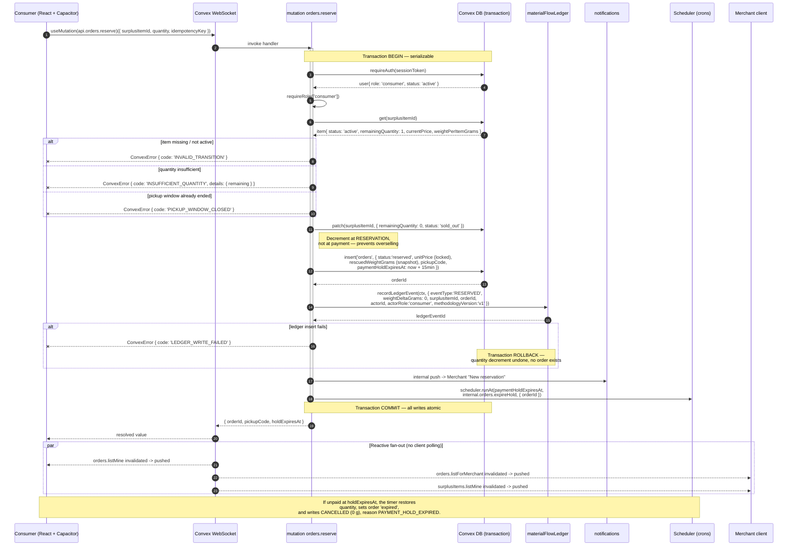

# Cirquo API Reference — Overview & Conventions

| Field | Value |
|---|---|
| **Document** | `docs/api/API.md` |
| **Title** | Cirquo Backend API — Overview, Conventions & Error Model |
| **Platform** | Cirquo — Circular Food Recovery Platform |
| **Event** | DSDC ANFORCOM 2026 |
| **Market** | Indonesia (Semarang) — IDR, WIB (UTC+7) |
| **Backend runtime** | Convex (TypeScript, reactive document database) |
| **Transport** | Convex WebSocket RPC (not REST) |
| **HTTP surface** | Exactly one endpoint: the Midtrans payment webhook (`httpAction`) |
| **Payments** | Midtrans Snap — Sandbox |
| **Maps** | Mapbox GL JS (client-side rendering only; no server geo index) |
| **Units** | Weight = integer **grams** · Money = integer **IDR** · Time = integer **epoch milliseconds UTC** |
| **Methodology version** | `impact-v1` (stamped on every ledger event) |
| **Status legend** | ✅ source available · 🧪 UAT required · 📋 planned |
| **Audience** | Backend engineers, frontend engineers, judges auditing the material chain |

---

## 1. What this document is

This is the entry point for every Cirquo backend function. It defines:

- why Cirquo's API is **not** a REST API, and why documenting it as one would be actively misleading;
- a REST-equivalence table for readers who arrive expecting `POST /api/orders`;
- the complete function index across all four actor roles;
- naming, argument, and return conventions;
- the canonical error-code catalogue and how the client maps codes to user-facing toasts;
- reactivity and subscription semantics;
- idempotency, rate limiting, and pagination;
- the one real HTTP endpoint — the Midtrans webhook — documented in full;
- versioning, deprecation, and local testing.

Per-role function documentation lives in five sibling files:

| File | Covers |
|---|---|
| [`API_AUTH.md`](./API_AUTH.md) | Registration, login, sessions, guards, profile creation, verification gate |
| [`API_CONSUMER.md`](./API_CONSUMER.md) | Discovery, reservation, payment, pickup code, disputes, consumer impact |
| [`API_MERCHANT.md`](./API_MERCHANT.md) | Rescue Item lifecycle, Dynamic Rescue Pricing, pickup confirmation, no-shows |
| [`API_PROCESSOR.md`](./API_PROCESSOR.md) | Circular Routing queue, accept/decline, measured intake, processed outcome |
| [`API_ADMIN.md`](./API_ADMIN.md) | Verification, moderation, ledger audit, disputes, integrity checks, system health |

> **Source boundary — 2026-08-29.** M1–M5 exports are implemented in source.
> M3–M5 still require deployment/Sandbox UAT; sections labelled 📋 are target
> contracts for later milestones. See
> [IMPLEMENTATION_STATUS.md](../project/IMPLEMENTATION_STATUS.md).

---

## 2. Cirquo in one paragraph (context for API readers)

Cirquo is a **Circular Food Recovery Platform**, not a food delivery app. There is **no delivery** — consumers collect in person from the merchant. A Merchant lists surplus as a **Rescue Item**. A Consumer finds it on a Mapbox map, reserves it, pays through Midtrans Sandbox, and collects it using a **pickup code**; that outcome is **Rescued**. If the item goes unclaimed or expires, **Circular Routing** matches it to a verified **Organic Processor** (BSF larvae, compost, biogas, or animal feed). The processor accepts the offer, logs a **measured** intake weight, then logs an outcome; the converted mass is **Recovered** and the unconvertible remainder is **Residual**. Every single state change writes an immutable event to the **Material Flow Ledger**, and **every impact metric on the platform is derived from that ledger** — never from a counter column.

The API's job is therefore not merely CRUD. Its job is to guarantee that **no gram of material changes state without a corresponding ledger entry committed in the same transaction**.

---

## 3. This is not REST — and why saying otherwise would be misleading

### 3.1 The mismatch

A REST document promises a specific mental model:

- resources addressable by URL path;
- HTTP verbs mapping to intent;
- HTTP status codes carrying semantics;
- request/response as a discrete, stateless round trip;
- polling or a separate channel for freshness.

Convex satisfies **none** of these. The client does not build URLs, does not choose verbs, does not read status codes, and does not poll. It calls typed TypeScript functions over a persistent WebSocket, and read functions **stay subscribed**. If we published `POST /api/orders` in this repository, a frontend engineer would write `fetch()` calls that cannot work, and a judge auditing our architecture would conclude we bolted a serverless database onto a REST design we never built. Both outcomes are worse than the mild inconvenience of learning four function kinds.

So: this document describes **function signatures with `v.*` validators**, not routes.

### 3.2 The five function kinds

| Kind | Callable from client | Transactional | Can write DB | Can call external network | Typical Cirquo use |
|---|---|---|---|---|---|
| `query` | Yes (via `useQuery`, auto-subscribing) | Read-consistent snapshot | No | No | Map listings, order list, ledger audit, impact summaries |
| `mutation` | Yes (via `useMutation`) | **Yes — all-or-nothing** | Yes | No | Reserve, confirm pickup, accept batch, log intake, verify merchant |
| `action` | Yes (via `useAction`) | **No** | **No** — must call a mutation | Yes | Midtrans Snap token creation, email dispatch |
| `internalQuery` / `internalMutation` / `internalAction` | **No** | Same as public counterpart | Same | Same | Routing engine, cron bodies, webhook-invoked writes |
| `httpAction` | Via raw HTTP | No | No — calls internal mutations | Yes | **Only** the Midtrans webhook |
| `crons` | N/A (scheduler) | N/A | Via internal mutations | Via internal actions | Payment-hold expiry, listing expiry, routing sweep, offer TTL |

### 3.3 Why the transactional boundary matters more than the transport

The single most important architectural fact in Cirquo:

> A Convex `mutation` runs as a serializable transaction across **all** tables. Either every write commits or none do.

That is what makes the Material Flow Ledger trustworthy. `orders.reserve` decrements `surplusItems.remainingQuantity`, inserts an `orders` row, **and** appends a `RESERVED` ledger event. If the ledger insert throws, the quantity decrement is rolled back too. There is no window in which inventory moved but the ledger did not record it.

This is also why the ledger write must **never** happen in an `action`. Actions are not transactional; a crash between the external call and the mutation would leave the ledger permanently short an event. The rule is absolute:

```ts
// ✅ correct — ledger written inside the same transaction as the state change
export const reserve = mutation({
  args: { /* ... */ },
  handler: async (ctx, args) => {
    // ... validation, quantity decrement, order insert ...
    await recordLedgerEvent(ctx, { /* RESERVED */ })   // same transaction
    return orderId
  },
})

// ❌ forbidden — non-transactional, ledger can silently diverge
export const reserveViaAction = action({ /* ... */ })

// ❌ forbidden — client can lie about, skip, or replay the event
await convex.mutation(api.ledger.append, { eventType: 'RESCUED' })
```

### 3.4 Reactivity replaces polling

`useQuery` is not "fetch once". Convex tracks which documents and index ranges a query read, and pushes a fresh result to every subscribed client whenever a committed mutation touches that read set. The consequences for API design:

- there is **no** `GET /orders?since=...` delta endpoint and none is needed;
- there is **no** cache-invalidation header story — invalidation is server-computed;
- a Merchant's `orders.listForMerchant` panel updates the instant a Consumer's `orders.reserve` commits, with no code on either side coordinating that;
- queries must be **cheap and deterministic**, because they may re-run frequently. No `Math.random()`, no `Date.now()` used as a filter boundary in a way that makes the read set unbounded.

### 3.5 What Convex genuinely costs us

Honesty about trade-offs, since a judge will ask:

| Trade-off | Impact on Cirquo | Mitigation |
|---|---|---|
| **No geospatial index.** Convex has no `GEO` index or `ST_DWithin`. | `discovery.listNearby` cannot push distance filtering into the database. | Fetch `active` items via the `by_status` index, then filter with Haversine in application code, bounded by city. Documented explicitly in [`API_CONSUMER.md`](./API_CONSUMER.md). Acceptable at hackathon and early-city scale (hundreds of active items); a real geohash prefix column is the migration path. |
| **No SQL joins.** | Listing a consumer's orders with merchant names requires N follow-up `ctx.db.get` calls. | Convex document reads by `Id` are point lookups and cheap; we batch with `Promise.all` and keep fan-out bounded by page size. |
| **Actions cannot write.** | Midtrans flows need an extra hop. | `payments.createTransaction` (action) → Midtrans → `internal.payments.savePendingTransaction` (mutation). Explicit and auditable. |
| **Vendor coupling.** | Migrating off Convex means rewriting the function layer. | The domain rules live in pure helpers (`recordLedgerEvent`, `requireRole`, routing eligibility predicates) that take `ctx` as a parameter and are portable. |
| **No native cursor SQL.** | Pagination is Convex-flavoured. | We use `paginationOptsValidator` on list queries; see §8. |

---

## 4. REST-equivalence mapping

For readers whose mental model is HTTP. **These routes do not exist.** The table is a translation aid only.

| If you expected… | Cirquo actually uses | Kind | Notes |
|---|---|---|---|
| `POST /api/auth/register` | `auth.register` | action | Role chosen at registration; `admin` rejected |
| `POST /api/auth/login` | `auth.login` | action | Returns session token; rate limited |
| `POST /api/auth/logout` | `auth.logout` | mutation | Deletes the `sessions` row |
| `GET /api/me` | `auth.getCurrentUser` | query | Reactive — reflects suspension instantly |
| `GET /api/listings?lat=&lng=` | `discovery.listNearby` | query | Haversine in app code, not a geo index |
| `GET /api/listings/:id` | `discovery.getListing` | query | `Id<'surplusItems'>` is opaque, not a slug |
| `POST /api/listings` | `surplusItems.create` | mutation | Merchant must be `verified` |
| `PATCH /api/listings/:id` | `surplusItems.update` | mutation | Rejected once any quantity is reserved |
| `DELETE /api/listings/:id` | `surplusItems.cancel` | mutation | Only if untouched; never a hard delete |
| `POST /api/orders` | `orders.reserve` | mutation | Decrements quantity **at reservation** |
| `GET /api/orders` | `orders.listMine` | query | Auto-updating; no polling |
| `POST /api/orders/:id/pay` | `payments.createTransaction` | **action** | Must be an action — calls Midtrans |
| `POST /api/orders/:id/pickup` | `orders.confirmPickup` | mutation | 📋 M4: Merchant-side; verifies pickup code + window |
| `DELETE /api/orders/:id` | `orders.cancel` | mutation | 📋 Target status transition, not deletion |
| `GET /api/recovery-batches` | `recoveryBatches.listQueue` | query | Processor-scoped, eligibility-filtered |
| `POST /api/recovery-batches/:id/accept` | `recoveryBatches.accept` | mutation | Capacity + eligibility re-checked server-side |
| `POST /api/recovery-batches/:id/intake` | `recoveryBatches.logIntake` | mutation | **Measured** weight, processor only |
| `POST /api/recovery-batches/:id/outcome` | `recoveryBatches.logOutcome` | mutation | Emits `PROCESSED`; splits Recovered/Residual |
| `GET /api/impact` | `impact.getPlatformImpact` | query | Derived from ledger, never a counter |
| `GET /api/admin/users` | `admin.listUsers` | query | Paginated |
| `POST /api/admin/merchants/:id/verify` | `admin.verifyMerchant` | mutation | Audited |
| `POST /api/webhooks/midtrans` | **`POST /midtrans/webhook`** | `httpAction` | ✅ **This one is a real HTTP endpoint** — see §11 |
| `GET /api/health` | `admin.getSystemHealth` | query | Not a load-balancer probe |

Only the Midtrans webhook row describes an address you can actually `curl`.

---

## 5. Complete function index

Status: ✅ = exists in `convex/` today · 📋 = specified, not yet implemented.

The table below is checked against `convex/` as of 2026-08-29. Function
sections in the role documents marked 📋 remain target contracts; do not call
them until the matching export exists in source.

### 5.1 Authentication & profiles → [`API_AUTH.md`](./API_AUTH.md)

| Function | Kind | Auth | Status |
|---|---|---|---|
| `auth.register` | action | Public | ✅ |
| `auth.login` | action | Public | ✅ |
| `auth.logout` | mutation | Any session | ✅ |
| `auth.getCurrentUser` | query | Any session | ✅ |
| `auth.refreshSession` | mutation | Any session | 📋 |
| `auth.requestPasswordReset` | action | Public | 📋 |
| `auth.resetPassword` | mutation | Reset token | 📋 |
| `auth.changePassword` | mutation | Any session | 📋 |
| `auth.getVerificationStatus` | query | Merchant/Processor | 📋 |
| `users.getByEmail` | query | Internal-facing | ✅ |
| `merchants.createProfile` | mutation | Merchant | ✅ |
| `merchants.getByOwner` | query | Merchant | ✅ |
| `processors.createProfile` | mutation | Processor | ✅ |
| `profiles.update` | mutation | Owner | 📋 |

### 5.2 Consumer → [`API_CONSUMER.md`](./API_CONSUMER.md)

| Function | Kind | Auth | Status |
|---|---|---|---|
| `discovery.listNearby` | query | Public | ✅ |
| `discovery.getListing` | query | Public | ✅ |
| `discovery.getFilters` | query | Public | 📋 |
| `orders.reserve` | mutation | Consumer | ✅ |
| `payments.createTransaction` | **action** | Consumer (owner) | ✅ |
| `orders.listMine` | query | Consumer | ✅ |
| `orders.listByUser` | internalQuery | Internal only | ✅ |
| `orders.get` | query | Consumer (owner) | ✅ |
| `orders.cancel` | mutation | Consumer (owner) | 📋 |
| `orders.getPickupCode` | query | Consumer (owner) | 📋 |
| `impact.getConsumerSummary` | query | Consumer | 📋 |
| `notifications.listMine` | query | Any session | 📋 |
| `notifications.markRead` | mutation | Owner | 📋 |
| `disputes.raise` | mutation | Consumer/Merchant | 📋 |
| `ratings.submit` | mutation | Consumer (owner) | 📋 (priority C) |

### 5.3 Merchant → [`API_MERCHANT.md`](./API_MERCHANT.md)

| Function | Kind | Auth | Status |
|---|---|---|---|
| `surplusItems.create` | mutation | Merchant (verified) | ✅ |
| `surplusItems.suggestPrice` | query | Merchant (verified) | 📋 |
| `surplusItems.update` | mutation | Merchant (owner) | ✅ |
| `surplusItems.publish` | mutation | Merchant (owner) | ✅ |
| `surplusItems.cancel` | mutation | Merchant (owner) | ✅ |
| `surplusItems.markProcessingOnly` | mutation | Merchant (owner) | 📋 |
| `surplusItems.listMine` | query | Merchant | ✅ |
| `surplusItems.getMine` | query | Merchant (verified, owner) | ✅ |
| `surplusItems.listByStatus` | query | Internal/Admin | ✅ |
| `surplusItems.get` | query | Merchant (owner) | 📋 |
| `orders.listForMerchant` | query | Merchant (verified) | ✅ |
| `orders.confirmPickup` | mutation | Merchant (verified, owner) | ✅ |
| `orders.reportNoShow` | mutation | Merchant (owner) | 📋 |
| `impact.getMerchantSummary` | query | Merchant | 📋 |
| `merchants.getMine` | query | Merchant | 📋 |
| `merchants.updateProfile` | mutation | Merchant (owner) | 📋 |
| `recoveryBatches.listForMerchant` | query | Merchant (verified, owner) | ✅ |

### 5.4 Organic Processor → [`API_PROCESSOR.md`](./API_PROCESSOR.md)

| Function | Kind | Auth | Status |
|---|---|---|---|
| `recoveryBatches.listQueue` | query | Processor (verified) | 📋 |
| `recoveryBatches.listByStatus` | query | Internal/Admin | ✅ |
| `recoveryBatches.get` | query | Processor (offered/assigned) | 📋 |
| `recoveryBatches.accept` | mutation | Processor (verified) | 📋 |
| `recoveryBatches.decline` | mutation | Processor (verified) | 📋 |
| `recoveryBatches.logIntake` | mutation | Processor (assigned) | 📋 |
| `recoveryBatches.logOutcome` | mutation | Processor (assigned) | 📋 |
| `processors.getMine` | query | Processor | 📋 |
| `processors.updateProfile` | mutation | Processor (owner) | 📋 |
| `processors.updateCapacity` | mutation | Processor (owner) | 📋 |
| `impact.getProcessorSummary` | query | Processor | 📋 |

### 5.5 Admin → [`API_ADMIN.md`](./API_ADMIN.md)

| Function | Kind | Auth | Status |
|---|---|---|---|
| `admin.listUsers` | query | Admin | 📋 |
| `admin.listPendingVerifications` | query | Admin | 📋 |
| `admin.verifyMerchant` | mutation | Admin | 📋 |
| `admin.verifyProcessor` | mutation | Admin | 📋 |
| `admin.rejectAccount` | mutation | Admin | 📋 |
| `admin.suspendUser` | mutation | Admin | 📋 |
| `admin.moderateListing` | mutation | Admin | 📋 |
| `admin.listReportedListings` | query | Admin | 📋 |
| `admin.getItemLedger` | query | Admin | 📋 |
| `admin.searchLedger` | query | Admin | 📋 |
| `admin.getPlatformImpact` | query | Admin | 📋 |
| `admin.listDisputes` | query | Admin | 📋 |
| `admin.resolveDispute` | mutation | Admin | 📋 |
| `admin.rerouteBatch` | mutation | Admin | 📋 |
| `admin.checkWeightConservation` | query | Admin | 📋 |
| `admin.checkLedgerCompleteness` | query | Admin | 📋 |
| `admin.getSystemHealth` | query | Admin | 📋 |
| `admin.listCrons` | query | Admin | 📋 |
| `impact.getPlaceholderSummary` | query | Public (demo) | ✅ |

### 5.6 Internal & scheduled (never client-callable)

| Function | Kind | Trigger | Status |
|---|---|---|---|
| `internal.routing.findEligibleProcessors` | internalQuery | Called by routing engine | 📋 |
| `internal.routing.offerBatch` | internalMutation | Cron / cascade | 📋 |
| `internal.routing.expireOffers` | internalMutation | Cron, every 15 min | 📋 |
| `internal.orders.expireHold` | internalMutation | Per-reservation `runAt` timer | ✅ |
| `internal.surplusItems.expireListings` | internalMutation | Cron, every 5 min | 📋 |
| `internal.payments.savePendingTransaction` | internalMutation | From `payments.createTransaction` | ✅ |
| `POST /midtrans/webhook` | `httpAction` | Midtrans Sandbox callback | 🧪 |
| `internal.impact.snapshotDaily` | internalMutation | Cron, daily 00:05 WIB | 📋 |
| `internal.notifications.push` | internalMutation | Called by many mutations | 📋 |

---

## 6. Naming conventions

| Rule | Example | Rationale |
|---|---|---|
| Namespace = Convex file name; function = export name | `orders.reserve` → `convex/orders.ts` export `reserve` | Path is the API; no router config to drift |
| Namespaces are **plural nouns** for entity tables | `surplusItems`, `recoveryBatches`, `notifications` | Matches table names in [`../domain/DATABASE.md`](../domain/DATABASE.md) |
| Namespaces are **singular domain nouns** for capability groups | `auth`, `discovery`, `impact`, `admin` | These are not tables |
| Queries read as noun phrases | `listNearby`, `getPickupCode`, `getMerchantSummary` | Reads never imply mutation |
| Mutations read as imperative verbs | `reserve`, `confirmPickup`, `logIntake`, `verifyMerchant` | Names carry intent, since HTTP verbs do not |
| `listX` returns an array or page; `getX` returns one document or `null` | `orders.get` vs `orders.listMine` | Predictable nullability |
| `getMine` / `listMine` = implicitly scoped to the caller | `merchants.getMine` | No caller-supplied id means no IDOR surface |
| Ledger event types are `SCREAMING_SNAKE_CASE` | `RESCUED`, `INTAKE_ACCEPTED` | Visually distinct from statuses in code and logs |
| Statuses are `lower_snake_case` | `recovery_pending`, `picked_up` | Matches schema enums exactly |
| Error codes are `SCREAMING_SNAKE_CASE` | `PICKUP_WINDOW_CLOSED` | Stable contract for the client switch |
| Internal functions live under `internal.*` | `internal.routing.offerBatch` | Compiler-enforced non-exposure |

---

## 7. Argument & return conventions

### 7.1 Units — non-negotiable

| Domain | Type | Unit | Example | Never |
|---|---|---|---|---|
| Weight | `v.int64()` / `number` integer | **grams** | `2500` = 2.5 kg | Floats, kilograms, "2.5kg" strings |
| Money | integer | **IDR** | `15000` = Rp 15.000 | Decimals, cents, `Rp` prefix, floats |
| Time | integer | **epoch ms UTC** | `1771200000000` | ISO strings, WIB-local, `Date` objects |
| Distance | integer | **metres** | `5000` = 5 km | Kilometres, degrees |
| Coordinates | `v.number()` | decimal degrees WGS84 | `-6.9932`, `110.4203` | DMS strings |

Floating-point money and weight is how impact numbers stop reconciling. Every value that must sum to zero in `admin.checkWeightConservation` is an integer for exactly that reason. IDR has no minor unit in practice, so integer rupiah is both correct and simple. Times are stored UTC and formatted to WIB only at the presentation layer.

### 7.2 Identifiers

`Id<'tableName'>` is an **opaque string**. Clients must treat it as a token:

- do not parse it, slice it, or infer creation order from it;
- do not build URLs by concatenating fragments of it;
- validate with `v.id('surplusItems')` — Convex verifies the id actually belongs to that table, which removes a whole class of cross-table confusion bugs;
- never expose an `Id` for a document the caller is not authorised to read, since ids are capability-shaped in careless designs. Our guards check ownership on read, not just on write.

### 7.3 Optional vs nullable

| Convention | Meaning |
|---|---|
| `v.optional(v.string())` in args | Caller may omit the field entirely |
| `v.optional(...)` in schema | Field may be absent on the document |
| Query returns `null` | Document does not exist **or** caller may not see it — deliberately indistinguishable, to avoid existence oracles |
| Query returns `[]` | Query is valid and correctly matched nothing |

### 7.4 Return shape rules

- Mutations return the **minimum** needed to continue the flow — usually a new `Id` or a small object such as `{ orderId, pickupCode, holdExpiresAt }`. They never return the whole document, because the client is already subscribed to it via a query and will receive the update reactively.
- Queries return **denormalised view models**, not raw rows, when the UI needs joined data. `discovery.listNearby` returns items enriched with merchant name, coordinates, and computed `distanceMeters`.
- Every list query returns a stable sort order. Convex index order is deterministic; we never rely on insertion order without an index.
- No function returns `passwordHash`, a session `token` belonging to someone else, or a `pickupCode` to a non-owner. Redaction happens **server-side**, never by omission in the UI.

### 7.5 Timestamps present on returns

| Field | Meaning |
|---|---|
| `createdAt` | Row insert time |
| `publishedAt` | Rescue Item became `active` and publicly discoverable |
| `paymentHoldExpiresAt` | Reservation auto-expires at this instant if unpaid (15 min) |
| `paidAt` | Midtrans settlement confirmed via webhook |
| `pickedUpAt` | Merchant confirmed pickup → **Rescued** |
| `offerExpiresAt` | Routing offer TTL (6 h) |
| `acceptedAt` / `completedAt` | Processor accepted / logged outcome |
| `occurredAt` | Ledger event time — the canonical time axis for all impact metrics |

---

## 8. Pagination

Cirquo uses Convex's built-in cursor pagination for any list that can exceed roughly 50 rows.

```ts
import { paginationOptsValidator } from 'convex/server'
import { query } from './_generated/server'
import { v } from 'convex/values'

export const listMine = query({
  args: {
    sessionToken: v.string(),
    status: v.optional(v.string()),
    paginationOpts: paginationOptsValidator,
  },
  handler: async (ctx, args) => {
    const user = await requireAuth(ctx, args.sessionToken)

    return await ctx.db
      .query('orders')
      .withIndex('by_user', (q) => q.eq('userId', user._id))
      .order('desc')
      .paginate(args.paginationOpts)
  },
})
```

| Aspect | Behaviour |
|---|---|
| Request | `{ numItems: 20, cursor: null }` for the first page |
| Response | `{ page: T[], isDone: boolean, continueCursor: string }` |
| Client hook | `usePaginatedQuery(api.orders.listMine, { sessionToken }, { initialNumItems: 20 })` |
| Reactivity | Loaded pages stay subscribed; an update to a row on page 1 pushes down while page 2 is open |
| Default page size | 20 |
| Maximum accepted `numItems` | 100 — larger values are clamped server-side, never rejected |
| Which lists paginate | `orders.listMine`, `orders.listForMerchant`, `surplusItems.listMine`, `recoveryBatches.listQueue`, `notifications.listMine`, `admin.listUsers`, `admin.searchLedger`, `admin.listDisputes` |
| Which lists do **not** paginate | `discovery.listNearby` (bounded by radius + city + `active` status, hard-capped at 200 results), `discovery.getFilters`, all `impact.*` summaries, `admin.getItemLedger` (a single item's history is inherently small) |

`discovery.listNearby` is deliberately unpaginated: it renders a map viewport, and paginating map pins produces a worse experience than capping the result set. The cap is enforced server-side after distance sorting, so the nearest 200 are always the ones returned.

---

## 9. Error model

### 9.1 Throwing errors

All application errors are thrown as `ConvexError` with a structured payload. Never throw bare `Error` in a public function — bare errors are surfaced to the client as opaque server failures and cannot be branched on.

```ts
import { ConvexError } from 'convex/values'

export type CirquoErrorData = {
  code: string          // stable, SCREAMING_SNAKE_CASE — the client switches on this
  message: string       // English, developer-facing; the client does NOT display this raw
  field?: string        // offending argument, for form-level highlighting
  details?: Record<string, string | number | boolean>
}

export function fail(data: CirquoErrorData): never {
  throw new ConvexError(data)
}

// usage
if (item.remainingQuantity < args.quantity) {
  fail({
    code: 'INSUFFICIENT_QUANTITY',
    message: 'Requested quantity exceeds remaining quantity.',
    field: 'quantity',
    details: { requested: args.quantity, remaining: item.remainingQuantity },
  })
}
```

Because `ConvexError` is thrown **inside** a mutation, the transaction aborts and every write in that mutation rolls back — including any partial ledger write. This is why validation ordering (§9.4) is a correctness concern and not merely a UX one.

### 9.2 Canonical error catalogue

"HTTP equiv." is the status a REST API would have returned. Convex sends no status code; the column exists to orient readers and to guide logging severity.

| Code | HTTP equiv. | Meaning | Thrown by | Client handling |
|---|---|---|---|---|
| `AUTH_REQUIRED` | 401 | No session token, malformed token, or expired session | Every guarded function | Clear stored token, redirect to `/login`, toast "Please sign in again." |
| `SESSION_EXPIRED` | 401 | Token matched a `sessions` row whose `expiresAt` has passed | `requireAuth` | Same as above; attempt `auth.refreshSession` once first |
| `FORBIDDEN` | 403 | Authenticated but wrong role, or not the owner of the resource | `requireRole`, `requireOwnership` | Toast "You do not have permission to do that."; do not retry |
| `NOT_VERIFIED` | 403 | Merchant/Processor account is `pending` or `rejected` | `surplusItems.create`, `recoveryBatches.accept`, `logIntake` | Route to the verification-pending screen; explain what is waiting on Admin |
| `ACCOUNT_SUSPENDED` | 403 | `users.status = 'suspended'` | `requireAuth` | Force logout, show a support-contact screen |
| `NOT_FOUND` | 404 | Document does not exist, or caller may not see it | Any `get`/`update` | Toast "That item is no longer available."; navigate back to the list |
| `VALIDATION_FAILED` | 422 | Argument failed a domain rule beyond validator type-checking | Most mutations | Highlight `field`; keep the form open with values preserved |
| `INVALID_TRANSITION` | 409 | Requested state change is illegal from the current status | Every lifecycle mutation | Toast "This item has already moved on."; queries refresh reactively |
| `INSUFFICIENT_QUANTITY` | 409 | Fewer units remain than requested | `orders.reserve` | Toast with remaining count; reactive query already shows the new number |
| `ALREADY_RESERVED` | 409 | Edit/cancel attempted on an item with reservations | `surplusItems.update`, `surplusItems.cancel` | Disable edit UI; explain the edit-lock rule |
| `PRICE_BELOW_FLOOR` | 422 | `currentPrice < floorPrice` | `surplusItems.create`, `update` | Highlight the price field; show the floor value from `details` |
| `PRICE_ABOVE_ORIGINAL` | 422 | `currentPrice >= originalPrice` | `surplusItems.create`, `update` | Same; a Rescue Item must be discounted |
| `PICKUP_WINDOW_CLOSED` | 409 | `now` is outside `[pickupStartAt, pickupEndAt]` | `orders.confirmPickup` | Toast; offer the Merchant the "report no-show" path or Admin override |
| `INVALID_PICKUP_CODE` | 403 | Code does not match the order | `orders.confirmPickup` | Toast "Incorrect pickup code."; **rate limited** after 5 failures per order |
| `PAYMENT_HOLD_EXPIRED` | 409 | 15-minute hold elapsed before payment | `payments.createTransaction`, webhook apply | Toast "Your reservation expired."; return to listing |
| `PAYMENT_FAILED` | 402 | Midtrans returned a failure status | webhook apply | Toast; order returns to a cancellable state |
| `CAPACITY_EXCEEDED` | 409 | Batch weight exceeds the processor's remaining daily headroom | `recoveryBatches.accept` | Toast with remaining capacity; leave the batch in the queue for others |
| `MATERIAL_TYPE_REJECTED` | 422 | `materialType` not in `acceptedMaterialTypes` | `recoveryBatches.accept` | Hide the batch from that processor's queue entirely |
| `OUT_OF_SERVICE_RADIUS` | 422 | Distance exceeds `maxPickupRadiusMeters` | `recoveryBatches.accept` | Same as above |
| `OFFER_EXPIRED` | 409 | Offer TTL (6 h) elapsed | `recoveryBatches.accept` | Toast; batch has already been re-offered or marked `unroutable` |
| `WEIGHT_EXCEEDS_ACCEPTED` | 422 | `residualWeightGrams > acceptedWeightGrams`, or outputs exceed intake | `recoveryBatches.logOutcome` | Highlight the field; show the accepted intake as the ceiling |
| `INTAKE_NOT_LOGGED` | 409 | Outcome logged before intake | `recoveryBatches.logOutcome` | Route to the intake form first |
| `RATE_LIMITED` | 429 | Too many attempts in the window | `auth.login`, `auth.requestPasswordReset`, `orders.confirmPickup`, `orders.reserve` | Toast with `details.retryAfterMs`; disable the button until then |
| `IDEMPOTENCY_CONFLICT` | 409 | Same idempotency key reused with different arguments | `orders.reserve`, webhook | Log loudly; this signals a client bug, not user error |
| `LEDGER_WRITE_FAILED` | 500 | `recordLedgerEvent` could not append | Any state-changing mutation | Generic error toast; **the entire mutation rolled back**, so no state diverged |
| `SIGNATURE_INVALID` | 401 | Midtrans `signature_key` mismatch | webhook `httpAction` | N/A — no browser client; returns HTTP 401 and logs a security event |
| `INTERNAL_ERROR` | 500 | Unhandled server fault | Anywhere | Generic toast; report id logged for triage |

### 9.3 Client mapping to Sonner toasts

```ts
// src/lib/errors.ts
import { ConvexError } from 'convex/values'
import { toast } from 'sonner'

const MESSAGES: Record<string, string> = {
  AUTH_REQUIRED: 'Please sign in to continue.',
  SESSION_EXPIRED: 'Your session expired. Please sign in again.',
  FORBIDDEN: 'You do not have permission to do that.',
  NOT_VERIFIED: 'Your account is awaiting verification.',
  ACCOUNT_SUSPENDED: 'This account has been suspended.',
  NOT_FOUND: 'That item is no longer available.',
  VALIDATION_FAILED: 'Please check the highlighted fields.',
  INVALID_TRANSITION: 'This item has already moved on.',
  INSUFFICIENT_QUANTITY: 'Someone just reserved the last one.',
  ALREADY_RESERVED: 'This listing is locked because it already has reservations.',
  PRICE_BELOW_FLOOR: 'Price cannot go below your floor price.',
  PRICE_ABOVE_ORIGINAL: 'A Rescue Item must be priced below the original price.',
  PICKUP_WINDOW_CLOSED: 'The pickup window for this order is closed.',
  INVALID_PICKUP_CODE: 'Incorrect pickup code. Please check with the customer.',
  PAYMENT_HOLD_EXPIRED: 'Your 15-minute reservation hold expired.',
  PAYMENT_FAILED: 'Payment was not completed.',
  CAPACITY_EXCEEDED: 'This batch exceeds your remaining capacity today.',
  MATERIAL_TYPE_REJECTED: 'Your facility does not accept this material type.',
  OUT_OF_SERVICE_RADIUS: 'This pickup is outside your service radius.',
  OFFER_EXPIRED: 'This offer expired and has been re-routed.',
  WEIGHT_EXCEEDS_ACCEPTED: 'Logged weight cannot exceed the intake weight.',
  INTAKE_NOT_LOGGED: 'Log the measured intake before recording the outcome.',
  RATE_LIMITED: 'Too many attempts. Please wait a moment.',
  IDEMPOTENCY_CONFLICT: 'That request was already processed.',
  LEDGER_WRITE_FAILED: 'Something went wrong. Nothing was changed.',
  INTERNAL_ERROR: 'Something went wrong on our side.',
}

export function handleError(err: unknown): string {
  if (err instanceof ConvexError) {
    const data = err.data as { code?: string; details?: Record<string, unknown> }
    const code = data?.code ?? 'INTERNAL_ERROR'
    let text = MESSAGES[code] ?? MESSAGES.INTERNAL_ERROR

    if (code === 'INSUFFICIENT_QUANTITY' && typeof data.details?.remaining === 'number') {
      text = `Only ${data.details.remaining} left. Please lower your quantity.`
    }
    if (code === 'RATE_LIMITED' && typeof data.details?.retryAfterMs === 'number') {
      const s = Math.ceil(data.details.retryAfterMs / 1000)
      text = `Too many attempts. Try again in ${s}s.`
    }

    toast.error(text)
    return code
  }

  toast.error(MESSAGES.INTERNAL_ERROR)
  return 'INTERNAL_ERROR'
}
```

Two deliberate choices:

1. **The server `message` is never rendered.** It is developer-facing English for logs. User-facing copy lives in the client map so it can be localised to Bahasa Indonesia without touching backend code.
2. **`details` is structured, not interpolated server-side.** The client composes the sentence, which keeps the backend free of presentation concerns.

### 9.4 Validation ordering — always the same

Every mutation validates in this order. Cheap and security-relevant checks come first so we never leak information or burn database reads on a request that was doomed:

1. **Authentication** — `requireAuth` → `AUTH_REQUIRED` / `SESSION_EXPIRED` / `ACCOUNT_SUSPENDED`
2. **Role** — `requireRole` → `FORBIDDEN`
3. **Existence** — `ctx.db.get` → `NOT_FOUND`
4. **Ownership** — `requireOwnership` → `FORBIDDEN` (never `NOT_FOUND`; the caller already proved the doc exists only if they own it)
5. **Verification gate** — `NOT_VERIFIED`
6. **State machine** — `INVALID_TRANSITION`
7. **Domain invariants** — `PRICE_BELOW_FLOOR`, `INSUFFICIENT_QUANTITY`, `CAPACITY_EXCEEDED`, …
8. **Time windows** — `PICKUP_WINDOW_CLOSED`, `PAYMENT_HOLD_EXPIRED`, `OFFER_EXPIRED`
9. **Rate limit** — `RATE_LIMITED` (after identity is known, so limits can be per-user)
10. **Writes + `recordLedgerEvent`** — last, together, atomically

---

## 10. Reactivity, subscriptions, and optimistic updates

### 10.1 What invalidates a query

Convex records the **read set** of each query execution: the specific documents fetched by id, and the index ranges scanned. When a mutation commits, Convex determines which read sets intersect the written documents and re-runs exactly those subscriptions.

| Mutation | Invalidates | Visible effect |
|---|---|---|
| `orders.reserve` | `discovery.listNearby`, `discovery.getListing`, `orders.listMine`, `orders.listForMerchant` | Every open map instantly shows the decremented quantity |
| `orders.confirmPickup` | `orders.get`, `orders.listForMerchant`, `impact.getConsumerSummary`, `impact.getMerchantSummary`, `admin.getItemLedger` | Impact counters tick up without any refetch code |
| `recoveryBatches.accept` | `recoveryBatches.listQueue` for **every** processor that was offered the batch | The batch disappears from competing queues immediately |
| `recoveryBatches.logOutcome` | All `impact.*` queries, `admin.getPlatformImpact` | Circularity rate recomputes live during the demo |
| `admin.verifyMerchant` | `auth.getVerificationStatus`, `merchants.getMine` | The Merchant's blocked "Create Listing" button unlocks without reload |

### 10.2 Consequences for query design

- **Keep read sets narrow.** A query that does `ctx.db.query('surplusItems').collect()` with no index reads the whole table and will be invalidated by *any* listing write anywhere on the platform. Always use `withIndex`.
- **Never call `Date.now()` in a way that changes the read set on every run.** Filtering `pickupEndAt > Date.now()` in application code after an indexed fetch is fine; using it as an index bound creates constant churn. Expiry is driven by crons that write a status change, and the status change is what invalidates.
- **Queries must be pure.** No randomness, no external calls, no writes. Convex may re-execute a query many times.

### 10.3 Optimistic updates

Use them only where the outcome is near-certain and rollback is cheap:

| Function | Optimistic? | Why |
|---|---|---|
| `notifications.markRead` | ✅ Yes | Trivially reversible, zero business risk |
| `orders.cancel` | ✅ Yes | Terminal for the user; a failure just restores the card |
| `orders.reserve` | ❌ **No** | Can genuinely lose a race for the last unit. Showing "Reserved!" then reverting is worse than 200 ms of a spinner. |
| `orders.confirmPickup` | ❌ **No** | Emits a `RESCUED` ledger event; the Merchant must see the real, committed result before handing over food |
| `recoveryBatches.accept` | ❌ **No** | Competitive — another processor may have taken it |
| `recoveryBatches.logIntake` / `logOutcome` | ❌ **No** | Authoritative measured data; must never appear recorded when it is not |

```ts
const markRead = useMutation(api.notifications.markRead).withOptimisticUpdate(
  (localStore, args) => {
    const current = localStore.getQuery(api.notifications.listMine, {
      sessionToken: args.sessionToken,
    })
    if (current === undefined) return
    localStore.setQuery(
      api.notifications.listMine,
      { sessionToken: args.sessionToken },
      current.map((n) => (n._id === args.notificationId ? { ...n, read: true } : n)),
    )
  },
)
```

The rule: **never apply an optimistic update to anything that writes a ledger event.** The ledger is the source of truth for impact claims; the UI must not display an outcome the ledger has not yet accepted.

---

## 11. The only real HTTP endpoint — Midtrans payment webhook

### 11.1 Address and registration

| Property | Value |
|---|---|
| **Path** | `POST /midtrans/webhook` |
| **Full URL** | `https://<deployment>.convex.site/midtrans/webhook` |
| **Kind** | `httpAction`, registered in `convex/http.ts` |
| **Called by** | Midtrans Sandbox HTTP Notification only |
| **Auth** | SHA512 signature verification — **no session token, no bearer** |
| **Idempotency** | Enforced on `(providerTransactionId, transaction_status)` |
| **Success response** | `200 OK`, body `OK` |
| **Failure responses** | `401` signature invalid · `400` malformed body · `200` for already-applied duplicates |

Note `.convex.site`, not `.convex.cloud` — HTTP actions are served from the site domain. Configure the notification URL in the Midtrans Sandbox dashboard under *Settings → Configuration → Payment Notification URL*.

### 11.2 Request headers

| Header | Example | Handling |
|---|---|---|
| `Content-Type` | `application/json` | Required; anything else → `400` |
| `User-Agent` | `Veritrans` | Logged, **not trusted** — trivially spoofable |
| `X-Forwarded-For` | `103.x.x.x` | Logged for forensics only; we do not IP-allowlist, because Sandbox egress ranges are not contractually stable |

There is deliberately **no** shared secret in a header. The signature in the body is the authentication mechanism.

### 11.3 Request body (fields we consume)

```json
{
  "transaction_time": "2026-02-14 19:04:22",
  "transaction_status": "settlement",
  "transaction_id": "9aed1f0e-6d6b-4a2c-9f2f-2c1c4a8f0f11",
  "status_message": "midtrans payment notification",
  "status_code": "200",
  "signature_key": "b7c1...e93a",
  "settlement_time": "2026-02-14 19:04:25",
  "payment_type": "gopay",
  "order_id": "CIRQUO-ORD-k57d9m2p3q8xw1v4",
  "merchant_id": "G123456789",
  "gross_amount": "15000.00",
  "fraud_status": "accept",
  "currency": "IDR"
}
```

| Field | Type | Use |
|---|---|---|
| `order_id` | string | Our reference: `CIRQUO-ORD-<Id<'orders'>>`. Parsed back to the order id. |
| `status_code` | string | Part of the signature payload; `"200"` on success |
| `gross_amount` | string with 2 decimals | Part of the signature payload; also **re-verified** against `orders.totalPrice` |
| `signature_key` | string | SHA512 hex digest to verify |
| `transaction_status` | string | Drives the state mapping in §11.5 |
| `fraud_status` | string | `capture` is only honoured when `fraud_status === 'accept'` |
| `transaction_id` | string | Stored as `payments.providerTransactionId`; idempotency key |
| `payment_type` | string | Stored as `payments.method` |
| `settlement_time` | string (WIB) | Parsed to epoch ms UTC for `payments.settledAt` |

The entire raw body is stored in `payments.rawPayload` for dispute forensics, unmodified.

### 11.4 Signature verification

Midtrans defines:

```
signature_key = SHA512(order_id + status_code + gross_amount + ServerKey)
```

Concatenation is direct — no separators, no spaces. `gross_amount` must be used **exactly as received** (`"15000.00"`, not `"15000"`), and `ServerKey` is the Sandbox Server Key, held in the `MIDTRANS_SERVER_KEY` environment variable and never committed.

```ts
// convex/http.ts
import { httpRouter } from 'convex/server'
import { httpAction } from './_generated/server'
import { internal } from './_generated/api'

function timingSafeEqualHex(a: string, b: string): boolean {
  if (a.length !== b.length) return false
  let diff = 0
  for (let i = 0; i < a.length; i++) diff |= a.charCodeAt(i) ^ b.charCodeAt(i)
  return diff === 0
}

async function sha512Hex(input: string): Promise<string> {
  const bytes = new TextEncoder().encode(input)
  const digest = await crypto.subtle.digest('SHA-512', bytes)
  return Array.from(new Uint8Array(digest))
    .map((b) => b.toString(16).padStart(2, '0'))
    .join('')
}

const midtransWebhook = httpAction(async (ctx, request) => {
  if (request.headers.get('content-type')?.includes('application/json') !== true) {
    return new Response('Unsupported Media Type', { status: 400 })
  }

  let body: Record<string, string>
  try {
    body = await request.json()
  } catch {
    return new Response('Malformed JSON', { status: 400 })
  }

  const { order_id, status_code, gross_amount, signature_key, transaction_status } = body
  if (!order_id || !status_code || !gross_amount || !signature_key) {
    return new Response('Missing required fields', { status: 400 })
  }

  const serverKey = process.env.MIDTRANS_SERVER_KEY
  if (!serverKey) {
    console.error('[midtrans] MIDTRANS_SERVER_KEY is not configured')
    return new Response('Server misconfigured', { status: 500 })
  }

  const expected = await sha512Hex(order_id + status_code + gross_amount + serverKey)

  if (!timingSafeEqualHex(expected, signature_key.toLowerCase())) {
    // Do NOT touch the database. Do NOT echo which part failed.
    console.error('[midtrans] SIGNATURE_INVALID', {
      order_id,
      status_code,
      ip: request.headers.get('x-forwarded-for'),
    })
    return new Response('Unauthorized', { status: 401 })
  }

  // Signature valid — hand off to a transactional internal mutation.
  await ctx.runMutation(internal.payments.applyWebhook, {
    orderRef: order_id,
    transactionId: body.transaction_id,
    transactionStatus: transaction_status,
    fraudStatus: body.fraud_status,
    paymentType: body.payment_type,
    grossAmount: gross_amount,
    settlementTime: body.settlement_time,
    rawPayload: JSON.stringify(body),
  })

  return new Response('OK', { status: 200 })
})

const http = httpRouter()
http.route({ path: '/midtrans/webhook', method: 'POST', handler: midtransWebhook })
export default http
```

Three points worth defending:

1. **Comparison is timing-safe.** A naive `===` on a hex digest leaks byte-by-byte match progress under repeated probing. The cost of the constant-time loop is negligible.
2. **The `httpAction` writes nothing.** It verifies, then delegates to `internal.payments.applyWebhook`, a **mutation**, so the payment row, order status, and `PAID` ledger event commit atomically. An action cannot give us that guarantee.
3. **On signature mismatch we do nothing at all** — no order lookup, no partial write, no informative error body. A `401` with a bare string is the correct response to an unauthenticated party.

### 11.5 `transaction_status` mapping

| `transaction_status` | `fraud_status` | `payments.status` | `orders.status` | Ledger event | Notes |
|---|---|---|---|---|---|
| `capture` | `accept` | `settled` | `paid` | `PAID` | Card flow, fraud screening passed |
| `capture` | `challenge` | `pending` | `reserved` | — | Held; hold clock keeps running |
| `capture` | `deny` | `failed` | `cancelled` | `CANCELLED` | Quantity restored |
| `settlement` | any | `settled` | `paid` | `PAID` | The common Sandbox success path |
| `pending` | any | `pending` | `reserved` | — | Awaiting VA/e-wallet completion |
| `deny` | any | `failed` | `cancelled` | `CANCELLED` | Quantity restored |
| `cancel` | any | `cancelled` | `cancelled` | `CANCELLED` | Quantity restored |
| `expire` | any | `expired` | `expired` | `EXPIRED` | Quantity restored; item may re-enter Circular Routing |
| `refund` / `partial_refund` | any | `refunded` | `refunded` | `CANCELLED` | Post-settlement; ledger negates the reserved weight |

Whenever an order leaves the reserved-or-paid track, `internal.payments.applyWebhook` restores `surplusItems.remainingQuantity` **in the same transaction** as the status change and the ledger event. That is exactly why the quantity was decremented at reservation: the restore path is a single atomic step, not a compensating job.

### 11.6 Idempotency

Midtrans retries notifications on non-`200` responses, and can also deliver duplicates. The handler is idempotent by construction:

```ts
// convex/payments.ts (internal)
export const applyWebhook = internalMutation({
  args: {
    orderRef: v.string(),
    transactionId: v.string(),
    transactionStatus: v.string(),
    fraudStatus: v.optional(v.string()),
    paymentType: v.optional(v.string()),
    grossAmount: v.string(),
    settlementTime: v.optional(v.string()),
    rawPayload: v.string(),
  },
  handler: async (ctx, args) => {
    const orderId = parseOrderRef(args.orderRef)          // 'CIRQUO-ORD-<id>' -> Id<'orders'>
    const order = await ctx.db.get(orderId)
    if (!order) {
      console.error('[midtrans] order not found', { ref: args.orderRef })
      return { applied: false, reason: 'NOT_FOUND' as const }
    }

    // 1) Duplicate detection: same provider txn already at this status -> no-op.
    const existing = await ctx.db
      .query('payments')
      .withIndex('by_provider_txn', (q) => q.eq('providerTransactionId', args.transactionId))
      .unique()

    const nextStatus = mapPaymentStatus(args.transactionStatus, args.fraudStatus)
    if (existing && existing.status === nextStatus) {
      return { applied: false, reason: 'DUPLICATE' as const }
    }

    // 2) Amount tamper check — the signature proves origin, not correctness.
    const grossIdr = Math.round(Number(args.grossAmount))
    if (grossIdr !== order.totalPrice) {
      console.error('[midtrans] amount mismatch', {
        orderId, expected: order.totalPrice, received: grossIdr,
      })
      return { applied: false, reason: 'AMOUNT_MISMATCH' as const }
    }

    // 3) Late-settlement guard: hold already expired and order released.
    if (nextStatus === 'settled' && order.status === 'expired') {
      await ctx.db.insert('payments', { /* ...recorded as 'settled_late' for refund triage... */ })
      await ctx.runMutation /* n/a */
      return { applied: false, reason: 'HOLD_EXPIRED' as const }
    }

    // 4) Apply — payment row, order status, ledger event: one transaction.
    // ... see API_CONSUMER.md for the full body ...
    return { applied: true }
  },
})
```

| Scenario | Behaviour | HTTP response |
|---|---|---|
| First delivery | Applied; ledger event written | `200 OK` |
| Exact duplicate | Detected via `by_provider_txn` + same status; no-op | `200 OK` |
| Out-of-order (`pending` after `settlement`) | Ignored — status transitions are monotonic per the state machine | `200 OK` |
| Amount mismatch | Rejected, logged as a security event, no state change | `200 OK` (do not invite retries of a tampered payload) |
| Signature mismatch | Rejected before any DB access | `401` |
| Malformed JSON | Rejected | `400` |
| Our mutation throws | Nothing committed | non-`200`, so Midtrans retries |

Returning `200` for duplicates and business-level rejections is intentional: retrying will not change the outcome, and repeated retries would only add noise. We reserve non-`200` for cases where a retry could genuinely succeed.

### 11.7 Testing the webhook locally

```bash
# 1) Compute a valid signature
ORDER_ID="CIRQUO-ORD-k57d9m2p3q8xw1v4"
STATUS_CODE="200"
GROSS="15000.00"
SERVER_KEY="SB-Mid-server-XXXXXXXXXXXXXXXX"
SIG=$(printf '%s%s%s%s' "$ORDER_ID" "$STATUS_CODE" "$GROSS" "$SERVER_KEY" | sha512sum | cut -d' ' -f1)

# 2) Post it at the deployment
curl -X POST "https://<deployment>.convex.site/midtrans/webhook" \
  -H 'Content-Type: application/json' \
  -d "{
    \"order_id\": \"$ORDER_ID\",
    \"status_code\": \"$STATUS_CODE\",
    \"gross_amount\": \"$GROSS\",
    \"signature_key\": \"$SIG\",
    \"transaction_status\": \"settlement\",
    \"transaction_id\": \"local-test-0001\",
    \"payment_type\": \"gopay\",
    \"fraud_status\": \"accept\",
    \"settlement_time\": \"2026-02-14 19:04:25\"
  }"
# expect: OK

# 3) Negative test — tamper the amount, signature must fail
curl -X POST "https://<deployment>.convex.site/midtrans/webhook" \
  -H 'Content-Type: application/json' \
  -d "{ \"order_id\": \"$ORDER_ID\", \"status_code\": \"200\", \"gross_amount\": \"1.00\",
        \"signature_key\": \"$SIG\", \"transaction_status\": \"settlement\",
        \"transaction_id\": \"local-test-0002\" }"
# expect: Unauthorized (401)
```

---

## 12. Idempotency for regular mutations

Convex retries a mutation internally on optimistic-concurrency conflicts, and the client may retry after a network drop. Most Cirquo mutations are naturally idempotent because they are **state-machine transitions**: attempting `orders.confirmPickup` twice fails the second time with `INVALID_TRANSITION`, which is safe.

The exception is `orders.reserve`, which creates a new document on every call. It accepts an optional client-generated key:

```ts
export const reserve = mutation({
  args: {
    sessionToken: v.string(),
    surplusItemId: v.id('surplusItems'),
    quantity: v.number(),
    idempotencyKey: v.optional(v.string()),   // client UUID v4
  },
  handler: async (ctx, args) => {
    const user = await requireRole(ctx, args.sessionToken, ['consumer'])

    if (args.idempotencyKey) {
      const prior = await ctx.db
        .query('orders')
        .withIndex('by_idempotency_key', (q) => q.eq('idempotencyKey', args.idempotencyKey))
        .unique()
      if (prior) {
        if (prior.userId !== user._id ||
            prior.surplusItemId !== args.surplusItemId ||
            prior.quantity !== args.quantity) {
          fail({ code: 'IDEMPOTENCY_CONFLICT', message: 'Key reused with different arguments.' })
        }
        return { orderId: prior._id, pickupCode: prior.pickupCode,
                 holdExpiresAt: prior.paymentHoldExpiresAt, replayed: true }
      }
    }
    // ... normal reservation path ...
  },
})
```

| Function | Idempotency mechanism |
|---|---|
| `orders.reserve` | Explicit `idempotencyKey` (UUID v4 generated once per checkout attempt) |
| `orders.cancel`, `orders.confirmPickup`, `orders.reportNoShow` | State machine — repeat calls throw `INVALID_TRANSITION` |
| `recoveryBatches.accept` / `decline` | State machine + `declinedByProcessorIds` set membership |
| `recoveryBatches.logIntake` / `logOutcome` | Status guard — cannot re-log once `collected` / `processed` |
| `auth.register` | Unique index on `users.email` → `VALIDATION_FAILED` |
| `notifications.markRead` | Naturally idempotent (`read = true` is a fixpoint) |
| Midtrans webhook | `by_provider_txn` + status comparison (§11.6) |
| `admin.*` verification mutations | State guard; re-verifying an already-`verified` account is a no-op that still writes an audit entry |

---

## 13. Rate limiting

Convex has no built-in rate limiter, so we implement token-bucket counters in a `rateLimits` table keyed by `(bucket, subject)`, checked inside the mutation before any expensive work.

| Function | Limit | Window | Subject | Rationale |
|---|---|---|---|---|
| `auth.login` | 5 attempts | 15 min | email + IP hash | Credential stuffing |
| `auth.requestPasswordReset` | 3 | 1 h | email | Mailbox flooding, enumeration probing |
| `auth.register` | 5 | 1 h | IP hash | Fake-account spam |
| `orders.reserve` | 10 | 10 min | userId | Inventory-locking abuse (reserve-all-then-abandon) |
| `orders.confirmPickup` | 5 failed code attempts | per order | orderId | Pickup-code brute force (codes are 6 digits) |
| `disputes.raise` | 5 | 24 h | userId | Dispute spam |
| `payments.createTransaction` | 5 | 10 min | orderId | Snap token churn |
| `recoveryBatches.accept` | 30 | 1 h | processorId | Queue thrash |
| `admin.*` | none | — | — | Trusted, manually provisioned accounts; all actions audited instead |

Exceeding a limit throws `RATE_LIMITED` with `details.retryAfterMs`. Failed pickup-code attempts are additionally surfaced to Admin, because a merchant repeatedly guessing codes is a fraud signal, not a UX problem.

---

## 14. Full mutation lifecycle — sequence diagram



The critical property the diagram encodes: the ledger write is **inside** the transaction boundary. There is no reachable state in which inventory moved and the ledger did not record it, or vice versa.

---

## 15. Ledger write helper — the contract every mutation obeys

```ts
// convex/lib/ledger.ts
import { MutationCtx } from '../_generated/server'
import { Id } from '../_generated/dataModel'
import { ConvexError } from 'convex/values'

export const METHODOLOGY_VERSION = 'v1'

export type LedgerEventType =
  | 'LISTED' | 'PRICE_ADJUSTED' | 'RESERVED' | 'PAID' | 'RESCUED'
  | 'CANCELLED' | 'EXPIRED' | 'ROUTED' | 'ROUTING_FAILED'
  | 'INTAKE_ACCEPTED' | 'INTAKE_DECLINED' | 'PROCESSED' | 'MODERATED'

export async function recordLedgerEvent(
  ctx: MutationCtx,
  input: {
    surplusItemId: Id<'surplusItems'>
    orderId?: Id<'orders'>
    recoveryBatchId?: Id<'recoveryBatches'>
    eventType: LedgerEventType
    weightDeltaGrams: number
    actorId?: Id<'users'>
    actorRole?: 'consumer' | 'merchant' | 'processor' | 'admin' | 'system'
    metadata?: Record<string, string | number | boolean>
    occurredAt?: number
  },
): Promise<Id<'materialFlowLedger'>> {
  if (!Number.isInteger(input.weightDeltaGrams)) {
    throw new ConvexError({
      code: 'LEDGER_WRITE_FAILED',
      message: 'weightDeltaGrams must be an integer number of grams.',
    })
  }

  return await ctx.db.insert('materialFlowLedger', {
    surplusItemId: input.surplusItemId,
    orderId: input.orderId,
    recoveryBatchId: input.recoveryBatchId,
    eventType: input.eventType,
    weightDeltaGrams: input.weightDeltaGrams,
    actorId: input.actorId,
    actorRole: input.actorRole,
    metadata: input.metadata,
    methodologyVersion: METHODOLOGY_VERSION,
    occurredAt: input.occurredAt ?? Date.now(),
  })
}
```

Rules, enforced by review and by the integrity checks in [`API_ADMIN.md`](./API_ADMIN.md):

| Rule | Enforcement |
|---|---|
| Only callable with a `MutationCtx` | TypeScript signature — an `ActionCtx` will not compile |
| Never callable from the client | No public `ledger.*` mutation exists |
| Append-only — no `patch`, no `delete`, ever | Code review; `admin.checkLedgerCompleteness` detects gaps |
| Every state-changing mutation calls it exactly once per state change | `admin.checkLedgerCompleteness` cross-references statuses against events |
| `weightDeltaGrams` is a signed integer in grams | Runtime check above |
| `methodologyVersion` is always stamped | Set by the helper, never by the caller |
| Terminal items sum to zero | `admin.checkWeightConservation` |

Full event semantics and the derivation of Rescued / Recovered / Residual and the **circularity rate** live in [`../impact/MATERIAL_LEDGER.md`](../impact/MATERIAL_LEDGER.md) and [`../impact/ALGORITHM.md`](../impact/ALGORITHM.md).

---

## 16. Versioning & deprecation

Cirquo ships a web client and a Capacitor-wrapped mobile client from a single codebase against a single deployment. Installed mobile builds can lag, so backward compatibility is a real constraint even at hackathon scale.

| Policy | Rule |
|---|---|
| **No URL versioning** | There are no URLs. Versioning is per function. |
| **Additive changes are free** | Adding an `v.optional()` argument or a new return field is non-breaking; ship it. |
| **Breaking changes create a new function** | `orders.reserveV2` alongside `orders.reserve`. Never silently change the meaning of an existing argument. |
| **Deprecation marker** | JSDoc `@deprecated` plus a `⚠️ Deprecated` row in the index table of the relevant role doc, with the replacement named. |
| **Deprecation window** | Minimum one release cycle, or until client telemetry shows zero calls — whichever is longer. |
| **Removal** | Only after the window; the removal is a `CHANGELOG.md` entry under Removed. |
| **Ledger `methodologyVersion`** | **Never rewritten.** If the impact methodology changes, new events carry `v2` and the metric layer computes per-version. Historical claims must remain reproducible; retroactively restating impact numbers would destroy the ledger's audit value. |
| **Schema migrations** | New fields land as `v.optional()`, are backfilled by an `internalMutation`, and only then become required. Never a destructive in-place migration. |
| **Enum additions** | Adding a `materialType` or `outputType` is additive; clients must treat unknown enum values as "other" rather than crashing. |
| **Error codes** | Codes are a public contract. New codes may be added; existing codes are never repurposed. Unknown codes fall through to `INTERNAL_ERROR` copy on the client. |

---

## 17. Testing the API locally

```bash
# Terminal 1 — Convex dev server: pushes functions, watches for changes
npx convex dev

# Terminal 2 — Vite frontend
npm run dev

# One-off function calls from the CLI (no UI required)
npx convex run surplusItems:listByStatus '{"status":"active"}'
npx convex run impact:getPlaceholderSummary '{}'
npx convex run users:getByEmail '{"email":"merchant@example.com"}'

# Seed demo data (planned)
npx convex run seed:demoDataset '{}'

# Inspect data and logs
npx convex dashboard
npx convex logs --tail

# Environment variables (never committed)
npx convex env set MIDTRANS_SERVER_KEY "SB-Mid-server-XXXXXXXXXXXXXXXX"
npx convex env list
```

| Test layer | Tool | Scope |
|---|---|---|
| Unit | Vitest | Pure helpers: Haversine, Dynamic Rescue Pricing, pickup-code generation, routing eligibility predicates |
| Integration | `convex-test` | Full mutations against an in-memory Convex backend, including transactional rollback assertions |
| Concurrency | `convex-test` with parallel invocations | Two consumers racing `orders.reserve` for the last unit — exactly one must win |
| Ledger integrity | `convex-test` | After each lifecycle scenario, assert `admin.checkWeightConservation` returns zero imbalance |
| Webhook | `curl` with a computed SHA512 (§11.7) | Valid signature, invalid signature, duplicate delivery, amount tamper |
| E2E | Manual demo script | Merchant lists → Consumer reserves → pays → collects → Admin opens `admin.getItemLedger` |

The concurrency and ledger-integrity suites are the two that matter most for judging. They are what let us claim "every kilogram is accounted for" without hand-waving. See [`../engineering/TESTING.md`](../engineering/TESTING.md).

---

## 18. Reading order for new engineers

1. [`../domain/DOMAIN.md`](../domain/DOMAIN.md) — the vocabulary (Rescue Item, Rescued, Recovered, Residual, Circular Routing)
2. [`../domain/DATABASE.md`](../domain/DATABASE.md) — tables, indexes, enums
3. [`../domain/STATE_MACHINE.md`](../domain/STATE_MACHINE.md) — legal transitions, which this API enforces
4. [`../impact/MATERIAL_LEDGER.md`](../impact/MATERIAL_LEDGER.md) — why the ledger write is inside the transaction
5. **This document** — conventions and the error model
6. Your role file: [`API_AUTH.md`](./API_AUTH.md) → [`API_CONSUMER.md`](./API_CONSUMER.md) → [`API_MERCHANT.md`](./API_MERCHANT.md) → [`API_PROCESSOR.md`](./API_PROCESSOR.md) → [`API_ADMIN.md`](./API_ADMIN.md)
7. [`../security/PERMISSIONS.md`](../security/PERMISSIONS.md) — the authoritative role/permission matrix

---

## Related Documents

| Document | Path | Why |
|---|---|---|
| Docs index | [`../README.md`](../README.md) | Full documentation map |
| Auth API | [`./API_AUTH.md`](./API_AUTH.md) | Sessions, guards, verification gate |
| Consumer API | [`./API_CONSUMER.md`](./API_CONSUMER.md) | Discovery, reservation, payment |
| Merchant API | [`./API_MERCHANT.md`](./API_MERCHANT.md) | Rescue Item lifecycle, pickup |
| Processor API | [`./API_PROCESSOR.md`](./API_PROCESSOR.md) | Circular Routing, intake, outcome |
| Admin API | [`./API_ADMIN.md`](./API_ADMIN.md) | Verification, audit, integrity checks |
| Database schema | [`../domain/DATABASE.md`](../domain/DATABASE.md) | Authoritative table definitions |
| Data model | [`../domain/DATA_MODEL.md`](../domain/DATA_MODEL.md) | Entity relationships |
| State machine | [`../domain/STATE_MACHINE.md`](../domain/STATE_MACHINE.md) | Legal status transitions |
| Domain glossary | [`../domain/DOMAIN.md`](../domain/DOMAIN.md) | Canonical terminology |
| Material Flow Ledger | [`../impact/MATERIAL_LEDGER.md`](../impact/MATERIAL_LEDGER.md) | Event semantics, append-only rules |
| Impact algorithm | [`../impact/ALGORITHM.md`](../impact/ALGORITHM.md) | Dynamic Rescue Pricing, circularity rate |
| Impact metrics | [`../impact/IMPACT.md`](../impact/IMPACT.md) | Metric definitions and derivation |
| Permissions matrix | [`../security/PERMISSIONS.md`](../security/PERMISSIONS.md) | Role capability grid |
| Auth design | [`../security/AUTH.md`](../security/AUTH.md) | Session and password design |
| Security overview | [`../security/SECURITY.md`](../security/SECURITY.md) | Threat model |
| Backend architecture | [`../architecture/BACKEND.md`](../architecture/BACKEND.md) | Convex layering |
| Realtime | [`../architecture/REALTIME.md`](../architecture/REALTIME.md) | Subscription behaviour |
| Scheduler | [`../architecture/SCHEDULER.md`](../architecture/SCHEDULER.md) | Cron definitions |
| Style guide | [`../engineering/STYLE_GUIDE.md`](../engineering/STYLE_GUIDE.md) | Code conventions |
| Testing | [`../engineering/TESTING.md`](../engineering/TESTING.md) | Test strategy |
| Features | [`../spec/FEATURES.md`](../spec/FEATURES.md) | Feature/PRD references |
| Roles | [`../spec/ROLES.md`](../spec/ROLES.md) | Actor definitions |

---

**Built for DSDC ANFORCOM 2026**  
**Platform:** Cirquo — Closing the Loop, Saving Every Meal
