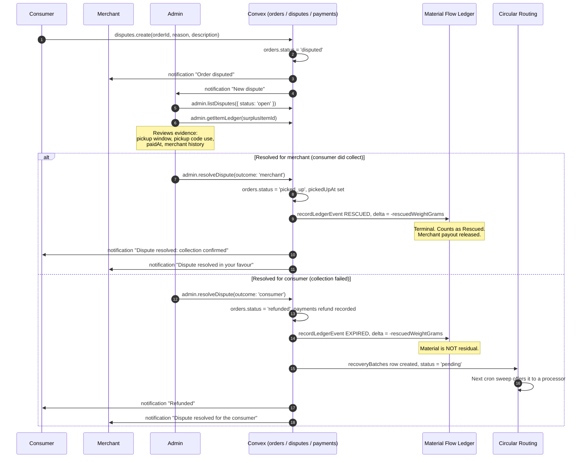

# Cirquo API — Admin Functions

| Field | Value |
| --- | --- |
| **Document type** | API Reference (Admin role) |
| **Backend** | Convex (`query` / `mutation` / `action`, not REST) |
| **Status** | Target contract — M7 |
| **Last updated** | 2026-08-29 |
| **Audience** | Backend engineers, platform operators, DSDC judges auditing the Material Flow Ledger |

This document specifies every Convex function available to an **Admin** account. The admin surface has three jobs, in order of importance:

> **Source exception M6-01.** `impact.getPlatformSummary({ sessionToken? })`
> is implemented as a read-only, Admin-guarded ledger aggregation. Dashboard
> and ledger-inspector UI in this document remain M6-03/M7 target work; its
> exact contract is in [API_IMPACT.md](API_IMPACT.md).

1. **Prove the numbers.** `admin.getItemLedger`, `admin.checkWeightConservation`, and `admin.checkLedgerCompleteness` let anyone — an operator, a judge, an auditor — take a claimed impact figure and trace it back to individual weighed events. This is the difference between a platform that says it recovered food and a platform that can show it.
2. **Gate the network.** Merchants and processors do not self-verify. An admin reviews each application, and only `verified` accounts can list material or receive routed batches.
3. **Repair what breaks.** Moderate unsafe listings, resolve disputes, and manually re-route batches that Circular Routing could not place.

Cirquo runs on Convex. There are no REST endpoints for admins. Every function below is a typed `query` or `mutation` with `v.*` validators, called through `useQuery` / `useMutation`, throwing `ConvexError('CODE')` on failure.

---

## Function index

| Function | Type | Auth | PRD ref | Status |
| --- | --- | --- | --- | --- |
| [`impact.getPlatformSummary`](API_IMPACT.md) | `query` | Admin | IMP-02 | ✅ Source M6-01 |
| [`admin.listUsers`](#2-adminlistusers-) | `query` | Admin | ADM-01 | 📋 Planned |
| [`admin.listPendingVerifications`](#3-adminlistpendingverifications-) | `query` | Admin | ADM-01 | 📋 Planned |
| [`admin.verifyMerchant`](#4-adminverifymerchant-) | `mutation` | Admin | ADM-01 | 📋 Planned |
| [`admin.verifyProcessor`](#5-adminverifyprocessor-) | `mutation` | Admin | ADM-01 | 📋 Planned |
| [`admin.rejectAccount`](#6-adminrejectaccount-) | `mutation` | Admin | ADM-01 | 📋 Planned |
| [`admin.suspendUser`](#7-adminsuspenduser-) | `mutation` | Admin | ADM-01 | 📋 Planned |
| [`admin.moderateListing`](#8-adminmoderatelisting-) | `mutation` | Admin | ADM-02 | 📋 Planned |
| [`admin.listReportedListings`](#9-adminlistreportedlistings-) | `query` | Admin | ADM-02 | 📋 Planned |
| [`admin.getItemLedger`](#10-admingetitemledger-) | `query` | Admin | ADM-03 | 📋 Planned |
| [`admin.searchLedger`](#11-adminsearchledger-) | `query` | Admin | ADM-03 | 📋 Planned |
| [`admin.getPlatformImpact`](#12-admingetplatformimpact-) | `query` | Admin | ADM-04 / IMP-04 | 📋 Planned |
| [`admin.listDisputes`](#131-adminlistdisputes-) | `query` | Admin | ADM-05 | 📋 Planned |
| [`admin.resolveDispute`](#132-adminresolvedispute-) | `mutation` | Admin | ADM-05 | 📋 Planned |
| [`admin.rerouteBatch`](#14-adminreroutebatch-) | `mutation` | Admin | ADM-06 | 📋 Planned |
| [`admin.checkWeightConservation`](#15-admincheckweightconservation-) | `query` | Admin | ADM-03 / IMP-04 | 📋 Planned |
| [`admin.checkLedgerCompleteness`](#16-admincheckledgercompleteness-) | `query` | Admin | ADM-03 / IMP-04 | 📋 Planned |
| [`admin.getSystemHealth`](#19-admingetsystemhealth-) | `query` | Admin | ADM-04 | 📋 Planned |
| [`admin.listCronStatus`](#20-adminlistcronstatus-) | `query` | Admin | ADM-04 | 📋 Planned |

**Status legend:** ✅ Implemented · 🚧 In progress · 📋 Planned.

The codebase now contains authentication, ledger, Merchant, and Consumer
functions. Admin-specific functions in this document remain **📋 planned**;
this page is a target contract rather than a description of deployed Admin
functionality.

See [IMPLEMENTATION_STATUS.md](../project/IMPLEMENTATION_STATUS.md) for the
verified implementation boundary.

---

## 1. Admin provisioning — there is no self-registration path

Per **AUTH-02**, admin accounts are **provisioned manually** and there is no code path by which a user can become an admin through the application.

Concretely:

- `auth.register` accepts only `consumer`, `merchant`, and `processor` in its role validator. Passing `'admin'` fails the `v.union` at the Convex argument boundary before the handler runs — a type-level rejection, not a runtime check that could be forgotten.
- No mutation anywhere in the codebase writes `role: 'admin'` to `users`. There is no `admin.promoteUser`; role escalation must never be exposed through the application API.
- **Current temporary bootstrap:** a trusted operator registers the future Admin as a Consumer through the production application, then changes that user's `role` to `admin` in the production Convex Dashboard. The user must log out and back in afterwards. The previously documented `seed:createAdmin` function does **not** exist.
- No Admin verification mutation is implemented. The `/admin/verifications` page is placeholder UI, so a trusted operator currently changes a completed Merchant or Organic Processor profile from `pending` to `verified` in the production Convex Dashboard. This is an operational stopgap, not a client-side authorization mechanism.
- Admin accounts cannot be suspended through `admin.suspendUser` (`FORBIDDEN`). Removing admin access is an operator action, not an in-app one — otherwise a compromised admin session could lock out every other admin.

The operator must never edit `passwordHash`, `sessions`, session tokens, or any
`materialFlowLedger` row. Verification moves no material and therefore has no
ledger event. The Admin milestone must replace this bootstrap with the guarded
functions specified below and a reactive review UI.

Everything else follows from `requireRole(ctx, 'admin')`, which is the first line of every function in this document. See [`../security/AUTH.md`](../security/AUTH.md).

---

## 2. `admin.listUsers` 📋

**Type:** query · **Auth:** Admin · **PRD ref:** ADM-01

Paginated, filterable directory of all platform accounts with their role-specific profile attached.

**Arguments**

| Arg | Validator | Required | Notes |
| --- | --- | --- | --- |
| `role` | `v.optional(v.union(v.literal('consumer'), v.literal('merchant'), v.literal('processor'), v.literal('admin')))` | No | Filter. |
| `status` | `v.optional(v.union(v.literal('active'), v.literal('suspended')))` | No | Filter on `users.status`. |
| `search` | `v.optional(v.string())` | No | Case-insensitive match on name or email. |
| `cursor` | `v.optional(v.string())` | No | Convex pagination cursor. |
| `limit` | `v.optional(v.number())` | No | Default 50, max 200. |

**Returns**

```ts
type UserRow = {
  userId: Id<'users'>
  name: string
  email: string
  role: Role
  status: 'active' | 'suspended'
  phone: string | null
  createdAt: number
  profile:
    | { kind: 'merchant'; merchantId: Id<'merchants'>; name: string; city: string; verificationStatus: VerificationStatus }
    | { kind: 'processor'; processorId: Id<'processors'>; name: string; city: string; facilityType: string; verificationStatus: VerificationStatus }
    | { kind: 'consumer'; ordersCount: number; rescuedGrams: number }
    | { kind: 'admin' }
}

type Result = { rows: UserRow[]; cursor: string | null; isDone: boolean }
```

**Authorization**

```ts
const admin = await requireRole(ctx, 'admin')
```

**Validation**

1. Valid session → `AUTH_REQUIRED`.
2. `role === 'admin'` → `FORBIDDEN`.
3. `limit` within `1..200` → `VALIDATION_FAILED`.

**Side effects** — None. `passwordHash` is never included in the projection; it is stripped in the mapping function, not merely omitted from the type.

**Ledger events** — None.

**Errors**

| Code | HTTP-equiv | Meaning | Client handling |
| --- | --- | --- | --- |
| `AUTH_REQUIRED` | 401 | No valid session | Redirect to `/login` |
| `FORBIDDEN` | 403 | Caller is not an admin | Redirect to role home |
| `VALIDATION_FAILED` | 400 | Bad limit | Fix client call |

**Example**

```ts
const { rows } = useQuery(api.admin.listUsers, { role: 'merchant', status: 'active' }) ?? { rows: [] }
```

---

## 3. `admin.listPendingVerifications` 📋

**Type:** query · **Auth:** Admin · **PRD ref:** ADM-01

Returns merchant and processor applications awaiting review, oldest first, with everything needed to make a decision on one screen.

**Arguments**

| Arg | Validator | Required | Notes |
| --- | --- | --- | --- |
| `kind` | `v.optional(v.union(v.literal('merchant'), v.literal('processor')))` | No | Omit for both. |
| `city` | `v.optional(v.string())` | No | Uses `by_city_verification`. |
| `limit` | `v.optional(v.number())` | No | Default 50, max 200. |

**Returns**

```ts
type PendingRow = {
  kind: 'merchant' | 'processor'
  entityId: Id<'merchants'> | Id<'processors'>
  ownerId: Id<'users'>
  ownerName: string
  ownerEmail: string
  name: string
  description: string | null
  address: string
  city: string
  latitude: number
  longitude: number
  phone: string | null
  businessType: string | null          // merchants only
  facilityType: string | null          // processors only
  acceptedMaterialTypes: MaterialType[] | null
  outputTypes: OutputType[] | null
  dailyCapacityGrams: number | null
  waitingHours: number
  createdAt: number
}

type Result = { rows: PendingRow[]; counts: { merchants: number; processors: number } }
```

**Authorization** — `const admin = await requireRole(ctx, 'admin')`

**Validation**

1. Session valid → `AUTH_REQUIRED`.
2. Admin role → `FORBIDDEN`.
3. `limit` within range → `VALIDATION_FAILED`.

**Side effects** — None.

**Ledger events** — None.

**Errors**

| Code | HTTP-equiv | Meaning | Client handling |
| --- | --- | --- | --- |
| `AUTH_REQUIRED` | 401 | No session | Redirect to `/login` |
| `FORBIDDEN` | 403 | Not admin | Redirect to role home |
| `VALIDATION_FAILED` | 400 | Bad limit | Fix client call |

**Implementation sketch**

```ts
export const listPendingVerifications = query({
  args: { kind: v.optional(entityKindValidator), city: v.optional(v.string()), limit: v.optional(v.number()) },
  handler: async (ctx, args) => {
    await requireRole(ctx, 'admin')
    const limit = Math.min(args.limit ?? 50, 200)

    const merchants = args.kind === 'processor' ? [] : await ctx.db
      .query('merchants')
      .withIndex('by_city_verification', (q) =>
        args.city ? q.eq('city', args.city).eq('verificationStatus', 'pending') : q,
      )
      .take(limit)

    const processors = args.kind === 'merchant' ? [] : await ctx.db
      .query('processors')
      .withIndex('by_city_verification', (q) =>
        args.city ? q.eq('city', args.city).eq('verificationStatus', 'pending') : q,
      )
      .take(limit)

    return {
      rows: [...merchants.map(toMerchantRow), ...processors.map(toProcessorRow)]
        .sort((a, b) => a.createdAt - b.createdAt)
        .slice(0, limit),
      counts: { merchants: merchants.length, processors: processors.length },
    }
  },
})
```

**Example**

```ts
const pending = useQuery(api.admin.listPendingVerifications, { city: 'Semarang' })
```

---

## 4. `admin.verifyMerchant` 📋

**Type:** mutation · **Auth:** Admin · **PRD ref:** ADM-01

Approves a merchant application, unlocking the ability to publish Rescue Items.

**Arguments**

| Arg | Validator | Required | Notes |
| --- | --- | --- | --- |
| `merchantId` | `v.id('merchants')` | Yes | Must be `pending` or `rejected`. |
| `note` | `v.optional(v.string())` | No | Max 500 chars; stored in the admin audit log. |

**Returns**

```ts
type Result = { merchantId: Id<'merchants'>; verificationStatus: 'verified'; verifiedAt: number }
```

**Authorization** — `const admin = await requireRole(ctx, 'admin')`

**Validation**

1. Session valid → `AUTH_REQUIRED`.
2. Admin role → `FORBIDDEN`.
3. Merchant exists → `NOT_FOUND`.
4. `verificationStatus ∈ {'pending','rejected'}` → `ALREADY_RESOLVED` when already `verified`, `INVALID_TRANSITION` when `suspended` (a suspended merchant is reinstated through `admin.suspendUser` with `suspend: false`, not through verification).
5. `note` ≤ 500 chars → `VALIDATION_FAILED`.

**Side effects**

- `ctx.db.patch(merchantId, { verificationStatus: 'verified' })`.
- Notification to `merchant.ownerId`: account verified, listing enabled.
- Admin audit entry (see §18).

**Ledger events** — None. Verification does not move material. The Material Flow Ledger records material events only; admin actions are audited separately.

**Errors**

| Code | HTTP-equiv | Meaning | Client handling |
| --- | --- | --- | --- |
| `AUTH_REQUIRED` | 401 | No session | Redirect to `/login` |
| `FORBIDDEN` | 403 | Not admin | Redirect to role home |
| `NOT_FOUND` | 404 | Unknown merchant | Toast, refresh queue |
| `ALREADY_RESOLVED` | 409 | Already verified | Toast, refresh queue |
| `INVALID_TRANSITION` | 409 | Merchant suspended | Toast pointing to reinstatement |
| `VALIDATION_FAILED` | 400 | Note too long | Inline field error |

**Example**

```ts
await convex.mutation(api.admin.verifyMerchant, {
  merchantId,
  note: 'Business permit and food-handling certificate checked.',
})
```

---

## 5. `admin.verifyProcessor` 📋

**Type:** mutation · **Auth:** Admin · **PRD ref:** ADM-01

Approves an Organic Processor, making the facility eligible to receive Circular Routing offers.

**Arguments**

| Arg | Validator | Required | Notes |
| --- | --- | --- | --- |
| `processorId` | `v.id('processors')` | Yes | Must be `pending` or `rejected`. |
| `note` | `v.optional(v.string())` | No | Max 500 chars. |

**Returns**

```ts
type Result = {
  processorId: Id<'processors'>
  verificationStatus: 'verified'
  acceptedMaterialTypes: MaterialType[]
  dailyCapacityGrams: number
  verifiedAt: number
}
```

**Authorization** — `const admin = await requireRole(ctx, 'admin')`

**Validation**

1. Session valid → `AUTH_REQUIRED`.
2. Admin role → `FORBIDDEN`.
3. Processor exists → `NOT_FOUND`.
4. Status is `pending` or `rejected` → `ALREADY_RESOLVED` / `INVALID_TRANSITION`.
5. `acceptedMaterialTypes.length > 0`, `outputTypes.length > 0`, and `dailyCapacityGrams > 0` → `VALIDATION_FAILED`. A processor with no declared capabilities would be invisible to routing anyway; verifying it would create a silent dead end, so the profile must be complete before approval.
6. `note` ≤ 500 chars → `VALIDATION_FAILED`.

**Side effects**

- `ctx.db.patch(processorId, { verificationStatus: 'verified' })`.
- Notification to `processor.ownerId`.
- Admin audit entry.
- The facility immediately becomes a routing candidate; batches sitting in `pending` may be offered to it on the next cron sweep.

**Ledger events** — None directly. Indirectly, the next `crons.runCircularRouting` sweep may emit `ROUTED` events naming this processor.

**Errors**

| Code | HTTP-equiv | Meaning | Client handling |
| --- | --- | --- | --- |
| `AUTH_REQUIRED` | 401 | No session | Redirect to `/login` |
| `FORBIDDEN` | 403 | Not admin | Redirect to role home |
| `NOT_FOUND` | 404 | Unknown processor | Toast, refresh queue |
| `ALREADY_RESOLVED` | 409 | Already verified | Toast, refresh queue |
| `INVALID_TRANSITION` | 409 | Processor suspended | Toast |
| `VALIDATION_FAILED` | 400 | Incomplete capability profile | Toast listing missing fields |

**Example**

```ts
await convex.mutation(api.admin.verifyProcessor, {
  processorId,
  note: 'Site visit 2026-08-05. BSF rearing capacity confirmed at 250 kg/day.',
})
```

---

## 6. `admin.rejectAccount` 📋

**Type:** mutation · **Auth:** Admin · **PRD ref:** ADM-01

Rejects a pending merchant or processor application with a mandatory reason.

**Arguments**

| Arg | Validator | Required | Notes |
| --- | --- | --- | --- |
| `kind` | `v.union(v.literal('merchant'), v.literal('processor'))` | Yes | Selects the table. |
| `entityId` | `v.union(v.id('merchants'), v.id('processors'))` | Yes | Must match `kind`. |
| `reason` | `v.string()` | Yes | 10–500 chars, shown to the applicant verbatim. |

**Returns**

```ts
type Result = { entityId: Id<'merchants'> | Id<'processors'>; verificationStatus: 'rejected'; rejectedAt: number }
```

**Authorization** — `const admin = await requireRole(ctx, 'admin')`

**Validation**

1. Session valid → `AUTH_REQUIRED`.
2. Admin role → `FORBIDDEN`.
3. Entity exists in the table implied by `kind` → `NOT_FOUND`.
4. `verificationStatus === 'pending'` → `ALREADY_RESOLVED`.
5. `reason` length 10–500 → `VALIDATION_FAILED`. A rejection without a usable reason produces a support ticket instead of a corrected application, so the minimum length is enforced.

**Side effects**

- `ctx.db.patch(entityId, { verificationStatus: 'rejected' })`.
- Notification to the owner containing the reason.
- Admin audit entry.
- The account may edit its profile and re-apply; `verifyMerchant` / `verifyProcessor` accept `rejected` as an input state.

**Ledger events** — None.

**Errors**

| Code | HTTP-equiv | Meaning | Client handling |
| --- | --- | --- | --- |
| `AUTH_REQUIRED` | 401 | No session | Redirect to `/login` |
| `FORBIDDEN` | 403 | Not admin | Redirect to role home |
| `NOT_FOUND` | 404 | Unknown entity or kind mismatch | Toast |
| `ALREADY_RESOLVED` | 409 | Not pending | Toast, refresh queue |
| `VALIDATION_FAILED` | 400 | Reason too short or too long | Inline field error |

**Example**

```ts
await convex.mutation(api.admin.rejectAccount, {
  kind: 'merchant',
  entityId: merchantId,
  reason: 'Address could not be located and no business permit was attached. Please resubmit with both.',
})
```

---

## 7. `admin.suspendUser` 📋

**Type:** mutation · **Auth:** Admin · **PRD ref:** ADM-01

Suspends or reinstates a user account, cascading to their merchant or processor profile.

**Arguments**

| Arg | Validator | Required | Notes |
| --- | --- | --- | --- |
| `userId` | `v.id('users')` | Yes | May not be an admin. |
| `suspend` | `v.boolean()` | Yes | `false` reinstates. |
| `reason` | `v.string()` | Yes | 10–500 chars. |

**Returns**

```ts
type Result = {
  userId: Id<'users'>
  status: 'active' | 'suspended'
  sessionsRevoked: number
  affectedListings: number
  affectedBatches: number
}
```

**Authorization** — `const admin = await requireRole(ctx, 'admin')`

**Validation**

1. Session valid → `AUTH_REQUIRED`.
2. Admin role → `FORBIDDEN`.
3. Target user exists → `NOT_FOUND`.
4. `target.role !== 'admin'` → `FORBIDDEN`. Admins are not suspendable in-app (§1).
5. `target._id !== admin._id` → `FORBIDDEN`. No self-suspension.
6. Status actually changes → `ALREADY_RESOLVED`.
7. `reason` length 10–500 → `VALIDATION_FAILED`.

**Side effects — on suspend**

- `ctx.db.patch(userId, { status: 'suspended' })`.
- All `sessions` rows for the user are deleted, logging the account out everywhere on the next request.
- Merchant profile → `verificationStatus: 'suspended'`; all `active` and `reserved_partial` Rescue Items are moved to `moderated` with a `MODERATED` ledger event each, and consumers holding paid orders on those items are refunded and notified.
- Processor profile → `verificationStatus: 'suspended'`; all `offered` batches assigned to them return to `pending` for re-routing. Batches already `accepted` or `collected` are **not** clawed back — material physically at the facility must still have its outcome logged, and an admin follows up manually.

**Side effects — on reinstate**

- `ctx.db.patch(userId, { status: 'active' })` and the profile returns to `pending` verification, requiring a fresh review. Reinstatement is not automatic re-verification.

**Ledger events**

| Event | Weight delta | Metadata |
| --- | --- | --- |
| `MODERATED` *(one per force-closed listing)* | `-(remainingQuantity × weightPerItemGrams)` | `{ reason: 'merchant_suspended', adminId, suspensionReason, previousStatus }` |

`MODERATED` is terminal and its negative delta closes the item's ledger to zero. Force-closed material counts as **Residual**, because nothing was rescued and nothing was recovered.

**Errors**

| Code | HTTP-equiv | Meaning | Client handling |
| --- | --- | --- | --- |
| `AUTH_REQUIRED` | 401 | No session | Redirect to `/login` |
| `FORBIDDEN` | 403 | Not admin, target is admin, or self-target | Toast |
| `NOT_FOUND` | 404 | Unknown user | Toast |
| `ALREADY_RESOLVED` | 409 | Already in that status | Toast, refresh |
| `VALIDATION_FAILED` | 400 | Reason length | Inline field error |

**Example**

```ts
const result = await convex.mutation(api.admin.suspendUser, {
  userId,
  suspend: true,
  reason: 'Three verified reports of listings that did not match the collected item.',
})
// { sessionsRevoked: 2, affectedListings: 4, affectedBatches: 1 }
```

---

## 8. `admin.moderateListing` 📋

**Type:** mutation · **Auth:** Admin · **PRD ref:** ADM-02

Force-closes a Rescue Item that violates platform rules, emitting the terminal `MODERATED` event and refunding any outstanding paid orders.

**Arguments**

| Arg | Validator | Required | Notes |
| --- | --- | --- | --- |
| `surplusItemId` | `v.id('surplusItems')` | Yes | Must be in a non-terminal status. |
| `reason` | `v.union(v.literal('food_safety'), v.literal('misleading'), v.literal('prohibited_item'), v.literal('pricing_abuse'), v.literal('duplicate'), v.literal('other'))` | Yes | Drives the merchant notification template. |
| `note` | `v.string()` | Yes | 10–1000 chars, shown to the merchant. |

**Returns**

```ts
type Result = {
  surplusItemId: Id<'surplusItems'>
  status: 'moderated'
  moderatedWeightGrams: number
  ordersRefunded: number
  batchesCancelled: number
}
```

**Authorization** — `const admin = await requireRole(ctx, 'admin')`

**Validation**

1. Session valid → `AUTH_REQUIRED`.
2. Admin role → `FORBIDDEN`.
3. Item exists → `NOT_FOUND`.
4. `status ∉ {'recovered','residual','closed','moderated'}` → `INVALID_TRANSITION`. Terminal items are historical record and are never re-opened or re-closed.
5. `note` length 10–1000 → `VALIDATION_FAILED`.

**Side effects**

- `ctx.db.patch(surplusItemId, { status: 'moderated' })`.
- Every `orders` row for the item in `reserved` or `paid` → `refunded`, with a refund record on `payments` and a consumer notification. Orders already `picked_up` are untouched; that material was genuinely rescued and stays in the Rescued total.
- Any `recoveryBatches` row for the item in `pending`, `offered`, or `accepted` → cancelled, with the assigned processor notified.
- `recordLedgerEvent` for `MODERATED`, inside the same mutation.
- Admin audit entry.

**Ledger events**

| Event | Weight delta | Metadata |
| --- | --- | --- |
| `MODERATED` | `-(remainingQuantity × weightPerItemGrams)` | `{ adminId, reason, note, previousStatus, ordersRefunded, batchesCancelled }` |

The delta covers only the **remaining** quantity. Portions already collected produced `RESCUED` events with their own negative deltas and are not retroactively unwound. Moderated weight is reported as **Residual**.

**Errors**

| Code | HTTP-equiv | Meaning | Client handling |
| --- | --- | --- | --- |
| `AUTH_REQUIRED` | 401 | No session | Redirect to `/login` |
| `FORBIDDEN` | 403 | Not admin | Redirect to role home |
| `NOT_FOUND` | 404 | Unknown item | Toast |
| `INVALID_TRANSITION` | 409 | Item already terminal | Toast, refresh |
| `VALIDATION_FAILED` | 400 | Note length | Inline field error |

**Implementation sketch**

```ts
export const moderateListing = mutation({
  args: { surplusItemId: v.id('surplusItems'), reason: moderationReasonValidator, note: v.string() },
  handler: async (ctx, args) => {
    const admin = await requireRole(ctx, 'admin')
    const item = await ctx.db.get(args.surplusItemId)
    if (!item) throw new ConvexError('NOT_FOUND')
    if (TERMINAL_ITEM_STATUSES.includes(item.status)) throw new ConvexError('INVALID_TRANSITION')
    if (args.note.length < 10 || args.note.length > 1000) throw new ConvexError('VALIDATION_FAILED')

    const now = Date.now()
    const moderatedWeightGrams = item.remainingQuantity * item.weightPerItemGrams

    const ordersRefunded = await refundOpenOrdersForItem(ctx, item._id, 'listing_moderated')
    const batchesCancelled = await cancelOpenBatchesForItem(ctx, item._id, 'listing_moderated')

    await ctx.db.patch(item._id, { status: 'moderated' })

    await recordLedgerEvent(ctx, {
      surplusItemId: item._id,
      eventType: 'MODERATED',
      weightDeltaGrams: -moderatedWeightGrams,
      actorId: admin._id,
      actorRole: 'admin',
      metadata: {
        adminId: admin._id,
        reason: args.reason,
        note: args.note,
        previousStatus: item.status,
        ordersRefunded,
        batchesCancelled,
      },
      occurredAt: now,
    })

    await recordAdminAction(ctx, admin._id, 'moderate_listing', item._id, args.reason, args.note)
    await notifyMerchantOwner(ctx, item.merchantId, {
      type: 'listing_moderated',
      title: 'Listing removed by moderation',
      body: args.note,
    })

    return {
      surplusItemId: item._id,
      status: 'moderated' as const,
      moderatedWeightGrams,
      ordersRefunded,
      batchesCancelled,
    }
  },
})
```

**Example**

```ts
await convex.mutation(api.admin.moderateListing, {
  surplusItemId,
  reason: 'food_safety',
  note: 'Prepared protein listed with a pickup window ending 9 hours after preparation. Exceeds the 4-hour limit.',
})
```

---

## 9. `admin.listReportedListings` 📋

**Type:** query · **Auth:** Admin · **PRD ref:** ADM-02

Returns active Rescue Items flagged for review, either by consumer reports or by automated heuristics.

**Arguments**

| Arg | Validator | Required | Notes |
| --- | --- | --- | --- |
| `city` | `v.optional(v.string())` | No | Filter. |
| `minSeverity` | `v.optional(v.union(v.literal('low'), v.literal('medium'), v.literal('high')))` | No | Default `low`. |
| `limit` | `v.optional(v.number())` | No | Default 50, max 200. |

**Returns**

```ts
type ReportedRow = {
  surplusItemId: Id<'surplusItems'>
  name: string
  imageUrl: string | null
  merchantId: Id<'merchants'>
  merchantName: string
  city: string
  status: RescueItemStatus
  currentPrice: number         // integer IDR
  originalPrice: number
  floorPrice: number
  discountPercent: number
  pickupStartAt: number
  pickupEndAt: number
  remainingQuantity: number
  flags: Array<{ code: string; severity: 'low' | 'medium' | 'high'; detail: string }>
  reportCount: number
}

type Result = { rows: ReportedRow[]; total: number }
```

**Authorization** — `const admin = await requireRole(ctx, 'admin')`

**Heuristic flags** raised alongside consumer reports:

| Code | Severity | Trigger |
| --- | --- | --- |
| `PRICE_BELOW_FLOOR` | high | `currentPrice < floorPrice` — indicates a Dynamic Rescue Pricing bug or tampering |
| `LONG_PREPARED_WINDOW` | high | `materialType === 'prepared_food'` and window span > 4 hours |
| `IMPLAUSIBLE_WEIGHT` | medium | `weightPerItemGrams > 5000` or `< 20` |
| `EXTREME_DISCOUNT` | medium | `currentPrice < originalPrice × 0.1` |
| `HIGH_VARIANCE_MERCHANT` | medium | Merchant's mean declared-vs-measured variance exceeds 30% over the last 20 batches |
| `DUPLICATE_LISTING` | low | Same merchant, same name, overlapping pickup window |

**Validation**

1. Session valid → `AUTH_REQUIRED`.
2. Admin role → `FORBIDDEN`.
3. `limit` within range → `VALIDATION_FAILED`.

**Side effects** — None.

**Ledger events** — None.

**Errors**

| Code | HTTP-equiv | Meaning | Client handling |
| --- | --- | --- | --- |
| `AUTH_REQUIRED` | 401 | No session | Redirect to `/login` |
| `FORBIDDEN` | 403 | Not admin | Redirect to role home |
| `VALIDATION_FAILED` | 400 | Bad limit | Fix client call |

**Example**

```ts
const flagged = useQuery(api.admin.listReportedListings, { minSeverity: 'high' })
```

---

## 10. `admin.getItemLedger` 📋

**Type:** query · **Auth:** Admin · **PRD ref:** ADM-03

Returns the complete, ordered, append-only **Material Flow Ledger** for a single Rescue Item, together with its running weight balance and outcome attribution. This is the audit trail — the function that makes every impact number on the platform falsifiable.

**Arguments**

| Arg | Validator | Required | Notes |
| --- | --- | --- | --- |
| `surplusItemId` | `v.id('surplusItems')` | Yes | Any status, including drafts. |

**Returns**

```ts
type LedgerRow = {
  ledgerId: Id<'materialFlowLedger'>
  eventType: LedgerEventType
  weightDeltaGrams: number
  runningBalanceGrams: number
  occurredAt: number
  actor: { userId: Id<'users'> | null; name: string; role: Role | null } | null
  orderId: Id<'orders'> | null
  recoveryBatchId: Id<'recoveryBatches'> | null
  metadata: Record<string, unknown> | null
  methodologyVersion: string
  isTerminal: boolean
}

type Result = {
  item: {
    surplusItemId: Id<'surplusItems'>
    name: string
    materialType: MaterialType
    status: RescueItemStatus
    initialQuantity: number
    weightPerItemGrams: number
    totalListedGrams: number
    merchantId: Id<'merchants'>
    merchantName: string
    createdAt: number
    publishedAt: number | null
  }
  events: LedgerRow[]
  attribution: {
    rescuedGrams: number
    recoveredGrams: number
    residualGrams: number
    processLossGrams: number
    inFlightGrams: number
    circularityRatePercent: number
  }
  integrity: {
    finalBalanceGrams: number
    balanced: boolean
    hasTerminalEvent: boolean
    isTerminalStatus: boolean
    conservationHolds: boolean
  }
}
```

**Authorization** — `const admin = await requireRole(ctx, 'admin')`

**Validation**

1. Session valid → `AUTH_REQUIRED`.
2. Admin role → `FORBIDDEN`.
3. Item exists → `NOT_FOUND`.

**Side effects** — None. Strictly read-only. The ledger is append-only and no admin function ever patches or deletes a row (§17).

**Ledger events** — None. Reads via `materialFlowLedger.by_rescue_item`, sorted by `occurredAt` ascending with `_creationTime` as tiebreak, so events recorded in the same millisecond keep their insertion order.

**Attribution rules** — the same rules the platform metric layer uses, so a judge comparing this output to the dashboard sees identical arithmetic:

- `RESCUED` → `rescuedGrams += |delta|`
- `PROCESSED` → `recoveredGrams += metadata.outputWeightGrams`, `residualGrams += metadata.residualWeightGrams`, `processLossGrams += |delta| − output − residual`
- `ROUTING_FAILED` → `residualGrams += metadata.residualWeightGrams`
- `MODERATED` → `residualGrams += |delta|`
- Non-terminal items → the unresolved remainder is `inFlightGrams`, counted in neither numerator nor denominator of the headline circularity rate

Note that `PROCESSED` attribution reads `metadata`, never the raw delta. Taking the delta wholesale would book a batch that produced 1 kg of compost from 10 kg of intake as 10 kg recovered, hiding 9 kg of residual. See [`API_PROCESSOR.md`](API_PROCESSOR.md) §10.1.

**Errors**

| Code | HTTP-equiv | Meaning | Client handling |
| --- | --- | --- | --- |
| `AUTH_REQUIRED` | 401 | No session | Redirect to `/login` |
| `FORBIDDEN` | 403 | Not admin | Redirect to role home |
| `NOT_FOUND` | 404 | Unknown item | Toast, return to list |

**Implementation sketch**

```ts
export const getItemLedger = query({
  args: { surplusItemId: v.id('surplusItems') },
  handler: async (ctx, args) => {
    await requireRole(ctx, 'admin')
    const item = await ctx.db.get(args.surplusItemId)
    if (!item) throw new ConvexError('NOT_FOUND')

    const raw = await ctx.db
      .query('materialFlowLedger')
      .withIndex('by_rescue_item', (q) => q.eq('surplusItemId', args.surplusItemId))
      .collect()

    const ordered = raw.sort((a, b) => a.occurredAt - b.occurredAt || a._creationTime - b._creationTime)

    let balance = 0
    const events: LedgerRow[] = []
    for (const e of ordered) {
      balance += e.weightDeltaGrams
      events.push({
        ledgerId: e._id,
        eventType: e.eventType,
        weightDeltaGrams: e.weightDeltaGrams,
        runningBalanceGrams: balance,
        occurredAt: e.occurredAt,
        actor: await hydrateActor(ctx, e.actorId, e.actorRole),
        orderId: e.orderId ?? null,
        recoveryBatchId: e.recoveryBatchId ?? null,
        metadata: e.metadata ?? null,
        methodologyVersion: e.methodologyVersion,
        isTerminal: TERMINAL_EVENTS.has(e.eventType),
      })
    }

    const isTerminalStatus = TERMINAL_ITEM_STATUSES.includes(item.status)
    return {
      item: await hydrateItem(ctx, item),
      events,
      attribution: attributeLedger(ordered, item),
      integrity: {
        finalBalanceGrams: balance,
        balanced: balance === 0,
        hasTerminalEvent: events.some((e) => e.isTerminal),
        isTerminalStatus,
        conservationHolds: !isTerminalStatus || balance === 0,
      },
    }
  },
})
```

**Example — the demo moment**

```ts
const audit = useQuery(api.admin.getItemLedger, { surplusItemId })
// audit.events -> LISTED +10000, EXPIRED -10000, ROUTED 0,
//                 INTAKE_ACCEPTED +10000, PROCESSED -10000
// audit.integrity.balanced === true
// audit.attribution -> { recoveredGrams: 8000, residualGrams: 2000, circularityRatePercent: 80 }
```

Pointing at this output is how Cirquo answers "how do you know?". Every kilogram claimed on the dashboard resolves to a chain of timestamped, actor-attributed, weighed events that sums to zero.

---

## 11. `admin.searchLedger` 📋

**Type:** query · **Auth:** Admin · **PRD ref:** ADM-03

Cross-item ledger search for investigations — by event type, actor, time range, or linked order.

**Arguments**

| Arg | Validator | Required | Notes |
| --- | --- | --- | --- |
| `eventType` | `v.optional(ledgerEventTypeValidator)` | No | Uses `by_event_type`. |
| `actorId` | `v.optional(v.id('users'))` | No | Uses `by_actor`. |
| `orderId` | `v.optional(v.id('orders'))` | No | Uses `by_order`. |
| `fromAt` | `v.optional(v.number())` | No | Inclusive, epoch ms UTC. |
| `toAt` | `v.optional(v.number())` | No | Exclusive. |
| `minAbsWeightGrams` | `v.optional(v.number())` | No | Post-filter for material movements above a threshold. |
| `cursor` | `v.optional(v.string())` | No | Pagination. |
| `limit` | `v.optional(v.number())` | No | Default 100, max 500. |

**Returns**

```ts
type Result = {
  rows: Array<{
    ledgerId: Id<'materialFlowLedger'>
    surplusItemId: Id<'surplusItems'>
    rescueItemName: string
    eventType: LedgerEventType
    weightDeltaGrams: number
    actorRole: Role | null
    actorName: string | null
    occurredAt: number
    methodologyVersion: string
  }>
  cursor: string | null
  isDone: boolean
  aggregate: { count: number; sumAbsWeightGrams: number }
}
```

**Authorization** — `const admin = await requireRole(ctx, 'admin')`

**Validation**

1. Session valid → `AUTH_REQUIRED`.
2. Admin role → `FORBIDDEN`.
3. `fromAt < toAt` when both present → `VALIDATION_FAILED`.
4. Range span ≤ 366 days → `VALIDATION_FAILED`.
5. `limit` within `1..500` → `VALIDATION_FAILED`.

Index selection is by specificity: `by_order` if `orderId` is given, else `by_actor`, else `by_event_type`, else `by_occurred_at`. Remaining criteria are applied as post-filters. An unbounded scan of the full ledger is never issued.

**Side effects** — None.

**Ledger events** — None.

**Errors**

| Code | HTTP-equiv | Meaning | Client handling |
| --- | --- | --- | --- |
| `AUTH_REQUIRED` | 401 | No session | Redirect to `/login` |
| `FORBIDDEN` | 403 | Not admin | Redirect to role home |
| `VALIDATION_FAILED` | 400 | Bad range or limit | Inline filter error |

**Example**

```ts
const failures = useQuery(api.admin.searchLedger, {
  eventType: 'ROUTING_FAILED',
  fromAt: Date.now() - 7 * 86_400_000,
})
// failures.aggregate.sumAbsWeightGrams -> residual from unroutable batches this week
```

---

## 12. `admin.getPlatformImpact` 📋

**Type:** query · **Auth:** Admin · **PRD ref:** ADM-04 / IMP-04

Platform-wide impact, entirely derived from the Material Flow Ledger, with the full outcome breakdown including Residual.

**Arguments**

| Arg | Validator | Required | Notes |
| --- | --- | --- | --- |
| `fromAt` | `v.optional(v.number())` | No | Default 30 days ago. |
| `toAt` | `v.optional(v.number())` | No | Default now. |
| `city` | `v.optional(v.string())` | No | Scope to one city. |
| `groupBy` | `v.optional(v.union(v.literal('day'), v.literal('week'), v.literal('month')))` | No | Default `day`, bucketed on WIB boundaries. |

**Returns**

```ts
type Result = {
  period: { fromAt: number; toAt: number; groupBy: 'day' | 'week' | 'month' }
  totals: {
    listedGrams: number
    rescuedGrams: number
    recoveredGrams: number
    residualGrams: number
    processLossGrams: number
    inFlightGrams: number
  }
  circularityRatePercent: number       // (rescued + recovered) / listed
  rescueRatePercent: number
  recoveryRatePercent: number
  residualRatePercent: number
  routing: {
    batchesCreated: number
    batchesRouted: number
    batchesProcessed: number
    batchesUnroutable: number
    averageRoutingAttempts: number
    routingSuccessRatePercent: number
  }
  commerce: {
    ordersPaid: number
    ordersPickedUp: number
    ordersExpired: number
    grossMerchandiseValueIdr: number   // integer IDR
    platformFeeIdr: number
  }
  network: { verifiedMerchants: number; verifiedProcessors: number; activeConsumers: number }
  series: Array<{
    bucketStartAt: number
    listedGrams: number
    rescuedGrams: number
    recoveredGrams: number
    residualGrams: number
  }>
  outputBreakdown: Array<{ outputType: OutputType; outputWeightGrams: number }>
  materialBreakdown: Array<{ materialType: MaterialType; listedGrams: number; rescuedGrams: number; recoveredGrams: number; residualGrams: number }>
  methodologyVersion: string
  integrity: { conservationViolations: number; completenessViolations: number; trustworthy: boolean }
}
```

**Authorization** — `const admin = await requireRole(ctx, 'admin')`

**Validation**

1. Session valid → `AUTH_REQUIRED`.
2. Admin role → `FORBIDDEN`.
3. `fromAt < toAt` → `VALIDATION_FAILED`.
4. Range span ≤ 366 days → `VALIDATION_FAILED`.

**Side effects** — None.

**Ledger events** — None. Reads via `materialFlowLedger.by_occurred_at`.

The `integrity` block is not decoration. It runs the two checks from §15 and §16 over the same period and sets `trustworthy: false` if either returns violations. The dashboard renders a red banner over every figure when this is false, because a figure that cannot be reconciled is not a figure.

**Errors**

| Code | HTTP-equiv | Meaning | Client handling |
| --- | --- | --- | --- |
| `AUTH_REQUIRED` | 401 | No session | Redirect to `/login` |
| `FORBIDDEN` | 403 | Not admin | Redirect to role home |
| `VALIDATION_FAILED` | 400 | Bad range | Inline filter error |

**Example**

```ts
const impact = useQuery(api.admin.getPlatformImpact, { city: 'Semarang', groupBy: 'day' })
```

---

## 13. Disputes

A dispute is raised when a consumer and a merchant disagree about a collection: the consumer says they arrived and the merchant refused or had nothing left; the merchant says the consumer never came. The order sits in `disputed` with the payment held, and an admin decides.



The asymmetry in the second branch is deliberate and is one of Cirquo's core modelling decisions: **a failed collection does not create Residual.** The material still exists and is still edible or still compostable, so it re-enters Circular Routing as a fresh batch and gets another chance at a real outcome. Booking it as waste at the moment of a refund would inflate the residual figure with material that was later recovered, and would double-count it if it were then processed.

### 13.1 `admin.listDisputes` 📋

**Type:** query · **Auth:** Admin · **PRD ref:** ADM-05

Returns disputes with the full evidence bundle needed to decide without leaving the screen.

**Arguments**

| Arg | Validator | Required | Notes |
| --- | --- | --- | --- |
| `status` | `v.optional(v.union(v.literal('open'), v.literal('resolved')))` | No | Default `open`. |
| `limit` | `v.optional(v.number())` | No | Default 50, max 200. |

**Returns**

```ts
type DisputeRow = {
  disputeId: Id<'disputes'>
  status: 'open' | 'resolved'
  reason: string
  description: string
  createdAt: number
  ageHours: number
  raisedBy: { userId: Id<'users'>; name: string; role: Role }
  against: { userId: Id<'users'>; name: string; role: Role }
  order: {
    orderId: Id<'orders'>
    status: OrderStatus
    quantity: number
    totalPrice: number              // integer IDR
    rescuedWeightGrams: number
    pickupCode: string
    createdAt: number
    paidAt: number | null
    pickedUpAt: number | null
  }
  rescueItem: {
    surplusItemId: Id<'surplusItems'>
    name: string
    pickupStartAt: number
    pickupEndAt: number
    status: RescueItemStatus
  }
  merchant: { merchantId: Id<'merchants'>; name: string; disputeRatePercent: number }
  ledgerEvents: Array<{ eventType: LedgerEventType; occurredAt: number; weightDeltaGrams: number }>
  resolution: { resolvedByAdminId: Id<'users'>; resolutionNote: string; resolvedAt: number } | null
}

type Result = { rows: DisputeRow[]; openCount: number }
```

**Authorization** — `const admin = await requireRole(ctx, 'admin')`

**Validation**

1. Session valid → `AUTH_REQUIRED`.
2. Admin role → `FORBIDDEN`.
3. `limit` within `1..200` → `VALIDATION_FAILED`.

**Side effects** — None.

**Ledger events** — None. Reads the item's ledger trail via `by_rescue_item` so the deciding admin sees whether a `RESCUED` event already exists.

**Errors**

| Code | HTTP-equiv | Meaning | Client handling |
| --- | --- | --- | --- |
| `AUTH_REQUIRED` | 401 | No session | Redirect to `/login` |
| `FORBIDDEN` | 403 | Not admin | Redirect to role home |
| `VALIDATION_FAILED` | 400 | Bad limit | Fix client call |

**Example**

```ts
const { rows, openCount } = useQuery(api.admin.listDisputes, { status: 'open' }) ?? { rows: [], openCount: 0 }
```

### 13.2 `admin.resolveDispute` 📋

**Type:** mutation · **Auth:** Admin · **PRD ref:** ADM-05

Resolves a dispute in favour of the merchant or the consumer, driving the order to a terminal state and writing the corresponding ledger event.

**Arguments**

| Arg | Validator | Required | Notes |
| --- | --- | --- | --- |
| `disputeId` | `v.id('disputes')` | Yes | Must be `open`. |
| `outcome` | `v.union(v.literal('merchant'), v.literal('consumer'))` | Yes | Who the decision favours. |
| `resolutionNote` | `v.string()` | Yes | 10–1000 chars, sent to both parties. |

**Returns**

```ts
type Result = {
  disputeId: Id<'disputes'>
  status: 'resolved'
  orderStatus: 'picked_up' | 'refunded'
  ledgerEventType: 'RESCUED' | 'EXPIRED'
  refundAmountIdr: number
  recoveryBatchId: Id<'recoveryBatches'> | null   // set when material re-enters routing
}
```

**Authorization** — `const admin = await requireRole(ctx, 'admin')`

**Validation**

1. Session valid → `AUTH_REQUIRED`.
2. Admin role → `FORBIDDEN`.
3. Dispute exists → `NOT_FOUND`.
4. `dispute.status === 'open'` → `ALREADY_RESOLVED`.
5. Linked order exists and `status === 'disputed'` → `INVALID_TRANSITION`.
6. `resolutionNote` length 10–1000 → `VALIDATION_FAILED`.

**Side effects — outcome `merchant`**

- Order → `picked_up`, `pickedUpAt = now`; merchant payout released.
- `recordLedgerEvent` `RESCUED`, delta `-order.rescuedWeightGrams`. Terminal; counts as **Rescued**.
- Both parties notified.

**Side effects — outcome `consumer`**

- Order → `refunded`; a refund row is written to `payments` and the Midtrans refund is scheduled through an `action` (an action cannot write the DB directly, so it calls back into an `internalMutation` to record the provider response).
- `recordLedgerEvent` `EXPIRED`, delta `-order.rescuedWeightGrams`, metadata `{ reason: 'dispute_resolved_for_consumer' }`.
- A `recoveryBatches` row is created with `status: 'pending'` for the disputed weight. **Not Residual** — the material re-enters Circular Routing.
- Both parties notified.

**In both cases** — dispute patched to `resolved` with `resolvedByAdminId`, `resolutionNote`, `resolvedAt`; admin audit entry written inside the same mutation.

**Ledger events**

| Event | Weight delta | Metadata |
| --- | --- | --- |
| `RESCUED` *(outcome `merchant`)* | `-rescuedWeightGrams` | `{ source: 'dispute_resolution', disputeId, adminId, resolutionNote }` |
| `EXPIRED` *(outcome `consumer`)* | `-rescuedWeightGrams` | `{ reason: 'dispute_resolved_for_consumer', disputeId, adminId, requeuedForRouting: true }` |

**Errors**

| Code | HTTP-equiv | Meaning | Client handling |
| --- | --- | --- | --- |
| `AUTH_REQUIRED` | 401 | No session | Redirect to `/login` |
| `FORBIDDEN` | 403 | Not admin | Redirect to role home |
| `NOT_FOUND` | 404 | Unknown dispute | Toast, refresh |
| `ALREADY_RESOLVED` | 409 | Dispute already closed | Toast, refresh |
| `INVALID_TRANSITION` | 409 | Order not in `disputed` | Toast, refresh |
| `VALIDATION_FAILED` | 400 | Note length | Inline field error |

**Implementation sketch**

```ts
export const resolveDispute = mutation({
  args: {
    disputeId: v.id('disputes'),
    outcome: v.union(v.literal('merchant'), v.literal('consumer')),
    resolutionNote: v.string(),
  },
  handler: async (ctx, args) => {
    const admin = await requireRole(ctx, 'admin')
    const dispute = await ctx.db.get(args.disputeId)
    if (!dispute) throw new ConvexError('NOT_FOUND')
    if (dispute.status !== 'open') throw new ConvexError('ALREADY_RESOLVED')

    const order = await ctx.db.get(dispute.orderId)
    if (!order || order.status !== 'disputed') throw new ConvexError('INVALID_TRANSITION')
    if (args.resolutionNote.length < 10 || args.resolutionNote.length > 1000) {
      throw new ConvexError('VALIDATION_FAILED')
    }

    const now = Date.now()
    let recoveryBatchId: Id<'recoveryBatches'> | null = null
    let refundAmountIdr = 0

    if (args.outcome === 'merchant') {
      await ctx.db.patch(order._id, { status: 'picked_up', pickedUpAt: now })
      await recordLedgerEvent(ctx, {
        surplusItemId: order.surplusItemId,
        orderId: order._id,
        eventType: 'RESCUED',
        weightDeltaGrams: -order.rescuedWeightGrams,
        actorId: admin._id,
        actorRole: 'admin',
        metadata: {
          source: 'dispute_resolution',
          disputeId: dispute._id,
          adminId: admin._id,
          resolutionNote: args.resolutionNote,
        },
        occurredAt: now,
      })
    } else {
      await ctx.db.patch(order._id, { status: 'refunded' })
      refundAmountIdr = order.totalPrice
      await recordRefund(ctx, order._id, refundAmountIdr, 'dispute_resolved_for_consumer')
      await recordLedgerEvent(ctx, {
        surplusItemId: order.surplusItemId,
        orderId: order._id,
        eventType: 'EXPIRED',
        weightDeltaGrams: -order.rescuedWeightGrams,
        actorId: admin._id,
        actorRole: 'admin',
        metadata: {
          reason: 'dispute_resolved_for_consumer',
          disputeId: dispute._id,
          adminId: admin._id,
          requeuedForRouting: true,
        },
        occurredAt: now,
      })
      recoveryBatchId = await createRecoveryBatch(ctx, {
        surplusItemId: order.surplusItemId,
        merchantId: order.merchantId,
        offeredWeightGrams: order.rescuedWeightGrams,
        source: 'dispute_requeue',
      })
    }

    await ctx.db.patch(dispute._id, {
      status: 'resolved',
      resolvedByAdminId: admin._id,
      resolutionNote: args.resolutionNote,
      resolvedAt: now,
    })
    await recordAdminAction(ctx, admin._id, 'resolve_dispute', dispute._id, args.outcome, args.resolutionNote)

    return {
      disputeId: dispute._id,
      status: 'resolved' as const,
      orderStatus: args.outcome === 'merchant' ? ('picked_up' as const) : ('refunded' as const),
      ledgerEventType: args.outcome === 'merchant' ? ('RESCUED' as const) : ('EXPIRED' as const),
      refundAmountIdr,
      recoveryBatchId,
    }
  },
})
```

**Example**

```ts
await convex.mutation(api.admin.resolveDispute, {
  disputeId,
  outcome: 'consumer',
  resolutionNote: 'Merchant confirmed the item was sold to a walk-in customer before the consumer arrived. Refunded in full; material re-queued for routing.',
})
```

---

## 14. `admin.rerouteBatch` 📋

**Type:** mutation · **Auth:** Admin · **PRD ref:** ADM-06

Manually re-routes a batch that Circular Routing could not place, either to a specific processor or by resetting it for another automated attempt.

**Arguments**

| Arg | Validator | Required | Notes |
| --- | --- | --- | --- |
| `batchId` | `v.id('recoveryBatches')` | Yes | Must be `unroutable` or `pending`. |
| `processorId` | `v.optional(v.id('processors'))` | No | Omit to reset for automated routing. |
| `resetAttempts` | `v.optional(v.boolean())` | No | Default `true`; clears `routingAttempts` and `declinedByProcessorIds`. |
| `overrideCapacity` | `v.optional(v.boolean())` | No | Default `false`; allows exceeding `dailyCapacityGrams` with explicit acknowledgement. |
| `note` | `v.string()` | Yes | 10–500 chars, mandatory justification. |

**Returns**

```ts
type Result = {
  batchId: Id<'recoveryBatches'>
  status: 'offered' | 'pending'
  processorId: Id<'processors'> | null
  offerExpiresAt: number | null
  routingAttempts: number
  overridesApplied: string[]
}
```

**Authorization** — `const admin = await requireRole(ctx, 'admin')`

**Validation**

1. Session valid → `AUTH_REQUIRED`.
2. Admin role → `FORBIDDEN`.
3. Batch exists → `NOT_FOUND`.
4. `batch.status ∈ {'unroutable','pending'}` → `INVALID_TRANSITION`. A batch already `accepted`, `collected`, or `processed` is physically committed and cannot be re-routed from a console.
5. When `processorId` is given: processor exists → `NOT_FOUND`; `verificationStatus === 'verified'` → `NOT_VERIFIED`; `batch.materialType ∈ acceptedMaterialTypes` → `MATERIAL_TYPE_REJECTED` (never overridable — routing material a facility cannot handle guarantees residual).
6. Capacity check unless `overrideCapacity` → `CAPACITY_EXCEEDED`.
7. `note` length 10–500 → `VALIDATION_FAILED`.

Distance and operating-hours predicates are **not** enforced on a manual re-route. An admin coordinating by phone has information the router does not, and the whole point of ADM-06 is to place material the automated rules gave up on. Every override is recorded in `overridesApplied` and in ledger metadata.

**Side effects**

- With `processorId`: batch → `offered`, `processorId` set, `offerExpiresAt = now + 6h`, `routingAttempts += 1`, processor notified with a manual-assignment flag.
- Without `processorId`: batch → `pending`, `processorId` cleared; the next cron sweep attempts it normally.
- With `resetAttempts`: `routingAttempts = 0` and `declinedByProcessorIds = []`, giving the batch a fresh budget of three attempts.
- Parent Rescue Item returns from `residual` to `recovery_pending`, since the material now has a live path again.
- `recordLedgerEvent` for `ROUTED`, plus a compensating entry when the batch was `unroutable`.

**Ledger events**

| Event | Weight delta | Metadata |
| --- | --- | --- |
| `ROUTED` *(compensating, only when the batch was `unroutable`)* | `+offeredWeightGrams` | `{ source: 'admin_reroute', compensates: 'ROUTING_FAILED', adminId, note }` |
| `ROUTED` *(the new offer)* | `0` | `{ source: 'admin_reroute', processorId, adminId, note, overridesApplied, attempt }` |

The compensating entry is the mechanism by which the append-only ledger corrects itself. The prior `ROUTING_FAILED` row is **never** patched or deleted; a positive counter-entry restores the balance, and the item's history honestly shows that routing failed, an admin intervened, and the material was placed. Weight conservation still holds because the eventual `PROCESSED` event closes the item back to zero.

**Errors**

| Code | HTTP-equiv | Meaning | Client handling |
| --- | --- | --- | --- |
| `AUTH_REQUIRED` | 401 | No session | Redirect to `/login` |
| `FORBIDDEN` | 403 | Not admin | Redirect to role home |
| `NOT_FOUND` | 404 | Unknown batch or processor | Toast |
| `INVALID_TRANSITION` | 409 | Batch is already committed | Toast, refresh |
| `NOT_VERIFIED` | 403 | Target processor not verified | Toast |
| `MATERIAL_TYPE_REJECTED` | 409 | Facility does not accept this material | Toast; choose another facility |
| `CAPACITY_EXCEEDED` | 409 | Over daily capacity without override | Toast offering the override checkbox |
| `VALIDATION_FAILED` | 400 | Note length | Inline field error |

**Example**

```ts
const result = await convex.mutation(api.admin.rerouteBatch, {
  batchId,
  processorId: bsfFarmId,
  resetAttempts: true,
  overrideCapacity: true,
  note: 'Confirmed by phone: facility has spare capacity today and will collect at 16:00.',
})
// { status: 'offered', overridesApplied: ['capacity', 'distance'] }
```

---

## 15. `admin.checkWeightConservation` 📋

**Type:** query · **Auth:** Admin · **PRD ref:** ADM-03 / IMP-04

Verifies the fundamental invariant of the Material Flow Ledger: **for every Rescue Item in a terminal status, the sum of `weightDeltaGrams` across its ledger entries must equal exactly zero.** Every gram listed must be accounted for as Rescued, Recovered, Residual, or moderated. A non-zero balance means material was created or destroyed on the books.

**Arguments**

| Arg | Validator | Required | Notes |
| --- | --- | --- | --- |
| `fromAt` | `v.optional(v.number())` | No | Filter on `publishedAt`; default all time. |
| `toAt` | `v.optional(v.number())` | No | Exclusive upper bound. |
| `limit` | `v.optional(v.number())` | No | Max items scanned; default 1000, max 5000. |

**Returns**

```ts
type ConservationViolation = {
  surplusItemId: Id<'surplusItems'>
  name: string
  merchantId: Id<'merchants'>
  status: RescueItemStatus
  expectedBalanceGrams: 0
  actualBalanceGrams: number
  discrepancyGrams: number
  totalListedGrams: number
  eventCount: number
  events: Array<{ eventType: LedgerEventType; weightDeltaGrams: number; occurredAt: number }>
}

type Result = {
  checkedItems: number
  violationCount: number
  violations: ConservationViolation[]
  totalDiscrepancyGrams: number
  passed: boolean
  checkedAt: number
}
```

**Authorization** — `const admin = await requireRole(ctx, 'admin')`

**Validation**

1. Session valid → `AUTH_REQUIRED`.
2. Admin role → `FORBIDDEN`.
3. `fromAt < toAt` when both present → `VALIDATION_FAILED`.
4. `limit` within `1..5000` → `VALIDATION_FAILED`.

**Side effects** — None. Read-only by construction; a check that could mutate data could also mask the problem it is checking for.

**Ledger events** — None.

**Full implementation**

```ts
// convex/admin.ts
import { v, ConvexError } from 'convex/values'
import { query } from './_generated/server'
import { Doc, Id } from './_generated/dataModel'
import { requireRole } from './lib/guards'

type LedgerEventType = Doc<'materialFlowLedger'>['eventType']
type ItemStatus = Doc<'surplusItems'>['status']

/** Item statuses after which no further material movement is possible. */
const TERMINAL_ITEM_STATUSES: ItemStatus[] = ['closed', 'recovered', 'residual', 'moderated']

type ConservationViolation = {
  surplusItemId: Id<'surplusItems'>
  name: string
  merchantId: Id<'merchants'>
  status: ItemStatus
  expectedBalanceGrams: 0
  actualBalanceGrams: number
  discrepancyGrams: number
  totalListedGrams: number
  eventCount: number
  events: Array<{ eventType: LedgerEventType; weightDeltaGrams: number; occurredAt: number }>
}

export const checkWeightConservation = query({
  args: {
    fromAt: v.optional(v.number()),
    toAt: v.optional(v.number()),
    limit: v.optional(v.number()),
  },
  handler: async (ctx, args) => {
    await requireRole(ctx, 'admin')

    if (args.fromAt !== undefined && args.toAt !== undefined && args.fromAt >= args.toAt) {
      throw new ConvexError('VALIDATION_FAILED')
    }
    const limit = args.limit ?? 1000
    if (!Number.isInteger(limit) || limit < 1 || limit > 5000) {
      throw new ConvexError('VALIDATION_FAILED')
    }

    // 1. Collect every item currently sitting in a terminal status.
    const terminalItems: Doc<'surplusItems'>[] = []
    for (const status of TERMINAL_ITEM_STATUSES) {
      const page = await ctx.db
        .query('surplusItems')
        .withIndex('by_status_pickup_end', (q) => q.eq('status', status))
        .take(limit)
      terminalItems.push(...page)
    }

    // 2. Apply the optional publish-time window.
    const inWindow = terminalItems.filter((item) => {
      const at = item.publishedAt ?? item.createdAt
      if (args.fromAt !== undefined && at < args.fromAt) return false
      if (args.toAt !== undefined && at >= args.toAt) return false
      return true
    })

    // 3. For each item, sum every ledger delta. The invariant is: sum === 0.
    const violations: ConservationViolation[] = []
    let totalDiscrepancyGrams = 0

    for (const item of inWindow.slice(0, limit)) {
      const events = await ctx.db
        .query('materialFlowLedger')
        .withIndex('by_rescue_item', (q) => q.eq('surplusItemId', item._id))
        .collect()

      const actualBalanceGrams = events.reduce((sum, e) => sum + e.weightDeltaGrams, 0)
      if (actualBalanceGrams === 0) continue

      totalDiscrepancyGrams += Math.abs(actualBalanceGrams)
      violations.push({
        surplusItemId: item._id,
        name: item.name,
        merchantId: item.merchantId,
        status: item.status,
        expectedBalanceGrams: 0,
        actualBalanceGrams,
        discrepancyGrams: Math.abs(actualBalanceGrams),
        totalListedGrams: item.initialQuantity * item.weightPerItemGrams,
        eventCount: events.length,
        events: events
          .sort((a, b) => a.occurredAt - b.occurredAt)
          .map((e) => ({
            eventType: e.eventType,
            weightDeltaGrams: e.weightDeltaGrams,
            occurredAt: e.occurredAt,
          })),
      })
    }

    // 4. Worst offenders first so an operator triages the largest gaps.
    violations.sort((a, b) => b.discrepancyGrams - a.discrepancyGrams)

    return {
      checkedItems: Math.min(inWindow.length, limit),
      violationCount: violations.length,
      violations,
      totalDiscrepancyGrams,
      passed: violations.length === 0,
      checkedAt: Date.now(),
    }
  },
})
```

**How a violation happens** — in a correct implementation, it should not, because every state change writes its ledger event inside the same transactional mutation. The realistic causes are all bugs: a mutation that patched a status without calling `recordLedgerEvent`; a `logOutcome` that emitted `-offeredWeightGrams` instead of `-acceptedWeightGrams`; an admin re-route whose compensating entry was omitted; or a partial-quantity `RESCUED` event that used the item's total weight rather than the order's.

**Errors**

| Code | HTTP-equiv | Meaning | Client handling |
| --- | --- | --- | --- |
| `AUTH_REQUIRED` | 401 | No session | Redirect to `/login` |
| `FORBIDDEN` | 403 | Not admin | Redirect to role home |
| `VALIDATION_FAILED` | 400 | Bad range or limit | Inline filter error |

**Example**

```ts
const check = useQuery(api.admin.checkWeightConservation, {})
if (check && !check.passed) {
  // Every impact figure that includes these items is wrong. Halt feature work.
}
```

---

## 16. `admin.checkLedgerCompleteness` 📋

**Type:** query · **Auth:** Admin · **PRD ref:** ADM-03 / IMP-04

Verifies that **every Rescue Item in a terminal status carries at least one terminal ledger event of the type its status implies.** Conservation proves the arithmetic balances; completeness proves the story is finished. An item can balance to zero and still be broken — for example if it was patched to `recovered` without any `PROCESSED` event, in which case its recovered weight silently disappears from the platform total.

**Status → required terminal event mapping**

| Item status | Acceptable terminal event(s) | Meaning |
| --- | --- | --- |
| `closed` | `RESCUED` | Fully collected by consumers |
| `recovered` | `PROCESSED` with `metadata.outputWeightGrams > 0` | Converted into compost, larvae, feed, or biogas |
| `residual` | `ROUTING_FAILED`, **or** `PROCESSED` with `metadata.residualWeightGrams > 0`, **or** `MODERATED` | Could not be placed, or was processed with an unrecoverable remainder, or was force-closed |
| `moderated` | `MODERATED` | Force-closed by an admin |

**Arguments**

| Arg | Validator | Required | Notes |
| --- | --- | --- | --- |
| `fromAt` | `v.optional(v.number())` | No | Filter on `publishedAt`. |
| `toAt` | `v.optional(v.number())` | No | Exclusive. |
| `limit` | `v.optional(v.number())` | No | Default 1000, max 5000. |

**Returns**

```ts
type CompletenessViolation = {
  surplusItemId: Id<'surplusItems'>
  name: string
  merchantId: Id<'merchants'>
  status: RescueItemStatus
  expectedEvents: LedgerEventType[]
  foundTerminalEvents: LedgerEventType[]
  eventCount: number
  lastEventAt: number | null
  problem: 'no_terminal_event' | 'wrong_terminal_event' | 'no_events_at_all'
}

type Result = {
  checkedItems: number
  violationCount: number
  violations: CompletenessViolation[]
  passed: boolean
  checkedAt: number
}
```

**Authorization** — `const admin = await requireRole(ctx, 'admin')`

**Validation**

1. Session valid → `AUTH_REQUIRED`.
2. Admin role → `FORBIDDEN`.
3. `fromAt < toAt` when both present → `VALIDATION_FAILED`.
4. `limit` within `1..5000` → `VALIDATION_FAILED`.

**Side effects** — None.

**Ledger events** — None.

**Full implementation**

```ts
// convex/admin.ts (continued)
import { v, ConvexError } from 'convex/values'
import { query } from './_generated/server'
import { Doc, Id } from './_generated/dataModel'
import { requireRole } from './lib/guards'

/** Events after which no further material movement is possible. */
const TERMINAL_EVENTS = new Set<LedgerEventType>([
  'RESCUED',
  'PROCESSED',
  'ROUTING_FAILED',
  'MODERATED',
])

/** Which terminal event(s) each terminal item status requires. */
const REQUIRED_TERMINAL_EVENTS: Record<string, LedgerEventType[]> = {
  closed: ['RESCUED'],
  recovered: ['PROCESSED'],
  residual: ['ROUTING_FAILED', 'PROCESSED', 'MODERATED'],
  moderated: ['MODERATED'],
}

type CompletenessViolation = {
  surplusItemId: Id<'surplusItems'>
  name: string
  merchantId: Id<'merchants'>
  status: ItemStatus
  expectedEvents: LedgerEventType[]
  foundTerminalEvents: LedgerEventType[]
  eventCount: number
  lastEventAt: number | null
  problem: 'no_terminal_event' | 'wrong_terminal_event' | 'no_events_at_all'
}

export const checkLedgerCompleteness = query({
  args: {
    fromAt: v.optional(v.number()),
    toAt: v.optional(v.number()),
    limit: v.optional(v.number()),
  },
  handler: async (ctx, args) => {
    await requireRole(ctx, 'admin')

    if (args.fromAt !== undefined && args.toAt !== undefined && args.fromAt >= args.toAt) {
      throw new ConvexError('VALIDATION_FAILED')
    }
    const limit = args.limit ?? 1000
    if (!Number.isInteger(limit) || limit < 1 || limit > 5000) {
      throw new ConvexError('VALIDATION_FAILED')
    }

    // 1. Gather items in each terminal status.
    const items: Doc<'surplusItems'>[] = []
    for (const status of Object.keys(REQUIRED_TERMINAL_EVENTS) as ItemStatus[]) {
      const page = await ctx.db
        .query('surplusItems')
        .withIndex('by_status_pickup_end', (q) => q.eq('status', status))
        .take(limit)
      items.push(...page)
    }

    const inWindow = items.filter((item) => {
      const at = item.publishedAt ?? item.createdAt
      if (args.fromAt !== undefined && at < args.fromAt) return false
      if (args.toAt !== undefined && at >= args.toAt) return false
      return true
    })

    const violations: CompletenessViolation[] = []

    for (const item of inWindow.slice(0, limit)) {
      const events = await ctx.db
        .query('materialFlowLedger')
        .withIndex('by_rescue_item', (q) => q.eq('surplusItemId', item._id))
        .collect()

      const expectedEvents = REQUIRED_TERMINAL_EVENTS[item.status] ?? []
      const foundTerminalEvents = events
        .filter((e) => TERMINAL_EVENTS.has(e.eventType))
        .map((e) => e.eventType)

      // A `residual` item satisfied via PROCESSED needs a positive
      // residualWeightGrams — a PROCESSED event reporting zero residual does
      // not explain how the item ended up residual. The mirror rule applies to
      // `recovered`, which needs a positive outputWeightGrams. This is the same
      // metadata parsing the metric layer performs; taking the raw delta would
      // accept an item whose outcome numbers contradict its status.
      const satisfied = events.some((e) => {
        if (!expectedEvents.includes(e.eventType)) return false
        if (item.status === 'residual' && e.eventType === 'PROCESSED') {
          const md = (e.metadata ?? {}) as { residualWeightGrams?: number }
          return (md.residualWeightGrams ?? 0) > 0
        }
        if (item.status === 'recovered' && e.eventType === 'PROCESSED') {
          const md = (e.metadata ?? {}) as { outputWeightGrams?: number }
          return (md.outputWeightGrams ?? 0) > 0
        }
        return true
      })

      if (satisfied) continue

      const problem: CompletenessViolation['problem'] =
        events.length === 0
          ? 'no_events_at_all'
          : foundTerminalEvents.length === 0
            ? 'no_terminal_event'
            : 'wrong_terminal_event'

      violations.push({
        surplusItemId: item._id,
        name: item.name,
        merchantId: item.merchantId,
        status: item.status,
        expectedEvents,
        foundTerminalEvents,
        eventCount: events.length,
        lastEventAt: events.length ? Math.max(...events.map((e) => e.occurredAt)) : null,
        problem,
      })
    }

    return {
      checkedItems: Math.min(inWindow.length, limit),
      violationCount: violations.length,
      violations,
      passed: violations.length === 0,
      checkedAt: Date.now(),
    }
  },
})
```

**Errors**

| Code | HTTP-equiv | Meaning | Client handling |
| --- | --- | --- | --- |
| `AUTH_REQUIRED` | 401 | No session | Redirect to `/login` |
| `FORBIDDEN` | 403 | Not admin | Redirect to role home |
| `VALIDATION_FAILED` | 400 | Bad range or limit | Inline filter error |

**Example**

```ts
const completeness = useQuery(api.admin.checkLedgerCompleteness, {})
// completeness.violations[0].problem === 'no_terminal_event'
// -> an item marked `recovered` with no PROCESSED event: its recovered weight
//    is invisible to every impact figure on the platform.
```

---

## 17. A non-empty violation list halts feature work

This is a policy statement, not a suggestion.

**If `admin.checkWeightConservation` or `admin.checkLedgerCompleteness` returns a non-empty `violations` array, every impact figure that includes the affected items is wrong, and no new feature work ships until the list is empty again.**

The reasoning is short. Cirquo's entire claim rests on the Material Flow Orchestration model: that every kilogram is tracked from listing to final outcome, and that the resulting circularity rate is a measured figure rather than an estimate. That claim is only as strong as the ledger. An item whose deltas do not sum to zero has material that was created or destroyed on the books. An item in a terminal status with no terminal event has an outcome that never got recorded. In both cases:

- The **circularity rate** is wrong, because its numerator and denominator both draw on the same ledger.
- The **Residual figure** is wrong, and residual is the number most likely to be understated, since bugs that drop events drop the unglamorous ones first.
- Every **merchant and processor dashboard** that includes the item is wrong, and those figures are shown to partners who make decisions on them.
- The **audit trail is broken**, which means `admin.getItemLedger` — the function whose entire purpose is to prove the numbers — will show a chain that does not reconcile.

Shipping a new feature on top of a ledger that does not balance means building on a measurement system known to be producing wrong answers, and every figure produced in the interim has to be treated as suspect afterwards. The two checks run on a nightly cron (`crons.integrityAudit`), results are written to `impactSnapshots`, and `admin.getPlatformImpact` sets `integrity.trustworthy: false` so the dashboard renders a red banner over every number rather than quietly displaying figures nobody has verified.

**Response procedure**

1. Read `violations[0].events` to identify which event is missing or mis-signed.
2. Find the mutation that should have written it and confirm `recordLedgerEvent` is called inside the same mutation — not from an action, not from the client.
3. Fix the mutation and add a test covering the transition.
4. Repair affected items with **compensating ledger entries**, never by editing history. The ledger is append-only: no admin function patches or deletes a `materialFlowLedger` row, and none ever will.
5. Re-run both checks and confirm `passed: true` before resuming feature work.

---

## 18. Admin action auditing

Admin mutations change other people's accounts, listings, money, and impact figures. Each one is therefore logged independently of the Material Flow Ledger, which records material movement only. Both trails are append-only and neither substitutes for the other.

**Mutations that must be audited**

| Mutation | Logged action | Target | Mandatory fields |
| --- | --- | --- | --- |
| `admin.verifyMerchant` | `verify_merchant` | `merchants._id` | adminId, note, previousStatus |
| `admin.verifyProcessor` | `verify_processor` | `processors._id` | adminId, note, previousStatus, declared capacity |
| `admin.rejectAccount` | `reject_account` | `merchants._id` / `processors._id` | adminId, reason (required) |
| `admin.suspendUser` | `suspend_user` / `reinstate_user` | `users._id` | adminId, reason, sessionsRevoked, affectedListings |
| `admin.moderateListing` | `moderate_listing` | `surplusItems._id` | adminId, reason, note, ordersRefunded, moderatedWeightGrams |
| `admin.resolveDispute` | `resolve_dispute` | `disputes._id` | adminId, outcome, resolutionNote, refundAmountIdr |
| `admin.rerouteBatch` | `reroute_batch` | `recoveryBatches._id` | adminId, note, processorId, overridesApplied |

Read-only admin queries are not audited. Reading a ledger changes nothing, and logging every dashboard render would bury the entries that matter.

**How it is logged**

```ts
// convex/lib/audit.ts
export async function recordAdminAction(
  ctx: MutationCtx,
  adminId: Id<'users'>,
  action: AdminActionType,
  targetId: string,
  reason: string,
  note?: string,
): Promise<void> {
  await ctx.db.insert('adminActions', {
    adminId,
    action,
    targetTable: TARGET_TABLE[action],
    targetId,
    reason,
    note,
    occurredAt: Date.now(),
  })
}
```

Three rules govern it:

1. **Called inside the same mutation as the change it describes.** Convex mutations are transactional, so an admin action and its audit entry commit together or neither does. There is no window in which an account is suspended with no record of who did it.
2. **Never called from an `action`.** Actions are not transactional and cannot write the database directly. An audit entry written outside the transaction can survive a rolled-back change, or be lost while the change persists.
3. **Append-only, like the ledger.** No mutation patches or deletes `adminActions`. Admins cannot edit their own history — that is the entire point of an audit log.

Where an admin action also moves material — `moderateListing`, `resolveDispute`, `rerouteBatch` — **two** writes happen inside the one mutation: the `adminActions` entry recording who decided what, and the `materialFlowLedger` entry recording the material consequence, carrying `actorId` and `actorRole: 'admin'` so the ledger itself shows the intervention.

---

## 19. `admin.getSystemHealth` 📋

**Type:** query · **Auth:** Admin · **PRD ref:** ADM-04

Operational snapshot: queue depths, stuck records, and integrity status.

**Arguments** — none.

**Returns**

```ts
type Result = {
  queues: {
    pendingVerifications: number
    pendingBatches: number
    offeredBatchesExpiringSoon: number     // offerExpiresAt within 1h
    openDisputes: number
    flaggedListings: number
  }
  stuck: {
    expiredOffersNotSwept: number          // offerExpiresAt < now, still 'offered'
    ordersPastHoldExpiry: number           // status 'reserved', hold lapsed
    itemsPastPickupEndStillActive: number
    batchesCollectedOver72h: number        // collected, no outcome logged
  }
  integrity: {
    conservationViolations: number
    completenessViolations: number
    trustworthy: boolean
    lastAuditAt: number | null
  }
  volume24h: { itemsListed: number; ordersPaid: number; batchesProcessed: number; ledgerEvents: number }
  checkedAt: number
}
```

**Authorization** — `const admin = await requireRole(ctx, 'admin')`

**Validation**

1. Session valid → `AUTH_REQUIRED`.
2. Admin role → `FORBIDDEN`.

**Side effects** — None.

**Ledger events** — None.

Every counter in `stuck` should read zero on a healthy deployment. A non-zero `expiredOffersNotSwept` or `ordersPastHoldExpiry` means a cron is not running, which will eventually produce ledger completeness violations — so this panel is an early warning for §17. The queries use `recoveryBatches.by_status_offer_expiry`, `orders.by_status_hold_expiry`, and `surplusItems.by_status_pickup_end`.

**Errors**

| Code | HTTP-equiv | Meaning | Client handling |
| --- | --- | --- | --- |
| `AUTH_REQUIRED` | 401 | No session | Redirect to `/login` |
| `FORBIDDEN` | 403 | Not admin | Redirect to role home |

**Example**

```ts
const health = useQuery(api.admin.getSystemHealth, {})
if (health && !health.integrity.trustworthy) {
  // Render the integrity banner over every impact figure.
}
```

---

## 20. `admin.listCronStatus` 📋

**Type:** query · **Auth:** Admin · **PRD ref:** ADM-04

Last run, outcome, and backlog for every scheduled job that drives Material Flow Orchestration.

**Arguments** — none.

**Returns**

```ts
type CronRow = {
  name: string
  schedule: string                   // human-readable, e.g. 'every 5 minutes'
  lastRunAt: number | null
  lastRunDurationMs: number | null
  lastRunOutcome: 'success' | 'partial' | 'failed' | null
  lastRunProcessed: number
  lastRunErrors: number
  backlog: number
  healthy: boolean                   // ran within 2x its interval and did not fail
}

type Result = { crons: CronRow[]; allHealthy: boolean; checkedAt: number }
```

**Scheduled jobs**

| Name | Schedule | Responsibility |
| --- | --- | --- |
| `expirePaymentHolds` | every 1 minute | Releases `reserved` orders past `paymentHoldExpiresAt`, restores `remainingQuantity`, writes `CANCELLED` |
| `expireRescueItems` | every 5 minutes | Moves items past `pickupEndAt` to `expired`, writes `EXPIRED`, creates recovery batches |
| `runCircularRouting` | every 5 minutes | Matches `pending` batches to eligible processors, writes `ROUTED` or `ROUTING_FAILED` |
| `expireRoutingOffers` | every 10 minutes | Returns offers past their 6-hour TTL to `pending`, or marks `unroutable` after 3 attempts |
| `applyDynamicRescuePricing` | every 15 minutes | Steps `currentPrice` down toward `floorPrice`, writes `PRICE_ADJUSTED`, never below the floor |
| `expirePickupWindows` | every 15 minutes | Expires `paid` orders never collected; material re-enters routing, not Residual |
| `integrityAudit` | daily, 02:00 WIB | Runs both integrity checks, writes `impactSnapshots`, alerts on violations |
| `buildImpactSnapshots` | daily, 03:00 WIB | Materialises platform and per-partner impact aggregates |

**Authorization** — `const admin = await requireRole(ctx, 'admin')`

**Validation**

1. Session valid → `AUTH_REQUIRED`.
2. Admin role → `FORBIDDEN`.

**Side effects** — None.

**Ledger events** — None. The crons themselves write ledger events; this query only reports on their execution.

**Errors**

| Code | HTTP-equiv | Meaning | Client handling |
| --- | --- | --- | --- |
| `AUTH_REQUIRED` | 401 | No session | Redirect to `/login` |
| `FORBIDDEN` | 403 | Not admin | Redirect to role home |

**Example**

```ts
const { crons, allHealthy } = useQuery(api.admin.listCronStatus, {}) ?? { crons: [], allHealthy: true }
```

Full schedule definitions live in [`../architecture/SCHEDULER.md`](../architecture/SCHEDULER.md).

---

## 21. Invariants an admin implementation must never break

1. **`requireRole(ctx, 'admin')` is the first line of every function on this page.** No exceptions, including read-only queries.
2. **Admin accounts are provisioned manually.** No mutation writes `role: 'admin'`, and `auth.register` rejects it at the validator boundary (§1).
3. **The Material Flow Ledger is append-only.** No admin function patches or deletes a `materialFlowLedger` row. Corrections are compensating entries.
4. **`adminActions` is append-only too.** Admins cannot edit their own audit history.
5. **Every material-moving admin mutation calls `recordLedgerEvent` inside the same mutation.** Never from an action, never from the client.
6. **Integrity violations halt feature work** until `passed: true` on both checks (§17).
7. **A consumer no-show and a dispute resolved for the consumer are not Residual.** The material re-enters Circular Routing.
8. **Weights are integer grams, money is integer IDR, time is integer epoch ms UTC.** No floats in storage; WIB is a display and bucketing concern only.

---

## Related Documents

- [`API.md`](API.md) — API overview, conventions, and shared error catalogue
- [`API_PROCESSOR.md`](API_PROCESSOR.md) — Organic Processor queue, intake, and outcome functions
- [`API_MERCHANT.md`](API_MERCHANT.md) — merchant listing and pickup-verification functions
- [`API_CONSUMER.md`](API_CONSUMER.md) — browse, reserve, pay, and collect functions
- [`API_AUTH.md`](API_AUTH.md) — registration, sessions, and role provisioning (AUTH-02)
- [`../domain/DATABASE.md`](../domain/DATABASE.md) — table definitions and indexes
- [`../domain/STATE_MACHINE.md`](../domain/STATE_MACHINE.md) — all status transitions and terminal states
- [`../domain/DOMAIN.md`](../domain/DOMAIN.md) — canonical vocabulary
- [`../impact/MATERIAL_LEDGER.md`](../impact/MATERIAL_LEDGER.md) — ledger event contract and `recordLedgerEvent`
- [`../impact/ALGORITHM.md`](../impact/ALGORITHM.md) — Circular Routing scoring and Dynamic Rescue Pricing
- [`../impact/IMPACT.md`](../impact/IMPACT.md) — circularity rate and metric definitions
- [`../security/PERMISSIONS.md`](../security/PERMISSIONS.md) — role guard matrix
- [`../security/AUTH.md`](../security/AUTH.md) — session model and admin provisioning
- [`../spec/ROLES.md`](../spec/ROLES.md) — role capabilities
- [`../spec/FEATURES.md`](../spec/FEATURES.md) — ADM-01..06 and IMP-01..04 requirements
- [`../architecture/BACKEND.md`](../architecture/BACKEND.md) — Convex function organisation
- [`../architecture/SCHEDULER.md`](../architecture/SCHEDULER.md) — cron definitions

---

**Built for DSDC ANFORCOM 2026**  
**Platform:** Cirquo — Closing the Loop, Saving Every Meal
