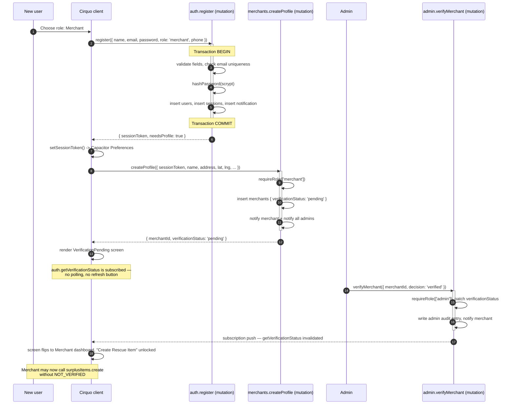

# Cirquo API — Authentication, Sessions & Profiles

| Field | Value |
|---|---|
| **Document** | `docs/api/API_AUTH.md` |
| **Scope** | Registration, login, sessions, password lifecycle, profile creation, verification gate |
| **Backend** | Convex (`convex/auth.ts`, `convex/merchants.ts`, `convex/processors.ts`, `convex/profiles.ts`) |
| **Roles covered** | Consumer · Merchant · Organic Processor · Admin (read-only note) |
| **Auth model** | Opaque session token in a `sessions` table, verified per call |
| **Status legend** | ✅ implemented · 📋 planned |
| **Implemented today** | `users.getByEmail` ✅, `merchants.getByOwner` ✅ — everything else 📋 |
| **Conventions** | See [`API.md`](./API.md) §7 (units, ids) and §9 (error model) |

---

## 1. Auth model overview

Cirquo does not use Convex Auth, Clerk, or Auth0. We implement session tokens directly for three reasons:

1. **Role is a first-class domain concept.** Consumer, Merchant, Organic Processor, and Admin have fundamentally different capability sets and different verification lifecycles. Bolting that onto a third-party identity provider's custom-claims mechanism adds a synchronisation problem we do not need.
2. **The verification gate is a server-side business rule**, not an identity property. A Merchant is authenticated the moment they register but cannot list a Rescue Item until an Admin sets `verificationStatus = 'verified'`. That gate must be enforced in the same transaction as the write it guards.
3. **Capacitor persistence.** The mobile build stores the token in native preferences. An opaque server-side token can be revoked instantly by deleting one row — a stateless JWT cannot.

### 1.1 Token lifecycle

| Property | Value | Rationale |
|---|---|---|
| Format | 32 random bytes, base64url — opaque, ~43 chars | No structure to parse, nothing to forge |
| Generation | `crypto.getRandomValues(new Uint8Array(32))` | CSPRNG; never `Math.random()` |
| Storage (server) | `sessions.token`, indexed `by_token` | O(1) lookup and O(1) revocation |
| Storage (web) | `localStorage` key `cirquo.session` | Survives reload; XSS risk mitigated by CSP + React escaping |
| Storage (mobile) | Capacitor `Preferences` (native, app-sandboxed) | Survives app restart; not in the WebView storage |
| Lifetime | 30 days (`expiresAt = createdAt + 2_592_000_000`) | Long enough for a market vendor who opens the app twice a week |
| Sliding renewal | `auth.refreshSession` extends when < 7 days remain | Avoids surprise logouts mid-pickup |
| Revocation | Delete the `sessions` row | Immediate; the next call fails `SESSION_EXPIRED` |
| Transport | Explicit `sessionToken` argument on every guarded function | Convex RPC has no cookie/header layer for app args |
| Rotation on password change | All other sessions deleted | Standard credential-compromise response |

### 1.2 Why the token is an explicit argument

Convex functions receive typed arguments, not an HTTP request. There is no ambient `Authorization` header to read. So every guarded function takes `sessionToken: v.string()` as its first argument. This is verbose but honest — the auth dependency is visible in the signature, and there is no hidden global that a test could forget to set.

The client wraps it once:

```ts
// src/lib/session.ts
import { Preferences } from '@capacitor/preferences'

const KEY = 'cirquo.session'

export async function getSessionToken(): Promise<string | null> {
  const { value } = await Preferences.get({ key: KEY })   // Capacitor shims to localStorage on web
  return value
}

export async function setSessionToken(token: string): Promise<void> {
  await Preferences.set({ key: KEY, value: token })
}

export async function clearSessionToken(): Promise<void> {
  await Preferences.remove({ key: KEY })
}
```

```ts
// src/hooks/useSession.ts — every screen reads the token from one place
export function useSessionToken(): string | null {
  const [token, setToken] = useState<string | null>(null)
  useEffect(() => { void getSessionToken().then(setToken) }, [])
  return token
}

// Queries are skipped until the token is known — `'skip'` prevents a spurious AUTH_REQUIRED
const token = useSessionToken()
const me = useQuery(api.auth.getCurrentUser, token ? { sessionToken: token } : 'skip')
```

### 1.3 Password hashing

| Aspect | Decision |
|---|---|
| Algorithm | **scrypt** (`N = 16384, r = 8, p = 1`, 32-byte output) |
| Salt | 16 random bytes per user, CSPRNG |
| Stored format | `scrypt$16384$8$1$<saltB64>$<hashB64>` in `users.passwordHash` |
| Why not bcrypt | No maintained pure-WASM bcrypt that runs cleanly in the Convex V8 isolate; scrypt is available and memory-hard |
| Why not Argon2id | Preferred in principle, but the WASM bundle exceeds our function-size comfort zone; scrypt at these parameters is a defensible second choice and documented as such |
| Why not plain SHA-256 | Not memory-hard, not salted by default, GPU-trivial. Never acceptable for passwords. |
| Comparison | Constant-time byte comparison, never `===` on the derived key |
| Upgrade path | Prefix-tagged format means a future `argon2id$...` can coexist; on successful login with an old prefix, rehash and patch |

```ts
// convex/lib/password.ts
import { scrypt } from '@noble/hashes/scrypt'
import { randomBytes } from '@noble/hashes/utils'

const N = 16384, r = 8, p = 1, DK_LEN = 32

function b64(bytes: Uint8Array): string {
  return btoa(String.fromCharCode(...bytes))
}
function unb64(s: string): Uint8Array {
  return Uint8Array.from(atob(s), (c) => c.charCodeAt(0))
}

export function hashPassword(plain: string): string {
  const salt = randomBytes(16)
  const dk = scrypt(new TextEncoder().encode(plain), salt, { N, r, p, dkLen: DK_LEN })
  return `scrypt$${N}$${r}$${p}$${b64(salt)}$${b64(dk)}`
}

export function verifyPassword(plain: string, stored: string): boolean {
  const parts = stored.split('$')
  if (parts.length !== 6 || parts[0] !== 'scrypt') return false
  const [, sN, sr, sp, saltB64, hashB64] = parts
  const salt = unb64(saltB64)
  const expected = unb64(hashB64)
  const dk = scrypt(new TextEncoder().encode(plain), salt, {
    N: Number(sN), r: Number(sr), p: Number(sp), dkLen: expected.length,
  })
  // constant-time comparison
  let diff = dk.length ^ expected.length
  for (let i = 0; i < Math.min(dk.length, expected.length); i++) diff |= dk[i] ^ expected[i]
  return diff === 0
}
```

---

## 2. Guard implementations

These three helpers are the entire server-side authorisation layer. Every guarded function starts with one of them. They are documented in full because a reviewer must be able to verify them line by line.

```ts
// convex/lib/guards.ts
import { ConvexError } from 'convex/values'
import { QueryCtx, MutationCtx } from '../_generated/server'
import { Doc, Id } from '../_generated/dataModel'

type Ctx = QueryCtx | MutationCtx
export type Role = 'consumer' | 'merchant' | 'processor' | 'admin'

function fail(code: string, message: string, details?: Record<string, unknown>): never {
  throw new ConvexError({ code, message, details })
}

/**
 * Resolves a session token to an active user.
 * Throws AUTH_REQUIRED, SESSION_EXPIRED, or ACCOUNT_SUSPENDED.
 * Works in both query and mutation contexts — expired sessions are NOT deleted here,
 * because a query context cannot write. A cron sweeps expired rows instead.
 */
export async function requireAuth(ctx: Ctx, sessionToken: string): Promise<Doc<'users'>> {
  if (!sessionToken || sessionToken.length < 20) {
    fail('AUTH_REQUIRED', 'Missing or malformed session token.')
  }

  const session = await ctx.db
    .query('sessions')
    .withIndex('by_token', (q) => q.eq('token', sessionToken))
    .unique()

  if (!session) {
    fail('AUTH_REQUIRED', 'Session not found.')
  }

  if (session.expiresAt <= Date.now()) {
    fail('SESSION_EXPIRED', 'Session has expired.')
  }

  const user = await ctx.db.get(session.userId)
  if (!user) {
    // Session outlived its user — treat as unauthenticated, never as a server error.
    fail('AUTH_REQUIRED', 'Session refers to a missing user.')
  }

  if (user.status === 'suspended') {
    fail('ACCOUNT_SUSPENDED', 'This account has been suspended.')
  }

  return user
}

/**
 * Authenticates, then asserts the user holds one of the allowed roles.
 * Throws FORBIDDEN with no detail about what role WOULD have been accepted.
 */
export async function requireRole(
  ctx: Ctx,
  sessionToken: string,
  allowed: readonly Role[],
): Promise<Doc<'users'>> {
  const user = await requireAuth(ctx, sessionToken)
  if (!allowed.includes(user.role as Role)) {
    fail('FORBIDDEN', `Role '${user.role}' is not permitted to call this function.`)
  }
  return user
}

/**
 * Asserts the authenticated user owns the given document, by comparing an owner field.
 * Admins bypass ownership (they are trusted and every admin action is audited).
 */
export function requireOwnership(
  user: Doc<'users'>,
  ownerId: Id<'users'>,
  resource: string,
): void {
  if (user.role === 'admin') return
  if (user._id !== ownerId) {
    fail('FORBIDDEN', `You do not own this ${resource}.`)
  }
}

/**
 * Verification gate. Merchants cannot list; Processors cannot accept batches or log
 * intake, until an Admin sets verificationStatus = 'verified'.
 */
export async function requireVerifiedMerchant(
  ctx: Ctx,
  user: Doc<'users'>,
): Promise<Doc<'merchants'>> {
  const merchant = await ctx.db
    .query('merchants')
    .withIndex('by_owner', (q) => q.eq('ownerId', user._id))
    .unique()

  if (!merchant) {
    fail('NOT_FOUND', 'No merchant profile exists for this account.')
  }
  if (merchant.verificationStatus !== 'verified') {
    fail('NOT_VERIFIED', 'Merchant account is not verified.', {
      verificationStatus: merchant.verificationStatus,
    })
  }
  return merchant
}

export async function requireVerifiedProcessor(
  ctx: Ctx,
  user: Doc<'users'>,
): Promise<Doc<'processors'>> {
  const processor = await ctx.db
    .query('processors')
    .withIndex('by_owner', (q) => q.eq('ownerId', user._id))
    .unique()

  if (!processor) {
    fail('NOT_FOUND', 'No processor profile exists for this account.')
  }
  if (processor.verificationStatus !== 'verified') {
    fail('NOT_VERIFIED', 'Processor account is not verified.', {
      verificationStatus: processor.verificationStatus,
    })
  }
  return processor
}
```

### 2.1 The guard rule, stated plainly

> **The frontend may hide a button. The server must reject the call regardless.**

Every mutation in Cirquo begins with a guard. There is no function whose safety depends on the UI not rendering a control. A judge with a browser console and the deployment URL can call any public function with any arguments; the guards are what make that uninteresting.

Corollaries we enforce in review:

| Anti-pattern | Why it fails | Correct form |
|---|---|---|
| Trusting a `role` argument from the client | Trivially forged | Read `user.role` from the session-resolved document |
| Trusting a `merchantId` argument for ownership | IDOR | Resolve the merchant from `ownerId = user._id` |
| Checking verification on the client only | Bypassable | `requireVerifiedMerchant` inside the mutation |
| `NOT_FOUND` vs `FORBIDDEN` leaking existence | Enumeration oracle | Return `null` from queries for both cases; `FORBIDDEN` only after existence is already known to the caller |
| Guard in a wrapper the caller can skip | Not enforced | Guard is the first statement of the handler |

---

## 3. Function reference

### `auth.register` 📋
**Type:** mutation · **Auth:** Public · **PRD ref:** AUTH-01, AUTH-02

Creates a user account with a chosen role and immediately issues a session. Admin accounts cannot be created here.

**Arguments**

| Arg | Validator | Required | Notes |
|---|---|---|---|
| `name` | `v.string()` | Yes | 2–80 chars after trim |
| `email` | `v.string()` | Yes | Lowercased and trimmed before storage |
| `password` | `v.string()` | Yes | 8–128 chars; must contain a letter and a digit |
| `role` | `v.union(v.literal('consumer'), v.literal('merchant'), v.literal('processor'))` | Yes | **`admin` is not in the union** — unrepresentable, not merely rejected |
| `phone` | `v.optional(v.string())` | No | Indonesian format; normalised to `+62…` |

**Returns**

```ts
type RegisterResult = {
  userId: Id<'users'>
  sessionToken: string
  expiresAt: number                 // epoch ms
  role: 'consumer' | 'merchant' | 'processor'
  needsProfile: boolean             // true for merchant | processor
}
```

**Authorization** — none; public. Rate limited by IP hash (5 registrations / hour).

**Validation**

1. Rate limit by IP hash → `RATE_LIMITED`
2. `name` trimmed length 2–80 → `VALIDATION_FAILED` (`field: 'name'`)
3. `email` matches a conservative RFC-5322 subset → `VALIDATION_FAILED` (`field: 'email'`)
4. `password` length 8–128 and contains a letter and a digit → `VALIDATION_FAILED` (`field: 'password'`)
5. `phone`, if present, normalises to `+62` + 8–13 digits → `VALIDATION_FAILED` (`field: 'phone'`)
6. No existing user with that email (index `by_email`) → `VALIDATION_FAILED` (`field: 'email'`, message "An account with this email already exists.")
7. `role` is one of the three literals — enforced by the validator itself, so `admin` is rejected at the boundary before the handler runs

**Side effects**

- Insert `users` — `{ name, email, passwordHash, role, phone?, status: 'active', createdAt }`
- Insert `sessions` — `{ userId, token, expiresAt: now + 30d, createdAt }`
- Insert `notifications` — welcome message with a role-appropriate next step
- **No ledger event** — account creation moves no material

**Ledger events** — none.

| Event | Weight delta | Emitted |
|---|---|---|
| — | — | Never; `auth.register` touches no material |

**Errors**

| Code | HTTP equiv. | Meaning | Client handling |
|---|---|---|---|
| `VALIDATION_FAILED` | 422 | A field failed its rule | Highlight `data.field`, preserve form state |
| `RATE_LIMITED` | 429 | Too many registrations from this IP | Disable submit for `retryAfterMs` |
| `INTERNAL_ERROR` | 500 | Unhandled fault | Generic toast |

**Example**

```ts
// client
const register = useMutation(api.auth.register)

const result = await register({
  name: 'Warung Bu Sari',
  email: 'busari@example.com',
  password: 'RescueFood2026',
  role: 'merchant',
  phone: '081234567890',
})

await setSessionToken(result.sessionToken)
navigate(result.needsProfile ? '/merchant/onboarding' : '/discover')
```

```ts
// convex/auth.ts
export const register = mutation({
  args: {
    name: v.string(),
    email: v.string(),
    password: v.string(),
    role: v.union(v.literal('consumer'), v.literal('merchant'), v.literal('processor')),
    phone: v.optional(v.string()),
  },
  handler: async (ctx, args) => {
    const email = args.email.trim().toLowerCase()
    const name = args.name.trim()

    if (name.length < 2 || name.length > 80) {
      fail('VALIDATION_FAILED', 'Name must be 2–80 characters.', { field: 'name' })
    }
    if (!EMAIL_RE.test(email)) {
      fail('VALIDATION_FAILED', 'Enter a valid email address.', { field: 'email' })
    }
    if (args.password.length < 8 || args.password.length > 128 ||
        !/[A-Za-z]/.test(args.password) || !/[0-9]/.test(args.password)) {
      fail('VALIDATION_FAILED', 'Password must be 8+ characters with a letter and a number.',
           { field: 'password' })
    }

    const existing = await ctx.db
      .query('users')
      .withIndex('by_email', (q) => q.eq('email', email))
      .unique()
    if (existing) {
      fail('VALIDATION_FAILED', 'An account with this email already exists.', { field: 'email' })
    }

    const userId = await ctx.db.insert('users', {
      name,
      email,
      passwordHash: hashPassword(args.password),
      role: args.role,
      phone: args.phone ? normalisePhone(args.phone) : undefined,
      status: 'active',
      createdAt: Date.now(),
    })

    const { token, expiresAt } = await createSession(ctx, userId)

    await ctx.db.insert('notifications', {
      userId,
      type: 'account',
      title: 'Welcome to Cirquo',
      body: args.role === 'consumer'
        ? 'Find Rescue Items near you and collect them in person.'
        : 'Complete your profile to begin verification.',
      read: false,
      createdAt: Date.now(),
    })

    return { userId, sessionToken: token, expiresAt, role: args.role,
             needsProfile: args.role !== 'consumer' }
  },
})
```

**Why `admin` is not self-registerable (AUTH-02).** The role union does not contain `'admin'`, so the argument validator rejects it before the handler executes — there is no branch to forget. Admin accounts are provisioned manually via a one-off `internalMutation` run from the Convex CLI by someone holding deployment credentials. See [`API_ADMIN.md`](./API_ADMIN.md) §1.

---

### `auth.login` 📋
**Type:** mutation · **Auth:** Public · **PRD ref:** AUTH-03

Verifies credentials and issues a new session token.

**Arguments**

| Arg | Validator | Required | Notes |
|---|---|---|---|
| `email` | `v.string()` | Yes | Lowercased and trimmed |
| `password` | `v.string()` | Yes | Plaintext over TLS; never logged |

**Returns**

```ts
type LoginResult = {
  userId: Id<'users'>
  sessionToken: string
  expiresAt: number
  role: 'consumer' | 'merchant' | 'processor' | 'admin'
  name: string
  verificationStatus?: 'pending' | 'verified' | 'rejected' | 'suspended'  // merchant | processor
  needsProfile: boolean
}
```

**Authorization** — none; public. Rate limited 5 attempts / 15 min per `(email, IP hash)`.

**Validation**

1. Rate limit → `RATE_LIMITED` with `details.retryAfterMs`
2. Look up user by `by_email`; **if absent, still run a dummy scrypt** then throw `AUTH_REQUIRED` — see the note below
3. `verifyPassword` → `AUTH_REQUIRED` (identical error and timing to step 2)
4. `user.status === 'suspended'` → `ACCOUNT_SUSPENDED`

**Enumeration safety.** Steps 2 and 3 throw the *same* code with the *same* message ("Incorrect email or password."). We additionally run a throwaway scrypt against a fixed dummy hash when the email is unknown, so the response time does not distinguish "no such user" from "wrong password". Without this, an attacker can enumerate every registered merchant email by timing alone.

**Side effects**

- Insert `sessions` (existing sessions on other devices are **not** revoked — a merchant may legitimately use a phone and a counter tablet)
- Reset the rate-limit counter for that `(email, IP)` on success
- **No ledger event**

**Ledger events** — none.

**Errors**

| Code | HTTP equiv. | Meaning | Client handling |
|---|---|---|---|
| `AUTH_REQUIRED` | 401 | Wrong email or wrong password — indistinguishable | Toast "Incorrect email or password."; keep email, clear password |
| `ACCOUNT_SUSPENDED` | 403 | Admin suspended this account | Show support-contact screen; do not offer retry |
| `RATE_LIMITED` | 429 | Too many attempts | Disable submit, show countdown |

**Example**

```ts
// client
try {
  const r = await login({ email, password })
  await setSessionToken(r.sessionToken)
  const home = { consumer: '/discover', merchant: '/merchant', processor: '/processor', admin: '/admin' }
  navigate(r.needsProfile ? `${home[r.role]}/onboarding` : home[r.role])
} catch (e) {
  handleError(e)   // maps AUTH_REQUIRED -> "Incorrect email or password."
}
```

```ts
// convex/auth.ts (excerpt)
const DUMMY_HASH = 'scrypt$16384$8$1$AAAAAAAAAAAAAAAAAAAAAA==$AAAAAAAAAAAAAAAAAAAAAAAAAAAAAAAAAAAAAAAAAAA='

handler: async (ctx, args) => {
  const email = args.email.trim().toLowerCase()
  await enforceRateLimit(ctx, 'login', `${email}`, { max: 5, windowMs: 15 * 60_000 })

  const user = await ctx.db.query('users')
    .withIndex('by_email', (q) => q.eq('email', email)).unique()

  if (!user) {
    verifyPassword(args.password, DUMMY_HASH)          // constant-ish timing
    fail('AUTH_REQUIRED', 'Incorrect email or password.')
  }
  if (!verifyPassword(args.password, user.passwordHash)) {
    fail('AUTH_REQUIRED', 'Incorrect email or password.')
  }
  if (user.status === 'suspended') {
    fail('ACCOUNT_SUSPENDED', 'This account has been suspended.')
  }
  // ... create session, resolve profile/verification status ...
}
```

---

### `auth.logout` 📋
**Type:** mutation · **Auth:** Any active session · **PRD ref:** AUTH-04

Deletes the current session row, revoking the token immediately and everywhere.

**Arguments**

| Arg | Validator | Required | Notes |
|---|---|---|---|
| `sessionToken` | `v.string()` | Yes | The token being revoked |

**Returns** — `{ success: true }`

**Authorization** — `requireAuth`. An already-invalid token returns `{ success: true }` rather than throwing: logging out of a dead session is the desired end state, and failing would strand the client with a token it cannot clear.

**Validation**

1. Look up the session by `by_token`; if absent → return `{ success: true }` (idempotent)
2. Delete the row

**Side effects** — delete one `sessions` row. Other devices are unaffected. No ledger event.

**Ledger events** — none.

**Errors**

| Code | HTTP equiv. | Meaning | Client handling |
|---|---|---|---|
| — | 200 | Always succeeds | Clear local token, navigate to `/` |

**Example**

```ts
await logout({ sessionToken: token })
await clearSessionToken()
navigate('/')
```

---

### `auth.getCurrentUser` 📋
**Type:** query · **Auth:** Any active session · **PRD ref:** AUTH-05

Returns the authenticated user plus their role-specific profile summary. This is the single source of truth for client-side routing and role gating.

**Arguments**

| Arg | Validator | Required | Notes |
|---|---|---|---|
| `sessionToken` | `v.string()` | Yes | Pass `'skip'` at the hook level when unknown |

**Returns**

```ts
type CurrentUser = {
  _id: Id<'users'>
  name: string
  email: string
  role: 'consumer' | 'merchant' | 'processor' | 'admin'
  phone?: string
  status: 'active' | 'suspended'
  createdAt: number
  profile:
    | { kind: 'none' }
    | { kind: 'merchant'; merchantId: Id<'merchants'>; name: string; city: string
        verificationStatus: 'pending' | 'verified' | 'rejected' | 'suspended' }
    | { kind: 'processor'; processorId: Id<'processors'>; name: string; city: string
        facilityType: string
        verificationStatus: 'pending' | 'verified' | 'rejected' | 'suspended' }
} | null
```

**Authorization** — `requireAuth`, but failures return `null` instead of throwing. A query that throws on every render while the token is loading produces error spam; `null` cleanly means "not signed in".

**Validation** — none beyond session resolution.

**Side effects** — none. Queries never write.

**Ledger events** — none.

**Errors**

| Code | HTTP equiv. | Meaning | Client handling |
|---|---|---|---|
| — | 200 | Returns `null` when unauthenticated or suspended | Render the signed-out shell |

**Reactivity note.** Because this is a query, an Admin calling `admin.verifyMerchant` or `admin.suspendUser` propagates to the affected user's open app **instantly**. A suspended user's session-guarded screens flip to the signed-out shell without any polling. This is one of the clearest demonstrations of the reactive model.

**Example**

```ts
const token = useSessionToken()
const me = useQuery(api.auth.getCurrentUser, token ? { sessionToken: token } : 'skip')

if (me === undefined) return <SplashScreen />         // still loading
if (me === null) return <SignedOutShell />            // not authenticated
if (me.profile.kind === 'merchant' && me.profile.verificationStatus !== 'verified') {
  return <VerificationPending status={me.profile.verificationStatus} />
}
```

---

### `auth.refreshSession` 📋
**Type:** mutation · **Auth:** Any active session · **PRD ref:** AUTH-06

Extends a session that is nearing expiry, so an active user is never logged out mid-task.

**Arguments**

| Arg | Validator | Required | Notes |
|---|---|---|---|
| `sessionToken` | `v.string()` | Yes | Must still be valid — an expired token cannot be refreshed |

**Returns** — `{ expiresAt: number; extended: boolean }`

**Authorization** — `requireAuth`.

**Validation**

1. Session exists and is not expired → `SESSION_EXPIRED` if it is (user must log in again; refresh is not a resurrection mechanism)
2. If `expiresAt - now > 7 days`, return `{ expiresAt, extended: false }` — no write, so no needless invalidation of subscriptions
3. Otherwise patch `expiresAt = now + 30 days`

**Side effects** — patch one `sessions` row (only when actually extending). No ledger event.

**Ledger events** — none.

**Errors**

| Code | HTTP equiv. | Meaning | Client handling |
|---|---|---|---|
| `AUTH_REQUIRED` | 401 | Unknown token | Clear and redirect to login |
| `SESSION_EXPIRED` | 401 | Past `expiresAt` | Clear and redirect to login |

**Client policy** — call once on app foreground (`App.addListener('resume')` in Capacitor) and once per cold start. Not on every navigation; the 7-day threshold makes frequent calls pointless writes.

**Example**

```ts
useEffect(() => {
  const sub = App.addListener('resume', async () => {
    const t = await getSessionToken()
    if (!t) return
    try { await refreshSession({ sessionToken: t }) }
    catch { await clearSessionToken(); navigate('/login') }
  })
  return () => { void sub.then((s) => s.remove()) }
}, [])
```

---

### `auth.requestPasswordReset` 📋
**Type:** **action** · **Auth:** Public · **PRD ref:** AUTH-07

Issues a single-use reset token and emails it. This is an **action**, not a mutation, because it calls an external email provider — and actions are the only function kind permitted to make network calls.

**Arguments**

| Arg | Validator | Required | Notes |
|---|---|---|---|
| `email` | `v.string()` | Yes | Lowercased and trimmed |

**Returns** — `{ sent: true }` — **always**, regardless of whether the email exists.

**Authorization** — none. Rate limited 3 / hour per email address.

**Validation**

1. Rate limit → `RATE_LIMITED`
2. Email format → `VALIDATION_FAILED`
3. Call `internal.auth.createResetToken` (a mutation). If no user matches, that mutation returns `null` and the action still resolves `{ sent: true }`.

**Enumeration safety.** The response is byte-identical for registered and unregistered addresses. The UI copy is deliberately non-committal: *"If an account exists for that address, we've sent reset instructions."* Returning "no such user" would let anyone enumerate the platform's merchant base.

**Side effects**

- Insert `passwordResets` — `{ userId, tokenHash, expiresAt: now + 1h, usedAt: undefined, createdAt }`
- Send an email via the provider (action side)
- **The reset token is stored hashed** (SHA-256), never in plaintext. A database read must not yield usable reset tokens.
- No ledger event

**Ledger events** — none.

**Errors**

| Code | HTTP equiv. | Meaning | Client handling |
|---|---|---|---|
| `VALIDATION_FAILED` | 422 | Malformed email | Highlight the field |
| `RATE_LIMITED` | 429 | Too many requests | Countdown on the button |

**Example**

```ts
// convex/auth.ts
export const requestPasswordReset = action({
  args: { email: v.string() },
  handler: async (ctx, args): Promise<{ sent: true }> => {
    const email = args.email.trim().toLowerCase()

    // A mutation does the DB work; the action only touches the network.
    const issued: { token: string; name: string } | null =
      await ctx.runMutation(internal.auth.createResetToken, { email })

    if (issued) {
      await sendEmail({
        to: email,
        subject: 'Reset your Cirquo password',
        body: renderResetEmail({ name: issued.name, token: issued.token }),
      })
    }
    return { sent: true }   // identical for unknown addresses
  },
})
```

---

### `auth.resetPassword` 📋
**Type:** mutation · **Auth:** Valid reset token · **PRD ref:** AUTH-08

Consumes a reset token, sets a new password, and revokes every existing session.

**Arguments**

| Arg | Validator | Required | Notes |
|---|---|---|---|
| `resetToken` | `v.string()` | Yes | From the email link |
| `newPassword` | `v.string()` | Yes | Same policy as registration |

**Returns** — `{ success: true; sessionsRevoked: number }`

**Authorization** — the reset token itself. No session required.

**Validation**

1. Hash the supplied token and look it up by `by_token_hash` → `AUTH_REQUIRED` if absent
2. `usedAt` is undefined (single use) → `AUTH_REQUIRED`
3. `expiresAt > now` → `AUTH_REQUIRED`
4. Password policy → `VALIDATION_FAILED` (`field: 'newPassword'`)
5. User still exists and is not suspended → `ACCOUNT_SUSPENDED`

All token failures collapse to `AUTH_REQUIRED` with the same message. Distinguishing "expired" from "already used" from "never existed" tells an attacker which tokens were real.

**Side effects**

- Patch `users.passwordHash`
- Patch `passwordResets.usedAt = now`
- **Delete every `sessions` row for that user** — the whole point of a reset is that the previous holder loses access
- Insert `notifications` — "Your password was changed"
- No ledger event

**Ledger events** — none.

**Errors**

| Code | HTTP equiv. | Meaning | Client handling |
|---|---|---|---|
| `AUTH_REQUIRED` | 401 | Token invalid, used, or expired | "This reset link is no longer valid." + link to request a new one |
| `VALIDATION_FAILED` | 422 | Password too weak | Highlight the field |
| `ACCOUNT_SUSPENDED` | 403 | Account suspended | Support-contact screen |

**Example**

```ts
export const resetPassword = mutation({
  args: { resetToken: v.string(), newPassword: v.string() },
  handler: async (ctx, args) => {
    const tokenHash = await sha256Hex(args.resetToken)
    const record = await ctx.db.query('passwordResets')
      .withIndex('by_token_hash', (q) => q.eq('tokenHash', tokenHash)).unique()

    if (!record || record.usedAt !== undefined || record.expiresAt <= Date.now()) {
      fail('AUTH_REQUIRED', 'This reset link is invalid or has expired.')
    }
    assertPasswordPolicy(args.newPassword, 'newPassword')

    const user = await ctx.db.get(record.userId)
    if (!user) fail('AUTH_REQUIRED', 'This reset link is invalid or has expired.')
    if (user.status === 'suspended') fail('ACCOUNT_SUSPENDED', 'This account has been suspended.')

    await ctx.db.patch(user._id, { passwordHash: hashPassword(args.newPassword) })
    await ctx.db.patch(record._id, { usedAt: Date.now() })

    const sessions = await ctx.db.query('sessions')
      .withIndex('by_user', (q) => q.eq('userId', user._id)).collect()
    for (const s of sessions) await ctx.db.delete(s._id)

    await ctx.db.insert('notifications', {
      userId: user._id, type: 'security',
      title: 'Password changed',
      body: 'Your Cirquo password was changed. If this was not you, contact support immediately.',
      read: false, createdAt: Date.now(),
    })

    return { success: true, sessionsRevoked: sessions.length }
  },
})
```

---

### `auth.changePassword` 📋
**Type:** mutation · **Auth:** Any active session · **PRD ref:** AUTH-09

Changes the password for a signed-in user, requiring the current password as proof of presence.

**Arguments**

| Arg | Validator | Required | Notes |
|---|---|---|---|
| `sessionToken` | `v.string()` | Yes | Current session; **survives** the change |
| `currentPassword` | `v.string()` | Yes | Re-authentication |
| `newPassword` | `v.string()` | Yes | Must differ from current |

**Returns** — `{ success: true; otherSessionsRevoked: number }`

**Authorization** — `requireAuth`.

**Validation**

1. `requireAuth` → `AUTH_REQUIRED` / `SESSION_EXPIRED` / `ACCOUNT_SUSPENDED`
2. `verifyPassword(currentPassword, user.passwordHash)` → `AUTH_REQUIRED` (`field: 'currentPassword'`)
3. Password policy on `newPassword` → `VALIDATION_FAILED`
4. `newPassword !== currentPassword` → `VALIDATION_FAILED`

**Side effects**

- Patch `users.passwordHash`
- Delete all `sessions` for the user **except the calling one** — the user stays signed in on this device, and any other device is kicked
- Insert `notifications` — security notice
- No ledger event

**Ledger events** — none.

**Errors**

| Code | HTTP equiv. | Meaning | Client handling |
|---|---|---|---|
| `AUTH_REQUIRED` | 401 | Bad session or wrong current password | Highlight `currentPassword` |
| `VALIDATION_FAILED` | 422 | New password weak or unchanged | Highlight `newPassword` |

---

### `merchants.createProfile` 📋
**Type:** mutation · **Auth:** Merchant (no profile yet) · **PRD ref:** MER-00

Creates the business profile for a Merchant account and places it in the verification queue.

**Arguments**

| Arg | Validator | Required | Notes |
|---|---|---|---|
| `sessionToken` | `v.string()` | Yes | |
| `name` | `v.string()` | Yes | Business name, 2–120 chars |
| `description` | `v.optional(v.string())` | No | ≤ 500 chars |
| `businessType` | `v.string()` | Yes | e.g. `bakery`, `restaurant`, `cafe`, `grocery`, `catering`, `warung` |
| `address` | `v.string()` | Yes | Street address, 5–250 chars |
| `city` | `v.string()` | Yes | `Semarang` for the pilot |
| `latitude` | `v.number()` | Yes | −90…90; sanity-bounded to Indonesia |
| `longitude` | `v.number()` | Yes | −180…180; sanity-bounded to Indonesia |
| `phone` | `v.optional(v.string())` | No | Contact for pickup coordination |

**Returns** — `{ merchantId: Id<'merchants'>; verificationStatus: 'pending' }`

**Authorization** — `requireRole(ctx, sessionToken, ['merchant'])`.

**Validation**

1. `requireRole(['merchant'])` → `FORBIDDEN`
2. No existing merchant profile for `ownerId` (index `by_owner`) → `VALIDATION_FAILED` ("A merchant profile already exists.")
3. String length bounds → `VALIDATION_FAILED`
4. Latitude ∈ [−11, 6], longitude ∈ [95, 141] (Indonesia bounding box) → `VALIDATION_FAILED` (`field: 'latitude' | 'longitude'`)
5. `businessType` in the accepted set → `VALIDATION_FAILED`

Coordinates matter more than they look: they feed the Haversine distance in `discovery.listNearby` and the routing radius check in Circular Routing. A merchant pinned in the ocean silently vanishes from every consumer's map and from every processor's eligible set. Admin re-verifies the pin during verification.

**Side effects**

- Insert `merchants` with `verificationStatus: 'pending'`
- Insert `notifications` for the merchant — "Profile submitted for verification"
- Insert `notifications` for all Admins — "New merchant awaiting verification"
- No ledger event — no material yet exists

**Ledger events** — none.

**Errors**

| Code | HTTP equiv. | Meaning | Client handling |
|---|---|---|---|
| `FORBIDDEN` | 403 | Not a merchant account | Redirect to the correct home |
| `VALIDATION_FAILED` | 422 | Field rule failed, or profile exists | Highlight `field` |
| `AUTH_REQUIRED` | 401 | No valid session | Redirect to login |

**Example**

```ts
const merchant = await createProfile({
  sessionToken,
  name: 'Warung Bu Sari',
  description: 'Home-style Javanese cooking near Simpang Lima.',
  businessType: 'warung',
  address: 'Jl. Pandanaran No. 42, Semarang',
  city: 'Semarang',
  latitude: -6.9847,
  longitude: 110.4092,
  phone: '081234567890',
})
// -> { merchantId: '...', verificationStatus: 'pending' }
```

---

### `processors.createProfile` 📋
**Type:** mutation · **Auth:** Processor (no profile yet) · **PRD ref:** PRO-00

Creates the facility profile for an Organic Processor, declaring the material types accepted, capacity, service radius, and output types. These fields **are** the Circular Routing eligibility contract.

**Arguments**

| Arg | Validator | Required | Notes |
|---|---|---|---|
| `sessionToken` | `v.string()` | Yes | |
| `name` | `v.string()` | Yes | Facility name |
| `description` | `v.optional(v.string())` | No | ≤ 500 chars |
| `facilityType` | `v.string()` | Yes | `bsf_farm`, `composting`, `biogas`, `animal_feed` |
| `address` | `v.string()` | Yes | |
| `city` | `v.string()` | Yes | |
| `latitude` | `v.number()` | Yes | Routing distance origin |
| `longitude` | `v.number()` | Yes | |
| `acceptedMaterialTypes` | `v.array(v.string())` | Yes | Subset of the `materialType` enum, ≥ 1 |
| `dailyCapacityGrams` | `v.number()` | Yes | Integer grams, > 0 |
| `maxPickupRadiusMeters` | `v.number()` | Yes | Integer metres, 500 … 100000 |
| `outputTypes` | `v.array(v.string())` | Yes | Subset of `compost \| bsf_larvae \| animal_feed \| biogas`, ≥ 1 |
| `operatingHoursStart` | `v.number()` | Yes | Minutes from midnight WIB, 0–1439 |
| `operatingHoursEnd` | `v.number()` | Yes | Minutes from midnight WIB, > start |

**Returns** — `{ processorId: Id<'processors'>; verificationStatus: 'pending' }`

**Authorization** — `requireRole(ctx, sessionToken, ['processor'])`.

**Validation**

1. `requireRole(['processor'])` → `FORBIDDEN`
2. No existing profile for `ownerId` → `VALIDATION_FAILED`
3. `acceptedMaterialTypes` non-empty and every element in the enum → `VALIDATION_FAILED`
4. `outputTypes` non-empty and every element in the enum → `VALIDATION_FAILED`
5. `dailyCapacityGrams` a positive integer ≤ 100_000_000 (100 t/day sanity ceiling) → `VALIDATION_FAILED`
6. `maxPickupRadiusMeters` an integer in [500, 100000] → `VALIDATION_FAILED`
7. `operatingHoursEnd > operatingHoursStart`, both in [0, 1439] → `VALIDATION_FAILED`
8. Coordinates within the Indonesia bounding box → `VALIDATION_FAILED`

**Side effects**

- Insert `processors` with `verificationStatus: 'pending'`
- Notifications to the processor and to Admins
- No ledger event

**Ledger events** — none.

**Errors** — as `merchants.createProfile`, plus `VALIDATION_FAILED` for each enum/range rule above.

**Example**

```ts
await createProcessorProfile({
  sessionToken,
  name: 'Semarang BSF Farm',
  facilityType: 'bsf_farm',
  address: 'Jl. Raya Mangkang KM 16, Semarang',
  city: 'Semarang',
  latitude: -6.9591,
  longitude: 110.3210,
  acceptedMaterialTypes: ['prepared_food', 'produce', 'bakery', 'mixed'],
  dailyCapacityGrams: 500_000,        // 500 kg/day
  maxPickupRadiusMeters: 15_000,      // 15 km
  outputTypes: ['bsf_larvae', 'compost'],
  operatingHoursStart: 7 * 60,        // 07:00 WIB
  operatingHoursEnd: 17 * 60,         // 17:00 WIB
})
```

---

### `profiles.update` 📋
**Type:** mutation · **Auth:** Owner (Consumer / Merchant / Processor) · **PRD ref:** AUTH-10

Updates the user-level fields shared by all roles. Business and facility fields are updated through `merchants.updateProfile` and `processors.updateProfile` respectively.

**Arguments**

| Arg | Validator | Required | Notes |
|---|---|---|---|
| `sessionToken` | `v.string()` | Yes | |
| `name` | `v.optional(v.string())` | No | 2–80 chars |
| `phone` | `v.optional(v.string())` | No | Normalised; empty string clears it |

**Returns** — `{ success: true }`

**Authorization** — `requireAuth`; the user can only ever edit their own row, because the row is resolved from the session and never from an argument.

**Validation**

1. `requireAuth` → `AUTH_REQUIRED`
2. At least one field supplied → `VALIDATION_FAILED`
3. Field-level bounds → `VALIDATION_FAILED`

**Notably absent:** `email` and `role`. Email changes require a verification flow we have not built, and role changes would invalidate every ownership relationship in the database. Both are out of scope and deliberately unrepresentable in the argument validator.

**Side effects** — patch `users`. No ledger event.

**Ledger events** — none.

**Errors** — `AUTH_REQUIRED`, `VALIDATION_FAILED`, `ACCOUNT_SUSPENDED`.

---

### `auth.getVerificationStatus` 📋
**Type:** query · **Auth:** Merchant or Processor · **PRD ref:** AUTH-11

Returns the caller's verification state and a precise description of what it currently blocks. This powers the pending-verification screen.

**Arguments**

| Arg | Validator | Required | Notes |
|---|---|---|---|
| `sessionToken` | `v.string()` | Yes | |

**Returns**

```ts
type VerificationStatusResult = {
  role: 'merchant' | 'processor'
  hasProfile: boolean
  verificationStatus: 'pending' | 'verified' | 'rejected' | 'suspended' | null
  submittedAt: number | null
  canOperate: boolean
  blockedActions: string[]      // human-readable, rendered as a list
  rejectionNote?: string        // set by Admin on rejection
}
```

**Authorization** — `requireRole(['merchant', 'processor'])`; returns `null` for consumers rather than throwing, so a shared layout component can call it unconditionally.

**Validation** — none beyond auth.

**Side effects** — none.

**Ledger events** — none.

**Errors**

| Code | HTTP equiv. | Meaning | Client handling |
|---|---|---|---|
| `AUTH_REQUIRED` | 401 | No session | Redirect to login |

**Example**

```ts
const status = useQuery(api.auth.getVerificationStatus, { sessionToken })

// {
//   role: 'merchant',
//   hasProfile: true,
//   verificationStatus: 'pending',
//   submittedAt: 1771190000000,
//   canOperate: false,
//   blockedActions: [
//     'Creating Rescue Items',
//     'Publishing listings',
//     'Confirming pickups',
//   ],
// }
```

**Reactivity payoff.** When an Admin runs `admin.verifyMerchant`, this query is invalidated and the Merchant's screen flips from "Awaiting verification" to the full dashboard with no reload. During the demo this is a two-window moment worth showing.

---

## 4. The verification gate

### 4.1 What it blocks

| Role | `verificationStatus` | Can sign in | Can edit profile | Can list / accept | Notes |
|---|---|---|---|---|---|
| Merchant | `pending` | ✅ | ✅ | ❌ `NOT_VERIFIED` | Sees the pending screen; can prepare nothing that touches material |
| Merchant | `verified` | ✅ | ✅ | ✅ | Full access |
| Merchant | `rejected` | ✅ | ✅ | ❌ `NOT_VERIFIED` | Sees `rejectionNote`; may correct and resubmit |
| Merchant | `suspended` | ✅ | ❌ | ❌ `NOT_VERIFIED` | Existing active listings are moderated by Admin |
| Processor | `pending` | ✅ | ✅ | ❌ `NOT_VERIFIED` | Not included in Circular Routing eligibility |
| Processor | `verified` | ✅ | ✅ | ✅ | Receives routing offers |
| Processor | `rejected` | ✅ | ✅ | ❌ `NOT_VERIFIED` | Never appears in `findEligibleProcessors` |
| Processor | `suspended` | ✅ | ❌ | ❌ `NOT_VERIFIED` | In-flight batches are re-routed by Admin |
| Consumer | n/a | ✅ | ✅ | ✅ | Consumers require no verification |
| Admin | n/a | ✅ | ✅ | ✅ | Manually provisioned; see [`API_ADMIN.md`](./API_ADMIN.md) |

### 4.2 Exactly which functions enforce it

| Function | Guard | Error |
|---|---|---|
| `surplusItems.create` | `requireVerifiedMerchant` | `NOT_VERIFIED` |
| `surplusItems.publish` | `requireVerifiedMerchant` | `NOT_VERIFIED` |
| `surplusItems.update` | `requireVerifiedMerchant` | `NOT_VERIFIED` |
| `orders.confirmPickup` | `requireVerifiedMerchant` | `NOT_VERIFIED` |
| `orders.reportNoShow` | `requireVerifiedMerchant` | `NOT_VERIFIED` |
| `recoveryBatches.accept` | `requireVerifiedProcessor` | `NOT_VERIFIED` |
| `recoveryBatches.decline` | `requireVerifiedProcessor` | `NOT_VERIFIED` |
| `recoveryBatches.logIntake` | `requireVerifiedProcessor` | `NOT_VERIFIED` |
| `recoveryBatches.logOutcome` | `requireVerifiedProcessor` | `NOT_VERIFIED` |
| `internal.routing.findEligibleProcessors` | filters `verificationStatus === 'verified'` | n/a — unverified processors are simply absent |

The gate is applied **inside** each mutation, not in a middleware layer. Convex has no middleware, and a wrapper the caller could bypass would be worse than an explicit first line in every handler.

---

## 5. Session security summary

| Threat | Mitigation |
|---|---|
| Token theft via XSS | CSP headers, React's default escaping, no `dangerouslySetInnerHTML`, no third-party script tags in the app shell |
| Token theft via network | TLS everywhere; Convex WebSocket is `wss://` only |
| Brute-force login | 5 attempts / 15 min per `(email, IP hash)` → `RATE_LIMITED` |
| Credential stuffing | Same rate limit plus generic `AUTH_REQUIRED` on every failure |
| User enumeration via login | Identical error code, identical message, dummy scrypt on unknown email |
| User enumeration via reset | `{ sent: true }` returned unconditionally |
| Session fixation | Token is generated server-side; the client never proposes one |
| Stale sessions after compromise | Password change/reset deletes other sessions; Admin suspension is enforced on every `requireAuth` |
| Long-lived tokens | 30-day cap with sliding renewal; a cron purges rows past `expiresAt` |
| Privilege escalation | `role` is never accepted as an argument on any guarded function; it is read from the session-resolved user document |
| Admin self-registration | `'admin'` is absent from the `auth.register` role union — rejected by the validator, not by a handler branch |
| Reset-token database leak | Reset tokens are stored SHA-256 hashed |
| Timing side channels | Constant-time comparison for password hashes and for the Midtrans signature |

Full threat model in [`../security/SECURITY.md`](../security/SECURITY.md); the role/permission grid is authoritative in [`../security/PERMISSIONS.md`](../security/PERMISSIONS.md).

---

## 6. Registration flow diagram



---

## 7. Implementation status

| Function | Status | Notes |
|---|---|---|
| `users.getByEmail` | ✅ | Exists in `convex/users.ts`; read-only lookup used by planned login |
| `merchants.getByOwner` | ✅ | Exists in `convex/merchants.ts`; read-only |
| `auth.register` | 📋 | Blocks all other auth work |
| `auth.login` | 📋 | Depends on `lib/password.ts` |
| `auth.logout` | 📋 | Trivial once sessions exist |
| `auth.getCurrentUser` | 📋 | Required by every client route guard |
| `auth.refreshSession` | 📋 | Priority B |
| `auth.requestPasswordReset` | 📋 | Priority B — needs an email provider key |
| `auth.resetPassword` | 📋 | Priority B |
| `auth.changePassword` | 📋 | Priority B |
| `auth.getVerificationStatus` | 📋 | Priority A — gates the merchant/processor demo |
| `merchants.createProfile` | 📋 | Priority A |
| `processors.createProfile` | 📋 | Priority A |
| `profiles.update` | 📋 | Priority C |
| `lib/guards.ts` | 📋 | **Highest priority** — every other mutation depends on it |
| `lib/password.ts` | 📋 | Highest priority |
| `passwordResets` table | 📋 | Schema addition needed beyond the current `DATABASE.md` set |
| `rateLimits` table | 📋 | Schema addition needed |

Two tables (`passwordResets`, `rateLimits`) are additions to the schema documented in [`../domain/DATABASE.md`](../domain/DATABASE.md). They are listed here rather than silently assumed, and must be added there before implementation.

---

## Related Documents

| Document | Path | Why |
|---|---|---|
| API overview | [`./API.md`](./API.md) | Conventions, error catalogue, Convex model |
| Consumer API | [`./API_CONSUMER.md`](./API_CONSUMER.md) | What a signed-in consumer can do |
| Merchant API | [`./API_MERCHANT.md`](./API_MERCHANT.md) | Functions gated by merchant verification |
| Processor API | [`./API_PROCESSOR.md`](./API_PROCESSOR.md) | Functions gated by processor verification |
| Admin API | [`./API_ADMIN.md`](./API_ADMIN.md) | Who grants verification, and how it is audited |
| Auth design | [`../security/AUTH.md`](../security/AUTH.md) | Session and password design rationale |
| Permissions matrix | [`../security/PERMISSIONS.md`](../security/PERMISSIONS.md) | Authoritative role capability grid |
| Security overview | [`../security/SECURITY.md`](../security/SECURITY.md) | Threat model |
| Database schema | [`../domain/DATABASE.md`](../domain/DATABASE.md) | `users`, `sessions`, `merchants`, `processors` |
| Roles | [`../spec/ROLES.md`](../spec/ROLES.md) | Actor definitions and responsibilities |
| User flows | [`../spec/USER_FLOW.md`](../spec/USER_FLOW.md) | Onboarding journeys |
| Frontend architecture | [`../architecture/FRONTEND.md`](../architecture/FRONTEND.md) | Route guards, Capacitor persistence |
| Testing | [`../engineering/TESTING.md`](../engineering/TESTING.md) | Auth test cases |

---

**Built for DSDC ANFORCOM 2026**  
**Platform:** Cirquo — Closing the Loop, Saving Every Meal
