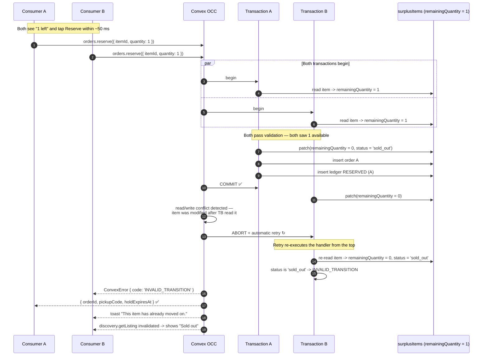
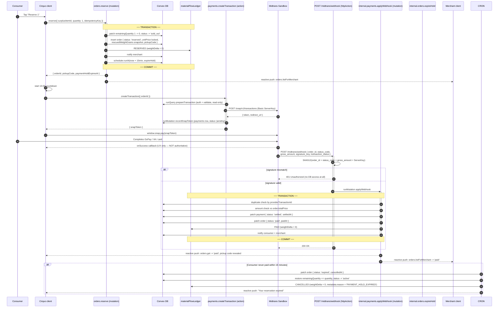

# Cirquo API — Consumer Functions

| Field | Value |
|---|---|
| **Document** | `docs/api/API_CONSUMER.md` |
| **Scope** | Discovery, reservation, payment, pickup code, orders, disputes, consumer impact |
| **Actor** | Consumer |
| **Backend** | Convex (`convex/discovery.ts`, `convex/orders.ts`, `convex/payments.ts`, `convex/impact.ts`, `convex/notifications.ts`, `convex/disputes.ts`) |
| **Payments** | Midtrans Snap — Sandbox |
| **Maps** | Mapbox GL JS (client rendering; distance computed server-side by Haversine) |
| **Status legend** | ✅ implemented · 📋 planned |
| **Implemented today** | Discovery, reservation, pickup/order queries, Midtrans transaction action, and the M6 Consumer impact dashboard/query are implemented. Notifications and disputes remain planned. |
| **Conventions** | [`API.md`](./API.md) §7 units · §9 errors · §10 reactivity |

---

> **Current implementation — 2026-08-29.** The compact reference below is
> the current contract. Sections marked 📋 later in this document are target
> contracts and may contain fields or functions that do not yet exist.

## Current MVP function reference

| Function | Kind | Access | Current contract |
|---|---|---|
| `discovery.listNearby` | query | Public | Requires `{ latitude, longitude, radiusMeters }`; supports one `materialType`, dietary tags, min/max price, and pickup bounds. Returns `{ results, totalMatched, truncated }`. |
| `discovery.getListing` | query | Public | `{ id }`; returns only active, Consumer-visible Rescue Items from verified Merchants, or `null`. |
| `orders.reserve` | mutation | Consumer | `{ surplusItemId, quantity, idempotencyKey?, sessionToken? }`; decrements stock, creates a reserved order, and appends `RESERVED` with zero weight. |
| `orders.listMine` | query | Consumer | `{ sessionToken? }`; returns the authenticated Consumer's orders. |
| `orders.get` | query | Consumer | `{ orderId, sessionToken? }`; returns only the owner's order and reveals the pickup code only after payment. |
| `payments.createTransaction` | action | Consumer | `{ orderId, sessionToken? }`; checks ownership/reserved status, calls Midtrans Sandbox, and stores pending payment context. |
| `impact.getConsumerSummary` | query | Consumer | `{ sessionToken? }`; resolves owned orders then reduces only their `RESCUED` events. See [API_IMPACT.md](API_IMPACT.md). |

---

## 1. The Consumer journey

A Consumer never receives a delivery. Cirquo is not a delivery platform. The consumer:

1. opens the map and sees **Rescue Items** near them, ranked by distance, pickup urgency, and discount;
2. filters by dietary preference, material type, price, and pickup window;
3. opens a listing and reserves a quantity — **the quantity is decremented at this moment**, and a 15-minute payment hold begins;
4. pays through Midtrans Snap within that hold;
5. walks to the merchant during the **pickup window** and reads out a 6-digit **pickup code**;
6. the merchant verifies the presented code → the order becomes
   `picked_up` and the material is recorded as **Rescued**.

If the consumer never shows up, the material does **not** become Residual. It re-enters **Circular Routing** and is offered to an Organic Processor. This distinction is the platform's entire thesis and is enforced in `orders.reportNoShow` (see [`API_MERCHANT.md`](./API_MERCHANT.md)).

---

## 2. Target function reference

### `discovery.listNearby` 📋
**Type:** query · **Auth:** Public (enhanced when authenticated) · **PRD ref:** CON-01, CON-02

Returns active Rescue Items near a coordinate, ranked for the map and the list view.

**Arguments**

| Arg | Validator | Required | Notes |
|---|---|---|---|
| `latitude` | `v.number()` | Yes | Consumer position or map centre |
| `longitude` | `v.number()` | Yes | |
| `radiusMeters` | `v.optional(v.number())` | No | Default `5000`, clamped to `[500, 30000]` |
| `city` | `v.optional(v.string())` | No | Coarse pre-filter; `'Semarang'` for the pilot |
| `materialTypes` | `v.optional(v.array(v.string()))` | No | Subset of the `materialType` enum |
| `dietaryTags` | `v.optional(v.array(v.string()))` | No | **AND** semantics — item must carry all requested tags |
| `maxPrice` | `v.optional(v.number())` | No | IDR integer, inclusive |
| `availableWithinMinutes` | `v.optional(v.number())` | No | `pickupStartAt <= now + n` |
| `sortBy` | `v.optional(v.union(v.literal('distance'), v.literal('urgency'), v.literal('discount'), v.literal('relevance')))` | No | Default `'relevance'` |
| `sessionToken` | `v.optional(v.string())` | No | If present, applies saved dietary preferences and marks already-reserved items |

**Returns**

```ts
type NearbyListing = {
  _id: Id<'surplusItems'>
  name: string
  description?: string
  imageUrl?: string
  materialType: string
  originalPrice: number          // IDR
  currentPrice: number           // IDR
  discountPercent: number        // derived, 0-100, integer
  remainingQuantity: number
  weightPerItemGrams: number
  pickupStartAt: number          // epoch ms
  pickupEndAt: number
  dietaryTags: string[]
  distanceMeters: number         // Haversine, integer
  minutesUntilWindowCloses: number
  merchant: {
    _id: Id<'merchants'>
    name: string
    businessType: string
    latitude: number
    longitude: number
    address: string
  }
  relevanceScore: number         // 0-100, only meaningful for sortBy: 'relevance'
}

type ListNearbyResult = {
  items: NearbyListing[]         // hard-capped at 200
  totalMatched: number           // before the cap
  truncated: boolean
  centre: { latitude: number; longitude: number; radiusMeters: number }
}
```

**Authorization** — public. Anonymous browsing is deliberate: a consumer should see what Cirquo offers before creating an account. `sessionToken`, when supplied, only *adds* personalisation; it never restricts results.

**Validation**

1. `latitude ∈ [-90, 90]`, `longitude ∈ [-180, 180]` → `VALIDATION_FAILED`
2. `radiusMeters` clamped server-side to `[500, 30000]` — **clamped, not rejected**, because a slightly out-of-range map viewport is a UI artefact, not user error
3. `materialTypes` elements in the enum → `VALIDATION_FAILED`
4. `dietaryTags` elements in the known tag set → `VALIDATION_FAILED`
5. `maxPrice` a non-negative integer → `VALIDATION_FAILED`

**Side effects** — none. Queries never write.

**Ledger events** — none.

**Errors**

| Code | HTTP equiv. | Meaning | Client handling |
|---|---|---|---|
| `VALIDATION_FAILED` | 422 | Bad coordinates or unknown filter value | Fall back to the city centre; log a client bug |

---

#### 2.1 The geospatial limitation — stated plainly

**Convex has no geospatial index.** There is no `GEO` index type, no R-tree, no `ST_DWithin`, no PostGIS equivalent. A latitude/longitude proximity search cannot be pushed into the database engine.

So `discovery.listNearby` does this instead:

1. fetch candidates using the `by_status` index (`status === 'active'`), optionally narrowed by the `by_city_status` compound index;
2. compute Haversine distance **in application code** for each candidate;
3. filter by `radiusMeters`;
4. apply the remaining filters (material type, dietary tags, price, window);
5. rank;
6. cap at 200 results.

```ts
// convex/lib/geo.ts
const EARTH_RADIUS_M = 6_371_000

/** Great-circle distance in integer metres. */
export function haversineMeters(
  lat1: number, lon1: number, lat2: number, lon2: number,
): number {
  const toRad = (d: number) => (d * Math.PI) / 180
  const dLat = toRad(lat2 - lat1)
  const dLon = toRad(lon2 - lon1)
  const a =
    Math.sin(dLat / 2) ** 2 +
    Math.cos(toRad(lat1)) * Math.cos(toRad(lat2)) * Math.sin(dLon / 2) ** 2
  return Math.round(2 * EARTH_RADIUS_M * Math.asin(Math.sqrt(a)))
}

/**
 * Cheap rectangular pre-filter. Rejects obvious non-matches before the
 * trigonometry, which matters when the candidate set grows.
 */
export function withinBoundingBox(
  lat: number, lon: number, cLat: number, cLon: number, radiusM: number,
): boolean {
  const latDelta = radiusM / 111_320
  const lonDelta = radiusM / (111_320 * Math.cos((cLat * Math.PI) / 180))
  return Math.abs(lat - cLat) <= latDelta && Math.abs(lon - cLon) <= lonDelta
}
```

**Honest cost analysis**

| Active items platform-wide | Docs read per query | Assessment |
|---|---|---|
| 100 (hackathon demo) | 100 | Negligible |
| 1,000 (Semarang pilot) | ~1,000, city-narrowed to ~1,000 | Acceptable; single-digit ms of CPU |
| 10,000 (multi-city) | ~10,000 without a city filter | **Unacceptable** — must migrate |

**Why we accept it now.** The compound `by_city_status` index bounds the scan to a single city. Semarang will not have 10,000 simultaneously active Rescue Items during the pilot, because listings are short-lived by construction — a Rescue Item lives only until its pickup window closes, typically a few hours. The read set is bounded, correct, and simple.

**Migration path when it stops being acceptable.** Add a `geohash7` column (≈153 m cells) to `surplusItems`, index `by_geohash_status`, query the covering cell plus its eight neighbours, then Haversine-refine only those candidates. That converts an O(city) scan into O(neighbourhood) while keeping exact distances. We have not built it because it would be premature optimisation against a load we do not have — but the column and index are a one-migration change, and saying so is more useful than pretending the limitation does not exist.

#### 2.2 Ranking

`sortBy: 'relevance'` combines four normalised signals:

```ts
function relevanceScore(item: Candidate, ctx: RankContext): number {
  // Proximity: 1.0 at 0 m, 0.0 at the search radius.
  const proximity = 1 - Math.min(item.distanceMeters / ctx.radiusMeters, 1)

  // Urgency: rises as the pickup window closes. Material about to expire
  // is what we most want rescued.
  const minutesLeft = (item.pickupEndAt - ctx.now) / 60_000
  const urgency = 1 - Math.min(Math.max(minutesLeft, 0) / 240, 1)   // saturates at 4h

  // Discount depth against the merchant's own original price.
  const discount = (item.originalPrice - item.currentPrice) / item.originalPrice

  // Scarcity: the last unit surfaces above a pile of ten.
  const scarcity = item.remainingQuantity <= 2 ? 1 : 0.5

  return Math.round(
    100 * (0.40 * proximity + 0.30 * urgency + 0.20 * discount + 0.10 * scarcity),
  )
}
```

| Signal | Weight | Why |
|---|---|---|
| Proximity | 40% | Consumers collect in person. Distance is the dominant real-world cost. |
| Urgency | 30% | An item 40 minutes from expiry has the highest chance of becoming Residual if ignored. Surfacing it is the platform's purpose. |
| Discount | 20% | Genuine motivator, but weighting it higher would let merchants game the ranking by inflating `originalPrice`. |
| Scarcity | 10% | Nudge toward completing a listing rather than half-emptying several. |

Weights live in `convex/lib/ranking.ts` as named constants, not magic numbers, and are documented alongside Dynamic Rescue Pricing in [`../impact/ALGORITHM.md`](../impact/ALGORITHM.md).

**Example**

```ts
// convex/discovery.ts
export const listNearby = query({
  args: {
    latitude: v.number(),
    longitude: v.number(),
    radiusMeters: v.optional(v.number()),
    city: v.optional(v.string()),
    materialTypes: v.optional(v.array(v.string())),
    dietaryTags: v.optional(v.array(v.string())),
    maxPrice: v.optional(v.number()),
    availableWithinMinutes: v.optional(v.number()),
    sortBy: v.optional(v.union(
      v.literal('distance'), v.literal('urgency'),
      v.literal('discount'), v.literal('relevance'),
    )),
    sessionToken: v.optional(v.string()),
  },
  handler: async (ctx, args) => {
    const now = Date.now()
    const radius = Math.min(Math.max(args.radiusMeters ?? 5000, 500), 30000)

    // Indexed fetch — never a bare .collect() over the whole table.
    const candidates = args.city
      ? await ctx.db.query('surplusItems')
          .withIndex('by_city_status', (q) => q.eq('city', args.city!).eq('status', 'active'))
          .collect()
      : await ctx.db.query('surplusItems')
          .withIndex('by_status', (q) => q.eq('status', 'active'))
          .collect()

    const merchantCache = new Map<string, Doc<'merchants'>>()
    const results: NearbyListing[] = []
    let totalMatched = 0

    for (const item of candidates) {
      if (item.remainingQuantity <= 0) continue
      if (item.pickupEndAt <= now) continue                 // window already closed
      if (item.processingOnly) continue                     // routed straight to processors
      if (args.materialTypes && !args.materialTypes.includes(item.materialType)) continue
      if (args.maxPrice !== undefined && item.currentPrice > args.maxPrice) continue
      if (args.dietaryTags?.length &&
          !args.dietaryTags.every((t) => item.dietaryTags.includes(t))) continue
      if (args.availableWithinMinutes !== undefined &&
          item.pickupStartAt > now + args.availableWithinMinutes * 60_000) continue

      let merchant = merchantCache.get(item.merchantId)
      if (!merchant) {
        const m = await ctx.db.get(item.merchantId)
        if (!m || m.verificationStatus !== 'verified') continue
        merchantCache.set(item.merchantId, m)
        merchant = m
      }

      if (!withinBoundingBox(merchant.latitude, merchant.longitude,
                             args.latitude, args.longitude, radius)) continue

      const distanceMeters = haversineMeters(
        args.latitude, args.longitude, merchant.latitude, merchant.longitude)
      if (distanceMeters > radius) continue

      totalMatched++
      results.push(toListing(item, merchant, distanceMeters, now, radius))
    }

    sortListings(results, args.sortBy ?? 'relevance')
    return {
      items: results.slice(0, 200),
      totalMatched,
      truncated: totalMatched > 200,
      centre: { latitude: args.latitude, longitude: args.longitude, radiusMeters: radius },
    }
  },
})
```

```ts
// client
const listings = useQuery(api.discovery.listNearby, {
  latitude: -6.9932, longitude: 110.4203,     // Simpang Lima, Semarang
  radiusMeters: 5000,
  city: 'Semarang',
  dietaryTags: ['halal'],
  sortBy: 'relevance',
})
// Re-renders automatically the instant anyone reserves one of these items.
```

---

### `discovery.getListing` 📋
**Type:** query · **Auth:** Public · **PRD ref:** CON-03

Full detail for one Rescue Item, including merchant context and live availability.

**Arguments**

| Arg | Validator | Required | Notes |
|---|---|---|---|
| `surplusItemId` | `v.id('surplusItems')` | Yes | Opaque id from `listNearby` |
| `latitude` | `v.optional(v.number())` | No | If supplied, `distanceMeters` is computed |
| `longitude` | `v.optional(v.number())` | No | |
| `sessionToken` | `v.optional(v.string())` | No | Adds `myActiveOrder` when authenticated |

**Returns**

```ts
type ListingDetail = {
  _id: Id<'surplusItems'>
  name: string
  description?: string
  imageUrl?: string
  materialType: string
  originalPrice: number
  currentPrice: number
  discountPercent: number
  initialQuantity: number
  remainingQuantity: number
  weightPerItemGrams: number
  pickupStartAt: number
  pickupEndAt: number
  dietaryTags: string[]
  status: string
  publishedAt?: number
  isReservable: boolean
  notReservableReason?:
    | 'SOLD_OUT' | 'WINDOW_CLOSED' | 'NOT_ACTIVE' | 'PROCESSING_ONLY'
  distanceMeters?: number
  merchant: {
    _id: Id<'merchants'>
    name: string
    description?: string
    businessType: string
    address: string
    city: string
    latitude: number
    longitude: number
    phone?: string          // revealed only after the caller has a paid order
  }
  myActiveOrder?: { orderId: Id<'orders'>; status: string; quantity: number }
} | null
```

**Authorization** — public for `active`, `reserved_partial`, and `sold_out` items. Returns `null` for `draft`, `moderated`, and any recovery-stage status, so consumers never see items that are not theirs to reserve.

**Validation** — `v.id('surplusItems')` guarantees the id belongs to that table. A non-existent id returns `null`, never an error.

**Side effects** — none.

**Ledger events** — none.

**Errors**

| Code | HTTP equiv. | Meaning | Client handling |
|---|---|---|---|
| — | 200 | `null` for missing or non-visible items | Render "This item is no longer available." |

**Privacy note.** `merchant.phone` is returned **only** when the caller holds a `paid` order for this item. Before payment, a consumer has no need for the merchant's direct line, and exposing it on every public listing would make the platform a phone-number scraper.

---

### `discovery.getFilters` 📋
**Type:** query · **Auth:** Public · **PRD ref:** CON-04

Returns the filter vocabulary with live counts, so the UI never offers a filter that would return zero results.

**Arguments**

| Arg | Validator | Required | Notes |
|---|---|---|---|
| `city` | `v.optional(v.string())` | No | Scopes the counts |

**Returns**

```ts
type FiltersResult = {
  materialTypes: { value: string; label: string; count: number }[]
  dietaryTags: { value: string; label: string; count: number }[]
  priceRange: { min: number; max: number }        // IDR, across active items
  activeCount: number
  updatedAt: number
}
```

**Authorization** — public.

**Validation** — none.

**Side effects** — none.

**Ledger events** — none.

**Errors** — none in normal operation.

**Dietary preference filtering** uses the tag set `halal`, `vegetarian`, `vegan`, `gluten_free`, `dairy_free`, `nut_free`, `seafood`. In the Indonesian market `halal` is the highest-traffic filter by a wide margin, and the UI pins it first. Tags are **merchant-declared**, not verified by Cirquo, and both the API docs and the UI say so plainly — a platform that implied certification it does not perform would be making a claim it cannot support.

---

### `orders.reserve` 📋
**Type:** mutation · **Auth:** Consumer · **PRD ref:** CON-05, CON-06

**The most important mutation in Cirquo.** Reserves a quantity of a Rescue Item, decrements availability atomically, locks the price, snapshots the weight, generates a pickup code, starts the 15-minute payment hold, and writes the `RESERVED` ledger event — all in one transaction.

**Arguments**

| Arg | Validator | Required | Notes |
|---|---|---|---|
| `sessionToken` | `v.string()` | Yes | |
| `surplusItemId` | `v.id('surplusItems')` | Yes | |
| `quantity` | `v.number()` | Yes | Integer ≥ 1, ≤ 10 per order |
| `idempotencyKey` | `v.optional(v.string())` | No | Client UUID v4, one per checkout attempt |

**Returns**

```ts
type ReserveResult = {
  orderId: Id<'orders'>
  pickupCode: string             // 6 digits
  quantity: number
  unitPrice: number              // IDR — locked at this instant
  totalPrice: number             // IDR
  rescuedWeightGrams: number     // snapshot: quantity * weightPerItemGrams
  paymentHoldExpiresAt: number   // epoch ms — now + 15 min
  pickupStartAt: number
  pickupEndAt: number
  merchantName: string
  merchantAddress: string
  replayed: boolean              // true if returned via idempotency key
}
```

**Authorization** — `requireRole(ctx, sessionToken, ['consumer'])`. Consumers only: a merchant reserving their own listing would corrupt the impact figures, and an admin doing it would corrupt the audit trail.

**Validation** — in this exact order:

1. `requireRole(['consumer'])` → `AUTH_REQUIRED` / `FORBIDDEN` / `ACCOUNT_SUSPENDED`
2. Idempotency replay check → `IDEMPOTENCY_CONFLICT` if the key was reused with different arguments; otherwise return the prior order with `replayed: true`
3. Rate limit, 10 reservations / 10 min per user → `RATE_LIMITED` (blocks reserve-everything-then-abandon inventory locking)
4. `ctx.db.get(surplusItemId)` → `NOT_FOUND`
5. `item.status === 'active' || 'reserved_partial'` → `INVALID_TRANSITION`
6. `!item.processingOnly` → `INVALID_TRANSITION` (this material is routed straight to processors)
7. `quantity` integer, `1 ≤ quantity ≤ 10` → `VALIDATION_FAILED` (`field: 'quantity'`)
8. `item.remainingQuantity >= quantity` → `INSUFFICIENT_QUANTITY` with `details.remaining`
9. `now < item.pickupEndAt` → `PICKUP_WINDOW_CLOSED`
10. Merchant exists and `verificationStatus === 'verified'` → `NOT_VERIFIED`
11. No existing `reserved` or `paid` order by this user for this item → `ALREADY_RESERVED` (one open order per item per consumer; increase quantity instead)

**Side effects**

| Target | Write |
|---|---|
| `surplusItems` | `remainingQuantity -= quantity`; `status` → `sold_out` if it hits 0, else `reserved_partial` |
| `orders` | Insert `{ userId, surplusItemId, merchantId, quantity, unitPrice, totalPrice, rescuedWeightGrams, platformFeeAmount, pickupCode, status: 'reserved', createdAt, paymentHoldExpiresAt }` |
| `materialFlowLedger` | Insert `RESERVED` — **same transaction** |
| `notifications` | Merchant: "New reservation" |
| Scheduler | `internal.orders.expireHold` at `paymentHoldExpiresAt` |

**Ledger events**

| Event | `weightDeltaGrams` | Metadata | Why |
|---|---|---|---|
| `RESERVED` | `0` | `{ quantity, unitPrice, totalPrice, reservedWeightGrams }` | Reservation is an **intent**, not a material outcome. The mass has not left the merchant. Only `RESCUED`, `PROCESSED`, and expiry-style events carry non-zero deltas, which is what makes weight conservation checkable. The reserved weight is recorded in metadata for traceability without polluting the arithmetic. |

**Errors**

| Code | HTTP equiv. | Meaning | Client handling |
|---|---|---|---|
| `AUTH_REQUIRED` | 401 | No valid session | Open the login sheet, preserve intent, retry after |
| `FORBIDDEN` | 403 | Not a consumer account | Explain that merchants cannot reserve |
| `NOT_FOUND` | 404 | Item gone | Return to the map |
| `INVALID_TRANSITION` | 409 | Item not reservable | "This item is no longer available." |
| `INSUFFICIENT_QUANTITY` | 409 | Fewer units remain | "Only N left." — the reactive query already shows N |
| `PICKUP_WINDOW_CLOSED` | 409 | Window ended | "Pickup window has closed." |
| `ALREADY_RESERVED` | 409 | Open order exists | Deep-link to that order |
| `NOT_VERIFIED` | 403 | Merchant unverified/suspended | "Unavailable right now." |
| `VALIDATION_FAILED` | 422 | Bad quantity | Reset the stepper |
| `RATE_LIMITED` | 429 | Too many reservations | Countdown |
| `IDEMPOTENCY_CONFLICT` | 409 | Key reused with different args | Client bug — log loudly |
| `LEDGER_WRITE_FAILED` | 500 | Ledger append failed | Generic toast; **quantity decrement rolled back** |

**Implementation**

```ts
// convex/orders.ts
export const reserve = mutation({
  args: {
    sessionToken: v.string(),
    surplusItemId: v.id('surplusItems'),
    quantity: v.number(),
    idempotencyKey: v.optional(v.string()),
  },
  handler: async (ctx, args) => {
    const user = await requireRole(ctx, args.sessionToken, ['consumer'])
    const now = Date.now()

    // --- idempotency replay ------------------------------------------------
    if (args.idempotencyKey) {
      const prior = await ctx.db.query('orders')
        .withIndex('by_idempotency_key', (q) => q.eq('idempotencyKey', args.idempotencyKey))
        .unique()
      if (prior) {
        if (prior.userId !== user._id ||
            prior.surplusItemId !== args.surplusItemId ||
            prior.quantity !== args.quantity) {
          fail('IDEMPOTENCY_CONFLICT', 'Idempotency key reused with different arguments.')
        }
        return { ...summarise(prior), replayed: true }
      }
    }

    await enforceRateLimit(ctx, 'reserve', user._id, { max: 10, windowMs: 10 * 60_000 })

    // --- read + validate ---------------------------------------------------
    const item = await ctx.db.get(args.surplusItemId)
    if (!item) fail('NOT_FOUND', 'Rescue Item not found.')

    if (item.status !== 'active' && item.status !== 'reserved_partial') {
      fail('INVALID_TRANSITION', `Cannot reserve an item with status '${item.status}'.`)
    }
    if (item.processingOnly) {
      fail('INVALID_TRANSITION', 'This item is routed directly to an Organic Processor.')
    }
    if (!Number.isInteger(args.quantity) || args.quantity < 1 || args.quantity > 10) {
      fail('VALIDATION_FAILED', 'Quantity must be a whole number between 1 and 10.',
           { field: 'quantity' })
    }
    if (item.remainingQuantity < args.quantity) {
      fail('INSUFFICIENT_QUANTITY', 'Not enough remaining quantity.', {
        field: 'quantity', requested: args.quantity, remaining: item.remainingQuantity,
      })
    }
    if (now >= item.pickupEndAt) {
      fail('PICKUP_WINDOW_CLOSED', 'The pickup window for this item has closed.')
    }

    const merchant = await ctx.db.get(item.merchantId)
    if (!merchant) fail('NOT_FOUND', 'Merchant not found.')
    if (merchant.verificationStatus !== 'verified') {
      fail('NOT_VERIFIED', 'This merchant is not currently able to accept reservations.')
    }

    const openOrders = await ctx.db.query('orders')
      .withIndex('by_user_item', (q) =>
        q.eq('userId', user._id).eq('surplusItemId', args.surplusItemId))
      .collect()
    if (openOrders.some((o) => o.status === 'reserved' || o.status === 'paid')) {
      fail('ALREADY_RESERVED', 'You already have an open order for this item.')
    }

    // --- writes: all atomic ------------------------------------------------
    const remaining = item.remainingQuantity - args.quantity
    await ctx.db.patch(item._id, {
      remainingQuantity: remaining,
      status: remaining === 0 ? 'sold_out' : 'reserved_partial',
    })

    const unitPrice = item.currentPrice                       // PRICE LOCK
    const totalPrice = unitPrice * args.quantity
    const rescuedWeightGrams = item.weightPerItemGrams * args.quantity   // WEIGHT SNAPSHOT
    const platformFeeAmount = Math.round(totalPrice * PLATFORM_FEE_RATE) // 0.10
    const pickupCode = generatePickupCode()
    const paymentHoldExpiresAt = now + PAYMENT_HOLD_MS       // 15 * 60_000

    const orderId = await ctx.db.insert('orders', {
      userId: user._id,
      surplusItemId: item._id,
      merchantId: item.merchantId,
      quantity: args.quantity,
      unitPrice,
      totalPrice,
      rescuedWeightGrams,
      platformFeeAmount,
      pickupCode,
      status: 'reserved',
      createdAt: now,
      paymentHoldExpiresAt,
      idempotencyKey: args.idempotencyKey,
    })

    // --- LEDGER: same transaction, non-negotiable --------------------------
    await recordLedgerEvent(ctx, {
      surplusItemId: item._id,
      orderId,
      eventType: 'RESERVED',
      weightDeltaGrams: 0,
      actorId: user._id,
      actorRole: 'consumer',
      metadata: {
        quantity: args.quantity,
        unitPrice,
        totalPrice,
        reservedWeightGrams: rescuedWeightGrams,
        remainingQuantity: remaining,
      },
      occurredAt: now,
    })

    await ctx.db.insert('notifications', {
      userId: merchant.ownerId,
      type: 'order',
      title: 'New reservation',
      body: `${args.quantity} × ${item.name} reserved. Awaiting payment.`,
      link: `/merchant/orders/${orderId}`,
      read: false,
      createdAt: now,
    })

    await ctx.scheduler.runAt(paymentHoldExpiresAt,
      internal.orders.expireHold, { orderId })

    return {
      orderId, pickupCode, quantity: args.quantity, unitPrice, totalPrice,
      rescuedWeightGrams, paymentHoldExpiresAt,
      pickupStartAt: item.pickupStartAt, pickupEndAt: item.pickupEndAt,
      merchantName: merchant.name, merchantAddress: merchant.address,
      replayed: false,
    }
  },
})
```

#### 2.3 Why the quantity is decremented at reservation, not at payment

This is the single design decision most likely to be questioned, so here is the full reasoning.

| Approach | Overselling risk | Consequence |
|---|---|---|
| Decrement at **payment** | **High** — the entire payment window is unprotected. Five consumers can all "reserve" the last portion of nasi goreng, all pay, and four arrive to nothing. | A merchant must refund and apologise in person. The platform's promise is broken at the moment of physical collection. |
| Decrement at **reservation** (Cirquo) | **Zero** — the transaction serialises. Exactly one consumer wins the last unit. | An abandoned reservation locks one unit for at most 15 minutes, then the cron restores it. |

The cost of the chosen approach is a bounded, automatically-released hold. The cost of the alternative is a consumer standing at a warung being told the food is gone. For a platform whose entire value proposition is that the food actually gets collected, only one of those is acceptable.

The 15-minute hold is the tuning knob: long enough for a Midtrans bank transfer or e-wallet redirect on a mediocre mobile connection, short enough that an abandoned checkout does not sit on inventory through a merchant's peak hour.

#### 2.4 Concurrency — two consumers racing for the last unit



**What guarantees correctness:** Convex runs mutations under optimistic concurrency control. Each transaction records its read set; at commit, if any document in that read set changed, the transaction aborts and the handler is **re-executed from the top** against fresh data. On the retry, Consumer B's validation sees `remainingQuantity = 0` and `status = 'sold_out'` and throws.

There is no lock to acquire, no lock to forget, and no application-level compare-and-swap to get wrong. Critically, the retry re-runs **all** validation — so this is only safe because our handler is deterministic and does all its checks after its reads. A handler that cached a value from before the read set was established would break this guarantee, which is why `Date.now()` is captured once at the top and reused rather than called repeatedly.

**Test case (`convex-test`):**

```ts
test('exactly one of two concurrent reservations wins the last unit', async () => {
  const t = convexTest(schema)
  const itemId = await seedItem(t, { remainingQuantity: 1, weightPerItemGrams: 400 })

  const results = await Promise.allSettled([
    t.mutation(api.orders.reserve, { sessionToken: tokenA, surplusItemId: itemId, quantity: 1 }),
    t.mutation(api.orders.reserve, { sessionToken: tokenB, surplusItemId: itemId, quantity: 1 }),
  ])

  const fulfilled = results.filter((r) => r.status === 'fulfilled')
  expect(fulfilled).toHaveLength(1)

  const item = await t.run((ctx) => ctx.db.get(itemId))
  expect(item!.remainingQuantity).toBe(0)
  expect(item!.status).toBe('sold_out')

  // And exactly one RESERVED ledger event exists — the loser wrote nothing.
  const events = await t.run((ctx) =>
    ctx.db.query('materialFlowLedger')
      .withIndex('by_item', (q) => q.eq('surplusItemId', itemId)).collect())
  expect(events.filter((e) => e.eventType === 'RESERVED')).toHaveLength(1)
})
```

The last assertion is the one that matters for the ledger's credibility: the aborted transaction left **no** trace, because the ledger write was inside it.

#### 2.5 Pickup code generation

```ts
function generatePickupCode(): string {
  const bytes = new Uint8Array(4)
  crypto.getRandomValues(bytes)
  const n = new DataView(bytes.buffer).getUint32(0) % 1_000_000
  return n.toString().padStart(6, '0')
}
```

| Property | Value | Rationale |
|---|---|---|
| Format | 6 decimal digits, zero-padded | Readable aloud across a counter in a noisy warung |
| Entropy | ~20 bits (1 in 1,000,000) | Weak in isolation — see below |
| Source | `crypto.getRandomValues` | CSPRNG; `Math.random()` would be predictable |
| Uniqueness | **Not** globally unique | Verified against a specific `orderId`, so collisions across orders are irrelevant |
| Brute-force defence | 5 failed attempts per order → `RATE_LIMITED`, and Admin is notified | Makes 20 bits sufficient |
| Visibility | Consumer via `orders.getPickupCode`; Merchant **never** sees it, only verifies it | The merchant must not be able to self-confirm a pickup that did not happen |

The last row is the important one. If a merchant could read the code, they could mark orders as collected without the consumer present, inflating their own Rescued figures. The merchant supplies a candidate code and the server compares — that is the whole protocol.

---

### `payments.createTransaction` 📋
**Type:** **action** · **Auth:** Consumer (order owner) · **PRD ref:** CON-07

Creates a Midtrans Snap transaction and returns the token the client SDK needs to open the payment sheet.

**Arguments**

| Arg | Validator | Required | Notes |
|---|---|---|---|
| `sessionToken` | `v.string()` | Yes | |
| `orderId` | `v.id('orders')` | Yes | Must be `reserved` and within the hold |

**Returns**

```ts
type CreateTransactionResult = {
  snapToken: string
  redirectUrl: string
  orderRef: string          // 'CIRQUO-ORD-<orderId>'
  expiresAt: number         // = order.paymentHoldExpiresAt
  amount: number            // IDR
}
```

**Authorization** — `requireRole(['consumer'])` then ownership of the order, both performed inside `internal.payments.prepareTransaction` (a query) because an action cannot read the database directly.

**Validation** — performed in the internal query before the Midtrans call:

1. `requireRole(['consumer'])` → `AUTH_REQUIRED` / `FORBIDDEN`
2. Order exists → `NOT_FOUND`
3. `order.userId === user._id` → `FORBIDDEN`
4. `order.status === 'reserved'` → `INVALID_TRANSITION` (already paid, cancelled, or expired)
5. `now < order.paymentHoldExpiresAt` → `PAYMENT_HOLD_EXPIRED`
6. Rate limit 5 / 10 min per order → `RATE_LIMITED`

**Side effects**

- **External:** `POST https://app.sandbox.midtrans.com/snap/v1/transactions` with HTTP Basic auth (`ServerKey:`)
- **DB (via mutation):** insert or patch `payments` with `{ provider: 'midtrans', providerTransactionId: snapToken, amount, status: 'pending', createdAt }`
- **No ledger event.** Creating a payment intent moves no material. The `PAID` event is written by the webhook handler when Midtrans confirms settlement.

**Ledger events** — none from this function.

| Event | Written by | When |
|---|---|---|
| `PAID` | `internal.payments.applyWebhook` (mutation) | On `settlement` / `capture+accept` |

**Errors**

| Code | HTTP equiv. | Meaning | Client handling |
|---|---|---|---|
| `AUTH_REQUIRED` | 401 | No session | Login |
| `FORBIDDEN` | 403 | Not your order | Return to orders |
| `NOT_FOUND` | 404 | Order missing | Return to orders |
| `INVALID_TRANSITION` | 409 | Not `reserved` | Refresh — the reactive query already knows |
| `PAYMENT_HOLD_EXPIRED` | 409 | Past the 15-min hold | "Your reservation expired." → back to the listing |
| `RATE_LIMITED` | 429 | Snap token churn | Countdown |
| `INTERNAL_ERROR` | 500 | Midtrans unreachable or rejected | "Payment service unavailable. Try again." |

#### Why this must be an action

| Constraint | Consequence |
|---|---|
| Convex **mutations cannot make network calls.** | The Midtrans Snap API call is impossible from a mutation. |
| Convex **actions cannot write to the database.** | The action must delegate persistence to a mutation. |
| Actions are **not transactional.** | An action must never write a ledger event — a crash between the external call and the DB write would leave a permanent gap. |

So the flow is necessarily three hops:

```
payments.createTransaction (action)
  → ctx.runQuery(internal.payments.prepareTransaction)   // auth + validation, read-only
  → fetch(Midtrans Snap API)                             // external, non-transactional
  → ctx.runMutation(internal.payments.recordSnapToken)   // persist, transactional
```

If the Midtrans call succeeds but `recordSnapToken` fails, we have a Snap token Midtrans knows about and we do not. That is recoverable and harmless: the consumer retries, gets a fresh token, and the orphaned one simply expires. The **webhook** is the authoritative confirmation of payment, not this action's return value — which is exactly why we can tolerate this seam. Had we tried to write `PAID` here, that same failure would have created a paid order with no ledger event, and the impact numbers would be silently wrong.

**Implementation**

```ts
// convex/payments.ts
export const createTransaction = action({
  args: { sessionToken: v.string(), orderId: v.id('orders') },
  handler: async (ctx, args): Promise<CreateTransactionResult> => {
    // 1) Auth + validation happen in a query — actions cannot read the DB.
    const prep = await ctx.runQuery(internal.payments.prepareTransaction, {
      sessionToken: args.sessionToken,
      orderId: args.orderId,
    })

    const serverKey = process.env.MIDTRANS_SERVER_KEY
    if (!serverKey) {
      throw new ConvexError({ code: 'INTERNAL_ERROR', message: 'Payment not configured.' })
    }

    // 2) External call — only an action may do this.
    const response = await fetch(
      'https://app.sandbox.midtrans.com/snap/v1/transactions',
      {
        method: 'POST',
        headers: {
          'Content-Type': 'application/json',
          Accept: 'application/json',
          Authorization: `Basic ${btoa(`${serverKey}:`)}`,
        },
        body: JSON.stringify({
          transaction_details: {
            order_id: prep.orderRef,               // 'CIRQUO-ORD-<id>'
            gross_amount: prep.amount,             // integer IDR
          },
          item_details: [{
            id: prep.surplusItemId,
            price: prep.unitPrice,
            quantity: prep.quantity,
            name: prep.itemName.slice(0, 50),      // Midtrans field limit
            merchant_name: prep.merchantName.slice(0, 50),
          }],
          customer_details: {
            first_name: prep.customerName,
            email: prep.customerEmail,
            phone: prep.customerPhone,
          },
          expiry: {
            unit: 'minute',
            duration: Math.max(1, Math.floor((prep.holdExpiresAt - Date.now()) / 60_000)),
          },
          credit_card: { secure: true },
        }),
      },
    )

    if (!response.ok) {
      console.error('[midtrans] snap failed', response.status, await response.text())
      throw new ConvexError({
        code: 'INTERNAL_ERROR',
        message: 'Could not start payment. Please try again.',
      })
    }

    const data = (await response.json()) as { token: string; redirect_url: string }

    // 3) Persist via a mutation — actions cannot write.
    await ctx.runMutation(internal.payments.recordSnapToken, {
      orderId: args.orderId,
      snapToken: data.token,
      amount: prep.amount,
    })

    return {
      snapToken: data.token,
      redirectUrl: data.redirect_url,
      orderRef: prep.orderRef,
      expiresAt: prep.holdExpiresAt,
      amount: prep.amount,
    }
  },
})
```

**Client usage**

```ts
const createTransaction = useAction(api.payments.createTransaction)

async function pay(orderId: Id<'orders'>) {
  const { snapToken } = await createTransaction({ sessionToken, orderId })

  window.snap.pay(snapToken, {
    // These callbacks are UX only. None of them mark the order paid —
    // the Midtrans webhook is the sole authority. See API.md §11.
    onSuccess: () => navigate(`/orders/${orderId}?awaiting=confirmation`),
    onPending: () => navigate(`/orders/${orderId}?awaiting=confirmation`),
    onError:   () => toast.error('Payment failed. Please try again.'),
    onClose:   () => toast.info('Payment cancelled. Your reservation is still held.'),
  })
}
```

The comment is load-bearing. A client callback that flipped the order to `paid` would be trivially forgeable from the browser console. The order transitions to `paid` only when a SHA512-verified webhook arrives.

---

### `orders.reserve` → payment sequence



---

### `orders.listMine` 📋
**Type:** query · **Auth:** Consumer · **PRD ref:** CON-08

Paginated list of the caller's orders, enriched with item and merchant context.

**Arguments**

| Arg | Validator | Required | Notes |
|---|---|---|---|
| `sessionToken` | `v.string()` | Yes | |
| `filter` | `v.optional(v.union(v.literal('active'), v.literal('completed'), v.literal('all')))` | No | Default `'all'` |
| `paginationOpts` | `paginationOptsValidator` | Yes | Default 20/page |

`'active'` means `reserved` or `paid`. `'completed'` means `picked_up`, `cancelled`, `expired`, or `refunded`.

**Returns** — `PaginationResult<OrderSummary>` where

```ts
type OrderSummary = {
  _id: Id<'orders'>
  status: 'reserved' | 'paid' | 'picked_up' | 'cancelled' | 'expired' | 'disputed' | 'refunded'
  quantity: number
  unitPrice: number
  totalPrice: number
  rescuedWeightGrams: number
  createdAt: number
  paidAt?: number
  pickedUpAt?: number
  paymentHoldExpiresAt: number
  holdSecondsRemaining: number | null   // null unless status === 'reserved'
  item: { _id: Id<'surplusItems'>; name: string; imageUrl?: string; materialType: string
          pickupStartAt: number; pickupEndAt: number }
  merchant: { _id: Id<'merchants'>; name: string; address: string
              latitude: number; longitude: number }
  canCancel: boolean
  canPay: boolean
  hasDispute: boolean
}
```

**Authorization** — `requireRole(['consumer'])`; the query is scoped by `userId` from the session, so there is no id argument to tamper with.

**Validation** — none beyond auth.

**Side effects** — none.

**Ledger events** — none.

**Errors** — `AUTH_REQUIRED`, `FORBIDDEN`, `ACCOUNT_SUSPENDED`.

**Note on `pickupCode`** — deliberately **absent** from this list view. Codes are fetched one at a time via `orders.getPickupCode`, so a screenshot of the orders list does not leak every code the consumer holds.

**Relationship to `orders.listByUser` ✅** — the existing implemented query is a raw, unenriched read used for early scaffolding. `orders.listMine` supersedes it. `listByUser` will be marked `@deprecated` when `listMine` ships, per the deprecation policy in [`API.md`](./API.md) §16.

---

### `orders.get` 📋
**Type:** query · **Auth:** Consumer (owner) · **PRD ref:** CON-09

Full detail for one order, including the live countdown and pickup instructions.

**Arguments**

| Arg | Validator | Required | Notes |
|---|---|---|---|
| `sessionToken` | `v.string()` | Yes | |
| `orderId` | `v.id('orders')` | Yes | |

**Returns** — `OrderDetail | null`, extending `OrderSummary` with `pickupCode` (owner only, and only once `status === 'paid'`), `payment` summary, `dispute` summary, and a `timeline: { eventType, occurredAt, actorRole }[]` derived from the ledger.

**Authorization** — `requireRole(['consumer'])` + `order.userId === user._id`. A non-owner receives `null`, not `FORBIDDEN`, so order ids cannot be probed for existence.

**Validation** — ownership only.

**Side effects** — none.

**Ledger events** — none. The `timeline` field **reads** ledger events for this order; it never writes.

**Errors**

| Code | HTTP equiv. | Meaning | Client handling |
|---|---|---|---|
| `AUTH_REQUIRED` | 401 | No session | Login |
| — | 200 | `null` for missing or non-owned | "Order not found." |

The consumer-visible `timeline` is a small but genuine expression of the Material Flow Ledger: the consumer sees the same event stream the Admin audit view shows, filtered to their own order.

---

### `orders.cancel` 📋
**Type:** mutation · **Auth:** Consumer (owner) · **PRD ref:** CON-10

Cancels an order before pickup and restores the quantity.

**Arguments**

| Arg | Validator | Required | Notes |
|---|---|---|---|
| `sessionToken` | `v.string()` | Yes | |
| `orderId` | `v.id('orders')` | Yes | |
| `reason` | `v.optional(v.string())` | No | ≤ 200 chars; surfaced to the merchant |

**Returns** — `{ success: true; refundRequired: boolean; restoredQuantity: number }`

**Authorization** — `requireRole(['consumer'])` + ownership.

**Validation**

1. `requireRole(['consumer'])` → `AUTH_REQUIRED` / `FORBIDDEN`
2. Order exists and is owned → `NOT_FOUND`
3. `status ∈ { 'reserved', 'paid' }` → `INVALID_TRANSITION` (a `picked_up` order cannot be cancelled — the food is gone)
4. If `status === 'paid'`, `now < item.pickupStartAt` → `INVALID_TRANSITION`. Once the window has opened, the merchant may already have set the food aside; cancellation becomes a dispute, not a self-service action.
5. `reason` ≤ 200 chars → `VALIDATION_FAILED`

**Side effects**

| Target | Write |
|---|---|
| `orders` | `status = 'cancelled'`, `cancelledAt = now` |
| `surplusItems` | `remainingQuantity += quantity`; `status` → `active` if the window is still open, else left for the expiry cron to route |
| `materialFlowLedger` | `CANCELLED` |
| `notifications` | Merchant: "Order cancelled" |
| `payments` | If paid: mark `refund_pending`; Sandbox refunds are handled by Admin via `admin.resolveDispute` |

**Ledger events**

| Event | `weightDeltaGrams` | Metadata |
|---|---|---|
| `CANCELLED` | `0` | `{ reason, cancelledBy: 'consumer', restoredQuantity, wasPaid }` |

Delta is zero because cancellation returns material to the merchant's available pool. Nothing was rescued and nothing was lost; the mass never moved.

**Errors**

| Code | HTTP equiv. | Meaning | Client handling |
|---|---|---|---|
| `AUTH_REQUIRED` | 401 | No session | Login |
| `NOT_FOUND` | 404 | Missing or not owned | Back to orders |
| `INVALID_TRANSITION` | 409 | Already collected, or window open on a paid order | Offer `disputes.raise` instead |
| `VALIDATION_FAILED` | 422 | Reason too long | Trim |

**Optimistic update** — permitted here (see [`API.md`](./API.md) §10.3). The ledger event is a zero-delta bookkeeping entry and a rollback simply restores the card.

---

### `orders.getPickupCode` 📋
**Type:** query · **Auth:** Consumer (owner, paid) · **PRD ref:** CON-11

Returns the pickup code plus everything needed at the counter.

**Arguments**

| Arg | Validator | Required | Notes |
|---|---|---|---|
| `sessionToken` | `v.string()` | Yes | |
| `orderId` | `v.id('orders')` | Yes | |

**Returns**

```ts
type PickupCodeResult = {
  pickupCode: string            // 6 digits
  orderId: Id<'orders'>
  quantity: number
  itemName: string
  merchantName: string
  merchantAddress: string
  merchantPhone?: string        // revealed now — the consumer is collecting
  merchantLatitude: number
  merchantLongitude: number
  pickupStartAt: number
  pickupEndAt: number
  windowState: 'not_open_yet' | 'open' | 'closed'
  minutesUntilOpen: number | null
  minutesUntilClose: number | null
} | null
```

**Authorization** — `requireRole(['consumer'])` + ownership + `status === 'paid'`.

**Validation**

1. Ownership → `null` if not owned
2. `status === 'paid'` → `null` for `reserved` (unpaid orders have no collectible code)

**Side effects** — none.

**Ledger events** — none.

**Errors**

| Code | HTTP equiv. | Meaning | Client handling |
|---|---|---|---|
| `AUTH_REQUIRED` | 401 | No session | Login |
| — | 200 | `null` when unpaid or not owned | "Complete payment to see your pickup code." |

**Design note.** The code is displayed large and high-contrast, with the window state above it. `windowState: 'not_open_yet'` renders the code greyed with "Available from 17:00 WIB" — arriving early is a common failure mode and the UI should prevent the wasted trip rather than let the merchant deliver the bad news. See [`../design/UI_GUIDE.md`](../design/UI_GUIDE.md).

---

### `impact.getConsumerSummary` 📋
**Type:** query · **Auth:** Consumer · **PRD ref:** CON-12

The consumer's personal impact, derived entirely from the Material Flow Ledger.

**Arguments**

| Arg | Validator | Required | Notes |
|---|---|---|---|
| `sessionToken` | `v.string()` | Yes | |
| `fromDate` | `v.optional(v.number())` | No | epoch ms; default = account creation |
| `toDate` | `v.optional(v.number())` | No | epoch ms; default = now |

**Returns**

```ts
type ConsumerImpactSummary = {
  totalRescuedGrams: number
  totalOrders: number
  completedPickups: number
  missedPickups: number             // no-shows: material re-entered Circular Routing
  totalSpentIdr: number
  totalSavedIdr: number             // sum of (originalPrice - unitPrice) * quantity
  co2eAvoidedGrams: number          // derived, methodologyVersion 'v1'
  byMaterialType: { materialType: string; rescuedGrams: number; orders: number }[]
  firstRescueAt: number | null
  methodologyVersion: string
  computedFrom: 'materialFlowLedger'
}
```

**Authorization** — `requireRole(['consumer'])`; scoped to the caller.

**Validation** — `fromDate <= toDate` → `VALIDATION_FAILED`.

**Side effects** — none.

**Ledger events** — none written. **All figures are read from `materialFlowLedger`.**

**Errors** — `AUTH_REQUIRED`, `FORBIDDEN`, `VALIDATION_FAILED`.

**Derivation — why not a counter column**

```ts
// convex/impact.ts (excerpt)
const orders = await ctx.db.query('orders')
  .withIndex('by_user', (q) => q.eq('userId', user._id)).collect()

const orderIds = new Set(orders.map((o) => o._id))

// RESCUED events for this consumer's orders are the ONLY source of rescued mass.
const rescued = await ctx.db.query('materialFlowLedger')
  .withIndex('by_event_type', (q) => q.eq('eventType', 'RESCUED'))
  .filter((q) => q.gte(q.field('occurredAt'), from))
  .collect()

const mine = rescued.filter((e) => e.orderId && orderIds.has(e.orderId))
const totalRescuedGrams = mine.reduce((sum, e) => sum + Math.abs(e.weightDeltaGrams), 0)
```

A `users.totalRescuedGrams` counter would be faster and would be wrong the first time a mutation partially failed, a dispute reversed an order, or an admin corrected a record. Deriving from the append-only ledger means the number is always reproducible from primary evidence — and `admin.checkWeightConservation` can prove it. That reproducibility *is* the product. CO₂e conversion factors and their sources are documented in [`../impact/ALGORITHM.md`](../impact/ALGORITHM.md); the `methodologyVersion` field on every event means a future `v2` factor set never silently restates historical claims.

---

### `notifications.listMine` 📋
**Type:** query · **Auth:** Any authenticated user · **PRD ref:** CON-13

**Arguments**

| Arg | Validator | Required | Notes |
|---|---|---|---|
| `sessionToken` | `v.string()` | Yes | |
| `unreadOnly` | `v.optional(v.boolean())` | No | Default `false` |
| `paginationOpts` | `paginationOptsValidator` | Yes | Default 20 |

**Returns** — `PaginationResult<{ _id, type, title, body, link?, read, createdAt }>` plus a separate `notifications.unreadCount` query for the badge.

**Authorization** — `requireAuth`; scoped to `userId`. Available to all roles despite living in this file.

**Validation** — none.

**Side effects** — none.

**Ledger events** — none.

**Errors** — `AUTH_REQUIRED`, `ACCOUNT_SUSPENDED`.

---

### `notifications.markRead` 📋
**Type:** mutation · **Auth:** Owner · **PRD ref:** CON-14

**Arguments**

| Arg | Validator | Required | Notes |
|---|---|---|---|
| `sessionToken` | `v.string()` | Yes | |
| `notificationId` | `v.optional(v.id('notifications'))` | No | Omit to mark all read |

**Returns** — `{ markedCount: number }`

**Authorization** — `requireAuth` + ownership per notification.

**Validation**

1. If `notificationId` supplied, it must exist and be owned → `NOT_FOUND`
2. Already-read notifications are skipped, not errors (idempotent)

**Side effects** — patch `read = true`. No ledger event.

**Ledger events** — none.

**Errors** — `AUTH_REQUIRED`, `NOT_FOUND`.

**Optimistic update** — yes. See [`API.md`](./API.md) §10.3 for the exact `withOptimisticUpdate` implementation.

---

### `disputes.raise` 📋
**Type:** mutation · **Auth:** Consumer or Merchant (party to the order) · **PRD ref:** CON-15

Raises a dispute on an order for Admin resolution.

**Arguments**

| Arg | Validator | Required | Notes |
|---|---|---|---|
| `sessionToken` | `v.string()` | Yes | |
| `orderId` | `v.id('orders')` | Yes | |
| `reason` | `v.union(v.literal('item_not_available'), v.literal('quality_issue'), v.literal('wrong_quantity'), v.literal('merchant_no_show'), v.literal('consumer_no_show'), v.literal('payment_issue'), v.literal('other'))` | Yes | |
| `description` | `v.string()` | Yes | 10–1000 chars |

**Returns** — `{ disputeId: Id<'disputes'>; status: 'open' }`

**Authorization** — `requireRole(['consumer', 'merchant'])`; caller must be the order's `userId` or the owner of its `merchantId`.

**Validation**

1. `requireRole(['consumer', 'merchant'])` → `FORBIDDEN`
2. Order exists → `NOT_FOUND`
3. Caller is a party to the order → `FORBIDDEN`
4. `status ∈ { 'paid', 'picked_up', 'cancelled' }` → `INVALID_TRANSITION` (nothing to dispute on an unpaid reservation)
5. No open dispute already exists for this order → `INVALID_TRANSITION`
6. `description` 10–1000 chars → `VALIDATION_FAILED`
7. Rate limit 5 / 24 h per user → `RATE_LIMITED`
8. Raised within 7 days of `paidAt` → `INVALID_TRANSITION`

**Side effects**

| Target | Write |
|---|---|
| `disputes` | Insert `{ orderId, raisedByUserId, againstUserId, reason, description, status: 'open', createdAt }` |
| `orders` | `status = 'disputed'` if currently `paid` (a `picked_up` order keeps its status — the material genuinely moved and the ledger must not be contradicted) |
| `notifications` | Counterparty + all Admins |

**Ledger events** — **none.**

This is a deliberate and important choice. A dispute is a **claim about** material flow, not a movement of material. Writing a ledger event for it would corrupt weight conservation with an entry that represents no physical mass. If Admin resolution later reverses an outcome, `admin.resolveDispute` writes the appropriate corrective event with a real delta and `metadata.disputeId`. Claims and facts are kept in separate places.

**Errors**

| Code | HTTP equiv. | Meaning | Client handling |
|---|---|---|---|
| `AUTH_REQUIRED` | 401 | No session | Login |
| `FORBIDDEN` | 403 | Not a party | Back to orders |
| `NOT_FOUND` | 404 | Order missing | Back to orders |
| `INVALID_TRANSITION` | 409 | Wrong status, duplicate dispute, or past the 7-day window | Explain which |
| `VALIDATION_FAILED` | 422 | Description length | Highlight the field |
| `RATE_LIMITED` | 429 | Too many disputes | Countdown |

---

### `ratings.submit` 📋 (priority C)
**Type:** mutation · **Auth:** Consumer (owner of a `picked_up` order) · **PRD ref:** CON-16

Rates a completed pickup. Explicitly **priority C** — it is not required for the core Material Flow Orchestration demo and will only ship if time allows.

**Arguments**

| Arg | Validator | Required | Notes |
|---|---|---|---|
| `sessionToken` | `v.string()` | Yes | |
| `orderId` | `v.id('orders')` | Yes | Must be `picked_up` |
| `rating` | `v.number()` | Yes | Integer 1–5 |
| `comment` | `v.optional(v.string())` | No | ≤ 500 chars |

**Returns** — `{ ratingId: Id<'ratings'>; merchantAverageRating: number }`

**Authorization** — `requireRole(['consumer'])` + ownership.

**Validation**

1. Ownership → `NOT_FOUND`
2. `status === 'picked_up'` → `INVALID_TRANSITION` (you cannot rate food you did not collect)
3. `rating` integer 1–5 → `VALIDATION_FAILED`
4. No existing rating for this order → `INVALID_TRANSITION`
5. Within 14 days of `pickedUpAt` → `INVALID_TRANSITION`

**Side effects** — insert `ratings`; recompute and patch `merchants.averageRating` and `ratingCount`. No ledger event — a rating carries no mass.

**Ledger events** — none.

**Errors** — `AUTH_REQUIRED`, `NOT_FOUND`, `INVALID_TRANSITION`, `VALIDATION_FAILED`.

**Schema note.** The `ratings` table is **not** in the current [`../domain/DATABASE.md`](../domain/DATABASE.md), and `merchants.averageRating` / `ratingCount` do not exist. Both are prerequisites for this function and must be added to the schema doc first. Stating this rather than assuming the schema is a superset of what is written down.

---

## 3. Consumer function summary

| Function | Kind | Auth | Ledger event | Priority | Status |
|---|---|---|---|---|---|
| `discovery.listNearby` | query | Public | — | A | ✅ |
| `discovery.getListing` | query | Public | — | A | ✅ |
| `discovery.getFilters` | query | Public | — | B | 📋 |
| `orders.reserve` | mutation | Consumer | `RESERVED` | **A** | ✅ |
| `payments.createTransaction` | action | Consumer (owner) | — (webhook writes `PAID`) | **A** | ✅ |
| `orders.listMine` | query | Consumer | — | A | ✅ |
| `orders.listByUser` | query | Consumer | — | — | ✅ |
| `orders.get` | query | Consumer (owner) | — | A | ✅ |
| `orders.cancel` | mutation | Consumer (owner) | `CANCELLED` | B | 📋 |
| `orders.getPickupCode` | query | Consumer (owner, paid) | — | **A** | 📋 |
| `impact.getConsumerSummary` | query | Consumer | — | B | 📋 |
| `notifications.listMine` | query | Any | — | B | 📋 |
| `notifications.markRead` | mutation | Owner | — | C | 📋 |
| `disputes.raise` | mutation | Party | — (deliberately) | C | 📋 |
| `ratings.submit` | mutation | Consumer (owner) | — | C | 📋 |

Priority A is the minimum path for a credible demo: find → reserve → pay → show code. Everything else supports it.

---

## 4. Consumer-side state reference

| `orders.status` | Consumer sees | Can pay | Can cancel | Code visible | Next transition |
|---|---|---|---|---|---|
| `reserved` | "Pay within 15:00" | ✅ | ✅ | ❌ | `paid` · `expired` · `cancelled` |
| `paid` | "Ready for pickup" + code | ❌ | ✅ before window opens | ✅ | `picked_up` · `disputed` · `refunded` |
| `picked_up` | "Rescued ✓" + impact | ❌ | ❌ | ❌ (spent) | terminal (or `disputed`) |
| `cancelled` | "Cancelled" | ❌ | ❌ | ❌ | terminal |
| `expired` | "Reservation expired" | ❌ | ❌ | ❌ | terminal |
| `disputed` | "Under review" | ❌ | ❌ | ❌ | resolved by Admin |
| `refunded` | "Refunded" | ❌ | ❌ | ❌ | terminal |

Full transition rules, including the merchant and processor sides, are authoritative in [`../domain/STATE_MACHINE.md`](../domain/STATE_MACHINE.md).

---

## Related Documents

| Document | Path | Why |
|---|---|---|
| API overview | [`./API.md`](./API.md) | Conventions, errors, webhook, reactivity |
| Auth API | [`./API_AUTH.md`](./API_AUTH.md) | Session tokens and guards used here |
| Merchant API | [`./API_MERCHANT.md`](./API_MERCHANT.md) | `orders.confirmPickup`, the other half of pickup |
| Processor API | [`./API_PROCESSOR.md`](./API_PROCESSOR.md) | Where unclaimed material goes |
| Admin API | [`./API_ADMIN.md`](./API_ADMIN.md) | Dispute resolution, ledger audit |
| State machine | [`../domain/STATE_MACHINE.md`](../domain/STATE_MACHINE.md) | Order and item transitions |
| Database schema | [`../domain/DATABASE.md`](../domain/DATABASE.md) | `orders`, `payments`, `surplusItems` |
| Domain glossary | [`../domain/DOMAIN.md`](../domain/DOMAIN.md) | Rescue Item, Rescued, Circular Routing |
| Material Flow Ledger | [`../impact/MATERIAL_LEDGER.md`](../impact/MATERIAL_LEDGER.md) | `RESERVED`, `PAID`, `RESCUED` semantics |
| Impact algorithm | [`../impact/ALGORITHM.md`](../impact/ALGORITHM.md) | Ranking weights, CO₂e factors |
| Impact metrics | [`../impact/IMPACT.md`](../impact/IMPACT.md) | Consumer metric definitions |
| Permissions | [`../security/PERMISSIONS.md`](../security/PERMISSIONS.md) | Consumer capability grid |
| User stories | [`../spec/USER_STORIES.md`](../spec/USER_STORIES.md) | CON-01 … CON-16 |
| User flow | [`../spec/USER_FLOW.md`](../spec/USER_FLOW.md) | Discovery → pickup journey |
| Realtime | [`../architecture/REALTIME.md`](../architecture/REALTIME.md) | Subscription behaviour on the map |
| Scheduler | [`../architecture/SCHEDULER.md`](../architecture/SCHEDULER.md) | `expireHold` per-order timer |
| UI guide | [`../design/UI_GUIDE.md`](../design/UI_GUIDE.md) | Pickup code and countdown presentation |

---

**Built for DSDC ANFORCOM 2026**  
**Platform:** Cirquo — Closing the Loop, Saving Every Meal
