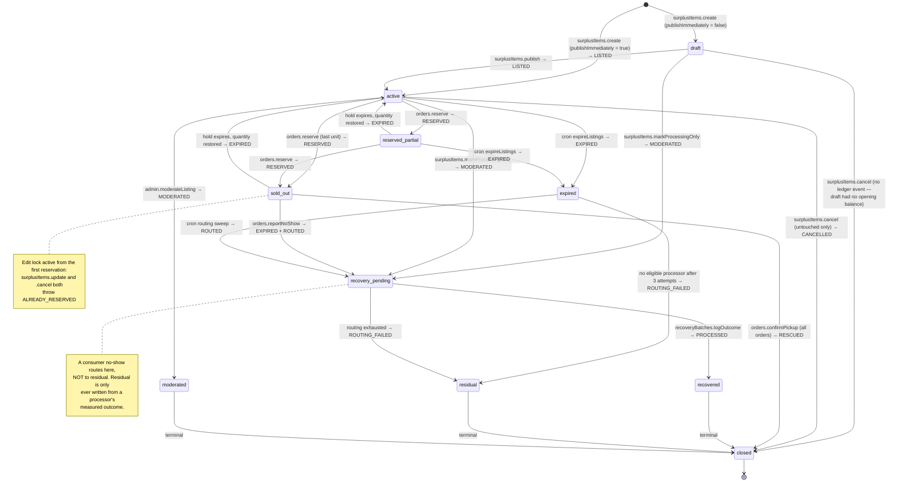

# Cirquo API — Merchant Functions

| Field | Value |
|---|---|
| **Document** | `docs/api/API_MERCHANT.md` |
| **Scope** | Rescue Item lifecycle, Dynamic Rescue Pricing, order fulfilment, pickup confirmation, no-shows, merchant impact |
| **Actor** | Merchant (verified) |
| **Backend** | Convex (`convex/surplusItems.ts`, `convex/orders.ts`, `convex/merchants.ts`, `convex/impact.ts`, `convex/recoveryBatches.ts`) |
| **Verification gate** | All listing and fulfilment functions require `merchants.verificationStatus === 'verified'` |
| **Status legend** | implemented · Planned |
| **Implemented today** | `merchants.getByOwner` Implemented, `surplusItems.listByStatus` Implemented — everything else Planned |
| **Conventions** | [`API.md`](./API.md) §7 units · §9 errors · §15 ledger contract |

---

## 1. The Merchant's role in Material Flow Orchestration

A Merchant is the origin of every gram of material Cirquo tracks. They:

1. list surplus as a **Rescue Item** with a **floor price**, a quantity, a per-item weight, and a **pickup window**;
2. optionally consult **Dynamic Rescue Pricing** for a suggested `currentPrice`;
3. publish the listing, which writes the `LISTED` ledger event — **the first entry in that item's material chain**;
4. receive reservations; the quantity decrements automatically at reservation, not at payment;
5. verify a consumer's **pickup code** inside the pickup window and confirm collection → `RESCUED`;
6. report a no-show if the consumer never arrives — which sends the material into **Circular Routing**, not to waste;
7. watch their impact accumulate, derived entirely from the ledger.

Three invariants dominate this file:

| Invariant | Enforced in | Why |
|---|---|---|
| **Floor price** — `floorPrice <= currentPrice < originalPrice`, always | `create`, `update`, `suggestPrice` | Merchants must never be pushed below their own stated economic limit, and a Rescue Item that is not discounted is not a Rescue Item |
| **Edit lock** — no edits once any quantity is reserved | `update`, `cancel` | A consumer paid for specific terms; those terms cannot change under them |
| **Measured, not declared** — merchants declare `weightPerItemGrams`; processors measure `acceptedWeightGrams` | `logIntake` (processor side) | Self-reported weight is an estimate; only the processor's scale is evidence |

---

## 2. Function reference

### `surplusItems.create` Planned
**Type:** mutation · **Auth:** Merchant (verified) · **PRD ref:** MER-01

Creates a Rescue Item. Created as `draft` by default so a merchant can prepare a listing without exposing it, or published immediately in one step.

**Arguments**

| Arg | Validator | Required | Notes |
|---|---|---|---|
| `sessionToken` | `v.string()` | Yes | |
| `name` | `v.string()` | Yes | 2–120 chars |
| `description` | `v.optional(v.string())` | No | ≤ 500 chars |
| `imageUrl` | `v.optional(v.string())` | No | HTTPS URL from Convex file storage |
| `materialType` | `v.union(v.literal('prepared_food'), v.literal('bakery'), v.literal('produce'), v.literal('dairy'), v.literal('protein'), v.literal('dry_goods'), v.literal('mixed'))` | Yes | Drives Circular Routing eligibility |
| `originalPrice` | `v.number()` | Yes | Integer IDR, > 0 |
| `currentPrice` | `v.number()` | Yes | Integer IDR, `floorPrice <= currentPrice < originalPrice` |
| `floorPrice` | `v.number()` | Yes | Integer IDR, > 0, `<= currentPrice` |
| `initialQuantity` | `v.number()` | Yes | Integer 1–999 |
| `weightPerItemGrams` | `v.number()` | Yes | Integer grams, 1–50000 |
| `pickupStartAt` | `v.number()` | Yes | epoch ms; ≥ now − 5 min (clock skew tolerance) |
| `pickupEndAt` | `v.number()` | Yes | epoch ms; > `pickupStartAt`, ≤ `pickupStartAt` + 72 h |
| `dietaryTags` | `v.array(v.string())` | Yes | May be empty; elements from the known tag set |
| `processingOnly` | `v.optional(v.boolean())` | No | Default `false`. `true` = skip consumers, route straight to a processor |
| `publishImmediately` | `v.optional(v.boolean())` | No | Default `false` → `draft` |

**Returns**

```ts
type CreateItemResult = {
  surplusItemId: Id<'surplusItems'>
  status: 'draft' | 'active'
  totalWeightGrams: number       // initialQuantity * weightPerItemGrams
  discountPercent: number
  publishedAt?: number
}
```

**Authorization**

```ts
const user = await requireRole(ctx, args.sessionToken, ['merchant'])
const merchant = await requireVerifiedMerchant(ctx, user)   // throws NOT_VERIFIED
```

**Validation** — ordered, each with its error code:

1. `requireRole(['merchant'])` → `AUTH_REQUIRED` / `FORBIDDEN` / `ACCOUNT_SUSPENDED`
2. `requireVerifiedMerchant` → `NOT_VERIFIED` (with `details.verificationStatus`)
3. `name` 2–120 chars after trim → `VALIDATION_FAILED` (`field: 'name'`)
4. `description` ≤ 500 chars → `VALIDATION_FAILED`
5. `originalPrice` a positive integer ≤ 10_000_000 → `VALIDATION_FAILED`
6. `floorPrice` a positive integer → `VALIDATION_FAILED`
7. **`currentPrice >= floorPrice`** → `PRICE_BELOW_FLOOR` with `details.floorPrice`
8. **`currentPrice < originalPrice`** → `PRICE_ABOVE_ORIGINAL`
9. `floorPrice < originalPrice` → `VALIDATION_FAILED` (a floor at or above the original price makes the listing unreachable)
10. `initialQuantity` an integer 1–999 → `VALIDATION_FAILED`
11. `weightPerItemGrams` an integer 1–50000 → `VALIDATION_FAILED`
12. `pickupStartAt >= now - 300_000` → `VALIDATION_FAILED` (no back-dating; back-dated windows would corrupt urgency ranking and the ledger time axis)
13. `pickupEndAt > pickupStartAt` → `VALIDATION_FAILED`
14. `pickupEndAt - pickupStartAt <= 72h` → `VALIDATION_FAILED` (surplus food does not stay safe indefinitely; a 3-day ceiling is a food-safety guardrail, not an arbitrary limit)
15. `dietaryTags` elements in the known set → `VALIDATION_FAILED`
16. `materialType` — enforced by the validator union itself

**Side effects**

| Target | Write | When |
|---|---|---|
| `surplusItems` | Insert with `remainingQuantity = initialQuantity`, `status = 'draft' \| 'active'`, `publishedAt` set only if published | Always |
| `materialFlowLedger` | `LISTED` | **Only if `publishImmediately`** |
| `notifications` | None on draft | — |

**Ledger events**

| Event | `weightDeltaGrams` | Metadata | Emitted when |
|---|---|---|---|
| `LISTED` | `+initialQuantity * weightPerItemGrams` | `{ materialType, initialQuantity, weightPerItemGrams, currentPrice, floorPrice, originalPrice, pickupStartAt, pickupEndAt, processingOnly }` | `publishImmediately === true` |

**Why `LISTED` carries a positive delta.** `LISTED` is the moment material enters the platform's accounting. It is the **opening balance** for that item's chain. Every subsequent outcome — `RESCUED`, `PROCESSED`, `EXPIRED` — carries a negative delta, so a fully-resolved item's events sum to exactly zero. That property is what `admin.checkWeightConservation` verifies, and it is only meaningful because `LISTED` establishes the opening balance. A draft writes no event because draft material has not entered the system and would leave an unbalanced opening entry forever.

**Errors**

| Code | HTTP equiv. | Meaning | Client handling |
|---|---|---|---|
| `AUTH_REQUIRED` | 401 | No session | Login |
| `FORBIDDEN` | 403 | Not a merchant | Redirect to the correct home |
| `NOT_VERIFIED` | 403 | Verification pending or rejected | Route to the pending screen with `blockedActions` |
| `PRICE_BELOW_FLOOR` | 422 | `currentPrice < floorPrice` | Highlight price; show `details.floorPrice` |
| `PRICE_ABOVE_ORIGINAL` | 422 | `currentPrice >= originalPrice` | Highlight price; explain a Rescue Item must be discounted |
| `VALIDATION_FAILED` | 422 | Any other field rule | Highlight `field`, preserve the form |
| `LEDGER_WRITE_FAILED` | 500 | Ledger append failed | Generic toast; **no item was created** |

**Implementation**

```ts
// convex/surplusItems.ts
export const create = mutation({
  args: {
    sessionToken: v.string(),
    name: v.string(),
    description: v.optional(v.string()),
    imageUrl: v.optional(v.string()),
    materialType: v.union(
      v.literal('prepared_food'), v.literal('bakery'), v.literal('produce'),
      v.literal('dairy'), v.literal('protein'), v.literal('dry_goods'), v.literal('mixed'),
    ),
    originalPrice: v.number(),
    currentPrice: v.number(),
    floorPrice: v.number(),
    initialQuantity: v.number(),
    weightPerItemGrams: v.number(),
    pickupStartAt: v.number(),
    pickupEndAt: v.number(),
    dietaryTags: v.array(v.string()),
    processingOnly: v.optional(v.boolean()),
    publishImmediately: v.optional(v.boolean()),
  },
  handler: async (ctx, args) => {
    const user = await requireRole(ctx, args.sessionToken, ['merchant'])
    const merchant = await requireVerifiedMerchant(ctx, user)
    const now = Date.now()

    const name = args.name.trim()
    if (name.length < 2 || name.length > 120) {
      fail('VALIDATION_FAILED', 'Name must be 2–120 characters.', { field: 'name' })
    }
    assertPositiveInt(args.originalPrice, 'originalPrice', 10_000_000)
    assertPositiveInt(args.floorPrice, 'floorPrice', 10_000_000)
    assertPositiveInt(args.currentPrice, 'currentPrice', 10_000_000)

    // ---- FLOOR PRICE INVARIANT ----
    if (args.currentPrice < args.floorPrice) {
      fail('PRICE_BELOW_FLOOR', 'Current price cannot be below the floor price.', {
        field: 'currentPrice',
        currentPrice: args.currentPrice,
        floorPrice: args.floorPrice,
      })
    }
    if (args.currentPrice >= args.originalPrice) {
      fail('PRICE_ABOVE_ORIGINAL', 'A Rescue Item must be priced below its original price.', {
        field: 'currentPrice',
        currentPrice: args.currentPrice,
        originalPrice: args.originalPrice,
      })
    }
    if (args.floorPrice >= args.originalPrice) {
      fail('VALIDATION_FAILED', 'Floor price must be below the original price.',
           { field: 'floorPrice' })
    }

    assertIntInRange(args.initialQuantity, 1, 999, 'initialQuantity')
    assertIntInRange(args.weightPerItemGrams, 1, 50_000, 'weightPerItemGrams')

    if (args.pickupStartAt < now - 300_000) {
      fail('VALIDATION_FAILED', 'Pickup window cannot start in the past.',
           { field: 'pickupStartAt' })
    }
    if (args.pickupEndAt <= args.pickupStartAt) {
      fail('VALIDATION_FAILED', 'Pickup window must end after it starts.',
           { field: 'pickupEndAt' })
    }
    if (args.pickupEndAt - args.pickupStartAt > 72 * 3_600_000) {
      fail('VALIDATION_FAILED', 'Pickup window cannot exceed 72 hours.',
           { field: 'pickupEndAt' })
    }
    for (const tag of args.dietaryTags) {
      if (!KNOWN_DIETARY_TAGS.includes(tag)) {
        fail('VALIDATION_FAILED', `Unknown dietary tag: ${tag}`, { field: 'dietaryTags' })
      }
    }

    const publish = args.publishImmediately === true
    const totalWeightGrams = args.initialQuantity * args.weightPerItemGrams

    const surplusItemId = await ctx.db.insert('surplusItems', {
      merchantId: merchant._id,
      name,
      description: args.description?.trim(),
      imageUrl: args.imageUrl,
      materialType: args.materialType,
      originalPrice: args.originalPrice,
      currentPrice: args.currentPrice,
      floorPrice: args.floorPrice,
      initialQuantity: args.initialQuantity,
      remainingQuantity: args.initialQuantity,
      weightPerItemGrams: args.weightPerItemGrams,
      pickupStartAt: args.pickupStartAt,
      pickupEndAt: args.pickupEndAt,
      dietaryTags: args.dietaryTags,
      processingOnly: args.processingOnly ?? false,
      status: publish ? 'active' : 'draft',
      createdAt: now,
      publishedAt: publish ? now : undefined,
    })

    if (publish) {
      // ---- LEDGER: opening balance, same transaction ----
      await recordLedgerEvent(ctx, {
        surplusItemId,
        eventType: 'LISTED',
        weightDeltaGrams: totalWeightGrams,
        actorId: user._id,
        actorRole: 'merchant',
        metadata: {
          materialType: args.materialType,
          initialQuantity: args.initialQuantity,
          weightPerItemGrams: args.weightPerItemGrams,
          currentPrice: args.currentPrice,
          floorPrice: args.floorPrice,
          originalPrice: args.originalPrice,
          pickupStartAt: args.pickupStartAt,
          pickupEndAt: args.pickupEndAt,
          processingOnly: args.processingOnly ?? false,
        },
        occurredAt: now,
      })

      await ctx.scheduler.runAt(args.pickupEndAt,
        internal.surplusItems.expireListings, { surplusItemId })
    }

    return {
      surplusItemId,
      status: publish ? ('active' as const) : ('draft' as const),
      totalWeightGrams,
      discountPercent: Math.round(
        ((args.originalPrice - args.currentPrice) / args.originalPrice) * 100),
      publishedAt: publish ? now : undefined,
    }
  },
})
```

**Example**

```ts
const result = await createItem({
  sessionToken,
  name: 'Nasi Goreng Spesial (surplus sore)',
  description: 'Freshly cooked at 15:00. Collect before 20:00.',
  materialType: 'prepared_food',
  originalPrice: 25_000,
  currentPrice: 12_000,
  floorPrice: 8_000,
  initialQuantity: 8,
  weightPerItemGrams: 350,
  pickupStartAt: Date.now() + 60 * 60_000,
  pickupEndAt: Date.now() + 5 * 60 * 60_000,
  dietaryTags: ['halal'],
  publishImmediately: true,
})
// -> { surplusItemId, status: 'active', totalWeightGrams: 2800, discountPercent: 52 }
```

---

### `surplusItems.suggestPrice` Planned
**Type:** query · **Auth:** Merchant (verified) · **PRD ref:** MER-02

Wraps **Dynamic Rescue Pricing** — a deterministic, rule-based discount model. It returns a suggested `currentPrice` with a full explanation of how it was reached.

**Arguments**

| Arg | Validator | Required | Notes |
|---|---|---|---|
| `sessionToken` | `v.string()` | Yes | |
| `originalPrice` | `v.number()` | Yes | Integer IDR |
| `floorPrice` | `v.number()` | Yes | Integer IDR — a hard clamp, never breached |
| `materialType` | `v.string()` | Yes | Perishability class |
| `pickupStartAt` | `v.number()` | Yes | epoch ms |
| `pickupEndAt` | `v.number()` | Yes | epoch ms |
| `initialQuantity` | `v.number()` | Yes | Larger batches carry a mild volume discount |
| `surplusItemId` | `v.optional(v.id('surplusItems'))` | No | For re-pricing an existing listing; incorporates observed sell-through |

**Returns**

```ts
type PriceSuggestion = {
  suggestedPrice: number         // IDR, always >= floorPrice and < originalPrice
  floorPrice: number
  originalPrice: number
  discountPercent: number
  clampedToFloor: boolean        // true if the raw model went below the floor
  factors: {
    baseDiscount: number         // by materialType
    urgencyDiscount: number      // by hours until pickupEndAt
    quantityDiscount: number     // by batch size
    sellThroughAdjustment: number // only when surplusItemId supplied
  }
  rationale: string              // shown verbatim to the merchant
  methodologyVersion: string     // 'v1'
}
```

**Authorization** — `requireRole(['merchant'])` + `requireVerifiedMerchant`.

**Validation**

1. `originalPrice`, `floorPrice` positive integers → `VALIDATION_FAILED`
2. `floorPrice < originalPrice` → `VALIDATION_FAILED`
3. `pickupEndAt > pickupStartAt` → `VALIDATION_FAILED`
4. `materialType` in the enum → `VALIDATION_FAILED`

**Side effects** — none. This is a **query**: it suggests, it does not apply. The merchant must explicitly submit the price through `create` or `update`, where the floor invariant is enforced again.

**Ledger events** — none.

**Errors** — `AUTH_REQUIRED`, `FORBIDDEN`, `NOT_VERIFIED`, `VALIDATION_FAILED`.

**The model**

```ts
// convex/lib/pricing.ts — full spec in ../impact/ALGORITHM.md
const BASE_DISCOUNT: Record<string, number> = {
  prepared_food: 0.50,   // shortest safe life
  dairy:         0.45,
  protein:       0.45,
  bakery:        0.40,
  produce:       0.35,
  mixed:         0.35,
  dry_goods:     0.20,   // longest shelf life, least urgency
}

export function suggestRescuePrice(input: {
  originalPrice: number
  floorPrice: number
  materialType: string
  hoursUntilWindowCloses: number
  initialQuantity: number
  sellThroughRatio?: number     // remaining / initial, when re-pricing
}): PriceSuggestion {
  const base = BASE_DISCOUNT[input.materialType] ?? 0.35

  // Urgency: 0 at >= 12h out, up to +0.20 as the window closes.
  const urgency = 0.20 * (1 - Math.min(Math.max(input.hoursUntilWindowCloses, 0) / 12, 1))

  // Volume: up to +0.05 for large batches.
  const quantity = Math.min(input.initialQuantity / 100, 1) * 0.05

  // Sell-through: nothing moved -> discount harder, capped at +0.10.
  const sellThrough =
    input.sellThroughRatio !== undefined && input.sellThroughRatio > 0.8 ? 0.10 : 0

  const totalDiscount = Math.min(base + urgency + quantity + sellThrough, 0.85)
  const raw = Math.round(input.originalPrice * (1 - totalDiscount) / 500) * 500  // round to Rp500

  // ---- HARD FLOOR CLAMP ----
  const clampedToFloor = raw < input.floorPrice
  const suggestedPrice = Math.max(raw, input.floorPrice)

  return {
    suggestedPrice,
    floorPrice: input.floorPrice,
    originalPrice: input.originalPrice,
    discountPercent: Math.round(
      ((input.originalPrice - suggestedPrice) / input.originalPrice) * 100),
    clampedToFloor,
    factors: { baseDiscount: base, urgencyDiscount: urgency,
               quantityDiscount: quantity, sellThroughAdjustment: sellThrough },
    rationale: clampedToFloor
      ? `Suggested ${fmtIdr(raw)} based on ${input.materialType} and time remaining, ` +
        `raised to your floor price of ${fmtIdr(input.floorPrice)}.`
      : `${Math.round(totalDiscount * 100)}% off — ${input.materialType} baseline ` +
        `plus urgency with ${Math.round(input.hoursUntilWindowCloses)}h remaining.`,
    methodologyVersion: 'v1',
  }
}
```

**Why this is rule-based and not "AI pricing."** The model is a transparent weighted sum with published constants, rounded to Rp 500 and clamped to the merchant's own floor. A merchant can read `rationale`, understand exactly why the number is what it is, and disagree. Calling this AI would be a marketing claim the implementation does not support, and a judge who read the source would rightly discount everything else we said. It is documented as **Dynamic Rescue Pricing** — a deterministic heuristic — in [`../impact/ALGORITHM.md`](../impact/ALGORITHM.md), and nowhere as AI.

The floor clamp is not a suggestion. Even at maximum urgency, maximum volume, and zero sell-through, `suggestedPrice` cannot fall below `floorPrice`. The merchant's stated economic limit is the model's hard boundary.

---

### `surplusItems.update` Planned
**Type:** mutation · **Auth:** Merchant (owner, verified) · **PRD ref:** MER-03

Updates a listing. **Rejected once any quantity has been reserved.**

**Arguments**

| Arg | Validator | Required | Notes |
|---|---|---|---|
| `sessionToken` | `v.string()` | Yes | |
| `surplusItemId` | `v.id('surplusItems')` | Yes | |
| `name` | `v.optional(v.string())` | No | |
| `description` | `v.optional(v.string())` | No | |
| `imageUrl` | `v.optional(v.string())` | No | |
| `currentPrice` | `v.optional(v.number())` | No | Re-validated against `floorPrice` and `originalPrice` |
| `floorPrice` | `v.optional(v.number())` | No | May only be **lowered**, never raised |
| `initialQuantity` | `v.optional(v.number())` | No | Draft only |
| `weightPerItemGrams` | `v.optional(v.number())` | No | Draft only |
| `pickupStartAt` | `v.optional(v.number())` | No | |
| `pickupEndAt` | `v.optional(v.number())` | No | May only be **extended**, never shortened, once active |
| `dietaryTags` | `v.optional(v.array(v.string()))` | No | |

**Returns** — `{ success: true; priceChanged: boolean; newPrice?: number }`

**Authorization** — `requireRole(['merchant'])` + `requireVerifiedMerchant` + `item.merchantId === merchant._id`.

**Validation**

1. `requireRole(['merchant'])` → `AUTH_REQUIRED` / `FORBIDDEN`
2. `requireVerifiedMerchant` → `NOT_VERIFIED`
3. Item exists → `NOT_FOUND`
4. Ownership → `FORBIDDEN`
5. `status ∈ { 'draft', 'active' }` → `INVALID_TRANSITION`
6. **Edit lock:** `remainingQuantity === initialQuantity` → otherwise `ALREADY_RESERVED`
7. `currentPrice >= floorPrice` (using the new floor if supplied) → `PRICE_BELOW_FLOOR`
8. `currentPrice < originalPrice` → `PRICE_ABOVE_ORIGINAL`
9. New `floorPrice <= existing floorPrice` → `VALIDATION_FAILED` ("Floor price can only be lowered.")
10. `initialQuantity` / `weightPerItemGrams` changes only while `draft` → `INVALID_TRANSITION`
11. New `pickupEndAt >= existing pickupEndAt` when active → `VALIDATION_FAILED` ("Pickup window can only be extended.")
12. At least one field supplied → `VALIDATION_FAILED`

#### The edit lock — full reasoning

> **A listing may not be edited once any quantity is reserved.**

The check is `remainingQuantity === initialQuantity`. If even one unit is reserved, every mutating field is refused with `ALREADY_RESERVED`.

| Field a merchant might want to change | Consequence if allowed post-reservation |
|---|---|
| `currentPrice` | A consumer paid Rp 12.000; raising the price retroactively is fraud, lowering it makes them overpay relative to later buyers. The order's `unitPrice` is already locked, so the edit would create two prices for the same listing with no explanation. |
| `weightPerItemGrams` | **Corrupts the ledger.** `orders.rescuedWeightGrams` was snapshotted at reservation. Changing the source figure means `LISTED` no longer equals the sum of outcomes, and `admin.checkWeightConservation` fails for a reason no one can trace. |
| `pickupEndAt` (shortening) | A consumer planned around a window that then closed early — they cannot collect food they paid for. |
| `initialQuantity` | Directly contradicts the reservation arithmetic; `remainingQuantity` becomes meaningless. |
| `dietaryTags` | A consumer filtered on `halal` and reserved. Removing the tag afterwards is a food-safety failure, not a metadata edit. |

Two escape hatches remain: `pickupEndAt` may be **extended** (strictly better for everyone), and `floorPrice` may be **lowered** (which only widens the merchant's own room to manoeuvre and cannot invalidate an existing order). Everything else requires cancelling the untouched remainder and creating a new listing.

**Side effects**

- Patch `surplusItems`
- **`PRICE_ADJUSTED` ledger event if and only if `currentPrice` changed on an `active` item**
- Reschedule `expireListings` if `pickupEndAt` changed

**Ledger events**

| Event | `weightDeltaGrams` | Metadata | When |
|---|---|---|---|
| `PRICE_ADJUSTED` | `0` | `{ previousPrice, newPrice, floorPrice, adjustedBy: 'merchant', reason }` | `currentPrice` changed while `active` |

Zero delta: a price change moves money, not mass. It is recorded because Dynamic Rescue Pricing effectiveness is measured from these events, and because a price history is part of a defensible audit trail.

**Errors**

| Code | HTTP equiv. | Meaning | Client handling |
|---|---|---|---|
| `AUTH_REQUIRED` | 401 | No session | Login |
| `FORBIDDEN` | 403 | Not the owner | Back to listings |
| `NOT_VERIFIED` | 403 | Verification lapsed | Pending screen |
| `NOT_FOUND` | 404 | Item missing | Back to listings |
| `INVALID_TRANSITION` | 409 | Wrong status, or draft-only field on an active item | Explain which |
| `ALREADY_RESERVED` | 409 | **Edit lock** | Disable the form; explain the rule; offer "create a new listing" |
| `PRICE_BELOW_FLOOR` | 422 | Below floor | Highlight; show the floor |
| `PRICE_ABOVE_ORIGINAL` | 422 | Not a discount | Highlight |
| `VALIDATION_FAILED` | 422 | Other rule | Highlight `field` |

**Implementation excerpt**

```ts
const item = await ctx.db.get(args.surplusItemId)
if (!item) fail('NOT_FOUND', 'Rescue Item not found.')
requireOwnership(user, merchant.ownerId, 'listing')
if (item.merchantId !== merchant._id) fail('FORBIDDEN', 'You do not own this listing.')

if (item.status !== 'draft' && item.status !== 'active') {
  fail('INVALID_TRANSITION', `Cannot edit a listing with status '${item.status}'.`)
}

// ---- EDIT LOCK ----
if (item.remainingQuantity !== item.initialQuantity) {
  fail('ALREADY_RESERVED', 'This listing cannot be edited because it has reservations.', {
    initialQuantity: item.initialQuantity,
    remainingQuantity: item.remainingQuantity,
    reservedQuantity: item.initialQuantity - item.remainingQuantity,
  })
}

const nextFloor = args.floorPrice ?? item.floorPrice
if (args.floorPrice !== undefined && args.floorPrice > item.floorPrice) {
  fail('VALIDATION_FAILED', 'Floor price can only be lowered.', { field: 'floorPrice' })
}

const nextPrice = args.currentPrice ?? item.currentPrice
if (nextPrice < nextFloor) {
  fail('PRICE_BELOW_FLOOR', 'Current price cannot be below the floor price.', {
    field: 'currentPrice', currentPrice: nextPrice, floorPrice: nextFloor,
  })
}
if (nextPrice >= item.originalPrice) {
  fail('PRICE_ABOVE_ORIGINAL', 'A Rescue Item must stay below its original price.', {
    field: 'currentPrice',
  })
}

await ctx.db.patch(item._id, { /* ...changed fields... */ })

if (args.currentPrice !== undefined &&
    args.currentPrice !== item.currentPrice &&
    item.status === 'active') {
  await recordLedgerEvent(ctx, {
    surplusItemId: item._id,
    eventType: 'PRICE_ADJUSTED',
    weightDeltaGrams: 0,
    actorId: user._id,
    actorRole: 'merchant',
    metadata: {
      previousPrice: item.currentPrice,
      newPrice: args.currentPrice,
      floorPrice: nextFloor,
      adjustedBy: 'merchant',
    },
  })
}
```

---

### `surplusItems.publish` Planned
**Type:** mutation · **Auth:** Merchant (owner, verified) · **PRD ref:** MER-04

Transitions a `draft` to `active`, making it discoverable and writing the `LISTED` ledger event.

**Arguments**

| Arg | Validator | Required | Notes |
|---|---|---|---|
| `sessionToken` | `v.string()` | Yes | |
| `surplusItemId` | `v.id('surplusItems')` | Yes | Must be `draft` |

**Returns** — `{ success: true; status: 'active'; publishedAt: number; totalWeightGrams: number }`

**Authorization** — `requireRole(['merchant'])` + `requireVerifiedMerchant` + ownership.

**Validation**

1. Guards → `AUTH_REQUIRED` / `FORBIDDEN` / `NOT_VERIFIED`
2. Item exists and owned → `NOT_FOUND` / `FORBIDDEN`
3. `status === 'draft'` → `INVALID_TRANSITION`
4. `pickupEndAt > now` → `PICKUP_WINDOW_CLOSED` (cannot publish an already-dead window)
5. Prices still satisfy the floor invariant → `PRICE_BELOW_FLOOR` / `PRICE_ABOVE_ORIGINAL` (re-checked, because the floor may have been lowered while in draft)

**Side effects**

| Target | Write |
|---|---|
| `surplusItems` | `status = 'active'`, `publishedAt = now` |
| `materialFlowLedger` | `LISTED` with the full opening balance |
| Scheduler | `internal.surplusItems.expireListings` at `pickupEndAt` |

**Ledger events**

| Event | `weightDeltaGrams` | Metadata |
|---|---|---|
| `LISTED` | `+remainingQuantity * weightPerItemGrams` | Same shape as `create` |

**Errors** — `AUTH_REQUIRED`, `FORBIDDEN`, `NOT_VERIFIED`, `NOT_FOUND`, `INVALID_TRANSITION`, `PICKUP_WINDOW_CLOSED`, `PRICE_BELOW_FLOOR`, `LEDGER_WRITE_FAILED`.

---

### `surplusItems.cancel` Planned
**Type:** mutation · **Auth:** Merchant (owner, verified) · **PRD ref:** MER-05

Cancels a listing. **Only permitted while untouched** — no reservations, ever.

**Arguments**

| Arg | Validator | Required | Notes |
|---|---|---|---|
| `sessionToken` | `v.string()` | Yes | |
| `surplusItemId` | `v.id('surplusItems')` | Yes | |
| `reason` | `v.optional(v.string())` | No | ≤ 200 chars, recorded in the ledger |

**Returns** — `{ success: true; status: 'closed' }`

**Authorization** — `requireRole(['merchant'])` + `requireVerifiedMerchant` + ownership.

**Validation**

1. Guards → `AUTH_REQUIRED` / `FORBIDDEN` / `NOT_VERIFIED`
2. Item exists and owned → `NOT_FOUND` / `FORBIDDEN`
3. `status ∈ { 'draft', 'active' }` → `INVALID_TRANSITION`
4. **`remainingQuantity === initialQuantity`** → otherwise `ALREADY_RESERVED`
5. No `orders` for this item in `reserved` or `paid` → `ALREADY_RESERVED` (belt and braces: the quantity check should be sufficient, but an explicit order scan guards against any future path that decrements differently)

**Why untouched only.** If a consumer has paid, the merchant has a contractual obligation to hand over food. Allowing unilateral cancellation would let a merchant take payment and then delete the listing. Once anything is reserved, the merchant's route is `orders.reportNoShow` (if the consumer fails to appear) or `disputes.raise` (if something else went wrong) — both of which leave an auditable trail. Cancellation is a self-service action precisely because it can only be used when no one is affected.

**Side effects**

| Target | Write |
|---|---|
| `surplusItems` | `status = 'closed'` — **never a hard delete** |
| `materialFlowLedger` | `CANCELLED` if the item was `active`; nothing if `draft` |

Never `ctx.db.delete`. A deleted listing whose `LISTED` event remains would break weight conservation permanently and make an item's history unreadable.

**Ledger events**

| Event | `weightDeltaGrams` | Metadata | When |
|---|---|---|---|
| `CANCELLED` | `-remainingQuantity * weightPerItemGrams` | `{ reason, cancelledBy: 'merchant', quantity }` | Item was `active` |

The negative delta exactly offsets the `LISTED` opening balance, so the chain sums to zero. A `draft` item never had an opening balance, so it writes nothing — and correctly contributes nothing to conservation.

**Errors** — `AUTH_REQUIRED`, `FORBIDDEN`, `NOT_VERIFIED`, `NOT_FOUND`, `INVALID_TRANSITION`, `ALREADY_RESERVED`.

---

### `surplusItems.markProcessingOnly` Planned
**Type:** mutation · **Auth:** Merchant (owner, verified) · **PRD ref:** MER-06

Marks material as unsuitable for human consumption but valid for organic processing, sending it directly into **Circular Routing** without a consumer stage.

**Arguments**

| Arg | Validator | Required | Notes |
|---|---|---|---|
| `sessionToken` | `v.string()` | Yes | |
| `surplusItemId` | `v.id('surplusItems')` | Yes | |
| `reason` | `v.string()` | Yes | 5–200 chars — required, not optional |
| `estimatedWeightGrams` | `v.optional(v.number())` | No | Overrides the declared weight if the merchant has a better estimate |

**Returns** — `{ success: true; status: 'recovery_pending'; recoveryBatchId: Id<'recoveryBatches'>; offeredWeightGrams: number }`

**Authorization** — `requireRole(['merchant'])` + `requireVerifiedMerchant` + ownership.

**Validation**

1. Guards → `AUTH_REQUIRED` / `FORBIDDEN` / `NOT_VERIFIED`
2. Item exists and owned → `NOT_FOUND` / `FORBIDDEN`
3. `status ∈ { 'draft', 'active', 'expired' }` → `INVALID_TRANSITION`
4. `remainingQuantity > 0` → `INVALID_TRANSITION` (nothing left to route)
5. `reason` 5–200 chars → `VALIDATION_FAILED` — an explanation is mandatory, since this is a food-safety judgement recorded permanently in the ledger
6. `estimatedWeightGrams`, if supplied, a positive integer ≤ declared total → `VALIDATION_FAILED`

**Side effects**

| Target | Write |
|---|---|
| `surplusItems` | `status = 'recovery_pending'`, `processingOnly = true` |
| `recoveryBatches` | Insert `{ surplusItemId, merchantId, materialType, offeredWeightGrams, status: 'pending', routingAttempts: 0, declinedByProcessorIds: [], createdAt }` |
| `materialFlowLedger` | `MODERATED` with `metadata.action = 'PROCESSING_ONLY'` |
| Scheduler | `internal.routing.offerBatch` immediately |

**Ledger events**

| Event | `weightDeltaGrams` | Metadata |
|---|---|---|
| `MODERATED` | `0` | `{ action: 'PROCESSING_ONLY', reason, remainingQuantity, offeredWeightGrams, markedBy: 'merchant' }` |

Zero delta: the material has not left the merchant, it has changed its **destination**. The mass moves at `INTAKE_ACCEPTED` and `PROCESSED`, on the processor side.

**Errors** — `AUTH_REQUIRED`, `FORBIDDEN`, `NOT_VERIFIED`, `NOT_FOUND`, `INVALID_TRANSITION`, `VALIDATION_FAILED`.

This function is where the platform's circular claim becomes concrete. A merchant with bread that is past its sell-by but perfectly good for BSF larvae has a legitimate route that is neither the bin nor a sale to a human. Once routed, [`API_PROCESSOR.md`](./API_PROCESSOR.md) takes over.

---

### `surplusItems.listMine` Planned
**Type:** query · **Auth:** Merchant (verified) · **PRD ref:** MER-07

Paginated list of the merchant's own listings with live reservation counts.

**Arguments**

| Arg | Validator | Required | Notes |
|---|---|---|---|
| `sessionToken` | `v.string()` | Yes | |
| `status` | `v.optional(v.string())` | No | Filter by `rescueItemStatus` |
| `activeOnly` | `v.optional(v.boolean())` | No | Shorthand for `draft` + `active` + `reserved_partial` |
| `paginationOpts` | `paginationOptsValidator` | Yes | Default 20 |

**Returns** — `PaginationResult<MerchantListingSummary>` where each row adds `reservedQuantity`, `soldQuantity`, `pendingOrderCount`, `paidOrderCount`, `totalRevenueIdr`, `rescuedWeightGrams`, `canEdit`, `canCancel`, and `minutesUntilWindowCloses`.

`canEdit` and `canCancel` are computed **server-side** from the same predicate the mutations enforce (`remainingQuantity === initialQuantity`). The UI reads these booleans rather than reimplementing the rule, which keeps a single source of truth — and the mutation still re-checks, because the UI is never the enforcement point.

**Authorization** — `requireRole(['merchant'])`; scoped by `merchantId` resolved from the session. Verification is **not** required to read your own listings — a merchant whose verification lapsed should still see their history.

**Validation** — `status` in the enum if supplied → `VALIDATION_FAILED`.

**Side effects** — none.

**Ledger events** — none.

**Errors** — `AUTH_REQUIRED`, `FORBIDDEN`, `VALIDATION_FAILED`.

**Relationship to `surplusItems.listByStatus` Implemented** — the existing implemented query is a global, status-only read used by internal routing and admin tooling. It is **not** merchant-scoped and must never be exposed directly to merchant UI.

---

### `surplusItems.get` Planned
**Type:** query · **Auth:** Merchant (owner) · **PRD ref:** MER-08

Full detail for one of the merchant's own listings, including its complete ledger timeline.

**Arguments**

| Arg | Validator | Required | Notes |
|---|---|---|---|
| `sessionToken` | `v.string()` | Yes | |
| `surplusItemId` | `v.id('surplusItems')` | Yes | |

**Returns** — the full `surplusItems` document plus:

```ts
{
  orders: { _id, status, quantity, totalPrice, createdAt, pickedUpAt?, consumerName }[]
  recoveryBatch: { _id, status, processorName?, offeredWeightGrams,
                   acceptedWeightGrams?, outputType?, outputWeightGrams?,
                   residualWeightGrams? } | null
  ledger: { eventType, weightDeltaGrams, occurredAt, actorRole, metadata }[]
  weightSummary: {
    listedGrams: number
    rescuedGrams: number
    recoveredGrams: number
    residualGrams: number
    unaccountedGrams: number     // should be 0 for terminal items
  }
  canEdit: boolean
  canCancel: boolean
}
```

**Authorization** — `requireRole(['merchant'])` + ownership. Non-owned ids return `null`.

**Validation** — ownership only.

**Side effects** — none.

**Ledger events** — none written; the `ledger` array is a read.

**Errors** — `AUTH_REQUIRED`, `FORBIDDEN`; `null` for missing or non-owned.

`weightSummary.unaccountedGrams` is the merchant-facing version of the platform integrity check. For a terminal item it must be `0`. If it is not, something is wrong with the chain and the merchant can see it before an auditor does. Consumer names are limited to first name plus initial — the merchant needs to recognise who is collecting, not a contact record.

---

### `orders.listForMerchant` Planned
**Type:** query · **Auth:** Merchant (verified) · **PRD ref:** MER-09

The fulfilment queue. This is the screen a merchant keeps open at the counter.

**Arguments**

| Arg | Validator | Required | Notes |
|---|---|---|---|
| `sessionToken` | `v.string()` | Yes | |
| `status` | `v.optional(v.string())` | No | Filter by `orderStatus` |
| `surplusItemId` | `v.optional(v.id('surplusItems'))` | No | Narrow to one listing |
| `awaitingPickupOnly` | `v.optional(v.boolean())` | No | `paid` orders whose window is open — the default counter view |
| `paginationOpts` | `paginationOptsValidator` | Yes | Default 20 |

**Returns** — `PaginationResult<MerchantOrderSummary>`:

```ts
type MerchantOrderSummary = {
  _id: Id<'orders'>
  status: string
  quantity: number
  totalPrice: number
  platformFeeAmount: number
  merchantPayoutAmount: number      // totalPrice - platformFeeAmount
  rescuedWeightGrams: number
  createdAt: number
  paidAt?: number
  pickedUpAt?: number
  paymentHoldExpiresAt: number
  holdSecondsRemaining: number | null
  consumer: { name: string; phone?: string }   // phone only once paid
  item: { _id: Id<'surplusItems'>; name: string; imageUrl?: string
          pickupStartAt: number; pickupEndAt: number }
  windowState: 'not_open_yet' | 'open' | 'closed'
  canConfirmPickup: boolean
  canReportNoShow: boolean
  // pickupCode is NEVER included — see below
}
```

**Authorization** — `requireRole(['merchant'])`; scoped by `merchantId` from the session.

**Validation** — enum checks → `VALIDATION_FAILED`.

**Side effects** — none.

**Ledger events** — none.

**Errors** — `AUTH_REQUIRED`, `FORBIDDEN`, `VALIDATION_FAILED`.

> **`pickupCode` is never returned to a merchant, in any query, ever.**

If a merchant could read pickup codes, they could confirm pickups for consumers who never arrived — inflating their Rescued weight, collecting payouts on food they still hold, and injecting fabricated `RESCUED` events into the ledger that the platform presents as evidence. The merchant's role in the protocol is strictly to *verify* a code the consumer supplies. This single omission is what makes `RESCUED` events trustworthy.

---

### `orders.confirmPickup` Planned
**Type:** mutation · **Auth:** Merchant (owner, verified) · **PRD ref:** MER-10

**The moment material becomes Rescued.** Verifies the pickup code and the pickup window, transitions the order to `picked_up`, writes the `RESCUED` ledger event, and cascades the item to `closed` when fully resolved.

**Arguments**

| Arg | Validator | Required | Notes |
|---|---|---|---|
| `sessionToken` | `v.string()` | Yes | |
| `orderId` | `v.id('orders')` | Yes | Must be `paid` |
| `pickupCode` | `v.string()` | Yes | 6 digits, read aloud by the consumer |
| `adminOverride` | `v.optional(v.boolean())` | No | **Admin sessions only** — bypasses the window check |

**Returns**

```ts
type ConfirmPickupResult = {
  success: true
  orderId: Id<'orders'>
  rescuedWeightGrams: number
  pickedUpAt: number
  itemStatus: 'reserved_partial' | 'sold_out' | 'closed'
  merchantPayoutAmount: number
  ledgerEventId: Id<'materialFlowLedger'>
}
```

**Authorization** — `requireRole(['merchant', 'admin'])`; for merchants, `order.merchantId` must match the session-resolved merchant, and `requireVerifiedMerchant` applies. `adminOverride` is ignored unless `user.role === 'admin'`.

**Validation** — the exact order:

1. `requireRole(['merchant', 'admin'])` → `AUTH_REQUIRED` / `FORBIDDEN` / `ACCOUNT_SUSPENDED`
2. `requireVerifiedMerchant` (merchants only) → `NOT_VERIFIED`
3. Order exists → `NOT_FOUND`
4. `order.merchantId === merchant._id` (merchants only) → `FORBIDDEN`
5. `order.status === 'paid'` → `INVALID_TRANSITION` (a `reserved` order has not been paid for; a `picked_up` order is already collected)
6. Rate limit: 5 failed code attempts per order → `RATE_LIMITED`, and Admin is notified
7. **`pickupCode === order.pickupCode`** (constant-time comparison) → `INVALID_PICKUP_CODE`
8. **`item.pickupStartAt <= now <= item.pickupEndAt`**, unless a valid `adminOverride` → `PICKUP_WINDOW_CLOSED`

Steps 7 and 8 are the two conditions the PRD states must both hold: **code match AND inside the window**, with Admin as the only override.

**Side effects**

| Target | Write |
|---|---|
| `orders` | `status = 'picked_up'`, `pickedUpAt = now` |
| `surplusItems` | `status = 'closed'` if `remainingQuantity === 0` **and** no other order remains open |
| `materialFlowLedger` | **`RESCUED`** — the event the whole platform exists to produce |
| `notifications` | Consumer: "Pickup confirmed — you rescued 350 g" |
| Rate limit | Reset the failed-attempt counter for this order |

**Ledger events**

| Event | `weightDeltaGrams` | Metadata |
|---|---|---|
| `RESCUED` | `-order.rescuedWeightGrams` (negative) | `{ orderId, quantity, unitPrice, totalPrice, adminOverride, confirmedBy }` |

The delta is **negative** because material is leaving the platform's pending pool into a real, positive outcome. `LISTED` was positive; `RESCUED` draws it down. When every unit of an item is either rescued, recovered, or accounted as residual, the events sum to zero — which is exactly what `admin.checkWeightConservation` asserts. See [`../impact/MATERIAL_LEDGER.md`](../impact/MATERIAL_LEDGER.md) for the full sign convention.

**Errors**

| Code | HTTP equiv. | Meaning | Client handling |
|---|---|---|---|
| `AUTH_REQUIRED` | 401 | No session | Login |
| `FORBIDDEN` | 403 | Not this merchant's order | Back to the queue |
| `NOT_VERIFIED` | 403 | Verification lapsed | Pending screen |
| `NOT_FOUND` | 404 | Order missing | Back to the queue |
| `INVALID_TRANSITION` | 409 | Not `paid`, or already collected | "This order has already been collected." |
| `INVALID_PICKUP_CODE` | 403 | Code mismatch | "Incorrect code." + attempts remaining; do **not** reveal the correct code |
| `PICKUP_WINDOW_CLOSED` | 409 | Outside the window | Offer `orders.reportNoShow`, or escalate to Admin |
| `RATE_LIMITED` | 429 | 5 failed attempts | Lock the form; Admin has been notified |
| `LEDGER_WRITE_FAILED` | 500 | Ledger append failed | Generic toast; **the order is still `paid`** — nothing diverged |

**Implementation**

```ts
// convex/orders.ts
export const confirmPickup = mutation({
  args: {
    sessionToken: v.string(),
    orderId: v.id('orders'),
    pickupCode: v.string(),
    adminOverride: v.optional(v.boolean()),
  },
  handler: async (ctx, args) => {
    const user = await requireRole(ctx, args.sessionToken, ['merchant', 'admin'])
    const isAdmin = user.role === 'admin'
    const now = Date.now()

    const order = await ctx.db.get(args.orderId)
    if (!order) fail('NOT_FOUND', 'Order not found.')

    let merchant: Doc<'merchants'> | null = null
    if (!isAdmin) {
      merchant = await requireVerifiedMerchant(ctx, user)
      if (order.merchantId !== merchant._id) {
        fail('FORBIDDEN', 'This order belongs to another merchant.')
      }
    }

    if (order.status !== 'paid') {
      fail('INVALID_TRANSITION',
        order.status === 'picked_up'
          ? 'This order has already been collected.'
          : `Cannot confirm pickup for an order with status '${order.status}'.`,
        { currentStatus: order.status })
    }

    const item = await ctx.db.get(order.surplusItemId)
    if (!item) fail('NOT_FOUND', 'Rescue Item not found.')

    // ---- 1. PICKUP CODE ----
    await enforceRateLimit(ctx, 'pickup_code', order._id, { max: 5, windowMs: 60 * 60_000 })
    if (!timingSafeEqual(args.pickupCode.trim(), order.pickupCode)) {
      await recordFailedAttempt(ctx, 'pickup_code', order._id)
      fail('INVALID_PICKUP_CODE', 'Pickup code does not match this order.')
    }

    // ---- 2. PICKUP WINDOW ----
    const override = isAdmin && args.adminOverride === true
    if (!override) {
      if (now < item.pickupStartAt) {
        fail('PICKUP_WINDOW_CLOSED', 'The pickup window has not opened yet.', {
          pickupStartAt: item.pickupStartAt, now,
        })
      }
      if (now > item.pickupEndAt) {
        fail('PICKUP_WINDOW_CLOSED', 'The pickup window has closed.', {
          pickupEndAt: item.pickupEndAt, now,
        })
      }
    }

    // ---- 3. WRITES ----
    await ctx.db.patch(order._id, { status: 'picked_up', pickedUpAt: now })

    // ---- 4. LEDGER: RESCUED, same transaction ----
    const ledgerEventId = await recordLedgerEvent(ctx, {
      surplusItemId: item._id,
      orderId: order._id,
      eventType: 'RESCUED',
      weightDeltaGrams: -order.rescuedWeightGrams,
      actorId: user._id,
      actorRole: isAdmin ? 'admin' : 'merchant',
      metadata: {
        orderId: order._id,
        quantity: order.quantity,
        unitPrice: order.unitPrice,
        totalPrice: order.totalPrice,
        adminOverride: override,
        confirmedBy: user._id,
      },
      occurredAt: now,
    })

    // ---- 5. CASCADE: close the item when nothing is outstanding ----
    let itemStatus = item.status
    if (item.remainingQuantity === 0) {
      const siblings = await ctx.db.query('orders')
        .withIndex('by_item', (q) => q.eq('surplusItemId', item._id)).collect()
      const openRemains = siblings.some(
        (o) => o._id !== order._id && (o.status === 'reserved' || o.status === 'paid'))
      if (!openRemains) {
        await ctx.db.patch(item._id, { status: 'closed' })
        itemStatus = 'closed'
      }
    }

    await ctx.db.insert('notifications', {
      userId: order.userId,
      type: 'order',
      title: 'Pickup confirmed',
      body: `You rescued ${(order.rescuedWeightGrams / 1000).toFixed(2)} kg of ${item.name}. Thank you.`,
      link: `/orders/${order._id}`,
      read: false,
      createdAt: now,
    })

    return {
      success: true as const,
      orderId: order._id,
      rescuedWeightGrams: order.rescuedWeightGrams,
      pickedUpAt: now,
      itemStatus,
      merchantPayoutAmount: order.totalPrice - order.platformFeeAmount,
      ledgerEventId,
    }
  },
})
```

**Why the ledger write is inside this mutation, restated.** `confirmPickup` is the function whose output the platform shows on stage. If the `RESCUED` event were written by an action, a scheduled job, or a client callback, then a crash, a retry, or a hostile client between the status patch and the ledger append would produce an order marked `picked_up` with no corresponding event — or an event with no order. Every impact number Cirquo displays derives from these events. One divergence and the claim "every kilogram is accounted for" becomes unprovable. Convex mutations are transactional, so `ctx.db.patch(order)` and `recordLedgerEvent` either both commit or neither does. That is the entire basis of the platform's credibility, and it costs one line placed correctly.

**Merchant-side UI note.** The confirm screen shows a 6-digit input and the consumer's first name. It does **not** display the expected code anywhere in the DOM, in a data attribute, or in a network payload — a merchant with devtools open must not be able to read it.

---

### `orders.reportNoShow` Planned
**Type:** mutation · **Auth:** Merchant (owner, verified) · **PRD ref:** MER-11

Reports that a consumer did not collect a paid order. **This does not create Residual.** The material re-enters Circular Routing.

**Arguments**

| Arg | Validator | Required | Notes |
|---|---|---|---|
| `sessionToken` | `v.string()` | Yes | |
| `orderId` | `v.id('orders')` | Yes | Must be `paid` |
| `note` | `v.optional(v.string())` | No | ≤ 200 chars |
| `stillUsable` | `v.optional(v.boolean())` | No | Default `true` — is the material still fit for organic processing? |

**Returns**

```ts
type ReportNoShowResult = {
  success: true
  orderId: Id<'orders'>
  routedToRecovery: boolean
  recoveryBatchId: Id<'recoveryBatches'> | null
  offeredWeightGrams: number
  refundStatus: 'not_refunded' | 'refund_pending'
}
```

**Authorization** — `requireRole(['merchant'])` + `requireVerifiedMerchant` + ownership.

**Validation**

1. Guards → `AUTH_REQUIRED` / `FORBIDDEN` / `NOT_VERIFIED`
2. Order exists and belongs to this merchant → `NOT_FOUND` / `FORBIDDEN`
3. `order.status === 'paid'` → `INVALID_TRANSITION`
4. **`now > item.pickupEndAt`** → `INVALID_TRANSITION` ("Cannot report a no-show while the pickup window is still open.") A merchant must not pre-empt a consumer who still has time.
5. `note` ≤ 200 chars → `VALIDATION_FAILED`

**Side effects**

| Target | Write |
|---|---|
| `orders` | `status = 'expired'`, `cancelledAt = now` |
| `surplusItems` | `status = 'recovery_pending'` if `stillUsable`, else `residual` |
| `recoveryBatches` | Insert a `pending` batch if `stillUsable` |
| `materialFlowLedger` | `EXPIRED`, then `ROUTED` (if routing) |
| `notifications` | Consumer: "You missed your pickup" |
| Scheduler | `internal.routing.offerBatch` immediately |

**Ledger events**

| Event | `weightDeltaGrams` | Metadata | When |
|---|---|---|---|
| `EXPIRED` | `0` | `{ reason: 'CONSUMER_NO_SHOW', orderId, note, stillUsable }` | Always |
| `ROUTED` | `0` | `{ recoveryBatchId, offeredWeightGrams, source: 'no_show' }` | `stillUsable === true` |

Both deltas are zero. The material has not been consumed and it has not been discarded — it has changed **destination**. The mass moves later, at `INTAKE_ACCEPTED` and `PROCESSED` on the processor side.

#### Why a no-show does not create Residual

This is the most conceptually important rule in the merchant surface, so it is stated explicitly.

| Approach | Ledger outcome | What it implies |
|---|---|---|
| No-show → **Residual** | Full weight recorded as unrecoverable | The platform gave up. A consumer's schedule conflict is treated as identical to material that is genuinely unprocessable. |
| No-show → **Circular Routing** (Cirquo) | `EXPIRED` + `ROUTED`, then a real processor outcome | The material gets a second destination. Residual is claimed only after a processor has physically measured what could not be converted. |

**Residual is a measured outcome, not an assumption.** It is written exactly once, by `recoveryBatches.logOutcome`, from a processor's scale. Marking material residual because a consumer was late would inflate our residual figure with mass that was never assessed, and would understate the circularity rate for a reason that has nothing to do with circularity.

The only path to `residual` from here is `stillUsable === false` — an explicit merchant judgement that the material is unfit even for organic processing, recorded with a note and attributable to a named actor. That is a claim someone has to stand behind, which is the appropriate bar.

**Errors** — `AUTH_REQUIRED`, `FORBIDDEN`, `NOT_VERIFIED`, `NOT_FOUND`, `INVALID_TRANSITION`, `VALIDATION_FAILED`.

**Refunds.** `refundStatus` is `'not_refunded'` by default: the consumer paid for food that was prepared and held for them. A consumer who disagrees uses `disputes.raise`, and Admin decides via `admin.resolveDispute`. Automatic refunds on no-show would make the reservation meaningless and would let consumers lock inventory at zero cost.

---

### `impact.getMerchantSummary` Planned
**Type:** query · **Auth:** Merchant · **PRD ref:** MER-12

The merchant's impact, derived entirely from the Material Flow Ledger.

**Arguments**

| Arg | Validator | Required | Notes |
|---|---|---|---|
| `sessionToken` | `v.string()` | Yes | |
| `fromDate` | `v.optional(v.number())` | No | epoch ms |
| `toDate` | `v.optional(v.number())` | No | epoch ms |

**Returns**

```ts
type MerchantImpactSummary = {
  totalListedGrams: number
  totalRescuedGrams: number
  totalRecoveredGrams: number
  totalResidualGrams: number
  circularityRate: number          // (rescued + recovered) / listed, 0-1
  rescueRate: number               // rescued / listed
  recoveryRate: number             // recovered / listed
  totalListings: number
  completedPickups: number
  noShows: number
  expiredUnclaimed: number
  totalRevenueIdr: number
  totalPlatformFeesIdr: number
  netPayoutIdr: number
  co2eAvoidedGrams: number
  byMaterialType: { materialType: string; listedGrams: number
                    rescuedGrams: number; recoveredGrams: number }[]
  methodologyVersion: string
  computedFrom: 'materialFlowLedger'
}
```

**Authorization** — `requireRole(['merchant'])`; scoped to the caller's `merchantId`.

**Validation** — `fromDate <= toDate` → `VALIDATION_FAILED`.

**Side effects** — none.

**Ledger events** — none written; **all figures read from `materialFlowLedger`.**

**Errors** — `AUTH_REQUIRED`, `FORBIDDEN`, `VALIDATION_FAILED`.

**Derivation**

```ts
const items = await ctx.db.query('surplusItems')
  .withIndex('by_merchant', (q) => q.eq('merchantId', merchant._id)).collect()
const itemIds = new Set(items.map((i) => i._id))

const events = await ctx.db.query('materialFlowLedger')
  .withIndex('by_occurred_at', (q) => q.gte('occurredAt', from).lte('occurredAt', to))
  .collect()
const mine = events.filter((e) => itemIds.has(e.surplusItemId))

const listedGrams    = sumAbs(mine, 'LISTED')
const rescuedGrams   = sumAbs(mine, 'RESCUED')
// PROCESSED metadata splits between recovered output and residual remainder —
// see API_PROCESSOR.md §logOutcome for exactly why the metric layer parses
// metadata rather than trusting the single weightDeltaGrams value.
const processed = mine.filter((e) => e.eventType === 'PROCESSED')
const recoveredGrams = processed.reduce((s, e) => s + Number(e.metadata?.outputWeightGrams ?? 0), 0)
const residualGrams  = processed.reduce((s, e) => s + Number(e.metadata?.residualWeightGrams ?? 0), 0)

const circularityRate = listedGrams === 0 ? 0
  : (rescuedGrams + recoveredGrams) / listedGrams
```

The **circularity rate** is `(Rescued + Recovered) / Listed`. It is never 1.0 in practice, and the UI never rounds it to 100% or labels anything "zero waste". Residual exists, it is measured, and it is displayed. A platform that reported perfect circularity would be reporting a number it did not measure — the honest figure is the one that makes the rest of the numbers believable. See [`../impact/IMPACT.md`](../impact/IMPACT.md).

---

### `merchants.getMine` Planned
**Type:** query · **Auth:** Merchant · **PRD ref:** MER-13

**Arguments**

| Arg | Validator | Required | Notes |
|---|---|---|---|
| `sessionToken` | `v.string()` | Yes | |

**Returns** — the full `merchants` document plus `{ activeListingCount, pendingOrderCount, totalRescuedGrams, canOperate: boolean, blockedActions: string[] }`.

**Authorization** — `requireRole(['merchant'])`; resolved from `ownerId`, so there is no id to tamper with. Returns `null` if no profile exists yet — which is how the client knows to route to onboarding.

**Validation** — none.

**Side effects** — none.

**Ledger events** — none.

**Errors** — `AUTH_REQUIRED`, `FORBIDDEN`.

**Relationship to `merchants.getByOwner` Implemented** — the implemented query takes an explicit `ownerId` argument and is used internally. `getMine` supersedes it for client use because deriving the owner from the session removes the IDOR surface entirely.

---

### `merchants.updateProfile` Planned
**Type:** mutation · **Auth:** Merchant (owner) · **PRD ref:** MER-14

**Arguments**

| Arg | Validator | Required | Notes |
|---|---|---|---|
| `sessionToken` | `v.string()` | Yes | |
| `name` | `v.optional(v.string())` | No | 2–120 chars |
| `description` | `v.optional(v.string())` | No | ≤ 500 chars |
| `businessType` | `v.optional(v.string())` | No | From the accepted set |
| `address` | `v.optional(v.string())` | No | 5–250 chars |
| `latitude` | `v.optional(v.number())` | No | **Triggers re-verification** |
| `longitude` | `v.optional(v.number())` | No | **Triggers re-verification** |
| `phone` | `v.optional(v.string())` | No | Normalised |

**Returns** — `{ success: true; requiresReverification: boolean; verificationStatus: string }`

**Authorization** — `requireRole(['merchant'])`; the profile is resolved from `ownerId`. `verificationStatus` is **not** an accepted argument — only Admin can change it, via [`API_ADMIN.md`](./API_ADMIN.md).

**Validation**

1. Guards → `AUTH_REQUIRED` / `FORBIDDEN`
2. Profile exists → `NOT_FOUND`
3. At least one field → `VALIDATION_FAILED`
4. Field bounds → `VALIDATION_FAILED`
5. Coordinates within the Indonesia bounding box → `VALIDATION_FAILED`

**Side effects**

- Patch `merchants`
- **If `latitude`/`longitude`/`address` changed and the merchant has no active listings: `verificationStatus → 'pending'`** and Admins are notified
- If the merchant **does** have active listings, the location change is rejected with `INVALID_TRANSITION` — moving the pickup point under consumers who have already reserved would send them to the wrong address

**Ledger events** — none. Profile edits move no material.

**Errors** — `AUTH_REQUIRED`, `FORBIDDEN`, `NOT_FOUND`, `VALIDATION_FAILED`, `INVALID_TRANSITION`.

**Why a location change resets verification.** The verified coordinate is what Admin checked, what consumers navigate to, and what the Circular Routing radius check measures from. A silent move would break all three. Re-verification is friction, and it is the correct friction.

---

### `recoveryBatches.listForMerchant` Planned
**Type:** query · **Auth:** Merchant · **PRD ref:** MER-15

Shows what happened to the merchant's material after it left the consumer path — the merchant's window onto Circular Routing.

**Arguments**

| Arg | Validator | Required | Notes |
|---|---|---|---|
| `sessionToken` | `v.string()` | Yes | |
| `status` | `v.optional(v.string())` | No | Filter by `recoveryStatus` |
| `paginationOpts` | `paginationOptsValidator` | Yes | Default 20 |

**Returns** — `PaginationResult<MerchantRecoveryBatchSummary>`:

```ts
type MerchantRecoveryBatchSummary = {
  _id: Id<'recoveryBatches'>
  status: 'pending' | 'offered' | 'accepted' | 'collected' | 'processed' | 'unroutable'
  materialType: string
  offeredWeightGrams: number
  acceptedWeightGrams?: number      // measured by the processor
  outputType?: 'compost' | 'bsf_larvae' | 'animal_feed' | 'biogas'
  outputWeightGrams?: number
  residualWeightGrams?: number
  routingAttempts: number
  offerExpiresAt?: number
  createdAt: number
  acceptedAt?: number
  completedAt?: number
  item: { _id: Id<'surplusItems'>; name: string; materialType: string }
  processor: { name: string; facilityType: string; city: string } | null
  conversionRate: number | null     // outputWeightGrams / acceptedWeightGrams
}
```

**Authorization** — `requireRole(['merchant'])`; scoped by `merchantId`.

**Validation** — enum check → `VALIDATION_FAILED`.

**Side effects** — none.

**Ledger events** — none.

**Errors** — `AUTH_REQUIRED`, `FORBIDDEN`, `VALIDATION_FAILED`.

**Why this matters to a merchant.** Without this view, "Circular Routing" is a phrase in the marketing copy. With it, a merchant sees that 2.4 kg of unsold bread became 0.9 kg of BSF larvae at a named facility on a specific date, with 0.3 kg residual. The processor's name and facility type are shown; contact details are not, because Cirquo brokers the material flow rather than introducing the parties. `acceptedWeightGrams` is shown as the processor's **measured** figure alongside the merchant's own `offeredWeightGrams` estimate — a discrepancy is visible to both sides, which is the point.

---

## 3. Merchant function summary

| Function | Kind | Auth | Ledger event | Priority | Status |
|---|---|---|---|---|---|
| `surplusItems.create` | mutation | Merchant (verified) | `LISTED` (if published) | **A** | Planned |
| `surplusItems.suggestPrice` | query | Merchant (verified) | — | B | Planned |
| `surplusItems.update` | mutation | Merchant (owner) | `PRICE_ADJUSTED` | B | Planned |
| `surplusItems.publish` | mutation | Merchant (owner) | `LISTED` | **A** | Planned |
| `surplusItems.cancel` | mutation | Merchant (owner) | `CANCELLED` | B | Planned |
| `surplusItems.markProcessingOnly` | mutation | Merchant (owner) | `MODERATED` | B | Planned |
| `surplusItems.listMine` | query | Merchant | — | **A** | Planned |
| `surplusItems.listByStatus` | query | Internal/Admin | — | — | Implemented |
| `surplusItems.get` | query | Merchant (owner) | — | A | Planned |
| `orders.listForMerchant` | query | Merchant | — | **A** | Planned |
| `orders.confirmPickup` | mutation | Merchant (owner) | **`RESCUED`** | **A** | Planned |
| `orders.reportNoShow` | mutation | Merchant (owner) | `EXPIRED` + `ROUTED` | B | Planned |
| `impact.getMerchantSummary` | query | Merchant | — | B | Planned |
| `merchants.getMine` | query | Merchant | — | A | Planned |
| `merchants.getByOwner` | query | Internal | — | — | Implemented |
| `merchants.updateProfile` | mutation | Merchant (owner) | — | C | Planned |
| `recoveryBatches.listForMerchant` | query | Merchant | — | B | Planned |

---

## 4. Rescue Item lifecycle from the merchant's side



---

## 5. Merchant invariant checklist

Every merchant-facing mutation is reviewed against this list:

| # | Invariant | Enforced by | Error |
|---|---|---|---|
| 1 | `floorPrice <= currentPrice` | `create`, `update`, `publish` | `PRICE_BELOW_FLOOR` |
| 2 | `currentPrice < originalPrice` | `create`, `update`, `publish` | `PRICE_ABOVE_ORIGINAL` |
| 3 | `floorPrice < originalPrice` | `create`, `update` | `VALIDATION_FAILED` |
| 4 | `floorPrice` may only be lowered | `update` | `VALIDATION_FAILED` |
| 5 | No edits once any quantity is reserved | `update` | `ALREADY_RESERVED` |
| 6 | No cancellation once any quantity is reserved | `cancel` | `ALREADY_RESERVED` |
| 7 | `pickupEndAt` may only be extended when active | `update` | `VALIDATION_FAILED` |
| 8 | Pickup window ≤ 72 h | `create`, `update` | `VALIDATION_FAILED` |
| 9 | Pickup requires code match **and** window, Admin may override the window only | `confirmPickup` | `INVALID_PICKUP_CODE`, `PICKUP_WINDOW_CLOSED` |
| 10 | Merchant never sees a pickup code | every merchant query | n/a — field omitted server-side |
| 11 | No-show routes to recovery, never straight to residual | `reportNoShow` | n/a — enforced by the write path |
| 12 | Merchant never sets `acceptedWeightGrams` | processor-only mutations | `FORBIDDEN` |
| 13 | Verification required to list or confirm | all listing/fulfilment mutations | `NOT_VERIFIED` |
| 14 | Listings are closed, never deleted | `cancel`, `moderateListing` | n/a — no delete path exists |
| 15 | Every state change writes a ledger entry in the same transaction | all mutations above | `LEDGER_WRITE_FAILED` |
| 16 | Location changes require re-verification | `updateProfile` | `INVALID_TRANSITION` |

---

## Related Documents

| Document | Path | Why |
|---|---|---|
| API overview | [`./API.md`](./API.md) | Conventions, errors, ledger contract |
| Auth API | [`./API_AUTH.md`](./API_AUTH.md) | `requireVerifiedMerchant`, profile creation |
| Consumer API | [`./API_CONSUMER.md`](./API_CONSUMER.md) | `orders.reserve`, the other half of pickup |
| Processor API | [`./API_PROCESSOR.md`](./API_PROCESSOR.md) | Where routed material goes |
| Admin API | [`./API_ADMIN.md`](./API_ADMIN.md) | Verification, moderation, ledger audit |
| State machine | [`../domain/STATE_MACHINE.md`](../domain/STATE_MACHINE.md) | Authoritative transitions |
| Database schema | [`../domain/DATABASE.md`](../domain/DATABASE.md) | `surplusItems`, `orders`, `merchants` |
| Domain glossary | [`../domain/DOMAIN.md`](../domain/DOMAIN.md) | Rescue Item, Rescued, Residual |
| Material Flow Ledger | [`../impact/MATERIAL_LEDGER.md`](../impact/MATERIAL_LEDGER.md) | Sign conventions, `LISTED`/`RESCUED` |
| Impact algorithm | [`../impact/ALGORITHM.md`](../impact/ALGORITHM.md) | **Dynamic Rescue Pricing** full spec |
| Impact metrics | [`../impact/IMPACT.md`](../impact/IMPACT.md) | Circularity rate definition |
| Permissions | [`../security/PERMISSIONS.md`](../security/PERMISSIONS.md) | Merchant capability grid |
| User stories | [`../spec/USER_STORIES.md`](../spec/USER_STORIES.md) | MER-01 … MER-15 |
| Features | [`../spec/FEATURES.md`](../spec/FEATURES.md) | Feature priorities |
| Scheduler | [`../architecture/SCHEDULER.md`](../architecture/SCHEDULER.md) | `expireListings` cron |
| Testing | [`../engineering/TESTING.md`](../engineering/TESTING.md) | Merchant test cases |

---

**Built for DSDC ANFORCOM 2026**  
**Platform:** Cirquo — Closing the Loop, Saving Every Meal
