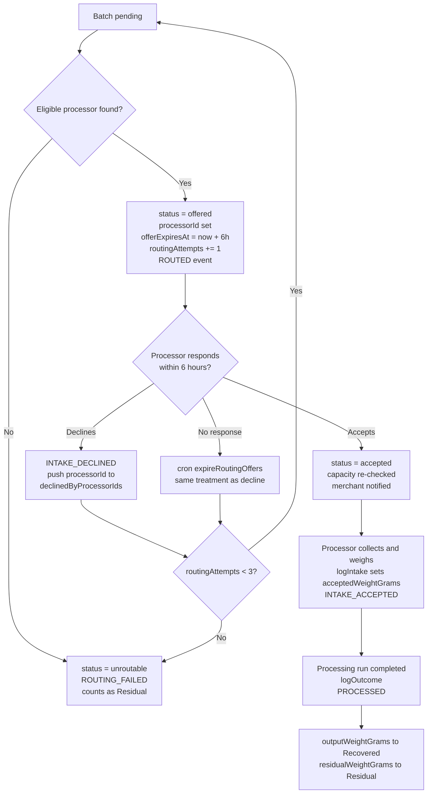

# Cirquo API — Processor Functions

| Field | Value |
| --- | --- |
| **Document type** | API Reference (Processor role) |
| **Backend** | Convex (`query` / `mutation` / `action`, not REST) |
| **Status** | Draft v1.0 |
| **Last updated** | 2026-08-06 |
| **Audience** | Backend engineers, frontend engineers building the Processor console, DSDC judges auditing Material Flow Orchestration |

This document specifies every Convex function that an **Organic Processor** account can call. Organic Processors are the final stage of Cirquo's Material Flow Orchestration: when a **Rescue Item** is not claimed by a consumer inside its **pickup window**, **Circular Routing** offers the material to a nearby verified processor (BSF larvae farm, composting site, biogas digester, or animal-feed producer). The processor weighs what actually arrives, processes it, and logs the outcome. Those two numbers — measured intake and measured output — are what turn "we saved food" into an auditable figure.

Cirquo is a Convex application. There are no REST endpoints for processors. The client calls typed functions through `useQuery` / `useMutation`, arguments are described with `v.*` validators, and errors surface as `ConvexError('CODE')`. The only real HTTP surface in the entire platform is the Midtrans payment webhook (`httpAction`), which processors never touch.

---

## Function index

| Function | Type | Auth | PRD ref | Status |
| --- | --- | --- | --- | --- |
| [`recoveryBatches.listQueue`](#recoverybatcheslistqueue-) | `query` | Processor (verified) | PRC-01 | 📋 Planned |
| [`recoveryBatches.get`](#recoverybatchesget-) | `query` | Processor (assigned) | PRC-01 | 📋 Planned |
| [`recoveryBatches.accept`](#recoverybatchesaccept-) | `mutation` | Processor (verified) | PRC-02 | 📋 Planned |
| [`recoveryBatches.decline`](#recoverybatchesdecline-) | `mutation` | Processor (verified) | PRC-02 | 📋 Planned |
| [`recoveryBatches.logIntake`](#recoverybatcheslogintake-) | `mutation` | Processor (assigned) | PRC-03 | 📋 Planned |
| [`recoveryBatches.logOutcome`](#recoverybatcheslogoutcome-) | `mutation` | Processor (assigned) | PRC-04 | 📋 Planned |
| [`recoveryBatches.listHistory`](#recoverybatcheslisthistory-) | `query` | Processor (verified) | PRC-05 | 📋 Planned |
| [`processors.getMine`](#processorsgetmine-) | `query` | Processor | PRC-06 | 📋 Planned |
| [`processors.updateProfile`](#processorsupdateprofile-) | `mutation` | Processor (owner) | PRC-06 | 📋 Planned |
| [`processors.updateCapacity`](#processorsupdatecapacity-) | `mutation` | Processor (owner) | PRC-06 | 📋 Planned |
| [`impact.getProcessorSummary`](#impactgetprocessorsummary-) | `query` | Processor (verified) | PRC-05 / IMP-03 | 📋 Planned |

**Status legend:** ✅ Implemented · 🚧 In progress · 📋 Planned.

Authentication, profiles, the Material Flow Ledger, Merchant flows, and
Consumer flows are implemented elsewhere in the codebase. The
Processor-specific functions documented on this page are still **📋 planned**;
this file is a target contract rather than a description of deployed Processor
functionality.

---

## 1. How a batch reaches a processor's queue

A processor never browses the marketplace. Material is *pushed* to them by Circular Routing. Understanding the push is a prerequisite for understanding every function below.

### 1.1 The lifecycle before routing

1. A merchant publishes a **Rescue Item** (`surplusItems.status = 'active'`), which writes a `LISTED` ledger event with a positive `weightDeltaGrams`.
2. Consumers may reserve and collect part or all of it. Each collection writes `RESCUED` with a negative delta.
3. When `pickupEndAt` passes with `remainingQuantity > 0`, a cron (`crons.expireRescueItems`, see [`../architecture/SCHEDULER.md`](../architecture/SCHEDULER.md)) moves the item to `expired`, writes `EXPIRED`, and creates a `recoveryBatches` document with `status = 'pending'` and `offeredWeightGrams = remainingQuantity * weightPerItemGrams`.
4. A second cron (`crons.runCircularRouting`) picks up `pending` batches via the `by_status` index and searches for an eligible processor.
5. If a match is found, the batch moves to `offered`, `processorId` is set, `offerExpiresAt = now + 6h`, `routingAttempts` increments, a `ROUTED` event is written with `weightDeltaGrams: 0`, and a notification lands in the processor's inbox.

Items flagged `processingOnly: true` by the merchant skip the consumer marketplace entirely and go straight to step 3's batch creation at publish time. That is how a merchant handles material that is not safe to sell but is perfectly good as feedstock.

### 1.2 The six eligibility predicates

Circular Routing evaluates every verified processor in the item's city against six predicates. All six must hold. A batch appears in `recoveryBatches.listQueue` **only** if the processor passed all of them at offer time.

| # | Predicate | Data used | Failure meaning |
| --- | --- | --- | --- |
| 1 | **Verification** — `processor.verificationStatus === 'verified'` | `processors.by_city_verification` | Pending, rejected, and suspended facilities receive nothing. |
| 2 | **Material compatibility** — `item.materialType ∈ processor.acceptedMaterialTypes` | `surplusItems.materialType`, `processors.acceptedMaterialTypes` | A compost-only site is never offered `protein`; `MATERIAL_TYPE_REJECTED` if bypassed. |
| 3 | **Distance** — `haversine(merchant, processor) ≤ processor.maxPickupRadiusMeters` | lat/lng on both documents | The processor would not physically collect it. |
| 4 | **Capacity** — `todayAcceptedGrams + offeredWeightGrams ≤ dailyCapacityGrams` | derived, see §2 | `CAPACITY_EXCEEDED`. |
| 5 | **Not already declined** — `processorId ∉ batch.declinedByProcessorIds` | `recoveryBatches.declinedByProcessorIds` | Prevents offering the same batch to the same facility twice. |
| 6 | **Open within 24h** — the window `[operatingHoursStart, operatingHoursEnd]` occurs at least once in the next 24 hours before the material degrades | `operatingHoursStart` / `operatingHoursEnd` | A facility closed for the weekend cannot rescue Friday-evening bakery surplus. |

Candidates that pass all six are ranked by distance ascending, then by remaining headroom (`dailyCapacityGrams - todayAcceptedGrams`) descending, so the nearest facility with real room wins. The full scoring function lives in [`../impact/ALGORITHM.md`](../impact/ALGORITHM.md).

### 1.3 Why the processor still sees rejections

Eligibility is evaluated at *offer* time, but a processor may accept hours later. In between, the same facility may have accepted other batches. Every guard is therefore re-run inside `recoveryBatches.accept`. The frontend may render an enabled "Accept" button; the server decides. This is the general rule across Cirquo — see [`../security/PERMISSIONS.md`](../security/PERMISSIONS.md).

---

## 2. Per-day capacity accounting

`processors.dailyCapacityGrams` is a declared ceiling, not a stored counter. Cirquo never keeps a mutable `usedToday` field, because a counter can drift out of sync with reality and there would be no way to prove which number was right. Instead the figure is **derived** from `recoveryBatches` on every read.

```ts
// convex/lib/capacity.ts
import { QueryCtx } from '../_generated/server'
import { Id } from '../_generated/dataModel'

const WIB_OFFSET_MS = 7 * 60 * 60 * 1000 // Asia/Jakarta, UTC+7, no DST

/** Start of the current WIB calendar day, expressed as epoch ms UTC. */
export function startOfWibDay(nowMs: number): number {
  const shifted = nowMs + WIB_OFFSET_MS
  const dayStartShifted = shifted - (shifted % 86_400_000)
  return dayStartShifted - WIB_OFFSET_MS
}

/**
 * Grams this processor has already committed to today.
 * Counts accepted / collected / processed batches whose acceptedAt falls in
 * the current WIB day. Uses acceptedWeightGrams once measured, otherwise the
 * merchant-declared offeredWeightGrams as the conservative estimate.
 */
export async function todayAcceptedGrams(
  ctx: QueryCtx,
  processorId: Id<'processors'>,
  nowMs: number,
): Promise<number> {
  const dayStart = startOfWibDay(nowMs)
  let total = 0

  for (const status of ['accepted', 'collected', 'processed'] as const) {
    const batches = await ctx.db
      .query('recoveryBatches')
      .withIndex('by_processor_status', (q) =>
        q.eq('processorId', processorId).eq('status', status),
      )
      .collect()

    for (const batch of batches) {
      if ((batch.acceptedAt ?? 0) < dayStart) continue
      total += batch.acceptedWeightGrams ?? batch.offeredWeightGrams
    }
  }

  return total
}
```

Three consequences worth stating explicitly:

- **The day boundary is WIB, not UTC.** A processor in Semarang closing their books at 23:00 local time must not see their quota reset at 07:00. All display timestamps across Cirquo follow the same rule; storage stays epoch ms UTC.
- **Capacity is checked twice.** Once by the router when choosing a candidate (predicate 4), and again inside `recoveryBatches.accept`. The second check is the authoritative one because it runs inside a Convex mutation, which is transactional: the capacity read and the status write commit together or not at all. Two batches racing for the last 500 g cannot both succeed.
- **Pending offers do not consume capacity.** A batch in `offered` status is not counted. Reserving capacity for offers a processor may ignore for six hours would starve the network. The tradeoff is that a processor can be offered more than they can take; the accept-time check converts that into a clean `CAPACITY_EXCEEDED` rather than an overbooked facility.

---

## 3. Declined offers, retries, and the unroutable terminal state

Circular Routing gets **three attempts** per batch. Each attempt has a **six-hour TTL**. An offer ends in one of three ways: accepted, explicitly declined, or expired unanswered. Decline and expiry are treated identically by the retry loop — both append the processor to `declinedByProcessorIds`, reset `processorId` to undefined, and return the batch to `pending` for the next sweep.

When `routingAttempts` reaches 3 and the third offer fails, or when the router finds no eligible processor at all, the batch becomes `unroutable`. That emits `ROUTING_FAILED`, moves the parent Rescue Item to `residual`, and the full `offeredWeightGrams` is counted as **Residual** in every impact figure. Cirquo does not hide this number. A platform that only reports successes is not measuring anything.



Declining is not penalised. A facility that declines material it genuinely cannot handle produces a faster, more accurate route than one that accepts and then dumps it. `declinedByProcessorIds` exists to route around the mismatch, not to score the processor.

One important asymmetry: a **consumer no-show does not create Residual**. When a paid order is not collected inside the pickup window, the order expires and the material re-enters Circular Routing as a fresh batch. Only material that was offered and could not be placed — or that a processor measured and reported as unusable — is Residual.

---

## 4. Declared weight vs. measured weight

Two weights exist on every batch and they are deliberately never reconciled into one.

| Field | Written by | Meaning | Used for |
| --- | --- | --- | --- |
| `offeredWeightGrams` | System, at batch creation | `remainingQuantity × weightPerItemGrams` — a merchant estimate | Routing eligibility, capacity forecasting, the processor's queue preview |
| `acceptedWeightGrams` | Processor, in `logIntake` | Read off a physical scale at intake | **All impact math**, output yield, residual calculation |

`acceptedWeightGrams` is **authoritative**. Wherever both are present, the metric layer uses the measured figure. The declared figure is retained rather than overwritten for three reasons:

1. **Variance is a signal.** A merchant whose declared weights are consistently 30% above measured weights has a `weightPerItemGrams` problem worth fixing. The admin console surfaces this as a per-merchant variance ratio.
2. **Retroactive correction would falsify history.** The router genuinely made its decision on the declared number. Overwriting it would make the routing log unexplainable.
3. **The ledger balances on real numbers.** `INTAKE_ACCEPTED` carries `acceptedWeightGrams` as its delta, and the compensating `EXPIRED` / `ROUTED` chain is reconciled against it. See §12 for the arithmetic.

Sanity constraints enforced server-side: `acceptedWeightGrams > 0`, and `acceptedWeightGrams ≤ offeredWeightGrams × 1.5` (a measured weight far above the declared weight almost always means a unit error, and `VALIDATION_FAILED` is thrown so a human looks at it).

---

## 5. `recoveryBatches.listQueue` 📋

**Type:** query · **Auth:** Processor (verified) · **PRD ref:** PRC-01

Returns the calling processor's work queue, split into the three tabs of the processor console: pending offers awaiting a decision, accepted batches awaiting collection, and collected batches awaiting an outcome log.

**Arguments**

| Arg | Validator | Required | Notes |
| --- | --- | --- | --- |
| `tab` | `v.union(v.literal('offered'), v.literal('accepted'), v.literal('collected'))` | Yes | Maps 1:1 to `recoveryBatches.status`. |
| `limit` | `v.optional(v.number())` | No | Default 25, maximum 100. |

**Returns**

```ts
type QueueItem = {
  batchId: Id<'recoveryBatches'>
  status: 'offered' | 'accepted' | 'collected'
  materialType: MaterialType
  offeredWeightGrams: number
  acceptedWeightGrams: number | null
  offerExpiresAt: number | null      // epoch ms UTC; null once accepted
  secondsUntilOfferExpiry: number | null
  routingAttempts: number
  merchant: {
    merchantId: Id<'merchants'>
    name: string
    address: string
    phone: string | null
    latitude: number
    longitude: number
  }
  distanceMeters: number
  rescueItem: {
    surplusItemId: Id<'surplusItems'>
    name: string
    description: string | null
    imageUrl: string | null
    pickupEndAt: number
  }
  capacityAfterAccept: number        // grams remaining today if accepted
  createdAt: number
}

type Result = { items: QueueItem[]; capacityRemainingGrams: number }
```

**Authorization**

```ts
const { processor } = await requireProcessorVerified(ctx)
```

`requireProcessorVerified` chains `requireAuth` → `requireRole('processor')` → loads the `processors` row by `ownerId` → asserts `verificationStatus === 'verified'`. An unverified processor gets `NOT_VERIFIED` rather than an empty list, so the UI can render the "verification pending" state instead of a misleading "no work today".

**Validation**

1. Session present and unexpired, else `AUTH_REQUIRED`.
2. `user.role === 'processor'`, else `FORBIDDEN`.
3. A `processors` document exists for `ownerId`, else `NOT_FOUND`.
4. `verificationStatus === 'verified'`, else `NOT_VERIFIED`.
5. `limit` within `1..100`, else `VALIDATION_FAILED`.

**Side effects** — None. Pure read, reactive via `useQuery`. When the routing cron offers a new batch, this query re-runs on the client automatically; no polling.

**Ledger events** — None.

**Errors**

| Code | HTTP-equiv | Meaning | Client handling |
| --- | --- | --- | --- |
| `AUTH_REQUIRED` | 401 | No valid session | Redirect to `/login` |
| `FORBIDDEN` | 403 | Caller is not a processor | Redirect to role home |
| `NOT_FOUND` | 404 | No processor profile | Route to onboarding |
| `NOT_VERIFIED` | 403 | Awaiting admin verification | Render verification-pending panel |
| `VALIDATION_FAILED` | 400 | Bad `limit` | Fix the client call |

**Implementation sketch**

```ts
export const listQueue = query({
  args: {
    tab: v.union(v.literal('offered'), v.literal('accepted'), v.literal('collected')),
    limit: v.optional(v.number()),
  },
  handler: async (ctx, args) => {
    const { processor } = await requireProcessorVerified(ctx)
    const limit = Math.min(args.limit ?? 25, 100)
    const now = Date.now()

    const batches = await ctx.db
      .query('recoveryBatches')
      .withIndex('by_processor_status', (q) =>
        q.eq('processorId', processor._id).eq('status', args.tab),
      )
      .order('desc')
      .take(limit)

    const used = await todayAcceptedGrams(ctx, processor._id, now)
    const capacityRemainingGrams = Math.max(0, processor.dailyCapacityGrams - used)

    const items = await Promise.all(
      batches
        .filter((b) => args.tab !== 'offered' || (b.offerExpiresAt ?? 0) > now)
        .map((b) => hydrateQueueItem(ctx, b, processor, capacityRemainingGrams)),
    )

    return { items, capacityRemainingGrams }
  },
})
```

Offers whose `offerExpiresAt` has already passed are filtered out of the `offered` tab even before the expiry cron sweeps them, so a stale offer is never actionable in the UI.

**Example**

```ts
const { items, capacityRemainingGrams } = useQuery(api.recoveryBatches.listQueue, {
  tab: 'offered',
}) ?? { items: [], capacityRemainingGrams: 0 }
```

---

## 6. `recoveryBatches.get` 📋

**Type:** query · **Auth:** Processor (assigned to this batch) · **PRD ref:** PRC-01

Returns the full detail of a single batch, including its ledger trail, for the batch detail screen.

**Arguments**

| Arg | Validator | Required | Notes |
| --- | --- | --- | --- |
| `batchId` | `v.id('recoveryBatches')` | Yes | Must be assigned to the caller. |

**Returns**

```ts
type Result = {
  batch: Doc<'recoveryBatches'>
  merchant: { name: string; address: string; phone: string | null; latitude: number; longitude: number }
  rescueItem: { name: string; description: string | null; imageUrl: string | null; materialType: MaterialType; pickupEndAt: number }
  distanceMeters: number
  ledger: Array<{
    eventType: LedgerEventType
    weightDeltaGrams: number
    occurredAt: number
    actorRole: Role | null
    metadata: Record<string, unknown> | null
  }>
  canAccept: boolean
  canLogIntake: boolean
  canLogOutcome: boolean
}
```

**Authorization**

```ts
const { processor } = await requireProcessorVerified(ctx)
const batch = await requireBatchAssignment(ctx, args.batchId, processor._id)
```

**Validation**

1. Auth and role guards as in `listQueue` (`AUTH_REQUIRED`, `FORBIDDEN`, `NOT_VERIFIED`).
2. Batch exists, else `NOT_FOUND`.
3. `batch.processorId === processor._id`, else `FORBIDDEN`. A processor cannot read a batch offered to a competitor even if they guess the ID.

**Side effects** — None.

**Ledger events** — None. This function *reads* `materialFlowLedger` via `by_rescue_item`.

**Errors**

| Code | HTTP-equiv | Meaning | Client handling |
| --- | --- | --- | --- |
| `AUTH_REQUIRED` | 401 | No session | Redirect to `/login` |
| `FORBIDDEN` | 403 | Batch belongs to another processor | Toast, return to queue |
| `NOT_FOUND` | 404 | Unknown batch ID | Toast, return to queue |
| `NOT_VERIFIED` | 403 | Not verified | Verification panel |

**Example**

```ts
const detail = useQuery(api.recoveryBatches.get, { batchId })
```

---

## 7. `recoveryBatches.accept` 📋

**Type:** mutation · **Auth:** Processor (verified, assigned) · **PRD ref:** PRC-02

Accepts a routed offer, committing the facility to collecting the material and re-checking every eligibility predicate at commit time.

**Arguments**

| Arg | Validator | Required | Notes |
| --- | --- | --- | --- |
| `batchId` | `v.id('recoveryBatches')` | Yes | Must be `status: 'offered'` and assigned to caller. |
| `estimatedCollectionAt` | `v.optional(v.number())` | No | Epoch ms UTC; shown to the merchant so they know when to expect pickup. |
| `note` | `v.optional(v.string())` | No | Max 500 chars, relayed to the merchant. |

**Returns**

```ts
type Result = {
  batchId: Id<'recoveryBatches'>
  status: 'accepted'
  acceptedAt: number
  capacityRemainingGrams: number
}
```

**Authorization**

```ts
const { processor } = await requireProcessorVerified(ctx)
const batch = await requireBatchAssignment(ctx, args.batchId, processor._id)
```

**Validation** — ordered; the first failure throws and the transaction rolls back entirely.

1. Auth / role / verification guards → `AUTH_REQUIRED`, `FORBIDDEN`, `NOT_VERIFIED`.
2. Batch exists → `NOT_FOUND`.
3. `batch.processorId === processor._id` → `FORBIDDEN`.
4. `batch.status === 'offered'` → `INVALID_TRANSITION` (covers the case where an admin re-routed it or the offer already lapsed into `pending`).
5. `batch.offerExpiresAt > Date.now()` → `OFFER_EXPIRED`.
6. `batch.materialType ∈ processor.acceptedMaterialTypes` → `MATERIAL_TYPE_REJECTED` (re-checked because the processor may have narrowed their profile since the offer).
7. `todayAcceptedGrams(ctx, processor._id, now) + batch.offeredWeightGrams ≤ processor.dailyCapacityGrams` → `CAPACITY_EXCEEDED`.
8. `note` length ≤ 500 → `VALIDATION_FAILED`.

**Side effects**

- `ctx.db.patch(batchId, { status: 'accepted', acceptedAt: now, offerExpiresAt: undefined })`.
- `ctx.db.patch(surplusItemId, { status: 'recovery_pending' })`.
- Notification to the merchant owner: "Your surplus has been accepted by {processor.name}".
- `recordLedgerEvent` for `INTAKE_ACCEPTED`? **No** — see the note below.

> **Why `accept` does not write `INTAKE_ACCEPTED`.** Accepting is a commitment, not a measurement. The `INTAKE_ACCEPTED` event carries the authoritative weight and is written by `logIntake` when the material is physically on the scale. Writing it at accept time would put a merchant-declared number into the impact ledger and quietly overstate recovery for every batch that shrinks between the two moments. The accept step is recorded on the batch document (`acceptedAt`) and is fully reconstructible; it is a workflow fact, not a material-flow fact.

**Ledger events**

| Event | Weight delta | Metadata |
| --- | --- | --- |
| *(none)* | — | Workflow-only transition; `acceptedAt` on the batch is the audit record. |

**Errors**

| Code | HTTP-equiv | Meaning | Client handling |
| --- | --- | --- | --- |
| `AUTH_REQUIRED` | 401 | No session | Redirect to `/login` |
| `FORBIDDEN` | 403 | Not the assigned processor | Toast, refresh queue |
| `NOT_FOUND` | 404 | Unknown batch | Toast, refresh queue |
| `NOT_VERIFIED` | 403 | Verification not granted | Verification panel |
| `INVALID_TRANSITION` | 409 | Batch no longer `offered` | Toast "This offer is no longer available", refresh |
| `OFFER_EXPIRED` | 409 | Past the 6-hour TTL | Toast, remove card from queue |
| `MATERIAL_TYPE_REJECTED` | 409 | Material no longer in accepted list | Toast pointing to profile settings |
| `CAPACITY_EXCEEDED` | 409 | Would exceed today's declared capacity | Toast showing remaining grams |
| `VALIDATION_FAILED` | 400 | Note too long | Inline field error |

**Implementation sketch**

```ts
export const accept = mutation({
  args: {
    batchId: v.id('recoveryBatches'),
    estimatedCollectionAt: v.optional(v.number()),
    note: v.optional(v.string()),
  },
  handler: async (ctx, args) => {
    const { user, processor } = await requireProcessorVerified(ctx)
    const batch = await requireBatchAssignment(ctx, args.batchId, processor._id)
    const now = Date.now()

    if (batch.status !== 'offered') throw new ConvexError('INVALID_TRANSITION')
    if ((batch.offerExpiresAt ?? 0) <= now) throw new ConvexError('OFFER_EXPIRED')
    if (!processor.acceptedMaterialTypes.includes(batch.materialType)) {
      throw new ConvexError('MATERIAL_TYPE_REJECTED')
    }

    const used = await todayAcceptedGrams(ctx, processor._id, now)
    if (used + batch.offeredWeightGrams > processor.dailyCapacityGrams) {
      throw new ConvexError('CAPACITY_EXCEEDED')
    }

    await ctx.db.patch(batch._id, {
      status: 'accepted',
      acceptedAt: now,
      offerExpiresAt: undefined,
    })
    await ctx.db.patch(batch.surplusItemId, { status: 'recovery_pending' })
    await notifyMerchantOwner(ctx, batch.merchantId, {
      type: 'recovery_accepted',
      title: 'Surplus accepted for recovery',
      body: `${processor.name} will collect ${formatGrams(batch.offeredWeightGrams)}.`,
      link: `/merchant/items/${batch.surplusItemId}`,
    })

    return {
      batchId: batch._id,
      status: 'accepted' as const,
      acceptedAt: now,
      capacityRemainingGrams:
        processor.dailyCapacityGrams - used - batch.offeredWeightGrams,
    }
  },
})
```

**Example**

```ts
const result = await convex.mutation(api.recoveryBatches.accept, {
  batchId,
  estimatedCollectionAt: Date.now() + 4 * 60 * 60 * 1000,
  note: 'Collecting on the 17:00 route.',
})
```

---

## 8. `recoveryBatches.decline` 📋

**Type:** mutation · **Auth:** Processor (verified, assigned) · **PRD ref:** PRC-02

Declines a routed offer, returning the batch to Circular Routing for its next attempt or marking it `unroutable` if the attempt budget is exhausted.

**Arguments**

| Arg | Validator | Required | Notes |
| --- | --- | --- | --- |
| `batchId` | `v.id('recoveryBatches')` | Yes | Must be `offered` and assigned to caller. |
| `reason` | `v.union(v.literal('capacity'), v.literal('material_type'), v.literal('distance'), v.literal('timing'), v.literal('quality'), v.literal('other'))` | Yes | Feeds routing quality analytics. |
| `note` | `v.optional(v.string())` | No | Max 500 chars, admin-visible. |

**Returns**

```ts
type Result = {
  batchId: Id<'recoveryBatches'>
  status: 'pending' | 'unroutable'
  routingAttempts: number
  attemptsRemaining: number
}
```

**Authorization**

```ts
const { processor } = await requireProcessorVerified(ctx)
const batch = await requireBatchAssignment(ctx, args.batchId, processor._id)
```

**Validation**

1. Auth / role / verification → `AUTH_REQUIRED`, `FORBIDDEN`, `NOT_VERIFIED`.
2. Batch exists → `NOT_FOUND`.
3. Assigned to caller → `FORBIDDEN`.
4. `batch.status === 'offered'` → `INVALID_TRANSITION`.
5. `note` ≤ 500 chars → `VALIDATION_FAILED`.

An offer past its TTL is still declinable — the outcome is identical to expiry, so throwing `OFFER_EXPIRED` here would only produce a confusing dead end in the UI.

**Side effects**

- Append `processor._id` to `declinedByProcessorIds`, clear `processorId` and `offerExpiresAt`.
- If `routingAttempts < 3`: `status = 'pending'`; the routing cron will pick it up on its next sweep.
- If `routingAttempts >= 3`: `status = 'unroutable'`, parent Rescue Item patched to `residual`, merchant notified, and `ROUTING_FAILED` written.
- `recordLedgerEvent` for `INTAKE_DECLINED` in every case.

**Ledger events**

| Event | Weight delta | Metadata |
| --- | --- | --- |
| `INTAKE_DECLINED` | `0` | `{ processorId, reason, note, routingAttempts }` |
| `ROUTING_FAILED` *(only when attempts exhausted)* | `-offeredWeightGrams` | `{ reason: 'attempts_exhausted', attempts: 3, declinedByProcessorIds }` |

`INTAKE_DECLINED` carries a zero delta because no material moved; it is a routing-decision record. `ROUTING_FAILED` carries the negative delta that closes the item's ledger to zero and books the weight as **Residual**.

**Errors**

| Code | HTTP-equiv | Meaning | Client handling |
| --- | --- | --- | --- |
| `AUTH_REQUIRED` | 401 | No session | Redirect to `/login` |
| `FORBIDDEN` | 403 | Not the assigned processor | Toast, refresh queue |
| `NOT_FOUND` | 404 | Unknown batch | Toast, refresh queue |
| `NOT_VERIFIED` | 403 | Not verified | Verification panel |
| `INVALID_TRANSITION` | 409 | Batch not in `offered` | Toast, refresh queue |
| `VALIDATION_FAILED` | 400 | Note too long | Inline field error |

**Implementation sketch**

```ts
export const decline = mutation({
  args: { batchId: v.id('recoveryBatches'), reason: declineReasonValidator, note: v.optional(v.string()) },
  handler: async (ctx, args) => {
    const { user, processor } = await requireProcessorVerified(ctx)
    const batch = await requireBatchAssignment(ctx, args.batchId, processor._id)
    if (batch.status !== 'offered') throw new ConvexError('INVALID_TRANSITION')

    const declinedBy = [...batch.declinedByProcessorIds, processor._id]
    const exhausted = batch.routingAttempts >= 3

    await ctx.db.patch(batch._id, {
      status: exhausted ? 'unroutable' : 'pending',
      processorId: undefined,
      offerExpiresAt: undefined,
      declinedByProcessorIds: declinedBy,
    })

    await recordLedgerEvent(ctx, {
      surplusItemId: batch.surplusItemId,
      recoveryBatchId: batch._id,
      eventType: 'INTAKE_DECLINED',
      weightDeltaGrams: 0,
      actorId: user._id,
      actorRole: 'processor',
      metadata: { processorId: processor._id, reason: args.reason, note: args.note, routingAttempts: batch.routingAttempts },
      occurredAt: Date.now(),
    })

    if (exhausted) {
      await ctx.db.patch(batch.surplusItemId, { status: 'residual' })
      await recordLedgerEvent(ctx, {
        surplusItemId: batch.surplusItemId,
        recoveryBatchId: batch._id,
        eventType: 'ROUTING_FAILED',
        weightDeltaGrams: -batch.offeredWeightGrams,
        metadata: { reason: 'attempts_exhausted', attempts: 3, declinedByProcessorIds: declinedBy },
        occurredAt: Date.now(),
      })
      await notifyMerchantOwner(ctx, batch.merchantId, {
        type: 'routing_failed',
        title: 'No processor available',
        body: `${formatGrams(batch.offeredWeightGrams)} could not be routed and is recorded as residual.`,
      })
    }

    return {
      batchId: batch._id,
      status: exhausted ? ('unroutable' as const) : ('pending' as const),
      routingAttempts: batch.routingAttempts,
      attemptsRemaining: Math.max(0, 3 - batch.routingAttempts),
    }
  },
})
```

**Example**

```ts
await convex.mutation(api.recoveryBatches.decline, {
  batchId,
  reason: 'capacity',
  note: 'Digester at full load until Thursday.',
})
```

---

## 9. `recoveryBatches.logIntake` 📋

**Type:** mutation · **Auth:** Processor (verified, assigned) · **PRD ref:** PRC-03

Records the **measured** weight of material received at the facility, which becomes the authoritative figure for every downstream impact calculation.

**Arguments**

| Arg | Validator | Required | Notes |
| --- | --- | --- | --- |
| `batchId` | `v.id('recoveryBatches')` | Yes | Must be `status: 'accepted'`. |
| `acceptedWeightGrams` | `v.number()` | Yes | Integer grams from the facility scale. |
| `collectedAt` | `v.optional(v.number())` | No | Epoch ms UTC; defaults to `Date.now()`. May not be in the future. |
| `note` | `v.optional(v.string())` | No | Max 500 chars, e.g. condition on arrival. |

**Returns**

```ts
type Result = {
  batchId: Id<'recoveryBatches'>
  status: 'collected'
  acceptedWeightGrams: number
  declaredWeightGrams: number
  varianceGrams: number     // accepted - declared; negative means shrinkage
  variancePercent: number   // rounded to 1 decimal
}
```

**Authorization**

```ts
const { processor } = await requireProcessorVerified(ctx)
const batch = await requireBatchAssignment(ctx, args.batchId, processor._id)
```

**Validation**

1. Auth / role / verification → `AUTH_REQUIRED`, `FORBIDDEN`, `NOT_VERIFIED`.
2. Batch exists → `NOT_FOUND`.
3. Assigned to caller → `FORBIDDEN`.
4. `batch.status === 'accepted'` → `INVALID_TRANSITION` (guards double submission; a `collected` batch cannot be re-intaken).
5. `Number.isInteger(acceptedWeightGrams) && acceptedWeightGrams > 0` → `VALIDATION_FAILED`.
6. `acceptedWeightGrams ≤ offeredWeightGrams * 1.5` → `VALIDATION_FAILED` (unit-error trap).
7. `collectedAt ≤ Date.now()` → `VALIDATION_FAILED`.
8. `note` ≤ 500 chars → `VALIDATION_FAILED`.

**Side effects**

- `ctx.db.patch(batchId, { status: 'collected', acceptedWeightGrams, collectedAt })`.
- Merchant notified that material was collected and weighed.
- `recordLedgerEvent` for `INTAKE_ACCEPTED` **inside the same mutation** — Convex mutations are transactional, so the batch write and the ledger write commit together or neither does. This is the single most important invariant in Cirquo: a status can never exist without its ledger event.

**Ledger events**

| Event | Weight delta | Metadata |
| --- | --- | --- |
| `INTAKE_ACCEPTED` | `+acceptedWeightGrams` | `{ processorId, facilityType, declaredWeightGrams, varianceGrams, collectedAt, note }` |

The positive delta reopens the item's balance with the *measured* figure after `EXPIRED` / `ROUTED` recorded the *declared* one. The final `PROCESSED` event closes it back to zero. Full arithmetic in §12.

**Errors**

| Code | HTTP-equiv | Meaning | Client handling |
| --- | --- | --- | --- |
| `AUTH_REQUIRED` | 401 | No session | Redirect to `/login` |
| `FORBIDDEN` | 403 | Not the assigned processor | Toast, refresh queue |
| `NOT_FOUND` | 404 | Unknown batch | Toast, refresh queue |
| `NOT_VERIFIED` | 403 | Not verified | Verification panel |
| `INVALID_TRANSITION` | 409 | Batch not `accepted` | Toast "Intake already logged" |
| `VALIDATION_FAILED` | 400 | Non-integer, non-positive, implausible weight, or future timestamp | Inline field error with the specific rule |

**Implementation sketch**

```ts
export const logIntake = mutation({
  args: {
    batchId: v.id('recoveryBatches'),
    acceptedWeightGrams: v.number(),
    collectedAt: v.optional(v.number()),
    note: v.optional(v.string()),
  },
  handler: async (ctx, args) => {
    const { user, processor } = await requireProcessorVerified(ctx)
    const batch = await requireBatchAssignment(ctx, args.batchId, processor._id)
    if (batch.status !== 'accepted') throw new ConvexError('INVALID_TRANSITION')

    const w = args.acceptedWeightGrams
    if (!Number.isInteger(w) || w <= 0) throw new ConvexError('VALIDATION_FAILED')
    if (w > batch.offeredWeightGrams * 1.5) throw new ConvexError('VALIDATION_FAILED')

    const now = Date.now()
    const collectedAt = args.collectedAt ?? now
    if (collectedAt > now) throw new ConvexError('VALIDATION_FAILED')

    await ctx.db.patch(batch._id, { status: 'collected', acceptedWeightGrams: w })

    await recordLedgerEvent(ctx, {
      surplusItemId: batch.surplusItemId,
      recoveryBatchId: batch._id,
      eventType: 'INTAKE_ACCEPTED',
      weightDeltaGrams: w,
      actorId: user._id,
      actorRole: 'processor',
      metadata: {
        processorId: processor._id,
        facilityType: processor.facilityType,
        declaredWeightGrams: batch.offeredWeightGrams,
        varianceGrams: w - batch.offeredWeightGrams,
        collectedAt,
        note: args.note,
      },
      occurredAt: collectedAt,
    })

    const varianceGrams = w - batch.offeredWeightGrams
    return {
      batchId: batch._id,
      status: 'collected' as const,
      acceptedWeightGrams: w,
      declaredWeightGrams: batch.offeredWeightGrams,
      varianceGrams,
      variancePercent: Math.round((varianceGrams / batch.offeredWeightGrams) * 1000) / 10,
    }
  },
})
```

**Example**

```ts
const result = await convex.mutation(api.recoveryBatches.logIntake, {
  batchId,
  acceptedWeightGrams: 10_000, // 10 kg on the scale
  note: 'Received in three crates, no contamination.',
})
// result.varianceGrams === 0, result.variancePercent === 0
```

---

## 10. `recoveryBatches.logOutcome` 📋

**Type:** mutation · **Auth:** Processor (verified, assigned) · **PRD ref:** PRC-04

Closes a batch by recording what the processing run actually produced — usable output and unusable remainder — and emits the terminal `PROCESSED` event.

**Arguments**

| Arg | Validator | Required | Notes |
| --- | --- | --- | --- |
| `batchId` | `v.id('recoveryBatches')` | Yes | Must be `status: 'collected'`. |
| `outputType` | `v.union(v.literal('compost'), v.literal('bsf_larvae'), v.literal('animal_feed'), v.literal('biogas'))` | Yes | Must be in `processor.outputTypes`. |
| `outputWeightGrams` | `v.number()` | Yes | Integer grams of usable output. |
| `residualWeightGrams` | `v.number()` | Yes | Integer grams that could not be recovered. May be `0`. |
| `completedAt` | `v.optional(v.number())` | No | Epoch ms UTC; defaults to now, may not be in the future. |
| `note` | `v.optional(v.string())` | No | Max 500 chars. |

**Returns**

```ts
type Result = {
  batchId: Id<'recoveryBatches'>
  status: 'processed'
  outputType: OutputType
  outputWeightGrams: number
  residualWeightGrams: number
  conversionRatePercent: number   // outputWeightGrams / acceptedWeightGrams
  rescueItemStatus: 'recovered' | 'residual'
}
```

**Authorization**

```ts
const { processor } = await requireProcessorVerified(ctx)
const batch = await requireBatchAssignment(ctx, args.batchId, processor._id)
```

**Validation**

1. Auth / role / verification → `AUTH_REQUIRED`, `FORBIDDEN`, `NOT_VERIFIED`.
2. Batch exists → `NOT_FOUND`.
3. Assigned to caller → `FORBIDDEN`.
4. `batch.status === 'collected'` → `INVALID_TRANSITION`.
5. `batch.acceptedWeightGrams` is set → `INVALID_TRANSITION` (defensive: outcome cannot precede intake).
6. `outputType ∈ processor.outputTypes` → `VALIDATION_FAILED`.
7. Both weights are non-negative integers → `VALIDATION_FAILED`.
8. `residualWeightGrams ≤ acceptedWeightGrams` → `VALIDATION_FAILED`.
9. `outputWeightGrams ≤ acceptedWeightGrams` → `VALIDATION_FAILED`. Output may legitimately be *less* than intake — composting loses mass to water and CO₂, BSF conversion is roughly 20–30% by mass — but it can never exceed it.
10. `completedAt ≤ Date.now()` → `VALIDATION_FAILED`.

Note that `outputWeightGrams + residualWeightGrams` is **not** required to equal `acceptedWeightGrams`. Mass loss during processing is physically real and forcing the sum would push processors into fabricating a residual figure. The difference is recorded in metadata as `processLossGrams` and is excluded from both Recovered and Residual.

**Side effects**

- `ctx.db.patch(batchId, { status: 'processed', outputType, outputWeightGrams, residualWeightGrams, completedAt })`.
- Parent Rescue Item patched to `recovered` when `outputWeightGrams > 0`, otherwise `residual`.
- Merchant notified with the outcome.
- `recordLedgerEvent` for `PROCESSED` — terminal.

**Ledger events**

| Event | Weight delta | Metadata |
| --- | --- | --- |
| `PROCESSED` | `-acceptedWeightGrams` | `{ processorId, outputType, outputWeightGrams, residualWeightGrams, processLossGrams, conversionRatePercent, note }` |

### 10.1 Why the metric layer parses metadata instead of the delta

`PROCESSED` carries a single delta, `-acceptedWeightGrams`, because the ledger's arithmetic job is to close the item's balance to zero. But that one number describes **two different outcomes**:

- `outputWeightGrams` → counted as **Recovered**. Material converted into compost, larvae, feed, or biogas.
- `residualWeightGrams` → counted as **Residual**. Material that entered the facility and could not be recovered.
- `processLossGrams` = `acceptedWeightGrams − outputWeightGrams − residualWeightGrams` → counted as neither. Water and CO₂ are not an outcome.

If the metric layer took the delta wholesale — treating the full `acceptedWeightGrams` as recovered because a `PROCESSED` event exists — then a batch where a processor received 10 kg, produced 1 kg of compost, and threw away 9 kg of contaminated material would report as a 10 kg success. **That would silently hide residual waste and make the circularity rate meaningless.** The metric layer therefore reads `metadata.outputWeightGrams` and `metadata.residualWeightGrams` explicitly:

```ts
// convex/lib/metrics.ts — outcome attribution for a PROCESSED event
function attributeProcessed(event: Doc<'materialFlowLedger'>) {
  const md = (event.metadata ?? {}) as {
    outputWeightGrams?: number
    residualWeightGrams?: number
  }
  const total = Math.abs(event.weightDeltaGrams)
  const recovered = md.outputWeightGrams ?? 0
  const residual = md.residualWeightGrams ?? 0
  return {
    recoveredGrams: recovered,
    residualGrams: residual,
    processLossGrams: Math.max(0, total - recovered - residual),
  }
}
```

The circularity rate is then `(rescuedGrams + recoveredGrams) / totalListedGrams`, with Residual sitting in the denominator and never in the numerator. Full definitions in [`../impact/IMPACT.md`](../impact/IMPACT.md) and [`../impact/MATERIAL_LEDGER.md`](../impact/MATERIAL_LEDGER.md).

**Errors**

| Code | HTTP-equiv | Meaning | Client handling |
| --- | --- | --- | --- |
| `AUTH_REQUIRED` | 401 | No session | Redirect to `/login` |
| `FORBIDDEN` | 403 | Not the assigned processor | Toast, refresh queue |
| `NOT_FOUND` | 404 | Unknown batch | Toast, refresh queue |
| `NOT_VERIFIED` | 403 | Not verified | Verification panel |
| `INVALID_TRANSITION` | 409 | Batch not `collected`, or intake missing | Toast "Log intake first" |
| `VALIDATION_FAILED` | 400 | Bad output type or weights out of range | Inline field error naming the rule |

**Implementation sketch**

```ts
export const logOutcome = mutation({
  args: {
    batchId: v.id('recoveryBatches'),
    outputType: outputTypeValidator,
    outputWeightGrams: v.number(),
    residualWeightGrams: v.number(),
    completedAt: v.optional(v.number()),
    note: v.optional(v.string()),
  },
  handler: async (ctx, args) => {
    const { user, processor } = await requireProcessorVerified(ctx)
    const batch = await requireBatchAssignment(ctx, args.batchId, processor._id)
    if (batch.status !== 'collected') throw new ConvexError('INVALID_TRANSITION')

    const accepted = batch.acceptedWeightGrams
    if (accepted === undefined) throw new ConvexError('INVALID_TRANSITION')
    if (!processor.outputTypes.includes(args.outputType)) throw new ConvexError('VALIDATION_FAILED')

    const out = args.outputWeightGrams
    const res = args.residualWeightGrams
    const ok = [out, res].every((n) => Number.isInteger(n) && n >= 0)
    if (!ok || res > accepted || out > accepted) throw new ConvexError('VALIDATION_FAILED')

    const now = Date.now()
    const completedAt = args.completedAt ?? now
    if (completedAt > now) throw new ConvexError('VALIDATION_FAILED')

    const processLossGrams = Math.max(0, accepted - out - res)
    const conversionRatePercent = Math.round((out / accepted) * 1000) / 10

    await ctx.db.patch(batch._id, {
      status: 'processed',
      outputType: args.outputType,
      outputWeightGrams: out,
      residualWeightGrams: res,
      completedAt,
    })

    const rescueItemStatus = out > 0 ? ('recovered' as const) : ('residual' as const)
    await ctx.db.patch(batch.surplusItemId, { status: rescueItemStatus })

    await recordLedgerEvent(ctx, {
      surplusItemId: batch.surplusItemId,
      recoveryBatchId: batch._id,
      eventType: 'PROCESSED',
      weightDeltaGrams: -accepted,
      actorId: user._id,
      actorRole: 'processor',
      metadata: {
        processorId: processor._id,
        outputType: args.outputType,
        outputWeightGrams: out,
        residualWeightGrams: res,
        processLossGrams,
        conversionRatePercent,
        note: args.note,
      },
      occurredAt: completedAt,
    })

    return {
      batchId: batch._id,
      status: 'processed' as const,
      outputType: args.outputType,
      outputWeightGrams: out,
      residualWeightGrams: res,
      conversionRatePercent,
      rescueItemStatus,
    }
  },
})
```

**Example**

```ts
const result = await convex.mutation(api.recoveryBatches.logOutcome, {
  batchId,
  outputType: 'compost',
  outputWeightGrams: 8_000,
  residualWeightGrams: 2_000,
  note: 'Two crates contained packaging film, removed before the pile.',
})
// { conversionRatePercent: 80, rescueItemStatus: 'recovered' }
```

---

## 11. `recoveryBatches.listHistory` 📋

**Type:** query · **Auth:** Processor (verified) · **PRD ref:** PRC-05

Returns completed and unroutable batches for the facility, with filters, for the processor's history table and CSV export.

**Arguments**

| Arg | Validator | Required | Notes |
| --- | --- | --- | --- |
| `fromAt` | `v.optional(v.number())` | No | Epoch ms UTC, inclusive. |
| `toAt` | `v.optional(v.number())` | No | Epoch ms UTC, exclusive. |
| `materialType` | `v.optional(materialTypeValidator)` | No | Filter. |
| `outputType` | `v.optional(outputTypeValidator)` | No | Filter. |
| `limit` | `v.optional(v.number())` | No | Default 50, max 200. |

**Returns**

```ts
type HistoryRow = {
  batchId: Id<'recoveryBatches'>
  merchantName: string
  rescueItemName: string
  materialType: MaterialType
  offeredWeightGrams: number
  acceptedWeightGrams: number
  outputType: OutputType
  outputWeightGrams: number
  residualWeightGrams: number
  conversionRatePercent: number
  completedAt: number
}

type Result = {
  rows: HistoryRow[]
  totals: {
    batches: number
    acceptedGrams: number
    outputGrams: number
    residualGrams: number
    averageConversionPercent: number
  }
}
```

**Authorization** — `await requireProcessorVerified(ctx)`

**Validation**

1. Auth / role / verification → `AUTH_REQUIRED`, `FORBIDDEN`, `NOT_VERIFIED`.
2. `fromAt < toAt` when both supplied → `VALIDATION_FAILED`.
3. `limit` within `1..200` → `VALIDATION_FAILED`.

**Side effects** — None.

**Ledger events** — None.

**Errors**

| Code | HTTP-equiv | Meaning | Client handling |
| --- | --- | --- | --- |
| `AUTH_REQUIRED` | 401 | No session | Redirect to `/login` |
| `FORBIDDEN` | 403 | Wrong role | Redirect to role home |
| `NOT_VERIFIED` | 403 | Not verified | Verification panel |
| `VALIDATION_FAILED` | 400 | Bad range or limit | Inline filter error |

**Example**

```ts
const history = useQuery(api.recoveryBatches.listHistory, {
  fromAt: startOfWibDay(Date.now()) - 30 * 86_400_000,
  outputType: 'bsf_larvae',
})
```

---

## 12. Worked example — 10 kg batch, 8 kg compost, 2 kg residual

A bakery in Semarang lists 20 loaves at 500 g each. Nobody collects them. Here is the complete flow with exact ledger entries. All weights are integer grams, all timestamps epoch ms UTC, displayed in WIB.

**Setup**

- Rescue Item: `initialQuantity: 20`, `weightPerItemGrams: 500`, `materialType: 'bakery'`, `pickupEndAt: 2026-08-06 21:00 WIB`.
- Processor: *Kompos Semarang Timur*, `facilityType: 'composting'`, `acceptedMaterialTypes: ['bakery','produce','prepared_food']`, `outputTypes: ['compost']`, `dailyCapacityGrams: 250_000`, `maxPickupRadiusMeters: 12_000`.

**Ledger trail on `surplusItemId`**

| # | Event | Delta (g) | Actor | Key metadata | When (WIB) |
| --- | --- | --- | --- | --- | --- |
| 1 | `LISTED` | `+10 000` | merchant | `{ initialQuantity: 20, weightPerItemGrams: 500, materialType: 'bakery' }` | 06 Aug 14:00 |
| 2 | `EXPIRED` | `-10 000` | system | `{ remainingQuantity: 20, reason: 'pickup_window_closed' }` | 06 Aug 21:00 |
| 3 | `ROUTED` | `0` | system | `{ processorId, distanceMeters: 4 180, attempt: 1, offerExpiresAt }` | 06 Aug 21:05 |
| 4 | `INTAKE_ACCEPTED` | `+10 000` | processor | `{ declaredWeightGrams: 10 000, varianceGrams: 0, facilityType: 'composting' }` | 07 Aug 08:30 |
| 5 | `PROCESSED` | `-10 000` | processor | `{ outputType: 'compost', outputWeightGrams: 8 000, residualWeightGrams: 2 000, processLossGrams: 0, conversionRatePercent: 80 }` | 12 Aug 16:00 |

**Weight conservation**

```
+10 000 − 10 000 + 0 + 10 000 − 10 000 = 0  ✓
```

The item is in a terminal status (`recovered`) and its ledger sums to zero. `admin.checkWeightConservation` reports no violation for this item.

**Metric attribution**

| Bucket | Grams | Derived from |
| --- | --- | --- |
| Rescued | 0 | No `RESCUED` events — no consumer collected |
| Recovered | 8 000 | `metadata.outputWeightGrams` on the `PROCESSED` event |
| Residual | 2 000 | `metadata.residualWeightGrams` on the `PROCESSED` event |
| Process loss | 0 | `acceptedWeightGrams − output − residual` |

Circularity rate for this item: `(0 + 8 000) / 10 000 = 80%`.

**The counterfactual that motivates the metadata split.** Had the metric layer taken the `PROCESSED` delta wholesale, this item would report **10 000 g recovered and a 100% circularity rate**. The 2 kg that went to landfill would have vanished from the platform's numbers. Cirquo reports 80% because 80% is the truth, and a circular economy platform that cannot see its own residual has no way to reduce it.

**Batch document after completion**

```json
{
  "surplusItemId": "...",
  "merchantId": "...",
  "processorId": "...",
  "materialType": "bakery",
  "offeredWeightGrams": 10000,
  "acceptedWeightGrams": 10000,
  "outputType": "compost",
  "outputWeightGrams": 8000,
  "residualWeightGrams": 2000,
  "status": "processed",
  "routingAttempts": 1,
  "declinedByProcessorIds": [],
  "acceptedAt": 1786104300000,
  "completedAt": 1786604400000
}
```

---

## 13. `processors.getMine` 📋

**Type:** query · **Auth:** Processor · **PRD ref:** PRC-06

Returns the calling user's processor profile, including verification status, so the console can render either the working dashboard or the pending-verification state.

**Arguments** — none.

**Returns**

```ts
type Result = {
  processor: Doc<'processors'> | null
  capacity: {
    dailyCapacityGrams: number
    todayAcceptedGrams: number
    remainingGrams: number
    utilisationPercent: number
  }
  isOpenNow: boolean
} | null
```

**Authorization**

```ts
const user = await requireRole(ctx, 'processor')
```

Verification is deliberately **not** required here — an unverified processor must be able to see their own profile and understand why they cannot work yet.

**Validation**

1. Session valid → `AUTH_REQUIRED`.
2. `role === 'processor'` → `FORBIDDEN`.

Returns `processor: null` rather than throwing when no profile exists, so the client can route to onboarding.

**Side effects** — None.

**Ledger events** — None.

**Errors**

| Code | HTTP-equiv | Meaning | Client handling |
| --- | --- | --- | --- |
| `AUTH_REQUIRED` | 401 | No session | Redirect to `/login` |
| `FORBIDDEN` | 403 | Not a processor | Redirect to role home |

**Example**

```ts
const mine = useQuery(api.processors.getMine, {})
if (mine?.processor?.verificationStatus === 'pending') return <VerificationPending />
```

---

## 14. `processors.updateProfile` 📋

**Type:** mutation · **Auth:** Processor (owner) · **PRD ref:** PRC-06

Updates descriptive and locational fields on the facility profile.

**Arguments**

| Arg | Validator | Required | Notes |
| --- | --- | --- | --- |
| `name` | `v.optional(v.string())` | No | 3–120 chars. |
| `description` | `v.optional(v.string())` | No | Max 1000 chars. |
| `address` | `v.optional(v.string())` | No | 10–300 chars. |
| `city` | `v.optional(v.string())` | No | Changing city re-scopes routing. |
| `latitude` | `v.optional(v.number())` | No | −90..90; must accompany `longitude`. |
| `longitude` | `v.optional(v.number())` | No | −180..180. |
| `phone` | `v.optional(v.string())` | No | Indonesian format `+62…` or `08…`. |
| `operatingHoursStart` | `v.optional(v.number())` | No | Minutes from WIB midnight, 0–1439. |
| `operatingHoursEnd` | `v.optional(v.number())` | No | Must be greater than start. |

**Returns**

```ts
type Result = { processorId: Id<'processors'>; updatedFields: string[]; verificationStatus: VerificationStatus }
```

**Authorization**

```ts
const user = await requireRole(ctx, 'processor')
const processor = await requireOwnership(ctx, 'processors', user._id)
```

**Validation**

1. Auth / role → `AUTH_REQUIRED`, `FORBIDDEN`.
2. Profile exists and `ownerId === user._id` → `NOT_FOUND` / `FORBIDDEN`.
3. `verificationStatus !== 'suspended'` → `FORBIDDEN`. A suspended facility cannot edit its way back into routing.
4. Field-level format and range checks → `VALIDATION_FAILED`.
5. Latitude and longitude supplied together → `VALIDATION_FAILED`.
6. `operatingHoursEnd > operatingHoursStart` → `VALIDATION_FAILED`.

**Side effects**

- `ctx.db.patch` on the processor document.
- If `latitude`, `longitude`, or `city` changed on a `verified` profile, `verificationStatus` reverts to `pending` and an admin notification is created. Location determines routing eligibility, so it cannot be self-serve edited after verification.

**Ledger events** — None. Profile edits do not move material.

**Errors**

| Code | HTTP-equiv | Meaning | Client handling |
| --- | --- | --- | --- |
| `AUTH_REQUIRED` | 401 | No session | Redirect to `/login` |
| `FORBIDDEN` | 403 | Not owner, or suspended | Toast |
| `NOT_FOUND` | 404 | No profile | Route to onboarding |
| `VALIDATION_FAILED` | 400 | Field failed a rule | Inline field errors |

**Example**

```ts
await convex.mutation(api.processors.updateProfile, {
  operatingHoursStart: 7 * 60,
  operatingHoursEnd: 17 * 60,
  phone: '+6281234567890',
})
```

---

## 15. `processors.updateCapacity` 📋

**Type:** mutation · **Auth:** Processor (owner) · **PRD ref:** PRC-06

Declares which material types the facility accepts, what it produces, how much it can take per day, and how far it will travel — the four inputs that drive Circular Routing eligibility.

**Arguments**

| Arg | Validator | Required | Notes |
| --- | --- | --- | --- |
| `acceptedMaterialTypes` | `v.optional(v.array(materialTypeValidator))` | No | Non-empty, no duplicates. |
| `outputTypes` | `v.optional(v.array(outputTypeValidator))` | No | Non-empty, no duplicates. |
| `dailyCapacityGrams` | `v.optional(v.number())` | No | Integer, 1 000 .. 50 000 000 (1 kg .. 50 t). |
| `maxPickupRadiusMeters` | `v.optional(v.number())` | No | Integer, 500 .. 50 000. |

**Returns**

```ts
type Result = {
  processorId: Id<'processors'>
  acceptedMaterialTypes: MaterialType[]
  outputTypes: OutputType[]
  dailyCapacityGrams: number
  maxPickupRadiusMeters: number
  todayAcceptedGrams: number
  warning: string | null    // set when new capacity is below today's commitments
}
```

**Authorization**

```ts
const user = await requireRole(ctx, 'processor')
const processor = await requireOwnership(ctx, 'processors', user._id)
```

**Validation**

1. Auth / role / ownership → `AUTH_REQUIRED`, `FORBIDDEN`, `NOT_FOUND`.
2. Not suspended → `FORBIDDEN`.
3. Arrays non-empty with no duplicates and all members valid enum values → `VALIDATION_FAILED`.
4. `dailyCapacityGrams` integer within range → `VALIDATION_FAILED`.
5. `maxPickupRadiusMeters` integer within range → `VALIDATION_FAILED`.

**Side effects**

- `ctx.db.patch` on the processor document.
- Lowering `dailyCapacityGrams` below `todayAcceptedGrams` is **allowed** and does not cancel existing commitments — the facility has already agreed to that material. The new ceiling applies to future offers, and `warning` is returned so the UI can explain this.
- Removing a material type does not retract outstanding offers, but `recoveryBatches.accept` will then reject them with `MATERIAL_TYPE_REJECTED`, which is the correct outcome.

**Ledger events** — None.

**Errors**

| Code | HTTP-equiv | Meaning | Client handling |
| --- | --- | --- | --- |
| `AUTH_REQUIRED` | 401 | No session | Redirect to `/login` |
| `FORBIDDEN` | 403 | Not owner, or suspended | Toast |
| `NOT_FOUND` | 404 | No profile | Route to onboarding |
| `VALIDATION_FAILED` | 400 | Empty array, duplicate, or out-of-range number | Inline field errors |

**Example**

```ts
const result = await convex.mutation(api.processors.updateCapacity, {
  acceptedMaterialTypes: ['bakery', 'produce', 'prepared_food'],
  outputTypes: ['compost', 'bsf_larvae'],
  dailyCapacityGrams: 250_000,
  maxPickupRadiusMeters: 12_000,
})
```

---

## 16. `impact.getProcessorSummary` 📋

**Type:** query · **Auth:** Processor (verified) · **PRD ref:** PRC-05 / IMP-03

Aggregates this facility's contribution to platform recovery, derived entirely from the **Material Flow Ledger** rather than from batch documents.

**Arguments**

| Arg | Validator | Required | Notes |
| --- | --- | --- | --- |
| `fromAt` | `v.optional(v.number())` | No | Epoch ms UTC; defaults to 30 days ago. |
| `toAt` | `v.optional(v.number())` | No | Epoch ms UTC; defaults to now. |

**Returns**

```ts
type Result = {
  period: { fromAt: number; toAt: number }
  batches: { offered: number; accepted: number; declined: number; processed: number }
  weights: {
    acceptedGrams: number
    recoveredGrams: number
    residualGrams: number
    processLossGrams: number
  }
  recoveryRatePercent: number          // recoveredGrams / acceptedGrams
  outputBreakdown: Array<{ outputType: OutputType; outputWeightGrams: number; batches: number }>
  materialBreakdown: Array<{ materialType: MaterialType; acceptedGrams: number }>
  acceptanceRatePercent: number        // accepted / (accepted + declined)
  averageResponseMinutes: number
  capacityUtilisationPercent: number
  methodologyVersion: string
}
```

**Authorization** — `await requireProcessorVerified(ctx)`

**Validation**

1. Auth / role / verification → `AUTH_REQUIRED`, `FORBIDDEN`, `NOT_VERIFIED`.
2. `fromAt < toAt` → `VALIDATION_FAILED`.
3. Range span ≤ 366 days → `VALIDATION_FAILED`.

**Side effects** — None.

**Ledger events** — None. Reads via `materialFlowLedger.by_actor` scoped to the processor's owner, then filters to `INTAKE_ACCEPTED`, `INTAKE_DECLINED`, and `PROCESSED`.

**Derivation** — `recoveredGrams` and `residualGrams` come from `metadata.outputWeightGrams` and `metadata.residualWeightGrams` on `PROCESSED` events, never from the raw delta, for the reason set out in §10.1. `methodologyVersion` is echoed from the ledger rows so a figure can always be reproduced against the rules that were in force when it was recorded.

**Errors**

| Code | HTTP-equiv | Meaning | Client handling |
| --- | --- | --- | --- |
| `AUTH_REQUIRED` | 401 | No session | Redirect to `/login` |
| `FORBIDDEN` | 403 | Wrong role | Redirect to role home |
| `NOT_VERIFIED` | 403 | Not verified | Verification panel |
| `VALIDATION_FAILED` | 400 | Bad or oversized date range | Inline filter error |

**Example**

```ts
const summary = useQuery(api.impact.getProcessorSummary, {
  fromAt: Date.now() - 30 * 86_400_000,
})
// summary.weights.recoveredGrams -> headline "kg recovered" card
```

---

## 17. Invariants a processor implementation must never break

1. **Every state-changing mutation calls `recordLedgerEvent` inside the same mutation.** Never from an `action`, never from the client. Convex mutations are transactional, so the document write and the ledger write commit together or neither does.
2. **The ledger is append-only.** Never `ctx.db.patch` or `ctx.db.delete` a `materialFlowLedger` row. A wrong intake weight is corrected with a compensating entry that references the original, not by editing history.
3. **`acceptedWeightGrams` is set only by the processor.** No merchant, admin, or cron writes it. Only a physical scale reading is authoritative.
4. **`residualWeightGrams ≤ acceptedWeightGrams`.** Enforced server-side; a facility cannot report more waste than material it received.
5. **Server-side guards on every mutation.** The frontend may hide the Accept button; the server rejects the call regardless. See [`../security/PERMISSIONS.md`](../security/PERMISSIONS.md).
6. **A consumer no-show is not Residual.** Uncollected paid orders return the material to Circular Routing.
7. **Weights are integer grams, money is integer IDR, time is integer epoch ms UTC.** No floats anywhere in storage.

---

## Related Documents

- [`API.md`](API.md) — API overview, conventions, and shared error catalogue
- [`API_MERCHANT.md`](API_MERCHANT.md) — merchant listing and pickup-verification functions
- [`API_CONSUMER.md`](API_CONSUMER.md) — browse, reserve, pay, and collect functions
- [`API_AUTH.md`](API_AUTH.md) — registration, sessions, and role provisioning
- [`../domain/DATABASE.md`](../domain/DATABASE.md) — table definitions and indexes
- [`../domain/STATE_MACHINE.md`](../domain/STATE_MACHINE.md) — all status transitions and terminal states
- [`../domain/DOMAIN.md`](../domain/DOMAIN.md) — canonical vocabulary
- [`../impact/MATERIAL_LEDGER.md`](../impact/MATERIAL_LEDGER.md) — ledger event contract and `recordLedgerEvent`
- [`../impact/ALGORITHM.md`](../impact/ALGORITHM.md) — Circular Routing scoring and Dynamic Rescue Pricing
- [`../impact/IMPACT.md`](../impact/IMPACT.md) — circularity rate and metric definitions
- [`../security/PERMISSIONS.md`](../security/PERMISSIONS.md) — role guard matrix
- [`../security/AUTH.md`](../security/AUTH.md) — session model
- [`../spec/ROLES.md`](../spec/ROLES.md) — role capabilities
- [`../spec/FEATURES.md`](../spec/FEATURES.md) — PRC-01..06 requirements
- [`../architecture/BACKEND.md`](../architecture/BACKEND.md) — Convex function organisation
- [`../architecture/SCHEDULER.md`](../architecture/SCHEDULER.md) — routing and expiry crons

---

**Built for DSDC ANFORCOM 2026**  
**Platform:** Cirquo — Closing the Loop, Saving Every Meal
