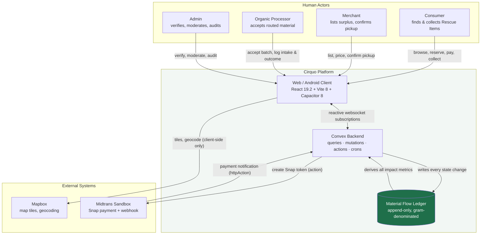
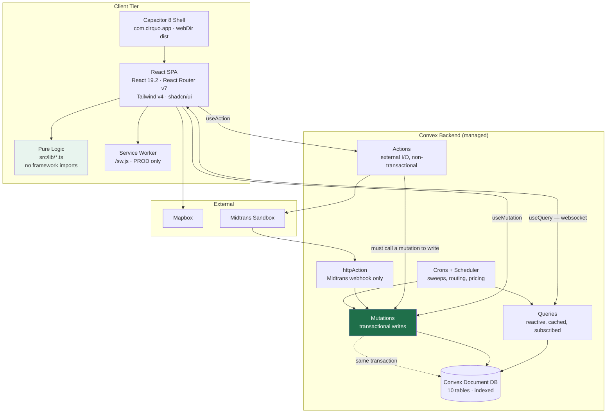
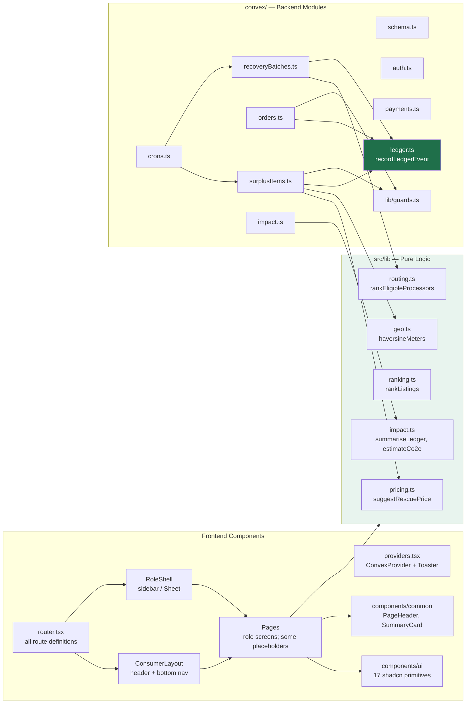
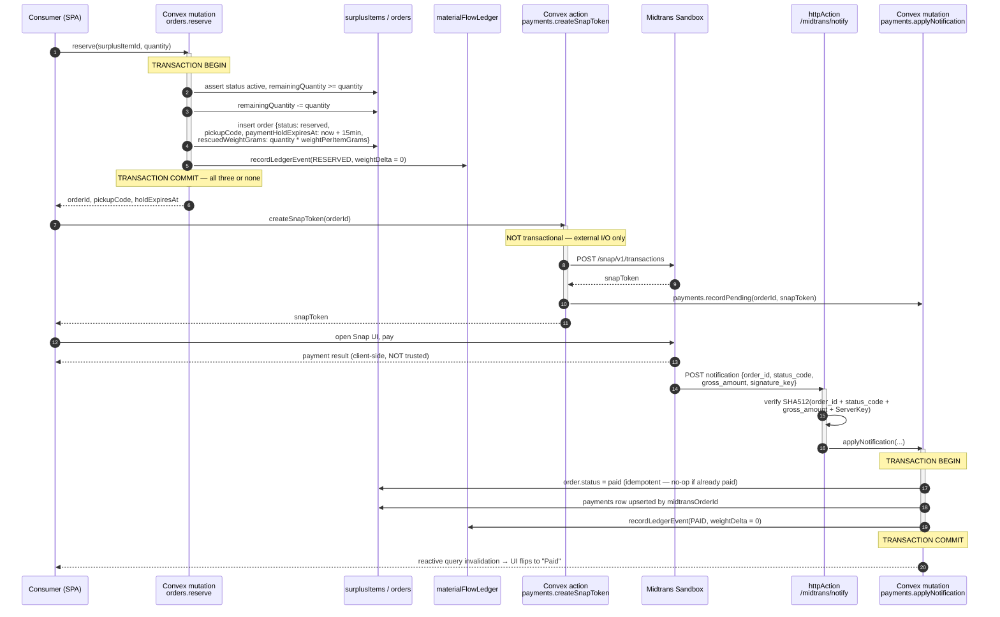
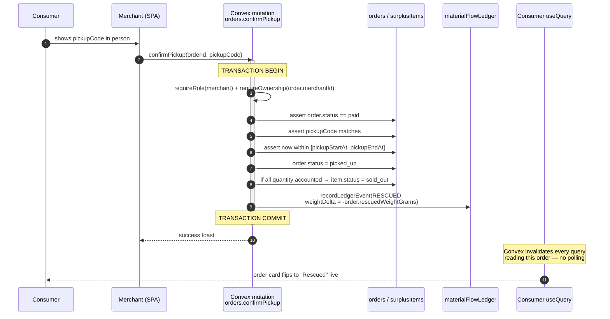
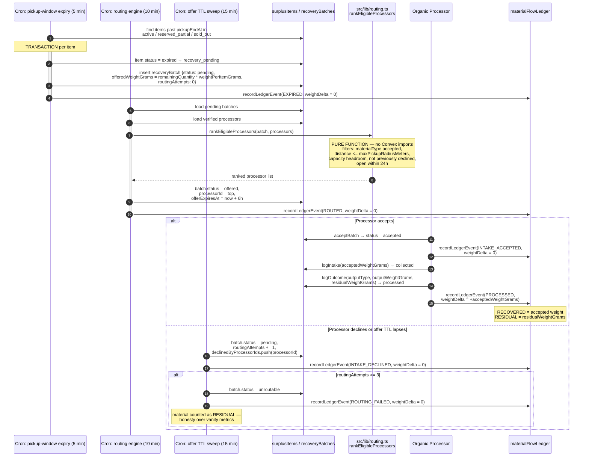
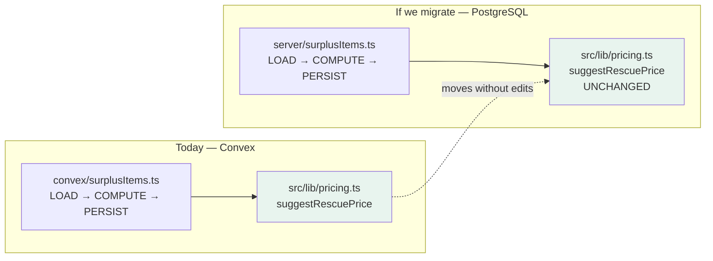
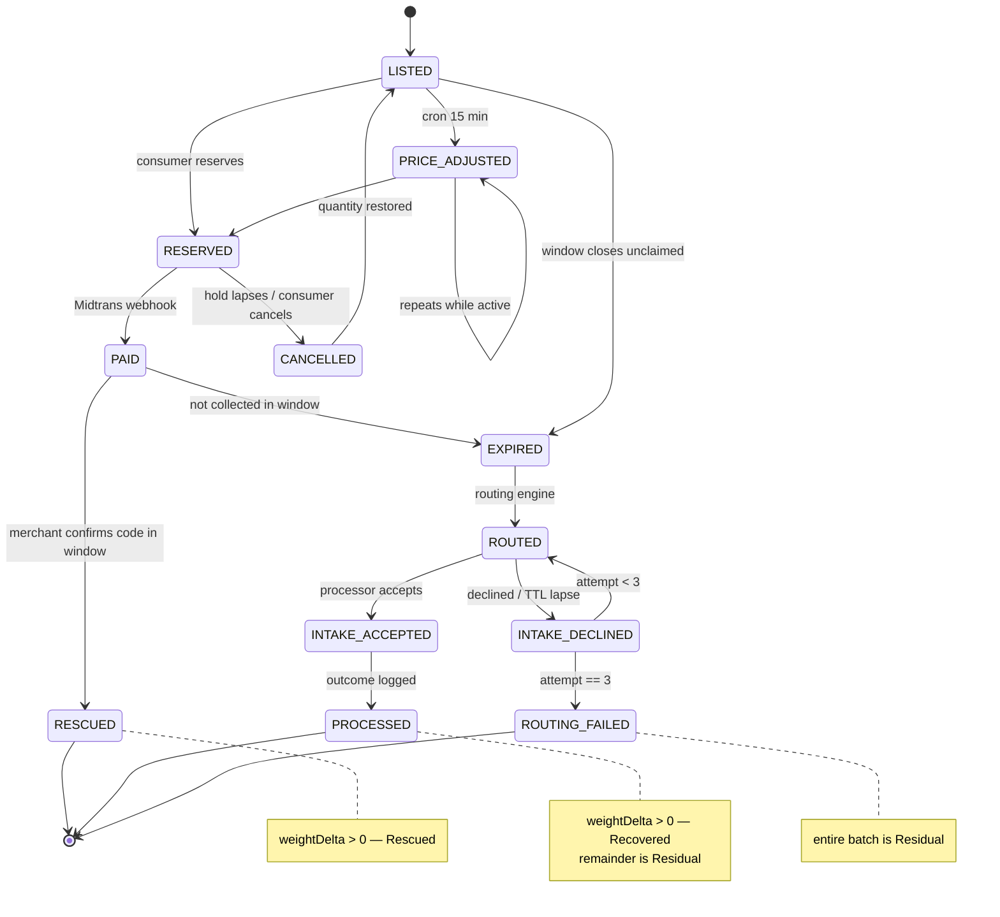
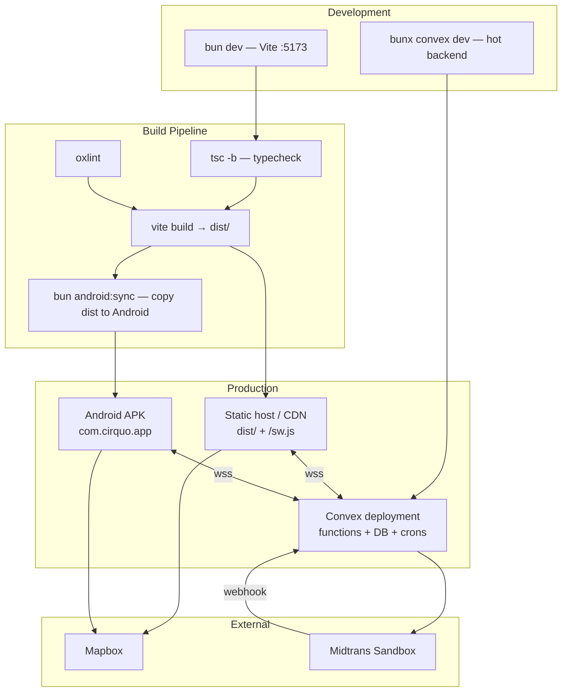
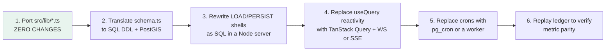

# Cirquo — System Architecture

| Field | Value |
| --- | --- |
| **Document Type** | Architecture Specification |
| **Document ID** | `ARCH-001` |
| **Status** | Architecture reference — M1–M5 source snapshot plus target design |
| **Last Updated** | 2026-08-29 |
| **Owner** | Platform Architecture |
| **Audience** | Engineers, technical judges, future maintainers |
| **Related Domain** | Material Flow Orchestration |

---

## 1. Purpose and Scope

This document describes the system architecture of **Cirquo**, a circular food recovery platform that connects merchants holding surplus edible food with consumers who collect it in person, and — when food is not collected — routes the material to verified **Organic Processors** who convert it into BSF larvae, compost, biogas, or animal feed.

Cirquo is **not a food delivery application**. No courier, no fleet, no dispatch, no delivery ETA. Consumers travel to the merchant and collect the **Rescue Item** themselves using a **pickup code**. Removing logistics from the problem space is a deliberate architectural simplification and it is the reason a four-actor circular platform is buildable by a small team.

The architectural core of Cirquo is the **Material Flow Ledger**: an append-only event log where every state change writes an immutable row carrying a signed weight delta in grams. Every impact number the platform displays — kilograms **Rescued**, kilograms **Recovered**, kilograms **Residual**, **circularity rate**, CO₂e avoided — is derived from that ledger. Nothing is stored as a mutable counter. This document explains how the rest of the system is arranged around that decision.

### 1.1 In Scope

- Context, container, and component views of the system
- Technology selection rationale, rejected alternatives, and migration triggers
- Data flow for the three critical paths
- Event catalogue and event flow
- Deployment topology
- The pure-logic separation principle
- Cross-cutting concerns
- Scalability analysis with concrete numbers
- Known architectural risks and migration trigger conditions
- Architecture Decision Records

### 1.2 Out of Scope

| Topic | Where it lives |
| --- | --- |
| Table-by-table schema | [`../domain/DATABASE.md`](../domain/DATABASE.md) |
| Status transition rules | [`../domain/STATE_MACHINE.md`](../domain/STATE_MACHINE.md) |
| Function-by-function API | [`../api/API.md`](../api/API.md) |
| Pricing and impact formulas | [`../impact/ALGORITHM.md`](../impact/ALGORITHM.md) |
| Ledger event semantics | [`../impact/MATERIAL_LEDGER.md`](../impact/MATERIAL_LEDGER.md) |
| Threat model, session handling | [`../security/SECURITY.md`](../security/SECURITY.md) |
| Visual system, tokens | [`../design/DESIGN.md`](../design/DESIGN.md) |

---

## 2. Architectural Principles

These principles are load-bearing. Every decision later in this document traces back to one of them.

| # | Principle | Practical consequence | Status |
| --- | --- | --- | --- |
| P1 | **The ledger is the truth** | No mutable impact counters. All metrics are reductions over `materialFlowLedger`. | ✅ M6 shared aggregation and all role dashboard rendering |
| P2 | **Ledger writes are transactional with the state change** | `recordLedgerEvent` is called inside the same Convex mutation that mutates state. Never from an action, never from the client. | ✅ Implemented M1–M5 transitions |
| P3 | **Business logic is framework-agnostic** | Algorithms live in `src/lib/*.ts` with zero Convex imports. Convex functions load data, call the pure function, persist the result. | ✅ Pricing, geo, routing, recovery, and impact |
| P4 | **Weight is an integer in grams; money is an integer in IDR; time is epoch milliseconds UTC** | No floats in persisted domain data. No `Date` objects in the database. WIB conversion happens only at render. | ✅ Implemented M1–M5 contracts |
| P5 | **Server-side authorization is the only authorization** | Client route guards are a UX affordance. Every Convex function re-checks identity and role. | ✅ Implemented M1–M5 surfaces |
| P6 | **Append-only means append-only** | Ledger rows are never updated or deleted. Corrections are compensating events. | ✅ Implemented M1–M5 write paths |
| P7 | **Prefer boring, reversible technology** | Where two options are close, pick the one with the cheaper exit. | ✅ Applied |
| P8 | **Honesty over polish in documentation** | Every capability is marked ✅ implemented, 🚧 in progress, or 📋 planned. | ✅ Applied |

### 2.1 Honest Implementation Status

The system is a **partially implemented MVP**. M1–M6 source is available;
M3–M6 still need Sandbox/browser/mobile UAT before sign-off. M7 onward is
target work. [IMPLEMENTATION_STATUS.md](../project/IMPLEMENTATION_STATUS.md)
is the authoritative documentation snapshot.

| Layer | Status | Detail |
| --- | --- | --- |
| Convex schema (10 tables) | ✅ Implemented | `users`, `sessions`, `authEvents`, `merchants`, `processors`, `surplusItems`, `orders`, `payments`, `recoveryBatches`, `materialFlowLedger` |
| Convex queries and mutations | ✅ M1–M5 surfaces | Auth/profile, Rescue Item, discovery, Consumer order, M4 recovery/routing, dan Processor intake/outcome tersedia. |
| Convex actions / httpAction | 🧪 M3 UAT | Midtrans Snap action and `/midtrans/webhook` source exist; M4 recurring crons juga tersedia. |
| React routes | ✅ M1–M5 plus later placeholders | Auth, Consumer, Merchant, dan Processor flows M5 terhubung ke data; Admin routes tidak membuktikan backend Admin. |
| Layouts | ✅ Implemented | `ConsumerLayout`, `RoleShell` (used by Merchant/Processor/Admin layouts) |
| UI primitives | ✅ 17 shadcn/ui components | new-york style, neutral base |
| Pure-logic modules | ✅ M6 source | `pricing.ts`, `geo.ts`, `discovery.ts`, routing, payment-hold, order grouping, formatting, validation, dan agregasi impact tersedia. |
| Auth | ✅ Implemented | Registration, login, logout, session restoration, onboarding, and guards are present. |
| Mapbox | ✅ Implemented | Consumer Mapbox discovery has a list fallback. |
| Midtrans | 🧪 UAT required | Sandbox Snap and verified webhook source are present; deployment credentials/callback must be tested. |
| Capacitor Android | ✅ Configured | `com.cirquo.app`, `webDir: dist`, sync/open/run scripts present |

---

## 3. System Context

### 3.1 Context Diagram



### 3.2 Actor Responsibilities at the Architecture Level

| Actor | Primary write surface | Ledger events they cause | Trust level |
| --- | --- | --- | --- |
| **Consumer** | `orders` | `RESERVED`, `PAID`, `CANCELLED` | Authenticated, lowest privilege |
| **Merchant** | `surplusItems`, confirm-pickup on `orders` | `LISTED`, `RESCUED`, `EXPIRED` (indirect) | Authenticated + business profile |
| **Organic Processor** | `recoveryBatches` | `INTAKE_ACCEPTED`, `INTAKE_DECLINED`, `PROCESSED` | Authenticated + **admin-verified** |
| **Admin** | moderation across tables | `MODERATED` | Highest privilege, all actions audited |
| **System (cron)** | sweeps and routing | `PRICE_ADJUSTED`, `EXPIRED`, `ROUTED`, `ROUTING_FAILED` | Server-only, `internalMutation` |

### 3.3 External System Contracts

| System | Direction | Transport | Failure impact | Mitigation |
| --- | --- | --- | --- | --- |
| **Mapbox GL JS** | Client → Mapbox | HTTPS, browser SDK | Map blank; discovery degraded | List view is the fallback surface; map is an enhancement, never the only path to a listing |
| **Mapbox Geocoding** | Client → Mapbox | HTTPS REST | Address autocomplete fails | Manual lat/lng entry with a map pin drag |
| **Midtrans Snap (create)** | Convex action → Midtrans | HTTPS REST | Cannot start payment | Order stays `reserved`; the M3 timer releases quantity at `paymentHoldExpiresAt` |
| **Midtrans Notification** | Midtrans → Convex `httpAction` | HTTPS POST, SHA512 signature | Payment settles but order stays `reserved` | Signature-verified, idempotent handler; reconciliation query for admin |

---

## 4. Container Architecture

### 4.1 Container Diagram



### 4.2 Container Inventory

| Container | Technology | Responsibility | Deployment | Status |
| --- | --- | --- | --- | --- |
| **React SPA** | React 19.2, Vite 8, TS 6 | UI, routing, forms, and Consumer map | Static bundle on CDN | ✅ M1–M6 source; M7 Admin operations remain target |
| **Pure Logic** | Plain TypeScript | Pricing, discovery/ranking, geo, recovery, validation, impact | Bundled into SPA and imported by Convex | ✅ M6 source; all role dashboards consume scoped impact queries |
| **Capacitor Shell** | Capacitor 8 | Android WebView host, native permissions | Play Store / APK | ✅ Configured |
| **Service Worker** | Vanilla SW | Shell caching, PROD only | Served with the SPA | ✅ Registered |
| **Convex Queries** | Convex 1.43 | Reactive reads | Convex cloud | ✅ M1–M5 queries exist |
| **Convex Mutations** | Convex 1.43 | Transactional writes + ledger | Convex cloud | ✅ M1–M5 writes |
| **Convex Actions** | Convex 1.43 | Midtrans Snap transaction creation | Convex cloud | 🧪 UAT required |
| **httpAction** | Convex 1.43 | Midtrans notification endpoint | Convex cloud (public URL) | 🧪 Source exists; UAT required |
| **Crons** | Convex 1.43 | Recurring sweeps | Convex cloud | 📋 Planned; M3 has one-off hold scheduling only |
| **Document DB** | Convex storage | 10 tables | Convex cloud | ✅ Schema source present |

### 4.3 Why the Backend Is a Single Container

There is no service mesh, no message broker, no separate worker fleet. Reasons:

1. **The domain fits in one transactional boundary.** Reserving an item touches `surplusItems`, `orders`, and `materialFlowLedger`. A Convex mutation is atomic across all three. Splitting these into services would immediately require a saga or outbox pattern to preserve the invariant that a state change and its ledger event commit together — that is P2, and it is non-negotiable.
2. **Scale does not demand it.** Section 10 shows the pilot generating roughly 650 ledger rows per day. Distributed architecture at that volume is cost without benefit.
3. **A small team ships faster with fewer moving parts.** Every additional deployable is an additional failure mode, an additional CI target, and an additional thing to explain to judges.

The trade-off is accepted and named: **we are coupled to Convex's execution model.** Section 8 explains the hedge.

---

## 5. Component Architecture

### 5.1 Component Diagram



### 5.2 Frontend Component Inventory (current)

| Path | Responsibility | Status |
| --- | --- | --- |
| `src/main.tsx` | Mounts `StrictMode → BrowserRouter → AppProviders → App`; registers `/sw.js` in PROD | ✅ |
| `src/app/router.tsx` | Every route definition in one file | ✅ |
| `src/app/providers.tsx` | Wraps `ConvexProvider` **conditionally** — falls back to a no-backend placeholder mode when `VITE_CONVEX_URL` is unset — plus the Sonner `Toaster` | ✅ |
| `src/layouts/ConsumerLayout.tsx` | Header, nav hidden on mobile, fixed bottom nav with 3 items | ✅ |
| `src/components/RoleShell.tsx` | Fixed 64-wide sidebar on `lg`, `Sheet` hamburger below | ✅ |
| `src/layouts/{Merchant,Processor,Admin}Layout.tsx` | Thin wrappers over `RoleShell` | ✅ |
| `src/components/ui/*` | 17 shadcn/ui primitives (new-york, neutral) | ✅ |
| `src/components/common/{PageHeader,SummaryCard}.tsx` | Shared page furniture | ✅ |
| `src/constants/mock-data.ts` | Remaining placeholder data; must not back completed flows | 🚧 |
| `src/types/domain.ts` | Mirrors the Convex schema for client typing | ✅ |
| `src/types/navigation.ts` | `NavigationItem` | ✅ |
| `src/lib/convex.ts` | Conditional client construction | ✅ |
| `src/lib/utils.ts` | `cn` | ✅ |
| `src/features/{auth,impact,orders,pricing,recovery,surplus}` | Feature slices | 📋 empty, `.gitkeep` |
| `src/components/{admin,consumer,merchant,processor}` | Role-scoped components | 📋 empty, `.gitkeep` |
| `src/hooks` | Shared hooks | 📋 empty, `.gitkeep` |
| `src/pages/auth` | Auth screens | 📋 empty, `.gitkeep` |

Detailed frontend structure is in [`FRONTEND.md`](./FRONTEND.md). Detailed backend module design is in [`BACKEND.md`](./BACKEND.md).

---

## 6. Technology Stack Rationale

Each row states **why chosen**, **what was rejected**, **the trade-off we accept**, and **the migration trigger** — the observable condition that would make us revisit the decision. A stack choice without a stated exit condition is a guess, not a decision.

### 6.1 Core Framework and Build

| Technology | Why chosen | Rejected alternatives | Trade-off accepted | Migration trigger |
| --- | --- | --- | --- | --- |
| **React 19.2** | Largest hiring pool in Indonesia; team fluency; `use()` and improved transitions reduce loading-state boilerplate; every dependency we need (shadcn/ui, Mapbox wrappers, RHF) targets React first | **Vue 3** — smaller ecosystem overlap with shadcn/Radix; **Svelte 5** — excellent DX but thin component-library ecosystem and a smaller local hiring pool; **Solid** — too niche for a competition project handed to maintainers | React ships more runtime JS than Svelte and re-render discipline is manual. We accept ~45 KB gzip of framework for ecosystem leverage. | Bundle budget breached irrecoverably (>250 KB gzip initial) **and** profiling attributes it to framework overhead rather than our code |
| **Vite 8** | Sub-second HMR on esbuild-based dev; Rollup production builds; first-class `@tailwindcss/vite`; trivial `@ → ./src` alias; the fastest path from `bun dev` to a running app | **Next.js** — SSR/RSC we do not need (Cirquo is an authenticated SPA behind a Capacitor WebView; SEO matters only for a marketing page we do not build); **Create React App** — unmaintained; **Parcel** — smaller plugin ecosystem | No SSR means no server-rendered SEO and a visible first-paint cost on cold loads. Mitigated by aggressive code splitting and the service worker. | We need public, indexable listing pages for organic acquisition → add a small SSR/SSG marketing surface, keep the SPA for the app |
| **TypeScript 6** | The domain is full of easily-confused integers — grams vs kilograms, IDR vs rupiah-decimal, epoch-ms vs seconds. Branded types and discriminated unions on ledger `eventType` catch these at compile time. Convex generates end-to-end types from `schema.ts`. | **JavaScript + JSDoc** — weaker inference across the Convex boundary; **ReScript/Elm** — unfamiliar, unhireable locally | Build step (`tsc -b && vite build`) and type-maintenance cost | Never realistically; TypeScript is a floor requirement for a ledger-based system |
| **Bun** | Package install measured in seconds not minutes; single binary for install + run + script execution; `bunx convex dev` works without friction; faster CI | **npm** — slowest installs; **pnpm** — excellent and closest competitor, but Bun also replaces the script runner and test runner, reducing tool count; **Yarn** — legacy | Bun is younger; occasional native-module edge cases. We keep `bun.lock` committed and the project is npm-compatible if we must fall back. | A dependency fails to install or run under Bun and cannot be patched → switch to pnpm; `bun.lock` is discarded, `package.json` is unchanged |

### 6.2 Styling and UI

| Technology | Why chosen | Rejected alternatives | Trade-off accepted | Migration trigger |
| --- | --- | --- | --- | --- |
| **Tailwind CSS v4** | CSS-first config via `@theme`; **OKLCH tokens** give perceptually uniform lightness so our green ramp stays legible at every step — critical for the impact-status colour scale (Rescued / Recovered / Residual); `@tailwindcss/vite` removes PostCSS config entirely; no runtime CSS-in-JS cost | **CSS Modules** — no design-token system, more files; **styled-components / Emotion** — runtime cost in a WebView on mid-range Android; **Bootstrap** — opinionated visual language we would fight | Verbose class strings in JSX. Managed with `cn` and by extracting repeated patterns into components, not `@apply` soup. | Tailwind v5 introduces a breaking token model → migrate tokens; the utility approach itself is not at risk |
| **shadcn/ui (new-york, neutral)** | Source is **copied into `src/components/ui/`**, not installed. We own it, can patch it, and have no upgrade treadmill. Built on Radix/Base UI so accessibility (focus trap, ARIA, keyboard) is correct by default. 17 primitives already vendored. | **MUI** — heavy, hard to restyle to a bespoke brand; **Chakra** — runtime styling; **Ant Design** — visually distinctive in a way that would make Cirquo look generic; **hand-rolled primitives** — we would reimplement accessible dialogs badly | We are responsible for our own updates; no automatic security patches for UI code | A Radix/Base UI primitive is deprecated → replace that single component; the pattern is unaffected |
| **radix-ui + @base-ui/react** | Underlying unstyled, accessible primitives. Base UI is the successor line from the same authors; using both lets us adopt newer primitives without rewriting existing ones. | **Headless UI** — narrower primitive set; **react-aria** — more powerful, steeper learning curve | Two primitive libraries in the tree, slightly larger dependency graph | Base UI reaches parity across all primitives we use → consolidate onto it |
| **Lucide** | Consistent 24px grid, tree-shakeable per-icon imports, matches shadcn's default | **Font Awesome** — icon-font weight; **Heroicons** — smaller set; **Material Icons** — Android-flavoured, conflicts with our brand | None material | — |
| **next-themes** | Handles the dark-mode class + `localStorage` + system preference + SSR-safe hydration in one small dependency | Hand-rolled theme hook — we would rewrite flash-of-wrong-theme handling | A `next-`prefixed package in a non-Next project (naming only) | — |
| **Sonner** | Toasts that stack, promise-aware (`toast.promise`), dismissible, and accessible. Our flows need transient confirmations — "Reservation held for 15 minutes", "Pickup confirmed" — without blocking dialogs. | **react-hot-toast** — very close, fewer stacking controls; **shadcn `<Toast>`** — deprecated upstream in favour of Sonner; **custom** — unnecessary | One more UI dependency | Sonner unmaintained → shadcn's replacement, single provider swap in `providers.tsx` |

### 6.3 Routing, Data, and Forms

| Technology | Why chosen | Rejected alternatives | Trade-off accepted | Migration trigger |
| --- | --- | --- | --- | --- |
| **React Router v7 (`react-router-dom`)** | Nested layout routes map exactly onto our four role shells; declarative and framework-agnostic; works unchanged inside a Capacitor WebView with `BrowserRouter` | **TanStack Router** — better type-safe params, but younger and an extra concept load; **Next.js App Router** — implies Next; **wouter** — too minimal for nested layouts + guards | Params are not type-safe by default; we wrap them in typed helpers | We need type-safe route params badly enough to justify a rewrite → TanStack Router |
| **Convex 1.43** | The decisive choice. (a) **Mutations are transactional across tables** — the ledger write and the state change commit together or not at all, which is principle P2 and would otherwise require an outbox pattern. (b) **Queries are reactive by default** — `useQuery` auto-subscribes; the merchant confirming a pickup updates the consumer's phone with zero socket code. (c) Schema, validators, and end-to-end types are generated from one file. (d) Crons and a scheduler are built in. | **Firebase/Firestore** — transactions are limited and cross-collection atomicity is painful; realtime is good but security rules are a separate, error-prone language; **Supabase (PostgreSQL)** — real SQL and PostGIS, but realtime needs manual channel wiring, edge functions are a separate deploy, and cross-table atomicity requires explicit transaction management in every RPC; **custom Node + PostgreSQL** — full control, but we would be writing auth, websockets, migrations, and a job scheduler instead of the product | **Vendor coupling.** Convex is a managed platform with no self-host story we would rely on. It has **no geospatial index** (see §6.5). Document-model queries are less expressive than SQL. | (1) We need true geospatial queries at a scale Haversine-in-app cannot serve, or (2) Convex pricing at our volume exceeds a self-managed alternative, or (3) we require self-hosting for a partner. → migrate to **PostgreSQL + PostGIS** (§11.3) |
| **Zod 4 + React Hook Form 7 + `@hookform/resolvers`** | RHF is uncontrolled by default → fewer re-renders on mid-range Android, which matters for the multi-field surplus listing form. Zod gives one schema reused for client validation and for deriving TypeScript types. Cirquo's forms carry real constraints (`currentPrice ≥ floorPrice`, `pickupEndAt > pickupStartAt`, weight in grams as a positive integer) that Zod's `refine`/`superRefine` expresses cleanly. | **Formik** — controlled, more re-renders, slower maintenance; **Yup** — weaker TS inference; **native form validation** — cannot express cross-field business rules | Zod schemas must be kept aligned with Convex `v.*` validators. Deliberate: they serve different purposes (see BACKEND §Validation layering). | Convex ships first-class Zod validator support → collapse the two layers |
| **date-fns** | Tree-shakeable, immutable, explicit. We store epoch-ms UTC and format to WIB only at render, so we need formatting and interval helpers, not a wrapper date type. | **Moment** — deprecated, mutable, huge; **Day.js** — smaller but a wrapper object that invites storing non-primitives; **Temporal** — not yet universally available | Function-per-import verbosity | Temporal ships everywhere → migrate incrementally |

### 6.4 Map, Payment, and Mobile

| Technology | Why chosen | Rejected alternatives | Trade-off accepted | Migration trigger |
| --- | --- | --- | --- | --- |
| **Mapbox GL JS** | Vector tiles render and restyle client-side, so the map inherits our OKLCH brand palette instead of looking like a generic road map. GPU rendering keeps pan/zoom smooth on mid-range Android. Built-in clustering handles dense merchant pins in central Semarang. Geocoding is in the same SDK. Free tier of **50,000 map loads/month** comfortably covers the pilot. | **Leaflet + OpenStreetMap** — genuinely free and no key, but raster tiles, no GPU vector rendering, clustering via a plugin, no integrated geocoder, and a visibly less polished map on a judged demo; **Google Maps** — familiar but requires billing from the first request and offers less style control; **HERE / TomTom** — weaker Indonesian coverage detail | Vendor key management, a paid-tier cliff, and a heavier SDK that must be lazy-loaded | Map loads approach ~40,000/month (80% of free tier) → evaluate caching, then Leaflet + self-hosted tiles. **Leaflet remains the named fallback**, and because the map is an enhancement over a list view, the swap is contained. |
| **Midtrans Snap (Sandbox)** | The dominant Indonesian payment aggregator. One integration covers GoPay, OVO, DANA, ShopeePay, QRIS, bank transfer, and cards — the actual payment behaviour of Semarang consumers. Snap is a hosted UI, so **no card data ever touches Cirquo** and PCI scope collapses. Sandbox is free and complete, including notification callbacks. | **Xendit** — comparable, slightly less merchant mindshare in the demo context; **Stripe** — poor Indonesian local-method coverage; **direct bank/QRIS integration** — months of compliance work; **no payments (free pickup)** — destroys the merchant revenue-recovery value proposition | Aggregator fees; a hosted UI we cannot fully brand; webhook reliability must be handled by us | Transaction volume makes per-transaction fees material → negotiate rates or add Xendit as a second processor behind a payment-provider interface |
| **Capacitor 8** | Wraps the **same React build** (`webDir: dist`) into an Android app. One codebase, one bundle, one test surface. Native geolocation, camera, push, and status-bar APIs available through plugins when we need them. `bun android:sync` is the entire pipeline. | **Flutter** — excellent native performance but a **complete second codebase in Dart**, doubling implementation cost and eliminating web entirely; **React Native** — shares React knowledge but not the code (different primitives, different styling, separate navigation), plus Mapbox and Midtrans integrations would be redone; **PWA only** — no Play Store presence, weaker Android install story, restricted background capability; **native Kotlin** — highest cost, zero reuse | **We do not claim native performance.** Capacitor runs a WebView. Heavy map interaction is measurably less smooth than a native map view. We state this openly rather than pretend otherwise. | Profiling shows WebView map performance blocking core usage on the target device class, **and** the web client is no longer strategically necessary → a native map view via a Capacitor plugin first, full native rewrite only as a last resort |
| **oxlint** | Rust-based, ~50× faster than ESLint on this codebase, sensible defaults, zero-config start. Lint runs in CI in under a second. | **ESLint** — richer plugin ecosystem (notably `eslint-plugin-react-hooks`) but far slower; **Biome** — strong competitor combining lint+format | Smaller rule set; some React-specific rules unavailable today | We need a rule oxlint cannot express (e.g. exhaustive-deps enforcement) → add ESLint alongside for that narrow rule set only |

### 6.5 The Geospatial Gap (named explicitly)

**Convex has no geospatial index.** This is the single most consequential limitation of the backend choice, and it is disclosed rather than hidden.

Nearby discovery therefore works as follows:

1. Query `surplusItems` by the `by_status` index for `status = "active"`.
2. Filter in application code using `haversineMeters` from `src/lib/geo.ts`.
3. Rank with `rankListings` from `src/lib/ranking.ts`.

At pilot scale (≈50 active items) this is trivially fast — the filter runs over tens of documents, not thousands.

**Mitigation ladder**, applied in order as scale demands:

| Step | Change | Effective up to | Cost |
| --- | --- | --- | --- |
| 0 (today) | Fetch `active`, filter by Haversine in app code | ~1,000 active items | None |
| 1 | Add a **`city` prefix to the index** (`by_city_status`) so a query only scans one city's active items | ~10,000 active items nationally | One schema field, one index |
| 2 | Add a **coarse geohash field** (precision 5, ≈4.9 km cells) and query neighbouring cells | ~100,000 active items | One field, one index, geohash helper in `src/lib/geo.ts` |
| 3 | Migrate to **PostgreSQL + PostGIS** with a GiST index and true radius queries | Effectively unbounded | Full backend migration — see §11.3 |

We do **not** pre-build steps 1–3. Building geospatial infrastructure for 50 items would be the textbook mistake. The ladder exists so the answer to "what happens when you scale?" is a plan, not a shrug.

---

## 7. Data Flow — The Three Critical Paths

### 7.1 Path A — Reserve and Pay



**Architecturally significant details:**

| Detail | Rationale |
| --- | --- |
| **Quantity decrements at reservation, not payment** | Prevents two consumers paying for the same last portion. The cost is temporarily held inventory, released by the M3 per-order hold timer. Overselling is a worse failure than a brief hold. |
| **`RESERVED` and `PAID` carry `weightDeltaGrams = 0`** | No material has moved yet. Only `RESCUED` records the actual outflow. This keeps the ledger's weight column honest. |
| **The client payment result is never trusted** | Only the signature-verified webhook transitions the order to `paid`. |
| **The Snap call is an action, not a mutation** | Actions can perform external I/O; mutations cannot. The action writes only by calling a mutation. |
| **`applyNotification` is idempotent** | Midtrans retries. Applying the same notification twice must not write two `PAID` ledger events. |

### 7.2 Path B — Confirm Pickup (the RESCUED event)



**Why this is the demo-critical moment:** it is the only point where a merchant action visibly changes a consumer's screen in real time, and it is the moment a kilogram becomes officially **Rescued**. `REALTIME.md` §7 covers staging it for judges.

**Three guards, all server-side:**

1. `pickupCode` must match — prevents a stranger claiming the order.
2. `now` must be inside the **pickup window** — prevents collection outside merchant hours.
3. `order.status` must be `paid` — prevents confirming an unpaid or already-collected order.

### 7.3 Path C — Expiry → Circular Routing → Processing



**Architecturally significant details:**

| Detail | Rationale |
| --- | --- |
| **The ranking algorithm is a pure function** | `rankEligibleProcessors` takes plain data and returns a ranked list. It is unit-testable with fixtures, has no Convex runtime dependency, and can be explained to judges as a readable file. |
| **Max 3 attempts, 6h offer TTL** | Unbounded retries would let a batch spin forever. Three attempts over ≤18 hours is a bounded, explainable policy. |
| **`unroutable` counts as RESIDUAL** | We report material we failed to recover. A platform that only counts wins is not measuring anything. This is why "zero waste" is never claimed. |
| **A consumer no-show does not create residual** | The order expires, the material re-enters routing as a new `pending` batch. The food is still recoverable — treating a no-show as waste would be factually wrong. |

---

## 8. The Pure-Logic Separation Principle

### 8.1 The Rule

Every business algorithm lives in `src/lib/*.ts` as a **pure function with zero Convex imports**.

| Module | Exported function | Responsibility |
| --- | --- | --- |
| `src/lib/pricing.ts` | `suggestRescuePrice` | **Dynamic Rescue Pricing** — discount curve, clamps, floor enforcement |
| `src/lib/routing.ts` | `rankEligibleProcessors` | **Circular Routing** eligibility filtering and ranking |
| `src/lib/ranking.ts` | `rankListings` | Consumer discovery ordering (distance, urgency, discount) |
| `src/lib/impact.ts` | `summariseLedger`, `estimateCo2e` | Reduce ledger rows to Rescued / Recovered / Residual / circularity rate; CO₂e estimation |
| `src/lib/geo.ts` | `haversineMeters` | Great-circle distance in metres |

Convex functions follow a strict three-step shape:

```
1. LOAD    — read documents via ctx.db
2. COMPUTE — call the pure function with plain data
3. PERSIST — write results + recordLedgerEvent, all in one transaction
```

### 8.2 Why This Is the Key Portability Hedge



Three concrete benefits:

| Benefit | Detail |
| --- | --- |
| **Unit-testable without a Convex runtime** | `suggestRescuePrice` is tested with a table of inputs and expected outputs. No database, no deploy, no emulator, milliseconds per test. Algorithms with edge cases (floor clamping, 0.75 discount ceiling) get exhaustive coverage cheaply. |
| **Portable if the backend migrates** | The §6.3 migration trigger names PostgreSQL + PostGIS as the exit. If that happens, the *interesting* code — the pricing curve, the routing ranker, the impact reducer — moves unchanged. Only the LOAD and PERSIST shells are rewritten. This turns a rewrite into a port. |
| **Explainable to judges** | "Where is your algorithm?" has a one-file answer with no framework noise. A reviewer reads `pricing.ts` top to bottom and understands **Dynamic Rescue Pricing** without knowing what Convex is. |

### 8.3 The Trade-Off We Accept

Loading data before computing means we sometimes fetch more documents than a database-side computation would touch. Example: the routing engine loads all verified processors and filters in memory rather than pushing predicates into the query.

At pilot scale — dozens of processors — this is irrelevant. If the processor count reaches the low thousands, we push the coarse filters (`materialType`, `city`) into indexed queries and keep only the ranking pure. **The ranking stays pure; the filtering becomes a query concern.** That boundary is chosen deliberately: filtering is a data-access question, ranking is a business question.

---

## 9. Event Architecture

### 9.1 The Ledger as the Event Log

`materialFlowLedger` is simultaneously the audit trail, the event log, and the analytics source. There is no separate events table, no CQRS read model, no event bus.

| Ledger field | Type | Purpose |
| --- | --- | --- |
| `surplusItemId` | Id | Always present — every event traces to a Rescue Item |
| `orderId` | Id? | Present for consumer-path events |
| `recoveryBatchId` | Id? | Present for recovery-path events |
| `eventType` | union | One of 13 event types (§9.2) |
| `weightDeltaGrams` | integer | Signed grams. **Zero for non-material events.** |
| `actorId` | Id? | Who caused it; absent for system events |
| `actorRole` | union? | `consumer` / `merchant` / `processor` / `admin` / `system` |
| `metadata` | object? | Event-specific payload (old/new price, decline reason, output type) |
| `methodologyVersion` | string | Which impact methodology applied — lets us change CO₂e factors without rewriting history |
| `occurredAt` | integer | Epoch ms UTC |

### 9.2 Event Catalogue

| Event | Emitted by | Weight delta | Trigger | Downstream effect |
| --- | --- | --- | --- | --- |
| `LISTED` | Merchant mutation | `+initialWeightGrams` | Rescue Item published | Item becomes discoverable |
| `PRICE_ADJUSTED` | Cron (15 min) | `0` | Dynamic Rescue Pricing recomputed **and the price changed** | Listing price updates live |
| `RESERVED` | Consumer mutation | `0` | Reservation created | Quantity decremented, 15-min hold starts |
| `PAID` | Webhook → mutation | `0` | Midtrans settlement verified | Order becomes collectable |
| `RESCUED` | Merchant mutation | `-rescuedWeightGrams` | Pickup confirmed with code inside window | **Counts toward Rescued** |
| `CANCELLED` | Consumer mutation or cron | `0` | Consumer cancels, or payment hold lapses | Quantity restored |
| `EXPIRED` | Cron (5 min) | `-unclaimedWeightGrams` | Pickup window closed with material remaining | Item → `recovery_pending`, batch created |
| `ROUTED` | Cron (10 min) | `0` | Batch offered to a ranked processor | 6h offer TTL starts |
| `ROUTING_FAILED` | Cron (15 min) | `0` | 3 attempts exhausted | Batch → `unroutable`, counted as **Residual** |
| `INTAKE_ACCEPTED` | Processor mutation | `+acceptedWeightGrams` | Physical intake logged | Batch → `collected` |
| `INTAKE_DECLINED` | Processor mutation or TTL sweep | `0` | Declined or timed out | Back to `pending`, attempts incremented |
| `PROCESSED` | Processor mutation | `-acceptedWeightGrams` | Outcome logged | Metadata splits Recovered, Residual, and process loss |
| `MODERATED` | Admin mutation | `0` | Admin intervention | Item hidden or corrected |

### 9.3 Event Flow



### 9.4 Deriving Metrics from the Ledger

All computed by `summariseLedger` in `src/lib/impact.ts` — a pure reduction, never a stored counter.

| Metric | Derivation |
| --- | --- |
| **Rescued (g)** | `Σ weightDeltaGrams where eventType = RESCUED` |
| **Recovered (g)** | `Σ weightDeltaGrams where eventType = PROCESSED` |
| **Residual (g)** | `Σ residualWeightGrams from processed batches` + `Σ offeredWeightGrams from unroutable batches` |
| **Circularity rate** | `(Rescued + Recovered) / (Rescued + Recovered + Residual)` |
| **CO₂e avoided** | `estimateCo2e(rescued, recovered, methodologyVersion)` — factors versioned so historical figures stay reproducible |

**Why derived, not stored:** a stored counter can drift from reality after a bug, a retry, or a correction. A reduction over an append-only log cannot. If we later find a mistake in the CO₂e factor, we bump `methodologyVersion` and recompute — the events themselves never change.

---

## 10. Deployment Topology

### 10.1 Diagram



### 10.2 Environments

| Environment | Frontend | Backend | Payment | Purpose |
| --- | --- | --- | --- | --- |
| **Local** | `bun dev` on :5173 | `bunx convex dev` | Midtrans Sandbox | Development |
| **Preview** | Vite build on a preview URL | Convex preview deployment | Midtrans Sandbox | PR review |
| **Demo/Production** | `dist/` on CDN + APK | Convex production deployment | **Midtrans Sandbox** (competition scope) | Judging and pilot |

Cirquo uses **Midtrans Sandbox in every environment**, including the demo. Handling real money requires merchant onboarding, KYC, and settlement agreements outside the scope of a competition build. This is stated openly.

### 10.3 Configuration

| Variable | Consumer | Present today | Notes |
| --- | --- | --- | --- |
| `VITE_CONVEX_URL` | Frontend | ✅ | When unset, the provider falls back to **no-backend placeholder mode** for UI work |
| `VITE_MAPBOX_ACCESS_TOKEN` | Frontend | ✅ | Public token, URL-restricted |
| `MIDTRANS_SERVER_KEY` | Convex action + webhook | ✅ | **Server-side only**, never in the bundle |
| `VITE_MIDTRANS_CLIENT_KEY` | Frontend (Snap) | ✅ | Public by design |

The conditional-provider pattern is a deliberate resilience feature: a judge can run `bun dev` with no `.env` at all and still see every screen.

### 10.4 Build Commands

| Script | Command | Purpose |
| --- | --- | --- |
| `dev` | `vite` | Dev server with HMR |
| `build` | `tsc -b && vite build` | Typecheck gate, then production bundle |
| `lint` | `oxlint` | Static analysis |
| `convex` | `convex dev` | Backend dev loop |
| `android:sync` | `cap sync android` | Copy `dist/` into the Android project |
| `android:open` | `cap open android` | Open Android Studio |
| `android:run` | `cap run android` | Build and run on device/emulator |

---

## 11. Scalability Analysis

### 11.1 Pilot Volumes (Semarang)

| Metric | Assumption | Daily | Monthly | Annual |
| --- | --- | --- | --- | --- |
| Merchants | 25 active | — | 25 | 25 |
| Listings per merchant | 2/day | **50 items** | 1,500 | 18,250 |
| Orders | ~3 per item | **150 orders** | 4,500 | 54,750 |
| Recovery batches | ~20% of items unclaimed | 10 batches | 300 | 3,650 |
| **Ledger rows** | see §11.2 | **≈650 rows** | ≈19,500 | **≈240,000** |
| Map loads | ~1 per consumer session | ~400 | ~12,000 | — |
| Payment transactions | = paid orders | ~150 | ~4,500 | ~54,750 |

### 11.2 Ledger Row Derivation

| Event | Count/day | Basis |
| --- | --- | --- |
| `LISTED` | 50 | one per item |
| `PRICE_ADJUSTED` | ~200 | 50 items × ~4 actual price changes over a listing's life (the cron runs every 15 min but only writes when the price moves) |
| `RESERVED` | 150 | one per order |
| `PAID` | ~140 | ~93% of reservations convert |
| `RESCUED` | ~130 | ~93% of paid orders collected |
| `CANCELLED` | ~10 | hold lapses + consumer cancels |
| `EXPIRED` | ~10 | unclaimed items |
| `ROUTED` | ~12 | includes re-offers |
| `INTAKE_ACCEPTED` | ~9 | most offers accepted |
| `INTAKE_DECLINED` | ~3 | declines and TTL lapses |
| `PROCESSED` | ~9 | one per completed batch |
| `ROUTING_FAILED` | ~1 | rare |
| `MODERATED` | ~1 | rare |
| **Total** | **≈625–650/day** | **≈240,000/year** |

### 11.3 What 240,000 Rows Means

**Read-time aggregation is entirely appropriate at this scale.** A full-year impact summary reduces ~240k documents. Scoped to a single merchant it is ~10k. Scoped to the last 30 days it is ~19.5k. Convex handles these comfortably with the `by_occurredAt` and `by_surplusItem` indexes.

**We therefore do not pre-aggregate.** `impactSnapshots` exists in the schema but is a **Phase 2 cache and never a source of truth**. Building an aggregation pipeline for 650 rows/day would be premature optimisation, and it would introduce a second number that can disagree with the ledger — exactly the failure mode P1 exists to prevent.

### 11.4 Scale Thresholds

| Stage | Cities | Merchants | Ledger rows/year | Architecture change |
| --- | --- | --- | --- | --- |
| **Pilot** | 1 (Semarang) | 25 | 240k | None — current design ✅ |
| **City** | 1 | 200 | ~1.9M | Add `by_city_status` index (mitigation ladder step 1) |
| **Multi-city** | 3–5 | 1,000 | ~9.6M | Add coarse geohash (step 2); cursor pagination on admin ledger views |
| **National** | **10+** | 5,000+ | ~48M | **`impactSnapshots` pre-aggregation becomes necessary**; evaluate PostgreSQL + PostGIS |

**Around 10 cities is the threshold** where read-time aggregation over tens of millions of rows stops being instant and the daily rollup job earns its complexity. Until then it is a documented Phase 2 item, not a build item.

### 11.5 Performance Budget

| Surface | Target | Strategy |
| --- | --- | --- |
| First contentful paint, 4G, mid-range Android | **< 2s** | Route-level code splitting per role, lazy Mapbox SDK, service worker shell cache |
| Initial JS bundle (gzip) | < 250 KB | Mapbox and Snap loaded on demand only |
| `useQuery` first response | < 300 ms | Indexed queries only; no table scans |
| Reserve mutation round-trip | < 500 ms | Single transaction, no external calls in the mutation path |
| Realtime propagation (pickup confirm → consumer screen) | < 1s | Convex websocket invalidation |
| Map interaction | 30+ fps | Vector tiles, clustering, no marker remount |

---

## 12. Cross-Cutting Concerns

### 12.1 Authentication

| Aspect | Approach | Status |
| --- | --- | --- |
| Storage | `users` + `sessions` tables | ✅ Schema |
| Mechanism | Session token, server-validated on every guarded function | ✅ Implemented |
| Client surface | `src/pages/auth` and route/session guards | ✅ Implemented |
| Roles | `consumer` / `merchant` / `processor` / `admin` on `users` | ✅ Schema |
| Backend enforcement | `requireAuth` / `requireRole` / `requireOwnership` in `convex/lib/guards.ts` | ✅ Implemented |

Detail: [`../security/AUTH.md`](../security/AUTH.md).

### 12.2 Authorization

Two layers with **explicitly different jobs**:

| Layer | Where | Purpose | Is it security? |
| --- | --- | --- | --- |
| Route guard | `RequireAuth` / `RequireRole` in React | Prevent a confusing dead-end screen | **No** — UX only |
| Function guard | `requireRole` inside every Convex function | Prevent unauthorised data access and mutation | **Yes** — the only real boundary |

The client guard is bypassable by anyone with devtools. It exists so a consumer who types `/merchant` gets redirected instead of an empty broken page. **Every Convex function re-checks independently.** Detail: [`../security/PERMISSIONS.md`](../security/PERMISSIONS.md).

### 12.3 Error Handling

| Layer | Mechanism | User-visible result |
| --- | --- | --- |
| Convex function | `throw new ConvexError({ code, message })` | Structured, catchable |
| Mutation caller | `try/catch` around `useMutation` | Sonner toast with a mapped Indonesian message |
| Query failure | React error boundary per route | Retryable error card |
| Render crash | Root error boundary | Full-page fallback with reload |
| Webhook failure | Logged, returns non-2xx | Midtrans retries |

Error codes are catalogued in [`BACKEND.md`](./BACKEND.md).

### 12.4 Logging and Observability

| Signal | Where | Retention |
| --- | --- | --- |
| Function logs | Convex dashboard | Platform default |
| **Domain audit trail** | `materialFlowLedger` | **Permanent, append-only** |
| Admin actions | Ledger `MODERATED` + `actorId` | Permanent |
| Cron outcomes | Convex logs + integrity-check alerts | Platform default |
| Client errors | Console (📋 Sentry planned) | — |

The ledger doubles as the audit log. Any question of the form "what happened to this kilogram and who caused it" is answerable from one table.

### 12.5 Internationalisation

| Aspect | Decision |
| --- | --- |
| Primary language | **Bahasa Indonesia** |
| Secondary | English (later) |
| Current state | Strings inline in components |
| Decision | **Accept the debt now, extract before English.** See [`FRONTEND.md`](./FRONTEND.md) for the reasoning and the extraction plan. |
| Currency | IDR, integer, formatted `Rp 25.000` at render |
| Numbers | Indonesian locale — `.` thousands, `,` decimal |

### 12.6 Timezone Handling

**The single most dangerous cross-cutting concern in this system**, because pickup windows are the core business constraint and Indonesia spans three timezones.

| Rule | Detail |
| --- | --- |
| **Storage** | Every timestamp is an integer, epoch milliseconds, **UTC**. Never a `Date`, never a string, never a local-time integer. |
| **Comparison** | All server logic compares integers. `now >= pickupStartAt && now <= pickupEndAt`. No timezone maths in business logic. |
| **Display** | Converted to **WIB (UTC+7)** at render only, via `date-fns`. |
| **Input** | Merchant picks a WIB wall-clock time; the client converts to epoch-ms UTC before sending. |
| **Crons** | Convex crons run on UTC. A "daily 00:00 WIB" job is registered as **17:00 UTC the previous day**. Documented explicitly in [`SCHEDULER.md`](./SCHEDULER.md). |

The failure this prevents: a pickup window stored in local time would silently shift by 7 hours for any WITA/WIT expansion, invalidating every window comparison and corrupting the ledger's `occurredAt` ordering.

---

## 13. Known Architectural Risks

| ID | Risk | Likelihood | Impact | Mitigation | Trigger to act |
| --- | --- | --- | --- | --- | --- |
| **AR-01** | **Convex vendor lock-in** | High | High | Pure-logic separation (§8) keeps all algorithms portable; schema is plain documents | Pricing, self-hosting requirement, or geospatial need |
| **AR-02** | **No geospatial index** | Certain (known today) | Medium | 4-step mitigation ladder (§6.5) | >1,000 active items nationally |
| **AR-03** | Mapbox free-tier exhaustion | Medium | Medium | Lazy load, avoid remount, monitor loads; Leaflet named as fallback | 40,000 loads/month |
| **AR-04** | Midtrans webhook missed or delayed | Medium | High | Idempotent handler, SHA512 verification, admin reconciliation query, no client-trusted status | Any unreconciled paid order |
| **AR-05** | Read-time aggregation slows | Low at pilot | Medium | `impactSnapshots` Phase 2 rollup | >10M ledger rows or >2s dashboard |
| **AR-06** | Capacitor WebView map performance | Medium | Medium | Clustering, lazy load, tested on mid-range devices; **we do not claim native performance** | Sustained <20 fps on target devices |
| **AR-07** | Ledger write omitted from a mutation | Medium | **Critical** | Code review checklist, `recordLedgerEvent` as the only write path, daily integrity check job (SCHEDULER job 10) | Any integrity-check violation |
| **AR-08** | Processor supply too thin to route | High at launch | High | 3 attempts, 6h TTL, honest `unroutable` → **Residual** reporting | `unroutable` rate >20% |
| **AR-09** | Cron overlap / long-running sweeps | Low | Medium | Batch limits, pagination, idempotent sweeps | Any sweep exceeding its interval |
| **AR-10** | Single point of failure — Convex outage | Low | **Critical** | None available (managed platform); accepted risk with a documented status page and comms plan | Repeated outages |

### 13.1 PostgreSQL Migration Trigger Conditions

We migrate off Convex **only if one of these is true**:

1. **Geospatial necessity** — active listings exceed what the mitigation ladder can serve, and true radius queries with a GiST index become mandatory.
2. **Cost inversion** — Convex spend at our volume exceeds the fully-loaded cost of a managed PostgreSQL plus the engineering to replace realtime, crons, and auth.
3. **Sovereignty requirement** — a government or enterprise partner mandates self-hosting or in-country data residency that Convex cannot satisfy.
4. **Model mismatch** — reporting needs multi-table joins and window functions that document queries make untenable.

**None of these is true today.** The migration path, if triggered:



Step 1 is free precisely because of §8. That is the entire point of the discipline.

---

## 14. Architecture Decision Records

| ID | Decision | Context | Alternatives considered | Consequence | Revisit when |
| --- | --- | --- | --- | --- | --- |
| **ADR-01** | **Adopt Convex as the sole backend** | Need transactional multi-table writes (state + ledger together) plus realtime, on a small team | Firebase, Supabase, custom Node + PostgreSQL | Atomic ledger writes for free; reactive UI with no socket code; **vendor coupling accepted** | Any §13.1 trigger fires |
| **ADR-02** | **Material Flow Ledger is the single source of truth for all impact metrics** | Impact claims must be auditable and reproducible for judges and partners | Mutable counters on entities; a separate analytics DB | Every metric is a reduction; no drift possible; read cost grows with history | Ledger exceeds ~10M rows |
| **ADR-03** | **`recordLedgerEvent` is called inside the same mutation as the state change** | A state change without its ledger event corrupts every downstream metric | Write from an action; write from the client; async outbox | Transactional guarantee; **no sagas needed**; forbids ledger writes from actions | Never — this is foundational |
| **ADR-04** | **Business logic lives in framework-agnostic `src/lib/*.ts`** | Algorithms must be testable, portable, and explainable | Logic inside Convex handlers; logic in React components | Fast unit tests, cheap migration, readable for judges; occasional over-fetching | Over-fetching becomes a measured bottleneck |
| **ADR-05** | **Decrement quantity at reservation, not payment** | Two consumers must not pay for the same last portion | Decrement at payment; optimistic overselling with refunds | No overselling; requires the 15-min payment-hold timer | Payment latency drops enough to make holds unnecessary |
| **ADR-06** | **15-minute payment hold** | Balances consumer payment time against inventory lock-up | 5 min (too tight for bank transfer), 30 min (too much dead inventory) | Predictable release; one `runAt` callback per reservation | Observed abandonment concentrates outside the window |
| **ADR-07** | **Routing capped at 3 attempts with a 6h offer TTL** | Unbounded retries could hold material indefinitely | Unlimited retries; single attempt; 24h TTL | Bounded ≤18h resolution; honest `unroutable` outcome | Processor density changes the accept rate materially |
| **ADR-08** | **Capacitor over Flutter/React Native** | Single team, single codebase, Android reach required | Flutter (second Dart codebase), React Native (shared knowledge, not shared code), PWA only | One build serves web and Android; **WebView performance ceiling accepted and disclosed** | Measured WebView performance blocks core usage |
| **ADR-09** | **Mapbox over Leaflet** | Branded vector map, clustering, integrated geocoding, smooth on mid-range Android | Leaflet + OSM (free, raster), Google Maps (billing from request 1) | Better demo and UX; free-tier ceiling and key management | 40,000 map loads/month |
| **ADR-10** | **Midtrans Snap hosted UI** | Indonesian local payment methods; minimise PCI scope | Xendit, Stripe, direct QRIS, no payments | Broad method coverage; **no card data touches Cirquo**; limited branding | Fee pressure or a need for a second processor |
| **ADR-11** | **Accept the geospatial gap; filter with Haversine in app code** | Convex has no geospatial index; pilot has ~50 active items | Build geohashing now; choose PostGIS from day one | Zero complexity today; documented 4-step ladder ready | >1,000 active items nationally |
| **ADR-12** | **No pre-aggregation; `impactSnapshots` is a Phase 2 cache only** | 240k rows/year makes read-time reduction fast and always correct | Build the rollup pipeline now; materialised views | Metrics can never disagree with the ledger; read cost grows with history | ~10 cities, or dashboards exceed 2s |
| **ADR-13** | **Client route guards are UX-only; authorization lives in Convex functions** | Client code is fully untrusted | Client-only guards; a separate API gateway | Defence at the only boundary that matters; guard code duplicated in every function | Convex ships declarative function-level auth rules |
| **ADR-14** | **All timestamps are epoch-ms UTC; WIB conversion at render only** | Pickup windows are the core constraint; Indonesia spans three timezones | Store WIB local time; store ISO strings | Timezone-safe comparisons everywhere; crons must be registered in UTC (17:00 UTC = 00:00 WIB) | Never |

---

## 15. Related Documents

| Document | Relationship |
| --- | --- |
| [`FRONTEND.md`](./FRONTEND.md) | Client architecture, routing, state, map, Capacitor |
| [`BACKEND.md`](./BACKEND.md) | Convex modules, transactions, guards, integrations |
| [`REALTIME.md`](./REALTIME.md) | Reactivity model and realtime surfaces |
| [`SCHEDULER.md`](./SCHEDULER.md) | The 10 scheduled jobs |
| [`../domain/DOMAIN.md`](../domain/DOMAIN.md) | Ubiquitous language |
| [`../domain/STATE_MACHINE.md`](../domain/STATE_MACHINE.md) | Every status transition |
| [`../domain/DATA_MODEL.md`](../domain/DATA_MODEL.md) | Entities and relationships |
| [`../domain/DATABASE.md`](../domain/DATABASE.md) | Tables, fields, indexes |
| [`../api/API.md`](../api/API.md) | Function contracts |
| [`../impact/ALGORITHM.md`](../impact/ALGORITHM.md) | Pricing, routing, impact formulas |
| [`../impact/MATERIAL_LEDGER.md`](../impact/MATERIAL_LEDGER.md) | Ledger semantics and invariants |
| [`../security/SECURITY.md`](../security/SECURITY.md) | Threat model |
| [`../security/AUTH.md`](../security/AUTH.md) | Sessions and identity |
| [`../security/PERMISSIONS.md`](../security/PERMISSIONS.md) | Role matrix |
| [`../design/DESIGN.md`](../design/DESIGN.md) | Design system and OKLCH tokens |
| [`../engineering/DEVELOPMENT.md`](../engineering/DEVELOPMENT.md) | Local setup |
| [`../engineering/TESTING.md`](../engineering/TESTING.md) | Test strategy |
| [`../engineering/DEPLOYMENT.md`](../engineering/DEPLOYMENT.md) | Release process |
| [`../product/PRD.md`](../product/PRD.md) | Product requirements |
| [`../business/RISKS.md`](../business/RISKS.md) | Business risk register |

---

**Built for DSDC ANFORCOM 2026**  
**Platform:** Cirquo — Closing the Loop, Saving Every Meal
