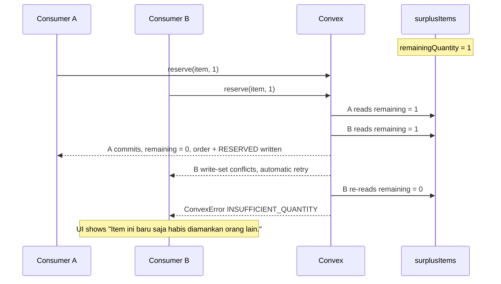
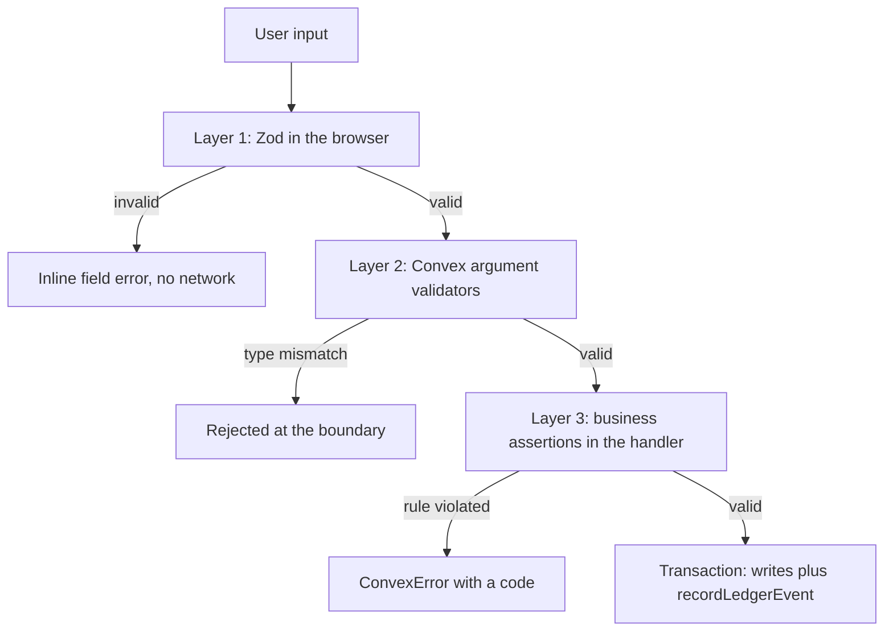
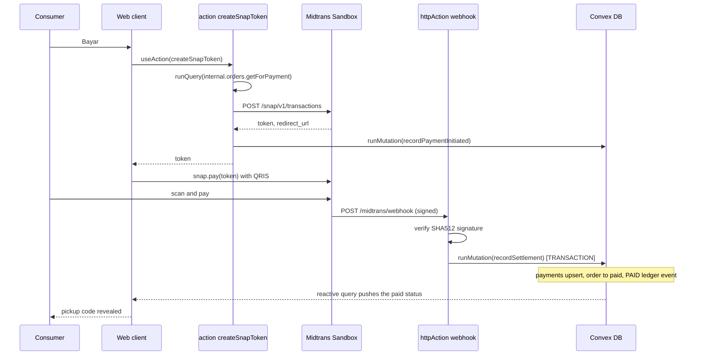

# Backend Architecture

| Field | Value |
| --- | --- |
| **Document Type** | Architecture Specification |
| **Status** | Target backend architecture with implemented M1–M5 subset |
| **Last Updated** | 2026-08-29 |
| **Owner** | Backend Engineering |
| **Platform** | Convex 1.43 |
| **Audience** | Engineers, reviewers, DSDC ANFORCOM 2026 judges |

---

## 1. Purpose and Scope

The Cirquo backend has exactly one non-negotiable responsibility: **every kilogram of surplus food must be accounted for**. The product's claim is Material Flow Orchestration — that we can say, for any Rescue Item ever listed, where its mass ended up. That claim is only as strong as the backend's transactional discipline.

This document specifies how Convex functions are organised, when to use each function type, how transactions guarantee that a quantity decrement and a **Material Flow Ledger** write can never diverge, how authorisation is enforced, how pure logic is kept out of the database layer, and how external systems (Midtrans, Mapbox) are integrated safely.

**Current state — 2026-08-29.** The backend now has a 10-table schema, session
authentication and guards, Material Flow Ledger writes, Merchant and Consumer
flows, M4 pickup/recovery/routing, M5 Processor intake/outcome, M6 role-scoped
aggregation, and dashboard reads for all roles. Sections marked 📋 in this document remain target
architecture; verify `convex/` before treating them as implemented.

---

## 2. `convex/` File Organisation

```
convex/
├── schema.ts             ✅ tables, indexes, validators
├── auth.ts               ✅ register, login, logout, currentUser
├── users.ts              ✅ internal email lookup
├── merchants.ts          ✅ profile create + owner lookup
├── processors.ts         ✅ Processor profile create/read/update
├── surplusItems.ts       ✅ create, publish, update, cancel, listMine
├── orders.ts             ✅ reserve, payment hold, pickup, listMine, get
├── payments.ts           🧪 Snap transaction + pending payment context
├── recoveryBatches.ts    ✅ route, accept/decline, measured intake, outcome
├── ledger.ts             📋 read-only ledger queries (append-only; no public writes)
├── impact.ts             ✅ role-scoped ledger-derived summaries
├── notifications.ts      📋 listMine, markRead, internal create/fanOut
├── disputes.ts           📋 open, resolve
├── admin.ts              📋 verification queue, moderation, overrides, integrity report
├── crons.ts              ✅ M4 payment-hold, expiry, and routing registrations
├── http.ts               🧪 Midtrans webhook httpAction only
└── lib/
    ├── guards.ts         ✅ requireAuth, requireRole, requireOwnership
    ├── ledger.ts         ✅ recordLedgerEvent
    └── validators.ts     📋 shared v.* unions, id validators, business assertions
```

### 2.1 Responsibilities

| File | Responsibility | Must not contain | Status |
| --- | --- | --- | --- |
| `schema.ts` | Table definitions, field validators, index declarations. The single source of structural truth. | Business logic | ✅ |
| `auth.ts` | Session lifecycle: register, login, logout, `currentUser`. Password hashing via an action. | Role checks (those live in `lib/guards.ts`) | ✅ |
| `users.ts` | User document reads and profile updates. | Role escalation paths | ✅ partial |
| `merchants.ts` | Merchant profile CRUD, verification status reads. | Listing logic | ✅ partial |
| `processors.ts` | Processor profile creation. | Routing algorithm and recovery operations | ✅ partial |
| `surplusItems.ts` | Rescue Item lifecycle: create, publish, update, cancel, and own-list reads. | Order logic and routing | ✅ M2 |
| `orders.ts` | Reservation, hold expiry, owned list/detail reads. **The most transaction-critical file.** | Payment provider calls, pickup confirmation, and cancellation | ✅ M3 subset |
| `payments.ts` | Midtrans Snap token creation (action) and pending payment context. | Direct DB writes from the action | 🧪 M3 UAT |
| `recoveryBatches.ts` | Circular Routing lifecycle: create, offer, accept, decline, intake, outcome. | Ranking algorithm (lives in `src/lib/routing.ts`) | ✅ partial |
| `ledger.ts` | Read-only ledger queries: per item, per order, per actor, per event type. | Any public write function | 📋 |
| `impact.ts` | Role-scoped aggregation queries built on `summariseLedger` and `estimateCo2e`. | Its own arithmetic (delegates to `src/lib/impact.ts`) | ✅ M6-01 source |
| `notifications.ts` | User notification reads and internal creation/fan-out. | Business state transitions | 📋 |
| `disputes.ts` | Dispute opening and resolution. | Refund execution (delegates to payments) | 📋 |
| `admin.ts` | Verification queue, moderation, admin overrides, integrity reports. | Anything callable without `requireRole(ctx, "admin")` | 📋 |
| `crons.ts` | Cron registrations only. Every handler is an `internalMutation` elsewhere. | Handler implementations | 📋 |
| `http.ts` | **Exactly one route:** the Midtrans webhook. | Any other public HTTP surface | 🧪 M3 UAT |
| `lib/guards.ts` | `requireAuth`, `requireRole`, `requireOwnership`. | Table-specific logic | ✅ |
| `lib/ledger.ts` | `recordLedgerEvent` — the only ledger writer. | Public exports | ✅ |
| `lib/validators.ts` | Shared `v.*` unions and business-rule assertion helpers. | I/O | 📋 |

### 2.2 The `convex/lib/` vs `src/lib/` Split

Two `lib/` directories, two different jobs. Confusing them is the most likely structural mistake.

| | `convex/lib/` | `src/lib/` |
| --- | --- | --- |
| Contains | Convex-aware helpers: guards, ledger writer, validators | Pure algorithms: pricing, routing, ranking, impact, geo |
| Imports `ctx` | Yes | **Never** |
| Imports Convex | Yes | **Never** |
| Runs where | Convex runtime only | Convex runtime *and* browser |
| Testable without Convex | No | **Yes** |
| Example | `requireRole(ctx, "merchant")` | `suggestRescuePrice(input)` |

---

## 3. Function Type Decision Table

Convex offers five function kinds plus internal variants. Choosing wrongly is not a style issue — an action that writes the ledger silently breaks the atomicity guarantee the whole product rests on.

| Type | Transactional | Read DB | Write DB | External APIs | Client-callable | Use for |
| --- | --- | --- | --- | --- | --- | --- |
| `query` | Yes (consistent snapshot) | ✅ | ❌ | ❌ | ✅ | Every reactive read |
| `mutation` | **Yes (atomic)** | ✅ | ✅ | ❌ | ✅ | Every state change + its ledger event |
| `action` | **No** | via `runQuery` | via `runMutation` | ✅ | ✅ | Midtrans Snap token, password hashing |
| `internalQuery` | Yes | ✅ | ❌ | ❌ | ❌ | Reads for crons and actions |
| `internalMutation` | **Yes (atomic)** | ✅ | ✅ | ❌ | ❌ | Cron handlers, webhook settlement |
| `internalAction` | No | via `runQuery` | via `runMutation` | ✅ | ❌ | Scheduled external calls |
| `httpAction` | No | via `runQuery` | via `runMutation` | ✅ | Public HTTP | **Only** the Midtrans webhook |

### 3.1 Worked Examples

**`query` — reactive read, scoped.**

```ts
// convex/surplusItems.ts
export const listByMerchant = query({
  args: {
    merchantId: v.id("merchants"),
    status: v.optional(itemStatusValidator),
  },
  handler: async (ctx, args) => {
    const merchant = await ctx.db.get(args.merchantId);
    if (!merchant) return [];
    await requireOwnership(ctx, merchant.ownerId);

    if (args.status) {
      return await ctx.db
        .query("surplusItems")
        .withIndex("by_merchant_status", (q) =>
          q.eq("merchantId", args.merchantId).eq("status", args.status!))
        .order("desc")
        .collect();
    }
    return await ctx.db
      .query("surplusItems")
      .withIndex("by_merchant", (q) => q.eq("merchantId", args.merchantId))
      .order("desc")
      .collect();
  },
});
```

**`mutation` — state change plus ledger, atomically.** See section 4 for `orders.reserve` in full.

**`action` — external API, no direct DB write.**

```ts
// convex/payments.ts
export const createSnapToken = action({
  args: { orderId: v.id("orders") },
  handler: async (ctx, args): Promise<{ token: string; redirectUrl: string }> => {
    // Actions cannot read the DB directly.
    const order = await ctx.runQuery(internal.orders.getForPayment, { orderId: args.orderId });
    if (!order) throw new ConvexError({ code: "ORDER_NOT_FOUND" });
    if (order.status !== "reserved") throw new ConvexError({ code: "ORDER_NOT_PAYABLE" });
    if (order.paymentHoldExpiresAt <= Date.now()) {
      throw new ConvexError({ code: "PAYMENT_HOLD_EXPIRED" });
    }

    const serverKey = process.env.MIDTRANS_SERVER_KEY!;
    const auth = btoa(`${serverKey}:`);

    const res = await fetch("https://app.sandbox.midtrans.com/snap/v1/transactions", {
      method: "POST",
      headers: {
        "Content-Type": "application/json",
        Accept: "application/json",
        Authorization: `Basic ${auth}`,
      },
      body: JSON.stringify({
        transaction_details: {
          order_id: order.midtransOrderId,   // deterministic, see section 9.2
          gross_amount: order.totalPrice,    // integer IDR
        },
        enabled_payments: ["qris", "gopay", "shopeepay"],
        customer_details: { first_name: order.userName, email: order.userEmail },
        expiry: { unit: "minute", duration: 15 },   // mirrors the payment hold
      }),
    });

    if (!res.ok) {
      throw new ConvexError({ code: "PAYMENT_PROVIDER_ERROR", status: res.status });
    }
    const body = await res.json();

    // Writes go through a mutation — actions cannot touch the DB.
    await ctx.runMutation(internal.payments.recordPaymentInitiated, {
      orderId: args.orderId,
      providerTransactionId: order.midtransOrderId,
      amount: order.totalPrice,
    });

    return { token: body.token, redirectUrl: body.redirect_url };
  },
});
```

**`internalMutation` — M3 per-order timer, not client-callable.**

```ts
// convex/orders.ts
export const expireHold = internalMutation({
  args: { orderId: v.id("orders") },
  handler: async (ctx) => {
    const order = await ctx.db.get(args.orderId);
    if (!order || order.status !== "reserved") return;
    if ((order.paymentHoldExpiresAt ?? 0) > Date.now()) return;
    // Restore stock, mark order expired, and write CANCELLED (0 g) atomically.
  },
});
```

**`httpAction` — the only public HTTP surface.** See section 9.2.

### 3.2 The Traps

| Trap | Why it breaks | Correct approach |
| --- | --- | --- |
| **Writing the ledger from an action** | Actions are not transactional. If the state mutation committed and the subsequent ledger write failed, the ledger is permanently missing an event and impact numbers are wrong forever. | Always `recordLedgerEvent(ctx, …)` inside the same mutation. |
| Calling `fetch` from a mutation | Convex mutations have no network access, by design — an external call cannot be rolled back. | Move the call to an action; have the action call a mutation. |
| Several `runMutation` calls from one action, expecting atomicity | Each `runMutation` is its own transaction. A crash between them leaves a partial state. | Design one mutation that performs all the writes. |
| Exporting a sensitive function without `internal` | **Any non-internal function is callable by any client that knows its name.** A `mutation` named `adminApproveMerchant` is reachable from a browser console. | Use `internalMutation` for anything not meant for direct client calls, and guard everything else. |
| Reading `Date.now()` inside a `query` | Queries are cached against their read set; wall-clock time is not part of it, producing inconsistent reactivity. | Pass `now` from the client, or derive freshness client-side. |
| `ctx.db.query(...).collect()` on a large table | Loads everything into memory and blows the function limit. | Use an index plus `.take(n)`, or paginate. |

---

## 4. Transaction Semantics

### 4.1 What Convex Guarantees

A Convex `mutation` executes as a **serializable transaction across all tables**. Every `ctx.db.patch`, `ctx.db.insert`, and `ctx.db.replace` inside a single mutation either all commit or none do. If the handler throws — including a `ConvexError` thrown by a guard or a business-rule assertion — **nothing is written**.

Convex uses optimistic concurrency control: it tracks each mutation's read and write sets, and if a conflicting mutation commits first, it **automatically retries** the losing mutation from the beginning with fresh data. The developer writes no retry logic.

This single property is what allows Cirquo to make a strong claim: **it is structurally impossible for a state change to exist without its ledger event.**

### 4.2 `orders.reserve` in Full

This is the most important function in the system. Quantity is decremented **at reservation, not at payment** — a deliberate choice that prevents overselling — and the `RESERVED` ledger event is written in the same transaction.

```ts
// convex/orders.ts — 📋 planned
import { v, ConvexError } from "convex/values";
import { mutation } from "./_generated/server";
import { requireAuth } from "./lib/guards";
import { recordLedgerEvent } from "./lib/ledger";
import { generatePickupCode } from "./lib/validators";

const PAYMENT_HOLD_MS = 15 * 60 * 1000;   // 15-minute payment hold
const PLATFORM_FEE_RATE = 0.10;

export const reserve = mutation({
  args: {
    surplusItemId: v.id("surplusItems"),
    quantity: v.number(),
  },
  handler: async (ctx, args) => {
    const user = await requireAuth(ctx);
    const now = Date.now();

    if (!Number.isInteger(args.quantity) || args.quantity < 1) {
      throw new ConvexError({ code: "INVALID_QUANTITY" });
    }

    // ---- READ ------------------------------------------------------------
    const item = await ctx.db.get(args.surplusItemId);
    if (!item) throw new ConvexError({ code: "ITEM_NOT_FOUND" });

    if (item.status !== "active" && item.status !== "reserved_partial") {
      throw new ConvexError({ code: "ITEM_NOT_ACTIVE", status: item.status });
    }
    if (item.processingOnly) {
      throw new ConvexError({ code: "PROCESSING_ONLY" });
    }
    if (now >= item.pickupEndAt) {
      throw new ConvexError({ code: "PICKUP_WINDOW_CLOSED" });
    }
    if (item.remainingQuantity < args.quantity) {
      throw new ConvexError({
        code: "INSUFFICIENT_QUANTITY",
        remaining: item.remainingQuantity,
        requested: args.quantity,
      });
    }

    const merchant = await ctx.db.get(item.merchantId);
    if (!merchant) throw new ConvexError({ code: "MERCHANT_NOT_FOUND" });
    if (merchant.ownerId === user._id) {
      throw new ConvexError({ code: "CANNOT_RESERVE_OWN_ITEM" });
    }

    // ---- COMPUTE ---------------------------------------------------------
    const unitPrice = item.currentPrice;                                // integer IDR
    const totalPrice = unitPrice * args.quantity;
    const rescuedWeightGrams = item.weightPerItemGrams * args.quantity; // snapshot
    const platformFeeAmount = Math.round(totalPrice * PLATFORM_FEE_RATE);
    const remainingAfter = item.remainingQuantity - args.quantity;
    const pickupCode = generatePickupCode();

    // ---- WRITE (all-or-nothing) -----------------------------------------
    // 1. Decrement quantity AT RESERVATION.
    await ctx.db.patch(item._id, {
      remainingQuantity: remainingAfter,
      status: remainingAfter === 0 ? "sold_out" : "reserved_partial",
    });

    // 2. Insert the order with a 15-minute payment hold.
    const orderId = await ctx.db.insert("orders", {
      userId: user._id,
      surplusItemId: item._id,
      merchantId: item.merchantId,
      quantity: args.quantity,
      unitPrice,
      totalPrice,
      rescuedWeightGrams,          // frozen snapshot — never recomputed later
      platformFeeAmount,
      pickupCode,
      status: "reserved",
      createdAt: now,
      paymentHoldExpiresAt: now + PAYMENT_HOLD_MS,
    });

    // 3. Append the immutable ledger event — SAME transaction.
    await recordLedgerEvent(ctx, {
      surplusItemId: item._id,
      orderId,
      eventType: "RESERVED",
      weightDeltaGrams: rescuedWeightGrams,
      actorId: user._id,
      actorRole: "consumer",
      metadata: { quantity: args.quantity, unitPrice, totalPrice, remainingAfter },
      occurredAt: now,
    });

    // 4. Notify the merchant — a notification is DB state, so same transaction.
    await ctx.db.insert("notifications", {
      userId: merchant.ownerId,
      type: "reservation_created",
      title: "Reservasi baru",
      body: `${args.quantity}x ${item.name} diamankan.`,
      link: "/merchant/orders",
      read: false,
      createdAt: now,
    });

    return { orderId, pickupCode, totalPrice, holdExpiresAt: now + PAYMENT_HOLD_MS };
  },
});
```

### 4.3 Why This Removes the Need for Sagas

In a conventional stack — a REST service over PostgreSQL plus a separate event store, or microservices per bounded context — the four writes above span systems. You then need one of:

- A **saga**: a sequence of local transactions with compensating actions ("un-decrement the quantity if the ledger write failed").
- An **outbox table**: write the event locally, publish it asynchronously, deduplicate downstream.
- **Two-phase commit**: available, slow, operationally painful.

Every one of those introduces a window in which the system is inconsistent, plus code to detect and repair it. For Cirquo the failure would be severe: a quantity decremented with no `RESERVED` event means a unit disappears from availability and never appears in the ledger. The impact report would under-count. The audit trail would have a hole. The core product claim would be false.

Convex's cross-table transaction collapses the problem:

| Concern | Saga / outbox architecture | Cirquo on Convex |
| --- | --- | --- |
| Partial failure | Compensating transactions | Impossible — rollback is automatic |
| Ordering | Message-ordering guarantees required | Sequential code in one handler |
| Duplicate events | Consumer-side dedupe required | Webhook transaction/order guards prevent duplicate `PAID` events |
| Retry on contention | Manual backoff | Convex OCC retries automatically |
| Code required | Orchestrator, compensations, dedupe keys, monitoring | Zero |

We accept the trade-off that Convex is a managed platform and mutations must be short-lived and side-effect-free. Both constraints are satisfied by our workload: every mutation touches a handful of documents, and all external I/O (Midtrans) is isolated in actions.

### 4.4 Contention Behaviour



Neither consumer sees a corrupt state. B's retry re-executes the whole handler including the guard checks, so B is rejected on fresh data, not stale data. Full analysis in section 13.

### 4.5 Pickup Code Generation

```ts
// convex/lib/validators.ts
const CODE_ALPHABET = "ABCDEFGHJKLMNPQRSTUVWXYZ23456789"; // no I, O, 0, 1

export function generatePickupCode(): string {
  const bytes = new Uint8Array(6);
  crypto.getRandomValues(bytes);
  return Array.from(bytes, (b) => CODE_ALPHABET[b % CODE_ALPHABET.length]).join("");
}
```

32^6 is approximately 1.07 billion combinations. Verification matches the code **within the merchant's own open orders** (`orders.by_pickup_code`, then a merchant filter), so a platform-wide collision is not itself a security problem.

---

## 5. The Ledger Contract

### 5.1 `recordLedgerEvent` in Full

```ts
// convex/lib/ledger.ts — 📋 planned
import { MutationCtx } from "../_generated/server";
import { Id } from "../_generated/dataModel";
import { ConvexError } from "convex/values";

export const METHODOLOGY_VERSION = "impact-v1";

export type LedgerEventType =
  | "LISTED" | "PRICE_ADJUSTED" | "RESERVED" | "PAID" | "RESCUED"
  | "CANCELLED" | "EXPIRED" | "ROUTED" | "ROUTING_FAILED"
  | "INTAKE_ACCEPTED" | "INTAKE_DECLINED" | "PROCESSED" | "MODERATED";

const TERMINAL_EVENTS: ReadonlySet<LedgerEventType> = new Set([
  "RESCUED", "PROCESSED", "ROUTING_FAILED", "MODERATED",
]);

export interface LedgerEventInput {
  surplusItemId: Id<"surplusItems">;
  orderId?: Id<"orders">;
  recoveryBatchId?: Id<"recoveryBatches">;
  eventType: LedgerEventType;
  weightDeltaGrams: number;      // integer grams; may be 0 or negative
  actorId?: Id<"users">;
  actorRole?: "consumer" | "merchant" | "processor" | "admin" | "system";
  metadata?: Record<string, unknown>;
  occurredAt: number;            // epoch ms UTC — passed in, never Date.now() here
}

/**
 * The ONLY writer to materialFlowLedger.
 * MUST be called inside the same mutation that changed the state it records.
 */
export async function recordLedgerEvent(
  ctx: MutationCtx,
  event: LedgerEventInput,
): Promise<Id<"materialFlowLedger">> {
  if (!Number.isInteger(event.weightDeltaGrams)) {
    throw new ConvexError({ code: "LEDGER_INVALID_WEIGHT", value: event.weightDeltaGrams });
  }
  if (!Number.isInteger(event.occurredAt) || event.occurredAt <= 0) {
    throw new ConvexError({ code: "LEDGER_INVALID_TIMESTAMP" });
  }

  // Guard: the same terminal event may not be recorded twice for one item.
  if (TERMINAL_EVENTS.has(event.eventType)) {
    const prior = await ctx.db
      .query("materialFlowLedger")
      .withIndex("by_rescue_item", (q) => q.eq("surplusItemId", event.surplusItemId))
      .filter((q) => q.eq(q.field("eventType"), event.eventType))
      .first();

    if (prior) {
      throw new ConvexError({
        code: "LEDGER_TERMINAL_ALREADY_RECORDED",
        eventType: event.eventType,
      });
    }
  }

  return await ctx.db.insert("materialFlowLedger", {
    surplusItemId: event.surplusItemId,
    orderId: event.orderId,
    recoveryBatchId: event.recoveryBatchId,
    eventType: event.eventType,
    weightDeltaGrams: event.weightDeltaGrams,
    actorId: event.actorId,
    actorRole: event.actorRole,
    metadata: event.metadata,
    methodologyVersion: METHODOLOGY_VERSION,
    occurredAt: event.occurredAt,
  });
}
```

There is **no** `updateLedgerEvent` and **no** `deleteLedgerEvent`. The table is append-only. Corrections are made by appending a compensating event carrying `metadata.correctionFor`, never by editing history.

Note on the terminal guard: a partially rescued item can legitimately produce both `RESCUED` (for the collected portion) and later `PROCESSED` (for the remainder routed to a processor). The guard therefore rejects only *duplicate* terminal events of the same type, not any second terminal event.

### 5.2 The Four Anti-Patterns

**Anti-pattern 1 — a separate call from the client.**

```ts
// ❌ NEVER
await reserveItem({ itemId, quantity });
await recordEvent({ type: "RESERVED", weight });  // may never run
```

The user closes the tab between the two calls. State changed; the ledger did not. Impact numbers are permanently understated and there is no way to detect it after the fact.

**Anti-pattern 2 — a ledger write from an action.**

```ts
// ❌ NEVER
export const confirmPickup = action({
  handler: async (ctx, args) => {
    await ctx.runMutation(internal.orders.markPickedUp, args);  // txn 1 commits
    await ctx.runMutation(internal.ledger.write, { /* ... */ }); // txn 2 may fail
  },
});
```

Two transactions. Actions are not transactional and are not retried as a unit. If the process dies between them, the order is `picked_up` with no `RESCUED` event, and the impact dashboard silently under-reports a rescue that actually happened.

**Anti-pattern 3 — a public ledger mutation.**

```ts
// ❌ NEVER
export const appendLedgerEvent = mutation({ /* ... */ });
```

Any non-internal function is callable by any client that knows its name. Exposing this lets anyone fabricate `RESCUED` events and inflate impact figures. The ledger backs the platform's sustainability claim; it must have exactly one writer, reachable only from server code.

**Anti-pattern 4 — recomputing a historical weight.**

```ts
// ❌ NEVER
const item = await ctx.db.get(order.surplusItemId);
const weight = item.weightPerItemGrams * order.quantity;  // item may have changed
```

```ts
// ✅ ALWAYS
const weight = order.rescuedWeightGrams;  // frozen at reservation
```

`weightPerItemGrams` is a mutable field on a mutable document. A merchant correcting a portion weight from 250 g to 300 g after a pickup would retroactively change last month's impact report. The `orders.rescuedWeightGrams` snapshot, captured inside the reservation transaction, is the authoritative historical value. **Never recompute a historical weight.**

### 5.3 Event to Emitter Map

| Event | Emitted by | Weight delta | Terminal |
| --- | --- | --- | --- |
| `LISTED` | `surplusItems.publish` | `+ initialQuantity × weightPerItemGrams` | No |
| `PRICE_ADJUSTED` | `surplusItems.applyPriceTick` (cron) | `0` | No |
| `RESERVED` | `orders.reserve` | `0` | No |
| `PAID` | `payments.recordSettlement` (webhook) | `0` | No |
| `RESCUED` | `orders.confirmPickup` | `- order.rescuedWeightGrams` | **Yes** |
| `CANCELLED` | `orders.expireHold` (payment hold) | `0` | No |
| `EXPIRED` | `surplusItems.sweepPickupWindow` | `- unclaimed grams` | No |
| `ROUTED` | `recoveryBatches.runRouting` (cron) | `0` | No |
| `ROUTING_FAILED` | `recoveryBatches.sweepOfferTtl` | `0` | **Yes** |
| `INTAKE_ACCEPTED` | `recoveryBatches.logIntake` | `+ acceptedWeightGrams` | No |
| `INTAKE_DECLINED` | `recoveryBatches.decline`, TTL sweep | `0` | No |
| `PROCESSED` | `recoveryBatches.logOutcome` | `- acceptedWeightGrams` | **Yes** |
| `MODERATED` | `admin.moderateItem` | `0` | **Yes** |

Full semantics: [`../impact/MATERIAL_LEDGER.md`](../impact/MATERIAL_LEDGER.md).

---

## 6. Guards

### 6.1 Implementation

```ts
// convex/lib/guards.ts — 📋 planned
import { ConvexError } from "convex/values";
import { QueryCtx, MutationCtx } from "../_generated/server";
import { Doc, Id } from "../_generated/dataModel";

export type Ctx = QueryCtx | MutationCtx;
export type UserRole = "consumer" | "merchant" | "processor" | "admin";

/**
 * Resolves the caller's session into a user document.
 * Throws if the session is missing or expired, or the user is not active.
 */
export async function requireAuth(ctx: Ctx): Promise<Doc<"users">> {
  const identity = await ctx.auth.getUserIdentity();
  if (!identity) throw new ConvexError({ code: "NOT_AUTHENTICATED" });

  const user = await ctx.db
    .query("users")
    .withIndex("by_email", (q) => q.eq("email", identity.email!))
    .unique();

  if (!user) throw new ConvexError({ code: "NOT_AUTHENTICATED" });
  if (user.status !== "active") {
    throw new ConvexError({ code: "ACCOUNT_SUSPENDED", status: user.status });
  }
  return user;
}

/** Session-token variant used while the custom sessions table is in place. */
export async function requireSession(ctx: Ctx, token: string): Promise<Doc<"users">> {
  const session = await ctx.db
    .query("sessions")
    .withIndex("by_token", (q) => q.eq("token", token))
    .unique();

  if (!session) throw new ConvexError({ code: "NOT_AUTHENTICATED" });
  if (session.expiresAt <= Date.now()) throw new ConvexError({ code: "SESSION_EXPIRED" });

  const user = await ctx.db.get(session.userId);
  if (!user) throw new ConvexError({ code: "NOT_AUTHENTICATED" });
  if (user.status !== "active") {
    throw new ConvexError({ code: "ACCOUNT_SUSPENDED", status: user.status });
  }
  return user;
}

/** Authenticates and asserts the user holds one of the accepted roles. */
export async function requireRole(ctx: Ctx, ...roles: UserRole[]): Promise<Doc<"users">> {
  const user = await requireAuth(ctx);
  if (!roles.includes(user.role as UserRole)) {
    throw new ConvexError({ code: "NOT_AUTHORIZED", required: roles, actual: user.role });
  }
  return user;
}

/**
 * Asserts the authenticated user owns the resource.
 * Admins bypass ownership deliberately — every bypass is ledger-visible
 * through actorRole "admin".
 */
export async function requireOwnership(ctx: Ctx, ownerId: Id<"users">): Promise<Doc<"users">> {
  const user = await requireAuth(ctx);
  if (user._id !== ownerId && user.role !== "admin") {
    throw new ConvexError({ code: "NOT_AUTHORIZED", reason: "not_owner" });
  }
  return user;
}

/** Convenience: resolve the merchant profile owned by the caller. */
export async function requireMerchant(ctx: Ctx): Promise<Doc<"merchants">> {
  const user = await requireRole(ctx, "merchant");
  const merchant = await ctx.db
    .query("merchants")
    .withIndex("by_owner", (q) => q.eq("ownerId", user._id))
    .unique();
  if (!merchant) throw new ConvexError({ code: "MERCHANT_PROFILE_MISSING" });
  return merchant;
}

/** Convenience: resolve the processor profile owned by the caller. */
export async function requireProcessor(ctx: Ctx): Promise<Doc<"processors">> {
  const user = await requireRole(ctx, "processor");
  const processor = await ctx.db
    .query("processors")
    .withIndex("by_owner", (q) => q.eq("ownerId", user._id))
    .unique();
  if (!processor) throw new ConvexError({ code: "PROCESSOR_PROFILE_MISSING" });
  return processor;
}

/** Verified-only actions: publishing listings, accepting batches. */
export function requireVerified(profile: Doc<"merchants"> | Doc<"processors">): void {
  if (profile.verificationStatus !== "verified") {
    throw new ConvexError({ code: "NOT_VERIFIED", status: profile.verificationStatus });
  }
}
```

### 6.2 Usage Pattern

Every mutation opens with a guard. No exceptions.

```ts
export const publish = mutation({
  args: { itemId: v.id("surplusItems") },
  handler: async (ctx, args) => {
    const merchant = await requireMerchant(ctx);   // role + profile
    requireVerified(merchant);                     // business precondition

    const item = await ctx.db.get(args.itemId);
    if (!item) throw new ConvexError({ code: "ITEM_NOT_FOUND" });
    if (item.merchantId !== merchant._id) {
      throw new ConvexError({ code: "NOT_AUTHORIZED", reason: "not_owner" });
    }
    // ... status transition + LISTED ledger event ...
  },
});
```

### 6.3 Guard Coverage Matrix

| Function | `requireAuth` | Role | Ownership | Verified |
| --- | --- | --- | --- | --- |
| `surplusItems.create` | ✅ | merchant | own merchant | ✅ |
| `surplusItems.publish` | ✅ | merchant | own item | ✅ |
| `surplusItems.update` | ✅ | merchant | own item | ✅ |
| `orders.reserve` | ✅ | consumer | — | — |
| `orders.confirmPickup` | ✅ | merchant | own order's merchant | ✅ |
| `orders.cancel` | ✅ | consumer | own order | — |
| `recoveryBatches.accept` | ✅ | processor | offered to self | ✅ |
| `recoveryBatches.logIntake` | ✅ | processor | own batch | ✅ |
| `recoveryBatches.logOutcome` | ✅ | processor | own batch | ✅ |
| `admin.verifyMerchant` | ✅ | admin | — | — |
| `admin.moderateItem` | ✅ | admin | — | — |
| `admin.overridePickup` | ✅ | admin | — | — |
| All `internal*` | n/a | n/a | n/a | not client-callable |

Full matrix: [`../security/PERMISSIONS.md`](../security/PERMISSIONS.md).

---

## 7. Pure-Logic Separation

### 7.1 Before — Logic Trapped in a Mutation ❌

```ts
// ❌ Untestable without a Convex runtime; unusable by the frontend.
export const applyPriceTick = internalMutation({
  handler: async (ctx) => {
    const items = await ctx.db.query("surplusItems")
      .withIndex("by_status", (q) => q.eq("status", "active")).take(200);

    for (const item of items) {
      const now = Date.now();
      const published = item.publishedAt ?? item.createdAt;
      const total = item.pickupEndAt - published;
      const elapsed = Math.min(1, Math.max(0, (now - published) / total));
      const shortfall = item.remainingQuantity / item.initialQuantity;
      const base =
        item.materialType === "prepared_meal" ? 0.30 :
        item.materialType === "bakery" ? 0.25 :
        item.materialType === "produce" ? 0.20 : 0.15;
      let discount = base + 0.25 * elapsed * elapsed + 0.10 * shortfall;
      if (discount > 0.75) discount = 0.75;
      let price = Math.round(item.originalPrice * (1 - discount));
      if (price < item.floorPrice) price = item.floorPrice;

      if (price !== item.currentPrice) {
        await ctx.db.patch(item._id, { currentPrice: price });
        await recordLedgerEvent(ctx, { /* ... */ });
      }
    }
  },
});
```

Problems: the pricing rule is invisible to anyone looking for it; testing it requires a Convex runtime and seeded documents; the merchant UI cannot preview a price without a round trip; and if the backend ever migrated, the rule would have to be rewritten and re-verified.

### 7.2 After — Pure Function Plus Thin Persistence ✅

```ts
// src/lib/pricing.ts — NO Convex imports, NO React imports, NO I/O
export type MaterialType =
  | "bakery" | "produce" | "prepared_meal" | "dairy" | "grocery" | "beverage";

const BASE_DISCOUNT: Record<MaterialType, number> = {
  prepared_meal: 0.30,
  bakery: 0.25,
  produce: 0.20,
  dairy: 0.20,
  grocery: 0.15,
  beverage: 0.15,
};

export const MAX_DISCOUNT = 0.75;

export interface RescuePricingInput {
  materialType: MaterialType;
  originalPrice: number;   // integer IDR
  floorPrice: number;      // integer IDR
  publishedAt: number;     // epoch ms UTC
  pickupEndAt: number;     // epoch ms UTC
  now: number;             // epoch ms UTC — injected for determinism
  initialQuantity: number;
  remainingQuantity: number;
}

/**
 * Dynamic Rescue Pricing.
 *   discount = base(materialType) + 0.25 * elapsed^2 + 0.10 * shortfall
 *   clamped to MAX_DISCOUNT, floored at floorPrice.
 * elapsed   = fraction of the pickup window consumed (0..1)
 * shortfall = fraction of stock still unsold (0..1)
 */
export function suggestRescuePrice(input: RescuePricingInput): number {
  const span = Math.max(1, input.pickupEndAt - input.publishedAt);
  const elapsed = clamp01((input.now - input.publishedAt) / span);
  const shortfall = input.initialQuantity === 0
    ? 0
    : clamp01(input.remainingQuantity / input.initialQuantity);

  const raw = BASE_DISCOUNT[input.materialType] + 0.25 * elapsed ** 2 + 0.10 * shortfall;
  const discount = Math.min(raw, MAX_DISCOUNT);

  const price = Math.round(input.originalPrice * (1 - discount));
  return Math.max(price, input.floorPrice);
}

function clamp01(n: number): number {
  return n < 0 ? 0 : n > 1 ? 1 : n;
}
```

```ts
// convex/surplusItems.ts — load, call the pure function, persist
import { suggestRescuePrice } from "../src/lib/pricing";

export const applyPriceTick = internalMutation({
  args: {},
  handler: async (ctx) => {
    const now = Date.now();
    const items = await ctx.db
      .query("surplusItems")
      .withIndex("by_status", (q) => q.eq("status", "active"))
      .take(200);

    let adjusted = 0;

    for (const item of items) {
      const next = suggestRescuePrice({
        materialType: item.materialType,
        originalPrice: item.originalPrice,
        floorPrice: item.floorPrice,
        publishedAt: item.publishedAt ?? item.createdAt,
        pickupEndAt: item.pickupEndAt,
        now,
        initialQuantity: item.initialQuantity,
        remainingQuantity: item.remainingQuantity,
      });

      if (next === item.currentPrice) continue;   // emit only on a real change

      await ctx.db.patch(item._id, { currentPrice: next });
      await recordLedgerEvent(ctx, {
        surplusItemId: item._id,
        eventType: "PRICE_ADJUSTED",
        weightDeltaGrams: 0,
        actorRole: "system",
        metadata: { from: item.currentPrice, to: next },
        occurredAt: now,
      });
      adjusted++;
    }

    return { scanned: items.length, adjusted };
  },
});
```

The mutation is now orchestration around one function call: load, compute, persist, record.

### 7.3 The Pure Modules

| Module | Exports | Consumed by | Status |
| --- | --- | --- | --- |
| `src/lib/pricing.ts` | `suggestRescuePrice` | price-tick cron, merchant preview UI | 📋 |
| `src/lib/routing.ts` | `rankEligibleProcessors` | routing engine cron, admin explainer | 📋 |
| `src/lib/ranking.ts` | `rankListings` | `surplusItems.listNearby`, Explore sort | 📋 |
| `src/lib/impact.ts` | `summariseLedger`, `estimateCo2e`, proyeksi operasi Processor/Admin | impact queries dan dashboard seluruh peran | ✅ M6 source |
| `src/lib/geo.ts` | `haversineMeters` | nearby filtering, routing eligibility, distance display | 📋 |

**Justification, restated for judges.** Unit-testable without a Convex runtime. Portable if the backend migrates. Explainable in isolation — a reader can understand Dynamic Rescue Pricing from `suggestRescuePrice` without knowing what Convex is. And critically, **the server and the client compute identical numbers**, so a merchant's price preview can never disagree with the price the cron actually sets.

---

## 8. Error Handling

### 8.1 `ConvexError` with Structured Codes

Never throw a bare `Error`. `ConvexError` carries a structured payload to the client, where it is mapped to Indonesian copy.

```ts
throw new ConvexError({
  code: "INSUFFICIENT_QUANTITY",
  remaining: item.remainingQuantity,
  requested: args.quantity,
});
```

```ts
// src/lib/errors.ts
export function extractConvexErrorCode(error: unknown): string {
  if (error instanceof ConvexError && typeof error.data === "object" && error.data) {
    return (error.data as { code?: string }).code ?? "UNKNOWN";
  }
  return "UNKNOWN";
}
```

### 8.2 Canonical Error Code Catalogue

| Code | Thrown by | HTTP analogue | User-facing copy (id-ID) |
| --- | --- | --- | --- |
| `NOT_AUTHENTICATED` | `requireAuth` | 401 | Masuk dulu untuk melanjutkan. |
| `SESSION_EXPIRED` | `requireSession` | 401 | Sesi berakhir. Silakan masuk lagi. |
| `ACCOUNT_SUSPENDED` | `requireAuth` | 403 | Akun Anda ditangguhkan. Hubungi dukungan. |
| `NOT_AUTHORIZED` | `requireRole`, `requireOwnership` | 403 | Anda tidak punya akses ke tindakan ini. |
| `NOT_VERIFIED` | `requireVerified` | 403 | Akun belum terverifikasi admin. |
| `MERCHANT_PROFILE_MISSING` | `requireMerchant` | 409 | Lengkapi profil merchant dulu. |
| `PROCESSOR_PROFILE_MISSING` | `requireProcessor` | 409 | Lengkapi profil processor dulu. |
| `ITEM_NOT_FOUND` | item lookups | 404 | Rescue Item tidak ditemukan. |
| `ITEM_NOT_ACTIVE` | `orders.reserve` | 409 | Rescue Item ini sudah tidak tersedia. |
| `PROCESSING_ONLY` | `orders.reserve` | 409 | Item ini hanya untuk pemrosesan organik. |
| `INSUFFICIENT_QUANTITY` | `orders.reserve` | 409 | Item ini baru saja habis diamankan orang lain. |
| `INVALID_QUANTITY` | `orders.reserve` | 400 | Jumlah tidak valid. |
| `CANNOT_RESERVE_OWN_ITEM` | `orders.reserve` | 403 | Anda tidak bisa mengamankan item sendiri. |
| `PICKUP_WINDOW_CLOSED` | reserve, confirmPickup | 409 | Pickup window sudah berakhir. |
| `PICKUP_WINDOW_NOT_OPEN` | `orders.confirmPickup` | 409 | Pickup window belum dibuka. |
| `INVALID_PICKUP_CODE` | `orders.confirmPickup` | 404 | Kode pickup tidak cocok. |
| `ORDER_NOT_FOUND` | order lookups | 404 | Pesanan tidak ditemukan. |
| `ORDER_NOT_PAYABLE` | `payments.createSnapToken` | 409 | Pesanan ini tidak bisa dibayar. |
| `ORDER_NOT_PAID` | `orders.confirmPickup` | 409 | Pembayaran belum selesai. |
| `PAYMENT_HOLD_EXPIRED` | payments, reserve | 409 | Batas 15 menit pembayaran terlewat. |
| `PAYMENT_PROVIDER_ERROR` | `payments.createSnapToken` | 502 | Gagal menghubungi penyedia pembayaran. |
| `PAYMENT_AMOUNT_MISMATCH` | webhook | 400 | (internal — logged, never shown) |
| `INVALID_SIGNATURE` | webhook | 401 | (internal — logged, never shown) |
| `ITEM_LOCKED_BY_RESERVATION` | `surplusItems.update` | 409 | Item sudah dipesan dan tidak bisa diubah. |
| `INVALID_PRICE_RANGE` | `surplusItems.create/update` | 400 | Harga rescue harus di antara floor price dan harga asli. |
| `INVALID_PICKUP_WINDOW` | `surplusItems.create/update` | 400 | Pickup window tidak valid. |
| `BATCH_NOT_FOUND` | batch lookups | 404 | Batch tidak ditemukan. |
| `BATCH_NOT_OFFERED_TO_YOU` | `recoveryBatches.accept` | 403 | Batch ini tidak ditawarkan ke fasilitas Anda. |
| `BATCH_OFFER_EXPIRED` | `recoveryBatches.accept` | 409 | Penawaran sudah kedaluwarsa. |
| `BATCH_ALREADY_ACCEPTED` | `recoveryBatches.accept` | 409 | Batch sudah diambil fasilitas lain. |
| `INVALID_ACCEPTED_WEIGHT` | `logIntake` | 400 | Berat masuk tidak valid. |
| `RESIDUAL_EXCEEDS_ACCEPTED` | `logOutcome` | 400 | Residual tidak boleh melebihi berat yang diterima. |
| `CAPACITY_EXCEEDED` | `recoveryBatches.accept` | 409 | Kapasitas harian fasilitas terlampaui. |
| `LEDGER_INVALID_WEIGHT` | `recordLedgerEvent` | 500 | (internal) |
| `LEDGER_INVALID_TIMESTAMP` | `recordLedgerEvent` | 500 | (internal) |
| `LEDGER_TERMINAL_ALREADY_RECORDED` | `recordLedgerEvent` | 409 | (internal) |

Rules: codes are `SCREAMING_SNAKE_CASE`, stable (they are an API contract), and never contain user-facing prose — translation is the client's job. Codes marked "(internal)" indicate a bug or an attack and surface as a generic message plus a server log.

---

## 9. Idempotency

### 9.1 Mutation Idempotency

| Mutation | Idempotent? | Mechanism |
| --- | --- | --- |
| `orders.reserve` | ❌ No, by design | Two reservations are two distinct claims; guarded by the quantity check |
| `orders.confirmPickup` | ✅ Yes | No-op if `status === "picked_up"` |
| `orders.cancel` | ✅ Yes | No-op if already `cancelled` / `expired` |
| `payments.recordSettlement` | ✅ Yes | Keyed on `providerTransactionId` |
| `recoveryBatches.accept` | ✅ Yes | No-op if already accepted by the same processor; error if by another |
| `recoveryBatches.logIntake` | ✅ Yes | No-op if `acceptedWeightGrams` is already set |
| `recoveryBatches.logOutcome` | ✅ Yes | No-op if `status === "processed"` |
| All cron sweeps | ✅ Yes | Status-guarded queries select only rows that still need work |

Canonical shape, with the `RESCUED` terminal event:

```ts
export const confirmPickup = mutation({
  args: { orderId: v.id("orders"), pickupCode: v.string() },
  handler: async (ctx, args) => {
    const actor = await requireAuth(ctx);
    const order = await ctx.db.get(args.orderId);
    if (!order) throw new ConvexError({ code: "ORDER_NOT_FOUND" });

    // Idempotent short-circuit — a double-tap is safe.
    if (order.status === "picked_up") {
      return { ok: true, alreadyConfirmed: true };
    }

    const isAdmin = actor.role === "admin";
    if (!isAdmin) {
      const merchant = await requireMerchant(ctx);
      requireVerified(merchant);
      if (order.merchantId !== merchant._id) {
        throw new ConvexError({ code: "NOT_AUTHORIZED", reason: "not_owner" });
      }
    }

    if (order.status !== "paid") throw new ConvexError({ code: "ORDER_NOT_PAID" });
    if (order.pickupCode !== args.pickupCode) {
      throw new ConvexError({ code: "INVALID_PICKUP_CODE" });
    }

    const item = await ctx.db.get(order.surplusItemId);
    if (!item) throw new ConvexError({ code: "ITEM_NOT_FOUND" });

    const now = Date.now();
    // Admin may override the window; a merchant may not.
    if (!isAdmin && (now < item.pickupStartAt || now > item.pickupEndAt)) {
      throw new ConvexError({
        code: now < item.pickupStartAt ? "PICKUP_WINDOW_NOT_OPEN" : "PICKUP_WINDOW_CLOSED",
      });
    }

    await ctx.db.patch(order._id, { status: "picked_up", pickedUpAt: now });

    await recordLedgerEvent(ctx, {
      surplusItemId: order.surplusItemId,
      orderId: order._id,
      eventType: "RESCUED",
      weightDeltaGrams: -order.rescuedWeightGrams, // snapshot, never recomputed
      actorId: actor._id,
      actorRole: isAdmin ? "admin" : "merchant",
      metadata: { quantity: order.quantity, totalPrice: order.totalPrice, override: isAdmin },
      occurredAt: now,
    });

    return { ok: true, alreadyConfirmed: false };
  },
});
```

**Why every transition must be safe to run twice.** A scheduled callback can replay. `expireHold` guards `status === 'reserved'`, so a second callback is a no-op; its first execution records `CANCELLED` with zero grams. M4 cron handlers need the same state-guard pattern without reintroducing a payment-hold sweep.

### 9.2 Midtrans Webhook

Midtrans retries notifications until it receives `200`. The same `order_id` will arrive multiple times, sometimes out of order.

```ts
// convex/http.ts — 📋 planned
import { httpRouter } from "convex/server";
import { httpAction } from "./_generated/server";
import { internal } from "./_generated/api";

const http = httpRouter();

http.route({
  path: "/midtrans/webhook",
  method: "POST",
  handler: httpAction(async (ctx, request) => {
    let body: MidtransNotification;
    try {
      body = await request.json();
    } catch {
      return new Response("bad json", { status: 400 });
    }

    const {
      order_id, status_code, gross_amount, signature_key,
      transaction_status, fraud_status, payment_type,
      transaction_id, settlement_time,
    } = body;

    // 1. Verify SHA512 over order_id + status_code + gross_amount + ServerKey.
    const expected = await sha512Hex(
      `${order_id}${status_code}${gross_amount}${process.env.MIDTRANS_SERVER_KEY!}`,
    );
    if (!timingSafeEqual(expected, signature_key)) {
      console.error("[midtrans] invalid signature", { order_id });
      return new Response("invalid signature", { status: 401 });
    }

    // 2. Map the provider status onto an internal outcome.
    const mapped = mapMidtransStatus(transaction_status, fraud_status);
    if (mapped === "ignore") {
      return new Response("ok", { status: 200 });  // ack pending / challenge
    }

    // 3. Delegate to an idempotent internalMutation — that is the transaction.
    await ctx.runMutation(internal.payments.recordSettlement, {
      midtransOrderId: order_id,
      providerTransactionId: transaction_id,
      grossAmount: Math.round(Number(gross_amount)),
      method: payment_type,
      outcome: mapped,                       // "settled" | "failed" | "refunded"
      settledAt: settlement_time ? parseMidtransTime(settlement_time) : Date.now(),
      rawPayload: body as unknown as Record<string, unknown>,
    });

    return new Response("ok", { status: 200 });
  }),
});

export default http;
```

```ts
async function sha512Hex(input: string): Promise<string> {
  const data = new TextEncoder().encode(input);
  const digest = await crypto.subtle.digest("SHA-512", data);
  return Array.from(new Uint8Array(digest))
    .map((b) => b.toString(16).padStart(2, "0"))
    .join("");
}

function timingSafeEqual(a: string, b: string): boolean {
  if (a.length !== b.length) return false;
  let diff = 0;
  for (let i = 0; i < a.length; i++) diff |= a.charCodeAt(i) ^ b.charCodeAt(i);
  return diff === 0;
}
```

**Status mapping.**

| `transaction_status` | `fraud_status` | Internal outcome | Order status | Ledger |
| --- | --- | --- | --- | --- |
| `capture` | `accept` | `settled` | `paid` | `PAID` |
| `capture` | `challenge` | `ignore` | `reserved` | none |
| `settlement` | any | `settled` | `paid` | `PAID` |
| `pending` | any | `ignore` | `reserved` | none |
| `deny` | any | `failed` | unchanged | none |
| `cancel` | any | `failed` | `cancelled` | `CANCELLED` |
| `expire` | any | `failed` | `expired` | `CANCELLED` |
| `refund` / `partial_refund` | any | `refunded` | `refunded` | `CANCELLED` |

**The idempotent settlement mutation.**

```ts
// convex/payments.ts — 📋 planned
export const recordSettlement = internalMutation({
  args: {
    midtransOrderId: v.string(),
    providerTransactionId: v.string(),
    grossAmount: v.number(),
    method: v.optional(v.string()),
    outcome: v.union(v.literal("settled"), v.literal("failed"), v.literal("refunded")),
    settledAt: v.number(),
    rawPayload: v.any(),
  },
  handler: async (ctx, args) => {
    const orderId = parseOrderIdFromMidtransId(args.midtransOrderId);
    const order = await ctx.db.get(orderId);
    if (!order) {
      console.error("[midtrans] unknown order", args.midtransOrderId);
      return { handled: false };            // still 200 — stop the retry storm
    }

    // --- Idempotency: has this exact provider transaction been recorded? ---
    const existing = await ctx.db
      .query("payments")
      .withIndex("by_order", (q) => q.eq("orderId", orderId))
      .filter((q) => q.eq(q.field("providerTransactionId"), args.providerTransactionId))
      .first();

    if (existing && existing.status === args.outcome) {
      return { handled: true, duplicate: true };
    }

    // --- Verify the amount against OUR record, not the callback's claim ---
    if (args.outcome === "settled" && args.grossAmount !== order.totalPrice) {
      console.error("[midtrans] amount mismatch", {
        expected: order.totalPrice, received: args.grossAmount,
      });
      throw new ConvexError({ code: "PAYMENT_AMOUNT_MISMATCH" });
    }

    const now = args.settledAt;

    if (existing) {
      await ctx.db.patch(existing._id, {
        status: args.outcome, rawPayload: args.rawPayload, settledAt: now,
      });
    } else {
      await ctx.db.insert("payments", {
        orderId,
        provider: "midtrans",
        providerTransactionId: args.providerTransactionId,
        amount: args.grossAmount,
        method: args.method,
        status: args.outcome,
        rawPayload: args.rawPayload,
        createdAt: now,
        settledAt: now,
      });
    }

    if (args.outcome === "settled" && order.status === "reserved") {
      await ctx.db.patch(orderId, { status: "paid", paidAt: now });
      await recordLedgerEvent(ctx, {
        surplusItemId: order.surplusItemId,
        orderId,
        eventType: "PAID",
        weightDeltaGrams: 0,
        actorId: order.userId,
        actorRole: "consumer",
        metadata: { amount: args.grossAmount, method: args.method },
        occurredAt: now,
      });
    }

    if (args.outcome === "failed" && order.status === "reserved") {
      await releaseReservation(ctx, order, now, "payment_failed");
    }

    return { handled: true, duplicate: false };
  },
});
```

**Late-settlement race.** If the M3 hold timer expires an order before a settlement webhook arrives, the order is already `expired`; the webhook may update payment context but never promotes a non-`reserved` order to `paid`. Financial remediation is outside the current order-state contract. Extending the hold "just in case" would weaken the anti-overselling guarantee.

---

## 10. Validation Layering

Three layers, each catching what the others structurally cannot.



| Layer | Runs where | Catches | Cannot catch |
| --- | --- | --- | --- |
| **1. Zod** | Browser | Empty name, negative price, end before start | Anything, if the client is bypassed |
| **2. `v.*`** | Convex boundary | Wrong types, missing args, unknown fields, malformed IDs | Cross-field and stateful rules |
| **3. Handler assertions** | Convex handler | `currentPrice >= floorPrice`, sufficient quantity, window open, ownership, capacity | — |

### 10.1 Why All Three

**Layer 1 exists for UX, not safety.** It gives instant feedback with zero latency. Removing it costs the user a round trip per typo; removing it changes nothing about security.

**Layer 2 exists because Convex functions are a public API.** Any non-internal function is callable by anyone who knows its name. `v.*` validators are the type boundary — without them a handler could receive `quantity: "banana"` and produce `NaN` arithmetic that silently writes `NaN` grams into the ledger, permanently poisoning every impact aggregation that reads it.

**Layer 3 exists because most Cirquo rules are stateful.** No validator can express "`remainingQuantity` must be at least `quantity` **right now, inside this transaction**". Only a handler reading the current document can. This layer is the real one; layers 1 and 2 are a fast path and a type gate.

### 10.2 Shared Validators

```ts
// convex/lib/validators.ts — 📋 planned
import { v, ConvexError } from "convex/values";

export const materialTypeValidator = v.union(
  v.literal("bakery"), v.literal("produce"), v.literal("prepared_meal"),
  v.literal("dairy"), v.literal("grocery"), v.literal("beverage"),
);

export const itemStatusValidator = v.union(
  v.literal("draft"), v.literal("active"), v.literal("reserved_partial"),
  v.literal("sold_out"), v.literal("expired"), v.literal("recovery_pending"),
  v.literal("recovered"), v.literal("residual"), v.literal("closed"),
  v.literal("moderated"),
);

export const orderStatusValidator = v.union(
  v.literal("reserved"), v.literal("paid"), v.literal("picked_up"),
  v.literal("cancelled"), v.literal("expired"), v.literal("disputed"),
  v.literal("refunded"),
);

export const batchStatusValidator = v.union(
  v.literal("pending"), v.literal("offered"), v.literal("accepted"),
  v.literal("collected"), v.literal("processed"), v.literal("unroutable"),
);

// --- business assertions ---------------------------------------------------
export function assertPriceRange(current: number, floor: number, original: number): void {
  if (!Number.isInteger(current) || !Number.isInteger(floor) || !Number.isInteger(original)) {
    throw new ConvexError({ code: "INVALID_PRICE_RANGE", reason: "non_integer" });
  }
  if (current < floor || current >= original || floor >= original) {
    throw new ConvexError({ code: "INVALID_PRICE_RANGE", current, floor, original });
  }
}

export function assertPickupWindow(startAt: number, endAt: number, now: number): void {
  if (endAt <= startAt) {
    throw new ConvexError({ code: "INVALID_PICKUP_WINDOW", reason: "end_before_start" });
  }
  if (endAt - startAt < 30 * 60 * 1000) {
    throw new ConvexError({ code: "INVALID_PICKUP_WINDOW", reason: "too_short" });
  }
  if (endAt <= now) {
    throw new ConvexError({ code: "INVALID_PICKUP_WINDOW", reason: "already_past" });
  }
}

export function assertIntegerGrams(grams: number, field: string): void {
  if (!Number.isInteger(grams) || grams < 0) {
    throw new ConvexError({ code: "INVALID_ACCEPTED_WEIGHT", field, value: grams });
  }
}
```

---

## 11. External Integrations

### 11.1 Midtrans (Sandbox, QRIS)

| Aspect | Decision |
| --- | --- |
| Environment | Sandbox for the pilot and the DSDC demo |
| Method | Snap, with QRIS / GoPay / ShopeePay enabled |
| Token creation | `action` (`payments.createSnapToken`) — external `fetch` requires an action |
| Settlement | `httpAction` webhook to `internalMutation` |
| Server key | `process.env.MIDTRANS_SERVER_KEY`, server-side only, never bundled |
| Client key | Exposed to the browser (that is its purpose) |
| Signature | SHA512 over `order_id + status_code + gross_amount + ServerKey` |
| Amount trust | Verified against `orders.totalPrice`; the callback is never authoritative |
| Provider order id | Deterministic `cirquo-<orderId>` — enables reconciliation and dedupe |
| Expiry | 15 minutes, mirroring the payment hold |

**Flow.**



Note the last two steps: the consumer's screen updates from the **reactive subscription**, not from a redirect callback. Even if the browser is closed and reopened, the order shows `paid`. See [`REALTIME.md`](REALTIME.md).

**Retry and idempotency contract with Midtrans.**

| Behaviour | Our handling |
| --- | --- |
| Midtrans retries until it sees `200` | Return `200` for every payload we have finished reasoning about, including unknown orders |
| Duplicate deliveries of the same `transaction_id` | Short-circuited by the `providerTransactionId` lookup |
| Out-of-order deliveries (`settlement` before `pending`) | `pending` maps to `ignore`, so a late `pending` cannot demote a `paid` order |
| A `4xx`/`5xx` from us | Midtrans retries, which is correct only for genuine transient failure — we return non-`200` solely for a bad body or an invalid signature |

**Security rules.**

| Rule | Reason |
| --- | --- |
| Never trust `gross_amount` from the callback | An attacker who forged a signature could otherwise mark a Rp 50.000 order paid for Rp 1 |
| Never trust the `order_id` mapping without a DB lookup | Prevents cross-order confusion |
| Always return `200` for handled-but-unknown orders | Stops infinite retry storms; log loudly instead |
| Never expose the server key to the client | It is the signature secret |
| Timing-safe signature comparison | Avoids a byte-by-byte oracle |
| Log every rejected webhook | Signature failures are the earliest attack signal |

### 11.2 Mapbox

Mapbox is **client-side only**. There is no server-side Mapbox call anywhere in `convex/`.

| Concern | Decision |
| --- | --- |
| Token | `VITE_MAPBOX_ACCESS_TOKEN`, public scope, URL-restricted in the Mapbox dashboard |
| Geocoding | Client-side during merchant/processor onboarding; lat/lng stored on the profile |
| Distance | **Never** Mapbox Directions — `haversineMeters` from `src/lib/geo.ts` |
| Tiles | Client only; never proxied through Convex |

Straight-line distance rather than road distance is deliberate. Routing eligibility (`distance <= maxPickupRadiusMeters`) and listing proximity are *ranking* inputs, not navigation. A Directions call per candidate processor would mean up to N calls per batch per routing tick, is billable, and would put network latency inside a mutation — which Convex forbids anyway. Haversine is exact, free, instantaneous, and pure.

---

## 12. Query Optimisation

### 12.1 Index Catalogue

Every index exists to serve a named access pattern. An index without a pattern is deleted.

| Table | Index | Fields | Access pattern served |
| --- | --- | --- | --- |
| `users` | `by_email` | `email` | Login lookup, duplicate-registration check |
| `users` | `by_role` | `role` | Admin user lists |
| `sessions` | `by_token` | `token` | Session resolution on every guarded call |
| `sessions` | `by_user` | `userId` | Logout-everywhere, session audit |
| `merchants` | `by_owner` | `ownerId` | `requireMerchant` profile resolution |
| `merchants` | `by_city_verification` | `city`, `verificationStatus` | Admin verification queue per city; city-scoped discovery |
| `processors` | `by_owner` | `ownerId` | `requireProcessor` profile resolution |
| `processors` | `by_city_verification` | `city`, `verificationStatus` | **Routing candidate fetch** — verified processors in the batch's city |
| `surplusItems` | `by_merchant` | `merchantId` | Merchant listing management |
| `surplusItems` | `by_status` | `status` | Nearby discovery (`active`), price tick (`active`) |
| `surplusItems` | `by_status_pickup_end` | `status`, `pickupEndAt` | **Pickup-window expiry sweep** — range scan on end time |
| `surplusItems` | `by_merchant_status` | `merchantId`, `status` | Merchant dashboard tabs |
| `orders` | `by_user` | `userId` | Consumer order history |
| `orders` | `by_item` | `surplusItemId` | Per-item order rollup; unclaimed-weight calculation |
| `orders` | `by_merchant_status` | `merchantId`, `status` | Merchant pending-pickup queue |
| `orders` | `by_pickup_code` | `pickupCode` | **Pickup verification** — direct code lookup |
| `orders` | — | — | M3 uses a per-order `runAt` callback; no hold-expiry scan index exists or is needed |
| `recoveryBatches` | `by_merchant` | `merchantId` | Merchant recovery history |
| `recoveryBatches` | `by_processor_status` | `processorId`, `status` | Processor queue by status |
| `recoveryBatches` | `by_status` | `status` | Routing engine pickup of `pending` batches |
| `recoveryBatches` | `by_item` | `surplusItemId` | Item to batch linkage in the ledger view |
| `recoveryBatches` | `by_status_offer_expiry` | `status`, `offerExpiresAt` | **Offer TTL sweep** — range scan on offer expiry |
| `materialFlowLedger` | `by_rescue_item` | `surplusItemId` | Per-item audit timeline; terminal-event guard |
| `materialFlowLedger` | `by_occurred_at` | `occurredAt` | Impact aggregation over a date range |
| `materialFlowLedger` | `by_actor` | `actorId` | Per-user and per-merchant impact |
| `materialFlowLedger` | `by_event_type` | `eventType` | Event-type rollups, integrity checks |
| `materialFlowLedger` | `by_order` | `orderId` | Order to events linkage |
| `notifications` | `by_user_read` | `userId`, `read` | Unread badge count |
| `notifications` | `by_user_created` | `userId`, `createdAt` | Notification list, newest first |

### 12.2 Rules

| Rule | Reason |
| --- | --- |
| Always `withIndex`, never a bare `.filter()` on a large table | `.filter()` scans; `withIndex` seeks |
| `.filter()` only as a secondary predicate after an index narrows the set | Acceptable on tens of rows, not thousands |
| Never `.collect()` an unbounded query | Use `.take(n)` or `.paginate()` |
| Compound index field order: equality fields first, range field last | Convex indexes are ordered prefixes |
| Sweeps use `.take(batchSize)` and rely on the next tick for the remainder | Bounded function duration |

### 12.3 Geospatial Limitation

**Convex has no geospatial index.** This is a real constraint and we state it plainly rather than implying a capability we do not have.

```ts
// convex/surplusItems.ts — 📋 planned
import { haversineMeters } from "../src/lib/geo";
import { rankListings } from "../src/lib/ranking";

export const listNearby = query({
  args: {
    latitude: v.number(),
    longitude: v.number(),
    radiusMeters: v.number(),
    materialType: v.optional(materialTypeValidator),
  },
  handler: async (ctx, args) => {
    // 1. Fetch active items via the status index.
    const active = await ctx.db
      .query("surplusItems")
      .withIndex("by_status", (q) => q.eq("status", "active"))
      .take(500);

    // 2. Join merchant coordinates.
    const merchantIds = [...new Set(active.map((i) => i.merchantId))];
    const merchants = new Map(
      (await Promise.all(merchantIds.map((id) => ctx.db.get(id))))
        .filter(Boolean)
        .map((m) => [m!._id, m!]),
    );

    // 3. Haversine filter in application code — the mitigation for no geo index.
    const now = Date.now();
    const nearby = active.flatMap((item) => {
      const merchant = merchants.get(item.merchantId);
      if (!merchant || merchant.verificationStatus !== "verified") return [];
      if (item.processingOnly || item.pickupEndAt <= now) return [];
      if (args.materialType && item.materialType !== args.materialType) return [];

      const distanceMeters = haversineMeters(
        args.latitude, args.longitude, merchant.latitude, merchant.longitude,
      );
      if (distanceMeters > args.radiusMeters) return [];
      return [{ item, merchant, distanceMeters }];
    });

    // 4. Rank with the pure function.
    return rankListings(nearby, { now, radiusMeters: args.radiusMeters });
  },
});
```

**Cost analysis at pilot scale.** 25 merchants times 2 listings per day equals **50 active items per day**. Fetching 50 documents and computing 50 Haversine distances is roughly 50 floating-point operations — microseconds. This is not a bottleneck at pilot scale, and pretending otherwise would be premature optimisation.

**Mitigation ladder — escalate only when a measured threshold is crossed.**

| Step | Trigger | Change | Cost |
| --- | --- | --- | --- |
| **0. Current** | up to ~500 active items platform-wide | Fetch `active`, Haversine in app code | None |
| **1. City prefix** | over 500 active items, or a second city launches | Add `city` to the item document and a `by_city_status` index so a query never leaves its city | ~1 hour: field, index, backfill |
| **2. Coarse geohash** | over 5,000 active items in one city | Add a 5-character geohash field (~4.9 km cell); query the cell plus its 8 neighbours; Haversine only within | ~1 day: encode, neighbour computation, backfill |
| **3. PostgreSQL + PostGIS** | over 50,000 active items, or true radius/polygon queries needed | Move discovery to Postgres with a GiST index; Convex keeps the ledger and transactions | Weeks: dual datastore, sync, ops |

We are deliberately at step 0. Step 3 is a genuine architectural migration and we do not pretend it is cheap. Stating the ladder is more useful than claiming Convex solves geospatial queries it does not solve. See [`../business/RISKS.md`](../business/RISKS.md).

---

## 13. Concurrency Analysis: The Last Unit

**Scenario.** A Rescue Item has `remainingQuantity: 1`. Consumer A and Consumer B tap Reserve within the same 50 ms.

**Step by step.**

1. Both mutations begin. Both read the item document; both observe `remainingQuantity: 1`.
2. Both pass the `remainingQuantity < quantity` check on their own snapshot.
3. Both attempt to commit. Their write sets both include the item document.
4. Convex's OCC detects the conflict. One transaction — say A — commits. B's transaction is **aborted and automatically retried**.
5. B's handler runs again *from the top* with fresh data: `remainingQuantity` is now `0`.
6. B's guard fails: `ConvexError({ code: "INSUFFICIENT_QUANTITY", remaining: 0 })`.
7. B's UI shows "Item ini baru saja habis diamankan orang lain."

**What was written.**

| Document | Result |
| --- | --- |
| `surplusItems` | `remainingQuantity: 0`, `status: "sold_out"` — one patch, not two |
| `orders` | Exactly one order, belonging to A |
| `materialFlowLedger` | Exactly one `RESERVED` event |
| `notifications` | Exactly one merchant notification |

**What we did not need.**

| Mechanism | Why unnecessary |
| --- | --- |
| Row-level locks (`SELECT ... FOR UPDATE`) | OCC handles it; no lock ordering, no deadlocks |
| A distributed lock (Redis) | No second datastore is involved |
| A version column plus a manual retry loop | Convex retries automatically |
| A queue serialising reservations per item | Would add latency to every reservation to handle a rare race |
| Compensating transactions | Nothing partial was ever written |

**Why the decrement happens at reservation, not payment.** If quantity were decremented at payment, both A and B would receive "reserved" and both would be sent to Midtrans. Whoever paid second would pay for a portion that does not exist, and we would owe a refund plus an apology. Decrementing at reservation converts a *refund problem* into an *availability message* — "someone got there first" is a normal marketplace experience; "we took your money for food that does not exist" is not.

**The cost of this choice, stated honestly.** A consumer can hold the last unit for up to 15 minutes without paying, making it invisible to everyone else. M3 schedules one `runAt(paymentHoldExpiresAt)` callback per reservation; the handler is idempotent when payment wins the race. See [`SCHEDULER.md`](SCHEDULER.md).

**Other contended paths.**

| Path | Contended document | Resolution |
| --- | --- | --- |
| Two processors accept the same batch | `recoveryBatches` | OCC; the loser sees `BATCH_ALREADY_ACCEPTED` |
| Price tick versus reservation | `surplusItems` | OCC retry; the reservation re-reads and uses the new `currentPrice` |
| Hold timer versus late settlement | `orders` | Sequential; settlement observes `expired` and cannot promote the order to `paid` |
| Merchant edit versus reservation | `surplusItems` | Editing is blocked outright once any unit is reserved (`ITEM_LOCKED_BY_RESERVATION`) |

---

## 14. Testing the Backend

| Layer | Tool | What it covers | Status |
| --- | --- | --- | --- |
| Pure logic | `bun test` on `src/lib/*.ts` | Pricing curve, routing score, ranking, Haversine, ledger summarisation, CO2e | 📋 |
| Convex functions | `convex-test` (in-memory) | Guards, transactions, idempotency, ledger emission | 📋 |
| Integration | Local `bunx convex dev` plus scripted scenarios | Reserve, pay, pickup; expire, route, intake, outcome | 📋 |
| Webhook | Signed fixture payloads posted at `http.ts` | Signature verification, status mapping, duplicate delivery | 📋 |

**Pure-logic tests need no Convex runtime** — the whole point of the separation:

```ts
// src/lib/pricing.test.ts — 📋 planned
import { test, expect } from "bun:test";
import { suggestRescuePrice, MAX_DISCOUNT } from "./pricing";

const base = {
  materialType: "bakery" as const,
  originalPrice: 20_000,
  floorPrice: 5_000,
  publishedAt: 0,
  pickupEndAt: 4 * 60 * 60 * 1000,
  initialQuantity: 10,
  remainingQuantity: 10,
};

test("discount grows as the pickup window elapses", () => {
  const early = suggestRescuePrice({ ...base, now: 0 });
  const late = suggestRescuePrice({ ...base, now: 3.5 * 60 * 60 * 1000 });
  expect(late).toBeLessThan(early);
});

test("never falls below floorPrice", () => {
  const price = suggestRescuePrice({
    ...base, originalPrice: 6_000, floorPrice: 5_000, now: base.pickupEndAt,
  });
  expect(price).toBeGreaterThanOrEqual(5_000);
});

test("discount is clamped at 75 percent", () => {
  const price = suggestRescuePrice({ ...base, floorPrice: 0, now: base.pickupEndAt });
  expect(price).toBeGreaterThanOrEqual(Math.round(20_000 * (1 - MAX_DISCOUNT)));
});

test("is deterministic - same input, same output", () => {
  expect(suggestRescuePrice({ ...base, now: 1_000_000 }))
    .toBe(suggestRescuePrice({ ...base, now: 1_000_000 }));
});
```

**The critical invariant tests:**

```ts
test("a reservation emits exactly one RESERVED event with the snapshot weight", async () => {
  const t = convexTest(schema);
  const { itemId } = await seedActiveItem(t, { quantity: 2, weightPerItemGrams: 300 });

  await t.withIdentity(consumer).mutation(api.orders.reserve, {
    surplusItemId: itemId, quantity: 1,
  });

  const events = await t.query(api.ledger.listByItem, { surplusItemId: itemId });
  const reserved = events.filter((e) => e.eventType === "RESERVED");
  expect(reserved).toHaveLength(1);
  expect(reserved[0].weightDeltaGrams).toBe(300);
});

test("a failed reservation writes nothing at all", async () => {
  const t = convexTest(schema);
  const { itemId } = await seedActiveItem(t, { quantity: 1 });

  await t.withIdentity(consumerA).mutation(api.orders.reserve,
    { surplusItemId: itemId, quantity: 1 });

  await expect(
    t.withIdentity(consumerB).mutation(api.orders.reserve,
      { surplusItemId: itemId, quantity: 1 }),
  ).rejects.toThrow(/INSUFFICIENT_QUANTITY/);

  const item = await t.run(async (ctx) => ctx.db.get(itemId));
  expect(item!.remainingQuantity).toBe(0);       // decremented once, not twice

  const events = await t.query(api.ledger.listByItem, { surplusItemId: itemId });
  expect(events.filter((e) => e.eventType === "RESERVED")).toHaveLength(1);
});

test("a duplicate webhook delivery does not double-write PAID", async () => {
  const t = convexTest(schema);
  const { orderId, midtransOrderId } = await seedReservedOrder(t, { totalPrice: 15_000 });
  const payload = signedSettlement({ midtransOrderId, grossAmount: 15_000 });

  await t.run(() => postWebhook(payload));
  await t.run(() => postWebhook(payload));   // Midtrans retry

  const order = await t.run(async (ctx) => ctx.db.get(orderId));
  const events = await t.query(api.ledger.listByOrder, { orderId });
  expect(order!.status).toBe("paid");
  expect(events.filter((e) => e.eventType === "PAID")).toHaveLength(1);
});

test("a mutation cannot be called without authentication", async () => {
  const t = convexTest(schema);
  const { itemId } = await seedActiveItem(t, { quantity: 1 });
  await expect(
    t.mutation(api.orders.reserve, { surplusItemId: itemId, quantity: 1 }),
  ).rejects.toThrow(/NOT_AUTHENTICATED/);
});

test("residual may not exceed the accepted weight", async () => {
  const t = convexTest(schema);
  const { batchId } = await seedAcceptedBatch(t, { acceptedWeightGrams: 4_000 });
  await expect(
    t.withIdentity(processor).mutation(api.recoveryBatches.logOutcome, {
      batchId, outputType: "bsf_larvae", outputWeightGrams: 1_200,
      residualWeightGrams: 5_000,
    }),
  ).rejects.toThrow(/RESIDUAL_EXCEEDS_ACCEPTED/);
});
```

**Coverage priorities.**

| Priority | Area | Reason |
| --- | --- | --- |
| P0 | Ledger emission on every state-changing mutation | The product claim depends on it |
| P0 | Reservation contention and quantity conservation | Overselling is the worst user-visible failure |
| P0 | Guards on every mutation | The only real security boundary |
| P1 | Webhook signature and idempotency | Money |
| P1 | Weight conservation (`residual <= accepted`) | Impact accuracy |
| P1 | Sweep idempotency | Crons run forever |
| P2 | Pure algorithm behaviour | Deterministic and cheap to test |

Full strategy: [`../engineering/TESTING.md`](../engineering/TESTING.md).

---

## 15. Local Development Workflow

```bash
bun install                 # dependencies
bunx convex dev             # push functions, watch, generate types, tail logs
bun run dev                 # Vite dev server (separate terminal)
```

`bunx convex dev` performs four jobs continuously:

| Job | Effect |
| --- | --- |
| Schema push | Applies `schema.ts` to the dev deployment; rejects incompatible changes |
| Function push | Hot-deploys every function on save |
| Codegen | Regenerates `convex/_generated/api.d.ts` and `dataModel.d.ts` — this is what makes `api.orders.reserve` typed end to end |
| Log tail | Streams `console.log` output and errors from server functions |

**Environment variables.**

| Variable | Location | Purpose | Status |
| --- | --- | --- | --- |
| `VITE_CONVEX_URL` | `.env.local` | Client to deployment URL | ✅ |
| `VITE_MAPBOX_ACCESS_TOKEN` | `.env.local` | Mapbox GL, public scope | ✅ |
| `VITE_MIDTRANS_CLIENT_KEY` | `.env.local` | Snap.js, public by design | ✅ |
| `MIDTRANS_SERVER_KEY` | `bunx convex env set` | Snap API auth plus webhook signature | ✅ |
| `MIDTRANS_WEBHOOK_URL` | Midtrans dashboard | Points at `<deployment>.convex.site/midtrans/webhook` | 🚧 Dashboard registration/UAT required |

Note the split: `VITE_*` variables are bundled into the client and are public. `MIDTRANS_SERVER_KEY` is set with `bunx convex env set` and lives only in the Convex runtime. Putting the server key in a `VITE_*` variable would ship the signature secret to every browser.

The frontend already degrades gracefully: `src/app/providers.tsx` conditionally wraps `ConvexProvider` and falls back to a no-backend placeholder mode when `VITE_CONVEX_URL` is unset, so `bun run dev` works with no backend at all — useful for pure UI work.

**Testing scheduled jobs locally.** Crons do not fire predictably in development, so every cron handler is an `internalMutation` invoked manually against the dev deployment:

```bash
bunx convex run surplusItems:applyPriceTick '{}'
bunx convex run recoveryBatches:runRouting '{}'
```

This is also how the demo is staged deterministically — instead of waiting for a natural window close, the presenter runs `sweepPickupWindow` on demand and every subscribed screen updates live. See [`SCHEDULER.md`](SCHEDULER.md).

**Seed data.** A `convex/seed.ts` module (`📋`) inserts demo merchants, processors, and a handful of Rescue Items with pickup windows straddling the present so every surface has data on first `convex dev` boot. Seed writes bypass guards by design (it is dev-only tooling) but still call `recordLedgerEvent` so ledger-derived queries are exercised honestly.

---

## 16. Known Limits and Honest Statements

| Limit | Statement | Mitigation |
| --- | --- | --- |
| Geospatial queries | Convex has no geo index; nearby discovery is a filtered scan | Ladder in section 12.3; fine at pilot scale |
| No push notifications | In-app notifications only in the pilot | Session-scoped badge via `notifications.by_user_read`; push is a documented post-pilot item |
| Money in integers | No floating-point money anywhere | `Number.isInteger` assertions at every money boundary |
| Ledger is append-only, not a blockchain | "Immutable" means no update path in our code, not cryptographic immutability | Integrity cron (`SCHEDULER.md` job 10) alerts on any violation |
| Convex is a managed platform | We cannot run our own Postgres or inspect storage internals | All external I/O isolated in actions; portability kept by the pure-logic layer |
| Impact is an estimate | `co2eAvoided = rescuedKg × 2.5 + recoveredKg × 0.9`, version `impact-v1` | Every rendering is labelled "estimasi"; methodology published in [`../impact/IMPACT.md`](../impact/IMPACT.md) |

---

## 17. Related Documents

- [`ARCHITECTURE.md`](ARCHITECTURE.md) — system overview
- [`FRONTEND.md`](FRONTEND.md) — client-side counterpart
- [`REALTIME.md`](REALTIME.md) — subscription semantics
- [`SCHEDULER.md`](SCHEDULER.md) — cron registrations and sweep design
- [`../domain/DATABASE.md`](../domain/DATABASE.md) — schema reference
- [`../domain/STATE_MACHINE.md`](../domain/STATE_MACHINE.md) — status transitions
- [`../impact/MATERIAL_LEDGER.md`](../impact/MATERIAL_LEDGER.md) — ledger contract
- [`../impact/ALGORITHM.md`](../impact/ALGORITHM.md) — pricing and routing formulas
- [`../impact/IMPACT.md`](../impact/IMPACT.md) — impact methodology
- [`../api/API.md`](../api/API.md) — full function catalogue
- [`../security/PERMISSIONS.md`](../security/PERMISSIONS.md) — role matrix
- [`../security/SECURITY.md`](../security/SECURITY.md) — threat model
- [`../engineering/TESTING.md`](../engineering/TESTING.md) — test strategy
- [`../engineering/DEPLOYMENT.md`](../engineering/DEPLOYMENT.md) — production rollout
- [`../business/RISKS.md`](../business/RISKS.md) — risk register

---

**Built for DSDC ANFORCOM 2026**  
**Platform:** Cirquo — Closing the Loop, Saving Every Meal
