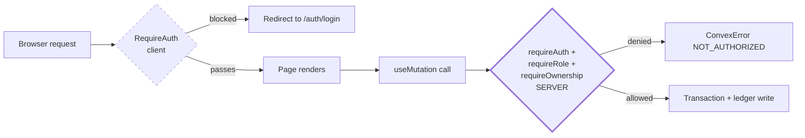

# Frontend Architecture

| Field | Value |
| --- | --- |
| **Document Type** | Architecture Specification |
| **Status** | Target frontend architecture with implemented M1–M3 subset |
| **Last Updated** | 2026-08-29 |
| **Owner** | Frontend Engineering |
| **Applies To** | Cirquo Web (PWA) + Capacitor Android shell |
| **Audience** | Engineers, reviewers, DSDC ANFORCOM 2026 judges |

---

## 1. Purpose and Scope

This document describes how the Cirquo client is structured, how it fetches and renders data, and how it stays honest about the difference between what exists today and what is planned.

Cirquo is a **circular food recovery platform**, not a food delivery app. The frontend never renders a courier, never renders an ETA, and never renders a delivery fee. Consumers discover a **Rescue Item** on a map, reserve it, pay, and physically collect it from the merchant using a **pickup code**. The frontend's job is to make that collection loop obvious, and to make the second loop — **Circular Routing** of unclaimed material to an **Organic Processor** — equally visible.

Scope of this document:

- The real `src/` folder layout and each directory's responsibility
- Routing, route protection, and layout systems
- The `render={}` composition pattern used by our shadcn/@base-ui components
- State management doctrine and data-fetching patterns against Convex
- Form patterns (React Hook Form + Zod)
- Mapbox integration plan
- Capacitor and PWA behaviour
- Performance budget, formatting helpers, i18n, accessibility
- Implementation priority

Out of scope: backend function design (see [`BACKEND.md`](BACKEND.md)), realtime subscription semantics (see [`REALTIME.md`](REALTIME.md)), and visual design tokens (see [`../design/UI_GUIDE.md`](../design/UI_GUIDE.md)).

> **Implementation status — 2026-08-29.** Authentication, route guards,
> Merchant Rescue Item flows, Consumer discovery, Mapbox, reservation, and
> checkout are now present in `src/`. Sections or examples marked 📋 remain
> target architecture; inspect `src/app/router.tsx` and the referenced source
> before treating a target example as a current contract.

---

## 2. Technology Baseline

| Concern | Choice | Version | Notes |
| --- | --- | --- | --- |
| UI runtime | React | 19.2 | Function components only, no class components except one error boundary |
| Build tool | Vite | 8 | Bun as package manager and script runner |
| Language | TypeScript | 6 | `strict` on; `tsc -b` runs before every build |
| Styling | Tailwind CSS | v4 | `@tailwindcss/vite` plugin, CSS-first config, OKLCH tokens, **no `tailwind.config.js`** |
| Component library | shadcn/ui | new-york / neutral | Built on `radix-ui` and `@base-ui/react` |
| Routing | React Router | v7 (`react-router-dom`) | Declarative `<Routes>` tree, no data router loaders |
| Backend client | Convex | 1.43 | `useQuery` / `useMutation` / `useAction` |
| Forms | React Hook Form + Zod | 7 / 4 | Bridged by `@hookform/resolvers` |
| Maps | Mapbox GL JS | latest | Lazy-loaded, client-only |
| Payments | Midtrans Snap (Sandbox) | QRIS | Snap.js loaded on demand at checkout |
| Native shell | Capacitor | 8 | `com.cirquo.app`, `webDir: "dist"` |
| Toasts | Sonner | latest | Single `<Toaster />` in providers |
| Icons | Lucide React | latest | Tree-shaken named imports only |
| Dates | date-fns | latest | Formatting + WIB conversion at render |
| Theme | next-themes | latest | Class strategy, system default |
| Font | `@fontsource-variable/geist` | latest | Self-hosted, no Google Fonts request |
| Linting | oxlint | latest | Fast; no ESLint |
| Path alias | `@` → `./src` | — | Configured in `vite.config.ts` + `tsconfig` |

**Deliberate omissions and why.**

| Not used | Reason |
| --- | --- |
| Redux / Zustand / Jotai | Convex `useQuery` already owns server state reactively. A second store would duplicate truth and create staleness bugs. |
| TanStack Query | Convex has its own subscription-based cache; layering another cache would fight it. |
| React Router data loaders | Loaders are request/response shaped. Convex is subscription shaped — a loader would snapshot data that is meant to stay live. |
| `tailwind.config.js` | Tailwind v4 moves configuration into CSS (`@theme`), so tokens live next to the stylesheet that consumes them. |
| Next.js | We need a static bundle Capacitor can wrap in `webDir: dist`. SSR would add server infrastructure we do not need for a pickup-based marketplace. |

---

## 3. Target Folder Structure

Status legend used throughout this target structure: **✅ exists in the repository today** · **📋 planned, not yet written**. The tree is an architectural guide, not a generated inventory.

```
src/
├── app/
│   ├── providers.tsx        ✅ Convex + theme + Sonner composition
│   └── router.tsx           ✅ every route declared in one file
├── assets/                  ✅ static images, logo marks
├── components/
│   ├── ui/                  ✅ shadcn/ui primitives
│   └── common/              ✅ route guards, status, query-error, cards, reserve sheet
├── constants/
│   └── mock-data.ts         ✅ remaining placeholder fixtures
├── features/
│   ├── discovery/           ✅ reactive nearby Rescue Item query
│   ├── orders/              ✅ Consumer order and payment-hold hooks
│   └── payments/            ✅ Midtrans Snap client loader
├── layouts/                 ✅ ConsumerLayout, MerchantLayout, ProcessorLayout, AdminLayout
├── lib/
│   ├── convex.ts            ✅ conditional client construction
│   ├── utils.ts             ✅ cn()
│   ├── pricing.ts           ✅ suggestRescuePrice
│   ├── discovery.ts         ✅ discovery visibility and ranking helpers
│   ├── orders.ts            ✅ active/past grouping
│   ├── payment-hold.ts      ✅ countdown helpers
│   ├── geo.ts               ✅ Haversine distance
│   ├── format.ts            ✅ grams/IDR/WIB formatters
│   └── validations.ts       ✅ Zod schemas
├── pages/
│   ├── auth/                ✅ login, registration, and onboarding pages
│   └── *.tsx                ✅ role pages; some remain placeholders
├── types/
│   ├── domain.ts            ✅ mirrors the Convex schema
│   └── navigation.ts        ✅ NavigationItem
└── main.tsx                 ✅ StrictMode → BrowserRouter → AppProviders → App
```

### 3.1 Directory Responsibilities

| Directory | Responsibility | Must not contain | Status |
| --- | --- | --- | --- |
| `app/` | Application composition root: provider tree and route table. Two files, deliberately. | Business logic, data fetching | ✅ |
| `assets/` | Bundled static media referenced by import. | Anything fetched at runtime | ✅ |
| `components/ui/` | Generated shadcn/ui primitives. Edited only to add variants. | Domain vocabulary (`RescueItem`, `pickupCode`) | ✅ 17 primitives |
| `components/common/` | Cross-role presentation, route/security, status, cards, and query-error components. | Role-specific copy or queries | ✅ |
| `components/{consumer,merchant,processor,admin}/` | Role-scoped presentational components. Props in, JSX out. | `useQuery` calls (those live in features/pages) | 📋 Create only when reuse requires it |
| `constants/` | Static enumerations, label maps, and — temporarily — `mock-data.ts`. | Anything mutable at runtime | ✅ |
| `features/` | Vertical slices: hooks + composed components + local schemas for one domain area. | Cross-feature imports (go through `lib/` or `components/common/`) | ✅ discovery, orders, payments |
| `hooks/` | Generic reusable hooks (`useGeolocation`, `useCountdown`, `useMediaQuery`). | Domain-specific hooks (those belong in `features/`) | 📋 No generic hook directory yet |
| `layouts/` | Chrome: header, nav, sidebar, `<Outlet />`. | Data fetching beyond the session/current user | ✅ |
| `lib/` | **Framework-agnostic pure logic** and thin client factories. | React imports, Convex imports (in the algorithm files) | ✅ partial |
| `pages/` | One component per route. Fetches data, composes components, owns page-level layout. | Reusable UI (extract to `components/`) | ✅ role pages; some placeholders |
| `types/` | Shared TypeScript types mirroring the domain. | Runtime values | ✅ |

### 3.2 The `lib/` Purity Rule

The single most important architectural discipline in Cirquo is that **the algorithms are pure**. Every scoring, pricing, ranking, and impact function lives in `src/lib/*.ts` with:

- No `convex/*` imports
- No `react` imports
- No I/O, no `Date.now()` captured internally (time is a parameter)
- Deterministic output for identical input

```ts
// src/lib/pricing.ts — 📋 planned
export type MaterialType =
  | "bakery" | "produce" | "prepared_meal" | "dairy" | "grocery" | "beverage";

export interface RescuePricingInput {
  materialType: MaterialType;
  originalPrice: number;     // integer IDR
  floorPrice: number;        // integer IDR
  publishedAt: number;       // epoch ms UTC
  pickupEndAt: number;       // epoch ms UTC
  now: number;               // epoch ms UTC — injected, never read inside
  initialQuantity: number;
  remainingQuantity: number;
}

export function suggestRescuePrice(input: RescuePricingInput): number { /* … */ }
```

The same file is imported by a Convex mutation on the server *and* by the merchant's price-preview UI on the client. One implementation, two consumers, zero drift. This is why we can show a merchant "your price will drop to Rp 12.000 in 15 minutes" without a round trip, and still guarantee the server computes the identical number.

Justification for judges: pure logic is **unit-testable without a Convex runtime**, **portable if the backend ever migrates**, and **explainable in isolation** — you can read `suggestRescuePrice` and understand Dynamic Rescue Pricing without knowing what Convex is.

---

## 4. Routing

All routes are declared in `src/app/router.tsx` (✅). A single route table is intentional at this size: it is the fastest way for a reviewer to see the entire surface area of the product.

### 4.1 Current Routes

| Group | Routes | Guard |
| --- | --- | --- |
| Guest | `/welcome`, `/login`, `/admin/login`, `/register`, `/register/:role` | `GuestRoute` redirects authenticated users |
| Onboarding | `/auth/continue`, `/merchant/onboarding`, `/processor/onboarding`, `/pending-verification` | `ProtectedRoute` |
| Consumer | `/`, `/discover`, `/explore`, `/orders`, `/orders/:id`, `/checkout/:orderId`, `/item/:id`, `/impact`, `/profile` | `RoleRoute('consumer')` |
| Merchant | `/merchant`, `/merchant/surplus`, `/merchant/impact` | `RoleRoute('merchant')` |
| Verified Merchant | `/merchant/surplus/new`, `/merchant/surplus/:id`, `/merchant/pickup` | `RoleRoute('merchant', { requiresVerified: true })` |
| Processor | `/processor`, `/processor/history` | `RoleRoute('processor')` |
| Verified Processor | `/processor/recovery`, `/processor/recovery/:id` | `RoleRoute('processor', { requiresVerified: true })` |
| Admin | `/admin`, `/admin/verifications`, `/admin/moderation`, `/admin/ledger`, `/admin/disputes` | `RoleRoute('admin')` |

`AuthProvider` restores the persisted token, resolves `auth.getCurrentUser`, and
keeps a neutral loading shell visible until the session is known. The guard is
navigation UX only; Convex guards remain the authorization boundary.

### 4.2 Target Routes

| Path | Page | Layout | Guard | Notes |
| --- | --- | --- | --- | --- |
| `/auth/login` | `LoginPage` | `AuthLayout` 📋 | redirect if authenticated | Email + password |
| `/auth/register` | `RegisterPage` | `AuthLayout` 📋 | redirect if authenticated | Role picker: consumer / merchant / processor |
| `/auth/onboarding/merchant` | `MerchantOnboardingPage` | `AuthLayout` | `RequireRole("merchant")` | Captures address + lat/lng; sets `verificationStatus: "pending"` |
| `/auth/onboarding/processor` | `ProcessorOnboardingPage` | `AuthLayout` | `RequireRole("processor")` | Facility type, accepted material types, capacity, radius, hours |
| `/item/:itemId` | `ListingDetailPage` | `ConsumerLayout` | none (public) | Live price, live `remainingQuantity`, pickup window countdown |
| `/checkout/:itemId` | `CheckoutPage` | `ConsumerLayout` | `RequireAuth` | Calls `orders.reserve`, then opens Midtrans Snap |
| `/payment/result` | `PaymentResultPage` | `ConsumerLayout` | `RequireAuth` | Reads `?order_id=`; polls order status via reactive query |
| `/orders/:orderId` | `OrderDetailPage` | `ConsumerLayout` | `RequireAuth` + ownership | Manual pickup code, countdown, merchant map link |
| `/impact` | `ConsumerImpactPage` | `ConsumerLayout` | `RequireAuth` | Personal rescued kg + estimated CO2e |
| `/merchant/surplus/:itemId/edit` | `EditSurplusPage` | `MerchantLayout` | `RequireRole("merchant")` + ownership | Blocked once any unit is reserved |
| `/merchant/orders` | `MerchantPendingPickupsPage` | `MerchantLayout` | `RequireRole("merchant")` | Live incoming reservations |
| `/merchant/verify` | `VerifyPickupPage` | `MerchantLayout` | `RequireRole("merchant")` | Enter/scan pickup code → `RESCUED` |
| `/merchant/impact` | `MerchantImpactPage` | `MerchantLayout` | `RequireRole("merchant")` | Rescued / Recovered / Residual split |
| `/processor/batches/:batchId` | `BatchDetailPage` | `ProcessorLayout` | `RequireRole("processor")` | Offer TTL countdown, accept / decline |
| `/processor/batches/:batchId/intake` | `IntakePage` | `ProcessorLayout` | `RequireRole("processor")` | Logs authoritative `acceptedWeightGrams` |
| `/processor/batches/:batchId/outcome` | `OutcomePage` | `ProcessorLayout` | `RequireRole("processor")` | `outputType`, `outputWeightGrams`, `residualWeightGrams` |
| `/admin/verifications` | `AdminVerificationsPage` | `AdminLayout` | `RequireRole("admin")` | Approve merchants and processors |
| `/admin/moderation` | `AdminModerationPage` | `AdminLayout` | `RequireRole("admin")` | Emits `MODERATED` (terminal) |
| `/admin/ledger` | `AdminLedgerPage` | `AdminLayout` | `RequireRole("admin")` | Read-only **Material Flow Ledger** explorer |
| `/admin/disputes` | `AdminDisputesPage` | `AdminLayout` | `RequireRole("admin")` | Resolve, refund, override |

### 4.3 Route Protection Design (target reference)

```tsx
// src/features/auth/RequireAuth.tsx — 📋 planned
import { Navigate, Outlet, useLocation } from "react-router-dom";
import { useQuery } from "convex/react";
import { api } from "@/../convex/_generated/api";
import { FullPageSpinner } from "@/components/common/FullPageSpinner";

export function RequireAuth() {
  const me = useQuery(api.auth.currentUser);
  const location = useLocation();

  if (me === undefined) return <FullPageSpinner label="Memuat sesi…" />;
  if (me === null) {
    const next = encodeURIComponent(location.pathname + location.search);
    return <Navigate to={`/auth/login?next=${next}`} replace />;
  }
  return <Outlet />;
}
```

```tsx
// src/features/auth/RequireRole.tsx — 📋 planned
export function RequireRole({ role }: { role: UserRole }) {
  const me = useQuery(api.auth.currentUser);

  if (me === undefined) return <FullPageSpinner label="Memuat sesi…" />;
  if (me === null) return <Navigate to="/auth/login" replace />;
  if (me.role !== role) return <Navigate to={homeForRole(me.role)} replace />;
  if (me.status !== "active") return <Navigate to="/account/suspended" replace />;
  return <Outlet />;
}
```

Mounted as pathless layout routes:

```tsx
<Route element={<RequireRole role="merchant" />}>
  <Route path="/merchant" element={<MerchantLayout />}>
    <Route index element={<MerchantDashboardPage />} />
    <Route path="surplus" element={<MerchantSurplusPage />} />
    <Route path="surplus/new" element={<CreateSurplusPage />} />
    <Route path="surplus/:itemId/edit" element={<EditSurplusPage />} />
    <Route path="orders" element={<MerchantPendingPickupsPage />} />
    <Route path="verify" element={<VerifyPickupPage />} />
  </Route>
</Route>
```

**Redirect behaviour.**

| Situation | Behaviour |
| --- | --- |
| Session loading (`undefined`) | Render a spinner. Never redirect — redirecting on `undefined` produces a login flash on every refresh. |
| Unauthenticated on a guarded route | Redirect to `/auth/login?next=<encoded path>`; login returns the user to `next`. |
| Authenticated, wrong role | Redirect to that role's home. No error toast — a wrong-role URL is usually a stale bookmark, not an attack. |
| Authenticated, `status !== "active"` | Redirect to a suspension notice page. |
| Authenticated on `/auth/login` | Redirect to role home. |

**The client guard is UX-only.** This must be stated plainly because it is the single most common security misconception in a hackathon frontend.

`RequireRole` prevents a *confused* user from landing on a page they cannot use. It prevents nothing else. The bundle ships to the browser, so every route component, every mutation name, and every field label is readable by anyone with devtools. Convex functions are callable by name over the websocket: **any non-internal function is callable by any client that knows its name.**

Therefore the real boundary is server-side. Every mutation begins with `requireAuth(ctx)`, then `requireRole(ctx, "merchant")`, then `requireOwnership(ctx, merchant.ownerId)`. Deleting `RequireRole` from the frontend must change *nothing* about what an attacker can accomplish. See [`../security/PERMISSIONS.md`](../security/PERMISSIONS.md) and [`BACKEND.md`](BACKEND.md#guards).



The dashed box is cosmetic. The bold box is the security boundary.

---

## 5. Layout System

Two layout shells exist today, and the split is deliberate.

### 5.1 ConsumerLayout ✅

| Property | Value |
| --- | --- |
| Container | `max-w-5xl` |
| Header | Logo, city selector, theme toggle, account menu |
| Desktop nav | Inline header links, hidden below `sm` |
| Mobile nav | **Fixed bottom nav, 3 items** — Jelajah, Pesanan, Dampak |
| Content padding | `pb-20` on mobile to clear the bottom bar |

### 5.2 RoleShell ✅

Used by `MerchantLayout`, `ProcessorLayout`, and `AdminLayout`.

| Property | Value |
| --- | --- |
| Container | `max-w-6xl` |
| Desktop (`lg` and up) | Fixed 64-unit-wide sidebar, always visible |
| Below `lg` | Hamburger button opening a shadcn `Sheet` from the left |
| Nav source | `NavigationItem[]` from `src/types/navigation.ts` |
| Header | Role badge, verification status chip, account menu |

### 5.3 Why the Split

| Dimension | Consumer | Merchant / Processor / Admin |
| --- | --- | --- |
| Primary device | Phone, one-handed, standing in a street or a warung | Phone behind a counter, or a laptop in an office |
| Session length | 30–90 seconds: find, reserve, pay, leave | 5–30 minutes: list items, verify pickups, log intake |
| Navigation breadth | 3 destinations | 5–7 destinations plus deep sub-pages |
| Thumb reachability | Critical — bottom nav sits in the natural thumb arc | Less critical; sidebar is scanned, not thumbed |
| Density tolerance | Low — large targets, big prices, big countdown | High — tables, filters, batch queues |

A consumer forced through a hamburger menu loses roughly one second and one tap on every navigation, on the exact device where the interaction is most time-pressured (a **pickup window** is closing). An operator given a 3-item bottom nav cannot reach the seven surfaces they need. Two shells is the correct amount of duplication; unifying them would force one audience into the other's ergonomics.

Trade-off accepted: two chrome implementations to maintain, and two places to add a new global element such as an offline banner. Mitigated by keeping shared pieces (`PageHeader`, `SummaryCard`, account menu) in `components/common/`.

---

## 6. The `render={}` Composition Pattern

Our shadcn/ui components sit on `radix-ui` **and `@base-ui/react`**. Base UI replaced Radix's `asChild` boolean with an explicit `render` prop that takes an element. This is not cosmetic — it changes how every "button that is really a link" is written, and getting it wrong produces nested `<button><a>` markup that fails accessibility audits.

**Old Radix idiom (do not use in Base UI components):**

```tsx
<Button asChild>
  <Link to="/explore">Jelajahi</Link>
</Button>
```

**Base UI idiom (use this):**

```tsx
import { Link } from "react-router-dom";
import { Button } from "@/components/ui/button";

<Button render={<Link to="/explore" />}>Jelajahi Rescue Item</Button>
```

The `render` element is cloned; the component merges its own props, `className`, refs, and ARIA attributes onto it. Children stay as children of `<Button>`, **not** of the render element — a frequent mistake.

More examples:

```tsx
// Dialog trigger that is a card
<DialogTrigger render={<article className="rounded-xl border" />}>
  <RescueItemCard item={item} />
</DialogTrigger>

// Tooltip anchor that is an icon button link
<TooltipTrigger render={<Link to={`/item/${item._id}`} aria-label="Lihat detail" />}>
  <Info className="size-4" />
</TooltipTrigger>

// Menu item that navigates
<DropdownMenuItem render={<Link to="/merchant/verify" />}>
  Verifikasi Kode Pickup
</DropdownMenuItem>

// Function form when you need the merged props
<Button render={(props) => <Link {...props} to="/orders" />}>Pesanan Saya</Button>
```

**Rules.**

| Rule | Reason |
| --- | --- |
| `render` receives an *element*, not a component type | The component clones it and merges props |
| Put visible text in `children`, not inside the render element | Otherwise the merged element receives two children sets |
| Never combine `render` with `onClick` navigation | Pick one — a real `<a>` gives middle-click, right-click, and keyboard support for free |
| Radix-only primitives may still use `asChild` | Check the primitive's origin before assuming |
| Never wrap `<Button>` in `<Link>` | Produces invalid nested interactive elements |

Trade-off: two composition idioms coexist in one codebase, which is a real cognitive tax. We accept it because `@base-ui/react` gives better focus management and a smaller runtime for menus and dialogs, and because a single wrong `asChild` is caught immediately by TypeScript (the prop does not exist).

---

## 7. State Management Doctrine

**There is no global client state library. This is a decision, not an omission.**

| State category | Owner | Mechanism | Example |
| --- | --- | --- | --- |
| Server state | Convex | `useQuery` subscription | Rescue Item list, order status, batch queue |
| Session / current user | Convex | `useQuery(api.auth.currentUser)` | Role, verification status |
| Local UI state | Component | `useState` | Sheet open, accordion expanded, tab index |
| Form state | React Hook Form | `useForm` + `zodResolver` | Create listing, intake weight |
| URL state | React Router | `useSearchParams` | `?q=`, `?material=`, `?within=`, `?sort=` |
| Ephemeral feedback | Sonner | `toast()` | "Pesanan dikonfirmasi" |
| Theme | next-themes | `useTheme` | light / dark / system |

### 7.1 Why No Redux or Zustand

A global store exists to cache and synchronise remote data across components. Convex already does that, *better*, because its cache is invalidated by the server rather than by hand. Adding a store would mean:

1. Copying server data into the store on fetch.
2. Writing invalidation logic Convex already performs automatically.
3. Introducing a window where the store is stale but the subscription is fresh.

That third point is not theoretical for Cirquo. `remainingQuantity` changes when *another consumer* reserves the last unit. A mirrored store would show "1 tersisa" while the live query says `0`, and the user would tap Reserve and get a rejection. The absence of a store is what makes that class of bug impossible.

### 7.2 Why URL State for Filters

Explore filters live in the query string:

```
/explore?material=bakery&within=3000&sort=urgency&q=roti
```

Benefits: shareable links, working back button, refresh-safe, and — importantly for the demo — a judge can be handed a URL that reproduces an exact map view.

```tsx
// src/features/surplus/useExploreFilters.ts — 📋 planned
export function useExploreFilters() {
  const [params, setParams] = useSearchParams();

  const filters = {
    material: params.get("material") ?? "all",
    within: Number(params.get("within") ?? 5000),
    sort: (params.get("sort") ?? "relevance") as SortKey,
    q: params.get("q") ?? "",
  };

  const setFilter = (key: string, value: string | number | null) => {
    const next = new URLSearchParams(params);
    if (value === null || value === "" || value === "all") next.delete(key);
    else next.set(key, String(value));
    setParams(next, { replace: true }); // replace: avoid one history entry per keystroke
  };

  return { filters, setFilter };
}
```

---

## 8. Data Fetching Patterns

### 8.1 The Three-State Rule

`useQuery` returns `undefined` while loading, `null` for an intentionally absent document, and the value otherwise. **Every call site must handle all three.** Conflating `undefined` with "empty" produces an empty state that flashes on every navigation.

```tsx
// src/pages/ExplorePage.tsx — 📋 wiring
export function ExplorePage() {
  const { filters } = useExploreFilters();
  const { coords, status: geoStatus } = useGeolocation();

  const items = useQuery(api.surplusItems.listNearby, {
    latitude: coords?.latitude ?? SEMARANG_CENTER.latitude,
    longitude: coords?.longitude ?? SEMARANG_CENTER.longitude,
    radiusMeters: filters.within,
    materialType: filters.material === "all" ? undefined : filters.material,
  });

  if (items === undefined) return <ExploreSkeleton />;

  if (items.length === 0) {
    return (
      <EmptyState
        icon={MapPinOff}
        title="Belum ada Rescue Item di sekitar"
        description="Coba perluas radius pencarian atau kembali menjelang jam tutup toko."
        action={<Button onClick={() => setFilter("within", 10000)}>Perluas ke 10 km</Button>}
      />
    );
  }

  return (
    <div className="grid gap-4 sm:grid-cols-2 lg:grid-cols-3">
      {items.map((item) => <RescueItemCard key={item._id} item={item} />)}
    </div>
  );
}
```

### 8.2 Loading Skeletons

Skeletons mirror the real layout so nothing shifts when data arrives.

| Surface | Skeleton | Count |
| --- | --- | --- |
| Explore grid | Card skeleton: 16:9 image block, two text lines, price row | 6 |
| Order list | Row skeleton: avatar block + two lines + status pill | 4 |
| Merchant dashboard | 4 `SummaryCard` skeletons + a table skeleton | — |
| Processor queue | Batch card skeleton with TTL bar | 3 |
| Listing detail | Full-page skeleton preserving image aspect ratio | 1 |

Rule: never render a bare spinner where a skeleton is possible; a spinner communicates "something is happening", a skeleton communicates "*this specific thing* is happening".

### 8.3 Error Boundaries

Convex query errors throw during render, so a boundary is required. One boundary per layout, one per risky widget (the map).

```tsx
// src/components/common/AppErrorBoundary.tsx — 📋 planned
export class AppErrorBoundary extends React.Component<Props, State> {
  state: State = { error: null };
  static getDerivedStateFromError(error: Error) { return { error }; }
  componentDidCatch(error: Error, info: React.ErrorInfo) {
    console.error("[Cirquo] render error", error, info.componentStack);
  }
  render() {
    if (!this.state.error) return this.props.children;
    return (
      <ErrorState
        title="Terjadi kesalahan"
        description="Muat ulang halaman. Jika berlanjut, hubungi dukungan."
        action={<Button onClick={() => this.setState({ error: null })}>Coba lagi</Button>}
      />
    );
  }
}
```

Placement: inside each layout around `<Outlet />` so chrome survives a page crash, and around `<RescueMap />` so a Mapbox failure degrades Explore to a list instead of blanking the route.

### 8.4 Mutations

```tsx
// src/features/orders/useReserveItem.ts — 📋 planned
export function useReserveItem() {
  const reserve = useMutation(api.orders.reserve);
  const [pending, setPending] = useState(false);
  const navigate = useNavigate();

  async function run(itemId: Id<"surplusItems">, quantity: number) {
    setPending(true);
    try {
      const { orderId } = await reserve({ surplusItemId: itemId, quantity });
      toast.success("Item diamankan. Selesaikan pembayaran dalam 15 menit.");
      navigate(`/checkout/${orderId}`);
    } catch (error) {
      const code = extractConvexErrorCode(error);
      toast.error(RESERVE_ERROR_COPY[code] ?? "Reservasi gagal. Coba lagi.");
    } finally {
      setPending(false);
    }
  }

  return { run, pending };
}
```

```ts
export const RESERVE_ERROR_COPY: Record<string, string> = {
  INSUFFICIENT_QUANTITY: "Item ini baru saja habis diamankan orang lain.",
  ITEM_NOT_ACTIVE:       "Rescue Item ini sudah tidak tersedia.",
  PICKUP_WINDOW_CLOSED:  "Pickup window sudah berakhir.",
  PROCESSING_ONLY:       "Item ini hanya untuk pemrosesan organik.",
  NOT_AUTHENTICATED:     "Masuk dulu untuk mengamankan item.",
};
```

### 8.5 Optimistic Updates

Convex supports optimistic updates via `.withOptimisticUpdate`. We use them **narrowly**.

| Action | Optimistic? | Reason |
| --- | --- | --- |
| Mark notification read | ✅ Yes | Idempotent, invisible if it fails, zero business consequence |
| Toggle a saved/favourite item | ✅ Yes | Purely local preference |
| Merchant edits a draft listing's title | ✅ Yes | Owner-scoped, no contention |
| **Reserve a Rescue Item** | ❌ **Never** | Contended resource — see below |
| Confirm pickup (`RESCUED`) | ❌ Never | Terminal ledger event; must be server-confirmed |
| Processor logs `acceptedWeightGrams` | ❌ Never | Authoritative measurement |
| Accept a routed batch | ❌ Never | Another processor may have accepted first |

**Why reservation must never be optimistic.** Quantity is decremented at reservation, not at payment, precisely to prevent overselling. An optimistic decrement would render "diamankan!" locally, then roll back when the server rejects because another consumer won the race. The user experiences the platform *telling them they got the last portion and then taking it away* — the exact failure mode the reservation-time decrement exists to eliminate. We would be defeating a backend guarantee with a frontend animation.

```ts
// Acceptable optimistic update
const markRead = useMutation(api.notifications.markRead).withOptimisticUpdate(
  (store, { notificationId }) => {
    const list = store.getQuery(api.notifications.listMine, {});
    if (!list) return;
    store.setQuery(
      api.notifications.listMine, {},
      list.map((n) => (n._id === notificationId ? { ...n, read: true } : n)),
    );
  },
);
```

---

## 9. Form Patterns

React Hook Form owns field state; Zod owns validation; `@hookform/resolvers` bridges them. Zod schemas live beside the feature (`src/features/surplus/schema.ts`).

Two client-side rules that recur across Cirquo forms:

1. **Coerce numbers.** HTML inputs yield strings. `z.coerce.number()` at the boundary keeps the rest of the schema honest about integers.
2. **Cross-field rules use `.refine`.** Pickup window ordering and floor-price ordering cannot be expressed per field.

### 9.1 Full Example — CreateSurplusPage

```ts
// src/features/surplus/schema.ts — 📋 planned
import { z } from "zod";

export const MATERIAL_TYPES = [
  "bakery", "produce", "prepared_meal", "dairy", "grocery", "beverage",
] as const;

export const createSurplusSchema = z
  .object({
    name: z.string().trim().min(3, "Nama minimal 3 karakter").max(80),
    description: z.string().trim().max(500).optional(),
    imageUrl: z.string().url("URL gambar tidak valid").optional().or(z.literal("")),
    materialType: z.enum(MATERIAL_TYPES, { message: "Pilih jenis material" }),

    originalPrice: z.coerce.number().int("Harga harus bilangan bulat")
      .min(1000, "Minimal Rp 1.000").max(5_000_000),
    currentPrice:  z.coerce.number().int().min(0),
    floorPrice:    z.coerce.number().int().min(0),

    initialQuantity:     z.coerce.number().int().min(1, "Minimal 1 porsi").max(200),
    weightPerItemGrams:  z.coerce.number().int().min(10, "Minimal 10 gram").max(20_000),

    pickupStartAt: z.coerce.number().int(),
    pickupEndAt:   z.coerce.number().int(),

    dietaryTags: z.array(z.string()).max(6).default([]),
    processingOnly: z.boolean().default(false),
  })
  .refine((v) => v.pickupEndAt > v.pickupStartAt, {
    message: "Akhir pickup window harus setelah waktu mulai",
    path: ["pickupEndAt"],
  })
  .refine((v) => v.pickupEndAt - v.pickupStartAt >= 30 * 60 * 1000, {
    message: "Pickup window minimal 30 menit",
    path: ["pickupEndAt"],
  })
  .refine((v) => v.currentPrice < v.originalPrice, {
    message: "Harga rescue harus lebih rendah dari harga asli",
    path: ["currentPrice"],
  })
  .refine((v) => v.currentPrice >= v.floorPrice, {
    message: "Harga rescue tidak boleh di bawah floor price",
    path: ["currentPrice"],
  })
  .refine((v) => v.floorPrice < v.originalPrice, {
    message: "Floor price harus lebih rendah dari harga asli",
    path: ["floorPrice"],
  });

export type CreateSurplusValues = z.infer<typeof createSurplusSchema>;
```

```tsx
// src/pages/merchant/CreateSurplusPage.tsx — 📋 wiring
export function CreateSurplusPage() {
  const create = useMutation(api.surplusItems.create);
  const navigate = useNavigate();

  const form = useForm<CreateSurplusValues>({
    resolver: zodResolver(createSurplusSchema),
    mode: "onBlur",
    defaultValues: {
      name: "", description: "", imageUrl: "",
      materialType: "bakery",
      originalPrice: 0, currentPrice: 0, floorPrice: 0,
      initialQuantity: 1, weightPerItemGrams: 250,
      pickupStartAt: roundToNextQuarterHour(Date.now()),
      pickupEndAt: roundToNextQuarterHour(Date.now()) + 3 * 60 * 60 * 1000,
      dietaryTags: [], processingOnly: false,
    },
  });

  // Live Dynamic Rescue Pricing preview using the SAME pure function the server uses.
  const watched = form.watch();
  const suggested = useMemo(() => {
    if (!watched.originalPrice || !watched.floorPrice) return null;
    return suggestRescuePrice({
      materialType: watched.materialType,
      originalPrice: watched.originalPrice,
      floorPrice: watched.floorPrice,
      publishedAt: Date.now(),
      pickupEndAt: watched.pickupEndAt,
      now: Date.now(),
      initialQuantity: watched.initialQuantity,
      remainingQuantity: watched.initialQuantity,
    });
  }, [watched.originalPrice, watched.floorPrice, watched.materialType,
      watched.pickupEndAt, watched.initialQuantity]);

  async function onSubmit(values: CreateSurplusValues) {
    try {
      const { itemId } = await create({ ...values, imageUrl: values.imageUrl || undefined });
      toast.success("Rescue Item dipublikasikan");
      navigate(`/merchant/surplus?highlight=${itemId}`);
    } catch (error) {
      toast.error(RESCUE_ITEM_ERROR_COPY[extractConvexErrorCode(error)] ?? "Gagal menyimpan");
    }
  }

  return (
    <Form {...form}>
      <form onSubmit={form.handleSubmit(onSubmit)} className="space-y-6">
        <FormField
          control={form.control}
          name="name"
          render={({ field }) => (
            <FormItem>
              <FormLabel>Nama Rescue Item</FormLabel>
              <FormControl><Input placeholder="Roti sisa sore" {...field} /></FormControl>
              <FormMessage />
            </FormItem>
          )}
        />

        <div className="grid gap-4 sm:grid-cols-3">
          <FormField control={form.control} name="originalPrice" render={({ field }) => (
            <FormItem>
              <FormLabel>Harga asli (IDR)</FormLabel>
              <FormControl><Input inputMode="numeric" {...field} /></FormControl>
              <FormDescription>{formatIDR(field.value)}</FormDescription>
              <FormMessage />
            </FormItem>
          )} />
          <FormField control={form.control} name="currentPrice" render={({ field }) => (
            <FormItem>
              <FormLabel>Harga rescue awal</FormLabel>
              <FormControl><Input inputMode="numeric" {...field} /></FormControl>
              {suggested !== null && (
                <FormDescription>
                  Saran: {formatIDR(suggested)}
                  <Button type="button" variant="link" size="sm"
                    onClick={() => form.setValue("currentPrice", suggested, { shouldValidate: true })}>
                    Pakai saran
                  </Button>
                </FormDescription>
              )}
              <FormMessage />
            </FormItem>
          )} />
          <FormField control={form.control} name="floorPrice" render={({ field }) => (
            <FormItem>
              <FormLabel>Floor price</FormLabel>
              <FormControl><Input inputMode="numeric" {...field} /></FormControl>
              <FormDescription>Dynamic Rescue Pricing tidak akan turun di bawah nilai ini.</FormDescription>
              <FormMessage />
            </FormItem>
          )} />
        </div>

        <div className="grid gap-4 sm:grid-cols-2">
          <FormField control={form.control} name="pickupStartAt" render={({ field }) => (
            <FormItem>
              <FormLabel>Pickup window mulai (WIB)</FormLabel>
              <FormControl>
                <Input type="datetime-local"
                  value={epochToLocalInput(field.value)}
                  onChange={(e) => field.onChange(localInputToEpoch(e.target.value))} />
              </FormControl>
              <FormMessage />
            </FormItem>
          )} />
          <FormField control={form.control} name="pickupEndAt" render={({ field }) => (
            <FormItem>
              <FormLabel>Pickup window berakhir (WIB)</FormLabel>
              <FormControl>
                <Input type="datetime-local"
                  value={epochToLocalInput(field.value)}
                  onChange={(e) => field.onChange(localInputToEpoch(e.target.value))} />
              </FormControl>
              <FormMessage />
            </FormItem>
          )} />
        </div>

        <FormField control={form.control} name="processingOnly" render={({ field }) => (
          <FormItem className="flex items-start gap-3 rounded-lg border p-4">
            <FormControl>
              <Checkbox checked={field.value} onCheckedChange={field.onChange} />
            </FormControl>
            <div>
              <FormLabel>Hanya untuk pemrosesan organik</FormLabel>
              <FormDescription>
                Item langsung masuk Circular Routing tanpa ditawarkan ke konsumen.
              </FormDescription>
            </div>
          </FormItem>
        )} />

        <div className="flex gap-3">
          <Button type="submit" disabled={form.formState.isSubmitting}>
            {form.formState.isSubmitting ? "Menyimpan…" : "Publikasikan"}
          </Button>
          <Button type="button" variant="outline" render={<Link to="/merchant/surplus" />}>
            Batal
          </Button>
        </div>
      </form>
    </Form>
  );
}
```

### 9.2 Form Conventions

| Convention | Detail |
| --- | --- |
| Validation mode | `onBlur` for creation forms, `onChange` for the intake weight form (immediate numeric feedback) |
| Submit disabling | Disable on `isSubmitting` only, never on `!isValid` — a permanently dead button with no visible reason is worse than a rejected submit |
| Server errors | Mapped to a copy table; field-specific errors use `form.setError(path, …)` |
| Money inputs | `inputMode="numeric"`, integer IDR, formatted preview below the field |
| Weight inputs | Grams only; kilogram display is derived, never typed |
| Datetime inputs | `datetime-local` renders in the device locale; converted to epoch ms on change |
| Never trust the client | Every rule in the Zod schema is re-asserted in the Convex mutation |

---

## 10. Mapbox Integration

The Explore route is lazy-loaded from `src/app/router.tsx`; its implementation
in `src/pages/consumer/explore-page.tsx` reads
`VITE_MAPBOX_ACCESS_TOKEN`, keeps one map for the mounted route, updates the
source on data/filter changes, and removes the map on cleanup. The reference
examples below remain useful when refactoring or extending that implementation.

### 10.1 Lazy Loading

Mapbox GL JS is ~230 KB gzipped plus a CSS file. Loading it in the main bundle would blow the performance budget for users who never open Explore.

```tsx
// src/features/surplus/RescueMap.tsx — 📋 planned
const MapCanvas = lazy(() => import("./MapCanvas")); // mapbox-gl imported only here

export function RescueMap(props: RescueMapProps) {
  return (
    <AppErrorBoundary fallback={<MapUnavailableNotice />}>
      <Suspense fallback={<Skeleton className="h-[420px] w-full rounded-xl" />}>
        <MapCanvas {...props} />
      </Suspense>
    </AppErrorBoundary>
  );
}
```

Vite emits `MapCanvas` as its own chunk. `/` and `/orders` never download it.

### 10.2 Instance Lifetime and Free-Tier Discipline

Mapbox bills per map load. A remount on every filter change would multiply cost by the number of taps.

| Rule | Implementation |
| --- | --- |
| One map instance per mounted route | `mapRef` created in a `useEffect` with `[]` deps |
| Filter changes update sources, never recreate the map | `map.getSource("rescue-items").setData(geojson)` |
| Never put the map in a component that remounts on query change | Map lives above the filtered list in the tree |
| Never render the map inside a conditional that toggles | Use CSS visibility for a list/map toggle |
| Call `map.remove()` in the effect cleanup | Prevents WebGL context leaks across navigations |
| `reuseMaps` where the SDK supports it | Further reduces counted loads |

### 10.3 Marker Clustering

At 50 items/day in a pilot city, clustering is not strictly required — but Semarang's dense central district (Simpang Lima, Pandanaran) produces overlapping pins immediately, so it is implemented from day one.

```ts
map.addSource("rescue-items", {
  type: "geojson",
  data: toGeoJSON(items),
  cluster: true,
  clusterMaxZoom: 14,
  clusterRadius: 50,
});
map.addLayer({ id: "clusters", type: "circle", source: "rescue-items",
  filter: ["has", "point_count"], paint: { /* OKLCH-derived brand colours */ } });
map.addLayer({ id: "cluster-count", type: "symbol", source: "rescue-items",
  filter: ["has", "point_count"],
  layout: { "text-field": ["get", "point_count_abbreviated"], "text-size": 12 } });
map.addLayer({ id: "unclustered", type: "circle", source: "rescue-items",
  filter: ["!", ["has", "point_count"]] });
```

Tapping an unclustered point opens a bottom sheet with the `RescueItemCard`, not a Mapbox popup — popups are hard to make accessible and do not match our design system.

### 10.4 Geolocation and Denial Fallback

```ts
// src/hooks/useGeolocation.ts — 📋 planned
export const SEMARANG_CENTER = { latitude: -6.9932, longitude: 110.4203 }; // Simpang Lima

export function useGeolocation() {
  const [state, setState] = useState<GeoState>({ status: "idle", coords: null });

  const request = useCallback(() => {
    if (!("geolocation" in navigator)) {
      setState({ status: "unsupported", coords: SEMARANG_CENTER });
      return;
    }
    setState((s) => ({ ...s, status: "requesting" }));
    navigator.geolocation.getCurrentPosition(
      (pos) => setState({ status: "granted",
        coords: { latitude: pos.coords.latitude, longitude: pos.coords.longitude } }),
      (err) => setState({
        status: err.code === err.PERMISSION_DENIED ? "denied" : "error",
        coords: SEMARANG_CENTER,
      }),
      { enableHighAccuracy: true, timeout: 8000, maximumAge: 60_000 },
    );
  }, []);

  return { ...state, request };
}
```

| Status | Map centre | UI treatment |
| --- | --- | --- |
| `granted` | Device coordinates | "Menampilkan Rescue Item di sekitar Anda" |
| `denied` | Semarang city centre | Banner: "Lokasi tidak diizinkan. Menampilkan area Semarang." + manual city/area picker |
| `error` / timeout | Semarang city centre | Same banner, "Coba lagi" button |
| `unsupported` | Semarang city centre | Manual area picker only |

**The app never blocks on location.** Explore is fully usable with the city-centre default; distance sorting simply becomes distance-from-centre. This matters because Android WebView permission prompts are frequently dismissed by reflex.

### 10.5 Capacitor Permission Differences

| Concern | Browser | Capacitor Android |
| --- | --- | --- |
| Permission prompt | Browser-native, once per origin | OS dialog, requires `ACCESS_FINE_LOCATION` in `AndroidManifest.xml` |
| Denial persistence | Site setting, recoverable in-page | "Don't ask again" is sticky; must deep-link to app settings |
| Secure context | HTTPS required | `capacitor://` treated as secure |
| Recommended API | `navigator.geolocation` | `@capacitor/geolocation` for reliable permission state |

Plan: a thin `getPosition()` wrapper that uses `@capacitor/geolocation` when `Capacitor.isNativePlatform()` and the Web API otherwise, so `useGeolocation` stays platform-agnostic. On a sticky denial we show "Buka Pengaturan" which calls `NativeSettings.openAndroid()`.

---

## 11. Capacitor Android

| Aspect | Configuration | Status |
| --- | --- | --- |
| App ID | `com.cirquo.app` | ✅ |
| Web directory | `dist` | ✅ |
| Sync flow | `bun run build` → `bun run android:sync` → `android:open` / `android:run` | ✅ scripts |
| Min SDK target | Android 8.0+ (WebView 60+) | 📋 verify |

### 11.1 Safe-Area Insets

The consumer bottom nav must clear gesture bars.

```css
/* src/index.css — 📋 planned addition */
@theme {
  --spacing-safe-bottom: env(safe-area-inset-bottom, 0px);
  --spacing-safe-top: env(safe-area-inset-top, 0px);
}
```

```tsx
<nav className="fixed inset-x-0 bottom-0 pb-[env(safe-area-inset-bottom)] sm:hidden">
```

Requires `viewport-fit=cover` in the `<meta name="viewport">` tag.

### 11.2 Hardware Back Button

Android's back button must not exit the app from a nested route.

```ts
// src/hooks/useAndroidBackButton.ts — 📋 planned
useEffect(() => {
  if (!Capacitor.isNativePlatform()) return;
  const handler = App.addListener("backButton", ({ canGoBack }) => {
    if (canGoBack) window.history.back();
    else if (isRootRoute(location.pathname)) App.exitApp();
    else navigate(homeForRole(role));
  });
  return () => { void handler.then((h) => h.remove()); };
}, [location.pathname, role]);
```

Special case: while a Midtrans Snap overlay is open, back must dismiss the overlay rather than navigate, or the user lands on a checkout page with an orphaned payment session.

### 11.3 Status Bar

`@capacitor/status-bar` set to the PWA theme colour `#047857` with light content, synchronised with `next-themes`.

### 11.4 Offline Behaviour

Cirquo is **online-first and honest about it**.

| Situation | Behaviour |
| --- | --- |
| Cold start offline | App shell renders from the service worker; a persistent banner reads "Anda sedang offline" |
| Query while offline | Convex client retains the last received value; the banner marks it as potentially stale |
| Mutation while offline | Blocked at the button with a toast: "Tidak ada koneksi. Coba lagi setelah terhubung." |
| Reconnect | Convex resubscribes and re-renders automatically; the banner disappears |
| Pickup code display | Cached values render, but a "terakhir diperbarui" timestamp is shown |

We do **not** queue mutations for later replay. Replaying a reservation after five minutes offline would attempt to claim a unit that has almost certainly been taken, and replaying a pickup confirmation would write a `RESCUED` ledger event at the wrong `occurredAt`. The **Material Flow Ledger** is the source of every impact number we report; corrupting its timestamps to save one retry tap is a bad trade.

### 11.5 What We Never Claim

Cirquo Android is a **Capacitor WebView wrapper**, not a native app. We do not claim native performance, native scroll physics, or 120 fps list rendering. Presented to judges: "the same audited codebase ships to web and Android, which is why a two-person team can maintain both."

---

## 12. PWA and Service Worker

Current state ✅: `src/main.tsx` registers `/sw.js` in `PROD` only; the manifest declares `theme_color: #047857`.

| Rule | Reason |
| --- | --- |
| Registration only in `PROD` | A service worker in dev caches stale modules and produces phantom bugs |
| Precache the app shell only | HTML, JS, CSS, fonts, icons |
| **Never cache Convex websocket traffic** | It is not HTTP and must never be served stale |
| Never cache Mapbox tiles beyond the SDK's own cache | Licence terms and storage pressure |
| `skipWaiting` disabled | Silent mid-session swaps break in-flight checkouts |
| Update prompt | Sonner toast: "Versi baru tersedia — Muat ulang" |

| Manifest field | Value |
| --- | --- |
| `name` | Cirquo — Closing the Loop, Saving Every Meal |
| `short_name` | Cirquo |
| `theme_color` | `#047856`-family emerald `#047857` |
| `display` | `standalone` |
| `start_url` | `/` |
| `lang` | `id-ID` |

---

## 13. Performance Budget

**Target: First Contentful Paint under 2 seconds on a mid-range Android device over 4G.** Reference device: 4 GB RAM, Snapdragon 6-series class; reference network: 4G, ~1.6 Mbps effective, ~150 ms RTT.

| Metric | Budget | Strategy |
| --- | --- | --- |
| FCP | < 2.0 s | Small initial chunk, self-hosted font, no blocking third-party script |
| LCP | < 2.5 s | Explicit `width`/`height` on card images, `fetchpriority="high"` on hero |
| TBT | < 200 ms | No heavy sync work at boot; Haversine filtering is O(n) over ~50 items |
| CLS | < 0.1 | Skeletons match final dimensions; images reserve aspect ratio |
| Initial JS (gzip) | ≤ 180 KB | Route-level code splitting |
| Route chunk (gzip) | ≤ 60 KB | Per-role lazy boundaries |
| Map chunk | isolated | Never in the initial bundle |

### 13.1 Code Splitting Per Role

```tsx
const MerchantLayout  = lazy(() => import("@/layouts/MerchantLayout"));
const ProcessorLayout = lazy(() => import("@/layouts/ProcessorLayout"));
const AdminLayout     = lazy(() => import("@/layouts/AdminLayout"));
```

A consumer — the overwhelming majority of sessions — never downloads merchant tables, processor intake forms, or the admin ledger explorer.

### 13.2 Bundle Discipline

| Rule | Enforcement |
| --- | --- |
| Named icon imports only (`import { MapPin } from "lucide-react"`) | Review; barrel imports pull the whole set |
| `date-fns` submodule imports | `import { format } from "date-fns/format"` |
| No moment.js, lodash, or a second date library | Dependency review |
| No chart library until a chart is actually shipped | Impact numbers are large type first, charts second |
| Self-hosted variable font, `font-display: swap` | `@fontsource-variable/geist` |
| Images served as WebP with explicit dimensions | Upload pipeline 📋 |

---

## 14. Formatting Helpers 📋

Storage conventions are **integer grams**, **integer IDR**, and **integer epoch milliseconds UTC**. Conversion happens only at render.

```ts
// src/lib/format.ts — 📋 planned
import { format as formatDate } from "date-fns/format";
import { formatDistanceToNowStrict } from "date-fns/formatDistanceToNowStrict";
import { id as idLocale } from "date-fns/locale/id";

const WIB_OFFSET_MS = 7 * 60 * 60 * 1000;

/** 1500 → "1,5 kg"; 250 → "250 g" */
export function formatWeight(grams: number): string {
  if (grams < 1000) return `${grams} g`;
  return `${(grams / 1000).toLocaleString("id-ID", { maximumFractionDigits: 1 })} kg`;
}

/** 1500 → 1.5 — for arithmetic, never for display */
export const gramsToKg = (grams: number): number => grams / 1000;

/** 12500 → "Rp 12.500" */
export function formatIDR(amount: number): string {
  return new Intl.NumberFormat("id-ID", {
    style: "currency", currency: "IDR", minimumFractionDigits: 0, maximumFractionDigits: 0,
  }).format(amount);
}

/** epoch ms UTC → "18:30" in WIB */
export function formatTimeWIB(epochMs: number): string {
  return formatDate(new Date(epochMs + WIB_OFFSET_MS), "HH:mm");
}

/** epoch ms UTC → "6 Agu 2026, 18:30 WIB" */
export function formatDateTimeWIB(epochMs: number): string {
  return `${formatDate(new Date(epochMs + WIB_OFFSET_MS), "d MMM yyyy, HH:mm", { locale: idLocale })} WIB`;
}

/** "18:30 – 20:00 WIB" */
export function formatPickupWindow(startMs: number, endMs: number): string {
  return `${formatTimeWIB(startMs)} – ${formatTimeWIB(endMs)} WIB`;
}

/** "2 jam lagi" / "12 menit lagi" */
export function formatCountdown(targetMs: number, now = Date.now()): string {
  if (targetMs <= now) return "berakhir";
  return `${formatDistanceToNowStrict(new Date(targetMs), { locale: idLocale })} lagi`;
}

/** 0.35 → "35%" */
export const formatDiscount = (ratio: number): string => `${Math.round(ratio * 100)}%`;

/** 2400 → "2,4 km"; 640 → "640 m" */
export function formatDistance(meters: number): string {
  if (meters < 1000) return `${Math.round(meters)} m`;
  return `${(meters / 1000).toLocaleString("id-ID", { maximumFractionDigits: 1 })} km`;
}

/** Always paired with the word "estimasi" in the UI */
export const formatCo2e = (kg: number): string =>
  `${kg.toLocaleString("id-ID", { maximumFractionDigits: 1 })} kg CO₂e`;
```

**The WIB rule.** `+07:00` is a fixed offset with no daylight saving, so the additive approach above is safe. It is used *only* for display. Nothing computed — pickup window checks, the 15-minute payment hold, the 6-hour offer TTL — ever touches a WIB value. All comparisons happen in UTC epoch milliseconds. See [`SCHEDULER.md`](SCHEDULER.md) for why this matters for cron jobs.

**CO₂e labelling.** Every rendering of `formatCo2e` is accompanied by the word "estimasi" and a link to the methodology (`impact-v1`). We never present an estimate as a measurement. See [`../impact/IMPACT.md`](../impact/IMPACT.md).

---

## 15. Internationalisation

**Decision: Bahasa Indonesia is the only shipped language for the pilot. English is deferred.**

| Aspect | Decision |
| --- | --- |
| UI copy | Bahasa Indonesia, written inline in components |
| Domain vocabulary | English terms retained: Rescue Item, Rescued, Recovered, Residual, Circular Routing, Material Flow Ledger, Dynamic Rescue Pricing, pickup window, pickup code |
| Numbers, dates, currency | `id-ID` locale via `Intl` and `date-fns/locale/id` |
| Documentation | English (this file, for judges and future contributors) |
| Library | None yet — no `i18next`, no `react-intl` |

**Why English domain terms remain.** They are product nouns with precise definitions in the ledger. "Rescued" is a ledger event type and a status value; translating it in the UI while it stays English in the database would force a mapping layer and make support conversations ambiguous. Indonesian tech users are comfortable with English product nouns. Sentences around them are Indonesian: *"Item ini sudah Rescued oleh 3 orang."*

**The debt, stated plainly.** Hardcoded strings mean adding English later requires touching every component. Estimated cost at current scope: 2–3 days for extraction into `id.json` / `en.json`, plus ongoing discipline. We accept it because:

1. The pilot is Semarang — a monolingual market.
2. Premature i18n adds a translation-key indirection that slows every UI iteration during the build phase, when copy changes daily.
3. Extraction is mechanical and low-risk; retrofitting a *layout* for a longer language is the expensive part, and our layouts already tolerate ~30% string growth because Indonesian is verbose.

**Mitigations adopted now, cheaply.**

- No string concatenation for sentences (`"Anda punya " + n + " pesanan"` is banned; use a formatter function).
- No text baked into images or icons.
- Numeric formatting already goes through `src/lib/format.ts`, which is the only place a locale is named.
- Layouts avoid fixed-width text containers.

---

## 16. Accessibility

| Area | Commitment | Status |
| --- | --- | --- |
| Contrast | WCAG AA (4.5:1 body, 3:1 large) — OKLCH tokens chosen to satisfy this in both themes | 📋 audit |
| Focus visibility | Never remove outlines; `focus-visible` ring on every interactive element | ✅ via shadcn defaults |
| Touch targets | Minimum 44×44 CSS px, especially bottom nav and map pins | 📋 |
| Keyboard | Full operation without a pointer for merchant/processor/admin surfaces | 📋 |
| Semantics | `render={<Link/>}` produces real anchors — middle-click, right-click, and screen readers all work | ✅ pattern |
| Live regions | `aria-live="polite"` on remaining quantity, price, and order status so realtime changes are announced | 📋 |
| Countdowns | `<time dateTime>` with a text alternative; never colour alone for urgency | 📋 |
| Status pills | Icon + text, never colour alone (Rescued / Recovered / Residual must be distinguishable in greyscale) | 📋 |
| Forms | Every input has a `<FormLabel>`; errors linked via `aria-describedby` (shadcn `FormMessage` does this) | ✅ pattern |
| Map | Always paired with an equivalent list view; the map is never the only path to an item | 📋 |
| Motion | Respect `prefers-reduced-motion`; disable marquee/pulse on urgency indicators | 📋 |
| Language | `<html lang="id">` | 📋 |

The map/list pairing is the most important item: a WebGL canvas cannot be made fully accessible, so **every Rescue Item reachable by pin is reachable by list**, and the list is the primary implementation.

---

## 17. Component Implementation Priority

| # | Component | Directory | Depends on | Why this order | Status |
| --- | --- | --- | --- | --- | --- |
| 1 | `RescueItemCard` | `components/consumer/` | `format.ts` | Appears in Explore, Home, detail, order history — the most reused unit in the product | 📋 |
| 2 | `StatusBadge` | `components/common/` | domain types | Every role needs item/order/batch status rendering | ✅ |
| 3 | `EmptyState` | `components/common/` | — | Later-role pages can share one when repeated inline states become costly | 📋 |
| 4 | `LoadingSkeletons` | `components/common/` | — | M1–M3 pages use skeletons; extract only when shared variants are needed | 📋 |
| 5 | `AppErrorBoundary` | `components/common/` | — | Query errors throw during render; nothing is safe to wire without it | 📋 |
| 6 | `RequireAuth` / `RequireRole` | `features/auth/` | `api.auth.currentUser` | Unblocks every guarded route | 📋 |
| 7 | `PickupWindowCountdown` | `components/consumer/` | `format.ts` | Urgency is the core consumer motivator | 📋 |
| 8 | `PriceDisplay` | `components/consumer/` | `format.ts`, `pricing.ts` | Renders original, current, and discount; consumes PRICE_ADJUSTED live | 📋 |
| 9 | `RescueMap` + `MapCanvas` | `features/surplus/` | `geo.ts`, geolocation hook | Highest-risk integration; isolate early | 📋 |
| 10 | `ReserveSheet` | `features/orders/` | `useReserveItem` | Quantity picker + reservation; the money path begins here | 📋 |
| 11 | `CheckoutPanel` | `features/orders/` | Midtrans action | Snap token + QRIS + 15-minute hold countdown | 📋 |
| 12 | `PickupCodeCard` | `features/orders/` | order query | The artefact the consumer shows at the counter | 📋 |
| 13 | `VerifyCodeForm` | `components/merchant/` | `orders.confirmPickup` | Writes the terminal `RESCUED` event — the demo's climax | 📋 |
| 14 | `SurplusItemForm` | `features/surplus/` | schema, `pricing.ts` | Merchant supply side | 📋 |
| 15 | `IncomingReservationsTable` | `components/merchant/` | live query | Realtime showcase for merchants | 📋 |
| 16 | `BatchOfferCard` | `components/processor/` | batch query | TTL countdown, accept/decline | 📋 |
| 17 | `IntakeForm` | `features/recovery/` | `recoveryBatches.logIntake` | Authoritative `acceptedWeightGrams` | 📋 |
| 18 | `OutcomeForm` | `features/recovery/` | `recoveryBatches.logOutcome` | Closes the loop → `RECOVERED` + `RESIDUAL` | 📋 |
| 19 | `ImpactSummary` | `features/impact/` | `impact.ts` | Rescued / Recovered / Residual + estimated CO₂e | 📋 |
| 20 | `CircularityGauge` | `features/impact/` | `impact.ts` | The single number judges will remember | 📋 |
| 21 | `LedgerTimeline` | `features/impact/` | ledger query | Per-item audit trail; proves the ledger is real | 📋 |
| 22 | `VerificationQueue` | `components/admin/` | admin queries | Unblocks onboarding merchants and processors | 📋 |
| 23 | `NotificationBell` | `components/common/` | notifications query | Cross-role; lowest urgency | 📋 |

Ordering rationale: items 1–6 are infrastructure that every subsequent item depends on; 7–13 complete the consumer money path end-to-end; 14–15 complete the merchant supply path; 16–18 complete the **Circular Routing** loop, which is the platform's differentiator; 19–21 make the loop legible; 22–23 are operational polish.

---

## 18. Open Questions

| # | Question | Owner | Blocking |
| --- | --- | --- | --- |
| 1 | Image upload: Convex file storage vs. an external CDN? | Backend | `SurplusItemForm` |
| 2 | Manual pickup-code entry only; do not add a QR/scanner dependency for the MVP. | Resolved | `VerifyCodeForm` |
| 3 | Does Midtrans Snap render acceptably inside the Capacitor WebView, or is a Custom Tab required? | Frontend | `CheckoutPanel` |
| 4 | Mapbox style: standard streets or a custom Cirquo-branded style? | Design | `MapCanvas` |
| 5 | Should Explore default to map or list on first open? | Product | `ExplorePage` |
| 6 | Do we need push notifications for the pilot, or are in-app notifications sufficient? | Product | `NotificationBell` |

---

## 19. Related Documents

- [`ARCHITECTURE.md`](ARCHITECTURE.md) — system overview
- [`BACKEND.md`](BACKEND.md) — Convex function design, transactions, guards
- [`REALTIME.md`](REALTIME.md) — subscription behaviour and realtime surfaces
- [`SCHEDULER.md`](SCHEDULER.md) — cron jobs and background sweeps
- [`../design/UI_GUIDE.md`](../design/UI_GUIDE.md) — OKLCH tokens, typography, spacing
- [`../design/COMPONENTS.md`](../design/COMPONENTS.md) — component inventory and variants
- [`../domain/DOMAIN.md`](../domain/DOMAIN.md) — vocabulary and actor definitions
- [`../domain/DATA_MODEL.md`](../domain/DATA_MODEL.md) — entity relationships
- [`../domain/DATABASE.md`](../domain/DATABASE.md) — schema and indexes
- [`../domain/STATE_MACHINE.md`](../domain/STATE_MACHINE.md) — item, order, and batch transitions
- [`../api/API_CONSUMER.md`](../api/API_CONSUMER.md) — consumer-facing function contracts
- [`../api/API.md`](../api/API.md) — full function catalogue
- [`../security/PERMISSIONS.md`](../security/PERMISSIONS.md) — role matrix
- [`../security/SECURITY.md`](../security/SECURITY.md) — threat model
- [`../impact/ALGORITHM.md`](../impact/ALGORITHM.md) — pricing, routing, ranking formulas
- [`../impact/IMPACT.md`](../impact/IMPACT.md) — impact methodology `impact-v1`
- [`../impact/MATERIAL_LEDGER.md`](../impact/MATERIAL_LEDGER.md) — ledger event contract
- [`../engineering/DEVELOPMENT.md`](../engineering/DEVELOPMENT.md) — local setup
- [`../engineering/TESTING.md`](../engineering/TESTING.md) — test strategy
- [`../engineering/DEPLOYMENT.md`](../engineering/DEPLOYMENT.md) — build and release
- [`../business/RISKS.md`](../business/RISKS.md) — risk register
- [`../spec/USER_FLOW.md`](../spec/USER_FLOW.md) — end-to-end journeys

---

**Built for DSDC ANFORCOM 2026**  
**Platform:** Cirquo — Closing the Loop, Saving Every Meal
