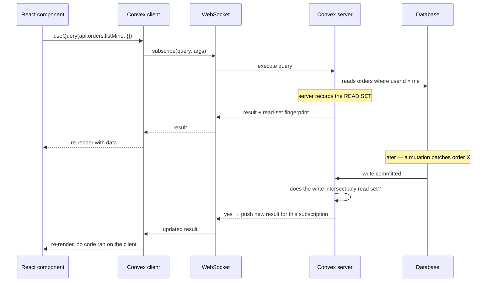
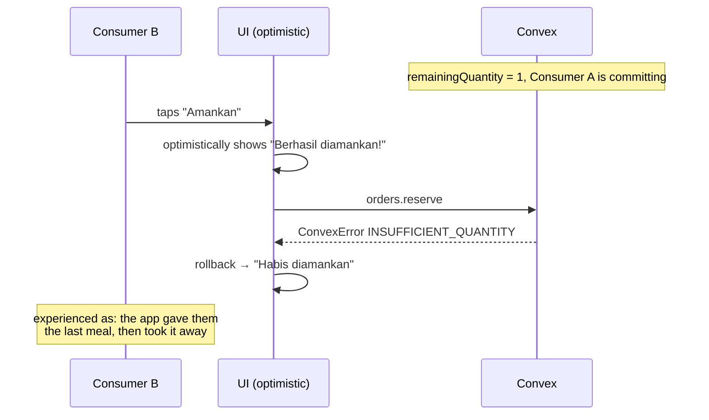
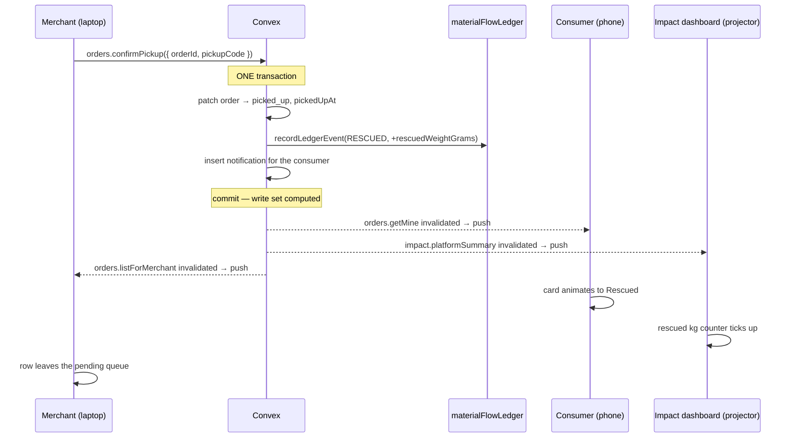

# Realtime Architecture

| Field | Value |
| --- | --- |
| **Document Type** | Architecture Specification |
| **Status** | Draft v1.0 |
| **Last Updated** | 2026-08-06 |
| **Owner** | Backend Engineering |
| **Platform** | Convex 1.43 reactive queries |
| **Audience** | Engineers, reviewers, DSDC ANFORCOM 2026 judges |

---

## 1. Purpose and Scope

Cirquo has a physical loop at its centre. A consumer stands at a counter, a merchant types a **pickup code**, and a **RESCUED** event is written to the **Material Flow Ledger**. Between those two moments there is a person waiting to see confirmation on a screen.

Realtime is not decoration in this product. It is the mechanism by which two people standing next to each other agree that a transaction happened, and the mechanism by which a consumer three kilometres away finds out that the last portion is gone before they walk over.

This document specifies how Convex reactivity works, every realtime surface in the product, how subscriptions are scoped, when optimistic updates are safe and when they are actively dangerous, offline and reconnection behaviour, the demo-critical moment, failure modes, and load projections.

**Current state — 2026-08-27.** Auth, Merchant Rescue Item, Consumer discovery,
and order pages use reactive Convex queries. Some dashboards and later-role
flows still use placeholder UI. Everything below marked 📋 is specification.

---

## 2. How Convex Reactivity Actually Works

### 2.1 The Mechanism



Three properties do all the work:

| Property | What it means |
| --- | --- |
| **Query subscriptions** | `useQuery` opens a durable subscription over a single multiplexed WebSocket, not a one-off HTTP request |
| **Read-set dependency tracking** | The server records exactly which documents and index ranges a query touched during execution |
| **Automatic invalidation** | When a mutation commits, the server compares its write set against every live read set and re-runs only the affected queries |

### 2.2 What This Means Practically

| We do not write | Because |
| --- | --- |
| Cache invalidation logic | The server knows the read set; we cannot get it wrong |
| Polling intervals | There is nothing to poll — the server pushes |
| WebSocket connection code | The Convex client owns the socket, reconnection, and backoff |
| Query key definitions | The query reference plus its arguments *is* the key |
| Manual refetch after a mutation | The mutation's write set invalidates the query automatically |
| Optimistic-then-refetch cycles | The authoritative value arrives on its own, usually within one frame of the commit |

This is why Cirquo has no Redux, no Zustand, and no TanStack Query. See [`FRONTEND.md`](FRONTEND.md#7-state-management-doctrine).

**Consistency guarantee.** Convex queries observe a consistent snapshot. Two `useQuery` calls rendered in the same component tree cannot show data from different points in time, so a "3 tersisa" badge can never be rendered next to a sold-out button.

### 2.3 The One Thing to Get Right

A query's reactivity is exactly as precise as its read set.

```ts
// ❌ Read set = the entire surplusItems table.
// Any merchant anywhere publishes an item → every consumer's client re-renders.
const all = await ctx.db.query("surplusItems").collect();

// ✅ Read set = one merchant's rows in one index range.
// Only that merchant's clients are invalidated.
const mine = await ctx.db
  .query("surplusItems")
  .withIndex("by_merchant_status", (q) =>
    q.eq("merchantId", merchant._id).eq("status", "active"))
  .collect();
```

Index discipline is not only a performance concern in Convex — **it is a reactivity scoping concern**. A sloppy query makes every user a subscriber to every write.

---

## 3. Realtime Surfaces

Every reactive surface in the product, with its query, subscribers, invalidation trigger, expected latency, and UX treatment.

| # | Surface | Query | Subscribers | Invalidated by | Latency | UX treatment | Status |
| --- | --- | --- | --- | --- | --- | --- | --- |
| 1 | **Order status flips to `picked_up`** | `orders.getMine(orderId)` | The one consumer | `orders.confirmPickup` (merchant) | < 500 ms | Card morphs to a green "Rescued" state, `RescueItemCard` shows rescued weight, confetti-free success toast | 📋 |
| 2 | **Order status flips to `paid`** | `orders.getMine(orderId)` | The one consumer | `payments.recordSettlement` (webhook) | < 1 s after Midtrans callback | Pickup code and QR revealed; hold countdown replaced by pickup window countdown | 📋 |
| 3 | **Merchant incoming reservations** | `orders.listForMerchant({status:"reserved"\|"paid"})` | Staff devices for one merchant | `orders.reserve`, `recordSettlement`, `sweepExpiredHolds` | < 500 ms | Row slides into the table, subtle highlight for 3 s, unread count on the nav item | 📋 |
| 4 | **Live remaining quantity on a listing** | `surplusItems.get(itemId)` | Everyone viewing that item | `orders.reserve` by anyone, `sweepExpiredHolds` restoring stock | < 500 ms | "3 tersisa" → "2 tersisa"; at 0 the Reserve button becomes a disabled "Habis diamankan" | 📋 |
| 5 | **Live price after a PRICE_ADJUSTED tick** | `surplusItems.get(itemId)` / `listNearby` | Everyone viewing that item or the Explore list | `surplusItems.applyPriceTick` cron (every 15 min) | < 1 s of the tick | New price cross-fades in, old price struck through, discount badge updates; `aria-live="polite"` announces it | 📋 |
| 6 | **Processor routed-batch queue** | `recoveryBatches.listForProcessor({status:"offered"})` | One processor's devices | `recoveryBatches.runRouting` cron (every 10 min), `sweepOfferTtl` | < 1 s of the routing tick | New offer card appears with a 6-hour TTL countdown bar; badge on the nav item | 📋 |
| 7 | **Batch accepted by another processor** | `recoveryBatches.get(batchId)` | Any processor with the detail open | `recoveryBatches.accept` | < 500 ms | Accept button disables, card shows "Sudah diambil fasilitas lain" | 📋 |
| 8 | **Merchant recovery status** | `recoveryBatches.listForMerchant` | One merchant | `runRouting`, `logIntake`, `logOutcome` | < 1 s | Status chip moves `pending → offered → accepted → collected → processed` | 📋 |
| 9 | **Merchant impact totals** | `impact.merchantSummary(merchantId)` | One merchant | Any `RESCUED` / `PROCESSED` ledger event for that merchant | < 1 s | Rescued / Recovered / Residual figures tick upward; circularity rate recomputes | 📋 |
| 10 | **Admin verification queue** | `admin.pendingVerifications` | Admin devices | Merchant/processor onboarding submission | < 1 s | Pending count badge; new row at the top | 📋 |
| 11 | **Admin platform dashboard** | `admin.platformSummary` | Admin devices | Any terminal ledger event | < 2 s | Counters animate; deliberately the *loosest* scoped query in the system | 📋 |
| 12 | **Admin ledger explorer** | `ledger.listRecent({limit:100})` | Admin devices | Every `recordLedgerEvent` call | < 500 ms | New event row prepends with a highlight — the most literal proof the ledger is live | 📋 |
| 13 | **Notification badge** | `notifications.unreadCount` | Every signed-in user | `notifications` inserts from any mutation | < 500 ms | Numeric badge on the bell; no sound, no toast for background events | 📋 |
| 14 | **Explore nearby list** | `surplusItems.listNearby(...)` | Every consumer on `/explore` | Any publish, reserve, expiry, or price tick for a nearby item | < 1 s | Cards insert/remove with a layout transition; never a full-list flash | 📋 |
| 15 | **Unroutable alert** | `recoveryBatches.listForMerchant({status:"unroutable"})` | One merchant, admin | `sweepOfferTtl` after 3 attempts | < 1 s | Amber banner: material became **Residual**; honest, not hidden | 📋 |

### 3.1 Surfaces That Are Deliberately Not Realtime

| Surface | Why static |
| --- | --- |
| Merchant profile / business hours | Changes are rare and self-initiated; a stale value has no consequence |
| Processor accepted material types | Same; read once per routing tick on the server |
| Static impact methodology copy | Versioned content (`impact-v1`), not data |
| Historical impact reports for a closed month | Immutable once the period ends; a subscription would be pure cost |
| Mapbox tiles | Not our data |

---

## 4. Subscription Scoping Discipline

### 4.1 The Rule

**Scope by identity. Never subscribe to a whole table.**

| Role | Scope key | Example |
| --- | --- | --- |
| Consumer | `userId` | `orders.listMine` filtered by `by_user` |
| Consumer (discovery) | Geographic radius | `listNearby` bounded by `by_status` plus Haversine |
| Merchant | `merchantId` | `orders.listForMerchant` via `by_merchant_status` |
| Processor | `processorId` | `recoveryBatches.listForProcessor` via `by_processor_status` |
| Admin | Status filter plus a hard limit | `pendingVerifications`, `listRecent({limit:100})` |

### 4.2 Cost and Performance Analysis

Convex bills on function calls and database bandwidth. An unscoped subscription multiplies both by the number of connected clients.

**Worked example — merchant order list, pilot scale.**

| Metric | Value |
| --- | --- |
| Merchants | 25 |
| Orders per day | ~150 |
| Reservations per merchant per day | ~6 |

| Approach | Query | Invalidations per day | Function executions per day |
| --- | --- | --- | --- |
| ❌ Unscoped | `orders.collect()` | 150 writes × 25 subscribed merchants | **3,750** |
| ✅ Scoped | `by_merchant_status` | 6 writes × 1 merchant, ×25 merchants | **150** |

A 25× reduction, and the ratio grows linearly with merchant count. At 10 cities (250 merchants) the unscoped version costs 375,000 executions per day for the same 1,500 real writes — a 250× multiplier for zero user benefit.

**Worked example — consumer discovery.** `listNearby` reads `by_status` on `active` items, so it *is* invalidated by any active-item write platform-wide. At 50 active items and ~650 ledger-adjacent writes per day this is acceptable. It is also the first query to move behind a `city` index at step 1 of the geospatial mitigation ladder — that change is a reactivity optimisation as much as a query optimisation. See [`BACKEND.md`](BACKEND.md#123-geospatial-limitation).

### 4.3 Anti-Patterns

| Anti-pattern | Consequence | Fix |
| --- | --- | --- |
| `useQuery(api.orders.listAll)` on a consumer page | Every consumer re-renders on every order in the system, and sees other people's orders | Scope by `userId` in the handler, not the client |
| Client-side filtering of an unscoped result | Data still crosses the wire; a privacy leak plus wasted bandwidth | Filter server-side with an index |
| One subscription per list row | N sockets' worth of read sets for one screen | One list query returning joined rows |
| Subscribing to `materialFlowLedger` without a limit | Every event platform-wide invalidates the query | `listRecent({ limit: 100 })`, admin-only |
| Re-creating query args objects inline each render | New args identity can churn the subscription | Memoise args derived from state |

### 4.4 Argument Stability

```tsx
// ❌ New object every render — avoid for complex args
const items = useQuery(api.surplusItems.listNearby, {
  latitude: coords.latitude, longitude: coords.longitude,
  radiusMeters: filters.within,
});

// ✅ Memoised, and rounded so a 1-metre GPS jitter does not resubscribe
const args = useMemo(() => ({
  latitude: round5(coords.latitude),
  longitude: round5(coords.longitude),
  radiusMeters: filters.within,
}), [coords.latitude, coords.longitude, filters.within]);

const items = useQuery(api.surplusItems.listNearby, args);
```

Rounding coordinates to five decimal places (~1.1 m) is deliberate: a phone's GPS drifts constantly while the user stands still, and without rounding every drift event would create a new subscription key and a fresh server execution.

**Skipping a query.** Pass `"skip"` rather than mounting conditionally, so hook order stays stable:

```tsx
const order = useQuery(api.orders.getMine, orderId ? { orderId } : "skip");
```

---

## 5. Optimistic Updates

### 5.1 Policy

| Action | Optimistic? | Reasoning |
| --- | --- | --- |
| Mark a notification read | ✅ Yes | Idempotent, user-scoped, zero business consequence on failure |
| Toggle a saved item | ✅ Yes | Local preference, no contention |
| Merchant edits a draft listing's text | ✅ Yes | Owner-scoped, cannot be contended (drafts are unpublished) |
| Dismiss a banner | ✅ Yes | Pure UI state |
| **Reserve a Rescue Item** | ❌ **Never** | Contended resource — see 5.2 |
| Confirm pickup (`RESCUED`) | ❌ Never | Terminal ledger event; must be server-confirmed |
| Pay / settle | ❌ Never | Money, and the source of truth is Midtrans |
| Accept a routed batch | ❌ Never | Another processor may have accepted first |
| Log `acceptedWeightGrams` | ❌ Never | Authoritative physical measurement |
| Log outcome / residual | ❌ Never | Terminal ledger event feeding impact figures |
| Admin verification or moderation | ❌ Never | Privileged; `MODERATED` is terminal |

### 5.2 Why Reservation Must Never Be Optimistic

Quantity is decremented **at reservation, not at payment**, specifically to prevent overselling. An optimistic update would defeat that guarantee at the presentation layer.



The backend correctly prevented overselling. The frontend would have *displayed* overselling anyway — and then displayed a retraction. From the user's point of view the platform lied. The whole reason for decrementing at reservation is to convert "we took your money for food that does not exist" into "someone got there first"; an optimistic reservation converts it back into a broken promise.

**The correct treatment.**

```tsx
// src/features/orders/ReserveButton.tsx — 📋 planned
export function ReserveButton({ item, quantity }: Props) {
  const reserve = useMutation(api.orders.reserve);
  const [pending, setPending] = useState(false);
  const navigate = useNavigate();

  async function onReserve() {
    setPending(true);
    try {
      const { orderId } = await reserve({ surplusItemId: item._id, quantity });
      toast.success("Item diamankan. Selesaikan pembayaran dalam 15 menit.");
      navigate(`/checkout/${orderId}`);
    } catch (error) {
      const code = extractConvexErrorCode(error);
      toast.error(RESERVE_ERROR_COPY[code] ?? "Reservasi gagal. Coba lagi.");
    } finally {
      setPending(false);
    }
  }

  const soldOut = item.remainingQuantity === 0;

  return (
    <Button onClick={onReserve} disabled={pending || soldOut} className="w-full">
      {soldOut ? "Habis diamankan" : pending ? "Mengamankan…" : "Amankan sekarang"}
    </Button>
  );
}
```

A pending spinner for 200–400 ms is honest. A success state that may be revoked is not. Server round-trip latency is short enough that the spinner reads as responsiveness, not lag.

### 5.3 An Acceptable Optimistic Update

```tsx
// src/features/notifications/useMarkRead.ts — 📋 planned
const markRead = useMutation(api.notifications.markRead).withOptimisticUpdate(
  (store, { notificationId }) => {
    const list = store.getQuery(api.notifications.listMine, {});
    if (!list) return;
    store.setQuery(
      api.notifications.listMine, {},
      list.map((n) => (n._id === notificationId ? { ...n, read: true } : n)),
    );

    const count = store.getQuery(api.notifications.unreadCount, {});
    if (typeof count === "number" && count > 0) {
      store.setQuery(api.notifications.unreadCount, {}, count - 1);
    }
  },
);
```

Note that **both** derived queries are updated. Updating only the list would leave the badge stale until the server response arrived, producing a visible flicker — an optimistic update that is incomplete is worse than none at all.

### 5.4 The Test

Before adding an optimistic update, answer:

1. Can this fail for a reason outside the user's control? → If yes, do not.
2. Does another actor compete for this resource? → If yes, do not.
3. Does it write a ledger event? → If yes, **absolutely** do not.
4. Would a rollback confuse or mislead the user? → If yes, do not.
5. Is it idempotent, user-scoped, and consequence-free? → Then yes.

---

## 6. Reconnection, Offline, and Backgrounding

### 6.1 Connection Lifecycle

| Event | Convex client behaviour | Our UI |
| --- | --- | --- |
| Socket drops | Automatic reconnect with exponential backoff | Amber banner "Koneksi terputus. Mencoba menyambung…" after 3 s |
| Reconnect succeeds | All subscriptions re-established; fresh results pushed | Banner disappears; changed values animate in |
| Mutation in flight when the socket drops | Convex retries the mutation on reconnect | Button stays in its pending state; no duplicate is created (mutations are deduplicated by the client's request id) |
| Extended offline | Subscriptions stay registered locally; last values retained | Persistent banner plus a "terakhir diperbarui HH:mm" stamp on time-sensitive cards |

```tsx
// src/hooks/useConvexConnection.ts — 📋 planned
export function useConvexConnection() {
  const [online, setOnline] = useState(navigator.onLine);

  useEffect(() => {
    const up = () => setOnline(true);
    const down = () => setOnline(false);
    window.addEventListener("online", up);
    window.addEventListener("offline", down);
    return () => {
      window.removeEventListener("online", up);
      window.removeEventListener("offline", down);
    };
  }, []);

  return { online };
}
```

### 6.2 Offline Policy

Cirquo is **online-first and honest about it**.

| Situation | Behaviour |
| --- | --- |
| Cold start offline | Service worker serves the app shell; a persistent offline banner is shown |
| Reading while offline | Last received query values render, marked with a "terakhir diperbarui" timestamp |
| Mutating while offline | Blocked at the button: "Tidak ada koneksi. Coba lagi setelah terhubung." |
| Reconnect | Convex resubscribes; all screens converge automatically |

**We do not queue mutations for later replay.** Replaying a reservation after five minutes offline would attempt to claim a unit that is almost certainly gone, and replaying a pickup confirmation would write a `RESCUED` event with a wrong `occurredAt`. The **Material Flow Ledger** is the source of every impact number Cirquo reports; corrupting its timestamps to save one retry tap is a bad trade. See [`FRONTEND.md`](FRONTEND.md#114-offline-behaviour).

**The pickup-code exception.** A consumer standing at a counter with poor indoor signal still needs their code. Because the order document was already received while online, the cached value renders and the code is displayed. The *merchant's* confirmation still requires connectivity — which is correct, because that is the write that creates the `RESCUED` event.

### 6.3 Capacitor Backgrounding

Android may suspend the WebView when the app is backgrounded, killing the socket.

| Event | Handling |
| --- | --- |
| App backgrounded | Socket may close; no action taken (we do not fight the OS) |
| App resumed | Convex reconnects automatically; a brief "Menyinkronkan…" indicator is shown while the first results land |
| Long suspension (> 30 min) | Full resubscribe on resume; every value is refreshed before the user can act on it |
| Doze mode | No background sync attempted; the pilot has no push notifications |

```ts
// src/hooks/useAppResume.ts — 📋 planned
useEffect(() => {
  if (!Capacitor.isNativePlatform()) return;
  const listener = App.addListener("appStateChange", ({ isActive }) => {
    if (isActive) setSyncing(true);           // cleared when the first result arrives
  });
  return () => { void listener.then((l) => l.remove()); };
}, []);
```

The important guarantee: **a resumed app never shows stale data as if it were fresh.** Either the socket has reconnected and the value is current, or the "Menyinkronkan…" state is visible.

---

## 7. The Demo-Critical Realtime Moment

### 7.1 The Moment

> The merchant enters a pickup code on a laptop. On a phone held in the presenter's other hand — a different device, a different session, a different network — the order card flips from **"Menunggu pickup"** to **"Rescued"**, the rescued weight appears, and the impact counter increments.

Nobody had to refresh anything. That is the entire pitch of Material Flow Orchestration compressed into two seconds.

### 7.2 The Chain



One mutation. Three devices update. No client code ran to make it happen.

### 7.3 Staging So Judges Notice

| Step | Action | Why |
| --- | --- | --- |
| 1 | Put the consumer phone on a stand or under a document camera, screen visible, **before** touching the merchant laptop | If the phone is picked up after the tap, the update is assumed to be a page load |
| 2 | Show a third screen with the impact dashboard on the projector | Two independent surfaces updating from one write is far more convincing than one |
| 3 | State the claim *before* acting: "Watch the phone. I will not touch it." | Sets the expectation so the change registers as significant |
| 4 | Type the code deliberately and pause a beat before pressing Enter | Gives eyes time to move to the phone |
| 5 | Say nothing for two seconds after the update | Silence lets the observation land |
| 6 | Then open the ledger explorer and show the `RESCUED` row with its weight and timestamp | Connects the animation to the durable record — the animation is a *consequence* of the ledger, not a UI trick |
| 7 | Use a phone on **mobile data**, not the venue Wi-Fi | Proves it is a real server round trip, not local state |

**Rehearsal checklist.**

| Check | Detail |
| --- | --- |
| Order is `paid` beforehand | `confirmPickup` requires `paid`; a `reserved` order throws `ORDER_NOT_PAID` |
| Current time is inside the pickup window | Otherwise `PICKUP_WINDOW_CLOSED`; seed the window generously |
| Phone screen timeout disabled | A dark screen at the critical moment kills the demo |
| Both devices signed in as the correct roles | A wrong-role session redirects |
| Fallback prepared | If the network fails, `bunx convex run` the sweep against seeded data and show the ledger directly |

### 7.4 Secondary Realtime Beats

| Beat | Setup | Effect |
| --- | --- | --- |
| Contention | Two phones on the same last unit; both tap | One succeeds; the other's button becomes "Habis diamankan" without a refresh. Shows the anti-overselling guarantee live. |
| Price tick | `bunx convex run surplusItems:applyPriceTick '{}'` while the Explore list is on screen | Prices drop across visible cards; the ledger gains `PRICE_ADJUSTED` rows |
| Circular Routing | `bunx convex run recoveryBatches:runRouting '{}'` with a processor dashboard visible | An offer card with a 6-hour TTL countdown appears on the processor's screen — the loop closing, live |

---

## 8. Presence and Typing Indicators — Out of Scope

**Explicitly not built.** Cirquo has no presence system, no "merchant is online" indicator, and no typing indicators.

| Feature | Why excluded |
| --- | --- |
| Online/offline presence | Requires heartbeats per user, a presence table with TTL cleanup, and a cron to reap stale entries. Continuous write load for zero decision value: a consumer picks up food during the **pickup window**, which is already displayed. |
| "Merchant is viewing your order" | No decision changes based on it |
| Typing indicators | There is no chat. Disputes are asynchronous forms. |
| Live cursors | Not a collaborative editing product |

**The cost avoided.** A naive presence implementation writing a heartbeat every 30 seconds for 200 concurrent users is 400 writes per minute — roughly **576,000 writes per day**, against a real business volume of ~650 ledger rows per day. Presence would be an 885× write amplification for a decorative indicator.

**If it is ever needed**, the honest substitute already exists: `merchants.operatingHoursStart/End` for merchants and `processors.operatingHoursStart/End` for facilities. Static, accurate, free.

---

## 9. Failure Modes and Fallbacks

| # | Failure | Symptom | Detection | Fallback |
| --- | --- | --- | --- | --- |
| 1 | WebSocket blocked by a venue firewall | Queries never resolve; permanent skeletons | No result within 8 s | Full-page notice: "Tidak bisa terhubung ke server." plus a retry button; demo falls back to a recorded flow |
| 2 | Convex deployment down | All queries error | Query throws | Error boundary renders a service-unavailable state; status link |
| 3 | Slow network (2G) | Updates arrive in seconds, not milliseconds | Client-side timing | Skeletons persist; no incorrect intermediate state is ever rendered |
| 4 | Client clock skew | Countdown timers wrong | Compare a server-supplied `now` with `Date.now()` on first load | Offset applied to all countdown rendering; **all server-side comparisons already use server time** |
| 5 | Query throws server-side | One surface blank | Error boundary | Section-level error card; the rest of the page still functions |
| 6 | Subscription storm (unscoped query shipped) | Latency spikes, cost spike | Convex dashboard function-call graph | Hotfix the query to use an index; the scoping rules in section 4 exist to prevent this |
| 7 | Stale render after resume | Old values shown as current | App-state listener | "Menyinkronkan…" indicator until the first post-resume result arrives |
| 8 | Mutation succeeds, socket drops before the push | User does not see their own change | Reconnect | On reconnect all subscriptions re-execute; the change appears. The write already committed — nothing is lost. |
| 9 | Midtrans webhook delayed | Order stays `reserved` while the consumer has paid | Consumer sees the hold countdown continue | Checkout screen shows "Menunggu konfirmasi pembayaran…" with a manual "Cek status" that calls a status-refresh action; the hold sweep is the safety net |

### 9.1 The Timeout Pattern

```tsx
// src/hooks/useQueryWithTimeout.ts — 📋 planned
export function useQueryWithTimeout<T>(result: T | undefined, ms = 8000) {
  const [timedOut, setTimedOut] = useState(false);

  useEffect(() => {
    if (result !== undefined) { setTimedOut(false); return; }
    const id = setTimeout(() => setTimedOut(true), ms);
    return () => clearTimeout(id);
  }, [result, ms]);

  return { loading: result === undefined && !timedOut, timedOut };
}
```

A skeleton that never resolves is the worst possible state — it implies progress that is not happening. After eight seconds we say so plainly.

### 9.2 Clock Skew

All timestamps are **integer epoch milliseconds UTC**; WIB is applied only at render. But a *client* clock can be wrong, which affects countdowns.

```ts
// src/lib/serverTime.ts — 📋 planned
let offsetMs = 0;

export function calibrate(serverNow: number) {
  offsetMs = serverNow - Date.now();
}

/** Use for every countdown. Never use raw Date.now() for a deadline. */
export function serverNow(): number {
  return Date.now() + offsetMs;
}
```

The server never trusts a client timestamp for anything: the payment hold, the pickup window, and the offer TTL are all evaluated server-side against server time. Skew is purely a display concern.

---

## 10. Load Projections and Cost

### 10.1 Pilot Baseline

| Metric | Value |
| --- | --- |
| Merchants | 25 |
| Listings per merchant per day | 2 |
| Active Rescue Items per day | 50 |
| Orders per day | ~150 |
| Ledger rows per day | ~650 |
| Ledger rows per year | ~240,000 |
| Peak concurrent users | ~50 (17:00–20:00 WIB, when merchants list end-of-day surplus) |
| Average subscriptions per client | 3–5 |

### 10.2 Invalidation Volume

| Query | Subscribers | Writes affecting it per day | Executions per day |
| --- | --- | --- | --- |
| `orders.listMine` | 1 per consumer | ~1.5 per consumer | ~150 |
| `orders.listForMerchant` | ~2 devices per merchant | ~6 per merchant | ~300 |
| `surplusItems.get` (detail) | ~3 concurrent viewers | ~5 per item | ~750 |
| `surplusItems.listNearby` | ~40 concurrent consumers | ~250 active-item writes | ~10,000 |
| `recoveryBatches.listForProcessor` | 1 per processor | ~5 | ~50 |
| `impact.merchantSummary` | 1 per merchant | ~6 | ~150 |
| `admin.platformSummary` | ~2 admins | ~200 terminal events | ~400 |
| `notifications.unreadCount` | 1 per user | ~3 | ~500 |
| **Total** | | | **~12,300 / day** |

`listNearby` is 80% of the total, because it is the one query whose read set spans all active items. This is the expected shape of a discovery-driven marketplace and is why the `city`-prefix mitigation is step 1 of the ladder rather than step 3.

### 10.3 Scaling Projection

| Scale | Merchants | Items/day | Query executions/day | Notes |
| --- | --- | --- | --- | --- |
| Pilot (Semarang) | 25 | 50 | ~12k | Comfortably within Convex's free/starter tier |
| City-wide | 200 | 400 | ~250k | Add the `city` index prefix — cuts `listNearby` invalidation to one city's writes |
| 3 cities | 600 | 1,200 | ~450k with city scoping | Without scoping this would be ~2.2M |
| 10 cities | 2,000 | 4,000 | ~1.5M with city scoping | Add geohash (step 2); introduce `impactSnapshots` pre-aggregation |

**When `impactSnapshots` becomes necessary.** Read-time aggregation over the ledger is fine at 240k rows per year. Around **10 cities** the platform summary would scan millions of rows on every invalidation, and a daily rollup into `impactSnapshots` becomes worthwhile. Until then it would be a cache with no cache pressure — added complexity, added staleness risk, no benefit. When it does arrive it is a **cache only, never a source of truth**; the ledger remains authoritative and the snapshot is always reproducible from it. See [`SCHEDULER.md`](SCHEDULER.md).

### 10.4 Cost Controls

| Control | Effect |
| --- | --- |
| Index-scoped queries everywhere | The primary lever; 25× to 250× reduction on operator queries |
| Hard `limit` on admin queries | Bounds the loosest subscriptions in the system |
| Memoised and rounded query args | Prevents GPS-jitter resubscription churn |
| `"skip"` for conditional queries | No subscription is opened until it is needed |
| No presence system | Avoids ~576k decorative writes per day |
| No polling anywhere | Reactivity replaces it entirely |
| `PRICE_ADJUSTED` emitted only on an actual change | A 15-minute tick over 50 items could emit 4,800 events/day; emitting only on change cuts it by roughly 80% |

That last row is a realtime decision as much as a data one: every emitted event is an invalidation, and an invalidation that changes nothing on screen is pure cost.

---

## 11. Testing Realtime Behaviour

| Test | Method | Status |
| --- | --- | --- |
| Consumer sees `picked_up` without refresh | Two browser contexts; merchant confirms in one, assert the DOM in the other | 📋 |
| Quantity decrements live for a third-party viewer | Context A views the item, Context B reserves, assert A's badge changes | 📋 |
| Sold-out state disables the button | Reserve the final unit in another context, assert the disabled state | 📋 |
| Price tick propagates | `bunx convex run surplusItems:applyPriceTick`, assert the rendered price | 📋 |
| Reconnect restores subscriptions | Toggle offline/online in devtools, assert values converge | 📋 |
| No optimistic reservation | Assert no success state renders before the server responds | 📋 |
| Read-set scoping | Assert a merchant's query is *not* invalidated by another merchant's write | 📋 |

The scoping test is the one most likely to be forgotten and the most valuable to keep: it is the regression guard against someone quietly replacing a `withIndex` with a `.collect()`.

---

## 12. Related Documents

- [`ARCHITECTURE.md`](ARCHITECTURE.md) — system overview
- [`FRONTEND.md`](FRONTEND.md) — `useQuery` patterns, loading states, error boundaries
- [`BACKEND.md`](BACKEND.md) — query design, indexes, transactions
- [`SCHEDULER.md`](SCHEDULER.md) — the crons that trigger many realtime updates
- [`../domain/STATE_MACHINE.md`](../domain/STATE_MACHINE.md) — the transitions users watch happen
- [`../domain/DATABASE.md`](../domain/DATABASE.md) — indexes that define read-set scope
- [`../impact/MATERIAL_LEDGER.md`](../impact/MATERIAL_LEDGER.md) — the events behind every live update
- [`../api/API_CONSUMER.md`](../api/API_CONSUMER.md) — consumer query contracts
- [`../design/UI_GUIDE.md`](../design/UI_GUIDE.md) — transition and animation guidance
- [`../spec/USER_FLOW.md`](../spec/USER_FLOW.md) — journeys these surfaces support
- [`../business/RISKS.md`](../business/RISKS.md) — connectivity and scale risks

---

**Built for DSDC ANFORCOM 2026**  
**Platform:** Cirquo — Closing the Loop, Saving Every Meal
