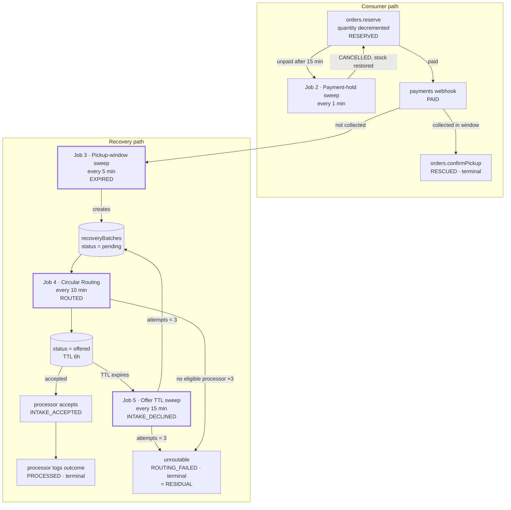

# Scheduled and Background Jobs

| Field | Value |
| --- | --- |
| **Document Type** | Architecture Specification |
| **Status** | Draft v1.0 |
| **Last Updated** | 2026-08-06 |
| **Owner** | Backend Engineering |
| **Platform** | Convex 1.43 `crons` + `ctx.scheduler` |
| **Audience** | Engineers, reviewers, DSDC ANFORCOM 2026 judges |

---

## 1. Purpose and Scope

Cirquo's loop does not close by itself. A **pickup window** ends whether or not anyone is watching. A 15-minute payment hold expires whether or not the consumer returns. A **Rescue Item** that nobody collects must enter **Circular Routing** without a human deciding to press a button.

Scheduled jobs are what make the platform's central promise true: **every kilogram is accounted for, even when nobody is looking.** Without them, unclaimed material would sit in `active` forever, prices would never move, offers would never time out, and the **Material Flow Ledger** would silently stop matching physical reality.

This document specifies every job, its schedule, its idempotency guarantee, its ledger emissions, its failure behaviour, and the ordering dependencies between jobs.

**Current state.** `convex/crons.ts` **does not exist**. There are no scheduled jobs, no `ctx.scheduler` calls, and no sweeps. Everything below is specification (Planned).

---

## 2. Convex Scheduling Semantics

### 2.1 The Two Mechanisms

| Mechanism | Shape | Use for | Guarantee |
| --- | --- | --- | --- |
| `crons.interval` / `crons.cron` | Recurring, registered in `convex/crons.ts` | Sweeps that must run regardless of user activity | Fires on schedule while the deployment is live |
| `ctx.scheduler.runAfter(delayMs, fn, args)` | One-shot, relative | Follow-up work triggered by a specific event | Executes once, at least once |
| `ctx.scheduler.runAt(timestampMs, fn, args)` | One-shot, absolute | Work anchored to a known future instant | Executes once, at least once |

### 2.2 Cron Registration

```ts
// convex/crons.ts — Planned
import { cronJobs } from "convex/server";
import { internal } from "./_generated/api";

const crons = cronJobs();

crons.interval("price tick",           { minutes: 15 }, internal.surplusItems.applyPriceTick, {});
crons.interval("payment hold sweep",   { minutes: 1  }, internal.orders.sweepExpiredHolds, {});
crons.interval("pickup window sweep",  { minutes: 5  }, internal.surplusItems.sweepPickupWindow, {});
crons.interval("circular routing",     { minutes: 10 }, internal.recoveryBatches.runRouting, {});
crons.interval("offer ttl sweep",      { minutes: 15 }, internal.recoveryBatches.sweepOfferTtl, {});
crons.interval("pickup reminder",      { minutes: 15 }, internal.notifications.sendPickupReminders, {});
crons.interval("expiry warning",       { minutes: 30 }, internal.notifications.sendExpiryWarnings, {});
crons.interval("notification fan-out", { minutes: 1  }, internal.notifications.drainOutbox, {});

// Daily jobs are pinned to a quiet hour. Cron times are UTC:
// 20:00 UTC = 03:00 WIB, the lowest-traffic hour in Semarang.
crons.cron("impact snapshot",  "0 20 * * *", internal.impact.rollupDaily, {});
crons.cron("integrity check",  "30 20 * * *", internal.admin.runIntegrityCheck, {});

export default crons;
```

### 2.3 Rules That Shape Every Job

| Rule | Reason |
| --- | --- |
| Every handler is an `internalMutation` (or `internalAction`) | Cron handlers must not be client-callable. A public `sweepExpiredHolds` would let anyone cancel other people's reservations. |
| Every handler is transactional | A sweep that patches an order *and* writes a `CANCELLED` event must do both or neither. |
| Every handler is bounded with `.take(n)` | Convex mutations have a duration budget; the next tick handles the remainder. |
| Every handler is idempotent | Overlap, replay, and manual triggers must all be safe. |
| Every state change calls `recordLedgerEvent` in the same mutation | Non-negotiable; see [`BACKEND.md`](BACKEND.md#5-the-ledger-contract). |
| Handlers return a result object | `{ scanned, changed }` is the observability surface in the Convex log. |
| No handler calls an external API | Mutations cannot `fetch`. If one ever needs to, it becomes a cron → `internalAction` → `internalMutation` chain. |

### 2.4 Why Crons Rather Than Per-Document Timers

`ctx.scheduler.runAt(order.paymentHoldExpiresAt, …)` at reservation time is superficially attractive — one timer per order, no polling.

We use crons instead:

| Concern | Per-document `runAt` | Cron sweep |
| --- | --- | --- |
| Scheduled jobs outstanding | One per reserved order (~150/day) | 1 |
| Cancelling when the user pays early | Must track and cancel the scheduled job | Nothing to cancel — the sweep's query simply does not match |
| Changing the hold duration | Existing timers keep the old value | Next tick uses the new constant |
| Recovering from a missed window | The timer is gone forever | The next tick picks it up |
| Debugging | Inspect N opaque scheduled jobs | Run one function and read its return value |
| Demo control | Cannot trigger a specific timer early | `bunx convex run orders:sweepExpiredHolds '{}'` |

The cron sweep is stateless with respect to scheduling: **the documents themselves are the queue**. `ctx.scheduler` is reserved for genuinely one-shot follow-ups (see job 8).

---

## 3. Master Job Table

| # | Job | Schedule | Purpose | Function | Idempotency | Failure handling | Ledger events |
| --- | --- | --- | --- | --- | --- | --- | --- |
| 1 | Price tick | 15 min | Recompute Dynamic Rescue Pricing | `surplusItems.applyPriceTick` | Emits only when the price actually changes | Next tick retries; no state corruption | `PRICE_ADJUSTED` |
| 2 | Payment-hold sweep | **1 min** | Expire unpaid reservations, restore stock | `orders.sweepExpiredHolds` | Selects only `reserved` past expiry | Next tick retries within 60 s | `CANCELLED` |
| 3 | Pickup-window sweep | 5 min | Expire ended listings; expire uncollected paid orders | `surplusItems.sweepPickupWindow` | Selects only pre-transition statuses | Next tick retries | `EXPIRED`, `CANCELLED` |
| 4 | Circular Routing engine | 10 min | Match `pending` batches to processors | `recoveryBatches.runRouting` | Selects only `pending` | Batch stays `pending`; retried next tick | `ROUTED` |
| 5 | Offer TTL sweep | 15 min | Reclaim timed-out offers; mark `unroutable` after 3 attempts | `recoveryBatches.sweepOfferTtl` | Selects only `offered` past TTL | Next tick retries | `INTAKE_DECLINED`, `ROUTING_FAILED` |
| 6 | Pickup reminder | 15 min | Notify consumers ~30 min before window close | `notifications.sendPickupReminders` | `reminderSentAt` marker on the order | Skipped this cycle; retried next | none |
| 7 | Expiry warning | 30 min | Warn merchants of listings about to expire unclaimed | `notifications.sendExpiryWarnings` | `expiryWarnedAt` marker on the item | Skipped; retried next | none |
| 8 | Notification fan-out | 1 min | Deliver queued notifications to many recipients | `notifications.drainOutbox` | Row deleted on delivery | Row remains; retried | none |
| 9 | Impact snapshot (Phase 2) | Daily 20:00 UTC | Pre-aggregate ledger totals — **cache only** | `impact.rollupDaily` | Upsert keyed by `(scope, date)` | Snapshot missing; queries fall back to the ledger | none |
| 10 | Integrity check | Daily 20:30 UTC | Verify weight conservation and ledger completeness | `admin.runIntegrityCheck` | Read-only plus one report row | Alert raised; no data changed | none |

---

## 4. Job 1 — Price Tick

### 4.1 Purpose

Dynamic Rescue Pricing lowers the price of an unsold **Rescue Item** as its **pickup window** closes, so that food finds a consumer before it needs a processor. The discount curve is:

```
discount = base(materialType) + 0.25 · elapsed² + 0.10 · shortfall
```

clamped at `0.75` and floored at `floorPrice`. `elapsed` is the fraction of the window consumed; `shortfall` is the fraction of stock unsold. The quadratic term means the discount accelerates as the deadline nears — gentle early, urgent late.

### 4.2 Registration

```ts
crons.interval("price tick", { minutes: 15 }, internal.surplusItems.applyPriceTick, {});
```

### 4.3 Handler

```ts
// convex/surplusItems.ts — Planned
import { internalMutation } from "./_generated/server";
import { suggestRescuePrice } from "../src/lib/pricing";
import { recordLedgerEvent } from "./lib/ledger";

const PRICE_TICK_BATCH = 200;

export const applyPriceTick = internalMutation({
  args: {},
  handler: async (ctx) => {
    const now = Date.now();

    const items = await ctx.db
      .query("surplusItems")
      .withIndex("by_status", (q) => q.eq("status", "active"))
      .take(PRICE_TICK_BATCH);

    let adjusted = 0;

    for (const item of items) {
      if (item.pickupEndAt <= now) continue;        // job 3 owns expiry
      if (item.currentPrice <= item.floorPrice) continue;  // already at the floor

      const next = suggestRescuePrice({
        materialType: item.materialType,
        originalPrice: item.originalPrice,
        floorPrice: item.floorPrice,
        publishedAt: item.publishedAt ?? item.createdAt,
        pickupEndAt: item.pickupEndAt,
        now,
        initialQuantity: item.initialQuantity,
        remainingQuantity: item.remainingQuantity,
      });

      // THE KEY GUARD: emit only on an actual change.
      if (next === item.currentPrice) continue;

      await ctx.db.patch(item._id, { currentPrice: next });

      await recordLedgerEvent(ctx, {
        surplusItemId: item._id,
        eventType: "PRICE_ADJUSTED",
        weightDeltaGrams: 0,
        actorRole: "system",
        metadata: {
          from: item.currentPrice,
          to: next,
          discountFromOriginal: 1 - next / item.originalPrice,
          reason: "dynamic_rescue_pricing",
        },
        occurredAt: now,
      });

      adjusted++;
    }

    return { scanned: items.length, adjusted };
  },
});
```

### 4.4 Why "Only on an Actual Change" Matters

| Approach | Ledger rows/day (50 active items, 96 ticks) | Realtime invalidations | Signal quality |
| --- | --- | --- | --- |
| Emit every tick | up to **4,800** | 4,800 pushes to every viewer | Noise — most rows record no change |
| Emit on change only | ~**800** | ~800 | Every row is a real price movement |

Beyond cost, this is a correctness-of-meaning decision. `PRICE_ADJUSTED` should mean *the price adjusted*. An event stream where 83% of rows say "nothing happened" is an audit trail nobody will trust or read. The same reasoning is why the handler skips items already at `floorPrice`: they cannot move, so they should not generate events.

### 4.5 Interactions

| Interaction | Behaviour |
| --- | --- |
| Concurrent reservation | OCC retry; the reservation re-reads and uses whichever `currentPrice` won |
| Price falls after a reservation | Irrelevant — `orders.unitPrice` was snapshotted at reservation |
| Item expires mid-tick | Skipped by the `pickupEndAt` guard; job 3 handles it |
| Merchant manually sets a price | Allowed while `active` with no reservations; the next tick recomputes from the curve |

---

## 5. Job 2 — Payment-Hold Sweep

### 5.1 Purpose

Quantity is decremented **at reservation**, so an unpaid reservation holds stock hostage. The 15-minute payment hold bounds that; this sweep enforces the bound and returns the units to the pool.

### 5.2 Registration

```ts
crons.interval("payment hold sweep", { minutes: 1 }, internal.orders.sweepExpiredHolds, {});
```

**Why every minute.** A held unit is invisible to every other consumer. At a 5-minute cadence, worst-case dead time is 20 minutes; at 1 minute it is 16. On a hot item during the 17:00–20:00 WIB peak those four minutes are the difference between a rescue and an expiry. The cost is 1,440 executions per day of a query that usually returns zero rows — trivially cheap because `by_status_hold_expiry` is a direct range seek.

### 5.3 Handler

```ts
// convex/orders.ts — Planned
const HOLD_SWEEP_BATCH = 100;

export const sweepExpiredHolds = internalMutation({
  args: {},
  handler: async (ctx) => {
    const now = Date.now();

    const stale = await ctx.db
      .query("orders")
      .withIndex("by_status_hold_expiry", (q) =>
        q.eq("status", "reserved").lt("paymentHoldExpiresAt", now))
      .take(HOLD_SWEEP_BATCH);

    for (const order of stale) {
      await releaseReservation(ctx, order, now, "payment_hold_expired");
    }

    return { swept: stale.length };
  },
});

/**
 * Shared by the sweep, consumer cancellation, and payment failure.
 * Restores stock, cancels the order, and appends CANCELLED — one transaction.
 */
export async function releaseReservation(
  ctx: MutationCtx,
  order: Doc<"orders">,
  now: number,
  reason: string,
): Promise<void> {
  if (order.status !== "reserved") return;          // idempotent guard

  const item = await ctx.db.get(order.surplusItemId);
  if (item) {
    const restored = item.remainingQuantity + order.quantity;
    const stillOpen = item.pickupEndAt > now;

    await ctx.db.patch(item._id, {
      remainingQuantity: restored,
      status: !stillOpen
        ? item.status                                  // job 3 will expire it
        : restored === item.initialQuantity
          ? "active"
          : "reserved_partial",
    });
  }

  await ctx.db.patch(order._id, { status: "cancelled", cancelledAt: now });

  await recordLedgerEvent(ctx, {
    surplusItemId: order.surplusItemId,
    orderId: order._id,
    eventType: "CANCELLED",
    weightDeltaGrams: -order.rescuedWeightGrams,     // negative: reverses RESERVED
    actorRole: "system",
    metadata: { reason, quantity: order.quantity, restoredToStock: true },
    occurredAt: now,
  });

  await ctx.db.insert("notifications", {
    userId: order.userId,
    type: "reservation_expired",
    title: "Reservasi kedaluwarsa",
    body: "Batas 15 menit pembayaran terlewat. Item dikembalikan ke daftar.",
    link: "/explore",
    read: false,
    createdAt: now,
  });
}
```

### 5.4 Weight Accounting

`RESERVED` wrote `+rescuedWeightGrams`; `CANCELLED` writes `-rescuedWeightGrams`. The pair sums to zero, so an abandoned reservation contributes nothing to rescued totals while remaining fully visible in the audit trail. We never delete the `RESERVED` row — **the ledger is append-only**, and "this material was claimed and then released" is real history.

### 5.5 The Late-Settlement Race

```mermaid
sequenceDiagram
  participant S as Hold sweep
  participant DB as orders
  participant W as Midtrans webhook

  Note over DB: order.paymentHoldExpiresAt = T
  S->>DB: at T+0.4s → status = cancelled, CANCELLED written
  W->>DB: at T+0.9s → settlement arrives
  DB->>DB: order.status is "cancelled", not "reserved"
  DB->>DB: payment row recorded; order NOT promoted to paid
  DB->>DB: refund task queued for admin
```

The consumer is refunded, not given a phantom order. Extending the hold "just in case" would weaken the anti-overselling guarantee, which is worth more than avoiding a rare refund. See [`BACKEND.md`](BACKEND.md#92-midtrans-webhook).

---

## 6. Job 3 — Pickup-Window Expiry Sweep

### 6.1 Purpose

Two related transitions:

1. **Listings whose window has ended** move to `expired` (or straight to `recovery_pending` if unclaimed weight remains), emitting `EXPIRED`.
2. **Paid orders never collected** are expired, a refund is queued, and — critically — **the material re-enters routing rather than becoming Residual**.

### 6.2 Registration

```ts
crons.interval("pickup window sweep", { minutes: 5 }, internal.surplusItems.sweepPickupWindow, {});
```

Five minutes is chosen because expiry is not time-critical to a user standing in a shop; a listing lingering for up to five extra minutes is harmless, and the sweep is heavier than job 2 (it creates recovery batches).

### 6.3 Handler

```ts
// convex/surplusItems.ts — Planned
const EXPIRY_BATCH = 100;
const EXPIRABLE = ["active", "reserved_partial", "sold_out"] as const;

export const sweepPickupWindow = internalMutation({
  args: {},
  handler: async (ctx) => {
    const now = Date.now();
    let expiredItems = 0;
    let expiredOrders = 0;
    let batchesCreated = 0;

    // ---- Part 1: listings past their pickup window ------------------------
    for (const status of EXPIRABLE) {
      const due = await ctx.db
        .query("surplusItems")
        .withIndex("by_status_pickup_end", (q) =>
          q.eq("status", status).lt("pickupEndAt", now))
        .take(EXPIRY_BATCH);

      for (const item of due) {
        // Uncollected paid orders on this item expire too.
        const paid = await ctx.db
          .query("orders")
          .withIndex("by_item", (q) => q.eq("surplusItemId", item._id))
          .filter((q) => q.eq(q.field("status"), "paid"))
          .collect();

        let reenteringGrams = 0;

        for (const order of paid) {
          await ctx.db.patch(order._id, { status: "expired", cancelledAt: now });

          await recordLedgerEvent(ctx, {
            surplusItemId: item._id,
            orderId: order._id,
            eventType: "CANCELLED",
            weightDeltaGrams: -order.rescuedWeightGrams,
            actorRole: "system",
            metadata: {
              reason: "consumer_no_show",
              refundRequired: true,
              reentersRouting: true,          // NOT residual
            },
            occurredAt: now,
          });

          reenteringGrams += order.rescuedWeightGrams;
          expiredOrders++;

          await ctx.db.insert("notifications", {
            userId: order.userId,
            type: "pickup_missed",
            title: "Pickup terlewat",
            body: "Pickup window sudah berakhir. Refund sedang diproses.",
            link: `/orders/${order._id}`,
            read: false, createdAt: now,
          });
        }

        // Unclaimed stock + material returned by no-shows.
        const unclaimedGrams =
          item.remainingQuantity * item.weightPerItemGrams + reenteringGrams;

        if (unclaimedGrams > 0) {
          await ctx.db.patch(item._id, { status: "recovery_pending" });

          await ctx.db.insert("recoveryBatches", {
            surplusItemId: item._id,
            merchantId: item.merchantId,
            materialType: item.materialType,
            offeredWeightGrams: unclaimedGrams,
            status: "pending",
            routingAttempts: 0,
            declinedByProcessorIds: [],
            createdAt: now,
          });
          batchesCreated++;

          await recordLedgerEvent(ctx, {
            surplusItemId: item._id,
            eventType: "EXPIRED",
            weightDeltaGrams: -unclaimedGrams,
            actorRole: "system",
            metadata: {
              unclaimedQuantity: item.remainingQuantity,
              noShowGrams: reenteringGrams,
              enteringCircularRouting: true,
            },
            occurredAt: now,
          });
        } else {
          await ctx.db.patch(item._id, { status: "closed" });

          await recordLedgerEvent(ctx, {
            surplusItemId: item._id,
            eventType: "EXPIRED",
            weightDeltaGrams: 0,
            actorRole: "system",
            metadata: { fullyRescued: true },
            occurredAt: now,
          });
        }

        expiredItems++;
      }
    }

    return { expiredItems, expiredOrders, batchesCreated };
  },
});
```

### 6.4 Consumer No-Show Does Not Create Residual

This is a deliberate and important rule.

| Interpretation | What it would mean | Why rejected |
| --- | --- | --- |
| No-show ⇒ **Residual** | The food is written off as waste | **Factually false.** The food is physically still at the merchant, intact and processable. |
| No-show ⇒ re-enters routing | The material is offered to an **Organic Processor** | Matches physical reality and gives the material a second chance at recovery |

Marking a no-show as Residual would understate circularity and overstate waste — a reporting error in the *pessimistic* direction, but still an error. The **Material Flow Ledger** must describe what actually happened to the mass. The `metadata.reentersRouting: true` flag on the `CANCELLED` event makes this explicit and auditable.

### 6.5 Ordering Dependency

This job **creates** the `pending` batches that job 4 consumes. Job 3 runs every 5 minutes and job 4 every 10, so a batch waits at most ~10 minutes before its first routing attempt. That is well inside the operational reality of an **Organic Processor** collecting on a daily route.

---

## 7. Job 4 — Circular Routing Engine

### 7.1 Purpose

The differentiating job. It takes `pending` recovery batches, finds eligible **Organic Processors**, ranks them, and creates an `offered` batch with a 6-hour TTL. This is the mechanism by which surplus food that no consumer rescued still avoids landfill.

### 7.2 Registration

```ts
crons.interval("circular routing", { minutes: 10 }, internal.recoveryBatches.runRouting, {});
```

### 7.3 Eligibility Criteria

A processor is eligible for a batch only if **all** of these hold:

| # | Criterion | Field |
| --- | --- | --- |
| 1 | Verified | `verificationStatus === "verified"` |
| 2 | Accepts this material | `materialType ∈ acceptedMaterialTypes` |
| 3 | Within reach | `haversineMeters(...) <= maxPickupRadiusMeters` |
| 4 | Has capacity headroom | committed grams today + `offeredWeightGrams` <= `dailyCapacityGrams` |
| 5 | Has not declined this batch | `processorId ∉ declinedByProcessorIds` |
| 6 | Open within 24 hours | `operatingHoursStart/End` intersect the next 24 h |

Eligible processors are then scored:

```
score = 0.40·proximity + 0.25·capacityHeadroom + 0.25·reliability + 0.10·materialFit
```

### 7.4 Handler

```ts
// convex/recoveryBatches.ts — Planned
import { rankEligibleProcessors } from "../src/lib/routing";
import { haversineMeters } from "../src/lib/geo";

const ROUTING_BATCH = 50;
const OFFER_TTL_MS = 6 * 60 * 60 * 1000;   // 6 hours
const MAX_ROUTING_ATTEMPTS = 3;

export const runRouting = internalMutation({
  args: {},
  handler: async (ctx) => {
    const now = Date.now();

    const pending = await ctx.db
      .query("recoveryBatches")
      .withIndex("by_status", (q) => q.eq("status", "pending"))
      .take(ROUTING_BATCH);

    let routed = 0;
    let unroutable = 0;

    for (const batch of pending) {
      if (batch.routingAttempts >= MAX_ROUTING_ATTEMPTS) {
        await markUnroutable(ctx, batch, now, "max_attempts_reached");
        unroutable++;
        continue;
      }

      const merchant = await ctx.db.get(batch.merchantId);
      if (!merchant) continue;

      // City-scoped candidate fetch — the practical substitute for a geo index.
      const candidates = await ctx.db
        .query("processors")
        .withIndex("by_city_verification", (q) =>
          q.eq("city", merchant.city).eq("verificationStatus", "verified"))
        .collect();

      // Committed load today, per processor, for the capacity check.
      const eligible = [];
      for (const p of candidates) {
        if (!p.acceptedMaterialTypes.includes(batch.materialType)) continue;
        if (batch.declinedByProcessorIds.includes(p._id)) continue;

        const distanceMeters = haversineMeters(
          merchant.latitude, merchant.longitude, p.latitude, p.longitude,
        );
        if (distanceMeters > p.maxPickupRadiusMeters) continue;

        const committedToday = await committedGramsToday(ctx, p._id, now);
        const headroomGrams = p.dailyCapacityGrams - committedToday;
        if (headroomGrams < batch.offeredWeightGrams) continue;

        if (!opensWithin24h(p, now)) continue;

        eligible.push({
          processor: p,
          distanceMeters,
          headroomGrams,
          reliability: await reliabilityScore(ctx, p._id),
        });
      }

      if (eligible.length === 0) {
        // No candidate this cycle. Count the attempt so we eventually stop trying.
        await ctx.db.patch(batch._id, { routingAttempts: batch.routingAttempts + 1 });
        if (batch.routingAttempts + 1 >= MAX_ROUTING_ATTEMPTS) {
          await markUnroutable(ctx, batch, now, "no_eligible_processor");
          unroutable++;
        }
        continue;
      }

      // Pure ranking function — no Convex imports inside it.
      const ranked = rankEligibleProcessors(eligible, {
        offeredWeightGrams: batch.offeredWeightGrams,
        materialType: batch.materialType,
      });
      const winner = ranked[0];

      await ctx.db.patch(batch._id, {
        processorId: winner.processor._id,
        status: "offered",
        offerExpiresAt: now + OFFER_TTL_MS,
        routingAttempts: batch.routingAttempts + 1,
      });

      await recordLedgerEvent(ctx, {
        surplusItemId: batch.surplusItemId,
        recoveryBatchId: batch._id,
        eventType: "ROUTED",
        weightDeltaGrams: 0,
        actorRole: "system",
        metadata: {
          processorId: winner.processor._id,
          score: winner.score,
          distanceMeters: Math.round(winner.distanceMeters),
          attempt: batch.routingAttempts + 1,
          candidatesConsidered: eligible.length,
          offerExpiresAt: now + OFFER_TTL_MS,
        },
        occurredAt: now,
      });

      await ctx.db.insert("notifications", {
        userId: winner.processor.ownerId,
        type: "batch_offered",
        title: "Tawaran batch baru",
        body: `${(batch.offeredWeightGrams / 1000).toFixed(1)} kg ${batch.materialType}. Berlaku 6 jam.`,
        link: `/processor/batches/${batch._id}`,
        read: false, createdAt: now,
      });

      routed++;
    }

    return { scanned: pending.length, routed, unroutable };
  },
});
```

### 7.5 Score Metadata Is the Explanation

Every `ROUTED` event stores the winning score, distance, and candidate count. That turns the routing engine from a black box into an auditable decision: an admin can open the ledger and answer "why did batch X go to processor Y?" without re-running anything. This is also the answer to a judge asking whether Circular Routing is real logic or a hardcoded pick.

---

## 8. Job 5 — Offer TTL Sweep

### 8.1 Purpose

An `offered` batch that a processor never answers must not sit forever. After the 6-hour TTL it returns to `pending`, the processor is recorded as having declined, and the attempt counter increments. After **3 attempts** the batch is `unroutable` and the material is honestly reported as **Residual**.

### 8.2 Registration

```ts
crons.interval("offer ttl sweep", { minutes: 15 }, internal.recoveryBatches.sweepOfferTtl, {});
```

### 8.3 Handler

```ts
// convex/recoveryBatches.ts — Planned
const TTL_SWEEP_BATCH = 100;

export const sweepOfferTtl = internalMutation({
  args: {},
  handler: async (ctx) => {
    const now = Date.now();

    const timedOut = await ctx.db
      .query("recoveryBatches")
      .withIndex("by_status_offer_expiry", (q) =>
        q.eq("status", "offered").lt("offerExpiresAt", now))
      .take(TTL_SWEEP_BATCH);

    let returned = 0;
    let unroutable = 0;

    for (const batch of timedOut) {
      const declinedBy = batch.processorId
        ? [...batch.declinedByProcessorIds, batch.processorId]
        : batch.declinedByProcessorIds;

      await recordLedgerEvent(ctx, {
        surplusItemId: batch.surplusItemId,
        recoveryBatchId: batch._id,
        eventType: "INTAKE_DECLINED",
        weightDeltaGrams: 0,
        actorRole: "system",
        metadata: {
          reason: "offer_ttl_expired",
          processorId: batch.processorId,
          attempt: batch.routingAttempts,
        },
        occurredAt: now,
      });

      if (batch.routingAttempts >= MAX_ROUTING_ATTEMPTS) {
        await ctx.db.patch(batch._id, {
          status: "unroutable",
          processorId: undefined,
          offerExpiresAt: undefined,
          declinedByProcessorIds: declinedBy,
        });
        await markUnroutable(ctx, { ...batch, declinedByProcessorIds: declinedBy },
          now, "ttl_expired_max_attempts");
        unroutable++;
      } else {
        await ctx.db.patch(batch._id, {
          status: "pending",                 // job 4 picks it up again
          processorId: undefined,
          offerExpiresAt: undefined,
          declinedByProcessorIds: declinedBy,
        });
        returned++;
      }
    }

    return { scanned: timedOut.length, returned, unroutable };
  },
});

/** Terminal: the material could not be recovered. Reported honestly as Residual. */
async function markUnroutable(
  ctx: MutationCtx, batch: Doc<"recoveryBatches">, now: number, reason: string,
): Promise<void> {
  await ctx.db.patch(batch._id, {
    status: "unroutable",
    residualWeightGrams: batch.offeredWeightGrams,
  });
  await ctx.db.patch(batch.surplusItemId, { status: "residual" });

  await recordLedgerEvent(ctx, {
    surplusItemId: batch.surplusItemId,
    recoveryBatchId: batch._id,
    eventType: "ROUTING_FAILED",              // terminal
    weightDeltaGrams: batch.offeredWeightGrams,
    actorRole: "system",
    metadata: {
      reason,
      attempts: batch.routingAttempts,
      declinedBy: batch.declinedByProcessorIds,
      classifiedAs: "residual",
    },
    occurredAt: now,
  });

  const merchant = await ctx.db.get(batch.merchantId);
  if (merchant) {
    await ctx.db.insert("notifications", {
      userId: merchant.ownerId,
      type: "batch_unroutable",
      title: "Material tidak tersalurkan",
      body: `${(batch.offeredWeightGrams / 1000).toFixed(1)} kg tercatat sebagai Residual.`,
      link: "/merchant/impact",
      read: false, createdAt: now,
    });
  }
}
```

### 8.4 Why We Report Residual Loudly

It would be trivial to hide `unroutable` batches from impact figures and quote a flattering circularity rate. We do the opposite: **Residual is a first-class number displayed next to Rescued and Recovered.**

A platform that reports only its successes has an unfalsifiable impact claim. A platform that reports its failures has a *credible* one — and, practically, a merchant seeing repeated Residual in their district is the strongest possible argument for recruiting another processor there. This is also why Cirquo never says "zero waste" or "100% closed-loop": the ledger would contradict it.

### 8.5 Worst-Case Timeline

| Elapsed | Event |
| --- | --- |
| T+0 | Window closes; job 3 creates a `pending` batch |
| T+10 min | Job 4 offers to processor A (attempt 1) |
| T+6 h 10 m | Job 5 reclaims; A recorded as declined |
| T+6 h 20 m | Job 4 offers to processor B (attempt 2) |
| T+12 h 20 m | Job 5 reclaims |
| T+12 h 30 m | Job 4 offers to processor C (attempt 3) |
| T+18 h 30 m | Job 5 marks `unroutable`, emits `ROUTING_FAILED`, item → `residual` |

Roughly 18.5 hours from window close to a final Residual verdict. For food destined for BSF larvae or compost this is acceptable; for prepared meals the merchant is warned much earlier by job 7 so they can act before the window closes at all.

---

## 9. Job 6 — Pickup Reminder

### 9.1 Purpose

A paid order that is never collected produces a refund, an unhappy consumer, and material re-entering routing. A nudge 30 minutes before the window closes is the cheapest intervention available.

### 9.2 Registration

```ts
crons.interval("pickup reminder", { minutes: 15 }, internal.notifications.sendPickupReminders, {});
```

### 9.3 Handler

```ts
// convex/notifications.ts — Planned
const REMINDER_LEAD_MS = 30 * 60 * 1000;
const REMINDER_BATCH = 200;

export const sendPickupReminders = internalMutation({
  args: {},
  handler: async (ctx) => {
    const now = Date.now();
    const horizon = now + REMINDER_LEAD_MS + 15 * 60 * 1000;  // cover the next cycle

    const soon = await ctx.db
      .query("surplusItems")
      .withIndex("by_status_pickup_end", (q) =>
        q.eq("status", "sold_out").gt("pickupEndAt", now).lt("pickupEndAt", horizon))
      .take(REMINDER_BATCH);

    // reserved_partial items also have paid orders needing collection.
    const soonPartial = await ctx.db
      .query("surplusItems")
      .withIndex("by_status_pickup_end", (q) =>
        q.eq("status", "reserved_partial").gt("pickupEndAt", now).lt("pickupEndAt", horizon))
      .take(REMINDER_BATCH);

    let sent = 0;

    for (const item of [...soon, ...soonPartial]) {
      const paid = await ctx.db
        .query("orders")
        .withIndex("by_item", (q) => q.eq("surplusItemId", item._id))
        .filter((q) => q.eq(q.field("status"), "paid"))
        .collect();

      for (const order of paid) {
        if (order.reminderSentAt) continue;          // idempotency marker

        await ctx.db.patch(order._id, { reminderSentAt: now });

        await ctx.db.insert("notifications", {
          userId: order.userId,
          type: "pickup_reminder",
          title: "Pickup window segera berakhir",
          body: `Ambil ${item.name} sebelum ${formatTimeWIBServer(item.pickupEndAt)}. Kode: ${order.pickupCode}`,
          link: `/orders/${order._id}`,
          read: false, createdAt: now,
        });
        sent++;
      }
    }

    return { itemsChecked: soon.length + soonPartial.length, remindersSent: sent };
  },
});
```

Note `reminderSentAt` on the order. Without it, a 15-minute cron with a 30-minute lead window would send the same reminder two or three times. **No ledger event is emitted** — a reminder is communication, not a material state change, and the ledger records only material events.

---

## 10. Job 7 — Expiry Warning

### 10.1 Purpose

Tell a merchant, roughly an hour out, that a listing is heading for expiry with stock unsold — early enough to drop the price manually, promote it, or set aside a processor pickup.

### 10.2 Registration

```ts
crons.interval("expiry warning", { minutes: 30 }, internal.notifications.sendExpiryWarnings, {});
```

### 10.3 Handler

```ts
// convex/notifications.ts — Planned
const WARNING_LEAD_MS = 60 * 60 * 1000;

export const sendExpiryWarnings = internalMutation({
  args: {},
  handler: async (ctx) => {
    const now = Date.now();
    const horizon = now + WARNING_LEAD_MS;
    let warned = 0;

    for (const status of ["active", "reserved_partial"] as const) {
      const soon = await ctx.db
        .query("surplusItems")
        .withIndex("by_status_pickup_end", (q) =>
          q.eq("status", status).gt("pickupEndAt", now).lt("pickupEndAt", horizon))
        .take(200);

      for (const item of soon) {
        if (item.expiryWarnedAt) continue;           // idempotency marker
        if (item.remainingQuantity === 0) continue;  // nothing at risk

        await ctx.db.patch(item._id, { expiryWarnedAt: now });

        const merchant = await ctx.db.get(item.merchantId);
        if (!merchant) continue;

        const atRiskKg = (item.remainingQuantity * item.weightPerItemGrams) / 1000;

        await ctx.db.insert("notifications", {
          userId: merchant.ownerId,
          type: "expiry_warning",
          title: "Listing akan kedaluwarsa",
          body: `${item.name}: ${item.remainingQuantity} porsi (${atRiskKg.toFixed(1)} kg) belum diamankan. Akan masuk Circular Routing.`,
          link: `/merchant/surplus/${item._id}/edit`,
          read: false, createdAt: now,
        });
        warned++;
      }
    }

    return { warned };
  },
});
```

The copy deliberately says the material "will enter Circular Routing" rather than "will be wasted". That is both true and a better prompt: the merchant learns the platform has a second path, which builds trust in the recovery side of the product.

---

## 11. Job 8 — Notification Fan-Out

### 11.1 Purpose

Most notifications are written inline in the mutation that caused them — one recipient, one insert, same transaction. Fan-out exists for the minority of events with **many** recipients, where inserting N rows inline would bloat a user-facing mutation.

| Event | Recipients | Path |
| --- | --- | --- |
| Reservation created | 1 merchant | Inline |
| Pickup confirmed | 1 consumer | Inline |
| Batch offered | 1 processor | Inline |
| Batch unroutable | 1 merchant + admins | Fan-out |
| Platform announcement | All users of a role | Fan-out |
| Integrity violation | All admins | Fan-out |

### 11.2 Registration

```ts
crons.interval("notification fan-out", { minutes: 1 }, internal.notifications.drainOutbox, {});
```

### 11.3 Handler

```ts
// convex/notifications.ts — Planned
const FANOUT_BATCH = 20;
const RECIPIENTS_PER_RUN = 500;

export const drainOutbox = internalMutation({
  args: {},
  handler: async (ctx) => {
    const now = Date.now();

    const jobs = await ctx.db
      .query("notificationOutbox")
      .withIndex("by_status", (q) => q.eq("status", "pending"))
      .take(FANOUT_BATCH);

    let delivered = 0;

    for (const job of jobs) {
      const recipients = await resolveRecipients(ctx, job.audience);
      const slice = recipients.slice(job.cursor, job.cursor + RECIPIENTS_PER_RUN);

      for (const userId of slice) {
        await ctx.db.insert("notifications", {
          userId,
          type: job.type,
          title: job.title,
          body: job.body,
          link: job.link,
          read: false,
          createdAt: now,
        });
        delivered++;
      }

      const nextCursor = job.cursor + slice.length;
      if (nextCursor >= recipients.length) {
        await ctx.db.patch(job._id, { status: "done", completedAt: now });
      } else {
        await ctx.db.patch(job._id, { cursor: nextCursor });   // resume next tick
      }
    }

    return { jobs: jobs.length, delivered };
  },
});
```

The cursor makes a large fan-out resumable across ticks without ever exceeding a mutation's budget, and re-running a partially-drained job simply continues from the cursor rather than duplicating.

**Deliberately out of scope for the pilot:** push notifications, email, and SMS. All of those are external I/O and would require an `internalAction`, a provider account, and delivery-failure handling. In-app notifications are sufficient for a Semarang pilot where merchants have the dashboard open during service hours.

---

## 12. Job 9 — Impact Snapshot (Phase 2)

### 12.1 Status: Not Needed Yet

**This job is specified but deliberately not built for the pilot.**

Impact figures are computed at read time by `summariseLedger` over `materialFlowLedger`. At ~650 rows/day and ~240,000 rows/year, an indexed range scan over `by_occurred_at` for a month is a few thousand rows — fast, and always exactly correct.

| Scale | Ledger rows/year | Read-time aggregation | Verdict |
| --- | --- | --- | --- |
| Pilot (1 city, 25 merchants) | 240k | Milliseconds | Implemented No snapshot |
| 3 cities | 720k | Tens of ms | Implemented Still fine |
| **10 cities** | **2.4M** | Hundreds of ms per invalidation | Planned **Snapshot becomes worthwhile** |

Building it now would add a cache with no cache pressure: more code, more staleness risk, zero benefit.

### 12.2 Registration and Handler (when needed)

```ts
crons.cron("impact snapshot", "0 20 * * *", internal.impact.rollupDaily, {});
```

```ts
// convex/impact.ts — Planned Phase 2
export const rollupDaily = internalMutation({
  args: {},
  handler: async (ctx) => {
    const now = Date.now();
    const dayStart = startOfUtcDay(now - 24 * 60 * 60 * 1000);
    const dayEnd = dayStart + 24 * 60 * 60 * 1000;

    const events = await ctx.db
      .query("materialFlowLedger")
      .withIndex("by_occurred_at", (q) =>
        q.gte("occurredAt", dayStart).lt("occurredAt", dayEnd))
      .collect();

    // Pure function — same code the read-time query uses.
    const summary = summariseLedger(events);

    const existing = await ctx.db
      .query("impactSnapshots")
      .withIndex("by_scope_date", (q) => q.eq("scope", "platform").eq("date", dayStart))
      .unique();

    const doc = {
      scope: "platform" as const,
      date: dayStart,
      rescuedGrams: summary.rescuedGrams,
      recoveredGrams: summary.recoveredGrams,
      residualGrams: summary.residualGrams,
      circularityRate: summary.circularityRate,
      co2eAvoidedKg: estimateCo2e(summary),
      methodologyVersion: "impact-v1",
      generatedAt: now,
    };

    if (existing) await ctx.db.patch(existing._id, doc);   // idempotent upsert
    else await ctx.db.insert("impactSnapshots", doc);

    return { date: dayStart, events: events.length };
  },
});
```

### 12.3 Cache Only, Never a Source of Truth

| Rule | Reason |
| --- | --- |
| Snapshots are derived exclusively from ledger events | The ledger is the single source of truth |
| Any snapshot can be deleted and regenerated | If regeneration were impossible, it would be primary data |
| Writes are idempotent upserts keyed by `(scope, date)` | Re-running a day produces the identical row |
| Discrepancy between snapshot and ledger ⇒ **the snapshot is wrong** | Never patch the ledger to match a snapshot |
| `methodologyVersion` is stored on every row | A future `impact-v2` must not silently reinterpret old numbers |
| Queries fall back to the ledger if a snapshot is missing | A failed cron degrades performance, never correctness |

Job 10 explicitly re-derives from the ledger and compares, so a stale snapshot is caught within a day.

---

## 13. Job 10 — Integrity Check

### 13.1 Purpose

The strongest claim Cirquo makes is that every kilogram is accounted for. This job tries to prove it false every night.

### 13.2 Registration

```ts
crons.cron("integrity check", "30 20 * * *", internal.admin.runIntegrityCheck, {});
```

### 13.3 Invariants Checked

| # | Invariant | Violation means |
| --- | --- | --- |
| 1 | `sum(RESCUED) + sum(EXPIRED negatives) ≤ sum(LISTED)` per item | More mass left than entered — impossible |
| 2 | `residualWeightGrams ≤ acceptedWeightGrams` on every batch | Invalid outcome logging |
| 3 | `outputWeightGrams + residualWeightGrams ≤ acceptedWeightGrams` | Mass created from nothing |
| 4 | Every `picked_up` order has exactly one `RESCUED` event | A ledger write was skipped — the worst possible bug |
| 5 | Every `processed` batch has exactly one `PROCESSED` event | Same |
| 6 | Every `cancelled`/`expired` order has a `CANCELLED` event | Stock restored without a record |
| 7 | No item has two identical terminal events | The terminal guard failed |
| 8 | Every ledger row has an integer `weightDeltaGrams` | Type corruption |
| 9 | Every ledger row's `occurredAt` is in the past | Clock or logic error |
| 10 | Yesterday's snapshot matches a fresh ledger re-derivation | Snapshot drift (Phase 2) |

### 13.4 Handler

```ts
// convex/admin.ts — Planned
export const runIntegrityCheck = internalMutation({
  args: {},
  handler: async (ctx) => {
    const now = Date.now();
    const windowStart = now - 48 * 60 * 60 * 1000;
    const violations: Violation[] = [];

    // --- 4: every picked_up order must have exactly one RESCUED event ---
    const recentPickups = await ctx.db
      .query("orders")
      .withIndex("by_status_hold_expiry", (q) => q.eq("status", "picked_up"))
      .take(1000);

    for (const order of recentPickups) {
      if ((order.pickedUpAt ?? 0) < windowStart) continue;

      const events = await ctx.db
        .query("materialFlowLedger")
        .withIndex("by_order", (q) => q.eq("orderId", order._id))
        .collect();

      const rescued = events.filter((e) => e.eventType === "RESCUED");
      if (rescued.length !== 1) {
        violations.push({
          code: "MISSING_OR_DUPLICATE_RESCUED",
          severity: "critical",
          orderId: order._id,
          detail: `expected 1 RESCUED, found ${rescued.length}`,
        });
      } else if (rescued[0].weightDeltaGrams !== order.rescuedWeightGrams) {
        violations.push({
          code: "WEIGHT_MISMATCH",
          severity: "critical",
          orderId: order._id,
          detail: `ledger ${rescued[0].weightDeltaGrams}g vs order ${order.rescuedWeightGrams}g`,
        });
      }
    }

    // --- 2 & 3: weight conservation on processed batches ---
    const processed = await ctx.db
      .query("recoveryBatches")
      .withIndex("by_status", (q) => q.eq("status", "processed"))
      .take(500);

    for (const b of processed) {
      if ((b.completedAt ?? 0) < windowStart) continue;
      const accepted = b.acceptedWeightGrams ?? 0;
      const output = b.outputWeightGrams ?? 0;
      const residual = b.residualWeightGrams ?? 0;

      if (residual > accepted) {
        violations.push({ code: "RESIDUAL_EXCEEDS_ACCEPTED", severity: "critical",
          batchId: b._id, detail: `${residual}g > ${accepted}g` });
      }
      if (output + residual > accepted) {
        violations.push({ code: "MASS_NOT_CONSERVED", severity: "critical",
          batchId: b._id, detail: `${output}+${residual} > ${accepted}` });
      }
    }

    // --- 8 & 9: ledger row sanity ---
    const recentEvents = await ctx.db
      .query("materialFlowLedger")
      .withIndex("by_occurred_at", (q) => q.gte("occurredAt", windowStart))
      .collect();

    for (const e of recentEvents) {
      if (!Number.isInteger(e.weightDeltaGrams)) {
        violations.push({ code: "NON_INTEGER_WEIGHT", severity: "critical",
          eventId: e._id, detail: String(e.weightDeltaGrams) });
      }
      if (e.occurredAt > now + 60_000) {
        violations.push({ code: "FUTURE_TIMESTAMP", severity: "warning",
          eventId: e._id, detail: new Date(e.occurredAt).toISOString() });
      }
    }

    const report = {
      runAt: now,
      windowStart,
      eventsChecked: recentEvents.length,
      ordersChecked: recentPickups.length,
      batchesChecked: processed.length,
      violations,
      passed: violations.length === 0,
    };

    await ctx.db.insert("integrityReports", report);

    if (violations.length > 0) {
      const admins = await ctx.db
        .query("users")
        .withIndex("by_role", (q) => q.eq("role", "admin"))
        .collect();

      const critical = violations.filter((v) => v.severity === "critical").length;

      for (const admin of admins) {
        await ctx.db.insert("notifications", {
          userId: admin._id,
          type: "integrity_violation",
          title: critical > 0 ? "Pelanggaran integritas ledger" : "Peringatan integritas",
          body: `${violations.length} temuan (${critical} kritis) dalam 48 jam terakhir.`,
          link: "/admin/ledger?tab=integrity",
          read: false, createdAt: now,
        });
      }
      console.error("[integrity] violations", { count: violations.length, critical });
    }

    return report;
  },
});
```

### 13.5 Why This Job Justifies the Whole Architecture

The integrity check is only cheap to write because of two earlier decisions:

1. **Every state change and its ledger event share one transaction.** In a saga-based system, invariant 4 would fail routinely under normal operation and the check would be a noise generator rather than an alarm.
2. **`summariseLedger` is a pure function.** The check re-derives totals with the exact code the dashboards use, so it validates the reporting path, not just the storage.

If this job ever reports a critical violation, it means an invariant we believed was structural has been broken — which is precisely the kind of thing a nightly job should be looking for.

---

## 14. Idempotency

### 14.1 Why Every Sweep Must Be Safe to Run Twice

| Cause of a repeat run | Frequency |
| --- | --- |
| Cron ticks overlap because a run exceeded its interval | Rare, but certain under load |
| A deploy replays a tick around the cutover | Occasional |
| An operator triggers a handler manually (`bunx convex run`) during a demo | Frequent |
| A test suite runs the same handler twice | Every CI run |
| A transient failure causes a retry | Occasional |

If a sweep were not idempotent, a double run could restore stock twice (inventing inventory), write two `CANCELLED` events for one order (double-counting negative weight), or route one batch to two processors.

### 14.2 The Mechanism: The Query Is the Filter

Every sweep's selection query is itself the idempotency guard.

| Job | Selection | Second run finds |
| --- | --- | --- |
| 1 Price tick | `status = active` **and** computed price ≠ current | Nothing — the price now equals the computed value |
| 2 Hold sweep | `status = reserved` and past expiry | Nothing — swept orders are `cancelled` |
| 3 Window sweep | status ∈ {active, reserved_partial, sold_out} past `pickupEndAt` | Nothing — they are `expired`/`recovery_pending`/`closed` |
| 4 Routing | `status = pending` | Nothing — routed batches are `offered` |
| 5 TTL sweep | `status = offered` past `offerExpiresAt` | Nothing — they are `pending` or `unroutable` |
| 6 Reminder | `reminderSentAt` unset | Nothing — the marker is set |
| 7 Warning | `expiryWarnedAt` unset | Nothing — the marker is set |
| 8 Fan-out | `status = pending`, resumed from `cursor` | Continues from the cursor; never re-inserts |
| 9 Snapshot | Upsert keyed by `(scope, date)` | Overwrites with an identical value |
| 10 Integrity | Read-only plus one report insert | An extra report row; harmless |

Two markers are worth calling out because they are *extra* state added solely for idempotency:

- `orders.reminderSentAt` — without it, a 15-minute cron with a 30-minute lead window sends every reminder 2–3 times.
- `surplusItems.expiryWarnedAt` — same reasoning at a 30-minute cadence with a 60-minute lead.

### 14.3 Explicit Guards in Shared Helpers

Helpers reachable from more than one caller re-check status defensively:

```ts
export async function releaseReservation(ctx, order, now, reason) {
  if (order.status !== "reserved") return;   // called by sweep, cancel, and webhook
  // ...
}
```

`releaseReservation` is called by job 2, by consumer cancellation, and by a failed-payment webhook. Any two of those could fire near-simultaneously. The guard makes the second a no-op rather than a double stock restoration.

### 14.4 What Is Deliberately Not Idempotent

`orders.reserve` is not idempotent, by design — two reservation calls are two distinct claims on stock. That is a user-facing mutation, not a sweep, and the quantity check is what bounds it. See [`BACKEND.md`](BACKEND.md#91-mutation-idempotency).

---

## 15. The WIB / UTC Timezone Trap

### 15.1 The Rule

**Every timestamp stored, compared, or scheduled is an integer epoch millisecond in UTC. WIB exists only at render time.**

| Layer | Representation |
| --- | --- |
| Convex documents | `number` — epoch ms UTC |
| Cron `crons.cron` expressions | UTC |
| Comparisons in handlers | UTC epoch ms |
| Ledger `occurredAt` | UTC epoch ms |
| React rendering | Converted to WIB (`UTC+7`) by `src/lib/format.ts` |

### 15.2 The Trap

Indonesia's Western Indonesian Time is `UTC+7` with **no daylight saving**, which makes the offset conveniently constant — and that convenience is exactly what tempts people into storing local time. Concretely, if a merchant's pickup window ends at 20:00 WIB and someone stores `20:00` as a naive local value:

| Bug | Consequence |
| --- | --- |
| Sweep compares a WIB-shifted value against `Date.now()` (UTC) | The window appears to end **7 hours late**; unclaimed food sits `active` all night and never enters Circular Routing |
| Shifting in the other direction | Listings expire 7 hours early; consumers lose reservations mid-window |
| Mixed storage across code paths | Some items expire correctly and some do not — the hardest class of bug to notice |

For the 15-minute payment hold the same error yields a hold that never expires, permanently freezing stock.

### 15.3 Cron Expressions Are UTC

```ts
// 20:00 UTC = 03:00 WIB — the quietest hour in Semarang.
crons.cron("impact snapshot", "0 20 * * *", internal.impact.rollupDaily, {});
crons.cron("integrity check", "30 20 * * *", internal.admin.runIntegrityCheck, {});
```

Every `crons.cron` line carries a comment with its WIB equivalent. Interval crons (`{ minutes: n }`) are timezone-free and are preferred wherever a specific wall-clock hour is not required — that is why eight of the ten jobs use intervals.

### 15.4 Day Boundaries

"Today's capacity" for a processor and "yesterday's snapshot" both need a day boundary, and the correct boundary for an Indonesian operator is a **WIB** day, not a UTC day.

```ts
// convex/lib/time.ts — Planned
const WIB_OFFSET_MS = 7 * 60 * 60 * 1000;

/** Start of the WIB calendar day containing `epochMs`, returned as epoch ms UTC. */
export function startOfWibDay(epochMs: number): number {
  const shifted = epochMs + WIB_OFFSET_MS;
  const dayStartShifted = shifted - (shifted % 86_400_000);
  return dayStartShifted - WIB_OFFSET_MS;
}
```

The function takes UTC and returns UTC; the WIB offset appears only inside. Callers never handle a shifted value, so a shifted number can never escape into a stored field.

### 15.5 Rules

| Rule | Reason |
| --- | --- |
| Never store a formatted date string | Strings lose type safety and invite parsing bugs |
| Never store a shifted "WIB epoch" | Two representations of time is the origin of every bug above |
| Never call a date-formatting function inside a mutation | Formatting is a rendering concern |
| Always pass `now` into pure functions | Determinism and testability |
| Comment every `crons.cron` with its WIB equivalent | Future readers will reason in local time |
| Server never trusts a client timestamp | Clock skew is a display problem, not an authority problem |

---

## 16. Batching, Pagination, and Duration

### 16.1 Batch Sizes

| Job | Batch | Rationale |
| --- | --- | --- |
| 1 Price tick | 200 items | 4× headroom over 50 active items; one pure function call each |
| 2 Hold sweep | 100 orders | Usually returns 0–5; 100 covers any conceivable spike |
| 3 Window sweep | 100 per status | Heaviest job — creates batches and touches orders |
| 4 Routing | 50 batches | Each does a candidate scan plus a capacity lookup |
| 5 TTL sweep | 100 batches | Light: patch plus one ledger event |
| 6 Reminder | 200 items | Read-mostly |
| 7 Warning | 200 items | Read-mostly |
| 8 Fan-out | 20 jobs × 500 recipients | Cursor-resumable |
| 9 Snapshot | Full day via index range | ~650 rows at pilot scale |
| 10 Integrity | 1,000 orders / 500 batches / 48 h of events | Bounded by a time window |

### 16.2 Sizing Rule

Batch size is chosen so that **a full batch still completes comfortably inside a mutation's budget at 10× projected volume**. Job 4 gets the smallest batch because it does the most per row: a city-scoped processor scan, a per-candidate capacity computation, and a ranking call.

### 16.3 Residue Is Not a Failure

If a sweep hits its cap, the remaining rows are simply picked up on the next tick. There is no cursor to persist because the selection query naturally excludes already-processed rows.

| Job | Cap | Next attempt | Worst-case delay for the tail |
| --- | --- | --- | --- |
| 2 Hold sweep | 100 | 1 min | 1 min per extra 100 orders |
| 3 Window sweep | 100/status | 5 min | 5 min per extra 100 items |
| 4 Routing | 50 | 10 min | 10 min per extra 50 batches |

At pilot volume no sweep will ever reach its cap. The caps exist so that a traffic spike degrades into *slightly delayed* processing rather than a failing function.

### 16.4 Avoiding Unbounded Reads

```ts
// Not implemented Unbounded — will eventually exceed the memory budget
const all = await ctx.db.query("materialFlowLedger").collect();

// Implemented Bounded by an index range
const window = await ctx.db
  .query("materialFlowLedger")
  .withIndex("by_occurred_at", (q) => q.gte("occurredAt", start).lt("occurredAt", end))
  .collect();

// Implemented Bounded by count
const page = await ctx.db.query("recoveryBatches")
  .withIndex("by_status", (q) => q.eq("status", "pending"))
  .take(50);
```

`.collect()` is acceptable only when an index range already bounds the result — as in job 9's single-day scan.

---

## 17. Cron Overlap Prevention

### 17.1 The Risk

If job 3 takes longer than 5 minutes, a second invocation may begin while the first is still running. Two concurrent sweeps could try to expire the same item.

### 17.2 Why Overlap Is Mostly Harmless Here

Overlap is already handled by two properties working together:

1. **Transactional isolation.** Each sweep runs as a serializable transaction. If both read the same item and both try to patch it, Convex's OCC aborts one and retries it.
2. **Idempotent selection.** The retried run re-reads and finds the item already `expired`, so it selects nothing and does nothing.

The worst outcome of overlap is a small amount of wasted compute — never duplicate ledger events, never double stock restoration.

### 17.3 Guarding a Genuinely Long Job

Should a job ever become long-running, an explicit lock is available:

```ts
// convex/lib/joblock.ts — Planned if ever needed
const LOCK_TTL_MS = 5 * 60 * 1000;

export async function withJobLock<T>(
  ctx: MutationCtx, name: string, fn: () => Promise<T>,
): Promise<T | { skipped: true }> {
  const now = Date.now();
  const lock = await ctx.db
    .query("jobLocks")
    .withIndex("by_name", (q) => q.eq("name", name))
    .unique();

  if (lock && lock.expiresAt > now) return { skipped: true };

  if (lock) await ctx.db.patch(lock._id, { expiresAt: now + LOCK_TTL_MS, acquiredAt: now });
  else await ctx.db.insert("jobLocks", { name, acquiredAt: now, expiresAt: now + LOCK_TTL_MS });

  try {
    return await fn();
  } finally {
    const held = await ctx.db.query("jobLocks")
      .withIndex("by_name", (q) => q.eq("name", name)).unique();
    if (held) await ctx.db.patch(held._id, { expiresAt: 0 });
  }
}
```

**We do not use this today.** A TTL lock adds a failure mode of its own (a crashed run holding a lock until TTL) in exchange for preventing a problem that transactional idempotency already prevents. It is documented so the option is understood, not adopted by default.

### 17.4 Interval Selection Rule

Each interval is set to at least 10× the job's expected duration at 10× projected volume:

| Job | Expected duration | Interval | Headroom |
| --- | --- | --- | --- |
| 2 Hold sweep | < 100 ms | 60 s | 600× |
| 3 Window sweep | < 500 ms | 300 s | 600× |
| 4 Routing | < 1 s | 600 s | 600× |
| 1 Price tick | < 300 ms | 900 s | 3000× |

---

## 18. Failure and Retry Semantics

### 18.1 What Happens When a Handler Throws

| Stage | Behaviour |
| --- | --- |
| Mid-transaction | The entire mutation rolls back; **no partial writes, no orphan ledger events** |
| The tick | Recorded as failed in the Convex logs |
| The next tick | Runs normally and re-selects the same rows |
| Data | Unchanged from before the failed run |

Because sweeps are idempotent and transactional, **a failed run is indistinguishable from a run that never happened**. There is no repair procedure.

### 18.2 Per-Job Failure Impact

| Job | If it fails once | If it fails for an hour | If it fails for a day |
| --- | --- | --- | --- |
| 1 Price tick | Prices lag 15 min | Prices lag 1 h; items sell more slowly | Discounts never deepen; more expiries |
| 2 Hold sweep | Stock held 1 extra min | Up to 60 stale holds block inventory | Contended items effectively unavailable |
| 3 Window sweep | Expiry lags 5 min | Expired listings still visible; consumers hit `PICKUP_WINDOW_CLOSED` on reserve | **No batches created — Circular Routing stops entirely** |
| 4 Routing | Batch waits 10 min | Batches accumulate `pending` | Material ages; recovery quality drops |
| 5 TTL sweep | Offer held 15 min | Offers stuck with unresponsive processors | Batches never reach attempt 3; nothing is honestly marked Residual |
| 6 Reminder | Some consumers unreminded | More no-shows | Measurable rise in refunds |
| 7 Warning | Merchants unwarned | More unclaimed expiries | More material into routing |
| 8 Fan-out | Bulk notifications delayed | Queue grows | Admins miss alerts |
| 9 Snapshot | Falls back to the ledger | No visible effect | No visible effect (cache only) |
| 10 Integrity | No check that night | No check | Violations go undetected for a day |

Job 3 is the most consequential: it is the sole producer for job 4, so its failure silently halts the recovery half of the platform.

### 18.3 Partial Failure Within a Batch

The current handlers process a batch in one transaction, so one bad row rolls back the whole tick. For most jobs that is correct — the tick simply retries. For job 4, where one malformed processor document could block every batch in the run, per-item isolation is warranted:

```ts
// Planned hardening for job 4
for (const batch of pending) {
  try {
    await ctx.runMutation(internal.recoveryBatches.routeOne, { batchId: batch._id });
  } catch (error) {
    console.error("[routing] batch failed", { batchId: batch._id, error });
    // Continue — one poisoned batch must not block the queue.
  }
}
```

This converts job 4's cron handler into a *dispatcher* (`internalAction`) calling a per-batch `internalMutation`. Each batch keeps its own transaction, so isolation is gained without weakening atomicity. This is the only place where the extra indirection is justified.

### 18.4 Poison Rows

A row that fails every time would otherwise be retried forever. Job 4 already bounds this with `routingAttempts` and `MAX_ROUTING_ATTEMPTS = 3`, after which the batch becomes `unroutable` — a terminal, reported state rather than an infinite loop. Jobs 2 and 3 cannot produce poison rows because their transitions do not depend on external data.

---

## 19. Observability and Alerting

### 19.1 Return Values Are the Metrics

Every handler returns a structured result that lands in the Convex function log:

```ts
return { scanned: 47, adjusted: 12 };           // price tick
return { swept: 3 };                            // hold sweep
return { expiredItems: 8, expiredOrders: 2, batchesCreated: 6 };
return { scanned: 6, routed: 5, unroutable: 1 };
return { scanned: 2, returned: 1, unroutable: 1 };
```

### 19.2 Health Signals

| Signal | Healthy | Investigate |
| --- | --- | --- |
| `applyPriceTick.adjusted` | 5–30 per tick | `0` for hours during peak — pricing may be stuck at the floor or the cron is dead |
| `sweepExpiredHolds.swept` | 0–5 per minute | Sustained > 20 — payment flow is failing |
| `sweepPickupWindow.batchesCreated` | Peaks after 20:00 WIB | `0` for a whole evening — the sweep or `processingOnly` logic is broken |
| `runRouting.routed / scanned` | > 0.7 | < 0.3 — insufficient processor coverage in that city |
| `runRouting.unroutable` | Occasional | Rising trend — recruit processors |
| `sweepOfferTtl.returned` | Low | High — processors are not responding within 6 h |
| `runIntegrityCheck.violations` | **0** | **Any value > 0 is an incident** |

### 19.3 Alerting

| Condition | Channel | Severity |
| --- | --- | --- |
| Integrity violation, `critical` | Admin in-app notification + `console.error` | **P0** |
| Integrity violation, `warning` | Admin in-app notification | P2 |
| Any handler throws | Convex log + dashboard error rate | P1 |
| `unroutable` batch created | Merchant + admin notification | P2 |
| Routing success rate < 30% over 24 h | Admin notification | P2 |

There is no external paging integration in the pilot. The admin dashboard is the operational surface, and it is realtime — an integrity notification appears on an open admin screen within a second of being written. See [`REALTIME.md`](REALTIME.md).

### 19.4 Structured Logging

```ts
console.error("[integrity] violations", { count: violations.length, critical });
console.error("[routing] batch failed", { batchId, error });
console.error("[midtrans] amount mismatch", { expected, received });
```

Convention: a `[job-name]` prefix, a short message, and a structured object. Never log a full document (PII and noise) and never log a payment payload beyond identifiers and amounts.

---

## 20. Testing Scheduled Jobs Locally

### 20.1 The Problem

Crons do not fire on a predictable schedule in a dev deployment, and nobody can wait six hours to watch an offer TTL expire.

### 20.2 The Solution: Manual Triggers

Because every handler is a plain `internalMutation`, it can be invoked directly:

```bash
bunx convex run surplusItems:applyPriceTick '{}'
bunx convex run orders:sweepExpiredHolds '{}'
bunx convex run surplusItems:sweepPickupWindow '{}'
bunx convex run recoveryBatches:runRouting '{}'
bunx convex run recoveryBatches:sweepOfferTtl '{}'
bunx convex run notifications:sendPickupReminders '{}'
bunx convex run admin:runIntegrityCheck '{}'
```

Each prints its return value, so a run is immediately legible:

```
{ scanned: 12, adjusted: 4 }
```

### 20.3 Time-Travel Helpers (Dev Only)

Some transitions require the clock to have moved. Rather than mocking time, dev-only helpers move the *documents*:

```ts
// convex/devtools.ts — Planned dev deployment only
export const ageOrderHold = internalMutation({
  args: { orderId: v.id("orders"), minutes: v.number() },
  handler: async (ctx, args) => {
    const order = await ctx.db.get(args.orderId);
    if (!order) throw new Error("not found");
    await ctx.db.patch(order._id, {
      paymentHoldExpiresAt: order.paymentHoldExpiresAt - args.minutes * 60_000,
    });
  },
});

export const ageOfferTtl = internalMutation({
  args: { batchId: v.id("recoveryBatches"), hours: v.number() },
  handler: async (ctx, args) => {
    const batch = await ctx.db.get(args.batchId);
    if (!batch?.offerExpiresAt) throw new Error("not offered");
    await ctx.db.patch(batch._id, {
      offerExpiresAt: batch.offerExpiresAt - args.hours * 3_600_000,
    });
  },
});
```

A full six-hour TTL cycle in two commands:

```bash
bunx convex run devtools:ageOfferTtl '{"batchId":"...","hours":7}'
bunx convex run recoveryBatches:sweepOfferTtl '{}'
# → { scanned: 1, returned: 1, unroutable: 0 }
```

Moving `offerExpiresAt` backwards is more honest than faking `Date.now()`: the handler runs against real wall-clock time and real comparison logic, so the code path under test is the production one.

### 20.4 Automated Tests

```ts
// convex/scheduler.test.ts — Planned
test("hold sweep restores quantity and writes exactly one CANCELLED", async () => {
  const t = convexTest(schema);
  const { itemId, orderId } = await seedReservedOrder(t, {
    quantity: 2, weightPerItemGrams: 400, initialQuantity: 5,
  });

  await t.mutation(internal.devtools.ageOrderHold, { orderId, minutes: 20 });
  const result = await t.mutation(internal.orders.sweepExpiredHolds, {});
  expect(result.swept).toBe(1);

  const item = await t.run((ctx) => ctx.db.get(itemId));
  expect(item!.remainingQuantity).toBe(5);        // 3 + 2 restored
  expect(item!.status).toBe("active");

  const events = await t.query(api.ledger.listByItem, { surplusItemId: itemId });
  const cancelled = events.filter((e) => e.eventType === "CANCELLED");
  expect(cancelled).toHaveLength(1);
  expect(cancelled[0].weightDeltaGrams).toBe(-800);   // reverses RESERVED
});

test("hold sweep is idempotent", async () => {
  const t = convexTest(schema);
  const { itemId, orderId } = await seedReservedOrder(t, { quantity: 1 });
  await t.mutation(internal.devtools.ageOrderHold, { orderId, minutes: 20 });

  await t.mutation(internal.orders.sweepExpiredHolds, {});
  const second = await t.mutation(internal.orders.sweepExpiredHolds, {});
  expect(second.swept).toBe(0);

  const events = await t.query(api.ledger.listByItem, { surplusItemId: itemId });
  expect(events.filter((e) => e.eventType === "CANCELLED")).toHaveLength(1);
});

test("price tick emits PRICE_ADJUSTED only when the price changes", async () => {
  const t = convexTest(schema);
  const { itemId } = await seedActiveItem(t, { originalPrice: 20_000, floorPrice: 5_000 });

  await t.mutation(internal.surplusItems.applyPriceTick, {});
  const first = await t.query(api.ledger.listByItem, { surplusItemId: itemId });
  const afterFirst = first.filter((e) => e.eventType === "PRICE_ADJUSTED").length;

  await t.mutation(internal.surplusItems.applyPriceTick, {});   // no time passed
  const second = await t.query(api.ledger.listByItem, { surplusItemId: itemId });
  expect(second.filter((e) => e.eventType === "PRICE_ADJUSTED")).toHaveLength(afterFirst);
});

test("no-show re-enters routing rather than becoming residual", async () => {
  const t = convexTest(schema);
  const { itemId } = await seedPaidUncollectedOrder(t, { weightPerItemGrams: 500, quantity: 2 });

  await t.mutation(internal.devtools.closePickupWindow, { itemId });
  const result = await t.mutation(internal.surplusItems.sweepPickupWindow, {});
  expect(result.batchesCreated).toBe(1);

  const item = await t.run((ctx) => ctx.db.get(itemId));
  expect(item!.status).toBe("recovery_pending");     // NOT "residual"

  const events = await t.query(api.ledger.listByItem, { surplusItemId: itemId });
  const cancelled = events.find((e) => e.eventType === "CANCELLED");
  expect(cancelled!.metadata).toMatchObject({ reentersRouting: true });
});

test("three failed attempts mark the batch unroutable and terminal", async () => {
  const t = convexTest(schema);
  const { batchId, itemId } = await seedPendingBatch(t, { noEligibleProcessors: true });

  for (let i = 0; i < 3; i++) await t.mutation(internal.recoveryBatches.runRouting, {});

  const batch = await t.run((ctx) => ctx.db.get(batchId));
  expect(batch!.status).toBe("unroutable");

  const item = await t.run((ctx) => ctx.db.get(itemId));
  expect(item!.status).toBe("residual");

  const events = await t.query(api.ledger.listByItem, { surplusItemId: itemId });
  expect(events.filter((e) => e.eventType === "ROUTING_FAILED")).toHaveLength(1);
});
```

### 20.5 Demo Control

Manual triggers are also the demo's stagecraft. Instead of waiting for a natural window close:

```bash
bunx convex run devtools:closePickupWindow '{"itemId":"..."}'
bunx convex run surplusItems:sweepPickupWindow '{}'   # item → recovery_pending
bunx convex run recoveryBatches:runRouting '{}'       # processor's screen lights up
```

Three commands take material from "on sale" to "offered to an Organic Processor" while every subscribed screen updates live. See [`REALTIME.md`](REALTIME.md#7-the-demo-critical-realtime-moment).

---

## 21. Job Ordering Dependencies

### 21.1 The Chain



The three bold nodes are the dependency spine: **sweep 3 feeds job 4, which feeds job 5, which feeds back into job 4 or terminates at Residual.**

### 21.2 The Dependency Table

| Producer | Consumer | Artefact | Max latency |
| --- | --- | --- | --- |
| Job 3 (5 min) | Job 4 (10 min) | `recoveryBatches` with `status = pending` | ~10 min |
| Job 4 (10 min) | Job 5 (15 min) | `status = offered` with `offerExpiresAt` | 6 h TTL + ~15 min |
| Job 5 (15 min) | Job 4 (10 min) | `status = pending`, attempts incremented | ~10 min |
| Job 2 (1 min) | Job 3 (5 min) | Restored `remainingQuantity` | ~5 min |
| Jobs 1–8 | Job 10 (daily) | Ledger events | ≤ 24 h |
| Job 9 (daily) | Job 10 (daily) | `impactSnapshots` row | 30 min (scheduled after) |

### 21.3 Why the Cadences Are Ordered This Way

The intervals are not arbitrary — each is faster than its consumer so work is always waiting when the consumer runs, never the reverse:

| Relationship | Producer | Consumer | Effect |
| --- | --- | --- | --- |
| 3 → 4 | 5 min | 10 min | A batch always exists before routing runs |
| 4 → 5 | 10 min | 15 min | An offer is always established before the TTL sweep looks |
| 2 → 3 | 1 min | 5 min | Stock is restored before expiry classifies unclaimed weight |

If job 3 ran *slower* than job 4, routing ticks would frequently find an empty queue and material would sit longer than necessary. If job 2 ran slower than job 3, expired holds would still be counted as reserved when job 3 computed unclaimed weight — producing an understated `EXPIRED` delta and an understated recovery batch.

### 21.4 Job 9 and Job 10 Ordering

`impact.rollupDaily` at 20:00 UTC, `admin.runIntegrityCheck` at 20:30 UTC. The 30-minute gap exists so the integrity check can verify the snapshot the rollup just produced (invariant 10). Reversing the order would check yesterday's snapshot every night — technically valid, but a day late in detecting drift.

### 21.5 Independent Jobs

Jobs 1, 6, 7, and 8 have no producers or consumers. They read existing state and either patch a field or insert a notification. They can fail, run late, or be disabled entirely without affecting the material flow chain — which is exactly why none of them emits a weight-bearing ledger event.

---

## 22. Summary of Ledger Events by Job

| Job | Events emitted | Weight-bearing | Terminal |
| --- | --- | --- | --- |
| 1 Price tick | `PRICE_ADJUSTED` | No (`0`) | No |
| 2 Hold sweep | `CANCELLED` | Yes (negative) | No |
| 3 Window sweep | `EXPIRED`, `CANCELLED` | Yes (negative) | No |
| 4 Routing | `ROUTED` | No (`0`) | No |
| 5 TTL sweep | `INTAKE_DECLINED`, `ROUTING_FAILED` | `ROUTING_FAILED` yes | `ROUTING_FAILED` **yes** |
| 6 Reminder | none | — | — |
| 7 Warning | none | — | — |
| 8 Fan-out | none | — | — |
| 9 Snapshot | none | — | — |
| 10 Integrity | none | — | — |

Five of ten jobs write to the ledger. Every one of those writes happens **inside the same transaction as the state change it records** — never from an action, never from the client, and never recomputing a historical weight. See [`BACKEND.md`](BACKEND.md#52-the-four-anti-patterns).

---

## 23. Related Documents

- [`ARCHITECTURE.md`](ARCHITECTURE.md) — system overview
- [`BACKEND.md`](BACKEND.md) — transactions, guards, `recordLedgerEvent`
- [`REALTIME.md`](REALTIME.md) — how cron output reaches screens live
- [`FRONTEND.md`](FRONTEND.md) — countdowns, WIB rendering, notification surfaces
- [`../domain/STATE_MACHINE.md`](../domain/STATE_MACHINE.md) — the transitions these jobs drive
- [`../domain/DATABASE.md`](../domain/DATABASE.md) — indexes every sweep depends on
- [`../impact/MATERIAL_LEDGER.md`](../impact/MATERIAL_LEDGER.md) — event contract
- [`../impact/ALGORITHM.md`](../impact/ALGORITHM.md) — pricing and routing formulas
- [`../impact/IMPACT.md`](../impact/IMPACT.md) — methodology `impact-v1`
- [`../api/API.md`](../api/API.md) — function catalogue
- [`../security/PERMISSIONS.md`](../security/PERMISSIONS.md) — why cron handlers are internal
- [`../engineering/TESTING.md`](../engineering/TESTING.md) — test strategy
- [`../engineering/DEVELOPMENT.md`](../engineering/DEVELOPMENT.md) — local setup and manual triggers
- [`../business/RISKS.md`](../business/RISKS.md) — processor coverage and routing failure risk

---

**Built for DSDC ANFORCOM 2026**  
**Platform:** Cirquo — Closing the Loop, Saving Every Meal
