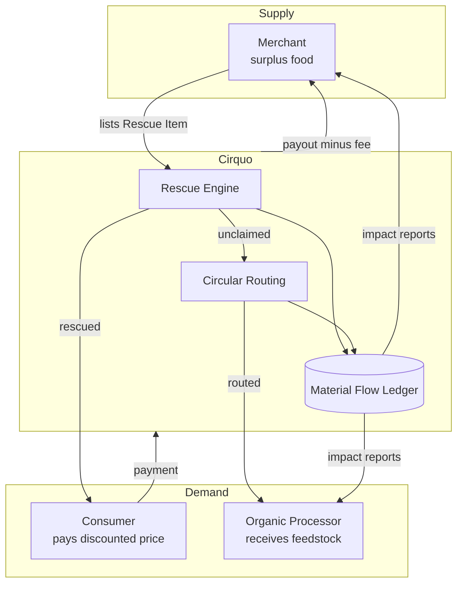
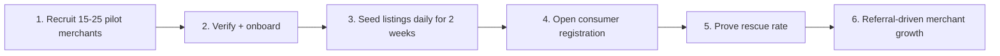

# Business Model — Cirquo

**Document type:** Business strategy  
**Status:** Draft v1.0 — competition context  
**Last updated:** 2026-08-29

> **Scope note:** The competition MVP does not monetize. Midtrans runs in Sandbox mode and no platform fee is deducted. This document describes the model Cirquo would operate under commercially, and the MVP hooks that must exist so monetization can be switched on without a rewrite. See [ROADMAP.md](ROADMAP.md) for phasing.

> **Implementation boundary:** this is strategy, not a release tracker. Source
> availability and future milestone work are recorded in
> [IMPLEMENTATION_STATUS.md](../project/IMPLEMENTATION_STATUS.md).

---

## 1. Business Model Overview

Cirquo is a **three-sided platform** with an asymmetric monetization strategy: the side that receives the most captured value (Merchants) pays, the side that is most price-sensitive (Consumers) does not, and the side that is hardest to acquire (Processors) is subsidized in the early phase.

**Core economic insight:** A Rescue Item has a value of **zero** to the Merchant if it goes unsold. Any recovered revenue is upside. This makes Merchants unusually tolerant of a platform fee, because the counterfactual is total loss plus a disposal cost.

| Party | Pays | Receives |
|---|---|---|
| Consumer | Discounted price of the Rescue Item | Food at 30–70% off, personal impact record |
| Merchant | Commission on rescued transactions | Recovered revenue, avoided disposal cost, impact reporting |
| Processor | Nothing (MVP and early commercial) | Tracked feedstock supply, audit trail, impact reporting |
| Platform | Payment gateway fees, hosting | Commission, subscriptions, data/reporting products |

---

## 2. Revenue Streams

Streams are ordered by expected time-to-revenue. Only R1 has an MVP implementation hook; the rest are post-competition.

### R1 — Transaction Commission (Primary)

A percentage fee on the value of each **completed Rescue** (an order that reaches `picked_up`).

| Parameter | Value | Rationale |
|---|---|---|
| Fee rate | 12% of the Rescue Item price paid | Below food-delivery norms (20–30%) because our merchants are recovering a total loss, not selling at margin |
| Charged on | `picked_up` only | No fee for cancelled, expired, or refunded orders — merchant never pays for a failed rescue |
| Deducted at | Payout, not checkout | Consumer price is exactly what they saw; fee is invisible to the demand side |
| Floor | Rp500 per transaction | Covers payment gateway cost on very small baskets |

**Worked example:**

| Line | Amount |
|---|---|
| Original price of item | Rp45.000 |
| Rescue price paid by Consumer | Rp22.000 |
| Platform commission (12%) | Rp2.640 |
| Midtrans fee (~Rp2.000 flat, e-wallet/VA) | Rp2.000 |
| **Merchant payout** | **Rp19.360** |
| **Cirquo gross margin** | **Rp640** |

> ⚠️ **Unit economics warning:** At Rp22.000 basket size and a flat Midtrans fee, gross margin per transaction is thin (~3%). Profitability depends on **basket size** and **payment method mix** (QRIS is cheaper than VA). This is the single most important number to monitor post-launch. See §7 KPIs.

**MVP implementation hook:** `orders` must carry a `platformFeeAmount` field computed at pickup confirmation, even though the value is `0` in Sandbox. See [DATABASE.md](../domain/DATABASE.md).

---

### R2 — Merchant Subscription (Secondary)

Tiered SaaS layer for merchants that want more than the free listing capability.

| Tier | Price/month | Includes |
|---|---|---|
| **Rescue Free** | Rp0 | Unlimited listings, dynamic pricing, basic impact dashboard, 12% commission |
| **Rescue Pro** | Rp149.000 | 8% commission, scheduled/recurring listings, exportable impact report (PDF/CSV), priority marketplace ranking boost, surplus trend analytics |
| **Rescue Enterprise** | Custom | Multi-outlet management, API access, white-label impact reporting, dedicated onboarding, SLA |

**Why merchants upgrade:** The commission discount alone pays for Rescue Pro at roughly Rp3.7M/month of rescued GMV. Below that, they upgrade for the **exportable impact report**, which is the actual hook for businesses with CSR/ESG obligations.

---

### R3 — Impact Reporting & Verification (Differentiator)

Because the [Material Flow Ledger](../impact/MATERIAL_LEDGER.md) is append-only and auditable, Cirquo can sell **verified** circularity reporting — something self-reported sustainability tooling cannot offer.

| Product | Buyer | Price model |
|---|---|---|
| Verified Circularity Report | Merchant chains, hotels, campuses | Rp2–10M per annual report |
| ESG data feed (API) | Sustainability platforms, consultancies | Rp5–25M/year per integration |
| Municipal diversion dashboard | City waste agencies (Dinas Lingkungan Hidup) | Rp50–250M/year per city contract |

**Why this is defensible:** A competitor can copy a marketplace in a quarter. They cannot retroactively produce a two-year append-only ledger of verified material flows.

---

### R4 — Processor Services (Later)

Processors are free in early phases because they are the scarcest side of the network. Once processor supply exceeds demand for feedstock, monetization options open:

- **Priority routing placement** — processors pay to be matched first for high-quality feedstock
- **Intake analytics** — capacity planning, seasonality forecasting
- **Compliance reporting pack** — certification-ready audit exports

Not before the platform has ≥3 processors competing for the same routed material in a city.

---

### R5 — Carbon Credit Intermediation (Speculative)

Long-horizon. If verified diverted tonnage can be converted into tradeable credits under an Indonesian or voluntary carbon standard, Cirquo takes an intermediation cut.

> ⚠️ **Do not build on this assumption.** Methodology acceptance is uncertain and our CO2e figures are explicitly labelled estimates. See [IMPACT.md](../impact/IMPACT.md) §Limitations. This is optionality, not a plan.

---

## 3. Cost Structure

| Category | Type | MVP (monthly) | Commercial estimate |
|---|---|---|---|
| Convex backend | Variable | Rp0 (free tier) | Rp1–8M depending on function calls |
| Mapbox | Variable | Rp0 (free tier, 50k loads) | Rp2–15M at scale |
| Midtrans fees | Variable | Rp0 (Sandbox) | ~Rp2.000/transaction or 0.7% QRIS |
| Hosting/CDN (frontend) | Fixed | Rp0 | Rp500k–2M |
| Merchant acquisition (field ops) | Variable | Volunteer/team | Rp150–400k per activated merchant |
| Processor onboarding | Variable | Volunteer/team | Rp1–3M per processor (site visit, verification) |
| Support & moderation | Fixed | Team | Rp8–15M per ops staff |

**Structural advantage:** Cirquo holds no inventory, employs no drivers, and operates no facilities. Marginal cost per additional rescue is close to the payment gateway fee alone.

---

## 4. Merchant Acquisition

Merchants are the **critical bootstrap side**. An empty marketplace is fatal; a marketplace with no consumers is merely slow.

### Sequencing

Do not open consumer signup before there is reliable daily supply in a defined radius. A consumer who opens an empty map does not come back.

### Target Merchant Profile (in priority order)

| Segment | Why they convert | Surplus predictability |
|---|---|---|
| **Bakeries** | Near-100% of unsold stock is waste at close; highly predictable | Very high |
| **Cafes / coffee shops** | Pastries, sandwiches with same-day shelf life | High |
| **Catering / rice-box vendors** | Large batch over-production, high weight per item | High |
| **Restaurants** | Prepared surplus, but variable and shift-dependent | Medium |
| **Groceries / minimarkets** | Near-expiry packaged goods; requires date handling logic | Medium |
| **Hotels / campus dining** | High volume but long procurement cycles | Low (slow to close) |

Start with bakeries and catering. They have the highest surplus predictability and the clearest financial pain.

### Acquisition Channels

| Channel | Cost | Notes |
|---|---|---|
| Direct field visit | Highest conversion, low scale | The only channel that works for the first 25 merchants |
| Merchant referral | Rp50–100k credit per activated referral | Strongest channel after month 2 |
| Local F&B associations / UMKM communities | Low cost, batch onboarding | Requires a credible pilot result first |
| City government / Disperindagkop endorsement | Low cost, high trust | Unlocks segments that ignore cold outreach |
| Social proof (press, competition win) | Free | Inbound quality is high but volume is unpredictable |

### The Merchant Pitch

> "You already throw this away. List it in two minutes, we suggest the price, a customer picks it up, and whatever nobody buys gets routed to an organic processor instead of your bin. At the end of the month you get a report showing exactly how many kilograms you kept out of landfill."

The pitch leads with **loss recovery**, not sustainability. Sustainability is the retention hook, not the acquisition hook.

---

## 5. Processor Acquisition

Processors are **low-volume, high-effort, high-value** acquisitions. There are perhaps 5–15 credible organic processors in a city, not hundreds.

### Strategy

1. **Map the existing ecosystem first.** In Semarang, that means TPA Jatibarang's BSF operation and TPST Gemah, which already receives organic waste from restaurants and shops and routes it to maggot farmers. These are not hypothetical partners; the flow exists and is currently coordinated manually.
2. **Lead with supply predictability, not technology.** A processor's constraint is inconsistent intake, not lack of software.
3. **Verify on site.** Capacity, accepted material types, and operating hours must be confirmed physically before a processor goes live in routing. See [ROLES.md](../spec/ROLES.md) for the verification gate.
4. **Subsidize entirely in phase 1.** Free platform access, free reporting, no fees.

### Processor Value Proposition

| Their problem | Cirquo's answer |
|---|---|
| Unpredictable feedstock volume | Routed queue with weight and material type declared upfront |
| No audit trail for intake | Immutable ledger entries per batch |
| Manual coordination with merchants | Automatic matching via [Circular Routing](../impact/ALGORITHM.md) |
| Can't report diversion to government | Exportable intake/output/residual report |
| Receiving material they can't process | Processor-declared accepted material types filter routing |

---

## 6. Consumer Growth Strategy

Consumers are the **cheapest side to acquire and the easiest to lose**. Acquisition is not the problem; retention after a bad first experience is.

### Growth Levers

| Lever | Mechanism |
|---|---|
| Price | 30–70% discount is self-evidently compelling; no explanation required |
| Locality | Map-first discovery within walking/short-ride distance |
| Scarcity | Limited quantity + closing pickup window creates genuine urgency (not manufactured) |
| Identity | Personal impact dashboard makes participation shareable |
| Word of mouth | A good first rescue is inherently story-worthy ("I got Rp45k of food for Rp22k") |

### Retention Risk

The single largest churn driver is a **failed first rescue**: reserved item unavailable at pickup, merchant no-show, or food quality below expectation. One bad experience removes a consumer permanently.

Mitigations that must exist in the MVP:
- Manual pickup-code verification so disputes are resolvable ([API_MERCHANT.md](../api/API_MERCHANT.md))
- Grace-period cancellation and automatic refund on merchant failure
- Honest listing descriptions with dietary attributes declared by the merchant
- Clear "near-expiry, consume today" food-safety framing so expectations are correct

---

## 7. Pricing Strategy

### Consumer-Facing Pricing

Consumer price is set by [Dynamic Rescue Pricing](../impact/ALGORITHM.md), not by the platform's revenue interest. The engine optimizes for **probability of rescue**, subject to a merchant-defined floor price.

| Constraint | Rule |
|---|---|
| Floor price | Merchant-set; the engine never suggests below it |
| Starting discount | Typically 40–50% off original price at listing time |
| Discount escalation | Increases as the pickup window closes (see ALGORITHM.md for the curve) |
| Merchant override | Always permitted; the engine suggests, it does not dictate |

**Why the platform does not maximize consumer price:** An unsold item earns Cirquo nothing and produces a routing/processing cost. Rescue rate is worth more than per-transaction margin.

### Commission Rate Justification

| Comparable | Typical take rate |
|---|---|
| Food delivery platforms (ID) | 20–30% |
| Too Good To Go (per bag) | ~Fixed fee per bag, effectively 25–30% |
| **Cirquo** | **12% (Free tier), 8% (Pro)** |

We deliberately price below the market because our merchants are recovering a **loss**, not selling at margin. A 25% take rate on a Rp22.000 rescue is Rp5.500 — enough friction that merchants would rather bin the food, which defeats the mission.

---

## 8. Key Performance Indicators

KPIs are grouped by what they diagnose. Impact KPIs are computed exclusively from the Material Flow Ledger — never hand-entered. See [IMPACT.md](../impact/IMPACT.md).

### Marketplace Health

| KPI | Definition | Target (pilot) |
|---|---|---|
| Rescue completion rate | `picked_up` orders ÷ listed items | ≥ 70% |
| Time-to-reservation | Median minutes from listing live → reserved | ≤ 120 min |
| Listing fill rate | Items with ≥1 reservation ÷ total listings | ≥ 75% |
| No-show rate | Paid orders never picked up ÷ paid orders | ≤ 8% |

### Circularity (Mission-Critical)

| KPI | Definition | Target (pilot) |
|---|---|---|
| **Circularity rate** | (kg rescued + kg recovered) ÷ kg surplus generated | ≥ 85% |
| Diversion rate | kg routed & accepted by processor ÷ kg unclaimed | ≥ 80% |
| Residual rate | kg residual ÷ kg surplus generated | ≤ 15% |
| Ledger completeness | Rescue Items with a terminal ledger event ÷ total | 100% |

> **Circularity rate is the north-star metric.** Not GMV, not user count. A stated rate of 93% is more credible and more defensible in front of judges than a claim of 100%.

### Supply & Demand Health

| KPI | Definition | Target (pilot) |
|---|---|---|
| Active merchants | ≥1 listing in trailing 30 days | 25+ |
| Merchant repeat-listing rate | Merchants listing in 2 consecutive weeks ÷ active | ≥ 60% |
| Active processors | ≥1 accepted intake in trailing 30 days | 3+ |
| Consumer repeat rate | Consumers with ≥2 rescues ÷ total consumers | ≥ 40% |
| Consumer DAU/MAU | Engagement ratio | ≥ 25% |

### Financial (Post-Competition)

| KPI | Definition | Target |
|---|---|---|
| GMV | Total value of completed rescues | — |
| Take rate (effective) | Commission revenue ÷ GMV | 8–12% |
| Contribution margin/transaction | Commission − payment fee | > Rp1.000 |
| CAC (merchant) | Field acquisition cost ÷ activated merchants | < Rp400k |
| Merchant payback period | CAC ÷ monthly commission per merchant | < 6 months |

---

## 9. Competitive Moat

| Moat | Strength | Time to replicate |
|---|---|---|
| **Material Flow Ledger history** | Strong | Cannot be replicated retroactively |
| **Processor network** | Strong | 6–18 months of physical relationship building |
| **Municipal partnerships** | Medium-strong | Slow, trust-dependent |
| Merchant density per neighborhood | Medium | Fundable by a well-capitalized competitor |
| Marketplace UX | Weak | ~1 quarter |
| Dynamic pricing algorithm | Weak | ~1 sprint (it is deliberately explainable, not proprietary AI) |

**Strategic conclusion:** Do not defend the marketplace. Defend the ledger and the processor network. Those are the assets a well-funded entrant cannot buy quickly.

---

## 10. Unit Economics Sensitivity

The model's viability hinges on basket size and payment mix.

| Scenario | Basket | Commission (12%) | Payment fee | Contribution |
|---|---:|---:|---:|---:|
| Small basket, VA | Rp15.000 | Rp1.800 | Rp2.000 | **−Rp200** ❌ |
| Small basket, QRIS (0.7%) | Rp15.000 | Rp1.800 | Rp105 | +Rp1.695 ✅ |
| Median basket, QRIS | Rp25.000 | Rp3.000 | Rp175 | +Rp2.825 ✅ |
| Large basket, VA | Rp60.000 | Rp7.200 | Rp2.000 | +Rp5.200 ✅ |

**Actionable conclusions:**
1. **Default to QRIS** in the Midtrans configuration. Flat-fee methods destroy margin on small baskets.
2. Enforce a **minimum listing price** (suggested Rp10.000) so no transaction is structurally loss-making.
3. Encourage **multi-item reservations** to raise average basket size.

---

## 11. Assumptions & Open Questions

| Assumption | Confidence | Validation method |
|---|---|---|
| Merchants accept a 12% fee on recovered-loss revenue | Medium | Pilot interviews before commercial launch |
| Median basket ≥ Rp20.000 | Medium | Measure in pilot |
| Processors will not pay in year 1 | High | Direct conversations |
| Consumers tolerate fixed pickup windows | Medium-high | Measure no-show rate |
| Verified impact reporting has willingness-to-pay | Low | Requires B2B discovery interviews |
| QRIS adoption is high enough among target consumers | High | National QRIS penetration data |

**Open questions requiring real-world validation:**
- What is the actual acceptance rate of routed items by processors? (Drives the diversion KPI.)
- Who pays for merchant→processor transport at commercial scale? The MVP explicitly does not solve this.
- Is there a viable municipal contract in Semarang, and what is the procurement cycle?

---

## Related Documents

- [PRODUCT.md](../product/PRODUCT.md) — Problem, solution, positioning, personas
- [VISION.md](../product/VISION.md) — Long-term mission and theory of change
- [PRD.md](../product/PRD.md) — Functional scope and acceptance criteria
- [ROADMAP.md](ROADMAP.md) — Phased delivery plan
- [RISKS.md](RISKS.md) — Full risk register with mitigations
- [IMPACT.md](../impact/IMPACT.md) — Impact metric methodology
- [ALGORITHM.md](../impact/ALGORITHM.md) — Dynamic Rescue Pricing and Circular Routing

---

**Built for DSDC ANFORCOM 2026**  
**Platform:** Cirquo — Closing the Loop, Saving Every Meal
