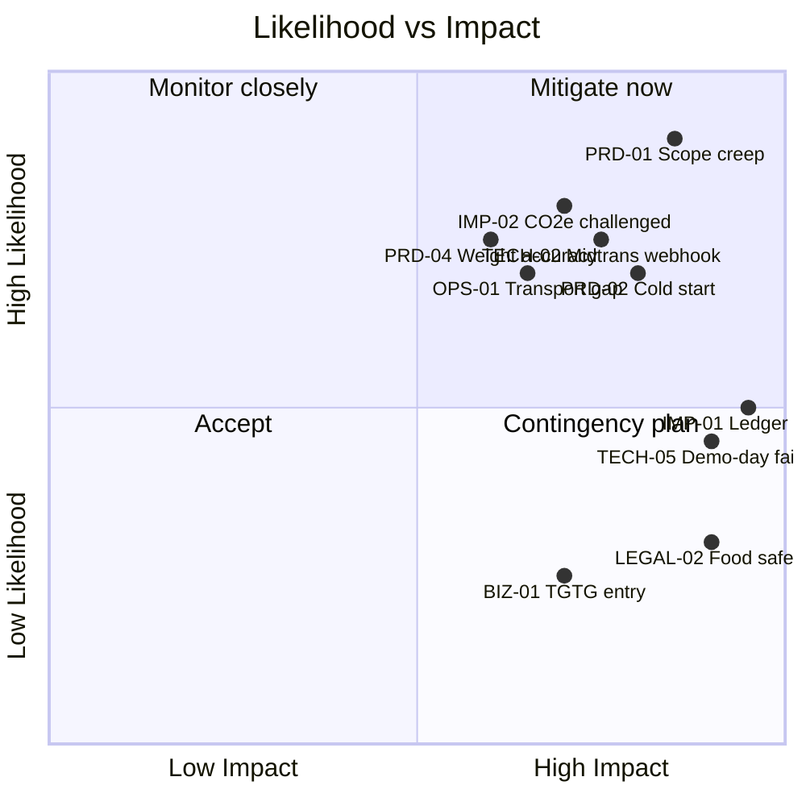

# Risk Register — Cirquo

**Document type:** Risk management  
**Status:** Draft v1.0  
**Last updated:** 2026-08-06  
**Review cadence:** Weekly during Phase 1, monthly thereafter

---

## 1. How to Read This Register

Each risk is scored on two axes.

| Likelihood | Meaning |
|---|---|
| 1 | Rare — would surprise us |
| 2 | Unlikely — possible but not expected |
| 3 | Possible — even odds over the project horizon |
| 4 | Likely — expect it unless mitigated |
| 5 | Near certain — assume it will happen |

| Impact | Meaning |
|---|---|
| 1 | Negligible — absorbed without changing plans |
| 2 | Minor — a day of rework |
| 3 | Moderate — a milestone slips |
| 4 | Major — MVP scope must be cut |
| 5 | Severe — project fails or is disqualified |

**Score = Likelihood × Impact.** Bands: 🔴 Critical (15–25) · 🟠 High (9–14) · 🟡 Medium (4–8) · 🟢 Low (1–3)

---

## 2. Risk Heat Map

---

## 3. Technical Risks

| ID | Risk | L | I | Score | Mitigation | Contingency |
|---|---|:-:|:-:|:-:|---|---|
| TECH-01 | **Convex vendor lock-in.** Business logic written as Convex functions is not portable. | 4 | 3 | 🟠 12 | Keep pure logic (pricing, routing, impact math) in framework-agnostic `src/lib` modules that Convex functions merely call. Document the migration trigger in [DATABASE.md](../domain/DATABASE.md). | Accept lock-in for MVP; a rewrite is only justified post-revenue. |
| TECH-02 | **Midtrans Sandbox → Convex webhook fails.** Payment status never reaches the backend, orders hang in `reserved`. | 3 | 5 | 🔴 15 | Prototype the webhook on day 1 of M3, in isolation. Verify signature handling. Add a client-side status poll as a redundant path. | Manual "mark as paid" admin action for the demo; document as known limitation. |
| TECH-03 | **Mapbox free-tier quota exceeded** (50k map loads/month) during demo traffic. | 2 | 3 | 🟡 6 | Cache map instances, avoid remounting on navigation, use static markers rather than repeated tile fetches. Monitor usage. | Fall back to Leaflet + OpenStreetMap; the discovery UX degrades but does not break. |
| TECH-04 | **Ledger write fails after the primary mutation succeeds**, producing state without a corresponding event. | 3 | 5 | 🔴 15 | Write the ledger event inside the same Convex mutation as the state change — Convex mutations are transactional, so both commit or neither does. Never write the ledger from a separate call. | Reconciliation job that detects items whose status has no matching terminal event. |
| TECH-05 | **Capacitor Android build breaks near demo day.** | 3 | 4 | 🟠 12 | Build and install the APK at the end of every milestone, not once at M8. Keep a signed, working APK archived. | Present the responsive web app on a phone browser; the codebase is identical. |
| TECH-06 | **Timezone bugs (WIB vs UTC) corrupt pickup windows,** causing premature expiry or items that never expire. | 4 | 4 | 🔴 16 | Store all timestamps as epoch milliseconds (UTC) in Convex — already the schema convention. Convert to WIB only at render time. Never construct dates from local-time strings server-side. | Manual expiry override in admin tooling. |
| TECH-07 | **Geolocation permission denied** on Android or desktop, breaking map-first discovery. | 4 | 3 | 🟠 12 | Design a defined fallback: default the map to Semarang city centre and offer manual location entry. Never block the app on permission. | List view sorted by merchant name works without coordinates. |
| TECH-08 | **No automated tests → regressions under time pressure.** | 5 | 3 | 🔴 15 | Unit-test only the three pure functions where correctness is non-negotiable: pricing, routing eligibility, impact aggregation. Skip UI tests. Maintain a written manual smoke checklist run before every demo. | Freeze the codebase 48h before submission; only bug fixes after freeze. |
| TECH-09 | **Realtime subscription cost/performance at scale.** | 2 | 2 | 🟡 4 | Scope reactive queries narrowly (by merchant, by user) rather than subscribing to whole tables. | Poll-based refresh for admin dashboards. |
| TECH-10 | **Convex free-tier limits hit during judging.** | 2 | 4 | 🟡 8 | Monitor function-call volume; the demo dataset is small. | Upgrade to a paid tier — cost is trivial relative to the stakes. |

---

## 4. Product Risks

| ID | Risk | L | I | Score | Mitigation | Contingency |
|---|---|:-:|:-:|:-:|---|---|
| PRD-01 | **Scope creep.** A 2–3 person team is building four role-specific applications plus a ledger, pricing engine, routing engine, payments, and maps. | 5 | 5 | 🔴 25 | Feature freeze after M2. Reject any addition not tied to a PRD requirement ID. Follow the MoSCoW order in [PRD.md](../product/PRD.md) §6 strictly — finish all M items before any S item. | Cut S and C priority items entirely. A complete M-only flow beats a half-built superset. |
| PRD-02 | **Cold start — empty marketplace.** No merchants means no consumers, and vice versa. | 4 | 4 | 🔴 16 | Seed 15–25 pilot merchants before opening consumer registration. See [BUSINESS.md](BUSINESS.md) §4. For the demo, ship a reproducible seed script. | Demo with seeded data, clearly labelled as pilot data. |
| PRD-03 | **Low rescue rate — items expire unclaimed.** | 3 | 3 | 🟠 9 | Dynamic Rescue Pricing escalates discounts as the window closes. Proximity notifications. Realistic pickup windows set by merchants. | This is not a failure state — unclaimed items route to processors. That is the product's entire point. |
| PRD-04 | **Merchant self-reported weights are inaccurate,** skewing every impact number. | 4 | 4 | 🔴 16 | Plausible-range validation per category. Clear input guidance ("estimate the total weight of the bag"). Label all impact figures as *estimates* in the UI. Processor-logged intake weight is treated as more authoritative than merchant-declared weight. | Reconcile merchant estimate against processor-measured intake and surface the variance in admin reporting. |
| PRD-05 | **Consumer no-show after payment.** | 4 | 2 | 🟡 8 | Pickup reminder notification. Grace-period cancellation with refund. Track no-show rate per consumer. | Unclaimed paid items still route to processors — material is recovered even when the transaction fails. |
| PRD-06 | **Processor capacity mismatch** — items routed to a processor that cannot accept them. | 3 | 3 | 🟠 9 | Processor-declared accepted material types and capacity are inputs to [Circular Routing](../impact/ALGORITHM.md). Decline returns the item to the pool. | Admin manual re-route (ADM-06). |
| PRD-07 | **Four dashboards is too much surface area** for the timeline. | 4 | 3 | 🟠 12 | Build one shared impact-aggregation query and parameterize it by scope (user / merchant / processor / platform). Do not build four separate pipelines. | Ship Merchant + Admin dashboards fully; Consumer and Processor get a reduced metric set. |

---

## 5. Business Risks

| ID | Risk | L | I | Score | Mitigation | Contingency |
|---|---|:-:|:-:|:-:|---|---|
| BIZ-01 | **Too Good To Go enters Indonesia.** | 2 | 4 | 🟡 8 | Compete on what they do not do: processor routing and material flow tracking. Build the ledger data moat and processor relationships early. | Position as the circular-infrastructure layer; partnership is not unthinkable. |
| BIZ-02 | **Judges perceive the concept as derivative** of existing surplus-food marketplaces (Originality is 15% of the preliminary score). | 4 | 4 | 🔴 16 | Lead every communication with Material Flow Orchestration, not the marketplace. The demo's centrepiece is circular routing, not browsing. Never open with "it's like Too Good To Go." | Emphasize the Semarang-specific integration with existing BSF/TPST infrastructure — that is genuinely local and not replicable by a foreign entrant. |
| BIZ-03 | **Merchants churn after novelty wears off.** | 3 | 3 | 🟠 9 | Retention hook is the impact report, not the discount. Make monthly recovery and circularity figures visible and exportable. | Merchant success outreach; identify and fix the friction causing churn. |
| BIZ-04 | **Merchants refuse to pay commission** post-pilot. | 3 | 3 | 🟠 9 | 12% is deliberately below food-delivery norms because merchants are recovering a loss, not a margin. Introduce fees only after demonstrated value. | Shift monetization weight to the subscription and reporting products. |
| BIZ-05 | **Single-city dependency.** Semarang-specific failure kills the project. | 2 | 4 | 🟡 8 | Avoid hardcoded city logic in the data model from day one — a non-negotiable NFR in [PRD.md](../product/PRD.md) §7. | Expand to Yogyakarta or Surabaya using the same codebase. |
| BIZ-06 | **No funding runway post-competition.** | 3 | 3 | 🟠 9 | Infrastructure costs are near zero at pilot scale (free tiers). Competition winnings and grants extend runway. | Operate as a volunteer/student project until commercial traction. |

---

## 6. Operational Risks

| ID | Risk | L | I | Score | Mitigation | Contingency |
|---|---|:-:|:-:|:-:|---|---|
| OPS-01 | **Merchant→processor transport is unsolved.** The MVP tracks the hand-off but nobody moves the material. | 4 | 4 | 🔴 16 | Be explicit that Cirquo coordinates and tracks; it does not dispatch. Pilot processors already collect from TPST-style sources, so an existing route can be reused. State this openly in Q&A rather than being caught by it. | Merchant delivers to the processor directly, or the processor's existing collection round is scheduled via the platform. |
| OPS-02 | **Processor facility downtime** stalls the routed queue. | 3 | 3 | 🟠 9 | Route to multiple eligible processors ranked by fit; a decline reassigns automatically. | Admin manual re-route; items held in `recovery_pending` with visible ageing. |
| OPS-03 | **Food safety incident** traced to a Rescue Item. | 2 | 5 | 🟠 10 | Merchant declares the pickup window and dietary attributes; the platform displays near-expiry consumption guidance prominently. Cirquo never handles or stores food. Terms place food-safety responsibility on the merchant, consistent with existing food-business obligations. | Immediate merchant suspension, ledger-based traceability for investigation, transparent public communication. |
| OPS-04 | **Dispute volume overwhelms a tiny admin team.** | 3 | 3 | 🟠 9 | The pickup code makes most disputes objectively resolvable — either the code was verified or it was not. Automate the obvious cases. | Triage by severity; SLA only on payment-affecting disputes. |
| OPS-05 | **Verification bottleneck** — merchants and processors wait for manual approval. | 3 | 2 | 🟡 6 | Auto-approve merchants into a limited-trust state pending full verification; require verification only for processors, who handle bulk material. | Batch verification sessions. |

---

## 7. Legal & Compliance Risks

| ID | Risk | L | I | Score | Mitigation | Contingency |
|---|---|:-:|:-:|:-:|---|---|
| LEGAL-01 | **UU PDP (Law 27/2022) non-compliance** on personal data handling. | 3 | 4 | 🟠 12 | Collect the minimum viable data set. Explicit consent at registration. Documented retention policy. No sale of personal data. See [SECURITY.md](../security/SECURITY.md). | Data deletion on request; privacy policy published before public launch. |
| LEGAL-02 | **Food safety liability** for near-expiry food sold through the platform. | 3 | 5 | 🔴 15 | Cirquo is an intermediary, not a food handler. Merchants retain their existing legal food-safety obligations. Mandatory near-expiry disclaimer at listing detail and checkout. | Terms of service; merchant indemnification; incident response process. |
| LEGAL-03 | **Merchant mislabels dietary or halal attributes.** | 3 | 4 | 🟠 12 | Frame the feature as *dietary preference filtering based on merchant-declared attributes*, never as an allergy or halal guarantee. This wording distinction is deliberate and must appear in the UI. | Report mechanism; repeated mislabelling triggers suspension. |
| LEGAL-04 | **Payment/financial regulation** — holding customer funds without a licence. | 2 | 5 | 🟠 10 | Cirquo never holds funds. Midtrans is the payment processor and settles to merchants. Cirquo records the transaction; it does not custody money. | Escrow-free design is already the plan; consult counsel before any change. |
| LEGAL-05 | **Competition rule violation** (originality, attribution, licensing of dependencies). | 2 | 5 | 🟠 10 | Original codebase, permissive open-source dependencies only, all data sources cited. | Documented attribution in README and proposal. |

---

## 8. Impact-Integrity Risks

These are the risks most likely to be probed during Q&A, where 20% of the final score is decided.

| ID | Risk | L | I | Score | Mitigation |
|---|---|:-:|:-:|:-:|---|
| IMP-01 | **Ledger gaps** — a state change occurs without a corresponding event, silently corrupting every impact figure. | 3 | 5 | 🔴 15 | Ledger write is inside the same transactional mutation as the state change. A completeness check (every terminal-status item has a terminal event) runs as an admin query. |
| IMP-02 | **CO2e methodology challenged** by a judge. | 4 | 4 | 🔴 16 | Publish the emission factor, its source, and its version in [IMPACT.md](../impact/IMPACT.md). Label every CO2e figure as an estimate in the UI. Never present CO2e as the headline — lead with directly measured kilograms. |
| IMP-03 | **Greenwashing accusation** from overclaiming. | 3 | 5 | 🔴 15 | Never state "zero waste" or "100% closed-loop." Always report residual weight alongside rescued and recovered. A circularity rate of 93% with a visible 7% residual is the credible presentation. |
| IMP-04 | **Unverifiable weights** undermine the whole impact narrative. | 4 | 3 | 🟠 12 | Distinguish *declared* (merchant estimate) from *measured* (processor intake) weight in the data model. Show variance. Do not present estimates as measurements. |

### Prepared Q&A Defences

| Likely question | Answer |
|---|---|
| *"How do you guarantee 100% of surplus is recovered?"* | We do not, and we do not claim to. We report a circularity rate. In our demo dataset it is 93%, with the remaining 7% recorded as residual. The point of the Material Flow Ledger is that we can tell you exactly what happened to the 7%. |
| *"Isn't this just Too Good To Go?"* | Too Good To Go stops when a consumer buys the bag. It has no answer for what happens to the food nobody buys. Our marketplace is the entry point; the product is what happens after — routing unclaimed material to organic processors and recording the outcome. |
| *"How do you calculate CO2e?"* | We multiply diverted mass by a published emission factor, versioned in our documentation. It is an estimate, labelled as such throughout the UI. Our primary metrics are directly measured kilograms, not derived carbon figures. |
| *"How do you know the weights are real?"* | Merchant weights are declared estimates. Processor intake weights are measured at the facility. We store both, and we surface the variance. We do not present an estimate as a measurement. |
| *"Where is the AI?"* | There is none, deliberately. Dynamic Rescue Pricing is a transparent rule-based formula over time-to-expiry, remaining stock, and demand. We can show you the exact function. We would rather ship something explainable than label a formula as AI. |
| *"Who transports food to the processor?"* | Not us. In the MVP, transport is arranged between merchant and processor — many processors already run collection rounds. Cirquo coordinates and records the hand-off. Dispatch is explicitly out of scope, and we would rather state that than pretend we solved logistics. |

---

## 9. Top 10 Risks by Score

| Rank | ID | Risk | Score |
|---:|---|---|:-:|
| 1 | PRD-01 | Scope creep with a 2–3 person team | 🔴 25 |
| 2 | TECH-06 | Timezone bugs corrupting pickup windows | 🔴 16 |
| 3 | PRD-02 | Cold start / empty marketplace | 🔴 16 |
| 4 | PRD-04 | Inaccurate self-reported weights | 🔴 16 |
| 5 | BIZ-02 | Perceived as derivative (Originality score) | 🔴 16 |
| 6 | OPS-01 | Merchant→processor transport unsolved | 🔴 16 |
| 7 | IMP-02 | CO2e methodology challenged | 🔴 16 |
| 8 | TECH-02 | Midtrans webhook failure | 🔴 15 |
| 9 | TECH-04 | Ledger write failure / partial state | 🔴 15 |
| 10 | TECH-08 | No automated tests | 🔴 15 |

**Reading of this table:** The dominant risks are not technical. They are **scope discipline**, **impact credibility**, and **narrative positioning**. The engineering risks are individually manageable; the failure mode that actually loses this competition is building too much and finishing nothing.

---

## 10. Risks We Consciously Accept

| Risk | Why we accept it |
|---|---|
| Convex vendor lock-in | The velocity gain over the competition timeline outweighs the eventual migration cost. Pure logic stays portable. |
| No automated test suite | With a 2–3 person team and a fixed deadline, manual smoke testing plus targeted unit tests on pricing/routing/impact math is the correct allocation of effort. |
| Manual merchant→processor transport | Solving logistics would consume the entire timeline and is not what the platform is for. |
| Estimated rather than measured CO2e | Direct measurement is impossible at this scale. Transparency about the estimate is the mitigation. |
| Single-city launch | Density beats breadth at this stage. Multi-city is a Phase 4 concern. |
| Midtrans Sandbox only | Production payment credentials add compliance overhead with zero incremental demo value. |
| No offline mode | Target users have 4G coverage. Offline sync is disproportionate complexity. |

---

## 11. Early Warning Indicators

Signals that should force a plan change rather than more effort.

| Indicator | Threshold | Response |
|---|---|---|
| Milestone slip | Any milestone >3 days late | Cut all S/C priority items from remaining milestones |
| End-to-end flow incomplete | Not working by **20 August 2026** | Freeze all new features; fix the critical path only |
| Merchant pilot recruitment | <10 committed merchants by Phase 2 | Re-examine the value proposition before scaling spend |
| Rescue completion rate | <40% sustained | Investigate pricing curve and pickup-window realism |
| Processor acceptance rate | <50% of routed items | Routing matcher is wrong — fix material-type filtering |
| Ledger completeness | <100% | Halt feature work. This invalidates everything downstream |
| Circularity rate | <70% | The core claim is not supported; reassess before publicizing |

---

## Related Documents

- [ROADMAP.md](ROADMAP.md) — Milestones and schedule this register protects
- [BUSINESS.md](BUSINESS.md) — Unit economics and acquisition assumptions
- [PRD.md](../product/PRD.md) — Requirement IDs and MoSCoW priorities
- [SECURITY.md](../security/SECURITY.md) — Threat model and compliance detail
- [IMPACT.md](../impact/IMPACT.md) — CO2e methodology, assumptions, limitations
- [MATERIAL_LEDGER.md](../impact/MATERIAL_LEDGER.md) — Ledger integrity guarantees
- [TESTING.md](../engineering/TESTING.md) — Manual smoke checklist referenced in TECH-08

---

**Built for DSDC ANFORCOM 2026**  
**Platform:** Cirquo — Closing the Loop, Saving Every Meal
