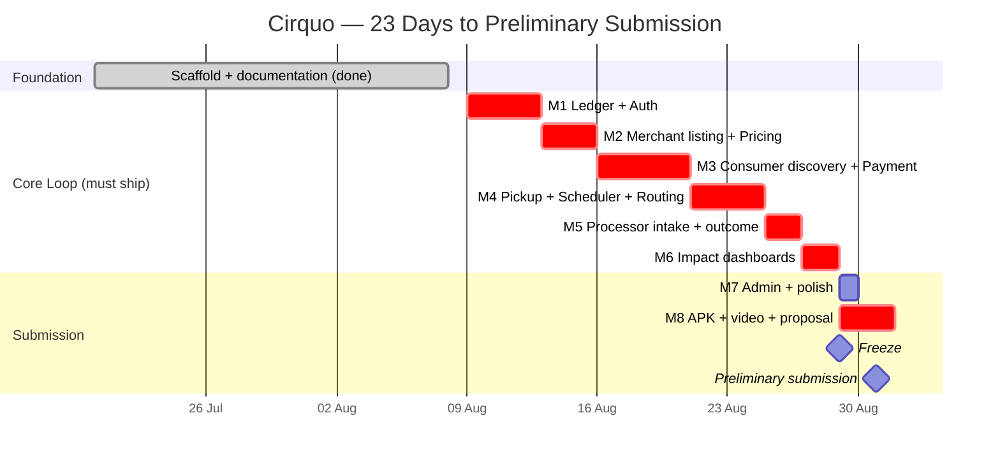

# Roadmap — Cirquo

**Document type:** Delivery plan  
**Status:** Delivery plan — source status tracked separately
**Last updated:** 2026-08-29
**Competition:** DSDC ANFORCOM 2026  
**Preliminary deadline:** 31 August 2026

> **How to read this:** This is a competition delivery plan, not a startup plan. Phase 1 is the only committed scope and it is sized against a hard external deadline. Everything after Phase 1 exists to answer a judge's "what next?" question, not as a promise. Priorities inside Phase 1 follow the MoSCoW ordering in [PRD.md](../product/PRD.md) §6.

> **Current source boundary — 2026-08-29.** M1 and M2 source is available;
> M3 source awaits Sandbox/mobile UAT; M4 dan M5 source tersedia tetapi masih
> membutuhkan UAT deployment/browser. M6 source tersedia; M7–M8 remain target
> work. The dates and
> estimates below are the original planning baseline, not a live burndown. See
> [IMPLEMENTATION_STATUS.md](../project/IMPLEMENTATION_STATUS.md).

---

## 1. What Actually Wins This Competition

Every scoping decision below is derived from the marking scheme, not from what would make the best product.

### Preliminary round (submission by 31 August 2026)

| Criterion | Weight | What Cirquo must show |
|---|---:|---|
| Impact Projection | 20% | Defensible circularity numbers derived from the ledger, not asserted |
| Progress & Implementation | 20% | Real source code with a working flow — expected at 50–75% progress |
| Theme / Subtheme fit | 15% | Circular economy in a real Semarang context |
| Originality | 15% | Material Flow Orchestration, not "another surplus marketplace" |
| Proposal | 10% | Written submission |
| Video | 10% | 3–7 minutes, all team members visible |
| Methodology | 10% | Why these algorithms, why these emission factors |

### Final round (if we advance)

| Criterion | Weight | Implication |
|---|---:|---|
| Presentation | 30% | Rehearsal is a deliverable, not an afterthought |
| Implementation | 25% | **Judges use the app themselves.** Every visible button must work |
| Q&A | 20% | Every claim must survive a follow-up question |
| Exhibition | 15% | Booth demo runs repeatedly, unattended-ish, without resetting |
| Code | 10% | Readable, consistent, no dead scaffolding |

**Three consequences that drive this entire roadmap:**

1. **75% of the final score is defending the system, not building it.** A smaller system we can explain completely beats a larger one we cannot. Scope is a scoring decision.
2. **Judges will operate the app as a merchant.** A half-wired screen costs more than a missing screen. Remove what does not work.
3. **Originality is 15% and it is our weakest criterion.** Surplus marketplaces are an established category. The only defensible answer is Circular Routing plus the Material Flow Ledger — so those ship before polish, always.

---

## 2. Timeline

**Planning date 8 August 2026. Preliminary deadline 31 August 2026. 23 calendar days.**

| Checkpoint | Date | Gate |
|---|---|---|
| Ledger + auth working | 12 Aug | If M1 slips past 14 Aug, cut all S-priority items immediately |
| Merchant can list | 15 Aug | — |
| Consumer can reserve and pay | 20 Aug | Highest-risk integration (Midtrans webhook) resolved |
| **End-to-end loop closes** | **26 Aug** | **Hard gate. If the loop is not closed, stop all feature work and fix only the critical path** |
| Dashboards ledger-derived | 28 Aug | No hardcoded numbers remain |
| Code freeze | 29 Aug | Bug fixes only after this point |
| Submission | 31 Aug | — |

**M7 and M8 overlap deliberately.** Admin polish runs alongside video recording and proposal writing because they need different people, and because M7 is the first thing cut if M1–M6 run long. Only the ledger inspector inside M7 is non-negotiable.

**The plan has almost no slack across 23 days.** That is not a buffer, it is a warning. The response to slippage is the descoping ladder in [USER_STORIES.md](../spec/USER_STORIES.md) §12, not longer hours.

> **Revised from v1.0.** The previous Gantt allocated 36 days of milestone work against a 23-day calendar and was arithmetically impossible. M2, M5, M6 and M7 have been compressed and the reserve moved to M3, which carries the Midtrans integration risk.

---

## 3. Phase 0 — Foundation ✅ (Historical baseline)

> This section records the original scaffold milestone; it is not the current
> implementation snapshot. For the current state, see the status note above and
> inspect source/UAT evidence.

The repository scaffold exists and is type-safe. This phase deliberately built **structure, not business logic**.

| Area | State |
|---|---|
| Build tooling | Vite 8, Bun, TypeScript, oxlint, Tailwind CSS v4 |
| Routing | React Router v7, four role-scoped route groups + fallback |
| Layouts | `ConsumerLayout` (bottom nav mobile), `RoleShell` for Merchant/Processor/Admin (sidebar + sheet) |
| UI primitives | 17 shadcn/ui components (button, card, form, dialog, sheet, table, tabs, select, progress, etc.) |
| Custom components | `PageHeader`, `SummaryCard`, `RoleShell` |
| Convex schema | Original 5-table scaffold; now expanded to 10 tables |
| Convex functions | Original 6-query scaffold; now expanded with guarded auth, Merchant, Consumer, and payment functions |
| Pages | 9 placeholder pages rendering mock data from `src/constants/mock-data.ts` |
| Mobile | Capacitor Android configured (`com.cirquo.app`), PWA manifest + service worker |
| Theming | OKLCH design tokens, Geist Variable font, light/dark variables defined |
| Documentation | 43 documents across 11 categories |

### What did not exist in the initial scaffold

- ❌ No Material Flow Ledger table
- ❌ No mutations — nothing can be written to the database
- ❌ No authentication of any kind
- ❌ No Mapbox integration
- ❌ No Midtrans integration
- ❌ No scheduled functions
- ❌ No impact calculation
- ❌ All dashboard numbers are hardcoded placeholders

> **Status note — 2026-08-29:** this roadmap is a delivery plan, not the live
> implementation tracker. M1–M5 source sekarang tersedia. Use `convex/`, the
> route table, and UAT
> evidence to assess completion.

---

## 4. Phase 1 — Competition MVP (Committed)

**Goal:** A judge sits down with a laptop, plays all four roles, and watches one kilogram of surplus food travel from listing to a terminal outcome — with every step visible in the Material Flow Ledger and every dashboard number derived from it.

### Sequencing principle

Build the **ledger first**, then build features that write to it. Retrofitting the ledger into existing mutations is the most likely source of missing events, and a ledger with gaps invalidates every impact number the product claims — which is 20% of the preliminary score.

```mermaid
flowchart LR
    M1[M1 Ledger + Auth] --> M2[M2 Merchant listing<br/>+ Dynamic Pricing]
    M2 --> M3[M3 Consumer discovery<br/>+ Reservation + Payment]
    M3 --> M4[M4 Pickup + Scheduler<br/>+ Circular Routing]
    M4 --> M5[M5 Processor intake<br/>+ outcome]
    M5 --> M6[M6 Impact dashboards]
    M6 --> M7[M7 Admin tools]
    M7 --> M8[M8 APK + demo assets]

    style M1 fill:#065f46,color:#fff
    style M4 fill:#065f46,color:#fff
    style M6 fill:#065f46,color:#fff
```

The three highlighted milestones are the ones that earn marks. M1 makes impact numbers trustworthy, M4 is the originality claim, M6 is where the claim becomes visible. If anything is cut, it is cut from M2, M3, M5 or M7 — never from these three.

---

### M1 — Material Flow Ledger + Authentication

**9–12 Aug · 4 days · Scoring value: Impact Projection 20%, Implementation 20%**

**Exit criteria:** A user can register with a role, log in, stay logged in across reload, and every write path has a ledger helper available.

| Deliverable | Detail | Ref |
|---|---|---|
| `materialFlowLedger` table | Append-only, indexed by rescue item and timestamp | [MATERIAL_LEDGER.md](../impact/MATERIAL_LEDGER.md) |
| `recordLedgerEvent` helper | Single internal function all mutations must call | [BACKEND.md](../architecture/BACKEND.md) |
| Auth: register/login/logout | Session persisted, survives Capacitor restart | [AUTH.md](../security/AUTH.md) |
| Role selection at signup | Consumer / Merchant / Processor; Admin provisioned manually | AUTH-01, AUTH-02 |
| Business profile capture | Merchant & Processor: name, address, lat/lng, business type | AUTH-03 |
| `requireRole()` guard | Server-side authorization for every mutation | [PERMISSIONS.md](../security/PERMISSIONS.md) |
| Route protection | Client-side redirect for unauthenticated/wrong-role access | [FRONTEND.md](../architecture/FRONTEND.md) |

**Risk:** Auth is the classic time sink. **Timebox it to 2 of the 4 days.** If a full implementation threatens the schedule, ship email + password with a session token, skip password reset entirely, and document the hardening plan. Nobody scores password reset. Everybody notices a broken login during a live demo.

---

### M2 — Merchant Listing + Dynamic Rescue Pricing

**13–15 Aug · 3 days · Scoring value: Methodology 10%, Originality 15%**

**Exit criteria:** A verified merchant creates a Rescue Item, receives a suggested price, publishes it, and a `LISTED` ledger event exists.

| Deliverable | Detail | Ref |
|---|---|---|
| `createSurplusItem` mutation | Full field set incl. weight, quantity, pickup window | MER-01 |
| Dynamic Rescue Pricing function | Suggests discount from time-to-expiry, stock, floor price | [ALGORITHM.md](../impact/ALGORITHM.md) |
| Merchant override of suggestion | Engine advises; merchant decides | MER-02 |
| Floor price enforcement | Server-side; never suggest below merchant floor | PRI-03 |
| Edit/cancel before reservation | Blocked once reserved | MER-03 |
| Processing-only flag | Skips marketplace, goes straight to routing | MER-07 |
| Wire `CreateSurplusPage` to Convex | Replace the current toast-only submit handler | — |
| Merchant surplus list (real data) | Replace mock-data source | — |

**Demo note:** Show the price breakdown in the UI — base discount, urgency, stock pressure. A judge asking "how did you get this price?" should get the answer on screen, not in a slide. This is the Methodology mark.

---

### M3 — Consumer Discovery, Reservation, Payment

**16–20 Aug · 5 days · Highest-risk milestone**

**Exit criteria:** A consumer finds a nearby item on a real map, reserves it, completes a Midtrans Sandbox payment, and receives a pickup code.

| Deliverable | Detail | Ref |
|---|---|---|
| Mapbox integration | Map render, merchant markers, clustering | MKT-01 |
| Geolocation | Browser + Capacitor permission handling, graceful denial | CON-01 |
| List view with filters | Distance, price, category, pickup window | CON-02, MKT-02 |
| Ranking | Distance × discount × urgency blend | MKT-03, ALGORITHM.md |
| Listing detail + reserve | Locks quantity and price | CON-03 |
| Midtrans Sandbox checkout | Snap token via Convex action | [API_CONSUMER.md](../api/API_CONSUMER.md) |
| Payment webhook handler | Verifies signature, updates order status | PAY-01, PAY-02 |
| Manual pickup-code generation | Consumer-presentable | CON-05 |
| Order history | Active + past, live status | CON-06 |

**Risk — this milestone carries the schedule.** Midtrans webhook delivery into a Convex `httpAction` is the single highest-uncertainty integration in the MVP, and it sits on the critical path.

**Mitigation, in order:**
1. Prototype the webhook in isolation on **day 1 of M3**, before any UI work.
2. If it is not working by **day 3**, record a blocker and fix the verified webhook path. A client-side payment confirmation is not an acceptable fallback because the browser is never the authority for a paid order.
3. Mapbox and payment are independent — parallelise across two developers if the team has three.

---

### M4 — Pickup Confirmation, Scheduler, Circular Routing

**21–24 Aug · 4 days · Scoring value: Originality 15% — the differentiator**

**Exit criteria:** Merchant confirms a pickup and the consumer's screen updates live; an unclaimed item automatically becomes a routed recovery batch after its window closes.

| Deliverable | Detail | Ref |
|---|---|---|
| Pickup confirmation | Merchant verifies code → order `picked_up` → ledger `RESCUED` | MER-04 |
| Realtime status | Convex reactive query drives consumer UI | [REALTIME.md](../architecture/REALTIME.md) |
| Expiry cron | Scheduled function detects closed windows | [SCHEDULER.md](../architecture/SCHEDULER.md) |
| Circular Routing matcher | Material type + distance + processor capacity | ALGORITHM.md |
| Recovery batch creation | Item → `recoveryBatches` with `pending` status | MER-05 |
| Ledger `ROUTED` event | Written at routing time | IMP-01 |
| Auto-refund on failure | Unfulfilled paid orders refunded | PAY-03 |

> **This milestone is the entire Originality claim.** Every surplus marketplace stops at "nobody bought it." Cirquo continues. If M4 does not ship, Cirquo is a Too Good To Go clone and Originality (15%) collapses.

**Two demo-critical requirements:**
- The routing transition must be **visible in the UI**, not merely correct in the database. A judge cannot award marks for a database row.
- Add an **admin trigger to force the expiry sweep**. Waiting for a cron interval during a live demo is unacceptable, and shortening pickup windows to fake urgency looks contrived.

---

### M5 — Processor Intake and Outcome

**25–26 Aug · 2 days**

**Exit criteria:** A processor sees a routed batch, accepts it, logs intake weight and material type, then logs output type and residual weight.

| Deliverable | Detail | Ref |
|---|---|---|
| Routed queue | Batches matched to this processor | PRC-01 |
| Accept / decline | Decline returns item to routing pool | PRC-02 |
| Intake log | Weight received, material type | PRC-03 |
| Outcome log | Output type (compost/BSF larvae/biogas/feed), output qty, residual qty | PRC-04 |
| Ledger events | `INTAKE_ACCEPTED`, `PROCESSED` | IMP-01 |
| Processor profile | Accepted material types + capacity, used by routing | PRC-06 |

**Why only 2 days:** these are forms writing to tables that already exist, using guards and ledger helpers already built in M1. The complexity was front-loaded. The one thing that must be right is the `residual ≤ accepted` validation, because that is where the honest residual number originates.

---

### M6 — Impact Dashboards

**27–28 Aug · 2 days · Scoring value: Impact Projection 20%**

**Exit criteria:** Every dashboard number is derived from ledger queries. Zero hardcoded totals remain in the codebase.

| Deliverable | Detail | Ref |
|---|---|---|
| Impact aggregation queries | kg rescued, kg recovered, kg residual, circularity rate | [IMPACT.md](../impact/IMPACT.md) |
| CO2e estimation | Versioned emission-factor method, labelled as estimate | IMP-04 |
| Consumer dashboard | kg rescued, CO2e avoided, money saved | CON-07 |
| Merchant dashboard | Listed / rescued / recovered / residual, revenue recovered | MER-06 |
| Processor dashboard | Intake volume, output by type, residual rate | PRC-05 |
| Admin dashboard | Platform-wide totals, active actors, circularity rate | ADM-04 |
| Remove mock data | Delete `src/constants/mock-data.ts` usage from all pages | — |

**Definition of done:** `grep` the codebase for hardcoded impact figures (`"128 kg"`, `"87%"`, `"1,2 ton"`) and confirm none remain in rendered output. A hardcoded number that a judge discovers destroys the credibility of every other number on the screen — and Impact Projection is 20%.

**Build one aggregation function parameterised by scope, not four dashboards.** All four views are the same `summariseLedger()` call with a different filter. Four pipelines is four times the surface area for the numbers to disagree with each other.

---

### M7 — Admin Tools and Polish

**29 Aug · 1 day · First to be cut**

**Exit criteria:** An admin can verify a merchant, moderate a listing, and inspect the full ledger for any item.

| Deliverable | Detail | Priority | Ref |
|---|---|---|---|
| Merchant/Processor verification | Approve, reject, suspend | **Must** | ADM-01, AUTH-04 |
| Ledger inspector | Full audit trail per Rescue Item | **Must** | ADM-03 |
| Loading & error states | Every async surface | **Must** | [DESIGN.md](../design/DESIGN.md) |
| Empty states | Every list view | **Must** | [UI_GUIDE.md](../design/UI_GUIDE.md) |
| Listing moderation | Remove violating listings | Should | ADM-02 |
| Notifications | Reservation confirmed, pickup reminder, expiry warning | Should | NOT-01…NOT-04 |
| Dispute resolution | No-show reports both directions | **Cut if behind** | ADM-05 |
| Manual re-route | Admin forces a routing decision | **Cut if behind** | ADM-06 |

**The ledger inspector is not optional despite sitting in the lowest-priority milestone.** It is the screen that proves the central claim. When a judge asks "how do you know?", this is the answer — one item, every event, timestamped, in order. Build it even if everything else in M7 is cut.

---

### M8 — Submission Package

**29–31 Aug · 3 days · Scoring value: Video 10%, Proposal 10%, Code 10%**

**Exit criteria:** APK installs and runs the full flow; demo video recorded; submission package complete.

| Deliverable | Detail |
|---|---|
| Code freeze | **29 Aug.** Bug fixes only after this point |
| Capacitor Android build | `bun run android:sync` → working APK |
| Mobile flow verification | Full circular flow tested on a physical device |
| Geolocation on Android | Permission prompt, denial fallback |
| Seed data script | Reproducible demo dataset, ~93% circularity with visible residual |
| Demo video (3–7 min) | All team members visible per competition rules. See §5 |
| Proposal document | Competition submission |
| Repository cleanup | README accurate, no dead code, no committed secrets, no unused scaffolding |

**Build the APK at the end of every milestone, not here.** Discovering a Capacitor build failure on 29 August with a frozen codebase is the avoidable disaster. Keep a known-good signed APK archived from M4 onward.

---

## 5. Demo Script (3–7 Minutes)

The final round weights Presentation 30%, Implementation 25%, Q&A 20%. The demo must show a **live system**, not a slideshow. Competition rules require all team members visible from start to finish.

| Time | Segment | What is shown |
|---|---|---|
| 0:00–0:30 | Problem, localised | Indonesian food loss & waste at 23–48 Mt/year (Bappenas); a Semarang bakery's daily surplus. Name the city and the actor |
| 0:30–1:15 | Consumer rescue | Open map → nearby Rescue Item → dynamic price with visible breakdown → reserve → Midtrans Sandbox → pickup code |
| 1:15–2:00 | Merchant fulfilment | Merchant confirms pickup code → order flips to `picked_up` live on the consumer screen, side by side |
| 2:00–3:00 | **Circular routing (the differentiator)** | Pickup window closes → unclaimed 8 kg auto-routed → processor queue → accept → log outcome |
| 3:00–4:00 | **Material Flow Ledger** | Open the audit trail for one item: every event, timestamped, immutable, in order |
| 4:00–4:45 | Impact | Dashboard: 12 kg rescued, 8 kg recovered, 1.5 kg residual, **circularity rate 93%** |
| 4:45–5:00 | Close | "We don't claim zero waste. We claim we know where every kilogram went." |

**The 2:00–4:00 window carries the Originality mark.** Do not compress it to make room for UI tours. Everything before it is context; everything after it is confirmation.

**Rules for the demo:**
- **Never show 100% circularity.** 93% is credible; 100% invites the one question that cannot be answered. Keep visible residual in the seed data.
- **No mocked interactions.** If a button does not work, remove it before recording. In the final round judges operate the app themselves — a dead control is worse than an absent one.
- **Two screens side by side** for the realtime moment. Realtime is invisible if you have to switch tabs to show it.
- **APK on a physical phone as backup** if the laptop fails.
- **Rehearse the reset.** Exhibition is 15% and the booth demo will run many times. Know how to return to a clean seed state in under a minute.

---

## 6. Q&A Preparation

Q&A is 20% of the final score. These are the questions that will be asked; each answer must be backed by something on screen.

| Question | Answer | Evidence to show |
|---|---|---|
| "How is this different from Too Good To Go?" | Their flow ends when nobody buys. Ours continues — unsold surplus is routed to an organic processor and the outcome is logged. The marketplace is the entry point; material flow orchestration is the product | Live M4 routing transition |
| "How do you guarantee 100% circularity?" | We do not, and we never claim it. We measure what share of surplus reached each recovery path. Our demo shows 93% with visible residual | Impact dashboard with residual |
| "Where is the AI?" | There is none, deliberately. Dynamic Rescue Pricing is a rule-based formula because it must be explainable and auditable. No transaction history exists to train a model responsibly | Price breakdown UI, [ALGORITHM.md](../impact/ALGORITHM.md) |
| "How do you know the weights are real?" | We do not measure them — merchants self-report and we label every figure as an estimate with plausible-range validation. The ledger guarantees the *chain*, not the scale accuracy | [IMPACT.md](../impact/IMPACT.md) limitations section |
| "Is your CO2e number credible?" | It is an estimate from a published emission factor, versioned so historical figures stay explainable if the factor changes. It is labelled as an estimate everywhere it appears | Versioned methodology |
| "What if the food makes someone ill?" | Merchants declare dietary attributes; we filter on those declarations. We provide dietary preference filtering, not allergen safety guarantees, and we say so in the UI | Food-safety disclaimer |
| "Do these processors exist in Semarang?" | Yes. TPST Gemah already receives organic waste from restaurants and shops and routes it to maggot farmers. We digitise an existing fragmented flow rather than inventing an ecosystem | Local-context slide |
| "What happens when a processor is full?" | Circular Routing matches on accepted material type, distance, and remaining capacity. If no processor matches, the item is recorded as residual — visibly, not silently | Routing logic + residual figure |

The pattern in every answer: **state the limit before the judge finds it.** A conceded limitation costs nothing; a discovered overclaim costs the criterion.

---

## 7. Phase 2 — Post-Competition Hardening (Q4 2026)

Everything below the competition line is **directional, not committed**. It exists to answer a judge's "what happens after the competition?" question with something credible, and to prove the architecture was not built as a throwaway demo. Do not let it pull effort from Phase 1.

**Goal:** Move from "works in a demo" to "survives real users."

| Workstream | Scope |
|---|---|
| Auth hardening | Password reset, rate limiting, session invalidation, audit logging |
| Payments | Midtrans production credentials, real refund flow, reconciliation, payout tracking |
| Reliability | Idempotent mutations, ledger write-failure recovery, retry semantics |
| Observability | Error tracking, function latency monitoring, alerting on failed routings |
| Accessibility | WCAG AA pass: contrast, focus order, screen reader labels, tap targets |
| Testing | Vitest for pricing/routing/impact math; Playwright for the four critical journeys |
| Pilot | 10–20 real Semarang merchants, 2–3 processors, closed consumer beta |
| Data validation | Plausible-range checks on self-reported weights |

**Phase 2 exit criteria:** 30 days of continuous operation with real transactions, zero ledger gaps, and a documented incident-response process.

---

## 8. Phase 3 — Commercial Launch (2027)

| Workstream | Scope |
|---|---|
| Monetization | Activate 12% commission; launch Rescue Pro tier ([BUSINESS.md](BUSINESS.md) §2) |
| Merchant self-serve | Onboarding without field visits |
| Processor network | Expand to 8–10 verified Semarang-area processors |
| Coverage | All Semarang districts |
| Reporting product | Exportable verified circularity reports (PDF/CSV) |
| Partnerships | Dinas Lingkungan Hidup, TPST operators, UMKM associations |
| Support ops | Dispute SLA, moderation queue, merchant success function |

---

## 9. Phase 4 — Multi-City (2027–2028)

| Workstream | Scope |
|---|---|
| City playbook | Repeatable launch sequence: map processors → recruit 20 merchants → seed → open consumers |
| Target cities | Yogyakarta, Surabaya, Bandung, Jakarta |
| Multi-tenancy | City-scoped data, admin, and reporting — no hardcoded city logic anywhere |
| Localization | English UI alongside Bahasa Indonesia |
| B2B pilot | Campus dining, hospital kitchens, hotel F&B |

**Migration trigger (documented, not scheduled):** Consider PostgreSQL only if one of these is true — Convex costs exceed roughly Rp15M/month, geospatial queries need PostGIS-grade capability, or a customer contract mandates data residency. Until then, migrating is overengineering. See [DATABASE.md](../domain/DATABASE.md).

---

## 10. Phase 5 — Platform & Regional (2029+)

Directional only.

- POS integrations (Moka, Qasir) for automatic surplus detection
- Public impact API for ESG platforms
- Predictive surplus forecasting for merchants
- Carbon-credit intermediation, contingent on methodology acceptance
- Regional expansion to Southeast Asian markets with comparable informal organic-processing ecosystems

---

## 11. Deferred Features

Features removed from MVP scope, with the reason and the earliest phase they could return.

| Feature | Deferred to | Reason |
|---|---|---|
| Peer-to-peer food swap | Phase 4+ | Liability, food safety, dispute complexity — solves a minor problem while creating major ones |
| Allergy-safety matching | Never as stated | We cannot guarantee allergen safety. Shipping only *dietary preference filtering* on merchant-declared attributes |
| AI demand forecasting | Phase 5 | Insufficient data. Rule-based Dynamic Rescue Pricing is explainable and defensible in Q&A; calling a formula "AI" invites the question "where is the AI?" |
| Fleet/logistics dispatch | Phase 4 | Cirquo tracks and coordinates; it does not move goods. Transport is off-platform in MVP |
| Route optimization | Phase 4 | Depends on dispatch |
| Multi-payment gateways | Phase 3 | Midtrans covers the Indonesian market; a second gateway adds surface area without demo value |
| Multi-currency / multi-country | Phase 5 | IDR only |
| Native Flutter/React Native apps | Not planned | Capacitor delivers one codebase to web + Android. A rewrite would consume the entire timeline |
| Loyalty / gamification | Phase 3 | Impact dashboard already provides intrinsic motivation |
| Computer-vision quality check | Phase 5 | High cost, unproven accuracy, not required for the core loop |
| Blockchain ledger | Speculative | The append-only Convex ledger is sufficient. Blockchain adds cost and complexity with no user-visible benefit today |

**Every row here is also a Q&A answer.** "Why didn't you build X?" has a documented reason, which reads as judgement rather than omission. Scope discipline is a defensible position when it is deliberate and written down.

---

## 12. Decision Log

| # | Decision | Rationale | Revisit when |
|---|---|---|---|
| D1 | Convex over PostgreSQL for MVP | Realtime, scheduler, and auth-adjacent primitives out of the box; no infra to manage | Cost or geospatial needs cross the thresholds in §9 |
| D2 | Mapbox over Leaflet | Better clustering and visual polish for a judged demo | If Mapbox free-tier limits are hit before revenue |
| D3 | Capacitor over native | One codebase → web + Android with a 2–3 person team | Only if a native-only capability becomes essential |
| D4 | Rule-based pricing, not ML | Explainable in Q&A; no training data exists | After 6+ months of transaction history |
| D5 | Ledger before features | Retrofitting audit trails reliably fails | Never — this is foundational |
| D6 | No commission during pilot | Removes the last objection during merchant acquisition | Phase 3 |
| D7 | QRIS as default payment method | Percentage fee preserves margin on small baskets; flat fees do not | If QRIS pricing changes materially |
| D8 | Ship four thin roles over one deep role | The circular loop needs all four actors to close. A polished merchant app that cannot demonstrate routing scores nothing on Originality | Never before the competition |
| D9 | Report ~93% circularity, never 100% | An overclaim fails under one Q&A question; a conceded 7% residual costs nothing | Never |

---

## 13. Open Questions

| # | Question | Owner | Needed by |
|---|---|---|---|
| Q1 | Who physically transports material from merchant to processor at scale? | Ops | Phase 3 |
| Q2 | Will Semarang processors accept mixed prepared food, or only specific material types? | Ops | Phase 1 (M5) |
| Q3 | What emission factor is most defensible for Indonesian food waste? | Impact | Phase 1 (M6) |
| Q4 | Does Midtrans Sandbox webhook delivery work reliably against Convex HTTP actions? | Backend | **Phase 1 (M3), day 1 — blocks the critical path** |
| Q5 | Is a municipal contract realistic in Semarang, and what is the procurement cycle? | Business | Phase 3 |
| Q6 | What is the actual acceptance rate of routed items? | Product | Phase 2 pilot |
| Q7 | Can we cite a named Semarang processor by agreement, or only as public context? | Business | M8 proposal |

---

## Related Documents

- [PRD.md](../product/PRD.md) — Requirement IDs referenced in milestones
- [USER_STORIES.md](../spec/USER_STORIES.md) — §12 velocity check and the descoping ladder
- [BUSINESS.md](BUSINESS.md) — Monetization model activated in Phase 3
- [RISKS.md](RISKS.md) — Risk register; PRD-01 scope creep is the top-scored risk
- [FEATURES.md](../spec/FEATURES.md) — Per-feature acceptance criteria and the MVP cut-line
- [MATERIAL_LEDGER.md](../impact/MATERIAL_LEDGER.md) — The subsystem M1 must get right
- [IMPACT.md](../impact/IMPACT.md) — Methodology defended during Q&A
- [AGENTS.md](../project/AGENTS.md) — Implementation priority order for AI agents
- [DEVELOPMENT.md](../engineering/DEVELOPMENT.md) — Local setup

---

**Built for DSDC ANFORCOM 2026**  
**Platform:** Cirquo — Closing the Loop, Saving Every Meal
