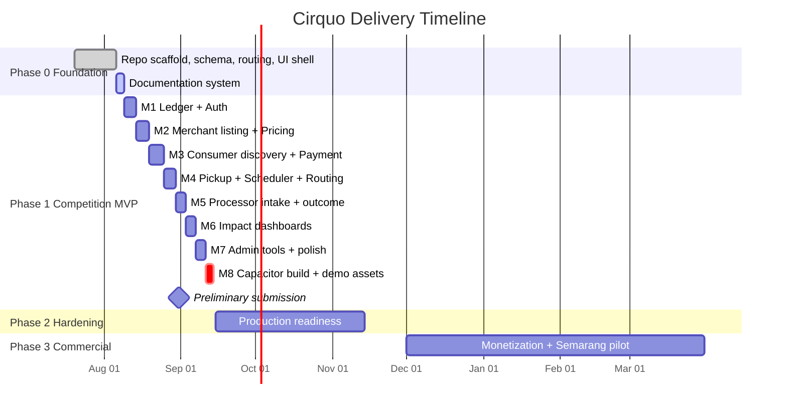
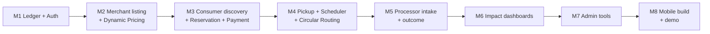

# Roadmap — Cirquo

**Document type:** Delivery plan  
**Status:** Draft v1.0  
**Last updated:** 2026-08-06  
**Competition deadline:** DSDC ANFORCOM 2026 preliminary — 31 August 2026

> **How to read this:** Phase 1 is the only phase with committed scope. Everything after Phase 1 is directional, not a promise. Priorities inside each phase follow the MoSCoW ordering in [PRD.md](../product/PRD.md) §6.

---

## 1. Timeline Overview

---

## 2. Phase 0 — Foundation ✅ (Complete)

The repository scaffold exists and is type-safe. This phase deliberately built **structure, not business logic**.

### What exists today

| Area | State |
|---|---|
| Build tooling | Vite 8, Bun, TypeScript, oxlint, Tailwind CSS v4 |
| Routing | React Router v7, four role-scoped route groups + fallback |
| Layouts | `ConsumerLayout` (bottom nav mobile), `RoleShell` for Merchant/Processor/Admin (sidebar + sheet) |
| UI primitives | 17 shadcn/ui components (button, card, form, dialog, sheet, table, tabs, select, progress, etc.) |
| Custom components | `PageHeader`, `SummaryCard`, `RoleShell` |
| Convex schema | 5 tables: `users`, `merchants`, `surplusItems`, `orders`, `recoveryBatches` |
| Convex functions | 6 read-only queries, **zero mutations** |
| Pages | 9 placeholder pages rendering mock data from `src/constants/mock-data.ts` |
| Mobile | Capacitor Android configured (`com.cirquo.app`), PWA manifest + service worker |
| Theming | OKLCH design tokens, Geist Variable font, light/dark variables defined |

### What explicitly does NOT exist

- ❌ No Material Flow Ledger table
- ❌ No mutations — nothing can be written to the database
- ❌ No authentication of any kind
- ❌ No Mapbox integration
- ❌ No Midtrans integration
- ❌ No scheduled functions
- ❌ No impact calculation
- ❌ All dashboard numbers are hardcoded placeholders

> **Honest assessment:** Phase 0 is roughly 15% of the MVP. It is a well-organized shell. The judging criteria weight *working implementation* at 20% (preliminary) and 25% (final), so Phase 1 velocity matters more than any further scaffolding.

---

## 3. Phase 1 — Competition MVP (Committed)

**Goal:** A judge can sit down with a laptop and run the complete circular flow end-to-end, with every step recorded in the Material Flow Ledger and reflected in impact dashboards.

### Sequencing Principle

Build the **ledger first**, then build features that write to it. Retrofitting the ledger into existing mutations is the most likely source of missing events, and a ledger with gaps invalidates every impact number the product claims.

---

### M1 — Material Flow Ledger + Authentication

**Exit criteria:** A user can register with a role, log in, stay logged in across reload, and every write path has a ledger helper available.

| Deliverable | Detail | Ref |
|---|---|---|
| `materialFlowLedger` table | Append-only, indexed by rescue item and timestamp | [MATERIAL_LEDGER.md](../impact/MATERIAL_LEDGER.md) |
| `recordLedgerEvent` helper | Single internal function all mutations must call | [BACKEND.md](../architecture/BACKEND.md) |
| Auth: register/login/logout | Session persisted, survives Capacitor restart | [AUTH.md](../security/AUTH.md) |
| Role selection at signup | Consumer / Merchant / Processor; Admin provisioned manually | AUTH-01, AUTH-02 |
| Business profile capture | Merchant & Processor: name, address, lat/lng, business type | AUTH-03 |
| `requireRole()` guard | Server-side authorization for every mutation | [PERMISSIONS.md](../security/PERMISSIONS.md) |
| Route protection | Client-side redirect for unauthenticated/wrong-role access | [FRONTEND.md](../architecture/FRONTEND.md) |

**Risk:** Auth is the classic time sink. Timebox it. If a full implementation threatens the schedule, ship a simple session-token approach and document the hardening plan rather than losing a week.

---

### M2 — Merchant Listing + Dynamic Rescue Pricing

**Exit criteria:** A verified merchant creates a Rescue Item, receives a suggested price, publishes it, and a `LISTED` ledger event exists.

| Deliverable | Detail | Ref |
|---|---|---|
| `createSurplusItem` mutation | Full field set incl. weight, quantity, pickup window | MER-01 |
| Dynamic Rescue Pricing function | Suggests discount from time-to-expiry, stock, floor price | [ALGORITHM.md](../impact/ALGORITHM.md) |
| Merchant override of suggestion | Engine advises; merchant decides | MER-02 |
| Floor price enforcement | Server-side; never suggest below merchant floor | PRI-03 |
| Edit/cancel before reservation | Blocked once reserved | MER-03 |
| Processing-only flag | Skips marketplace, goes straight to routing | MER-07 |
| Wire `CreateSurplusPage` to Convex | Replace the current toast-only submit handler | — |
| Merchant surplus list (real data) | Replace mock-data source | — |

---

### M3 — Consumer Discovery, Reservation, Payment

**Exit criteria:** A consumer finds a nearby item on a real map, reserves it, completes a Midtrans Sandbox payment, and receives a pickup code.

| Deliverable | Detail | Ref |
|---|---|---|
| Mapbox integration | Map render, merchant markers, clustering | MKT-01 |
| Geolocation | Browser + Capacitor permission handling, graceful denial | CON-01 |
| List view with filters | Distance, price, category, pickup window | CON-02, MKT-02 |
| Ranking | Distance × discount × urgency blend | MKT-03, ALGORITHM.md |
| Listing detail + reserve | Locks quantity and price | CON-03 |
| Midtrans Sandbox checkout | Snap token via Convex action | [API_CONSUMER.md](../api/API_CONSUMER.md) |
| Payment webhook handler | Verifies signature, updates order status | PAY-01, PAY-02 |
| Pickup code / QR generation | Consumer-presentable | CON-05 |
| Order history | Active + past, live status | CON-06 |

**Risk:** Midtrans webhook delivery to a Convex HTTP action is the highest-uncertainty integration in the MVP. Prototype it in isolation on day 1 of M3, not day 5.

---

### M4 — Pickup Confirmation, Scheduler, Circular Routing

**Exit criteria:** Merchant confirms a pickup and the consumer's screen updates live; an unclaimed item automatically becomes a routed recovery batch after its window closes.

| Deliverable | Detail | Ref |
|---|---|---|
| Pickup confirmation | Merchant verifies code → order `picked_up` → ledger `RESCUED` | MER-04 |
| Realtime status | Convex reactive query drives consumer UI | [REALTIME.md](../architecture/REALTIME.md) |
| Expiry cron | Scheduled function detects closed windows | [SCHEDULER.md](../architecture/SCHEDULER.md) |
| Circular Routing matcher | Material type + distance + processor capacity | ALGORITHM.md |
| Recovery batch creation | Item → `recoveryBatches` with `pending` status | MER-05 |
| Ledger `ROUTED` event | Written at routing time | IMP-01 |
| Auto-refund on failure | Unfulfilled paid orders refunded | PAY-03 |

> **This milestone contains the demo's "wow moment."** The transition from *unsold* to *automatically routed to an organic processor* is what distinguishes Cirquo from a surplus marketplace. Prioritize making it visible in the UI, not just correct in the database.

---

### M5 — Processor Intake and Outcome

**Exit criteria:** A processor sees a routed batch, accepts it, logs intake weight and material type, then logs output type and residual weight.

| Deliverable | Detail | Ref |
|---|---|---|
| Routed queue | Batches matched to this processor | PRC-01 |
| Accept / decline | Decline returns item to routing pool | PRC-02 |
| Intake log | Weight received, material type | PRC-03 |
| Outcome log | Output type (compost/BSF larvae/biogas/feed), output qty, residual qty | PRC-04 |
| Ledger events | `INTAKE_ACCEPTED`, `PROCESSED` | IMP-01 |
| Processor profile | Accepted material types + capacity, used by routing | PRC-06 |

---

### M6 — Impact Dashboards

**Exit criteria:** Every dashboard number is derived from ledger queries. Zero hardcoded totals remain in the codebase.

| Deliverable | Detail | Ref |
|---|---|---|
| Impact aggregation queries | kg rescued, kg recovered, kg residual, circularity rate | [IMPACT.md](../impact/IMPACT.md) |
| CO2e estimation | Versioned emission-factor method, labelled as estimate | IMP-04 |
| Consumer dashboard | kg rescued, CO2e avoided, money saved | CON-07 |
| Merchant dashboard | Listed / rescued / recovered / residual, revenue recovered | MER-06 |
| Processor dashboard | Intake volume, output by type, residual rate | PRC-05 |
| Admin dashboard | Platform-wide totals, active actors, circularity rate | ADM-04 |
| Remove mock data | Delete `src/constants/mock-data.ts` usage from all pages | — |

**Definition of done for M6:** `grep` the codebase for hardcoded impact figures (e.g. `"128 kg"`, `"87%"`, `"1,2 ton"`) and confirm none remain in rendered output.

---

### M7 — Admin Tools and Polish

**Exit criteria:** An admin can verify a merchant, moderate a listing, inspect the full ledger for any item, and resolve a dispute.

| Deliverable | Detail | Ref |
|---|---|---|
| Merchant/Processor verification | Approve, reject, suspend | ADM-01, AUTH-04 |
| Listing moderation | Remove violating listings | ADM-02 |
| Ledger inspector | Full audit trail per Rescue Item | ADM-03 |
| Dispute resolution | No-show reports both directions | ADM-05 |
| Manual re-route | Admin forces a routing decision | ADM-06 |
| Notifications | Reservation confirmed, pickup reminder, expiry warning, routed to queue | NOT-01…NOT-04 |
| Loading & error states | Every async surface | [DESIGN.md](../design/DESIGN.md) |
| Empty states | Every list view | [UI_GUIDE.md](../design/UI_GUIDE.md) |

---

### M8 — Mobile Build and Demo Assets

**Exit criteria:** APK installs and runs the full flow; demo video recorded; submission package complete.

| Deliverable | Detail |
|---|---|
| Capacitor Android build | `bun run android:sync` → working APK |
| Mobile flow verification | Full circular flow tested on a physical device |
| Geolocation on Android | Permission prompt, denial fallback |
| Seed data script | Reproducible demo dataset |
| Demo video (3–7 min) | See §4 |
| Proposal document | Competition submission |
| Repository cleanup | README accurate, no dead code, no committed secrets |

---

## 4. Demo Script (3–7 Minutes)

The final round weights Presentation 30%, Implementation 25%, Q&A 20%. The demo must show a **live system**, not a slideshow.

| Time | Segment | What is shown |
|---|---|---|
| 0:00–0:30 | Problem | Indonesian food loss & waste at 23–48 Mt/year (Bappenas); a Semarang bakery's daily surplus |
| 0:30–1:15 | Consumer rescue | Open map → nearby Rescue Item → dynamic price → reserve → Midtrans Sandbox → pickup code |
| 1:15–2:00 | Merchant fulfilment | Merchant confirms pickup code → order flips to `picked_up` live on the consumer screen |
| 2:00–3:00 | **Circular routing (the differentiator)** | Pickup window closes → unclaimed 8 kg auto-routed → processor queue → accept → log outcome |
| 3:00–4:00 | Material Flow Ledger | Open the audit trail for one item: every event, timestamped, immutable |
| 4:00–4:45 | Impact | Dashboard: 12 kg rescued, 8 kg recovered, 1.5 kg residual, **circularity rate 93%** |
| 4:45–5:00 | Close | "We don't claim zero waste. We claim we know where every kilogram went." |

**Rules for the demo:**
- Never show 100% circularity. A number like 93% is credible; 100% invites the question we cannot answer.
- No mocked interactions. If a button doesn't work, remove it before the demo.
- Have the APK on a physical phone as backup if the laptop fails.

---

## 5. Phase 2 — Post-Competition Hardening (Q4 2026)

**Goal:** Move from "works in a demo" to "survives real users."

| Workstream | Scope |
|---|---|
| Auth hardening | Password reset, rate limiting, session invalidation, audit logging |
| Payments | Midtrans production credentials, real refund flow, reconciliation, payout tracking |
| Reliability | Idempotent mutations, ledger write-failure recovery, retry semantics |
| Observability | Error tracking, function latency monitoring, alerting on failed routings |
| Accessibility | WCAG AA pass: contrast, focus order, screen reader labels, tap targets |
| Testing | Vitest for pricing/routing/impact math; Playwright for the four critical journeys |
| Pilot | 10–20 real Semarang merchants, 2–3 processors, closed consumer beta |
| Data validation | Plausible-range checks on self-reported weights |

**Phase 2 exit criteria:** 30 days of continuous operation with real transactions, zero ledger gaps, and a documented incident-response process.

---

## 6. Phase 3 — Commercial Launch (2027)

| Workstream | Scope |
|---|---|
| Monetization | Activate 12% commission; launch Rescue Pro tier ([BUSINESS.md](BUSINESS.md) §2) |
| Merchant self-serve | Onboarding without field visits |
| Processor network | Expand to 8–10 verified Semarang-area processors |
| Coverage | All Semarang districts |
| Reporting product | Exportable verified circularity reports (PDF/CSV) |
| Partnerships | Dinas Lingkungan Hidup, TPST operators, UMKM associations |
| Support ops | Dispute SLA, moderation queue, merchant success function |

---

## 7. Phase 4 — Multi-City (2027–2028)

| Workstream | Scope |
|---|---|
| City playbook | Repeatable launch sequence: map processors → recruit 20 merchants → seed → open consumers |
| Target cities | Yogyakarta, Surabaya, Bandung, Jakarta |
| Multi-tenancy | City-scoped data, admin, and reporting — no hardcoded city logic anywhere |
| Localization | English UI alongside Bahasa Indonesia |
| B2B pilot | Campus dining, hospital kitchens, hotel F&B |

**Migration trigger (documented, not scheduled):** Consider PostgreSQL only if one of these is true — Convex costs exceed roughly Rp15M/month, geospatial queries need PostGIS-grade capability, or a customer contract mandates data residency. Until then, migrating is overengineering. See [DATABASE.md](../domain/DATABASE.md).

---

## 8. Phase 5 — Platform & Regional (2029+)

Directional only.

- POS integrations (Moka, Qasir) for automatic surplus detection
- Public impact API for ESG platforms
- Predictive surplus forecasting for merchants
- Carbon-credit intermediation, contingent on methodology acceptance
- Regional expansion to Southeast Asian markets with comparable informal organic-processing ecosystems

---

## 9. Deferred Features

Features removed from MVP scope, with the reason and the earliest phase they could return.

| Feature | Deferred to | Reason |
|---|---|---|
| Peer-to-peer food swap | Phase 4+ | Liability, food safety, dispute complexity — solves a minor problem while creating major ones |
| Allergy-safety matching | Never as stated | We cannot guarantee allergen safety. Shipping only *dietary preference filtering* on merchant-declared attributes |
| AI demand forecasting | Phase 5 | Insufficient data. Rule-based Dynamic Rescue Pricing is explainable and defensible in Q&A; calling a formula "AI" invites the question "where is the AI?" |
| Fleet/logistics dispatch | Phase 4 | Cirquo tracks and coordinates; it does not move goods. Transport is off-platform in MVP |
| Route optimization | Phase 4 | Depends on dispatch |
| Multi-payment gateways | Phase 3 | Midtrans covers the Indonesian market; a second gateway adds surface area without demo value |
| Multi-currency / multi-country | Phase 5 | IDR only |
| Native Flutter/React Native apps | Not planned | Capacitor delivers one codebase to web + Android. A rewrite would consume the entire timeline |
| Loyalty / gamification | Phase 3 | Impact dashboard already provides intrinsic motivation |
| Computer-vision quality check | Phase 5 | High cost, unproven accuracy, not required for the core loop |
| Blockchain ledger | Speculative | The append-only Convex ledger is sufficient. Blockchain adds cost and complexity with no user-visible benefit today |

---

## 10. Decision Log

| # | Decision | Rationale | Revisit when |
|---|---|---|---|
| D1 | Convex over PostgreSQL for MVP | Realtime, scheduler, and auth-adjacent primitives out of the box; no infra to manage | Cost or geospatial needs cross the thresholds in §7 |
| D2 | Mapbox over Leaflet | Better clustering and visual polish for a judged demo | If Mapbox free-tier limits are hit before revenue |
| D3 | Capacitor over native | One codebase → web + Android with a 2–3 person team | Only if a native-only capability becomes essential |
| D4 | Rule-based pricing, not ML | Explainable in Q&A; no training data exists | After 6+ months of transaction history |
| D5 | Ledger before features | Retrofitting audit trails reliably fails | Never — this is foundational |
| D6 | No commission during pilot | Removes the last objection during merchant acquisition | Phase 3 |
| D7 | QRIS as default payment method | Percentage fee preserves margin on small baskets; flat fees do not | If QRIS pricing changes materially |

---

## 11. Open Questions

| # | Question | Owner | Needed by |
|---|---|---|---|
| Q1 | Who physically transports material from merchant to processor at scale? | Ops | Phase 3 |
| Q2 | Will Semarang processors accept mixed prepared food, or only specific material types? | Ops | Phase 1 (M5) |
| Q3 | What emission factor is most defensible for Indonesian food waste? | Impact | Phase 1 (M6) |
| Q4 | Does Midtrans Sandbox webhook delivery work reliably against Convex HTTP actions? | Backend | Phase 1 (M3) |
| Q5 | Is a municipal contract realistic in Semarang, and what is the procurement cycle? | Business | Phase 3 |
| Q6 | What is the actual acceptance rate of routed items? | Product | Phase 2 pilot |

---

## Related Documents

- [PRD.md](../product/PRD.md) — Requirement IDs referenced in milestones
- [BUSINESS.md](BUSINESS.md) — Monetization model activated in Phase 3
- [RISKS.md](RISKS.md) — Risk register, including schedule risk
- [FEATURES.md](../spec/FEATURES.md) — Per-feature acceptance criteria
- [AGENTS.md](../project/AGENTS.md) — Implementation priority order for AI agents
- [DEVELOPMENT.md](../engineering/DEVELOPMENT.md) — Local setup

---

**Built for DSDC ANFORCOM 2026**  
**Platform:** Cirquo — Closing the Loop, Saving Every Meal
