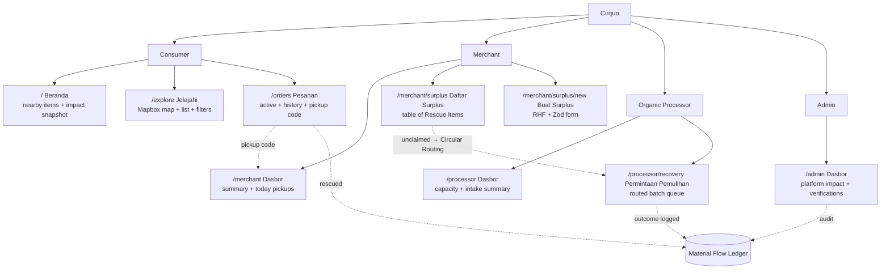

# Cirquo Design Principles & Strategy

| Field | Value |
| --- | --- |
| **Document type** | Design strategy / principles |
| **Status** | Draft v1.0 |
| **Last updated** | 2026-08-06 |
| **Owner** | Design & Frontend |
| **Applies to** | All four role surfaces (Consumer, Merchant, Organic Processor, Admin) |
| **Source of truth for tokens** | `src/index.css` |

---

## 1. Design Thesis

Cirquo is **not** a food delivery app. There is no courier, no delivery fee, no ETA. A consumer finds surplus food near them, reserves it, pays, and physically walks to the merchant to collect it inside a stated **pickup window**. If nobody collects it, the platform does not simply mark it "wasted" — it runs **Circular Routing** to an **Organic Processor** who converts it into BSF larvae, compost, biogas or animal feed. Every kilogram is tracked from listing to final outcome by the **Material Flow Ledger**.

That single sentence produces an unusual design problem: **one product must serve a consumer marketplace and three operational back-offices simultaneously**, and the demo must make the connection between them visible in under five minutes.

### 1.1 Two Surfaces, One System

| Dimension | Consumer surface | Operator surfaces (Merchant / Processor / Admin) |
| --- | --- | --- |
| Emotional register | Warm, appetising, low-friction, reassuring | Neutral, dense, factual, fast |
| Primary unit of interest | A single **Rescue Item** | A queue of items, batches, or accounts |
| Primary device | Phone, one hand, outdoors, 4G | Phone behind a counter, or a laptop in a back office |
| Session length | 30–120 seconds | 2–20 minutes, repeated |
| Navigation | Bottom nav (3 items) + header | Fixed sidebar at `lg`, Sheet drawer below |
| Container width | `max-w-5xl` | `max-w-6xl` |
| Dominant component | Card grid + map | Table + summary cards + forms |
| Failure cost | Missed meal | Mis-logged kilograms → corrupted impact data |

### 1.2 Why One Design System Serves Both

The temptation is to build two design languages. We deliberately do not, for four reasons:

1. **The ledger is the product.** A merchant, a processor and a consumer all eventually look at the same `LedgerTimeline` for the same Rescue Item. If the status vocabulary looks different per role, the audit trail loses its credibility. A `StatusBadge` reading `Terselamatkan` must look identical in the consumer order history and in the admin ledger search.
2. **Semantic tokens absorb the difference.** The variance between "warm marketplace" and "dense dashboard" is expressed almost entirely through **density, imagery and type scale** — not through hue. Consumer screens use larger radii, photography, and generous padding; operator screens use compact rows, no photography, and tighter padding. Both read from the identical token set.
3. **Team size.** This is a hackathon-scale team building for DSDC ANFORCOM 2026. A second design system is a second maintenance surface we cannot afford, and divergence would show up first in exactly the place the judges look: the impact numbers.
4. **Role-switching is real.** A merchant is also a consumer. A processor operator checks the consumer map to understand demand. Shared muscle memory is a feature.

The rule that makes it work:

> **Roles change density, not vocabulary.** If you find yourself inventing a new colour, a new status word, or a new number format for one role, you are solving the wrong problem.

### 1.3 What We Are Explicitly Not Building

| Not building | Why it matters to design |
| --- | --- |
| Delivery tracking / courier map | No live driver pin, no ETA ring, no "on the way" state. The map shows **merchants**, not vehicles. |
| A "zero waste" claim | Circularity sits at ~85–95%; the demo target is **93%**. The UI must never render 100% or imply it. |
| "AI pricing" | The feature is **Dynamic Rescue Pricing** — a rule-driven discount curve over the pickup window. Never label it AI. |
| Allergy safety guarantees | We ship **dietary preference filtering**. Never "allergy matching", never "guaranteed safe". |
| Measured CO2e | CO2e is **estimated** from a published formula and must always carry a visible estimate marker. |

---

## 2. Design Principles

Seven principles. Each is a tie-breaker, not a slogan — when two design options are equally attractive, the principle decides.

### 2.1 Measured Honesty

Impact numbers are the reason this platform exists and the fastest way to lose a judge's trust. We report what the ledger says, in the ledger's own units, with the estimate boundary drawn in the UI.

| Do | Don't |
| --- | --- |
| Show `93.4%` circularity when the ledger says 93.4% | Round up to "95%+" or animate a counter past the real value |
| Label estimated CO2e with an `EstimatedBadge` and an info affordance | Render `12,4 kg CO2e` as a bare hero number |
| Show **Residual** kg as a first-class segment of every breakdown | Hide residual, or colour it red as if it were a failure |
| Say "Estimasi berdasarkan metodologi `impact-v1`" | Say "Terbukti mengurangi 12 kg emisi" |
| Show `0` with an explanatory empty state | Show a fake seeded number to make a dashboard look alive |
| Show "Data belum tersedia" when the ledger has no events | Interpolate a trend line from two data points |

**Consequence for components:** `ImpactStatCard` takes an optional `estimated?: boolean`. When true it renders `EstimatedBadge` and is *not* eligible for the largest type size in the layout — measured numbers outrank estimated ones visually.

### 2.2 Mission Legibility

The circular loop is the innovation. If a user has to read documentation to understand that unclaimed food goes to a processor rather than a bin, the interface has failed.

| Do | Don't |
| --- | --- |
| Put `ImpactBreakdownBar` above the fold on every role dashboard | Bury the loop in a settings-adjacent "Impact" tab only |
| Name the outcome in the status badge: `Terselamatkan`, `Terolah`, `Residu` | Use generic `Selesai` / `Done` for three different outcomes |
| Show the ledger as a human-readable vertical timeline | Show a raw JSON event log |
| Make `RESIDUAL` visible and explained, not hidden | Imply every kilogram reaches a happy ending |
| Show the routing step (`recovery_pending`) as a distinct visual state | Jump straight from `expired` to `recovered` |

**Consequence:** the four-segment `ImpactBreakdownBar` (Rescued / Recovered / Residual / In progress) is the signature visual of the product and appears on the consumer impact screen, the merchant dashboard, the processor dashboard and the admin platform view — same component, same colours, different scope.

### 2.3 Speed Over Delight

A merchant is closing the shop with a tray of unsold bread. If listing it takes longer than throwing it away, they throw it away.

**Budget: a merchant completes `CreateSurplusPage` in under 120 seconds on a mid-range Android over 4G.**

| Do | Don't |
| --- | --- |
| Default the pickup window to a sensible next slot | Force manual date+time entry from empty |
| Prefill category and price from the merchant's last listing | Show an empty form every time |
| Single-column form, keyboard-type-correct inputs (`inputMode="numeric"`) | Multi-step wizard with progress dots for six fields |
| Submit optimistically with a Sonner toast, roll back on failure | Full-page spinner blocking the whole form |
| One photo, optional | Require three photos at specific angles |
| Show the Dynamic Rescue Pricing suggestion inline as a tappable chip | Open a modal to explain the pricing model before letting them type |

**Consequence:** no page-entrance animations on operator surfaces. No confetti. No mandatory onboarding tour on the merchant side.

### 2.4 One-Handed Mobile

The consumer is walking, holding a phone in one hand, in daylight, on a bus, deciding whether to divert two blocks for a discounted meal.

| Do | Don't |
| --- | --- |
| Put primary actions in the bottom third of the viewport | Put "Reservasi" in a top-right header slot |
| Use `Sheet` (bottom drawer) for filters, reservations, confirmations | Use centred `Dialog` for anything the thumb must reach on mobile |
| Keep map controls (recenter, zoom) bottom-right, above the bottom nav | Stack controls top-left where the thumb cannot reach |
| Minimum 44×44 px tap targets, 8 px minimum spacing between targets | 32 px icon buttons packed edge to edge |
| Make the whole `RescueItemCard` tappable, not just the button | Require a precise tap on a small "Lihat" link |
| Sticky bottom action bar on detail screens | Action button that scrolls away below the fold |

**Consequence:** `Dialog` is reserved for destructive confirmations on `lg` and above. Below `lg`, `ConfirmDialog` renders as a `Sheet`.

### 2.5 Density Where It Earns It

Operators process queues. Whitespace that helps a consumer scan six cards actively hurts a merchant scanning forty rows.

| Do | Don't |
| --- | --- |
| Use `Table` with compact rows for merchant surplus lists and admin queues | Render forty `Card`s in a vertical stack |
| Show 6–10 rows above the fold on a laptop operator screen | Show 2 rows because each has 32 px padding |
| Collapse tables into stacked rows below `md` with a label:value pattern | Horizontally scroll a 7-column table on a 390 px phone |
| Use consumer card density (`p-4`, `gap-4`) on the consumer surface | Apply table density to the consumer explore grid |
| Truncate long merchant names with `truncate` and a `title` attribute | Wrap to three lines and break row rhythm |

**Density reference:**

| Context | Vertical padding | Gap | Type size |
| --- | --- | --- | --- |
| Consumer card | `p-4` | `gap-3` | `text-sm` body, `text-base` title |
| Operator table row | `py-2.5` | `gap-2` | `text-sm` |
| Operator summary card | `p-4` | `gap-2` | `text-2xl` value |
| Form field group | `space-y-2` per field, `space-y-6` per section | — | `text-sm` label |

### 2.6 Accessible By Default

Accessibility is a build-time constraint, not an audit-time cleanup. Every component ships with its accessible name.

| Do | Don't |
| --- | --- |
| Give every icon-only button an `aria-label` in Bahasa Indonesia | Ship a bare `<Button size="icon"><Trash2 /></Button>` |
| Rely on `FormLabel` + `FormMessage` wiring for error association | Render a red paragraph unconnected to the input |
| Keep the default `focus-visible:ring-ring/50 ring-[3px]` focus ring | `outline-none` without a replacement |
| Pair every status colour with a text label | Encode `expired` vs `active` by colour alone |
| Respect `prefers-reduced-motion` in every transition | Animate the countdown timer with a spinning ring regardless |
| Announce async outcomes via Sonner (`role="status"`) | Silently mutate a number after a mutation resolves |

**Honest limitation.** We target WCAG 2.1 AA contrast ratios and have designed tokens to meet 4.5:1 for body text and 3:1 for large text and UI boundaries. **We have not performed manual assistive-technology testing.** No screen reader pass (TalkBack, NVDA, VoiceOver), no keyboard-only walkthrough of every flow, no expert accessibility audit has been carried out. Any claim of "WCAG AA compliant" is therefore unsupported; the accurate statement is **"designed against WCAG AA criteria, formal validation pending."** Full conformance requires manual testing with real assistive technology and review by a qualified accessibility specialist, and that work is Planned, not done.

### 2.7 Trust Through Traceability

The claim "we tracked every kilogram" is only credible if a user can click through to the evidence.

| Do | Don't |
| --- | --- |
| Make every impact number drill down to its `LedgerTimeline` | Present aggregate kg with no path to the underlying events |
| Show the immutable event list with actor, timestamp (WIB) and weight delta | Show a summarised "3 updates" collapse |
| Render `impact-v1` methodology version next to derived figures | Show CO2e with no methodology reference |
| Show measured intake weight *and* listed weight when they differ | Silently overwrite the listed weight with the measured one |
| Keep ledger rows read-only in every UI, for every role including Admin | Offer an "edit event" affordance anywhere |

**Consequence:** `LedgerTimeline` has no edit or delete affordance in any role. Admin can *annotate* via a new event; it can never mutate history.

---

## 3. Information Architecture

### 3.1 Role Map

### 3.2 Consumer IA

| Level | Screen | Route | Status | Purpose |
| --- | --- | --- | --- | --- |
| 1 | Beranda | `/` | Implemented exists (placeholder) | Nearby Rescue Items, personal impact snapshot, entry to explore |
| 1 | Jelajahi | `/explore` | Implemented exists (placeholder) | Map-first discovery with list toggle and `FilterSheet` |
| 1 | Pesanan | `/orders` | Implemented exists (placeholder) | Active reservations with pickup code, plus history |
| 2 | Detail Rescue Item | `/item/:id` | Planned | Photo, price, pickup window, dietary tags, merchant, reserve CTA |
| 2 | Detail Pesanan | `/orders/:id` | Planned | `OrderTimeline`, `PickupCodeCard`, ledger link |
| 2 | Dampak Saya | `/impact` | Planned | Personal `ImpactBreakdownBar`, estimated CO2e |
| 2 | Profil | `/profile` | Planned | Dietary preferences, location, language |

**Depth rule:** no consumer task exceeds three taps from `/`. Reserve = Beranda → item → reserve.

### 3.3 Merchant IA

| Level | Screen | Route | Status | Purpose |
| --- | --- | --- | --- | --- |
| 1 | Dasbor | `/merchant` | Implemented exists (placeholder) | `SummaryCard` row, today's pickups, impact bar |
| 1 | Daftar Surplus | `/merchant/surplus` | Implemented exists (placeholder) | Table of all Rescue Items by status |
| 2 | Buat Surplus | `/merchant/surplus/new` | Implemented exists (placeholder) | The 120-second form |
| 2 | Detail Surplus | `/merchant/surplus/:id` | Planned | Item state, orders, ledger |
| 2 | Verifikasi Kode | `/merchant/pickup` | Planned | `PickupCodeInput` — the counter-side moment |
| 2 | Dampak | `/merchant/impact` | Planned | Business-level circularity and revenue recovered |

### 3.4 Processor IA

| Level | Screen | Route | Status | Purpose |
| --- | --- | --- | --- | --- |
| 1 | Dasbor | `/processor` | Implemented exists (placeholder) | `CapacityMeter`, intake this week, outcome mix |
| 1 | Permintaan Pemulihan | `/processor/recovery` | Implemented exists (placeholder) | Routed batch queue: pending / offered / accepted |
| 2 | Detail Batch | `/processor/recovery/:id` | Planned | Accept/decline, `IntakeForm`, `OutcomeForm` |
| 2 | Riwayat | `/processor/history` | Planned | Processed batches with outcome types |

### 3.5 Admin IA

| Level | Screen | Route | Status | Purpose |
| --- | --- | --- | --- | --- |
| 1 | Dasbor | `/admin` | Implemented exists (placeholder) | Platform circularity, verification queue depth |
| 2 | Verifikasi | `/admin/verifications` | Planned | Merchant/processor approval queue |
| 2 | Moderasi | `/admin/moderation` | Planned | Reported/suspect Rescue Items |
| 2 | Ledger | `/admin/ledger` | Planned | Search + per-item audit trail |
| 2 | Sengketa | `/admin/disputes` | Planned | Order disputes and refunds |

---

## 4. Navigation Model

### 4.1 Why Consumers Get Bottom Nav and Operators Get a Sidebar

| Factor | Consumer → bottom nav | Operator → sidebar |
| --- | --- | --- |
| Destination count | 3 stable destinations | 4–6 and growing |
| Thumb reach | Critical — one-handed, outdoors | Less critical — often two hands or desktop |
| Screen budget | Map needs maximum vertical space; a 56 px bar costs less than a header-plus-drawer | Dashboards are horizontally roomy; 256 px sidebar is affordable at `lg` |
| Switching frequency | High — map ⇄ orders many times per session | Low — a merchant lives on one screen for minutes |
| Label length | Short (`Beranda`, `Jelajahi`, `Pesanan`) | Longer (`Permintaan Pemulihan`) — needs horizontal room |
| Existing implementation | `ConsumerLayout`: fixed 3-item bottom nav below `sm`, horizontal header nav at `sm`+ | `RoleShell`: fixed `w-64` sidebar at `lg`, `Sheet` hamburger below |

**Rule:** if a role's destination count exceeds 5, it must not use bottom nav. If it is ≤ 3 and thumb-critical, it must not use a sidebar.

### 4.2 Navigation Contracts

| Element | Consumer | Operator |
| --- | --- | --- |
| Header height | `h-16` | `h-16` |
| Header content | Cirquo logo + horizontal nav (hidden below `sm`) | Role label + `SheetTrigger` hamburger below `lg` |
| Persistent nav | Fixed bottom bar, 3 items, below `sm` | `RoleShell` sidebar `w-64` at `lg`+ |
| Active state | Icon + label in brand foreground, weight `font-medium` | Left border accent + `bg-sidebar-accent` |
| Main container | `max-w-5xl` | `max-w-6xl` |
| Bottom padding on mobile | `pb-20` to clear bottom nav | `pb-6` |

### 4.3 Cross-Role Boundaries

Roles do not share a navigation shell. A user with two roles switches via an explicit role switcher in the profile/account menu, which performs a full route change (`/` ⇄ `/merchant`). We do **not** build a unified nav that mixes consumer and merchant destinations — it invites mis-taps at the counter, and the mental models are different.

`RoleGuard` (Planned) wraps route groups and redirects unauthorised roles rather than hiding items, so a wrong-role deep link never renders a half-populated shell.

---

## 5. Responsive Strategy

Mobile-first. Base styles target a 390 px viewport; every breakpoint is additive.

| Breakpoint | Min width | Consumer changes | Operator changes |
| --- | --- | --- | --- |
| **base** | 0 | Single-column card list. Fixed bottom nav visible. Map fills viewport minus header and nav. Filters open as `Sheet`. Sticky bottom action bar on detail. | Sidebar hidden; hamburger opens `Sheet`. Tables collapse to stacked label:value rows. `SummaryCard` grid = 1 column. |
| **sm** | 640 | Bottom nav hidden; horizontal nav appears in the header. Card grid → 2 columns. Detail action bar becomes inline. | `SummaryCard` grid → 2 columns. Table shows the 3 highest-priority columns. |
| **md** | 768 | Card grid → 2 columns with larger imagery. Explore gains a persistent list/map segmented toggle instead of a floating FAB. | Full `Table` layout with all columns. Forms may use 2-column field pairs (e.g. quantity + unit). |
| **lg** | 1024 | Card grid → 3 columns. Explore becomes split view: list left (`w-96`), map right (fill). | Fixed `w-64` sidebar appears; hamburger disappears. `SummaryCard` grid → 4 columns. `ConfirmDialog` renders as `Dialog` rather than `Sheet`. |
| **xl** | 1280 | Container caps at `max-w-5xl` and centres — no 4-column grid, because larger cards read better than more cards. | Container caps at `max-w-6xl`. Detail screens gain a right-hand context rail (ledger preview) instead of a tab. |

**Deliberate non-goal:** we do not design a distinct tablet experience. 768–1023 is treated as "wide phone" for consumers and "narrow desktop" for operators. Splitting further would triple the frame inventory for a device class that will not appear in the demo.

**Performance contract:** sub-2s first contentful paint on a mid-range Android over 4G. This constrains design directly:

| Constraint | Design consequence |
| --- | --- |
| No render-blocking hero imagery | Above-the-fold on `/` is text + `SummaryCard`, not a full-bleed photo |
| Mapbox is heavy | Map loads only on `/explore`, never on `/`. `/` shows a static list. |
| Font budget | One family (`Geist Variable`), variable weight, self-hosted via `@fontsource-variable/geist` — no second family, no icon font (Lucide is SVG) |
| Listing photos | Single image per Rescue Item, lazy-loaded below the fold, fixed aspect ratio to prevent layout shift |
| Skeletons over spinners | Reserved layout space eliminates CLS |

---

## 6. Accessibility Commitments

| Commitment | Implementation | Status |
| --- | --- | --- |
| Contrast — body text ≥ 4.5:1 | Token pairs designed against WCAG AA; `--muted-foreground` at `oklch(0.556 0 0)` on `oklch(1 0 0)` ≈ 4.6:1 | Implemented token-level |
| Contrast — large text & UI boundaries ≥ 3:1 | Brand ramp steps chosen so `--brand-700` on white and `--brand-200` on `--brand-950` both clear 3:1 | Planned pending measurement |
| Visible focus | shadcn default `focus-visible:border-ring focus-visible:ring-ring/50 focus-visible:ring-[3px]` retained everywhere | Implemented exists |
| Tap targets ≥ 44×44 px | Buttons `size="lg"` on mobile primary actions; icon buttons get `min-h-11 min-w-11` even when the glyph is 20 px | Planned needs audit of existing icon buttons |
| Icon-only buttons named | `aria-label` in Bahasa Indonesia on every icon-only control | Planned |
| Form error association | React Hook Form + `FormMessage` wires `aria-describedby` and `aria-invalid` automatically | Implemented exists in `CreateSurplusPage` |
| Reduced motion | All transitions wrapped in `motion-safe:`; countdown updates are text-only, never animated rings | Planned |
| Colour never sole carrier | Every `StatusBadge` renders a text label alongside its colour | Planned (component not built) |
| Keyboard traps | Radix/base-ui `Dialog` and `Sheet` manage focus trapping and restoration | Implemented inherited from primitives |
| Language attribute | `<html lang="id">` | Planned needs verification |
| Screen-reader live regions | Sonner toasts; countdown announces at 30/10/5-minute thresholds only, not every second | Planned |

**Restating the limitation, because it matters:** the table above describes design intent and inherited primitive behaviour. It does not describe verified conformance. **No manual assistive-technology testing has been performed on Cirquo.** We will not describe the product as accessible or WCAG AA compliant in any submission material; we will describe it as designed against WCAG AA criteria with validation pending.

---

## 7. Content & Tone (Bahasa Indonesia)

UI copy is Bahasa Indonesia first. English is a later localisation pass, not a parallel deliverable.

### 7.1 Voice

| Attribute | Meaning | Example |
| --- | --- | --- |
| Direct | Verb-first instructions, no hedging | `Ambil sebelum 21.00` not `Anda mungkin dapat mengambil…` |
| Plain | Everyday Indonesian, not corporate sustainability jargon | `Sisa yang tidak terolah` not `Residu material non-terkonversi` |
| Honest | State limits and estimates plainly | `Estimasi, bukan pengukuran langsung` |
| Neutral in operator surfaces | No exclamation marks in merchant/processor/admin | `Batch diterima` not `Batch diterima! ` |
| Warm in consumer surfaces | Second person, light encouragement, no guilt | `Kamu menyelamatkan 2,4 kg minggu ini` not `Jangan biarkan makanan terbuang!` |

**Person:** consumer copy uses `kamu`. Operator copy uses no pronoun (impersonal). Never `Anda` in consumer surfaces — it reads institutional.

### 7.2 Domain Term Glossary

Exact strings. Do not paraphrase in the UI.

| Concept (EN) | Bahasa Indonesia UI label | Short form | Notes |
| --- | --- | --- | --- |
| Rescue Item | Item Penyelamatan | Item | Never "produk", never "makanan diskon" |
| Rescued | Terselamatkan | — | Consumer collected it |
| Recovered | Terolah | — | Processor converted it |
| Residual | Residu | — | Honestly reported remainder, not an error |
| In progress | Dalam proses | — | Listed/reserved/routed but not yet resolved |
| Circular Routing | Perutean Sirkular | Perutean | The matching step to a processor |
| Material Flow Ledger | Catatan Aliran Material | Catatan | Never "blockchain", never "log" in UI |
| Dynamic Rescue Pricing | Harga Penyelamatan Dinamis | Harga dinamis | Never "harga AI" |
| Impact Tracking | Pelacakan Dampak | Dampak | — |
| Circularity rate | Tingkat Sirkularitas | Sirkularitas | Always with `%` and one decimal |
| Pickup window | Jendela Pengambilan | Waktu ambil | Displayed as a WIB range |
| Pickup code | Kode Pengambilan | Kode | 6 characters, shown large |
| Dietary preference filtering | Filter Preferensi Diet | Preferensi | Never "filter alergi" |
| Organic Processor | Pengolah Organik | Pengolah | — |
| Merchant | Mitra Usaha | Mitra | — |
| Estimated CO2e | Estimasi CO2e | — | Always with `EstimatedBadge` |
| Revenue recovered | Pendapatan Terselamatkan | — | IDR, `Rp` prefix |
| No-show | Tidak Diambil | — | Neutral; never "pelanggan lalai" |
| Unroutable | Tidak Dapat Dirutekan | — | Batch found no processor |

### 7.3 Forbidden Phrasings

| Never write | Because | Write instead |
| --- | --- | --- |
| `Nol sampah` / `Zero waste` | Untrue; residual exists | `Sirkularitas 93,4%` |
| `100% tertutup` | Untrue | `Sebagian besar material terolah` |
| `Harga bertenaga AI` | It is a rule-based curve | `Harga Penyelamatan Dinamis` |
| `Dijamin aman` | We cannot guarantee food safety | `Diambil sebelum batas waktu` |
| `Diantar` / `Kurir` | There is no delivery | `Ambil di lokasi` |
| `Cocok untuk alergi` | We only filter preferences | `Sesuai preferensi diet` |
| `Terbukti mengurangi X kg CO2e` | It is estimated | `Estimasi X kg CO2e` |

---

## 8. Presenting Impact Numbers

Three tiers, rendered with decreasing visual weight.

| Tier | Definition | Examples | Visual treatment |
| --- | --- | --- | --- |
| **1. Measured** | Written directly to the ledger by a real event | kg Rescued (from order pickup), kg Recovered (from processor intake), Revenue recovered | Largest type (`text-3xl`/`text-4xl`), full foreground colour, no qualifier |
| **2. Derived** | Arithmetic over measured values only | Circularity rate, kg Residual, kg In progress | Medium type (`text-2xl`), full foreground, optional formula tooltip |
| **3. Estimated** | Model output, not observation | CO2e (`rescuedKg × 2.5 + recoveredKg × 0.9`, `impact-v1`) | Smaller type (`text-xl`), `text-muted-foreground` for the unit, mandatory `EstimatedBadge` |

**Layout rule:** in any group of impact figures, a tier-3 number is never the largest element. If a screen has only a CO2e number, it still renders at tier-3 scale — we do not promote it for lack of company.

**The estimate affordance.** `EstimatedBadge` renders a small `Estimasi` pill with an `Info` icon. Tapping it opens a `Sheet` (mobile) or `Dialog` (`lg`+) containing:

- the formula in plain language,
- the methodology version `impact-v1`,
- an explicit sentence that this is a calculation, not a measurement,
- a note that factors are literature-derived averages and actual emissions vary by food type and disposal route.

**Circularity rate.** Defined as `(rescuedKg + recoveredKg) / totalListedKg`. Rendered with one decimal. Expected range 85–95%. The demo target is **93%**. The UI must never render `100.0%`; if the computation returns ≥ 99.95% the component clamps display to `99,9%` and logs a data-integrity warning for Admin, because a true 100% means the ledger is missing residual events.

**Zero states are real states.** A new merchant sees `0,0 kg` and a sentence explaining that numbers appear after the first completed pickup. We do not seed demo numbers into production-shaped UI.

---

## 9. Dark Mode Strategy

Dark mode ships. It is not decorative — merchants verify pickup codes in dim shops after closing, and processors work in low-light facility offices.

| Decision | Rationale |
| --- | --- |
| `next-themes` with `class` strategy, default `system` | Respects OS preference; `.dark` class already exists in `src/index.css` |
| Dark surfaces are elevated by lightness, not by shadow | Shadows are near-invisible on dark; `--card` sits above `--background` by ~0.03 L |
| Brand hue held constant (~162), chroma reduced ~15% in dark | Full-chroma green vibrates against dark backgrounds |
| Status colours re-tuned per theme, not merely inverted | Amber at the same L on dark fails contrast; each status has an explicit dark value |
| `PickupCodeCard` forces maximum contrast in both themes | It must be readable by a merchant's camera or eyes across a counter |
| Map style switches with theme | Mapbox light-v11 / dark-v11; a light map inside a dark shell is jarring and blows out night vision |
| Listing photography unchanged | We do not dim user-supplied images; a subtle inner border separates image from dark card |
| No pure black background | `--background` in dark is `oklch(0.145 0 0)`, not `oklch(0 0 0)` — reduces smearing on OLED and halation on white text |

**Testing obligation:** every status colour and every impact segment must be checked in both themes. A component is not done until both are verified.

---

## 10. Motion & Animation Budget

Motion serves comprehension. Anything else is cost — in frames, in battery, in vestibular comfort.

| Category | Duration | Easing | Allowed where |
| --- | --- | --- | --- |
| Micro-feedback (hover, press, focus) | 100–150 ms | `ease-out` | Everywhere |
| Sheet / Dialog enter/exit | 200–250 ms | `ease-out` in, `ease-in` out | Overlays only |
| Content reveal (accordion, expand) | 180–220 ms | `ease-out` | Detail expansion |
| Skeleton shimmer | 1.5 s loop | `linear` | Loading states only |
| Route transition | **0 ms** | — | None — instant navigation is the fast-feeling choice |
| Number count-up | **0 ms** | — | Forbidden on impact figures (see Measured Honesty) |
| `ImpactBreakdownBar` first paint | 400 ms width grow, once | `ease-out` | Only on initial mount, never on data refresh |

**Rules:**

- Nothing animates for longer than 400 ms.
- Nothing loops except skeletons.
- No parallax, no scroll-jacking, no entrance animations on operator surfaces.
- All motion sits behind `motion-safe:`; `prefers-reduced-motion: reduce` collapses every transition to an instant state change while preserving the final visual result.
- The countdown in `PickupWindowBadge` updates text at a 1-second tick but does not animate — the digit simply changes.

---

## 11. Iconography

Library: **Lucide React**, already a dependency. No second icon set, no icon font, no custom SVG sprite.

| Rule | Detail |
| --- | --- |
| Sizes | `16` (inline with `text-sm`), `20` (buttons, nav, list rows), `24` (empty states, section headers). No other sizes. |
| Stroke | Lucide default `2`. Never restyle stroke width per instance. |
| Colour | `currentColor` always. Icons inherit from their text context; never hardcode an icon colour. |
| Labelling | Every icon is either (a) adjacent to a visible text label, or (b) inside a control with `aria-label`. There is no third option. |
| Decorative icons | `aria-hidden="true"` when a visible label already names the control |
| Semantic consistency | One concept, one icon, platform-wide. `Recycle` never means anything except Recovered. |
| Alignment | Icons in text runs use `shrink-0` and vertical centring via flex, never `vertical-align` hacks |

**Core semantic assignments** (full inventory in `FIGMA.md`):

| Concept | Lucide icon |
| --- | --- |
| Rescue Item / listing | `Package` |
| Rescued | `HandHeart` |
| Recovered / processing | `Recycle` |
| Residual | `Trash2` (neutral colour, never destructive red) |
| Circular Routing | `Waypoints` |
| Material Flow Ledger | `ScrollText` |
| Impact | `Leaf` |
| Pickup window / time | `Clock` |
| Pickup code | `KeyRound` |
| Location / map | `MapPin` |
| Merchant | `Store` |
| Processor facility | `Factory` |
| Capacity | `Gauge` |
| Verification | `BadgeCheck` |
| Estimated / info | `Info` |
| Dispute | `MessageSquareWarning` |

### 11.1 Imagery for Rescue Item Photos

| Rule | Value | Rationale |
| --- | --- | --- |
| Count | Exactly one photo per Rescue Item | Merchant time budget (Speed Over Delight) |
| Aspect ratio | `4:3`, enforced by `aspect-[4/3] object-cover` | Prevents CLS; forgiving for phone photos |
| Card render width | 100% of card; card image slot `rounded-t-lg` | — |
| Loading | `loading="lazy"` below the fold, `decoding="async"` | FCP budget |
| Fallback | Category glyph on `bg-muted` with the category name — never a broken-image icon, never a stock photo | Honest: no photo means no photo |
| Overlay text | Discount badge top-left, remaining-quantity badge top-right, both on a translucent scrim for contrast over unpredictable photos | Text must remain legible over any image |
| Prohibited | Filters, saturation boosts, "artistically distressed" styling | Food must look like what the consumer will actually receive |
| Alt text | `"Foto {nama item} dari {nama mitra}"` | Meaningful, not `"gambar"` |

Operator surfaces show photos only in item detail, never in tables — a 40 px thumbnail costs a request and communicates nothing at queue-scanning speed.

---

## 12. Loading, Empty and Error States

Every data-driven surface specifies four states. A screen is not designed until all four exist.

### 12.1 Loading

| Principle | Detail |
| --- | --- |
| Skeletons, not spinners | Use the existing `Skeleton` primitive shaped like the real content |
| Reserve exact layout | Skeleton dimensions match final content to prevent shift |
| Threshold | Below ~200 ms, show nothing — a flashed skeleton is worse than a brief blank |
| Never block the shell | Header, nav and sidebar render immediately; only the content region skeletons |
| Convex reactivity | Data arrives progressively; render partial data with per-section skeletons rather than gating the page on the slowest query |

### 12.2 Empty

Empty states must distinguish **no data yet** from **no results for this filter** — they need different actions.

| Situation | Message pattern | Primary action |
| --- | --- | --- |
| First-run, no data | Explain what will appear and why | The action that creates the first record |
| Filtered to zero | State the filter is the cause | `Hapus filter` |
| Nothing nearby | State the radius | `Perluas radius` |
| Queue cleared | Confirm it as an accomplishment, neutrally | None |

Every `EmptyState` has an icon (24 px), a title, one sentence of body copy, and at most one primary action. No illustrations — they cost bytes against the FCP budget and rarely survive dark mode.

### 12.3 Error

| Rule | Detail |
| --- | --- |
| Name what failed | `Gagal memuat item terdekat` — not `Terjadi kesalahan` |
| Offer recovery | `Coba lagi` retries the specific query, not a full reload |
| Preserve user input | A failed form submit never clears fields |
| Scope errors | A failed map does not blank the list beside it |
| Never blame the user for system faults | Reserve corrective copy for genuine validation errors |
| No raw messages | Never surface stack traces or Convex/Midtrans error codes; log them, show a human sentence |
| Payment failures are explicit | Midtrans failure states name the outcome and the next step; the reservation is held for a defined grace period and the UI says so |

### 12.4 State Matrix Example — `/explore`

| State | Rendering |
| --- | --- |
| Loading | Map skeleton (grey block, correct height) + 3 `RescueItemCard` skeletons |
| Empty (no items in radius) | `EmptyState` with `MapPin`, "Belum ada item di sekitarmu", action `Perluas radius` |
| Empty (filtered) | `EmptyState` with `Filter`, "Tidak ada item yang cocok dengan filter", action `Hapus filter` |
| Error (map) | List renders normally; map area shows `ErrorState` with `Coba lagi` |
| Error (data) | `ErrorState` full-width, map hidden |
| Permission denied | `LocationPermissionPrompt`; map falls back to Semarang centre with a banner explaining distances are approximate |
| Success | Map + card grid, filter chips reflecting active filters |

---

## 13. Design Debt Register

Known, accepted, tracked. Recorded honestly rather than hidden.

| ID | Debt | Impact | Severity | Resolution | Target |
| --- | --- | --- | --- | --- | --- |
| **DD-01** | Palette in `src/index.css` is fully achromatic — every token is `oklch(L 0 0)` — while `RoleShell`, `ConsumerLayout`, `SummaryCard` and `HomePage` hardcode `emerald-700` / `emerald-800` / `emerald-50` | Brand colour cannot be themed, dark mode is inconsistent, no single source of truth for green | **High** | Add the `--brand-50…950` OKLCH ramp (hue ≈ 162), repoint `--primary` and the sidebar tokens at it, replace every hardcoded emerald class with a token utility. Full spec in `UI_GUIDE.md` §3. | M2 |
| **DD-02** | `--font-sans` is set to `'Geist Variable'` and `@fontsource-variable/geist` is imported, but `body` still declares an Inter fallback stack | The shipped typeface may not be the intended one; type metrics and spacing were designed for Geist | **High** | Change `body` to `font-family: var(--font-sans)` and delete the Inter stack. Spec in `UI_GUIDE.md` §6. | M1 |
| **DD-03** | `public/manifest.webmanifest` ships a single SVG icon | Android maskable/adaptive icons and splash screens degrade; Capacitor 8 packaging needs raster sizes | Medium | Generate 192/512 PNG plus a maskable variant; add `purpose: "maskable"`. Align `theme_color` with the new `--brand-700` rather than the literal `#047857`. | M3 |
| **DD-04** | No authentication screens designed or built for any role | Every role flow starts mid-session; demo cannot show onboarding or role selection | **High** | Design login, register, role-select, verification-pending. Frames enumerated in `FIGMA.md` §8. | M2 |
| **DD-05** | All 9 pages read `src/constants/mock-data.ts`; dashboard figures are hardcoded | Impact numbers are not ledger-derived, directly contradicting Measured Honesty | **Critical** | Wire every impact figure to Convex queries over the Material Flow Ledger. No number ships to the demo unless it is computed. | M4 |
| **DD-06** | `StatusBadge` does not exist; statuses render as plain text | 26 status values across 3 enums have no consistent visual treatment | Medium | Build the discriminated-union `StatusBadge`; mapping tables in `UI_GUIDE.md` §4. | M2 |
| **DD-07** | `SummaryCard` hardcodes an emerald icon chip | Blocks DD-01; card cannot express non-brand semantics (residual, warning) | Medium | Add `variant?: 'brand' \| 'recovered' \| 'residual' \| 'neutral'` driven by tokens. | M2 |
| **DD-08** | Role component directories (`consumer/`, `merchant/`, `processor/`, `admin/`) are empty | No role-specific composites exist; pages will accrete inline markup | Medium | Populate per the priority table in `COMPONENTS.md` §9. | M2–M5 |
| **DD-09** | No `aria-label` audit performed on icon-only controls | Screen-reader users cannot identify the hamburger or map controls | Medium | Audit and label every icon-only button. | M3 |
| **DD-10** | No manual assistive-technology testing has been done | Accessibility claims are unsupported | Medium | TalkBack pass on the consumer flow at minimum; document findings honestly. | M6 |
| **DD-11** | Consumer detail routes (`/item/:id`, `/orders/:id`) do not exist | Reservation flow is unreachable end-to-end | **High** | Add routes and screens. | M3 |
| **DD-12** | `prefers-reduced-motion` not implemented | Vestibular-sensitive users get unguarded motion | Low | Wrap transitions in `motion-safe:`. | M5 |
| **DD-13** | English localisation not scoped; strings are inline Bahasa Indonesia | Judges or partners requiring English see none | Low | Extract strings to a dictionary before adding a second locale. Do not add i18n tooling before M7. | M7 |

**Register discipline:** a new debt entry is added the moment a shortcut is taken, in the same pull request. Items are closed only when the fix is merged, never when a fix is planned.

---

## 14. Related Documents

| Document | Path | Relationship |
| --- | --- | --- |
| Product Requirements | [`../product/PRD.md`](../product/PRD.md) | Requirements these principles serve |
| Product Overview | [`../product/PRODUCT.md`](../product/PRODUCT.md) | Positioning and value proposition |
| User Flows | [`../spec/USER_FLOW.md`](../spec/USER_FLOW.md) | Step-by-step flows the IA supports |
| Feature Specification | [`../spec/FEATURES.md`](../spec/FEATURES.md) | Feature-level detail behind each screen |
| Roles & Permissions | [`../spec/ROLES.md`](../spec/ROLES.md) | Role boundaries driving the navigation model |
| Frontend Architecture | [`../architecture/FRONTEND.md`](../architecture/FRONTEND.md) | Routing, state, build setup |
| Realtime Architecture | [`../architecture/REALTIME.md`](../architecture/REALTIME.md) | Convex reactivity behind loading states |
| Impact Model | [`../impact/IMPACT.md`](../impact/IMPACT.md) | Metric definitions and CO2e methodology |
| Material Flow Ledger | [`../impact/MATERIAL_LEDGER.md`](../impact/MATERIAL_LEDGER.md) | Event schema behind `LedgerTimeline` |
| State Machine | [`../domain/STATE_MACHINE.md`](../domain/STATE_MACHINE.md) | Authoritative status enums |
| Style Guide | [`../engineering/STYLE_GUIDE.md`](../engineering/STYLE_GUIDE.md) | Code conventions |
| Testing Strategy | [`../engineering/TESTING.md`](../engineering/TESTING.md) | Component testing approach |
| Roadmap | [`../business/ROADMAP.md`](../business/ROADMAP.md) | M1–M8 milestones referenced in the debt register |
| UI Guide | [`UI_GUIDE.md`](UI_GUIDE.md) | Concrete tokens, scales, formatting rules |
| Component Catalogue | [`COMPONENTS.md`](COMPONENTS.md) | Component contracts and props |
| Figma Specification | [`FIGMA.md`](FIGMA.md) | Design file structure and frame inventory |

---

**Built for DSDC ANFORCOM 2026**  
**Platform:** Cirquo — Closing the Loop, Saving Every Meal
