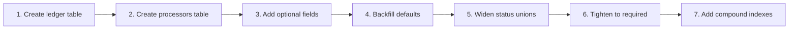

# Database — Cirquo

**Document type:** Technical reference  
**Backend:** Convex  
**Status:** Draft v1.0  
**Last updated:** 2026-08-06

> This document is the **target schema**. It is not what `convex/schema.ts` contains today. §2 lists what exists, §3 gives the complete target, §7 gives the migration path. Conceptual relationships are in [DATA_MODEL.md](DATA_MODEL.md); lifecycle rules are in [STATE_MACHINE.md](STATE_MACHINE.md).

---

## 1. Design Principles

| # | Principle | Consequence |
|---|---|---|
| 1 | **The ledger is the source of truth for impact** | No table stores a running impact total. Every metric is aggregated from `materialFlowLedger` at read time |
| 2 | **Append-only where auditability matters** | `materialFlowLedger` rows are never updated or deleted |
| 3 | **Soft-delete everywhere else** | Hard deletion orphans ledger entries and breaks the weight conservation invariant |
| 4 | **Integers only for weight, money, and time** | Grams, IDR, epoch milliseconds. No floats in any value that gets summed |
| 5 | **Snapshot values that must not change retroactively** | `orders.rescuedWeightGrams`, `orders.totalPrice`, `ledger.weightDeltaGrams` |
| 6 | **Index for the query, not for the entity** | Convex indexes are ordered prefixes; design them from the access patterns in [DATA_MODEL.md](DATA_MODEL.md) §5 |
| 7 | **No city-scoped hardcoding** | Multi-city expansion must not require a schema change ([PRD.md](../product/PRD.md) §7) |

---

## 2. Current Schema (as implemented)

`convex/schema.ts` currently defines five tables and ten indexes.

| Table | Fields | Indexes |
|---|---|---|
| `users` | name, email, role, createdAt | `by_email` |
| `merchants` | ownerId, name, description?, address, latitude?, longitude?, isVerified, createdAt | `by_owner` |
| `surplusItems` | merchantId, name, description?, imageUrl?, originalPrice, currentPrice, initialQuantity, remainingQuantity, weightPerItemGrams, pickupStartAt, pickupEndAt, dietaryTags, status, createdAt | `by_merchant`, `by_status` |
| `orders` | userId, surplusItemId, quantity, totalPrice, rescuedWeightGrams, pickupCode, status, createdAt, pickedUpAt? | `by_user`, `by_item`, `by_pickup_code` |
| `recoveryBatches` | merchantId, surplusItemId, processorId?, offeredWeightGrams, acceptedWeightGrams?, residualWeightGrams?, status, createdAt, completedAt? | `by_merchant`, `by_processor`, `by_status` |

**Assessment:** The shape is sound. The gaps are additive, not structural — no existing table needs to be redesigned.

### Critical gaps

| Gap | Blocks |
|---|---|
| No `materialFlowLedger` | **Everything.** All of Impact Tracking, the platform's differentiator |
| No `processors` table | Routing eligibility — `processorId` points at `users`, carrying no capacity or material-type constraints |
| No `floorPrice` | Pricing invariant RI-2; the engine could suggest a price below the merchant's minimum |
| No `materialType` | Routing eligibility RB-2 |
| No `processingOnly` | Requirement MER-07 |
| Missing item statuses | `recovered` and `residual` are absent, so circularity rate cannot be computed |
| Missing order statuses | `disputed`, `refunded` absent — ADM-05 and PAY-03 have nowhere to record outcomes |
| Missing batch statuses | `rejected` conflates "this processor declined" with "nobody can take it" |
| No `payments`, `sessions`, `notifications`, `disputes` | Midtrans reconciliation, persistent auth, NOT-*, ADM-05 |

---

## 3. Target Schema

```typescript
import { defineSchema, defineTable } from 'convex/server'
import { v } from 'convex/values'

// ─── Shared unions ────────────────────────────────────────────────

const userRole = v.union(
  v.literal('consumer'),
  v.literal('merchant'),
  v.literal('processor'),
  v.literal('admin'),
)

const verificationStatus = v.union(
  v.literal('pending'),
  v.literal('verified'),
  v.literal('rejected'),
  v.literal('suspended'),
)

const materialType = v.union(
  v.literal('prepared_food'),   // cooked meals, rice boxes
  v.literal('bakery'),          // bread, pastry
  v.literal('produce'),         // fruit, vegetables
  v.literal('dairy'),
  v.literal('protein'),         // meat, fish, eggs
  v.literal('dry_goods'),
  v.literal('mixed'),
)

const rescueItemStatus = v.union(
  v.literal('draft'),
  v.literal('active'),
  v.literal('reserved_partial'),
  v.literal('sold_out'),
  v.literal('expired'),
  v.literal('recovery_pending'),
  v.literal('recovered'),
  v.literal('residual'),
  v.literal('closed'),
  v.literal('moderated'),
)

const orderStatus = v.union(
  v.literal('reserved'),
  v.literal('paid'),
  v.literal('picked_up'),
  v.literal('cancelled'),
  v.literal('expired'),
  v.literal('disputed'),
  v.literal('refunded'),
)

const recoveryStatus = v.union(
  v.literal('pending'),
  v.literal('offered'),
  v.literal('accepted'),
  v.literal('collected'),
  v.literal('processed'),
  v.literal('unroutable'),
)

const ledgerEventType = v.union(
  v.literal('LISTED'),
  v.literal('PRICE_ADJUSTED'),
  v.literal('RESERVED'),
  v.literal('PAID'),
  v.literal('RESCUED'),
  v.literal('CANCELLED'),
  v.literal('EXPIRED'),
  v.literal('ROUTED'),
  v.literal('ROUTING_FAILED'),
  v.literal('INTAKE_ACCEPTED'),
  v.literal('INTAKE_DECLINED'),
  v.literal('PROCESSED'),
  v.literal('MODERATED'),
)

const outputType = v.union(
  v.literal('compost'),
  v.literal('bsf_larvae'),
  v.literal('animal_feed'),
  v.literal('biogas'),
)

// ─── Schema ───────────────────────────────────────────────────────

export default defineSchema({

  users: defineTable({
    name: v.string(),
    email: v.string(),
    passwordHash: v.string(),
    role: userRole,
    phone: v.optional(v.string()),
    status: v.union(v.literal('active'), v.literal('suspended')),
    createdAt: v.number(),
  })
    .index('by_email', ['email'])
    .index('by_role', ['role']),

  sessions: defineTable({
    userId: v.id('users'),
    token: v.string(),
    expiresAt: v.number(),
    createdAt: v.number(),
  })
    .index('by_token', ['token'])
    .index('by_user', ['userId']),

  merchants: defineTable({
    ownerId: v.id('users'),
    name: v.string(),
    description: v.optional(v.string()),
    businessType: v.union(
      v.literal('bakery'),
      v.literal('restaurant'),
      v.literal('cafe'),
      v.literal('catering'),
      v.literal('grocery'),
      v.literal('other'),
    ),
    address: v.string(),
    city: v.string(),                    // multi-city readiness
    latitude: v.number(),                // required — no map presence without it
    longitude: v.number(),
    phone: v.optional(v.string()),
    verificationStatus,
    createdAt: v.number(),
  })
    .index('by_owner', ['ownerId'])
    .index('by_city_verification', ['city', 'verificationStatus']),

  processors: defineTable({
    ownerId: v.id('users'),
    name: v.string(),
    description: v.optional(v.string()),
    facilityType: v.union(
      v.literal('bsf'),
      v.literal('composting'),
      v.literal('biogas'),
      v.literal('animal_feed'),
    ),
    address: v.string(),
    city: v.string(),
    latitude: v.number(),
    longitude: v.number(),
    acceptedMaterialTypes: v.array(materialType),   // routing guard RB-2
    dailyCapacityGrams: v.number(),                 // routing guard RB-3
    maxPickupRadiusMeters: v.number(),
    outputTypes: v.array(outputType),
    operatingHoursStart: v.number(),                // minutes from midnight WIB
    operatingHoursEnd: v.number(),
    verificationStatus,
    createdAt: v.number(),
  })
    .index('by_owner', ['ownerId'])
    .index('by_city_verification', ['city', 'verificationStatus']),

  surplusItems: defineTable({          // domain name: Rescue Item
    merchantId: v.id('merchants'),
    name: v.string(),
    description: v.optional(v.string()),
    imageUrl: v.optional(v.string()),
    materialType,                       // routing guard
    originalPrice: v.number(),          // IDR integer
    currentPrice: v.number(),
    floorPrice: v.number(),             // pricing invariant RI-2
    initialQuantity: v.number(),
    remainingQuantity: v.number(),
    weightPerItemGrams: v.number(),     // integer grams
    pickupStartAt: v.number(),          // epoch ms UTC
    pickupEndAt: v.number(),
    dietaryTags: v.array(v.string()),   // merchant-declared, not a guarantee
    processingOnly: v.boolean(),        // MER-07: skip marketplace
    status: rescueItemStatus,
    createdAt: v.number(),
    publishedAt: v.optional(v.number()),
  })
    .index('by_merchant', ['merchantId'])
    .index('by_status', ['status'])
    .index('by_status_pickup_end', ['status', 'pickupEndAt'])   // expiry sweep
    .index('by_merchant_status', ['merchantId', 'status']),

  orders: defineTable({
    userId: v.id('users'),
    surplusItemId: v.id('surplusItems'),
    merchantId: v.id('merchants'),      // denormalised for merchant queries
    quantity: v.number(),
    unitPrice: v.number(),              // snapshot at reservation
    totalPrice: v.number(),             // snapshot
    rescuedWeightGrams: v.number(),     // snapshot — never recalculated
    platformFeeAmount: v.number(),      // 0 in MVP; hook for monetisation
    pickupCode: v.string(),
    status: orderStatus,
    createdAt: v.number(),
    paidAt: v.optional(v.number()),
    pickedUpAt: v.optional(v.number()),
    cancelledAt: v.optional(v.number()),
    paymentHoldExpiresAt: v.number(),   // OR-T3: 15-minute hold
  })
    .index('by_user', ['userId'])
    .index('by_item', ['surplusItemId'])
    .index('by_merchant_status', ['merchantId', 'status'])
    .index('by_pickup_code', ['pickupCode'])
    .index('by_status_hold_expiry', ['status', 'paymentHoldExpiresAt']),

  payments: defineTable({
    orderId: v.id('orders'),
    provider: v.literal('midtrans'),
    providerTransactionId: v.string(),
    amount: v.number(),
    method: v.optional(v.string()),     // qris, bank_transfer, gopay…
    status: v.union(
      v.literal('pending'),
      v.literal('settlement'),
      v.literal('deny'),
      v.literal('expire'),
      v.literal('cancel'),
      v.literal('refund'),
    ),
    rawPayload: v.optional(v.string()), // webhook body for reconciliation
    createdAt: v.number(),
    settledAt: v.optional(v.number()),
  })
    .index('by_order', ['orderId'])
    .index('by_provider_txn', ['providerTransactionId']),

  recoveryBatches: defineTable({
    surplusItemId: v.id('surplusItems'),
    merchantId: v.id('merchants'),      // denormalised
    processorId: v.optional(v.id('processors')),
    materialType,
    offeredWeightGrams: v.number(),     // merchant-declared
    acceptedWeightGrams: v.optional(v.number()),  // processor-measured
    outputType: v.optional(outputType),
    outputWeightGrams: v.optional(v.number()),
    residualWeightGrams: v.optional(v.number()),
    status: recoveryStatus,
    routingAttempts: v.number(),
    declinedByProcessorIds: v.array(v.id('processors')),
    offerExpiresAt: v.optional(v.number()),
    createdAt: v.number(),
    acceptedAt: v.optional(v.number()),
    completedAt: v.optional(v.number()),
  })
    .index('by_merchant', ['merchantId'])
    .index('by_processor_status', ['processorId', 'status'])
    .index('by_status', ['status'])
    .index('by_item', ['surplusItemId'])
    .index('by_status_offer_expiry', ['status', 'offerExpiresAt']),

  // ─── The differentiator: append-only, never updated, never deleted ───
  materialFlowLedger: defineTable({
    surplusItemId: v.id('surplusItems'),
    orderId: v.optional(v.id('orders')),
    recoveryBatchId: v.optional(v.id('recoveryBatches')),
    eventType: ledgerEventType,
    weightDeltaGrams: v.number(),       // signed; 0 for non-material events
    actorId: v.optional(v.id('users')), // null when system-generated
    actorRole: v.optional(userRole),
    metadata: v.optional(v.string()),   // JSON: price, outputType, reason…
    methodologyVersion: v.string(),     // e.g. "impact-v1" — see IMPACT.md
    occurredAt: v.number(),
  })
    .index('by_rescue_item', ['surplusItemId'])
    .index('by_occurred_at', ['occurredAt'])
    .index('by_actor', ['actorId', 'occurredAt'])
    .index('by_event_type', ['eventType', 'occurredAt'])
    .index('by_order', ['orderId']),

  notifications: defineTable({
    userId: v.id('users'),
    type: v.string(),                   // reservation_confirmed, pickup_reminder…
    title: v.string(),
    body: v.string(),
    link: v.optional(v.string()),
    read: v.boolean(),
    createdAt: v.number(),
  })
    .index('by_user_read', ['userId', 'read'])
    .index('by_user_created', ['userId', 'createdAt']),

  disputes: defineTable({
    orderId: v.id('orders'),
    raisedByUserId: v.id('users'),
    againstUserId: v.id('users'),
    reason: v.union(
      v.literal('merchant_no_show'),
      v.literal('consumer_no_show'),
      v.literal('quality_issue'),
      v.literal('quantity_mismatch'),
      v.literal('other'),
    ),
    description: v.string(),
    status: v.union(
      v.literal('open'),
      v.literal('resolved_for_consumer'),
      v.literal('resolved_for_merchant'),
      v.literal('dismissed'),
    ),
    resolvedByAdminId: v.optional(v.id('users')),
    resolutionNote: v.optional(v.string()),
    createdAt: v.number(),
    resolvedAt: v.optional(v.number()),
  })
    .index('by_order', ['orderId'])
    .index('by_status', ['status']),

  // Optional Phase 2 performance cache. NEVER a source of truth.
  impactSnapshots: defineTable({
    scope: v.union(
      v.literal('platform'),
      v.literal('merchant'),
      v.literal('processor'),
      v.literal('consumer'),
    ),
    scopeId: v.optional(v.string()),
    periodStart: v.number(),
    periodEnd: v.number(),
    rescuedGrams: v.number(),
    recoveredGrams: v.number(),
    residualGrams: v.number(),
    revenueRecovered: v.number(),
    co2eAvoidedGrams: v.number(),
    methodologyVersion: v.string(),
    computedAt: v.number(),
  })
    .index('by_scope_period', ['scope', 'scopeId', 'periodStart']),
})
```

---

## 4. Index Rationale

Convex indexes are ordered field prefixes. Each index below exists for a specific query in [DATA_MODEL.md](DATA_MODEL.md) §5.

| Index | Serves | Why the field order |
|---|---|---|
| `surplusItems.by_status_pickup_end` | Expiry sweep (RI-T7) | Filter to `active` first, then range-scan `pickupEndAt < now`. Without the compound index this is a full table scan every minute |
| `surplusItems.by_merchant_status` | Merchant dashboard tabs | Merchant is the high-cardinality filter; status narrows within it |
| `orders.by_status_hold_expiry` | Payment hold sweep (OR-T3) | Same pattern — status prefix, timestamp range |
| `orders.by_pickup_code` | Pickup verification (OR-T5) | Single-field exact lookup on the hot path; must not scan |
| `orders.by_merchant_status` | Merchant pending-pickup list | Avoids resolving orders through `surplusItems` |
| `recoveryBatches.by_processor_status` | Processor queue (PRC-01) | Processor first, then status to split pending/accepted tabs |
| `recoveryBatches.by_status_offer_expiry` | Offer TTL sweep (RB-T6) | Status prefix + timestamp range |
| `materialFlowLedger.by_rescue_item` | Admin audit trail (ADM-03) | The core auditability query |
| `materialFlowLedger.by_occurred_at` | Platform impact aggregation | Time-range scans for dashboard periods |
| `materialFlowLedger.by_actor` | Personal impact dashboards | Actor prefix + time range in one index |
| `materialFlowLedger.by_event_type` | Metric-specific aggregation | Summing only `RESCUED` or only `PROCESSED` events |

**Deliberately absent: a geospatial index.** Convex has none. Distance filtering is done in application code — see §6.

---

## 5. Field Conventions

| Concern | Convention | Rationale |
|---|---|---|
| Weight | `*Grams`, integer | Every impact figure is a sum of weights. Floats accumulate drift across thousands of rows |
| Money | Integer IDR, no decimals | Rupiah has no practical subunit |
| Time | `*At`, epoch ms UTC | Rendering converts to WIB. Prevents the timezone bug class ([RISKS.md](../business/RISKS.md) TECH-06) |
| Booleans | `is*` / `has*` / plain adjective | `processingOnly`, `read` |
| Foreign keys | `<entity>Id` | `merchantId`, `surplusItemId` |
| Optional | `v.optional()` only when genuinely absent in a valid state | Not for "we haven't filled it in yet" |
| Enums | `v.union(v.literal(...))` | Convex has no native enum; literal unions give compile-time exhaustiveness |

**On `latitude`/`longitude` being required for merchants and processors:** the current schema types them optional. In the target they are required, because an entity without coordinates cannot appear on the map or be distance-ranked for routing. Onboarding must capture them before the profile is usable, not after.

---

## 6. Geospatial Queries

Convex offers no geo index. Nearby-merchant discovery is therefore:

1. Query `surplusItems.by_status` for `active` items.
2. Resolve their merchants (batched).
3. Compute Haversine distance in application code.
4. Filter by radius, then rank per [ALGORITHM.md](../impact/ALGORITHM.md).

```ts
function haversineMeters(
  lat1: number, lon1: number,
  lat2: number, lon2: number,
): number {
  const R = 6_371_000
  const toRad = (d: number) => (d * Math.PI) / 180
  const dLat = toRad(lat2 - lat1)
  const dLon = toRad(lon2 - lon1)
  const a =
    Math.sin(dLat / 2) ** 2 +
    Math.cos(toRad(lat1)) * Math.cos(toRad(lat2)) * Math.sin(dLon / 2) ** 2
  return 2 * R * Math.asin(Math.sqrt(a))
}
```

**Why this is acceptable for the MVP:** at pilot scale there are hundreds of active items, not millions. Scanning and filtering in memory costs single-digit milliseconds.

**Why it will not scale:** at 10 cities with thousands of concurrent active items, every discovery query scans all of them. Mitigations in priority order:

1. Add a `city` filter to the index — `by_city_status` — turning a global scan into a city scan. Cheap, do it first.
2. Add a coarse geohash prefix field and index it. Moderate effort.
3. Migrate to PostgreSQL + PostGIS. Only if 1 and 2 are exhausted.

---

## 7. Migration Path

The current schema is a strict subset of the target. No destructive changes are required.

### Step 1 — Additive fields (no data loss)

```ts
// surplusItems
floorPrice: v.optional(v.number()),      // backfill = currentPrice, then make required
materialType: v.optional(materialType),  // backfill = 'mixed', then make required
processingOnly: v.optional(v.boolean()), // backfill = false, then make required
```

Add as optional → backfill existing rows → tighten to required. Standard three-step widening.

### Step 2 — New tables

Create `materialFlowLedger`, `processors`, `payments`, `sessions`, `notifications`, `disputes`. No migration needed; they start empty.

**Do this first.** The ledger must exist before any mutation is written, or those mutations will need retrofitting — the failure mode described in [RISKS.md](../business/RISKS.md) TECH-04.

### Step 3 — Status union widening

Adding literals to a `v.union` is backward-compatible; existing rows keep valid values.

| Table | Add | Remove |
|---|---|---|
| `surplusItems` | `reserved_partial`, `recovered`, `residual`, `moderated` | — |
| `orders` | `disputed`, `refunded` | — |
| `recoveryBatches` | `offered`, `unroutable` | `rejected` (after migrating rows to `unroutable`) |

### Step 4 — Tighten optionals

Make `merchants.latitude/longitude` required once onboarding guarantees them.

### Migration order



---

## 8. PostgreSQL Migration (Deferred)

**Not planned for MVP.** Migrating now would consume the entire competition timeline for no user-visible benefit. Documented so the decision is deliberate rather than accidental.

### Trigger conditions

Migrate only if **one or more** holds:

| Trigger | Threshold |
|---|---|
| Cost | Convex spend exceeds ~Rp15M/month |
| Geospatial | City-filter + geohash mitigations exhausted and discovery latency still unacceptable |
| Analytics | Impact reporting needs joins/window functions impractical in Convex |
| Compliance | A contract mandates data residency Convex cannot provide |
| Scale | Ledger exceeds ~10M rows and read-time aggregation is no longer viable |

### What would change

| Concern | Convex | PostgreSQL |
|---|---|---|
| Realtime | Built-in reactive queries | Requires LISTEN/NOTIFY or a separate WS layer |
| Scheduler | Built-in cron | pg_cron or an external worker |
| Transactions | Automatic per mutation | Explicit BEGIN/COMMIT |
| Geo | Application-side Haversine | PostGIS `ST_DWithin` with a GiST index |
| Types | Generated from schema | Prisma/Drizzle generated |
| Ops | Zero | Managed instance, backups, monitoring |

### What makes migration survivable

Keep pure business logic — pricing, routing eligibility, impact aggregation — in `src/lib/*.ts` modules with **no Convex imports**. Convex functions should load data, call the pure function, and persist the result. That way a migration rewrites the persistence layer only, not the domain logic. This is a Phase 1 discipline, not a Phase 4 refactor. See [BACKEND.md](../architecture/BACKEND.md).

### Sketch of the equivalent DDL

```sql
CREATE TABLE material_flow_ledger (
  id                  BIGSERIAL PRIMARY KEY,
  surplus_item_id     BIGINT NOT NULL REFERENCES surplus_items(id),
  order_id            BIGINT REFERENCES orders(id),
  recovery_batch_id   BIGINT REFERENCES recovery_batches(id),
  event_type          ledger_event_type NOT NULL,
  weight_delta_grams  INTEGER NOT NULL,
  actor_id            BIGINT REFERENCES users(id),
  metadata            JSONB,
  methodology_version TEXT NOT NULL,
  occurred_at         TIMESTAMPTZ NOT NULL DEFAULT now()
);

CREATE INDEX idx_ledger_item     ON material_flow_ledger (surplus_item_id);
CREATE INDEX idx_ledger_time     ON material_flow_ledger (occurred_at DESC);
CREATE INDEX idx_ledger_actor    ON material_flow_ledger (actor_id, occurred_at DESC);

-- Enforce append-only at the database level
CREATE RULE ledger_no_update AS ON UPDATE TO material_flow_ledger DO INSTEAD NOTHING;
CREATE RULE ledger_no_delete AS ON DELETE TO material_flow_ledger DO INSTEAD NOTHING;
```

The `RULE` statements are the one thing PostgreSQL does better here: append-only becomes a database guarantee rather than a code convention.

---

## 9. Data Integrity Checks

Convex enforces no foreign keys or check constraints. These must be Admin queries, run periodically.

| Check | Query | Failure means |
|---|---|---|
| Weight conservation | For each terminal item, sum ledger deltas by type and compare to `LISTED` | A missing ledger write — every impact figure including this item is wrong |
| Ledger completeness | Every item in a terminal status has ≥1 terminal event | Same |
| Quantity sanity | `0 ≤ remainingQuantity ≤ initialQuantity` | A concurrency bug in reservation |
| Price floor | `currentPrice ≥ floorPrice` for all active items | Pricing engine violated RI-2 |
| Residual bound | `residualWeightGrams ≤ acceptedWeightGrams` | Bad processor input validation |
| Orphan detection | Every `merchantId`, `processorId`, `surplusItemId` resolves | Something was hard-deleted |
| Capacity respect | Sum of accepted batch weight per processor per day ≤ `dailyCapacityGrams` | Routing violated RB-3 |

**The first two are non-negotiable.** They are the checks that determine whether the platform's central claim is true. Expose them in the Admin dashboard, not just as a script.

---

## 10. Seed Data

A reproducible seed is required for the demo ([ROADMAP.md](../business/ROADMAP.md) M8). It must produce a **defensible** circularity rate, not a perfect one.

| Entity | Count | Notes |
|---|---:|---|
| Users | 12 | 6 consumers, 3 merchants, 2 processors, 1 admin |
| Merchants | 3 | Bakery, rice-box caterer, cafe — real Semarang coordinates |
| Processors | 2 | One BSF, one composting, differing accepted material types |
| Rescue Items | 20 | Mixed statuses across the full lifecycle |
| Orders | 25 | Mix of `picked_up`, `paid`, `cancelled`, one `disputed` |
| Recovery Batches | 8 | Mix of `processed`, `offered`, one `unroutable` |
| Ledger entries | ~120 | Generated by the seed mutations, never inserted directly |

**Two rules for the seed:**

1. **Ledger entries must be produced by calling the real mutations**, not inserted directly. A seed that writes ledger rows by hand does not prove the mutations write them correctly — which is precisely what the demo needs to prove.
2. **Include a residual outcome.** A seed that produces 100% circularity invites the one question that cannot be answered. Target roughly 93%: some rescued, some recovered, a small visible residual.

---

## Related Documents

- [DATA_MODEL.md](DATA_MODEL.md) — Entity relationships, cardinality, access patterns
- [STATE_MACHINE.md](STATE_MACHINE.md) — Status transitions the schema must support
- [DOMAIN.md](DOMAIN.md) — Ubiquitous language and domain rules
- [MATERIAL_LEDGER.md](../impact/MATERIAL_LEDGER.md) — Ledger event catalogue and integrity guarantees
- [BACKEND.md](../architecture/BACKEND.md) — Convex function organisation and transaction semantics
- [API.md](../api/API.md) — Function contracts over this schema
- [SCHEDULER.md](../architecture/SCHEDULER.md) — Cron jobs relying on the sweep indexes
- [SECURITY.md](../security/SECURITY.md) — Data protection and UU PDP considerations

---

**Built for DSDC ANFORCOM 2026**  
**Platform:** Cirquo — Closing the Loop, Saving Every Meal
