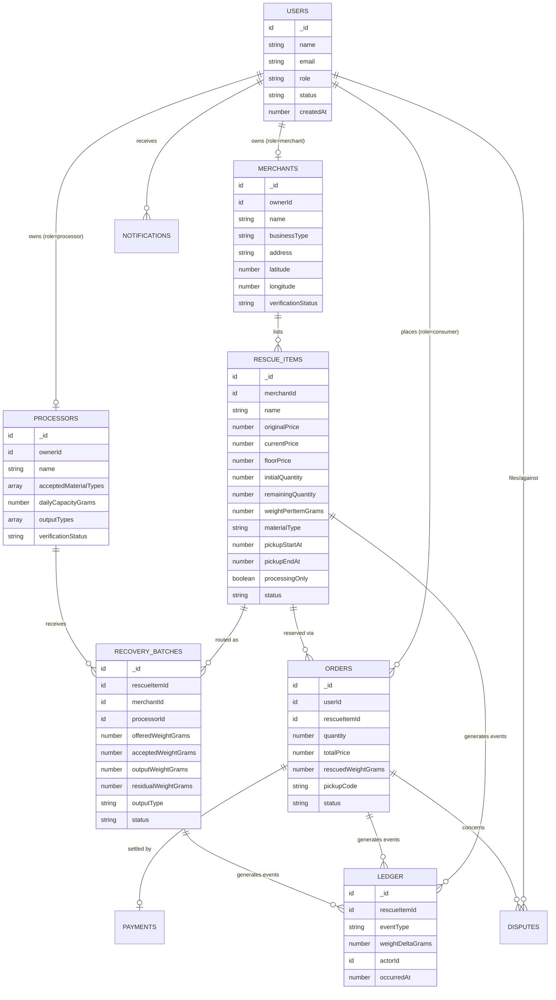
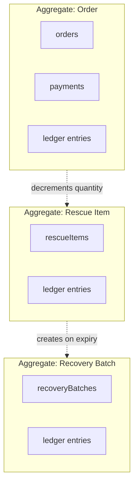

# Data Model — Cirquo

**Document type:** Domain reference  
**Status:** Living domain reference — target model plus source snapshot
**Last updated:** 2026-08-29

> This document describes **entities, relationships, and cardinality** at a conceptual level. For the concrete Convex table definitions, field types, and indexes, see [DATABASE.md](DATABASE.md). For lifecycle rules, see [STATE_MACHINE.md](STATE_MACHINE.md).

> **Current boundary.** The entity diagram is the target MVP model. The current
> 10-table schema already contains `processors`, `materialFlowLedger`, and
> `payments`; routing, disputes, notifications, and impact aggregation remain
> future work. See [IMPLEMENTATION_STATUS.md](../project/IMPLEMENTATION_STATUS.md).

---

## 1. Entity Relationship Overview



---

## 2. Entities

### 2.1 `users` — Identity

One row per human account. The `role` field discriminates behaviour.

| Relationship | Cardinality | Note |
|---|---|---|
| → `merchants` | 1 : 0..1 | Only when `role = 'merchant'` |
| → `processors` | 1 : 0..1 | Only when `role = 'processor'` |
| → `orders` | 1 : 0..* | Only when `role = 'consumer'` |
| → `ledger` (as actor) | 1 : 0..* | Any role can cause ledger events |

**Design decision — single user table with a role discriminator.**

| Option | Trade-off |
|---|---|
| Separate tables per role | Type-safe, but a person who is both a merchant and a consumer needs two accounts and two logins |
| **Single table + role field** ✅ | One identity, one session, one auth path. Role-specific data lives in profile tables |
| Single table with all fields nullable | Wide sparse rows, unclear which fields apply |

The MVP enforces one role per account. The schema does not preclude a future `roles: string[]` migration.

---

### 2.2 `merchants` — Merchant Profile

Business identity and, critically, **location**.

| Relationship | Cardinality | Note |
|---|---|---|
| `users` → | 0..1 : 1 | Owner |
| → `rescueItems` | 1 : 0..* | A merchant lists many items over time |
| → `recoveryBatches` | 1 : 0..* | Denormalised source reference |

`latitude` and `longitude` are effectively required. A merchant without coordinates cannot appear in map discovery and cannot be distance-ranked for [Circular Routing](../impact/ALGORITHM.md). They are typed optional in the current schema only because onboarding captures them in a second step.

---

### 2.3 `processors` — Processor Profile

**This table exists in the current 10-table schema.** Its owner, verification,
and routing-profile fields are available for onboarding; M4–M5 still own the
logic that uses those fields for routing and intake.

| Rule | Requires |
|---|---|
| RB-2 — never route incompatible material | `acceptedMaterialTypes` |
| RB-3 — never exceed facility capacity | `dailyCapacityGrams` |
| Impact attribution by output | `outputTypes` |

The current schema references `processorId: v.id('users')` on `recoveryBatches`, which points at the identity row rather than a facility profile. That works for "who accepted it" but carries none of the routing constraints.

| Relationship | Cardinality |
|---|---|
| `users` → | 0..1 : 1 |
| → `recoveryBatches` | 1 : 0..* |

---

### 2.4 `rescueItems` — Rescue Item (Aggregate Root)

The centre of the model. Almost every query and every business rule touches it.

| Relationship | Cardinality | Note |
|---|---|---|
| `merchants` → | 1 : 0..* | Owner |
| → `orders` | 1 : 0..* | **One item can have many orders** — partial rescue |
| → `recoveryBatches` | 1 : 0..* | Usually 0 or 1; more than 1 if re-routed after decline |
| → `ledger` | 1 : 1..* | Every item has at least a `LISTED` event |

**Why one item can have many orders.** A merchant lists 5 portions. Three consumers reserve 1, 2, and 1. Two portions remain and expire into a Recovery Batch. This partial-rescue capability is what makes the weight conservation invariant meaningful — a single item can simultaneously produce rescued, recovered, and residual weight.

```
Rescue Item: 5 portions × 500g = 2500g listed
├── Order A: 1 portion  →  500g rescued
├── Order B: 2 portions → 1000g rescued
├── Order C: 1 portion  →  500g rescued (no-show → released)
└── Recovery Batch: 1 unclaimed + 1 no-show = 1000g
                    ├── 800g recovered (compost)
                    └── 200g residual
Total: 2000g rescued + 800g recovered + 200g residual = 3000g ✗

Corrected — the no-show portion is not rescued:
Total: 1500g rescued + 800g recovered + 200g residual = 2500g ✓
```

The second calculation is correct. A `RESCUED` ledger event is written only on verified pickup, never on reservation or payment.

---

### 2.5 `orders` — Consumer Claim

| Relationship | Cardinality |
|---|---|
| `users` → | 1 : 0..* |
| `rescueItems` → | 1 : 0..* |
| → `payments` | 1 : 0..1 |
| → `disputes` | 1 : 0..* |
| → `ledger` | 1 : 1..* |

**`rescuedWeightGrams` is a snapshot, not a derived value.** It is computed as `quantity × weightPerItemGrams` at reservation time and never recalculated. If a merchant later edits the listing's weight, historical orders keep their original figure. Recomputing it would retroactively change impact history, which defeats the purpose of an append-only ledger.

---

### 2.6 `recoveryBatches` — Recovery Batch

| Relationship | Cardinality |
|---|---|
| `rescueItems` → | 1 : 0..* |
| `merchants` → | 1 : 0..* | Denormalised for merchant dashboard queries |
| `processors` → | 0..1 : 0..* | Null until matched |
| → `ledger` | 1 : 1..* |

**Four distinct weight fields exist for a reason:**

| Field | Source | Trust level |
|---|---|---|
| `offeredWeightGrams` | Merchant estimate | Low — declared |
| `acceptedWeightGrams` | Processor scale | High — measured |
| `outputWeightGrams` | Processor scale | High — measured |
| `residualWeightGrams` | Processor scale | High — measured |

Impact calculations prefer `acceptedWeightGrams` over `offeredWeightGrams` whenever it exists. The variance between the two is itself a useful admin signal about merchant estimation quality — see [RISKS.md](../business/RISKS.md) PRD-04.

**Also required:** `declinedByProcessorIds: Id<'processors'>[]` and `routingAttempts: number`, so the retry loop in [STATE_MACHINE.md](STATE_MACHINE.md) §4.4 never re-offers a batch to a processor that already declined it.

---

### 2.7 `materialFlowLedger` — Material Flow Ledger

**This table exists and is append-only in the current source.** Implemented M1–M3
mutations write the events needed for listing, reservation, payment, and
payment-hold expiry. Ledger aggregation and the later lifecycle write paths
remain target work.

| Relationship | Cardinality |
|---|---|
| `rescueItems` → | 1 : 1..* |
| `users` (actor) → | 1 : 0..* |
| `orders` → | 0..1 : 0..* | Optional, for order-scoped events |
| `recoveryBatches` → | 0..1 : 0..* | Optional, for batch-scoped events |

It is **append-only**: no mutation ever updates or deletes a row. Full specification in [MATERIAL_LEDGER.md](../impact/MATERIAL_LEDGER.md).

---

### 2.8 Supporting Entities

| Entity | Purpose | Relationship |
|---|---|---|
| `payments` | Midtrans transaction record, webhook payload, refund state | `orders` 1 : 0..1 |
| `notifications` | Per-user notification queue and read state | `users` 1 : 0..* |
| `disputes` | No-show reports and Admin adjudication | `orders` 1 : 0..*, `users` 1 : 0..* |
| `sessions` | Auth session tokens | `users` 1 : 0..* |
| `impactSnapshots` | Optional pre-aggregated daily rollups (performance only, never a source of truth) | — |

---

## 3. Aggregate Boundaries

Which entities must be written together in a single transaction.



| Aggregate | Root | Transactional members | Invariant enforced |
|---|---|---|---|
| Rescue Item | `rescueItems` | Its ledger entries | `remainingQuantity` never negative; `currentPrice ≥ floorPrice` |
| Order | `orders` | `payments`, its ledger entries | Quantity claimed matches quantity decremented |
| Recovery Batch | `recoveryBatches` | Its ledger entries | `residual ≤ accepted` |

**Cross-aggregate writes are still atomic in Convex.** A Convex mutation is a single transaction across all tables, so `reserveItem` can decrement `rescueItems.remainingQuantity`, insert an `orders` row, and insert a ledger entry with no possibility of partial application. This is a meaningful advantage over an eventual-consistency design and removes the need for sagas or compensating transactions in the MVP. See [BACKEND.md](../architecture/BACKEND.md).

---

## 4. Denormalisation Decisions

Convex has no joins. Every cross-table reference costs an additional read. These are the deliberate denormalisations, with justification.

| Denormalised field | Lives on | Duplicates | Why |
|---|---|---|---|
| `merchantId` | `recoveryBatches` | Reachable via `rescueItems.merchantId` | Merchant dashboard queries batches by merchant directly; avoids N+1 |
| `merchantName` | Client-side view types | `merchants.name` | Every listing card shows the merchant name; resolving per-item is wasteful |
| `rescuedWeightGrams` | `orders` | `quantity × weightPerItemGrams` | **Not denormalisation — a deliberate snapshot.** Must not change if the listing is edited |
| `weightDeltaGrams` | `materialFlowLedger` | Derivable from the entity at the time | Makes the ledger self-contained and independently auditable |

**Rejected denormalisations:**

| Considered | Rejected because |
|---|---|
| Running impact totals on `merchants` | Would become a second source of truth competing with the ledger. Aggregate on read instead |
| Cached `circularityRate` on `users` | Same problem. Stale totals that disagree with the ledger destroy the product's credibility |
| Copying `pickupEndAt` onto `orders` | Cheap to read from the parent item; duplication risks divergence after an edit |

**Rule of thumb applied throughout:** denormalise for *query performance*, never for *impact numbers*. Impact is always aggregated from ledger entries at read time.

---

## 5. Query Access Patterns

Indexes exist to serve these patterns. See [DATABASE.md](DATABASE.md) for the concrete index definitions.

| # | Pattern | Consumer of the query | Index needed |
|---|---|---|---|
| Q1 | Active items near a location | Consumer map/list | `by_status` + client-side distance filter |
| Q2 | Items for one merchant | Merchant surplus list | `by_merchant` |
| Q3 | Orders for one consumer | Order history | `by_user` |
| Q4 | Orders for one rescue item | Merchant pickup screen | `by_item` |
| Q5 | Order by pickup code | Pickup verification | `by_pickup_code` |
| Q6 | Batches offered to one processor | Processor queue | `by_processor_status` |
| Q7 | Unrouted batches | Routing scheduler | `by_status` |
| Q8 | Items with a closed window still active | Expiry scheduler | `by_status_pickup_end` |
| Q9 | Ledger entries for one item | Admin audit trail | `by_rescue_item` |
| Q10 | Ledger entries in a time range | Impact aggregation | `by_occurred_at` |
| Q11 | Ledger entries by actor | Personal impact dashboard | `by_actor` |
| Q12 | Unread notifications for a user | Notification badge | `by_user_read` |

**Q1 is the weak point.** Convex has no geospatial index, so "items within 3 km" cannot be an index scan. The MVP fetches `active` items and filters by Haversine distance in application code. This is acceptable at pilot scale (hundreds of active items) and is the leading candidate for the PostgreSQL/PostGIS migration trigger documented in [DATABASE.md](DATABASE.md).

**Q10 and Q11 are the impact queries.** They will be the highest-volume reads in the system once dashboards exist, because every dashboard load aggregates ledger entries. If dashboard latency becomes a problem, the mitigation is `impactSnapshots` daily rollups — a cache, never a source of truth.

---

## 6. Data Volume Projections

Sizing informs whether read-time aggregation is sustainable.

**Assumptions:** 25 merchants × 2 listings/day = 50 items/day. Average 3 orders per item. Average 4 ledger events per item plus 3 per order.

| Table | Rows/day | Rows/year | Notes |
|---|---:|---:|---|
| `rescueItems` | 50 | ~18,000 | |
| `orders` | 150 | ~55,000 | |
| `recoveryBatches` | ~15 | ~5,500 | ~30% of items go unclaimed |
| `materialFlowLedger` | ~650 | **~240,000** | Grows fastest; never pruned |
| `notifications` | ~400 | ~146,000 | Prunable after read + 30 days |

**Conclusion:** At single-city pilot scale, read-time ledger aggregation over ~240k rows/year is well within Convex's capability. Pre-aggregation is a Phase 2+ optimisation, not an MVP requirement. At 10 cities the ledger reaches ~2.4M rows/year, at which point daily `impactSnapshots` rollups become necessary.

**The ledger is never pruned.** It is the audit trail. Growth is the point.

---

## 7. Referential Integrity

Convex does not enforce foreign keys. Integrity is the application's responsibility.

| Concern | Mitigation |
|---|---|
| Orphaned `orders` after item deletion | **Never hard-delete a Rescue Item.** Use `moderated` status instead |
| Orphaned ledger entries | Ledger rows are never deleted; the referenced item is never deleted |
| Dangling `processorId` | Processors are deactivated, never deleted |
| Stale `merchantId` on batches | Merchants are suspended, never deleted |

**Soft-delete is the universal policy.** Hard deletion is incompatible with an append-only audit trail — if an item can vanish, its ledger entries reference nothing and the weight conservation invariant becomes uncheckable.

The only exception is `sessions`, which are genuinely ephemeral and safe to delete.

---

## 8. Naming Reconciliation

Divergences between the current codebase and the domain language of [DOMAIN.md](DOMAIN.md).

| Code (current) | Domain term | Decision |
|---|---|---|
| `surplusItems` | Rescue Item | Keep the table name to avoid a disruptive rename; use "Rescue Item" in all UI copy and documentation |
| `SurplusStatus` | Rescue Item status | Acceptable internal name |
| `RecoveryStatus` | Recovery Batch status | ✅ Aligned |
| `weightPerItemGrams` | Weight per unit | ✅ Aligned |
| `merchantValueRecovered` | Revenue recovered | Rename in the impact type for clarity |

### Required schema additions

| Addition | Blocks without it |
|---|---|
| `materialFlowLedger` table | All of Impact Tracking; the platform's core differentiator |
| `processors` table | Routing eligibility (RB-2, RB-3) |
| `rescueItems.floorPrice` | Pricing invariant RI-2 |
| `rescueItems.materialType` | Routing eligibility RB-2 |
| `rescueItems.processingOnly` | Requirement MER-07 |
| `rescueItems` statuses `reserved_partial`, `recovered`, `residual` | Circularity rate is uncomputable without `recovered` / `residual` |
| `orders` statuses `disputed`, `refunded` | ADM-05 dispute resolution, PAY-03 refunds |
| `recoveryBatches` statuses `offered`, `unroutable` | Diversion-rate KPI conflates decline with failure |
| `recoveryBatches.outputType`, `outputWeightGrams` | Requirement PRC-04 |
| `payments` table | Midtrans reconciliation and refunds |
| `sessions` table | Persistent auth |
| `notifications` table | NOT-01 … NOT-05 |
| `disputes` table | ADM-05 |

See [DATABASE.md](DATABASE.md) for the complete target schema.

---

## Related Documents

- [DOMAIN.md](DOMAIN.md) — Entity definitions, domain rules, ubiquitous language
- [STATE_MACHINE.md](STATE_MACHINE.md) — Status transitions and guards
- [DATABASE.md](DATABASE.md) — Convex schema, indexes, migration plan
- [MATERIAL_LEDGER.md](../impact/MATERIAL_LEDGER.md) — Ledger event catalogue
- [BACKEND.md](../architecture/BACKEND.md) — Transaction semantics and function organisation
- [API.md](../api/API.md) — Function contracts built on this model
- [IMPACT.md](../impact/IMPACT.md) — How ledger data becomes metrics

---

**Built for DSDC ANFORCOM 2026**  
**Platform:** Cirquo — Closing the Loop, Saving Every Meal
