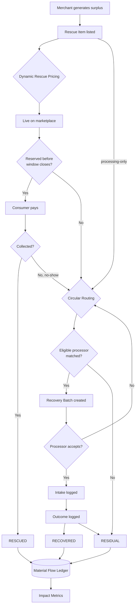
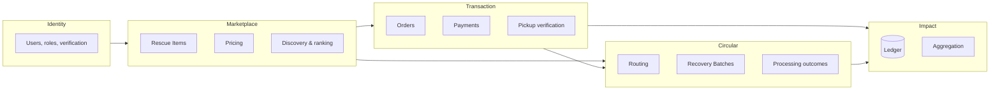

# Domain Model — Cirquo

**Document type:** Domain reference  
**Status:** Draft v1.0  
**Last updated:** 2026-08-06

> This document defines the **ubiquitous language** of Cirquo. Every other document, every variable name, every UI string, and every database field should use these terms exactly as defined here. When code and this document disagree, one of them is a bug.

---

## 1. Core Concept

Cirquo models a single physical reality: **a quantity of surplus food moving through a system until it reaches a terminal outcome.**

Everything in the domain exists to answer one question for any kilogram of surplus:

> Where did it go?

There are exactly three terminal answers:

| Outcome | Meaning | Desirability |
|---|---|---|
| **Rescued** | A Consumer collected and consumed it | Best — highest value retention |
| **Recovered** | An Organic Processor converted it into compost, BSF larvae, animal feed, or biogas | Good — value recovered, landfill avoided |
| **Residual** | Neither happened | Failure — this is what we measure ourselves against |

The sum of these three always equals the total surplus that entered the system. This invariant is the backbone of [Impact Tracking](../impact/IMPACT.md).

```
surplus_generated = rescued + recovered + residual
```

---

## 2. Actors

| Actor | Definition | Physical reality |
|---|---|---|
| **Consumer** | An individual who discovers, reserves, pays for, and collects a Rescue Item | A person with a phone who walks or rides to a shop |
| **Merchant** | A food business that generates surplus and lists it | A bakery, restaurant, cafe, caterer, or grocery |
| **Organic Processor** | A facility that converts organic material into a new resource | A BSF/maggot farm, composting site, or biogas plant |
| **Admin** | The platform operator | Cirquo staff performing verification, moderation, and dispute resolution |

Actors are modelled as a single `users` table with a `role` discriminator, plus role-specific profile tables. See [DATA_MODEL.md](DATA_MODEL.md).

### Why not separate user tables?

A person may plausibly be both a Consumer and a Merchant (a bakery owner who also rescues food). A single identity with a role assignment keeps that possible without duplicate accounts. The MVP restricts one role per account; the schema does not preclude relaxing this later.

---

## 3. Core Entities

### 3.1 Rescue Item

**Definition:** A unit of surplus food listed by a Merchant, available for a Consumer to reserve, or eligible to be routed to an Organic Processor.

This is the **aggregate root** of the domain. Almost every business rule attaches to it.

| Attribute | Why it exists |
|---|---|
| Merchant | Who is responsible for the food |
| Name, description, image | Consumer-facing identity |
| Original price | Reference point for the discount, and the basis for "money saved" |
| Current price | What the Consumer actually pays; set by [Dynamic Rescue Pricing](../impact/ALGORITHM.md) |
| Floor price | Merchant-defined minimum; the pricing engine may never go below it |
| Initial quantity / remaining quantity | Supports partial rescue — three of five portions sold, two routed |
| Weight per unit (grams) | **The most important field in the system.** Every impact metric is a weight calculation |
| Pickup window (start, end) | Defines when a Consumer may collect, and when the item becomes eligible for routing |
| Dietary tags | Merchant-declared attributes for filtering — *not* a safety guarantee |
| Material type | What kind of organic material this is, used by Circular Routing |
| Status | Position in the lifecycle ([STATE_MACHINE.md](STATE_MACHINE.md)) |
| Processing-only flag | Item skips the marketplace entirely — e.g. bakery trim, vegetable off-cuts |

> **Naming note:** The current codebase table is `surplusItems`. The domain term is **Rescue Item**. This is an acknowledged inconsistency; see [DATA_MODEL.md](DATA_MODEL.md) §Naming Reconciliation.

**Key invariant:** `remainingQuantity ≤ initialQuantity` and `remainingQuantity ≥ 0`.

**Key invariant:** `currentPrice ≥ floorPrice` at all times.

---

### 3.2 Order

**Definition:** A Consumer's claim on some quantity of a Rescue Item, including payment and collection.

An Order is the vehicle for the **Rescued** outcome. It does not represent delivery — Cirquo has no delivery. It represents a reservation plus a physical collection at the Merchant's location.

| Attribute | Why it exists |
|---|---|
| Consumer | Who claimed it |
| Rescue Item | What was claimed |
| Quantity | How many units |
| Total price | What was paid, locked at reservation time |
| Rescued weight (grams) | `quantity × weightPerUnit`, snapshotted so later listing edits cannot retroactively change impact history |
| Pickup code | The verification token the Merchant checks |
| Status | Position in the order lifecycle |
| Payment reference | Midtrans transaction identifier |

**Why weight is snapshotted:** If a Merchant edits a listing's weight after an order exists, historical impact figures must not change. The ledger is append-only precisely to prevent retroactive rewriting of impact history.

---

### 3.3 Recovery Batch

**Definition:** A quantity of organic material routed from a Merchant to an Organic Processor, tracked from offer through to processing outcome.

A Recovery Batch is the vehicle for the **Recovered** outcome.

| Attribute | Why it exists |
|---|---|
| Merchant | Source of the material |
| Rescue Item | Provenance — which listing this material came from |
| Processor | Who received it (null until matched/accepted) |
| Offered weight (grams) | What the Merchant says is available — a *declared* figure |
| Accepted weight (grams) | What the Processor measured on intake — a *measured* figure |
| Output type | Compost, BSF larvae, animal feed, or biogas |
| Output quantity | How much usable resource was produced |
| Residual weight (grams) | What could not be processed |
| Status | Position in the recovery lifecycle |

**Declared vs. measured weight is a deliberate distinction.** Merchant estimates are unreliable; processor intake weights are measured on a scale. The system stores both and surfaces the variance. Impact calculations prefer the measured figure when available. See [IMPACT.md](../impact/IMPACT.md).

---

### 3.4 Material Flow Ledger Entry

**Definition:** An immutable record that a specific event occurred to a specific Rescue Item at a specific time, caused by a specific actor.

This is the platform's differentiator and its source of truth. Full specification in [MATERIAL_LEDGER.md](../impact/MATERIAL_LEDGER.md).

| Attribute | Why it exists |
|---|---|
| Rescue Item | What this event concerns |
| Event type | What happened (see §5) |
| Weight delta (grams) | How much material moved, and in which direction |
| Actor | Who caused it |
| Timestamp | When |
| Metadata | Event-specific detail (price at the time, processor id, output type) |

**Absolute rules:**
- Append-only. Never updated. Never deleted.
- Written inside the same transaction as the state change it describes.
- Every impact number in the product is derived from these entries and nothing else.

---

### 3.5 Merchant Profile

**Definition:** The business identity and location of a food business.

Location (`latitude`, `longitude`) is required, because both Consumer discovery and Circular Routing are distance-driven. A Merchant without coordinates cannot participate in the marketplace.

### 3.6 Processor Profile

**Definition:** The business identity, location, capacity, and material acceptance rules of an Organic Processor.

| Attribute | Why it exists |
|---|---|
| Accepted material types | Routing must never send meat waste to a facility that only takes vegetable matter |
| Daily intake capacity (kg) | Routing must not exceed what the facility can physically handle |
| Output types | What this facility produces — used for impact attribution |
| Operating hours | A batch offered at 23:00 to a facility that closes at 17:00 will not be collected |

---

## 4. The Circular Flow



**Read this diagram as the definition of the product.** Everything else — the map, the payment flow, the dashboards — is machinery serving this flow.

Note the two paths into Circular Routing: an item that nobody bought, and an item that was never intended for sale. Both are legitimate. Note also that a consumer no-show does not produce residual waste automatically — the material re-enters routing.

---

## 5. Domain Events

Every event below writes exactly one Material Flow Ledger entry.

| Event | Trigger | Weight delta | Terminal? |
|---|---|---|---|
| `LISTED` | Merchant publishes a Rescue Item | `+total weight` (enters system) | No |
| `PRICE_ADJUSTED` | Dynamic Rescue Pricing changes the price | 0 | No |
| `RESERVED` | Consumer reserves a quantity | 0 (claimed, not yet moved) | No |
| `PAID` | Midtrans confirms payment | 0 | No |
| `RESCUED` | Merchant verifies the pickup code | `−rescued weight` | ✅ Terminal |
| `CANCELLED` | Consumer cancels within grace period | 0 (returns to available) | No |
| `EXPIRED` | Pickup window closes with stock remaining | 0 | No |
| `ROUTED` | Circular Routing matches a processor | 0 (in transit) | No |
| `ROUTING_FAILED` | No eligible processor found | `−residual weight` | ✅ Terminal |
| `INTAKE_ACCEPTED` | Processor confirms receipt and measured weight | 0 | No |
| `INTAKE_DECLINED` | Processor rejects the batch | 0 (returns to routing) | No |
| `PROCESSED` | Processor logs the outcome | `−recovered weight` | ✅ Terminal |
| `MODERATED` | Admin removes a listing | `−weight` | ✅ Terminal |

**Terminal events close the loop for a quantity of material.** An item is fully accounted for when the sum of its terminal event weights equals its listed weight.

**Partial outcomes are normal.** A 10 kg listing might produce a 6 kg `RESCUED` event, a 3 kg `PROCESSED` event, and a 1 kg residual within that `PROCESSED` event. The invariant holds at the weight level, not the item level.

---

## 6. Domain Rules

Business rules that hold regardless of implementation. These are the assertions to test.

### Rescue Item

| # | Rule |
|---|---|
| RI-1 | A Rescue Item cannot be published without weight, quantity, and a pickup window |
| RI-2 | `currentPrice` may never be below `floorPrice` |
| RI-3 | `currentPrice` must be below `originalPrice` — a Rescue Item is by definition discounted |
| RI-4 | A Rescue Item may not be edited once any quantity is reserved |
| RI-5 | A Rescue Item may be cancelled only while `remainingQuantity == initialQuantity` |
| RI-6 | `pickupEndAt` must be after `pickupStartAt` |
| RI-7 | A processing-only item never appears in Consumer discovery |
| RI-8 | Only a verified Merchant may publish |

### Order

| # | Rule |
|---|---|
| OR-1 | Reservation quantity may not exceed `remainingQuantity` |
| OR-2 | Reservation decrements `remainingQuantity` immediately, before payment — this prevents overselling during checkout |
| OR-3 | An unpaid reservation expires after a fixed hold period and returns quantity to stock |
| OR-4 | `rescuedWeightGrams` is snapshotted at reservation and never recalculated |
| OR-5 | Pickup requires code verification by the Merchant |
| OR-6 | Pickup cannot be confirmed outside the pickup window without an Admin override |
| OR-7 | Cancellation is permitted only within the grace period and only before pickup |
| OR-8 | A cancelled or expired paid order triggers a refund |

### Recovery Batch

| # | Rule |
|---|---|
| RB-1 | A batch may only be created for a Rescue Item that is expired, unclaimed, or processing-only |
| RB-2 | A batch may only be routed to a Processor whose accepted material types include the item's material type |
| RB-3 | A batch may not be routed to a Processor at or above daily capacity |
| RB-4 | `acceptedWeightGrams` is set only by the Processor, never by the Merchant |
| RB-5 | `residualWeightGrams ≤ acceptedWeightGrams` |
| RB-6 | A declined batch returns to the routing pool and may be re-matched |
| RB-7 | A batch with no eligible processor after N attempts is marked residual |

### Ledger

| # | Rule |
|---|---|
| LG-1 | Every state transition writes exactly one ledger entry |
| LG-2 | Ledger entries are never updated or deleted |
| LG-3 | The ledger write occurs in the same transaction as the state change |
| LG-4 | Impact metrics are computed only from ledger entries |
| LG-5 | The sum of terminal event weights for an item must equal its listed weight |

---

## 7. Bounded Contexts

Cirquo is small enough to be a single deployable, but the logical boundaries matter for code organisation.



| Context | Owns | Depends on |
|---|---|---|
| **Identity** | Users, roles, profiles, verification | — |
| **Marketplace** | Rescue Items, pricing, discovery, ranking | Identity |
| **Transaction** | Orders, payments, pickup verification | Marketplace, Identity |
| **Circular** | Routing decisions, Recovery Batches, processing outcomes | Marketplace, Transaction |
| **Impact** | Ledger, aggregation, CO2e estimation | All of the above (read-only) |

**Impact is strictly downstream.** It reads the ledger and never writes domain state. This one-way dependency is what makes impact numbers trustworthy.

---

## 8. Ubiquitous Language

Terms to use. Terms to avoid. This table is enforceable — deviations in code or UI copy are defects.

| ✅ Use | ❌ Avoid | Note |
|---|---|---|
| Cirquo | CirQuo, CircQuo, Cirquo App | Exact casing |
| Rescue Item | Listing, Product, Offer, Deal, Surprise Bag | |
| Rescue (v/n) | Purchase, Sale, Buy | A rescue is not a sale |
| Rescued | Sold, Delivered | |
| Recovered / Diverted | Composted, Wasted, Disposed | Both terms acceptable; prefer *Recovered* in UI |
| Residual | Waste, Trash, Loss | Residual is measured, not hidden |
| Circular Routing | Forwarding, Disposal, Redirect | |
| Material Flow Ledger | Event log, Audit log, Transaction log | |
| Dynamic Rescue Pricing | Auto-discount, Smart pricing, AI pricing | Never call it AI — it is a formula |
| Organic Processor | Waste handler, Partner, Recycler | |
| Circularity rate | Recovery rate, Success rate | |
| Pickup window | Delivery time, Collection slot | There is no delivery |
| Dietary preference filtering | Allergy matching, Allergen-safe | Legal distinction — see [RISKS.md](../business/RISKS.md) LEGAL-03 |
| Estimated CO2e | CO2e saved, Carbon offset | Always signal estimation |

### Phrases that are never acceptable

- "Zero waste"
- "100% closed-loop"
- "Guaranteed safe"
- "AI-powered pricing"

Each of these is an overclaim that cannot survive a judge's follow-up question. See the prepared Q&A defences in [RISKS.md](../business/RISKS.md) §8.

---

## 9. Units and Conventions

| Concern | Convention | Rationale |
|---|---|---|
| Weight | Integer **grams** in storage; kilograms in display | Avoids floating-point drift in cumulative impact sums |
| Currency | Integer **IDR**, no decimals | Rupiah has no practical subunit |
| Time | Integer **epoch milliseconds (UTC)** in storage; WIB at render | Prevents the timezone class of bugs (see [RISKS.md](../business/RISKS.md) TECH-06) |
| Distance | **Metres** in calculation; km in display | |
| Percentages | Stored 0–100 as a number, not a fraction | Matches UI expectation and avoids ×100 errors |
| Identifiers | Convex document IDs | Do not invent parallel ID schemes |
| Coordinates | `latitude` / `longitude` as separate floats | Convex has no geospatial type; distance is computed in application code |

**Weight in grams is non-negotiable.** Every impact figure is a sum of weights. Storing kilograms as floats accumulates rounding error across thousands of transactions, and the entire credibility of the platform rests on those sums being exact.

---

## 10. Naming Reconciliation

The current codebase predates this document. Known divergences between code and domain language:

| Code (current) | Domain term | Action |
|---|---|---|
| `surplusItems` table | Rescue Item | Keep the table name; use "Rescue Item" in all UI and documentation |
| `recoveryBatches` table | Recovery Batch | ✅ Aligned |
| `SurplusStatus` type | Rescue Item status | Acceptable — internal type name |
| `weightPerItemGrams` | Weight per unit | ✅ Aligned in intent |
| No `floorPrice` field | Floor price | 📋 **Must be added** — RI-2 cannot be enforced without it |
| No `materialType` field | Material type | 📋 **Must be added** — RB-2 cannot be enforced without it |
| No `materialFlowLedger` table | Material Flow Ledger | 📋 **Must be added** — the entire impact system depends on it |
| No processor profile table | Processor Profile | 📋 **Must be added** — RB-2, RB-3 cannot be enforced without it |

See [DATABASE.md](DATABASE.md) for the full target schema and the migration path from the current five tables.

---

## Related Documents

- [STATE_MACHINE.md](STATE_MACHINE.md) — Formal status transitions and guards
- [DATA_MODEL.md](DATA_MODEL.md) — Entity relationships and cardinality
- [DATABASE.md](DATABASE.md) — Convex schema, indexes, migration plan
- [MATERIAL_LEDGER.md](../impact/MATERIAL_LEDGER.md) — Ledger design and integrity guarantees
- [ALGORITHM.md](../impact/ALGORITHM.md) — Pricing, routing, ranking, impact formulas
- [IMPACT.md](../impact/IMPACT.md) — Metric definitions and CO2e methodology
- [PRD.md](../product/PRD.md) — Functional requirements
- [ROLES.md](../spec/ROLES.md) — Actor capabilities and permissions

---

**Built for DSDC ANFORCOM 2026**  
**Platform:** Cirquo — Closing the Loop, Saving Every Meal
