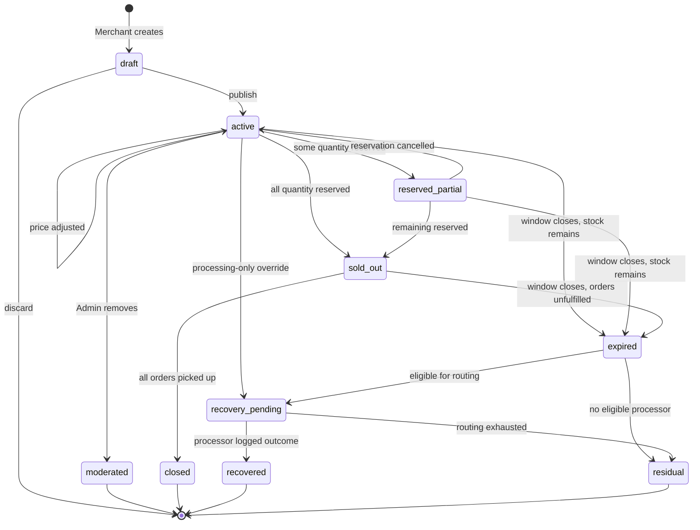
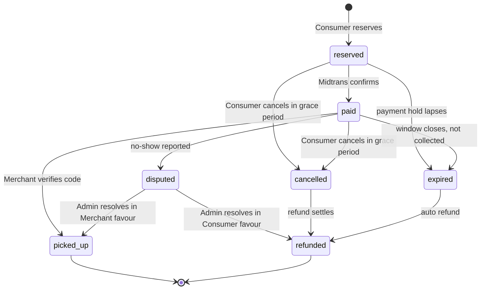
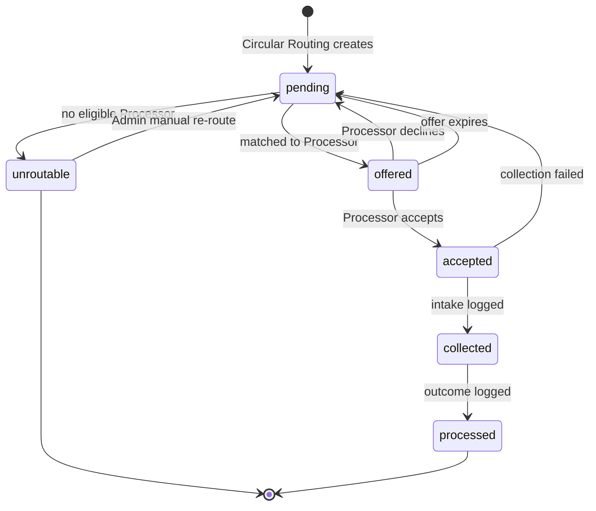
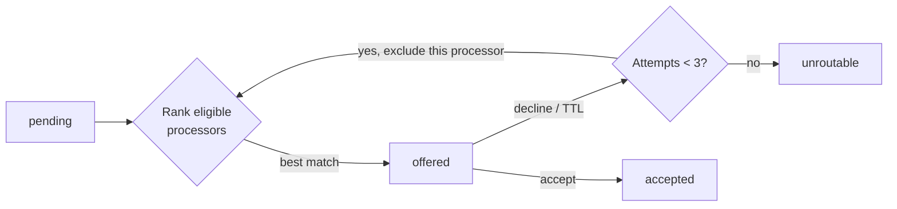
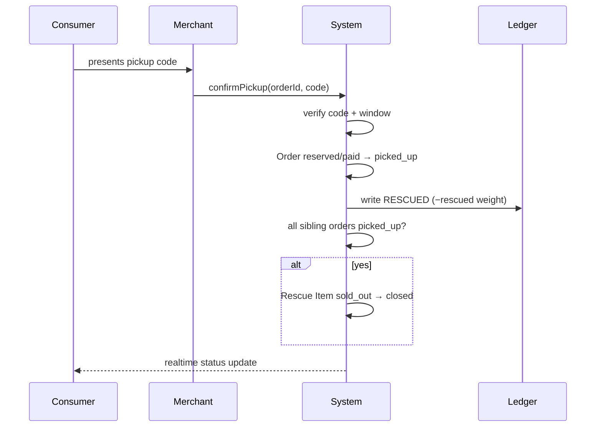
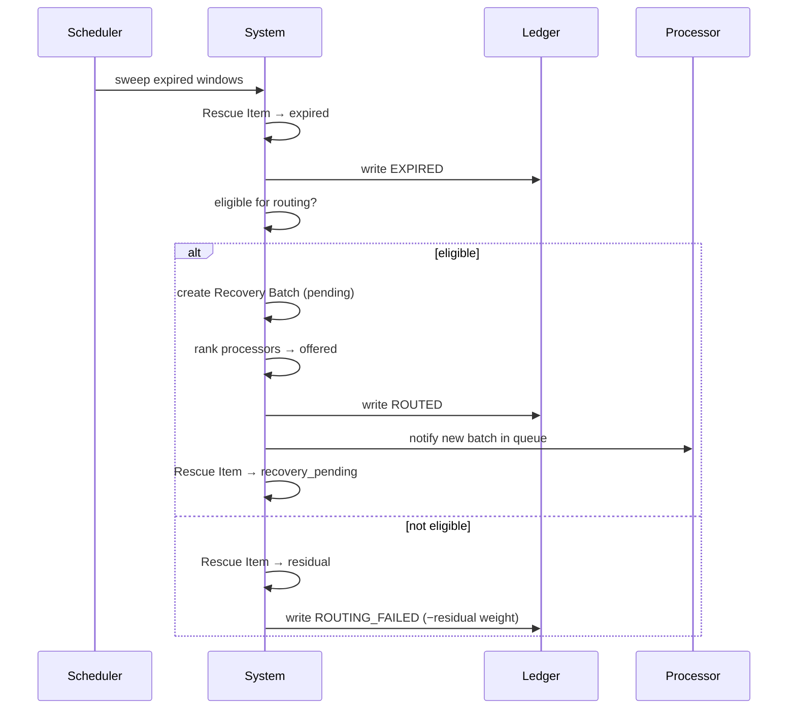
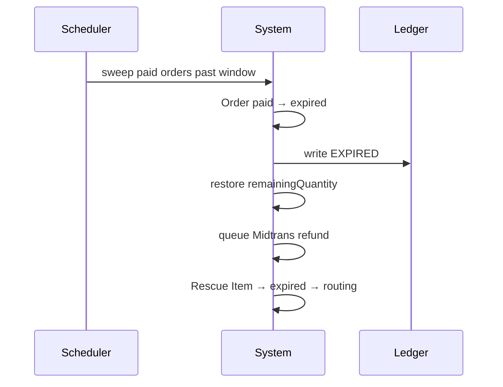

# State Machines — Cirquo

**Document type:** Domain reference  
**Status:** Draft v1.0  
**Last updated:** 2026-08-06

> Every status transition in Cirquo is defined here. If a transition is not in this document, it is not permitted. Each transition names the actor allowed to trigger it, the guard conditions that must hold, and the [Material Flow Ledger](../impact/MATERIAL_LEDGER.md) event it emits.

---

## 1. Why This Document Exists

Three entities have lifecycles: **Rescue Item**, **Order**, and **Recovery Batch**. They are coupled — an Order transition can force a Rescue Item transition, and a Rescue Item expiry can create a Recovery Batch.

Getting these transitions wrong produces the two worst failure modes in the product:

1. **Overselling** — two Consumers reserve the last portion because quantity was decremented after payment instead of at reservation.
2. **Untracked material** — an item leaves the system without a terminal ledger event, so impact numbers silently understate residual waste.

Both are prevented by enforcing the guards below **server-side**, inside the same Convex mutation as the ledger write.

---

## 2. Rescue Item State Machine

**Table:** `surplusItems` · **Type:** `SurplusStatus`

### 2.1 Diagram



### 2.2 Status Definitions

| Status | Meaning | Visible to Consumer? | Terminal? |
|---|---|:-:|:-:|
| `draft` | Created but not published | No | No |
| `active` | Live on the marketplace, stock available | Yes | No |
| `reserved_partial` | Some quantity reserved, some still available | Yes | No |
| `sold_out` | All quantity reserved, awaiting pickup | Yes (greyed) | No |
| `expired` | Pickup window closed with stock unclaimed | No | No |
| `recovery_pending` | Routed or awaiting routing to a Processor | No | No |
| `recovered` | Processor logged a processing outcome | No | ✅ |
| `residual` | No recovery path succeeded | No | ✅ |
| `closed` | Fully rescued by Consumers | No | ✅ |
| `moderated` | Removed by Admin | No | ✅ |

> **Schema gap:** The current `SurplusStatus` type is `draft | active | sold_out | expired | recovery_pending | closed`. Three states are missing: `reserved_partial`, `recovered`, `residual`. Without `recovered` and `residual` there is no way to distinguish a successful circular outcome from a failure, which makes circularity rate uncomputable. See [DATABASE.md](DATABASE.md).

### 2.3 Transition Table

| # | From | To | Actor | Guards | Ledger event |
|---|---|---|---|---|---|
| RI-T1 | — | `draft` | Merchant | Merchant verified | — |
| RI-T2 | `draft` | `active` | Merchant | Weight, quantity, pickup window, floor price all set; `currentPrice ≥ floorPrice`; `currentPrice < originalPrice`; `pickupEndAt > now` | `LISTED` |
| RI-T3 | `active` | `active` | System | Pricing engine tick; new price `≥ floorPrice` | `PRICE_ADJUSTED` |
| RI-T4 | `active` | `reserved_partial` | Consumer | `qty ≤ remainingQuantity`; `remainingQuantity − qty > 0` | `RESERVED` |
| RI-T5 | `active` / `reserved_partial` | `sold_out` | Consumer | `remainingQuantity − qty == 0` | `RESERVED` |
| RI-T6 | `reserved_partial` | `active` | Consumer / System | Reservation cancelled or payment hold expired | `CANCELLED` |
| RI-T7 | `active` / `reserved_partial` | `expired` | System (cron) | `now > pickupEndAt`; `remainingQuantity > 0` | `EXPIRED` |
| RI-T8 | `sold_out` | `closed` | Merchant | All child orders `picked_up` | — (order-level `RESCUED` events already recorded) |
| RI-T9 | `sold_out` | `expired` | System (cron) | `now > pickupEndAt`; ≥1 order unfulfilled | `EXPIRED` |
| RI-T10 | `active` | `recovery_pending` | Merchant | Merchant marks processing-only | `ROUTED` |
| RI-T11 | `expired` | `recovery_pending` | System | ≥1 eligible Processor matched | `ROUTED` |
| RI-T12 | `expired` / `recovery_pending` | `residual` | System | No eligible Processor after max attempts | `ROUTING_FAILED` |
| RI-T13 | `recovery_pending` | `recovered` | Processor | Processing outcome logged | `PROCESSED` |
| RI-T14 | `active` / `draft` | `moderated` | Admin | Policy violation | `MODERATED` |

### 2.4 Forbidden Transitions

| Attempted | Why forbidden |
|---|---|
| `sold_out` → `active` | Would resurrect a listing with committed orders |
| `closed` → anything | Terminal |
| `recovered` → anything | Terminal; would rewrite impact history |
| `residual` → `recovered` | Material is already written off; re-recovery requires a new listing |
| `expired` → `active` | Pickup window cannot be reopened; create a new listing instead |
| `draft` → `sold_out` | Cannot reserve an unpublished item |

---

## 3. Order State Machine

**Table:** `orders` · **Type:** `OrderStatus`

### 3.1 Diagram



### 3.2 Status Definitions

| Status | Meaning | Quantity held? | Money state | Terminal? |
|---|---|:-:|---|:-:|
| `reserved` | Claimed, payment not confirmed | Yes | Pending | No |
| `paid` | Payment confirmed, awaiting collection | Yes | Captured | No |
| `picked_up` | Collected and verified | No (consumed) | Captured | ✅ |
| `cancelled` | Cancelled before pickup | No (released) | Refund due | No |
| `expired` | Window closed without collection | No (released) | Refund due | No |
| `disputed` | Conflicting accounts, Admin adjudicating | Yes | Held | No |
| `refunded` | Money returned | No | Refunded | ✅ |

> **Schema gap:** Current `OrderStatus` is `reserved | paid | picked_up | cancelled | expired`. Missing `disputed` and `refunded`. Without them, ADM-05 (dispute resolution) and PAY-03 (automatic refund) have nowhere to record their outcome.

### 3.3 Transition Table

| # | From | To | Actor | Guards | Ledger event | Side effects |
|---|---|---|---|---|---|---|
| OR-T1 | — | `reserved` | Consumer | Item `active`/`reserved_partial`; `qty ≤ remainingQuantity`; Consumer not suspended | `RESERVED` | Decrement `remainingQuantity`; snapshot `rescuedWeightGrams`; generate pickup code |
| OR-T2 | `reserved` | `paid` | System (webhook) | Valid Midtrans signature; amount matches | `PAID` | Notify Consumer + Merchant |
| OR-T3 | `reserved` | `expired` | System (cron) | Payment hold exceeded (15 min) | `CANCELLED` | Restore `remainingQuantity` |
| OR-T4 | `reserved` / `paid` | `cancelled` | Consumer | Within grace period; `now < pickupStartAt` | `CANCELLED` | Restore `remainingQuantity`; queue refund if paid |
| OR-T5 | `paid` | `picked_up` | Merchant | Pickup code matches; `now` within pickup window (or Admin override) | **`RESCUED`** | Record rescued weight; update impact |
| OR-T6 | `paid` | `expired` | System (cron) | `now > pickupEndAt` | `EXPIRED` | Queue refund; material re-enters routing |
| OR-T7 | `paid` | `disputed` | Consumer / Merchant | No-show report filed | — | Notify Admin; hold funds |
| OR-T8 | `disputed` | `picked_up` | Admin | Evidence favours Merchant | `RESCUED` | Record rescued weight |
| OR-T9 | `disputed` | `refunded` | Admin | Evidence favours Consumer | `EXPIRED` | Issue refund; material re-enters routing |
| OR-T10 | `cancelled` / `expired` | `refunded` | System | Midtrans refund confirmed | — | Notify Consumer |

### 3.4 Critical Rules

**OR-T1 decrements quantity at reservation, not at payment.** This is deliberate and is the single most important guard in the system. Decrementing at payment allows two Consumers to both reach checkout for the same last portion; one will fail after paying, which is unrecoverable from a trust perspective.

**The 15-minute payment hold** (OR-T3) is the counterweight. It prevents a malicious or abandoned reservation from locking stock indefinitely. Fifteen minutes is long enough to complete a Midtrans flow on a slow connection and short enough that stock recirculates within a typical pickup window.

**A no-show does not create residual waste.** OR-T6 releases the material back into the routing pool. The Consumer failed; the material can still be recovered. This distinction matters for the circularity rate — a failed order is a marketplace failure, not an environmental one.

---

## 4. Recovery Batch State Machine

**Table:** `recoveryBatches` · **Type:** `RecoveryStatus`

### 4.1 Diagram



### 4.2 Status Definitions

| Status | Meaning | Processor assigned? | Terminal? |
|---|---|:-:|:-:|
| `pending` | Awaiting a routing match | No | No |
| `offered` | Offered to a specific Processor, awaiting response | Yes | No |
| `accepted` | Processor committed to taking it | Yes | No |
| `collected` | Physically received, intake weight measured | Yes | No |
| `processed` | Outcome logged: output type, output qty, residual qty | Yes | ✅ |
| `unroutable` | No Processor could take it | No | ✅ (becomes residual) |

> **Schema gap:** Current `RecoveryStatus` is `pending | accepted | collected | processed | rejected`. The target model replaces `rejected` with `offered` + `unroutable`. `rejected` conflates "this Processor said no" (recoverable — try another) with "nobody can take it" (terminal residual). That conflation makes the diversion-rate KPI meaningless.

### 4.3 Transition Table

| # | From | To | Actor | Guards | Ledger event |
|---|---|---|---|---|---|
| RB-T1 | — | `pending` | System | Rescue Item `expired` with stock, or processing-only | — |
| RB-T2 | `pending` | `offered` | System | Processor accepts the material type; below daily capacity; within max routing distance | `ROUTED` |
| RB-T3 | `pending` | `unroutable` | System | No eligible Processor after max attempts (default 3) | `ROUTING_FAILED` |
| RB-T4 | `offered` | `accepted` | Processor | Offer not expired; Processor verified | `INTAKE_ACCEPTED` |
| RB-T5 | `offered` | `pending` | Processor | Explicit decline | `INTAKE_DECLINED` |
| RB-T6 | `offered` | `pending` | System (cron) | Offer TTL elapsed (default 6h) | `INTAKE_DECLINED` |
| RB-T7 | `accepted` | `collected` | Processor | `acceptedWeightGrams` recorded (measured, not declared) | — |
| RB-T8 | `accepted` | `pending` | Processor / Admin | Collection failed | `INTAKE_DECLINED` |
| RB-T9 | `collected` | `processed` | Processor | Output type, output qty, residual qty recorded; `residual ≤ accepted` | **`PROCESSED`** |
| RB-T10 | `unroutable` | `pending` | Admin | Manual re-route (ADM-06) | — |

### 4.4 Routing Retry Semantics

A decline is not a failure. The routing engine treats each Processor as one attempt:



Attempt count and the set of already-declined Processors are stored on the batch so a Processor is never offered the same batch twice. See [ALGORITHM.md](../impact/ALGORITHM.md) for the ranking function.

---

## 5. Cross-Entity Coupling

Transitions do not happen in isolation. These are the coupled sequences that must be atomic.

### 5.1 Consumer completes a pickup



All four writes occur in one Convex mutation. Convex mutations are transactional, so a failure at any step rolls back the whole sequence — there is no state in which the order is `picked_up` but the ledger entry is missing.

### 5.2 Item expires and enters recovery



### 5.3 Consumer no-show releases material



The material is not lost. This is the mechanism that keeps a consumer no-show from becoming residual waste.

---

## 6. Weight Conservation Invariant

The system is correct only if, for every Rescue Item:

```
listedWeight == rescuedWeight + recoveredWeight + residualWeight
```

Where each term is the sum of ledger weight deltas for the corresponding terminal event types:

| Term | Ledger events summed |
|---|---|
| `listedWeight` | `LISTED` |
| `rescuedWeight` | `RESCUED` |
| `recoveredWeight` | `PROCESSED` (output portion) |
| `residualWeight` | `ROUTING_FAILED`, `MODERATED`, `PROCESSED` (residual portion) |

**This invariant is testable and must be asserted in an Admin query.** Any item that fails it indicates a missing ledger write — which means every impact figure that includes it is wrong. See [MATERIAL_LEDGER.md](../impact/MATERIAL_LEDGER.md) §Completeness Checks.

---

## 7. Implementation Guidance

### Where transition logic lives

| Layer | Responsibility |
|---|---|
| `src/lib/stateMachine.ts` | Pure transition tables and guard predicates — framework-agnostic, unit-testable |
| Convex mutations | Load entity, call guard, apply transition, write ledger, all in one transaction |
| Convex scheduled functions | Time-driven transitions (RI-T7, OR-T3, OR-T6, RB-T6) |
| React components | Render current status; never compute allowed transitions independently |

**The frontend must never decide whether a transition is legal.** It may hide a button, but the server must reject the mutation regardless. See [PERMISSIONS.md](../security/PERMISSIONS.md).

### Suggested guard signature

```ts
type TransitionResult =
  | { ok: true }
  | { ok: false; reason: string }

function canTransition(
  entity: 'rescueItem' | 'order' | 'recoveryBatch',
  from: string,
  to: string,
  ctx: { actorRole: UserRole; now: number; /* entity fields */ }
): TransitionResult
```

Returning a reason string rather than a boolean matters: the UI needs to tell the user *why* an action was refused ("pickup window has closed"), not merely that it failed.

### Test priority

Given no automated test suite exists (see [RISKS.md](../business/RISKS.md) TECH-08), these are the transitions worth unit-testing first:

1. OR-T1 — quantity decrement and overselling prevention
2. RI-T7 / OR-T6 — expiry timing across the WIB/UTC boundary
3. RB-T2 — routing eligibility (material type, capacity, distance)
4. The weight conservation invariant in §6

---

## Related Documents

- [DOMAIN.md](DOMAIN.md) — Entity definitions, domain rules, ubiquitous language
- [DATA_MODEL.md](DATA_MODEL.md) — Entity relationships
- [DATABASE.md](DATABASE.md) — Convex schema and required additions
- [MATERIAL_LEDGER.md](../impact/MATERIAL_LEDGER.md) — Event catalogue and integrity guarantees
- [ALGORITHM.md](../impact/ALGORITHM.md) — Routing ranking and pricing curve
- [SCHEDULER.md](../architecture/SCHEDULER.md) — Cron jobs driving time-based transitions
- [USER_FLOW.md](../spec/USER_FLOW.md) — The same lifecycle from the user's perspective
- [PERMISSIONS.md](../security/PERMISSIONS.md) — Who may trigger which transition

---

**Built for DSDC ANFORCOM 2026**  
**Platform:** Cirquo — Closing the Loop, Saving Every Meal
