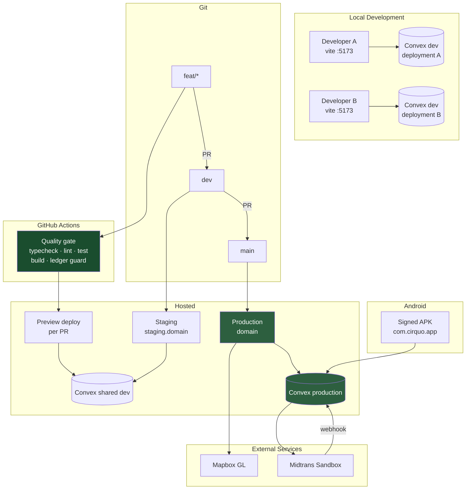
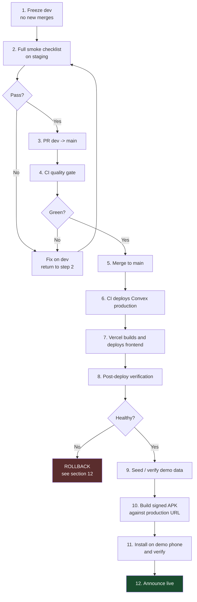
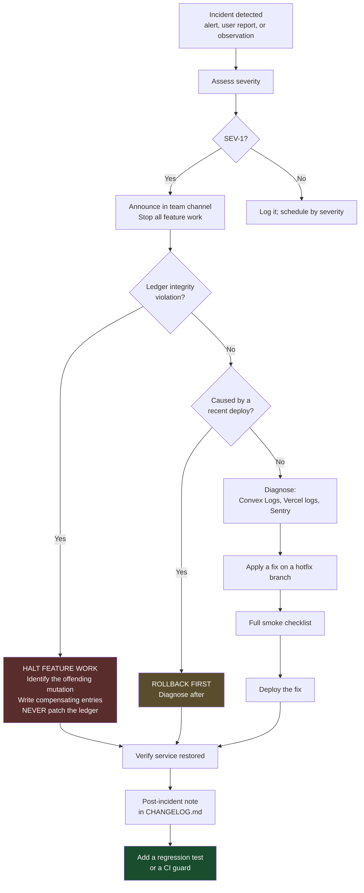

# Deployment & Operations

| Field | Value |
| --- | --- |
| **Document Type** | Engineering Runbook |
| **Status** | Runbook — environment verification required |
| **Last Updated** | 2026-08-29 |
| **Owner** | Cirquo Engineering |
| **Scope** | Environments, CI/CD, hosting, Android release, monitoring, incidents |

---

## 1. Current State

Source can confirm deployment configuration and integration code, but it
cannot prove an external deployment, dashboard configuration, or a completed
payment UAT. Confirm those items in the target environment before treating
them as released.

| Component | Status |
| --- | --- |
| Frontend hosting | 🧪 Vercel deployment must be verified externally |
| Convex production deployment | 🧪 Deployment and environment variables must be verified externally |
| GitHub Actions CI | 📋 Planned — workflow written in §6, not yet committed |
| Android release keystore | 📋 Planned |
| Midtrans webhook endpoint | 🧪 Implemented in `convex/http.ts`; Sandbox dashboard registration and end-to-end UAT remain required |
| Admin provisioning and partner verification | 🚧 Temporary operator bootstrap; no Admin mutation or working review UI yet — see §4.5 |
| Monitoring / alerting | 📋 Planned |

The remaining sections describe the operating procedure and outstanding work.
The source-level milestone boundary is maintained in
[IMPLEMENTATION_STATUS.md](../project/IMPLEMENTATION_STATUS.md).

---

## 2. Environment Topology

### 2.1 Table

| Environment | Frontend | Convex deployment | Purpose | Data | Who |
| --- | --- | --- | --- | --- | --- |
| **Local dev** | `vite` on `localhost:5173` | Personal dev deployment (one per developer) | Daily development | Seeded, disposable | Each developer |
| **Preview** | Per-PR deploy from the host | Shared `dev` deployment | Review a PR before merge | Seeded, shared | Reviewers |
| **Staging** | `staging.<domain>` from branch `dev` | Shared `dev` deployment | Integration testing, demo rehearsal | Seeded, shared | Team |
| **Production** | `<domain>` from branch `main` | Production deployment | Judged demo and pilot | Real + curated demo | Team |
| **Android** | Bundled `dist` inside the APK | Points at **production** Convex | Physical device demo, offline fallback | Same as production | Team |

### 2.2 Diagram



### 2.3 Deployment separation rule

The **frontend and the backend deploy independently**. A frontend change does not
require a Convex deploy, and a Convex deploy does not require a frontend build.

This has one consequence that must be respected: **Convex schema and function
changes must be backward-compatible with the currently deployed frontend**, since
for a short window the old client talks to the new backend. The additive →
backfill → tighten migration discipline in
[DATABASE.md](../domain/DATABASE.md) exists for exactly this reason.

---

## 3. Frontend Hosting

Cirquo's frontend is a **static Vite SPA**. `bun run build` emits `dist/` —
`index.html`, hashed JS and CSS, and the contents of `public/`. There is no
server-side rendering and no Node server. Any static host works.

### 3.1 Options compared

| Host | Free tier | Bun support | SPA fallback | Preview deploys | Custom domain + TLS | Build minutes |
| --- | --- | --- | --- | --- | --- | --- |
| **Vercel** | Generous, hobby | ✅ Detects `bun.lock` | ✅ Automatic for SPAs | ✅ Every PR | ✅ Free | 6,000 min/mo |
| **Netlify** | Generous | ✅ Via `BUN_VERSION` | ⚠️ Needs `_redirects` | ✅ Every PR | ✅ Free | 300 min/mo |
| **Cloudflare Pages** | Very generous, unlimited bandwidth | ✅ Detects `bun.lock` | ✅ Via config | ✅ Every PR | ✅ Free | 500 builds/mo |
| **GitHub Pages** | Unlimited public repos | ⚠️ Manual in Actions | ❌ 404 hack required | ❌ None | ✅ Free | Uses Actions minutes |

### 3.2 Recommendation: Vercel

**Use Vercel.** Justification:

1. **Zero-config Bun.** Vercel detects `bun.lock` and uses Bun automatically. No
   version pinning, no install-command overrides.
2. **SPA fallback works out of the box.** React Router v7 uses client-side
   routing. A user who refreshes on `/consumer/map` requests a path that has no
   corresponding file in `dist/`. The host must serve `index.html` for any
   unmatched path. Vercel does this for detected SPA frameworks with no
   configuration; on Netlify and Cloudflare it is a manual step, and forgetting
   it produces a 404 that only appears in production.
3. **Preview deploys per PR.** With a 2–3 person team, a shareable URL on every
   PR replaces a lot of review overhead — a reviewer opens a link instead of
   checking out a branch.
4. **Build minutes.** 6,000/month is far beyond what this project consumes.
5. **Demo-day reliability.** Global edge CDN, and the fastest rollback of the
   four (one click to promote a previous deployment).

Cloudflare Pages is a defensible alternative if bandwidth ever becomes a concern.
GitHub Pages is rejected: no preview deploys, and the SPA fallback requires a
`404.html` redirect hack that breaks the browser's back button.

### 3.3 The SPA fallback requirement

Non-negotiable regardless of host. Without it, refreshing any route other than
`/` returns 404.

**Vercel** — automatic, but pin it explicitly in `vercel.json` so it survives a
framework-detection change:

```json
{
  "buildCommand": "bun run build",
  "outputDirectory": "dist",
  "installCommand": "bun install --frozen-lockfile",
  "rewrites": [{ "source": "/(.*)", "destination": "/index.html" }],
  "headers": [
    {
      "source": "/assets/(.*)",
      "headers": [
        { "key": "Cache-Control", "value": "public, max-age=31536000, immutable" }
      ]
    },
    {
      "source": "/sw.js",
      "headers": [{ "key": "Cache-Control", "value": "no-cache" }]
    },
    {
      "source": "/(.*)",
      "headers": [
        { "key": "X-Content-Type-Options", "value": "nosniff" },
        { "key": "X-Frame-Options", "value": "DENY" },
        { "key": "Referrer-Policy", "value": "strict-origin-when-cross-origin" }
      ]
    }
  ]
}
```

Two cache rules matter. Hashed assets under `/assets/` are immutable and cached
for a year. **`/sw.js` must be `no-cache`** — a cached service worker will keep
serving a stale application shell after a deploy, and it is one of the more
confusing failure modes to diagnose.

**Netlify** — `public/_redirects`:

```
/*  /index.html  200
```

**Cloudflare Pages** — `public/_redirects`, same content.

### 3.4 Vercel project setup

| Setting | Value |
| --- | --- |
| Framework preset | Vite |
| Build command | `bun run build` |
| Output directory | `dist` |
| Install command | `bun install --frozen-lockfile` |
| Node version | 22.x |
| Production branch | `main` |
| Preview branches | All others |

Environment variables are set per environment in **Settings → Environment
Variables**, scoped to Production / Preview / Development.

---

## 4. Convex Deployment

### 4.1 Dev versus production deployments

| Aspect | Dev deployment | Production deployment |
| --- | --- | --- |
| Created by | `bunx convex dev` | `bunx convex deploy` |
| Count | One per developer, plus a shared one | Exactly one |
| Code push | Automatic on file save | Only on explicit deploy |
| Schema changes | Applied immediately | Applied at deploy, validated first |
| Data | Disposable, seeded | Real; treat as durable |
| URL shape | `https://<name>-<n>.convex.cloud` | `https://<name>.convex.cloud` |
| HTTP endpoint | `https://<name>-<n>.convex.site` | `https://<name>.convex.site` |
| Env vars | Set per dev deployment | Set separately |

**Dev and production deployments do not share environment variables, data, or
code.** Setting `MIDTRANS_SERVER_KEY` on your dev deployment does nothing for
production. This is the single most common deployment mistake on this stack.

### 4.2 Deploying

```bash
# Deploy functions and schema to production
bunx convex deploy

# What it does:
#   1. Type-checks convex/**
#   2. Validates the schema against existing production data
#   3. Bundles and uploads the functions
#   4. Applies the schema
#   5. Prints the production deployment URL
```

Convex refuses the deploy if the new schema would invalidate existing rows. That
is a feature. The response is the migration discipline: **add optional → backfill
→ tighten to required**, across three separate deploys.

### 4.3 `VITE_CONVEX_URL` per environment

The frontend must point at the right deployment. This is a **frontend**
environment variable, set on the host, not by Convex.

| Environment | Value |
| --- | --- |
| Local dev | Written into `.env.local` by `bunx convex dev` |
| Preview (Vercel) | Shared **dev** deployment URL |
| Staging (Vercel) | Shared **dev** deployment URL |
| Production (Vercel) | **Production** deployment URL |
| Android APK | **Production** deployment URL, baked in at build time |

The Android case deserves emphasis: `VITE_CONVEX_URL` is inlined into the bundle
at build time, and `cap sync` copies that bundle into the APK. **An APK built
while `.env.local` pointed at a dev deployment will talk to that dev deployment
forever.** Before any release build:

```bash
VITE_CONVEX_URL="https://<prod-name>.convex.cloud" bun run android:sync
```

### 4.4 Setting server-side secrets

```bash
# Production deployment
bunx convex env set MIDTRANS_SERVER_KEY "SB-Mid-server-xxxxxxxxxxxxxxxxxxxx" --prod

# Verify
bunx convex env list --prod
```

Omit `--prod` to target your dev deployment.

Secrets can also be managed in the Convex dashboard under **Settings →
Environment Variables**, which is safer for the pilot because it avoids secrets
landing in shell history.

### 4.5 Temporary Admin and Merchant-verification bootstrap

The production application has no Admin self-registration path, no Admin
verification mutation, and no working review queue. The `/admin/verifications`
page is frontend-only placeholder content. Until the Admin milestone is
implemented, a trusted project operator performs this one-off bootstrap in the
**production Convex Dashboard**:

1. Register the future Admin as a Consumer through the production application.
   This preserves the normal password hashing and session creation flow.
2. In the production `users` table, change that user's `role` to `admin`.
3. Log out and log back in as that user so the session is restored with the new
   role.
4. When a Merchant has completed onboarding, change only that Merchant profile's
   `verificationStatus` from `pending` to `verified` in the production
   `merchants` table.

Do not edit `passwordHash`, `sessions`, session tokens, or any
`materialFlowLedger` row. Verification does not move material, so it has no
Material Flow Ledger event; it must nevertheless be limited to trusted operators
and recorded in the team's operational notes. This bootstrap is temporary and
must be replaced by the guarded Admin API and review UI in the Admin milestone.

---

## 5. Environment Variable Matrix

### 5.1 The public/secret rule, restated

> **Every `VITE_`-prefixed variable is inlined into the client bundle at build
> time and is PUBLIC.** Vite performs a literal text substitution; the value
> lands in `dist/assets/*.js` and is downloadable by anyone.
>
> **A secret behind a `VITE_` prefix is a leaked secret.** Server-side secrets
> live only in Convex environment variables and are readable only inside Convex
> functions via `process.env`.

The concrete danger here is `MIDTRANS_SERVER_KEY`. It signs transaction requests
and verifies webhook signatures. If it were ever prefixed `VITE_`, anyone could
forge a payment notification and mark orders as paid.

### 5.2 Full matrix

| Variable | Set where | Local | Preview | Staging | Production | Android | Public? |
| --- | --- | --- | --- | --- | --- | --- | --- |
| `VITE_CONVEX_URL` | Host / `.env.local` | Dev deploy URL | Shared dev URL | Shared dev URL | Prod URL | Prod URL | 🔓 Public |
| `CONVEX_DEPLOYMENT` | `.env.local` (CLI only) | Auto-written | — | — | — | — | 🔓 Public |
| `VITE_MAPBOX_ACCESS_TOKEN` | Host / `.env.local` | Dev-restricted `pk.*` | Preview-restricted `pk.*` | Staging `pk.*` | Prod `pk.*` | Prod `pk.*` | 🔓 **Public** |
| `MIDTRANS_SERVER_KEY` | **Convex env** | Dev deploy | Shared dev | Shared dev | Prod | via Convex | 🔒 **SECRET** |
| `VITE_MIDTRANS_CLIENT_KEY` | Host / `.env.local` | Sandbox client key | Sandbox client key | Sandbox client key | Sandbox client key | Sandbox client key | 🔓 **Public** |
| `CONVEX_DEPLOY_KEY` | GitHub Secrets | — | — | — | Used by CI | — | 🔒 **SECRET** |
| `VERCEL_TOKEN` | GitHub Secrets | — | — | — | Used by CI | — | 🔒 **SECRET** |

Cirquo currently calls the **Midtrans Sandbox** endpoint in source. The client
key is public by design and is supplied as `VITE_MIDTRANS_CLIENT_KEY`; only
`MIDTRANS_SERVER_KEY` belongs in Convex. A production environment switch is not
implemented yet and must not be assumed from this matrix.

---

## 6. Build Pipeline and CI/CD

### 6.1 The build

```bash
bun run build
# → tsc -b && vite build
```

| Stage | Behaviour |
| --- | --- |
| `tsc -b` | Type-checks the project. **Any type error fails the build.** |
| `vite build` | Bundles, minifies, hashes, tree-shakes; copies `public/` |
| Output | `dist/index.html`, `dist/assets/*`, `dist/manifest.webmanifest`, `dist/sw.js`, `dist/icons/*` |

What breaks the build:

| Cause | Symptom |
| --- | --- |
| Any TypeScript error | `tsc -b` non-zero exit |
| Missing `convex/_generated` | Cannot resolve `../convex/_generated/api` |
| Unresolvable import | Vite resolution error |
| Broken `@` alias | Module not found |
| Missing required env at build time | Not a build failure — a **runtime** failure. Worse. |

That last row matters: Vite substitutes `import.meta.env.VITE_*` with `undefined`
when the variable is absent. The build succeeds and the app fails silently in the
browser. Guard critical variables at startup, as `src/lib/convex.ts` already does
for `VITE_CONVEX_URL`.

### 6.2 GitHub Actions workflow

The following is a template for `.github/workflows/ci.yml`. It is **not
committed** in this repository yet:

```yaml
name: CI

on:
  push:
    branches: [main, dev]
  pull_request:
    branches: [main, dev]

concurrency:
  group: ${{ github.workflow }}-${{ github.ref }}
  cancel-in-progress: true

jobs:
  quality:
    name: Quality Gate
    runs-on: ubuntu-latest
    timeout-minutes: 15

    steps:
      - name: Checkout
        uses: actions/checkout@v4

      - name: Setup Bun
        uses: oven-sh/setup-bun@v2
        with:
          bun-version: latest

      - name: Cache dependencies
        uses: actions/cache@v4
        with:
          path: ~/.bun/install/cache
          key: ${{ runner.os }}-bun-${{ hashFiles('bun.lock') }}
          restore-keys: ${{ runner.os }}-bun-

      - name: Install dependencies
        run: bun install --frozen-lockfile

      - name: Ledger immutability guard
        run: bun scripts/check-ledger.ts

      - name: Terminology guard
        run: |
          echo "Checking forbidden terminology..."
          FORBIDDEN='zero waste|100% closed-loop|AI pricing|CirQuo'
          if grep -rEni "$FORBIDDEN" src/ convex/ docs/ --include='*.ts' --include='*.tsx' --include='*.md'; then
            echo "::error::Forbidden terminology found. See docs/engineering/STYLE_GUIDE.md."
            exit 1
          fi
          echo "OK: no forbidden terminology."

      - name: Generate Convex types
        run: bunx convex codegen
        env:
          CONVEX_DEPLOY_KEY: ${{ secrets.CONVEX_DEPLOY_KEY }}

      - name: Typecheck
        run: bunx tsc -b --noEmit false

      - name: Lint
        run: bun run lint

      - name: Unit tests
        run: bun test

      - name: Build
        run: bun run build
        env:
          VITE_CONVEX_URL: ${{ vars.VITE_CONVEX_URL }}
          VITE_MAPBOX_ACCESS_TOKEN: ${{ vars.VITE_MAPBOX_ACCESS_TOKEN }}
          VITE_MIDTRANS_CLIENT_KEY: ${{ vars.VITE_MIDTRANS_CLIENT_KEY }}

      - name: Report bundle size
        run: |
          echo "### Bundle size" >> $GITHUB_STEP_SUMMARY
          echo '```' >> $GITHUB_STEP_SUMMARY
          du -sh dist >> $GITHUB_STEP_SUMMARY
          ls -lh dist/assets/*.js | awk '{print $9, $5}' >> $GITHUB_STEP_SUMMARY
          echo '```' >> $GITHUB_STEP_SUMMARY

  deploy-convex:
    name: Deploy Convex (production)
    needs: quality
    if: github.ref == 'refs/heads/main' && github.event_name == 'push'
    runs-on: ubuntu-latest
    timeout-minutes: 10
    environment: production

    steps:
      - name: Checkout
        uses: actions/checkout@v4

      - name: Setup Bun
        uses: oven-sh/setup-bun@v2
        with:
          bun-version: latest

      - name: Install dependencies
        run: bun install --frozen-lockfile

      - name: Deploy to Convex production
        run: bunx convex deploy --yes
        env:
          CONVEX_DEPLOY_KEY: ${{ secrets.CONVEX_DEPLOY_KEY }}

      - name: Verify ledger integrity after deploy
        run: bunx convex run integrity:runIntegrityCheck --prod
        env:
          CONVEX_DEPLOY_KEY: ${{ secrets.CONVEX_DEPLOY_KEY }}
```

Frontend deployment is handled by Vercel's own Git integration, which builds on
push and comments the preview URL on the PR. Duplicating it in Actions adds a
second source of truth for no gain.

### 6.3 Why these steps, in this order

| Step | Rationale |
| --- | --- |
| Ledger guard **first** | Cheapest check, catches the most damaging class of mistake. Fail in seconds, not minutes. |
| Terminology guard second | Also grep-cheap. Prevents forbidden claims reaching a judge. |
| `convex codegen` before typecheck | `_generated/` is gitignored; nothing type-checks without it. |
| Typecheck before lint | Type errors usually explain lint errors. Report the cause, not the symptom. |
| Tests before build | A failing test should not wait on a two-minute bundle. |
| Build last | The slowest step; only run it once everything else is green. |
| Bundle size reported | Makes a regression visible in the PR without a separate tool. |

### 6.4 Branch protection

| Branch | Rule |
| --- | --- |
| `main` | Require PR; require `quality` to pass; require 1 approval; no force push; no deletion |
| `dev` | Require PR; require `quality` to pass; no force push |
| `feat/*` | No protection |

With a 2–3 person team, one approval is realistic. It is a real review, not a
rubber stamp — see [CONTRIBUTING.md](../project/CONTRIBUTING.md).

### 6.5 Required GitHub configuration

| Kind | Name | Value |
| --- | --- | --- |
| Secret | `CONVEX_DEPLOY_KEY` | From Convex dashboard → Settings → Deploy Keys |
| Variable | `VITE_CONVEX_URL` | Production Convex URL |
| Variable | `VITE_MAPBOX_ACCESS_TOKEN` | CI-restricted public Mapbox token |
| Variable | `VITE_MIDTRANS_CLIENT_KEY` | Midtrans Sandbox client key |

---

## 7. Android Release Process

### 7.1 Generating the signing keystore

Once, ever. **Losing this file means never being able to update the app on the
Play Store under the same package name.**

```bash
keytool -genkey -v \
  -keystore cirquo-release.keystore \
  -alias cirquo \
  -keyalg RSA \
  -keysize 2048 \
  -validity 10000
```

### 7.2 Keystore storage

| Rule | Detail |
| --- | --- |
| **Never commit it** | Add `*.keystore` and `key.properties` to `.gitignore` |
| Store the file | Team password manager, plus an encrypted offline backup |
| Store the passwords | Same password manager, separate entry |
| Access | At least two team members, so the project is not blocked by one person's laptop |
| For CI | Base64-encode into a GitHub Secret if release builds are ever automated |

Local Gradle configuration — `android/key.properties` (gitignored):

```properties
storeFile=/absolute/path/to/cirquo-release.keystore
storePassword=<from password manager>
keyAlias=cirquo
keyPassword=<from password manager>
```

### 7.3 Version management

`android/app/build.gradle`:

```gradle
android {
    namespace "com.cirquo.app"
    defaultConfig {
        applicationId "com.cirquo.app"
        minSdkVersion 23
        targetSdkVersion 35
        versionCode 1
        versionName "0.9.0"
    }
}
```

| Field | Rule |
| --- | --- |
| `versionCode` | Integer. **Must strictly increase** with every upload. Play rejects a repeat. |
| `versionName` | Human-readable. Mirrors the `CHANGELOG.md` version. |
| `applicationId` | `com.cirquo.app`. **Permanent** once published. |
| `minSdkVersion` | 23 (Android 6.0) — covers the low-end devices our users actually have |
| `targetSdkVersion` | 35 — required for current Play submissions |

Keep `versionName` in lockstep with [CHANGELOG.md](../project/CHANGELOG.md).

### 7.4 Building a release

```bash
# 1. Confirm the environment points at PRODUCTION Convex.
grep VITE_CONVEX_URL .env.local

# 2. Build web assets and sync into the native project.
bun run android:sync

# 3. Open Android Studio.
bun run android:open
```

In Android Studio:

| Goal | Path |
| --- | --- |
| Signed APK (direct install, demo) | Build → Generate Signed Bundle / APK → **APK** → release |
| Signed AAB (Play Store) | Build → Generate Signed Bundle / APK → **Android App Bundle** → release |

Outputs:

- APK: `android/app/build/outputs/apk/release/app-release.apk`
- AAB: `android/app/build/outputs/bundle/release/app-release.aab`

Or from the command line:

```bash
cd android && ./gradlew assembleRelease   # APK
cd android && ./gradlew bundleRelease     # AAB
```

**The `cap sync` trap:** `cap sync android` copies whatever is currently in
`dist`. If you have not rebuilt, you ship a stale bundle — including a stale
`VITE_CONVEX_URL`. Always use `bun run android:sync`, which chains the build.

### 7.5 Play Store

| Item | Detail |
| --- | --- |
| Registration | **One-off USD 25**, lifetime, per developer account |
| Format | AAB required for new apps |
| Review | Typically 1–7 days for a first submission |
| Required assets | Icon 512×512, feature graphic 1024×500, ≥2 phone screenshots, privacy policy URL, data safety declaration |

For the competition, Play Store publication is **optional**. Direct APK
distribution is faster, has no review delay, and is sufficient for a demo.

### 7.6 Internal distribution

| Method | Use | Notes |
| --- | --- | --- |
| **Direct APK** | Demo and team testing | Share the file; testers enable "install from unknown sources". Fastest path. |
| **Play Internal Testing** | Up to 100 testers | Requires Play registration; near-instant availability, no full review |
| **Play Closed Testing** | Wider pilot | Requires review |

Recommended for the competition: **direct APK** for the team and the demo phone;
Play Internal Testing only if a pilot with external users happens.

---

## 8. Midtrans Webhook Endpoint

### 8.1 The endpoint

Midtrans notifies of payment status changes by POSTing to a public URL. Convex
`httpAction` endpoints are publicly reachable, so no separate server is needed.

```ts
// convex/http.ts
import { httpRouter } from 'convex/server';
import { httpAction } from './_generated/server';
import { internal } from './_generated/api';

const http = httpRouter();

http.route({
  path: '/midtrans/webhook',
  method: 'POST',
  handler: httpAction(async (ctx, request) => {
    const body: unknown = await request.json();

    // Signature verification and the ledger write both happen inside the
    // internal mutation, so they are transactional together. An action is not
    // transactional and MUST NOT write to the Material Flow Ledger.
    await ctx.runMutation(internal.payments.handleNotification, { body });

    // Always 200 on a processed notification. Midtrans retries on non-2xx,
    // and a retry storm is worse than a logged rejection.
    return new Response('OK', { status: 200 });
  }),
});

export default http;
```

### 8.2 URL shape

| Deployment | Notification URL |
| --- | --- |
| Personal dev | `https://<dev-name>-<n>.convex.site/midtrans/webhook` |
| Shared dev / staging | `https://<shared-dev-name>.convex.site/midtrans/webhook` |
| Production | `https://<prod-name>.convex.site/midtrans/webhook` |

Note `.convex.site`, not `.convex.cloud`. `.convex.cloud` is the client API
endpoint; `.convex.site` serves HTTP actions. Using the wrong one is a common and
confusing mistake.

### 8.3 Registering it

Midtrans Sandbox dashboard → **Settings → Configuration → Payment Notification
URL**. Paste the full URL and save.

Midtrans allows one notification URL per merchant account, which means dev and
production compete for the slot. Practical approach for a small team: one person
owns payment integration at a time and holds the slot; everyone else tests by
replaying captured notification bodies (§8.6).

### 8.4 Signature verification

Midtrans signs each notification. **Verify it.** An unverified webhook is an open
endpoint that lets anyone mark any order as paid.

```ts
// convex/payments.ts
import { internalMutation } from './_generated/server';
import { v, ConvexError } from 'convex/values';
import { recordLedgerEvent } from './lib/ledger';

export const handleNotification = internalMutation({
  args: { body: v.any() },
  handler: async (ctx, { body }) => {
    const n = midtransNotificationSchema.parse(body);

    // signature = SHA512(order_id + status_code + gross_amount + server_key)
    const serverKey = process.env.MIDTRANS_SERVER_KEY;
    if (!serverKey) throw new ConvexError('VALIDATION_FAILED');

    const expected = await sha512Hex(
      `${n.order_id}${n.status_code}${n.gross_amount}${serverKey}`,
    );
    if (expected !== n.signature_key) {
      throw new ConvexError('FORBIDDEN');
    }

    const order = await findOrderByExternalId(ctx, n.order_id);
    if (!order) throw new ConvexError('NOT_FOUND');

    // Idempotency: Midtrans retries. Processing twice must not double-write.
    if (order.status === 'paid') return;

    if (n.transaction_status === 'settlement' || n.transaction_status === 'capture') {
      const now = Date.now();
      await ctx.db.patch(order._id, { status: 'paid', paidAt: now });

      // Ledger write inside the mutation — transactional with the state change.
      await recordLedgerEvent(ctx, {
        itemId: order.itemId,
        orderId: order._id,
        event: 'PAID',
        weightDeltaGrams: 0, // Payment moves money, not material.
        actorId: order.consumerId,
        occurredAt: now,
      });
    }
  },
});
```

Two things worth calling out: the mutation is **idempotent** (Midtrans retries),
and `PAID` carries a `weightDeltaGrams` of `0` because payment is a financial
event, not a material movement. Weight moves at `RESERVED` and `RESCUED`.

### 8.5 Sandbox versus production keys

| Aspect | Sandbox | Production |
| --- | --- | --- |
| Key prefix | `SB-Mid-server-*`, `SB-Mid-client-*` | `Mid-server-*`, `Mid-client-*` |
| API base | `api.sandbox.midtrans.com` | `api.midtrans.com` |
| Snap JS | `app.sandbox.midtrans.com/snap/snap.js` | `app.midtrans.com/snap/snap.js` |
| Dashboard | `dashboard.sandbox.midtrans.com` | `dashboard.midtrans.com` |
| Money | None | Real |
| Current source | Used by the current implementation | Not configured |

**Cirquo uses Sandbox for the competition.** The current source calls the
Sandbox endpoint directly; a production switch needs explicit implementation and
verification before it can be documented as supported.

### 8.6 Testing locally

**Preferred — use your Convex dev deployment's public HTTP endpoint.** It is
already reachable from the internet. No tunnel, no extra dependency. Register
`https://<your-dev>.convex.site/midtrans/webhook` in the sandbox dashboard
while you are the one working on payments.

**Replay a notification without a real payment:**

```bash
bunx convex run payments:handleNotification '{
  "body": {
    "order_id": "cirquo-order-abc123",
    "status_code": "200",
    "gross_amount": "12000.00",
    "signature_key": "<sha512 of order_id+status_code+gross_amount+server_key>",
    "transaction_status": "settlement",
    "payment_type": "qris",
    "fraud_status": "accept"
  }
}'
```

**Or curl the endpoint directly:**

```bash
curl -X POST https://<your-dev>.convex.site/midtrans/webhook \
  -H 'Content-Type: application/json' \
  -d '{ "order_id": "cirquo-order-abc123", "status_code": "200",
        "gross_amount": "12000.00", "signature_key": "<sig>",
        "transaction_status": "settlement", "payment_type": "qris" }'
```

**Last resort — a tunnel.** `ngrok http 5173` or Cloudflare Tunnel. Adds a moving
part that breaks on every restart. Prefer the Convex endpoint.

---

## 9. Mapbox Token Scoping

The Mapbox token is embedded in the client bundle and is therefore public.
Anyone can extract it. Without restrictions, someone else's traffic consumes your
free tier and you discover it when the map stops loading — plausibly mid-demo.

### 9.1 Configuration

Mapbox account → **Tokens → Create a token**.

| Setting | Value |
| --- | --- |
| Type | Public (`pk.*`) |
| Scopes | `styles:read`, `fonts:read`, `datasets:read` only |
| **Never** grant | `styles:write`, `tokens:write`, `uploads:write`, any secret scope |
| URL restrictions | Explicit allowlist per environment |

### 9.2 One token per environment

| Environment | Allowed URLs |
| --- | --- |
| Local dev | `http://localhost:5173`, `http://127.0.0.1:5173` |
| Preview | `https://*.vercel.app` |
| Staging | `https://staging.<domain>` |
| Production | `https://<domain>` |
| Android | `capacitor://localhost`, `http://localhost` |

The Android entry is easy to miss. Capacitor serves the WebView from
`capacitor://localhost` (or `http://localhost` depending on configuration), and a
token restricted only to the web domain will 401 inside the APK. The map appears
blank on the phone while working perfectly in a browser.

### 9.3 Free-tier protection

| Limit | Free tier | Mitigation |
| --- | --- | --- |
| Map loads | 50,000/month | URL restriction; lazy-load the map route only |
| Geocoding | 100,000/month | Cache merchant coordinates at listing time — never geocode on render |
| Directions | 100,000/month | Not used |

Set a **usage alert at 80%** in the Mapbox dashboard. Rotate the token
immediately if usage spikes without a corresponding traffic increase.

---

## 10. Pre-Launch Checklist and Go-Live Runbook

### 10.1 Pre-launch

```
Infrastructure
[ ] Vercel project created, connected to the repository
[ ] Production branch set to `main`; preview deploys enabled
[ ] vercel.json committed with the SPA rewrite and cache headers
[ ] Custom domain added with TLS active
[ ] Convex production deployment created

Environment
[ ] VITE_CONVEX_URL set on Vercel Production = production Convex URL
[ ] VITE_CONVEX_URL set on Vercel Preview = shared dev Convex URL
[ ] VITE_MAPBOX_ACCESS_TOKEN set per environment, each URL-restricted
[ ] MIDTRANS_SERVER_KEY set on Convex production
[ ] VITE_MIDTRANS_CLIENT_KEY set on the frontend host
[ ] `bunx convex env list --prod` verified
[ ] No secret is behind a VITE_ prefix — verified by grep of dist/

CI/CD
[ ] .github/workflows/ci.yml committed
[ ] CONVEX_DEPLOY_KEY added to GitHub Secrets
[ ] Branch protection enabled on main and dev
[ ] Ledger immutability guard passing
[ ] Terminology guard passing

Application
[ ] bun run build passes locally
[ ] bun run lint passes with zero warnings
[ ] bun test passes
[ ] Manual smoke checklist passes (docs/engineering/TESTING.md §7)
[ ] Integrity check returns ok: true on production
[ ] Demo data seeded on production via real mutations
[ ] Circularity rate reads between 0.85 and 0.95 — NOT 1.0
[ ] No hardcoded impact figures remain in src/
[ ] Midtrans notification URL registered and a sandbox payment verified

Mobile
[ ] Release keystore generated and backed up in two places
[ ] versionCode and versionName set
[ ] APK built against PRODUCTION VITE_CONVEX_URL
[ ] APK installed and verified on the physical demo phone
[ ] Geolocation grant AND denial paths verified on hardware
```

### 10.2 Go-live runbook



Post-deploy verification (step 8), five minutes:

```
[ ] Production URL loads over HTTPS
[ ] Refresh on a deep route (e.g. /consumer/map) — no 404 (SPA fallback works)
[ ] Convex WebSocket connects (Network tab, WS filter)
[ ] Map renders with no 401
[ ] Log in as each of the four roles
[ ] One sandbox payment end to end
[ ] `bunx convex run integrity:runIntegrityCheck --prod` returns ok: true
[ ] Zero console errors
[ ] Lighthouse mobile performance >= 80
```

---

## 11. Monitoring and Observability

### 11.1 What Convex provides natively

| Capability | Where | Retention |
| --- | --- | --- |
| Function logs (`console.*` and thrown errors) | Dashboard → Logs | Rolling window |
| Invocation counts and error rates per function | Dashboard → Functions | Rolling |
| Execution time per function | Dashboard → Functions | Rolling |
| Scheduled-function history (pending, completed, failed) | Dashboard → Schedules | Rolling |
| Database size and bandwidth | Dashboard → Health | Current |
| Live table browsing | Dashboard → Data | Live |
| Terminal log stream | `bunx convex logs` | Live |

This covers backend observability adequately for a pilot. No APM is needed.

### 11.2 What to add

| Need | Tool | Priority | Effort |
| --- | --- | --- | --- |
| Frontend error tracking | Sentry free tier | P1 | ~1 hour |
| Uptime monitoring | UptimeRobot free (5-min checks) | P1 | ~15 min |
| Ledger integrity alerting | Convex cron + notification | **P0** | ~2 hours |
| Web vitals | Vercel Analytics | P2 | Toggle |

Sentry, minimal setup:

```ts
// src/main.tsx
if (import.meta.env.PROD && import.meta.env.VITE_SENTRY_DSN) {
  Sentry.init({
    dsn: import.meta.env.VITE_SENTRY_DSN,
    tracesSampleRate: 0.1,
    environment: import.meta.env.MODE,
  });
}
```

The DSN is a `VITE_` variable and therefore public — that is fine and expected
for Sentry client DSNs.

### 11.3 The alerts that actually matter

Four. Everything else is noise.

| # | Alert | Trigger | Severity | Why |
| --- | --- | --- | --- | --- |
| 1 | **Ledger integrity violation** | `runIntegrityCheck` returns `ok: false` | **SEV-1** | The product's central claim is broken. Every impact number is untrustworthy. |
| 2 | **Circular Routing failure spike** | > 3 batches reach `unroutable` in 24 h | SEV-2 | Surplus is not being recovered. Either no processor has capacity or the ranking is wrong. |
| 3 | **Payment webhook failure** | Any `handleNotification` error, or a paid Snap transaction with no corresponding `PAID` ledger event within 5 min | SEV-2 | Consumers pay and the order stays `reserved`. Direct user harm. |
| 4 | **Cron not running** | Expiry or routing cron has not completed in > 2× its interval | SEV-2 | Items never expire, holds never release, quantity is silently locked. |

Implementation:

```ts
// convex/crons.ts
import { cronJobs } from 'convex/server';
import { internal } from './_generated/api';

const crons = cronJobs();

crons.interval(
  'release expired reservation holds',
  { minutes: 5 },
  internal.orders.releaseExpiredHolds,
);

crons.interval(
  'expire past-window rescue items',
  { minutes: 15 },
  internal.surplusItems.expirePastWindow,
);

crons.interval(
  'route pending recovery batches',
  { minutes: 30 },
  internal.recoveryBatches.routePending,
);

// Alert 1 — the most important scheduled job in the system.
crons.daily(
  'verify ledger integrity',
  { hourUTC: 17, minuteUTC: 0 }, // 00:00 WIB
  internal.integrity.verifyAndAlert,
);

export default crons;
```

```ts
// convex/integrity.ts
/**
 * Run both ledger invariants and raise an alert on failure.
 *
 * A violation means kilograms are appearing or disappearing from the Material
 * Flow Ledger. Per docs/engineering/TESTING.md this HALTS FEATURE WORK.
 */
export const verifyAndAlert = internalMutation({
  args: {},
  handler: async (ctx) => {
    const result = await runChecks(ctx);

    if (!result.ok) {
      console.error('LEDGER_INTEGRITY_VIOLATION', JSON.stringify(result));
      await ctx.db.insert('notifications', {
        kind: 'integrity_violation',
        severity: 'sev1',
        payload: JSON.stringify(result),
        createdAt: Date.now(),
      });
    }

    return result;
  },
});
```

The `console.error` is deliberate: it surfaces in Convex Logs and in the
Functions error rate, which is where the team looks first.

---

## 12. Incident Response

### 12.1 Severity levels

| Severity | Definition | Response time | Examples |
| --- | --- | --- | --- |
| **SEV-1** | Core function broken or data integrity compromised | Immediate; drop everything | Site down; ledger integrity violation; payments taken with no order created; auth bypass |
| **SEV-2** | Major feature broken; workaround exists | Within hours | Map not loading; routing failing; cron stopped; webhook failing |
| **SEV-3** | Minor feature broken; low impact | Next working day | Dashboard chart misrendering; a validation message wrong |
| **SEV-4** | Cosmetic | Next milestone | Spacing, copy typo |

### 12.2 Flow



### 12.3 Ledger integrity — the special case

If `runIntegrityCheck` returns `ok: false`:

1. **Halt feature work.** Announce immediately. Every hour of work on top of an
   unbalanced ledger produces more corrupt data to untangle.
2. **Identify the offending items** from `conservation.violations`.
3. **Read their ledger sequences** in the Convex Data tab, sorted by
   `occurredAt`. Find the missing event or the wrong sign.
4. **Fix the mutation** that produced it.
5. **Write compensating entries** for the historical data. **Never patch or
   delete a ledger row** — the CI guard exists to prevent exactly this, and the
   audit trail's value is that it was never edited.
6. **Add a regression test** that reproduces the sequence.
7. **Re-run the integrity check** until `ok: true`.

---

## 13. Rollback

### 13.1 Frontend (Vercel)

Fastest rollback available. Two options:

**Instant, via dashboard:** Deployments → find the last known-good deployment →
**Promote to Production**. Effective in seconds; no rebuild.

**Via Git:**

```bash
git revert <bad-commit-sha>
git push origin main
# CI runs; Vercel rebuilds and redeploys
```

Use the dashboard when the site is down. Use the revert when you have time and
want history to be honest.

### 13.2 Convex

Convex has no one-click rollback. Redeploy the previous function code:

```bash
git checkout <last-good-sha>
bunx convex deploy --yes
git checkout main
```

**Schema rollbacks are the hard case.** If the bad deploy added a required field,
rolling back the code does not remove the field from existing rows, and rolling
forward is usually safer than rolling back.

This is precisely why the additive → backfill → tighten discipline exists:

| Step | Deploy | Rollback safety |
| --- | --- | --- |
| 1. Add field as `v.optional()` | Deploy A | ✅ Trivially safe both ways |
| 2. Backfill existing rows | Migration mutation | ✅ Safe; data only |
| 3. Tighten to required | Deploy B | ⚠️ Rolling back to A is safe; the field simply becomes optional again |

Never combine the three into one deploy. See
[DATABASE.md](../domain/DATABASE.md).

### 13.3 Android

There is no rollback for an installed APK. Ship a **new** build with an
incremented `versionCode`. This is why the demo phone should always carry a
known-good APK before any new build is installed on it.

---

## 14. Backup and Data Retention

### 14.1 What Convex provides

| Capability | Detail |
| --- | --- |
| Managed durability | Convex handles replication and durability |
| Export | `bunx convex export --path ./backup.zip` |
| Import | `bunx convex import ./backup.zip` |
| Snapshot | Available in the dashboard |

### 14.2 Backup policy for the pilot

```bash
# Weekly manual export of production, before any risky deploy.
bunx convex export --prod --path "./backups/cirquo-$(date +%Y-%m-%d).zip"
```

Store outside the repository. **Never commit a backup** — it contains user data.
Add `backups/` to `.gitignore`.

Take an export **before every schema-tightening deploy**. That is the only
operation in this system that can invalidate data.

### 14.3 Retention

| Data | Retention | Rationale |
| --- | --- | --- |
| **`materialFlowLedger`** | **Never pruned. Ever.** | It is the audit trail. Every impact figure derives from it, and historical figures must remain reproducible. Pruning would silently restate history. |
| `surplusItems` | Indefinite | Referenced by ledger entries |
| `orders` | Indefinite | `rescuedWeightGrams` snapshots are read by the ledger |
| `payments` | Indefinite | Financial record |
| `impactSnapshots` | Indefinite | Small; cached rollups |
| `sessions` | Expired sessions purged after 30 days | No historical value |
| `notifications` | Purged after 90 days | No historical value |
| `disputes` | Indefinite | Audit relevance |

**The ledger-retention rule is absolute.** A pruned ledger cannot reproduce a
historical impact number, and Cirquo's claim is that every kilogram is accounted
for from listing to final outcome. Growth is not a concern at pilot scale: a
ledger entry is on the order of 200 bytes, so 100,000 entries is roughly 20 MB.

Related: the `impact-v1` methodology version is stamped on stored figures and
**never retroactively recomputed**. Changing an emission factor creates
`impact-v2` going forward; historical figures keep their original methodology
stamp. See [IMPACT.md](../impact/IMPACT.md).

---

## 15. Cost Projections

### 15.1 Free-tier limits

| Service | Free tier | Pilot usage estimate | Headroom |
| --- | --- | --- | --- |
| **Convex** | ~1 GB storage, generous function calls and bandwidth on the starter plan | < 50 MB, low thousands of calls/day | Very large |
| **Vercel** | 100 GB bandwidth/mo, 6,000 build min/mo | < 5 GB, < 200 build min | Very large |
| **Mapbox** | 50,000 map loads/mo, 100,000 geocodes/mo | < 5,000 loads | Large |
| **Midtrans Sandbox** | Unlimited, free | Demo volume | Unlimited |
| **Sentry** | 5,000 errors/mo | < 500 | Large |
| **UptimeRobot** | 50 monitors, 5-min interval | 2 monitors | Large |
| **GitHub Actions** | 2,000 min/mo (private) | < 300 min | Large |

### 15.2 Cost by environment

| Environment | Monthly cost | Notes |
| --- | --- | --- |
| Local dev | **USD 0** | Convex dev deployments are free |
| Preview | **USD 0** | Within Vercel free tier |
| Staging | **USD 0** | Shares the dev Convex deployment |
| Production (pilot) | **USD 0** | All services within free tiers |
| Domain | **USD 10–15/year** | `.com`; `.id` is comparable |
| Play Store | **USD 25 one-off** | Optional; lifetime |

**Total to run Cirquo through the competition: roughly USD 0–40**, depending on
whether a custom domain and Play Store registration are wanted.

### 15.3 If the pilot scales

Order-of-magnitude, if usage grew to ~1,000 daily active users:

| Service | Likely tier | Approx. monthly |
| --- | --- | --- |
| Convex | Professional | ~USD 25 |
| Vercel | Pro (only if bandwidth demands it) | ~USD 20 |
| Mapbox | Pay-as-you-go beyond 50k loads | ~USD 5 per additional 1,000 loads |
| Midtrans | Production, per-transaction fee | Variable, revenue-linked |

The architecture has no fixed server cost. Everything scales with usage, which is
the right shape for a pilot with uncertain demand.

---

## 16. Demo-Day Operations

### 16.1 Twenty-four hours before

```
[ ] Full pre-demo regression checklist (docs/engineering/TESTING.md §9.6)
[ ] Production seeded with realistic Semarang demo data
[ ] Integrity check returns ok: true on production
[ ] Circularity rate reads between 0.85 and 0.95 — verified NOT 1.0
[ ] Signed APK built against the PRODUCTION Convex URL
[ ] APK installed on the demo phone and fully exercised
[ ] A second phone prepared as a backup with the same APK
[ ] Demo account credentials written on PAPER, not only in a password manager
[ ] Code freeze in effect — no merges
[ ] Full demo rehearsed end to end, timed
```

### 16.2 Fallback ladder

Ordered from best to worst. Have all four ready.

| # | Fallback | When | Preparation |
| --- | --- | --- | --- |
| 1 | **Live web app on the venue network** | Default | Verified 24 h before |
| 2 | **Signed APK on a physical phone** | Venue Wi-Fi fails or is captive-portalled | **Installed and verified in advance.** Cached shell renders; the phone can use mobile data independently of venue Wi-Fi |
| 3 | **Local `bun run preview` against production Convex** | Vercel or DNS problem | `dist` prebuilt on the laptop; laptop tethered to a phone hotspot |
| 4 | **Recorded video walkthrough** | Total connectivity failure | Recorded, exported, on the laptop **and** a USB drive |

The APK fallback is the reason M8 exists as a milestone rather than a
nice-to-have. A conference venue's network is the single most predictable point
of failure on demo day, and a phone with mobile data routes around it entirely.

### 16.3 On the day

```
[ ] Arrive early; test the venue network
[ ] Load the production URL on the laptop and on both phones
[ ] Confirm the Convex WebSocket connects
[ ] Confirm the Mapbox map renders
[ ] Run one sandbox payment end to end
[ ] Open the Convex dashboard in a background tab — showing the live ledger to a
    judge is the strongest available evidence for the material-tracking claim
[ ] Charge every device to 100%; bring a power bank
[ ] Disable OS notifications and auto-updates on the demo devices
[ ] Set the laptop display to never sleep
```

### 16.4 What to show, in order

1. **Merchant lists a Rescue Item** — the suggested price from Dynamic Rescue
   Pricing appears live as the form is filled.
2. **Consumer discovers it on the map** — reserves, pays via Midtrans Sandbox
   QRIS.
3. **Pickup** — merchant enters the pickup code; **the consumer's screen updates
   live without a refresh**. This is the strongest single moment in the demo.
4. **An item expires** — Circular Routing offers it to an Organic Processor.
5. **Processor accepts** — logs measured intake, then the outcome with a
   **visible residual**.
6. **Impact dashboards** — every figure derived from the Material Flow Ledger.
7. **The Convex Data tab** — the ledger itself, one item's full lifecycle, sum of
   deltas equal to zero.

Step 7 is what separates Cirquo from a marketplace with a nice dashboard. Show
the ledger.

### 16.5 What never to claim

| Never say | Say instead |
| --- | --- |
| "Zero waste" | "A circularity rate of about 93% in our demo dataset" |
| "100% closed-loop" | "Closing the loop on most of the material, with a measured residual" |
| "AI pricing" | "Dynamic Rescue Pricing — a deterministic, auditable formula" |
| "We deliver the food" | "Consumers collect in person using a pickup code" |
| "Native app" | "One codebase shipping as a web app and an installable Android app" |
| "It's tested" | "The pure logic that computes prices and impact is unit-tested; the rest is manually verified against a checklist" |

Every one of these is both more honest and more persuasive to a judge who knows
the domain. The residual is a feature of the story, not an embarrassment: it is
the evidence that the numbers are measured rather than asserted.

---

## 17. Related Documents

| Document | Relevance |
| --- | --- |
| [Development Guide](DEVELOPMENT.md) | Local setup, env vars, Android workflow |
| [Testing Strategy](TESTING.md) | Smoke checklist, integrity checks, code freeze |
| [Style Guide](STYLE_GUIDE.md) | Conventions enforced by the CI guards |
| [Architecture](../architecture/ARCHITECTURE.md) | System overview |
| [Backend](../architecture/BACKEND.md) | Convex module structure |
| [Frontend](../architecture/FRONTEND.md) | Build output and routing |
| [Scheduler](../architecture/SCHEDULER.md) | Cron definitions and TTLs |
| [Database Schema](../domain/DATABASE.md) | Migration discipline |
| [State Machine](../domain/STATE_MACHINE.md) | Status transitions |
| [Material Flow Ledger](../impact/MATERIAL_LEDGER.md) | Immutability and invariants |
| [Impact Methodology](../impact/IMPACT.md) | Methodology versioning |
| [Impact Algorithm](../impact/ALGORITHM.md) | Pricing and routing maths |
| [API Reference](../api/API.md) | Function signatures including the httpAction |
| [Security](../security/SECURITY.md) | Secret handling and threat model |
| [Authentication](../security/AUTH.md) | Session handling |
| [Permissions](../security/PERMISSIONS.md) | Role matrix |
| [UI Guide](../design/UI_GUIDE.md) | Design tokens |
| [Components](../design/COMPONENTS.md) | Component inventory |
| [Product Requirements](../product/PRD.md) | Requirement IDs |
| [Roadmap](../business/ROADMAP.md) | Milestones M1–M8 |
| [Risks](../business/RISKS.md) | Risk register including demo-day risks |
| [Feature Spec](../spec/FEATURES.md) | Feature requirements |
| [Agent Guide](../project/AGENTS.md) | Rules for AI contributors |
| [Contributing](../project/CONTRIBUTING.md) | Branch, commit, PR process |
| [Changelog](../project/CHANGELOG.md) | Release history |

---

**Built for DSDC ANFORCOM 2026**  
**Platform:** Cirquo — Closing the Loop, Saving Every Meal
