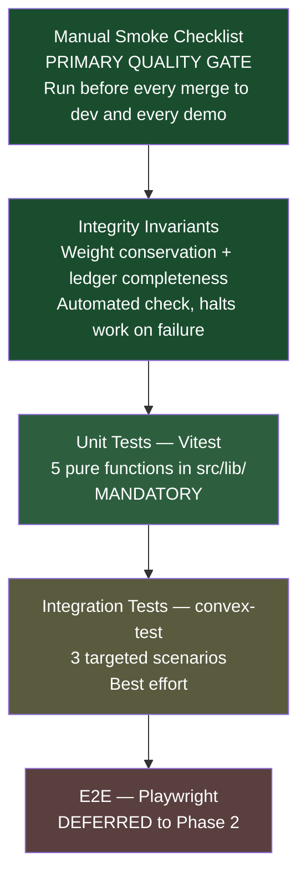

# Testing Strategy

| Field | Value |
| --- | --- |
| **Document Type** | Engineering Strategy |
| **Status** | Active testing strategy — M1–M5 checks available, UAT pending |
| **Last Updated** | 2026-08-29 |
| **Owner** | Cirquo Engineering |
| **Scope** | Unit, integration, E2E, manual, and integrity testing |

---

## 1. Honest Opening

**Automated checks exist, but they are not a substitute for UAT.** The current
suite includes Bun tests for pure/client logic and Vitest + `convex-test` checks
for Merchant, reservation, and Midtrans invariants. Run `bun run test` for the
maintained suite, then run `bun scripts/check-ledger.ts` against UAT data before
making a ledger-integrity claim.

M3 still requires a real Midtrans Sandbox webhook and 375px/mobile walkthrough.
The source-level boundary is maintained in
[IMPLEMENTATION_STATUS.md](../project/IMPLEMENTATION_STATUS.md).

### 1.1 The deliberate trade-off

With a **2–3 person team** and a **fixed deadline of 31 August 2026**, broad test
coverage is not achievable alongside eight milestones of feature work. Pretending
otherwise produces a worse outcome than choosing openly.

So we choose openly:

> **Targeted unit tests on the small number of pure functions where correctness
> is non-negotiable, plus a disciplined manual smoke checklist run before every
> demo and every merge to `dev`.**

Not "we ran out of time". A decision, with reasoning:

| Factor | Reasoning |
| --- | --- |
| **Where bugs are expensive** | A wrong price or a wrong impact figure is a credibility failure in front of judges. A misaligned button is not. Effort follows consequence. |
| **Where bugs are cheap to catch** | UI regressions are caught in seconds by looking at the screen. A rounding error in `summariseLedger` is invisible until someone audits the arithmetic. Automate what the eye cannot see. |
| **Where the code is stable** | Pure functions in `src/lib/` have fixed signatures and will not churn. UI components will be redesigned repeatedly. Tests against churning code are a tax. |
| **Team size** | Three people cannot maintain a large suite and ship eight milestones. A small suite that always passes beats a large suite that gets skipped. |
| **What the product claims** | Cirquo claims to account for **every kilogram**. That claim must be mechanically verifiable. Everything else is secondary. |

### 1.2 What this trade-off does not excuse

- **Untested pure functions.** The five in §4 are mandatory, not optional.
- **Skipping the manual smoke checklist.** It is the primary quality gate, and it
  is a *requirement*, not a suggestion.
- **Ignoring the integrity invariants.** A weight-conservation violation halts
  feature work. See §8.

---

## 2. The Test Pyramid, Applied Here



The pyramid is inverted from the textbook shape, and that is correct for this
project. The textbook shape assumes a long-lived product with many contributors
where manual testing does not scale. We have a fixed-duration project with three
contributors where manual testing scales perfectly well and automation of the UI
layer would consume more time than it returns.

### 2.1 What is and is not worth automating

| Area | Automate? | Why |
| --- | --- | --- |
| `suggestRescuePrice` | ✅ **Yes** | Pure, stable, boundary-heavy, produces a number a merchant sees. Manual verification of clamps is unreliable. |
| `rankEligibleProcessors` | ✅ **Yes** | Pure, exclusion logic is easy to get subtly wrong, failure means food routed to a processor that cannot take it. |
| `summariseLedger` | ✅ **Yes** | Every impact number on every dashboard flows through it. The partial-outcome case is genuinely tricky. |
| `haversineMeters` | ✅ **Yes** | Trivial to test, easy to get wrong (radians, hemisphere signs), and distance drives discovery ordering. |
| Weight-conservation invariant | ✅ **Yes** | This *is* the product's central claim. Must be mechanically provable. |
| Convex reservation concurrency | ⚠️ **Best effort** | Real risk of overselling; `convex-test` can express it. Worth the effort if time allows. |
| Convex guard rejection | ⚠️ **Best effort** | Security-relevant. A few tests cover the pattern; the rest is code review. |
| Ledger write presence per mutation | ⚠️ **Best effort** | High value, moderate cost. Cheap version: a CI grep guard (§9.4). |
| React component rendering | ❌ **No** | Churns constantly. Visible in one second by looking. Cost far exceeds benefit. |
| Form validation messages | ❌ **No** | Zod schemas are declarative and reviewed; failures are immediately visible. |
| Mapbox interaction | ❌ **No** | Requires heavy mocking of a third-party canvas renderer. Untestable at reasonable cost. |
| Midtrans Snap flow | ❌ **No** | External hosted UI. Sandbox manual testing is the only honest verification. |
| Routing/layout | ❌ **No** | Immediately visible. |
| Dark mode tokens | ❌ **No** | Visual. Toggle and look. |
| Capacitor/Android shell | ❌ **No** | Requires a device farm. Manual on one physical phone. |

---

## 3. Unit Testing Setup

### 3.1 Why Vitest

Vitest shares Vite's transform pipeline, so it resolves the `@` alias, TypeScript,
and ESM identically to the application build. No second toolchain, no duplicated
config. Bun's native test runner is faster still, but Vitest's alias handling and
Vite integration remove a category of "works in the app, fails in the test"
problems that we cannot afford to debug.

### 3.2 Installation

```bash
bun add -d vitest @vitest/coverage-v8
```

Add to `package.json`:

```json
{
  "scripts": {
    "test": "vitest run",
    "test:watch": "vitest",
    "test:coverage": "vitest run --coverage"
  }
}
```

### 3.3 Configuration

Extend the existing `vite.config.ts` — do not create a second config file.

```ts
/// <reference types="vitest" />
import { defineConfig } from 'vite';
import react from '@vitejs/plugin-react';
import tailwindcss from '@tailwindcss/vite';
import path from 'node:path';

export default defineConfig({
  plugins: [react(), tailwindcss()],
  resolve: {
    alias: { '@': path.resolve(__dirname, './src') },
  },
  test: {
    environment: 'node',
    include: ['src/**/*.test.ts'],
    coverage: {
      provider: 'v8',
      include: ['src/lib/**/*.ts'],
      exclude: ['src/lib/convex.ts', 'src/lib/utils.ts'],
      thresholds: {
        lines: 90,
        functions: 90,
        branches: 85,
      },
    },
  },
});
```

Two deliberate choices:

- **`environment: 'node'`** — the functions under test are pure. No DOM is
  needed, and jsdom would slow every run for no benefit.
- **Coverage scoped to `src/lib/`** — a global coverage number would be dominated
  by untested UI and would be meaningless. Ninety per cent of the pure logic is a
  target we can actually hold to. Reporting "12% overall coverage" tells nobody
  anything; reporting "92% of the impact and pricing logic" tells them exactly
  what is verified.

Tests are colocated: `src/lib/pricing.ts` → `src/lib/pricing.test.ts`.

---

## 4. The Mandatory Unit Tests

### 4.1 `suggestRescuePrice` — Dynamic Rescue Pricing

The merchant sees this number and the consumer pays it. Getting the clamps wrong
means either destroying merchant margin or producing a discount so small the item
never sells.

```ts
// src/lib/pricing.test.ts
import { describe, it, expect } from 'vitest';
import { suggestRescuePrice, PRICING_CONFIG } from './pricing';

const HOUR = 60 * 60 * 1000;
const START = 1_770_000_000_000; // fixed epoch ms; never Date.now() in a test

function input(overrides: Partial<Parameters<typeof suggestRescuePrice>[0]> = {}) {
  return {
    originalPriceIdr: 20_000,
    windowStartAt: START,
    windowEndAt: START + 4 * HOUR,
    nowAt: START,
    remainingQuantity: 5,
    initialQuantity: 10,
    ...overrides,
  };
}

describe('suggestRescuePrice', () => {
  describe('boundary: elapsed ratio', () => {
    it('applies only the base discount at elapsed ratio 0', () => {
      const result = suggestRescuePrice(input({ nowAt: START }));

      // No time component yet, and remaining 5/10 = 0.5 is below the 0.8
      // surplus-bonus threshold, so the discount is exactly the base rate.
      expect(result.discountRate).toBeCloseTo(PRICING_CONFIG.BASE_DISCOUNT_RATE, 10);
      expect(result.priceIdr).toBe(14_000); // 20000 * (1 - 0.30)
      expect(result.clampedByFloor).toBe(false);
      expect(result.clampedByMaxDiscount).toBe(false);
    });

    it('applies the full time range at elapsed ratio 1', () => {
      const result = suggestRescuePrice(input({ nowAt: START + 4 * HOUR }));

      const expected =
        PRICING_CONFIG.BASE_DISCOUNT_RATE + PRICING_CONFIG.TIME_DISCOUNT_RANGE;
      expect(result.discountRate).toBeCloseTo(expected, 10); // 0.70
      expect(result.priceIdr).toBe(6_000); // 20000 * (1 - 0.70)
    });

    it('clamps elapsed ratio to 1 past the window end', () => {
      const atEnd = suggestRescuePrice(input({ nowAt: START + 4 * HOUR }));
      const wayPast = suggestRescuePrice(input({ nowAt: START + 40 * HOUR }));

      // The discount must not keep growing after the window closes.
      expect(wayPast.priceIdr).toBe(atEnd.priceIdr);
    });

    it('clamps elapsed ratio to 0 before the window opens', () => {
      const before = suggestRescuePrice(input({ nowAt: START - 10 * HOUR }));
      expect(before.discountRate).toBeCloseTo(PRICING_CONFIG.BASE_DISCOUNT_RATE, 10);
    });
  });

  describe('clamp: maximum discount', () => {
    it('never discounts beyond MAX_DISCOUNT_RATE', () => {
      // End of window (0.70) + surplus bonus (0.05) = 0.75, exactly at the cap.
      // Push past it with a full-stock item at window end.
      const result = suggestRescuePrice(
        input({
          nowAt: START + 4 * HOUR,
          remainingQuantity: 10,
          initialQuantity: 10,
        }),
      );

      expect(result.discountRate).toBeLessThanOrEqual(PRICING_CONFIG.MAX_DISCOUNT_RATE);
      expect(result.priceIdr).toBe(5_000); // 20000 * (1 - 0.75)
    });

    it('reports clampedByMaxDiscount when the cap binds', () => {
      const result = suggestRescuePrice(
        input({
          originalPriceIdr: 100_000,
          nowAt: START + 4 * HOUR,
          remainingQuantity: 10,
          initialQuantity: 10,
        }),
      );
      // 0.70 + 0.05 = 0.75 which equals the cap and does not exceed it.
      expect(result.clampedByMaxDiscount).toBe(false);
      expect(result.priceIdr).toBe(25_000);
    });
  });

  describe('clamp: price floor', () => {
    it('never returns a price below the explicit floor', () => {
      const result = suggestRescuePrice(
        input({ originalPriceIdr: 5_000, nowAt: START + 4 * HOUR, priceFloorIdr: 3_000 }),
      );

      expect(result.priceIdr).toBe(3_000); // raw would be 1500
      expect(result.clampedByFloor).toBe(true);
    });

    it('falls back to DEFAULT_PRICE_FLOOR_IDR when no floor is supplied', () => {
      const result = suggestRescuePrice(
        input({ originalPriceIdr: 4_000, nowAt: START + 4 * HOUR }),
      );

      expect(result.priceIdr).toBe(PRICING_CONFIG.DEFAULT_PRICE_FLOOR_IDR);
      expect(result.clampedByFloor).toBe(true);
    });
  });

  describe('edge: zero quantity', () => {
    it('does not divide by zero when initialQuantity is 0', () => {
      const result = suggestRescuePrice(
        input({ remainingQuantity: 0, initialQuantity: 0 }),
      );

      expect(Number.isFinite(result.priceIdr)).toBe(true);
      expect(Number.isNaN(result.discountRate)).toBe(false);
    });

    it('does not divide by zero when the window has zero duration', () => {
      const result = suggestRescuePrice(
        input({ windowStartAt: START, windowEndAt: START }),
      );
      expect(Number.isFinite(result.priceIdr)).toBe(true);
    });
  });

  describe('invariants', () => {
    it('always returns an integer IDR price', () => {
      for (let h = 0; h <= 4; h += 0.25) {
        const result = suggestRescuePrice(
          input({ originalPriceIdr: 17_777, nowAt: START + h * HOUR }),
        );
        expect(Number.isInteger(result.priceIdr)).toBe(true);
      }
    });

    it('is deterministic — same input, same output', () => {
      const a = suggestRescuePrice(input({ nowAt: START + 2 * HOUR }));
      const b = suggestRescuePrice(input({ nowAt: START + 2 * HOUR }));
      expect(a).toEqual(b);
    });
  });
});
```

Note the fixed `START` constant. `nowAt` is an injected parameter precisely so
tests are reproducible — a function that reads `Date.now()` internally cannot be
tested at its boundaries.

### 4.2 `rankEligibleProcessors` — Circular Routing

A routing failure sends surplus to a processor that cannot handle it, which in a
real deployment means the food rots in a truck.

```ts
// src/lib/routing.test.ts
import { describe, it, expect } from 'vitest';
import { rankEligibleProcessors, ROUTING_CONFIG } from './routing';

const BASE = {
  materialType: 'produce' as const,
  weightGrams: 20_000,
  originLat: -6.9932,
  originLng: 110.4203, // Semarang
  declinedProcessorIds: [] as string[],
};

function processor(overrides: Record<string, unknown> = {}) {
  return {
    _id: 'p1',
    name: 'BSF Semarang',
    acceptedMaterialTypes: ['produce', 'bakery'],
    dailyCapacityGrams: 100_000,
    committedTodayGrams: 0,
    lat: -6.99,
    lng: 110.42,
    isVerified: true,
    ...overrides,
  };
}

describe('rankEligibleProcessors', () => {
  it('excludes processors that do not accept the material type', () => {
    const result = rankEligibleProcessors(BASE, [
      processor({ _id: 'p1', acceptedMaterialTypes: ['dairy'] }),
      processor({ _id: 'p2', acceptedMaterialTypes: ['produce'] }),
    ]);

    expect(result.map((r) => r.processorId)).toEqual(['p2']);
  });

  it('excludes processors without remaining capacity for the batch', () => {
    const result = rankEligibleProcessors(BASE, [
      // 95kg committed of a 100kg cap leaves 5kg; the batch is 20kg.
      processor({ _id: 'p1', dailyCapacityGrams: 100_000, committedTodayGrams: 95_000 }),
      processor({ _id: 'p2', dailyCapacityGrams: 100_000, committedTodayGrams: 10_000 }),
    ]);

    expect(result.map((r) => r.processorId)).toEqual(['p2']);
  });

  it('includes a processor whose remaining capacity exactly equals the batch', () => {
    const result = rankEligibleProcessors(BASE, [
      processor({ dailyCapacityGrams: 100_000, committedTodayGrams: 80_000 }),
    ]);
    expect(result).toHaveLength(1);
  });

  it('excludes processors already on the declined list', () => {
    const result = rankEligibleProcessors(
      { ...BASE, declinedProcessorIds: ['p1'] },
      [processor({ _id: 'p1' }), processor({ _id: 'p2' })],
    );

    expect(result.map((r) => r.processorId)).toEqual(['p2']);
  });

  it('excludes unverified processors', () => {
    const result = rankEligibleProcessors(BASE, [
      processor({ _id: 'p1', isVerified: false }),
    ]);
    expect(result).toHaveLength(0);
  });

  it('returns an empty array when no processor is eligible', () => {
    const result = rankEligibleProcessors(BASE, [
      processor({ _id: 'p1', acceptedMaterialTypes: ['dairy'] }),
      processor({ _id: 'p2', committedTodayGrams: 100_000 }),
    ]);

    expect(result).toEqual([]);
  });

  it('returns an empty array for an empty candidate list', () => {
    expect(rankEligibleProcessors(BASE, [])).toEqual([]);
  });

  it('ranks nearer processors above farther ones, all else equal', () => {
    const result = rankEligibleProcessors(BASE, [
      processor({ _id: 'far', lat: -7.35, lng: 110.50 }),   // ~40km
      processor({ _id: 'near', lat: -6.995, lng: 110.421 }), // ~200m
    ]);

    expect(result[0].processorId).toBe('near');
    expect(result[0].score).toBeGreaterThan(result[1].score);
  });

  it('never returns more candidates than MAX_ROUTING_ATTEMPTS worth of offers', () => {
    const many = Array.from({ length: 20 }, (_, i) => processor({ _id: `p${i}` }));
    const result = rankEligibleProcessors(BASE, many);
    expect(result.length).toBeLessThanOrEqual(ROUTING_CONFIG.MAX_ROUTING_ATTEMPTS);
  });
});
```

### 4.3 `summariseLedger` — impact derivation

Every number on every dashboard flows through this function. If it is wrong, the
entire impact story is wrong, and the impact story is the submission.

The **partial-outcome case** is the important one: a single Rescue Item can
produce rescued weight, recovered weight, and residual weight simultaneously.

```ts
// src/lib/impact.test.ts
import { describe, it, expect } from 'vitest';
import { summariseLedger, estimateCo2e, IMPACT_CONFIG } from './impact';

const T = 1_770_000_000_000;

/**
 * A complete, realistic lifecycle for one 10 kg listing:
 *   listed 10,000 g
 *   -> 6,000 g reserved and rescued by consumers
 *   -> 4,000 g expired, routed, and taken in by a processor
 *   -> processor converts 3,400 g, measures 600 g residual
 *
 * Deltas must sum to exactly 0.
 */
const FULL_LIFECYCLE = [
  { itemId: 'i1', event: 'LISTED',           weightDeltaGrams:  10_000, occurredAt: T +   0 },
  { itemId: 'i1', event: 'RESERVED',         weightDeltaGrams:       0, occurredAt: T +  10 },
  { itemId: 'i1', event: 'PAID',             weightDeltaGrams:       0, occurredAt: T +  20 },
  { itemId: 'i1', event: 'RESCUED',          weightDeltaGrams:  -6_000, occurredAt: T +  30, rescuedWeightGrams: 6_000 },
  { itemId: 'i1', event: 'EXPIRED',          weightDeltaGrams:  -4_000, occurredAt: T +  40 },
  { itemId: 'i1', event: 'ROUTED',           weightDeltaGrams:       0, occurredAt: T +  50 },
  { itemId: 'i1', event: 'INTAKE_ACCEPTED',  weightDeltaGrams:       0, occurredAt: T +  60, intakeWeightGrams: 4_000 },
  { itemId: 'i1', event: 'PROCESSED',        weightDeltaGrams:       0, occurredAt: T +  70, recoveredWeightGrams: 3_400, residualWeightGrams: 600 },
] as const;

describe('summariseLedger', () => {
  describe('partial outcome — the case that matters', () => {
    const summary = summariseLedger([...FULL_LIFECYCLE]);

    it('reports rescued weight from the RESCUED event', () => {
      expect(summary.rescuedGrams).toBe(6_000);
    });

    it('reports recovered weight from the PROCESSED event', () => {
      expect(summary.recoveredGrams).toBe(3_400);
    });

    it('reports residual weight from the PROCESSED event', () => {
      expect(summary.residualGrams).toBe(600);
    });

    it('computes circularity as (rescued + recovered) / total handled', () => {
      // (6000 + 3400) / 10000 = 0.94
      expect(summary.circularityRate).toBeCloseTo(0.94, 10);
    });

    it('never reports a circularity rate of exactly 1 when residual exists', () => {
      expect(summary.circularityRate).toBeLessThan(1);
    });

    it('accounts for every gram: rescued + recovered + residual = handled', () => {
      expect(
        summary.rescuedGrams + summary.recoveredGrams + summary.residualGrams,
      ).toBe(summary.totalHandledGrams);
    });
  });

  describe('in-flight gap', () => {
    it('does not count unresolved weight as rescued, recovered, or residual', () => {
      // Listed 10kg, 3kg reserved but not yet picked up. Nothing resolved.
      const summary = summariseLedger([
        { itemId: 'i2', event: 'LISTED',   weightDeltaGrams: 10_000, occurredAt: T },
        { itemId: 'i2', event: 'RESERVED', weightDeltaGrams: -3_000, occurredAt: T + 1 },
      ]);

      expect(summary.rescuedGrams).toBe(0);
      expect(summary.recoveredGrams).toBe(0);
      expect(summary.residualGrams).toBe(0);
      expect(summary.inFlightGrams).toBe(10_000);
    });

    it('reports a circularity rate of 0, not NaN, when nothing has resolved', () => {
      const summary = summariseLedger([
        { itemId: 'i2', event: 'LISTED', weightDeltaGrams: 10_000, occurredAt: T },
      ]);

      expect(summary.circularityRate).toBe(0);
      expect(Number.isNaN(summary.circularityRate)).toBe(false);
    });
  });

  describe('empty input', () => {
    const summary = summariseLedger([]);

    it('returns zeroes rather than throwing', () => {
      expect(summary.rescuedGrams).toBe(0);
      expect(summary.recoveredGrams).toBe(0);
      expect(summary.residualGrams).toBe(0);
      expect(summary.totalHandledGrams).toBe(0);
    });

    it('returns a circularity rate of 0, not NaN', () => {
      expect(summary.circularityRate).toBe(0);
    });
  });

  describe('integer discipline', () => {
    it('returns integer gram values', () => {
      const s = summariseLedger([...FULL_LIFECYCLE]);
      expect(Number.isInteger(s.rescuedGrams)).toBe(true);
      expect(Number.isInteger(s.recoveredGrams)).toBe(true);
      expect(Number.isInteger(s.residualGrams)).toBe(true);
    });
  });
});

describe('estimateCo2e', () => {
  it('applies the documented emission factor to rescued weight', () => {
    const grams = 10_000;
    const expected = Math.round((grams / 1000) * IMPACT_CONFIG.CO2E_KG_PER_KG_FOOD * 1000);
    expect(estimateCo2e({ rescuedGrams: grams, recoveredGrams: 0 })).toBe(expected);
  });

  it('returns 0 for zero input', () => {
    expect(estimateCo2e({ rescuedGrams: 0, recoveredGrams: 0 })).toBe(0);
  });

  it('stamps the methodology version so figures are never silently restated', () => {
    expect(IMPACT_CONFIG.METHODOLOGY_VERSION).toBe('impact-v1');
  });
});
```

### 4.4 `haversineMeters` — geo distance

Cheap to test, easy to get wrong. Distance drives discovery ordering and routing
scores.

```ts
// src/lib/geo.test.ts
import { describe, it, expect } from 'vitest';
import { haversineMeters } from './geo';

const SIMPANG_LIMA = { lat: -6.9903, lng: 110.4229 };
const TUGU_MUDA    = { lat: -6.9838, lng: 110.4098 };
const JAKARTA      = { lat: -6.2088, lng: 106.8456 };

describe('haversineMeters', () => {
  it('returns 0 for identical points', () => {
    expect(haversineMeters(SIMPANG_LIMA, SIMPANG_LIMA)).toBe(0);
  });

  it('computes a known short distance within Semarang', () => {
    // Simpang Lima to Tugu Muda is roughly 1.6 km.
    const d = haversineMeters(SIMPANG_LIMA, TUGU_MUDA);
    expect(d).toBeGreaterThan(1_500);
    expect(d).toBeLessThan(1_750);
  });

  it('computes a known long distance Semarang to Jakarta', () => {
    // Great-circle distance is approximately 396 km.
    const d = haversineMeters(SIMPANG_LIMA, JAKARTA);
    expect(d).toBeGreaterThan(390_000);
    expect(d).toBeLessThan(402_000);
  });

  it('is symmetric', () => {
    expect(haversineMeters(SIMPANG_LIMA, JAKARTA))
      .toBeCloseTo(haversineMeters(JAKARTA, SIMPANG_LIMA), 6);
  });

  it('handles the equator and prime meridian without sign errors', () => {
    // One degree of latitude at the equator is about 111.19 km.
    const d = haversineMeters({ lat: 0, lng: 0 }, { lat: 1, lng: 0 });
    expect(d).toBeGreaterThan(111_000);
    expect(d).toBeLessThan(111_400);
  });

  it('returns a non-negative integer number of metres', () => {
    const d = haversineMeters(SIMPANG_LIMA, TUGU_MUDA);
    expect(d).toBeGreaterThanOrEqual(0);
    expect(Number.isInteger(d)).toBe(true);
  });
});
```

### 4.5 The weight-conservation invariant

This is the most important test in the repository. It encodes the product's
central claim as an assertion.

```ts
// src/lib/ledger-invariants.test.ts
import { describe, it, expect } from 'vitest';
import { checkWeightConservation, checkLedgerCompleteness } from './impact';

const T = 1_770_000_000_000;

describe('weight conservation', () => {
  it('sums to exactly 0 for a fully-resolved item', () => {
    const entries = [
      { itemId: 'i1', event: 'LISTED',          weightDeltaGrams:  10_000, occurredAt: T +  0 },
      { itemId: 'i1', event: 'RESERVED',        weightDeltaGrams:  -6_000, occurredAt: T + 10 },
      { itemId: 'i1', event: 'RESCUED',         weightDeltaGrams:  -1_000, occurredAt: T + 20 },
      { itemId: 'i1', event: 'EXPIRED',         weightDeltaGrams:  -4_000, occurredAt: T + 30 },
      { itemId: 'i1', event: 'INTAKE_ACCEPTED', weightDeltaGrams:       0, occurredAt: T + 40 },
      { itemId: 'i1', event: 'PROCESSED',       weightDeltaGrams:       0, occurredAt: T + 50 },
    ];

    const result = checkWeightConservation(entries);
    expect(result.ok).toBe(true);
    expect(result.netGrams).toBe(0); // EXACT equality — integers, no epsilon
  });

  it('restores weight when a reservation is cancelled', () => {
    const entries = [
      { itemId: 'i2', event: 'LISTED',    weightDeltaGrams:  8_000, occurredAt: T +  0 },
      { itemId: 'i2', event: 'RESERVED',  weightDeltaGrams: -3_000, occurredAt: T + 10 },
      { itemId: 'i2', event: 'CANCELLED', weightDeltaGrams:  3_000, occurredAt: T + 20 },
      { itemId: 'i2', event: 'EXPIRED',   weightDeltaGrams: -8_000, occurredAt: T + 30 },
      { itemId: 'i2', event: 'PROCESSED', weightDeltaGrams:      0, occurredAt: T + 40 },
    ];

    expect(checkWeightConservation(entries).netGrams).toBe(0);
  });

  it('detects a missing terminal event', () => {
    const entries = [
      { itemId: 'i3', event: 'LISTED',   weightDeltaGrams:  5_000, occurredAt: T +  0 },
      { itemId: 'i3', event: 'RESERVED', weightDeltaGrams: -2_000, occurredAt: T + 10 },
    ];

    const result = checkWeightConservation(entries);
    expect(result.ok).toBe(false);
    expect(result.netGrams).toBe(3_000);
  });

  it('closes correctly via a compensating entry', () => {
    // An operator recorded 5,000 g but the true figure was 4,500 g.
    const entries = [
      { itemId: 'i4', event: 'LISTED',    weightDeltaGrams:  5_000, occurredAt: T +  0 },
      { itemId: 'i4', event: 'EXPIRED',   weightDeltaGrams: -5_000, occurredAt: T + 10 },
      // Correction: append, never patch.
      { itemId: 'i4', event: 'MODERATED', weightDeltaGrams:   -500, occurredAt: T + 20, correctsEventId: 'e1' },
      { itemId: 'i4', event: 'MODERATED', weightDeltaGrams:    500, occurredAt: T + 21, correctsEventId: 'e1' },
      { itemId: 'i4', event: 'PROCESSED', weightDeltaGrams:      0, occurredAt: T + 30 },
    ];

    expect(checkWeightConservation(entries).netGrams).toBe(0);
  });
});

describe('ledger completeness', () => {
  it('passes when every terminal item has a terminal event', () => {
    const items = [
      { _id: 'i1', status: 'recovered' },
      { _id: 'i2', status: 'closed' },
    ];
    const entries = [
      { itemId: 'i1', event: 'PROCESSED', weightDeltaGrams: 0, occurredAt: T },
      { itemId: 'i2', event: 'RESCUED',   weightDeltaGrams: 0, occurredAt: T },
    ];

    expect(checkLedgerCompleteness(items, entries).ok).toBe(true);
  });

  it('fails when a terminal item has no terminal event', () => {
    const items = [{ _id: 'i9', status: 'recovered' }];
    const entries = [
      { itemId: 'i9', event: 'LISTED', weightDeltaGrams: 1_000, occurredAt: T },
    ];

    const result = checkLedgerCompleteness(items, entries);
    expect(result.ok).toBe(false);
    expect(result.offendingItemIds).toContain('i9');
  });

  it('ignores non-terminal items', () => {
    const items = [{ _id: 'i10', status: 'active' }];
    expect(checkLedgerCompleteness(items, []).ok).toBe(true);
  });
});
```

`expect(result.netGrams).toBe(0)` — exact equality, no `toBeCloseTo`. That is
only possible because weights are integer grams. It is the whole reason for the
unit convention.

---

## 5. Integration Testing (Convex)

### 5.1 Setup

```bash
bun add -d convex-test
```

`convex-test` runs Convex functions against an in-memory database, so mutations,
transactions, and the generated `api` all work without a deployment.

### 5.2 What is worth covering

Three scenarios, in priority order.

**1. The reservation concurrency race.** The highest-value integration test. Two
consumers reserving the last unit simultaneously must not both succeed.

```ts
// convex/orders.test.ts
import { describe, it, expect } from 'vitest';
import { convexTest } from 'convex-test';
import schema from './schema';
import { api } from './_generated/api';

describe('reserveItem concurrency', () => {
  it('does not oversell the last remaining unit', async () => {
    const t = convexTest(schema);
    const { itemId, consumerA, consumerB } = await seedSingleUnitItem(t);

    const results = await Promise.allSettled([
      t.withIdentity(consumerA).mutation(api.orders.reserveItem, { itemId, quantity: 1 }),
      t.withIdentity(consumerB).mutation(api.orders.reserveItem, { itemId, quantity: 1 }),
    ]);

    const fulfilled = results.filter((r) => r.status === 'fulfilled');
    const rejected = results.filter((r) => r.status === 'rejected');

    expect(fulfilled).toHaveLength(1);
    expect(rejected).toHaveLength(1);

    const item = await t.run(async (ctx) => ctx.db.get(itemId));
    expect(item?.remainingQuantity).toBe(0);
    expect(item?.status).toBe('sold_out');
  });
});
```

**2. Guard rejection.** Confirms the server rejects what the UI merely hides.

```ts
it('rejects a listing mutation from a consumer account', async () => {
  const t = convexTest(schema);
  const { consumer, merchantId } = await seedActors(t);

  await expect(
    t.withIdentity(consumer).mutation(api.surplusItems.createListing, {
      merchantId,
      title: 'Roti sisa',
      materialType: 'bakery',
      weightGrams: 2_000,
      quantity: 4,
      originalPriceIdr: 20_000,
      pickupWindowStartAt: Date.now(),
      pickupWindowEndAt: Date.now() + 3 * 60 * 60 * 1000,
    }),
  ).rejects.toThrow('FORBIDDEN');
});

it('rejects any mutation from an unauthenticated caller', async () => {
  const t = convexTest(schema);
  const { itemId } = await seedSingleUnitItem(t);

  await expect(
    t.mutation(api.orders.reserveItem, { itemId, quantity: 1 }),
  ).rejects.toThrow('AUTH_REQUIRED');
});
```

**3. Ledger write presence.** Verifies the mandatory ledger write actually fires.

```ts
it('writes a RESERVED ledger event in the same transaction', async () => {
  const t = convexTest(schema);
  const { itemId, consumerA } = await seedSingleUnitItem(t);

  await t.withIdentity(consumerA).mutation(api.orders.reserveItem, { itemId, quantity: 1 });

  const entries = await t.run(async (ctx) =>
    ctx.db.query('materialFlowLedger')
      .withIndex('by_item', (q) => q.eq('itemId', itemId))
      .collect(),
  );

  const reserved = entries.find((e) => e.event === 'RESERVED');
  expect(reserved).toBeDefined();
  expect(reserved!.weightDeltaGrams).toBeLessThan(0);
});

it('writes no ledger event when the mutation throws', async () => {
  const t = convexTest(schema);
  const { itemId, consumerA } = await seedSoldOutItem(t);

  await expect(
    t.withIdentity(consumerA).mutation(api.orders.reserveItem, { itemId, quantity: 1 }),
  ).rejects.toThrow('INSUFFICIENT_QUANTITY');

  const entries = await t.run(async (ctx) =>
    ctx.db.query('materialFlowLedger')
      .withIndex('by_item', (q) => q.eq('itemId', itemId))
      .collect(),
  );

  expect(entries.some((e) => e.event === 'RESERVED')).toBe(false);
});
```

That last test proves transactionality: a failed mutation leaves no ledger trace.

### 5.3 What is not worth covering

| Not covered | Why |
| --- | --- |
| Every query's return shape | Types already guarantee it; queries are trivial |
| Midtrans webhook end to end | Requires the external service; sandbox manual testing is the honest check |
| Every guard on every mutation | The pattern is tested once; the rest is code review |
| Cron scheduling itself | Convex's scheduler is not our code |
| Schema validation | Convex enforces it at write time |

---

## 6. End-to-End Testing — Deferred

**Playwright is deferred to Phase 2 (post-competition).**

Reasoning:

| Consideration | Assessment |
| --- | --- |
| Setup cost | 1–2 days including auth fixtures and seeded state |
| Maintenance cost | High — UI churns through every milestone |
| Flakiness risk | Mapbox canvas and Midtrans's hosted Snap iframe are both hostile to E2E |
| Coverage gain | Duplicates what the manual smoke checklist already covers |
| Team capacity | Two to three people across eight milestones |

The four journeys that **will** be automated in Phase 2, in priority order:

| # | Journey | Why first |
| --- | --- | --- |
| 1 | Consumer: discover → reserve → pay → collect with a pickup code | The revenue path and the core demo |
| 2 | Merchant: create a Rescue Item → see the suggested price → confirm a pickup code | The supply path |
| 3 | Recovery: item expires → Circular Routing offer → processor accepts → intake → outcome | The differentiator |
| 4 | Impact: all four dashboards reflect ledger-derived numbers after a full cycle | Proves the central claim |

Until then these are covered manually by §7.

---

## 7. Manual Smoke Checklist — the Primary Quality Gate

**Run this in full before every merge to `dev`, before every demo, and after any
change touching mutations, the ledger, or the scheduler.**

Budget: 25–35 minutes on desktop, plus 15 minutes on a physical Android device.

Start from a clean state:

```bash
bunx convex data --clear
bunx convex run seed:seedDemo
```

### 7.1 Authentication and roles

```
[ ]  1. Register a Consumer account. Redirects to the consumer home.
[ ]  2. Register a Merchant account. Lands in a "pending verification" state.
[ ]  3. Register an Organic Processor account. Also pending verification.
[ ]  4. Log in as Admin.
[ ]  5. Log out and back in as each role — the session persists across reload.
[ ]  6. As a Consumer, navigate directly to /merchant/listings.
        Expect: redirect or a forbidden state. NOT the merchant UI.
[ ]  7. As a Merchant, navigate directly to /admin.
        Expect: redirect or a forbidden state.
```

### 7.2 Admin verification

```
[ ]  8. Admin dashboard lists both pending accounts in the verification queue.
[ ]  9. Verify the Merchant. Status flips to verified.
[ ] 10. Verify the Organic Processor. Status flips to verified.
[ ] 11. Log in as the Merchant — the "pending" banner is gone.
[ ] 12. Attempt to create a listing as an UNVERIFIED merchant (register a second
        one). Expect NOT_VERIFIED rejection with a Bahasa Indonesia toast.
```

### 7.3 Merchant listing and Dynamic Rescue Pricing

```
[ ] 13. Merchant opens the create-listing form.
[ ] 14. Enter: title, material type, weight in kg, quantity, original price,
        pickup window start and end.
[ ] 15. A SUGGESTED rescue price appears and updates as inputs change.
[ ] 16. The suggestion is never below the configured price floor.
[ ] 17. Set the pickup window end BEFORE the start.
        Expect a validation message on the end field. Submit is blocked.
[ ] 18. Set a pickup window shorter than 30 minutes. Expect a validation message.
[ ] 19. Enter weight 0. Expect a validation message.
[ ] 20. Submit a valid listing. Success toast; the item appears as `active`.
[ ] 21. Convex dashboard: materialFlowLedger has a LISTED event for this item
        with a POSITIVE weightDeltaGrams equal to weightGrams * quantity.
[ ] 22. Create two more listings with different material types and windows.
```

### 7.4 Consumer discovery, reservation, payment

```
[ ] 23. Log in as Consumer. Open the map.
[ ] 24. Grant location permission. The map centres on the user's position.
[ ] 25. Merchant pins render at the correct Semarang coordinates.
[ ] 26. Tap a pin. A detail sheet opens with title, weight in kg, rescue price
        in Rp, pickup window in WIB, and the merchant name.
[ ] 27. Distance is shown and is plausible.
[ ] 28. Listings are ordered sensibly (nearby and urgent items first).
[ ] 29. Reserve 1 unit. The item's remaining quantity decrements IMMEDIATELY,
        before any payment.
[ ] 30. Convex dashboard: a RESERVED ledger event with a NEGATIVE delta.
[ ] 31. The order shows a 15-minute hold countdown.
[ ] 32. Midtrans Snap opens. Pay with the QRIS sandbox method.
[ ] 33. On success the order status becomes `paid`.
[ ] 34. Convex Logs: the webhook httpAction fired and signature check passed.
[ ] 35. Convex dashboard: a PAID ledger event exists.
[ ] 36. A pickup code is displayed to the consumer.
[ ] 37. Reserve a second item but DO NOT pay. Wait for the hold to expire
        (or back-date holdExpiresAt via the debug mutation).
        Expect: order becomes `expired`, quantity is RESTORED to the item, and a
        compensating positive-delta ledger event is written.
```

### 7.5 Pickup — the live-update moment

```
[ ] 38. Open the consumer's order screen on one device/window and the merchant's
        pickup confirmation screen on another.
[ ] 39. Merchant enters the WRONG pickup code.
        Expect INVALID_PICKUP_CODE and a Bahasa Indonesia toast. No state change.
[ ] 40. Merchant enters the CORRECT pickup code.
[ ] 41. The CONSUMER'S SCREEN UPDATES LIVE to "collected" with no refresh.
        (This is the Convex reactivity demo moment. It must work.)
[ ] 42. Convex dashboard: a RESCUED ledger event exists, and its weight matches
        orders.rescuedWeightGrams EXACTLY — not a recomputed value.
[ ] 43. Attempt to confirm the same pickup code twice.
        Expect INVALID_TRANSITION. No duplicate ledger event.
[ ] 44. Attempt a pickup after the window has closed.
        Expect PICKUP_WINDOW_CLOSED.
```

### 7.6 Expiry and Circular Routing

```
[ ] 45. Let a listing pass its pickup window (or back-date it).
[ ] 46. The scheduler flips it to `expired` then `recovery_pending`.
[ ] 47. Convex dashboard → Schedules: the job ran, with no error.
[ ] 48. Convex dashboard: an EXPIRED ledger event with a NEGATIVE delta.
[ ] 49. Circular Routing creates a recovery batch and offers it to an eligible
        Organic Processor.
[ ] 50. Convex dashboard: a ROUTED ledger event exists.
[ ] 51. The offer records a 6-hour TTL.
[ ] 52. Force three declines. Expect status `unroutable` after the 3rd attempt
        and a ROUTING_FAILED ledger event.
[ ] 53. Confirm no processor receives a material type it does not accept.
```

### 7.7 Processor intake and outcome

```
[ ] 54. Log in as the Organic Processor. The offer appears in the inbox.
[ ] 55. The offer shows material type, estimated weight in kg, origin, and the
        TTL countdown.
[ ] 56. Decline one offer. It routes to the next eligible processor.
[ ] 57. Accept an offer. An INTAKE_ACCEPTED-pending state appears.
[ ] 58. Log the MEASURED intake weight — deliberately different from the estimate
        (weighing at the gate is how this works in reality).
[ ] 59. Convex dashboard: an INTAKE_ACCEPTED event carrying the MEASURED weight.
[ ] 60. Log the outcome: processing method (BSF larvae / compost / biogas /
        animal feed), recovered weight, and RESIDUAL weight.
[ ] 61. Attempt to log recovered + residual GREATER than intake.
        Expect a validation rejection.
[ ] 62. Log a valid outcome that leaves a non-zero residual.
[ ] 63. Convex dashboard: a PROCESSED event with recovered and residual weights.
[ ] 64. Item status is `recovered`.
[ ] 65. Attempt to accept a batch exceeding daily capacity.
        Expect CAPACITY_EXCEEDED.
```

### 7.8 Impact dashboards — all four

```
[ ] 66. Consumer dashboard: meals rescued, kg rescued, CO2e — all derived from
        the ledger, none hardcoded.
[ ] 67. Merchant dashboard: kg listed, kg rescued, kg recovered, revenue in Rp,
        circularity rate.
[ ] 68. Processor dashboard: kg intake, kg recovered, kg residual, conversion
        rate by method.
[ ] 69. Admin dashboard: platform totals and the overall circularity rate.
[ ] 70. Cross-check by hand: sum the ledger in the Convex Data tab and compare
        against the dashboard. They must agree EXACTLY.
[ ] 71. The circularity rate is between 0.85 and 0.95. It is NOT 1.0.
[ ] 72. Weights display in kg; the stored values are integer grams.
[ ] 73. Money displays as Rp with thousands separators.
[ ] 74. Timestamps display in WIB.
[ ] 75. grep the src/ tree for hardcoded impact figures. Expect none.
```

### 7.9 Admin audit trail

```
[ ] 76. Admin opens the Material Flow Ledger view.
[ ] 77. Filter by a single Rescue Item. Every event in its lifecycle is present,
        in chronological order.
[ ] 78. Each row shows the event type, weight delta, actor, and WIB timestamp.
[ ] 79. There is NO edit or delete control anywhere on this screen.
[ ] 80. Moderate a listing. A MODERATED event is appended.
```

### 7.10 Integrity checks — the final gate

```
[ ] 81. Run the weight-conservation check across all resolved items.
        EVERY item's deltas must sum to EXACTLY 0.
[ ] 82. Run the ledger-completeness check.
        EVERY terminal-status item has at least one terminal event.
[ ] 83. If either fails: STOP. This is not a bug to file. See §8.
```

### 7.11 Mobile pass on a physical Android device

Run on real hardware, not an emulator.

```
[ ] 84. bun run android:sync && bun run android:run — the app installs and opens.
[ ] 85. Repeat items 23–41 (discover, reserve, pay, collect) on the device.
[ ] 86. GRANT geolocation. The map centres correctly.
[ ] 87. DENY geolocation. NO crash, NO blank screen. Falls back to a Semarang
        default centre with a non-blocking explanatory banner.
[ ] 88. Permanently deny (deny twice). Same graceful fallback.
[ ] 89. Turn OS location services off entirely. Same graceful fallback.
[ ] 90. Midtrans Snap opens correctly inside the WebView and returns to the app.
[ ] 91. Rotate the device on the map screen and the checkout screen. No layout
        break, no lost state.
[ ] 92. Background the app for 60 seconds, then resume. State is intact and the
        Convex connection recovers.
[ ] 93. Every tap target is at least 44x44 px.
[ ] 94. No horizontal scrolling at 375px width on any screen.
[ ] 95. Text is legible in bright conditions.
```

---

## 8. The Integrity Checks Are the Ultimate Correctness Test

### 8.1 The two invariants

**Weight conservation.** For a fully-resolved Rescue Item, the sum of
`weightDeltaGrams` across all its Material Flow Ledger entries equals **exactly
0**.

**Ledger completeness.** Every Rescue Item in a terminal status
(`recovered`, `residual`, `closed`, `expired`) has at least one terminal ledger
event.

### 8.2 Why these outrank everything else

Cirquo's claim to judges is that it tracks every kilogram from listing to final
outcome. These two checks are the mechanical proof of that claim.

- If **weight conservation** fails, kilograms are appearing or vanishing. Every
  impact number is untrustworthy.
- If **ledger completeness** fails, items are reaching terminal states without
  being accounted for. The ledger has a hole.

A beautiful UI on top of a ledger that does not balance is a demo that collapses
the moment a judge asks to see the arithmetic.

### 8.3 The halt rule

> **A violation of either invariant halts feature work.**
>
> No new features, no UI polish, no new milestone until the ledger balances
> again. The person who discovers it announces it immediately. The next commit is
> the fix.

This is not process theatre. An unbalanced ledger means a mutation somewhere is
writing the wrong delta or omitting an event, and every hour of feature work
built on top produces more corrupt data to untangle.

### 8.4 Running the checks

```ts
// convex/integrity.ts

/**
 * Verify weight conservation and ledger completeness across the deployment.
 *
 * Weight conservation: for every fully-resolved item, the sum of
 * weightDeltaGrams equals EXACTLY 0. Exact equality is possible only because
 * weights are integer grams.
 */
export const runIntegrityCheck = internalQuery({
  args: {},
  handler: async (ctx) => {
    const items = await ctx.db.query('surplusItems').collect();
    const entries = await ctx.db.query('materialFlowLedger').collect();

    const conservation = checkWeightConservation(entries);
    const completeness = checkLedgerCompleteness(items, entries);

    return {
      ok: conservation.ok && completeness.ok,
      conservation,
      completeness,
      checkedItems: items.length,
      checkedEntries: entries.length,
    };
  },
});
```

```bash
bunx convex run integrity:runIntegrityCheck
```

Expected output:

```json
{
  "ok": true,
  "conservation": { "ok": true, "violations": [] },
  "completeness": { "ok": true, "offendingItemIds": [] },
  "checkedItems": 24,
  "checkedEntries": 137
}
```

Run this after seeding, after every manual smoke pass, and before every demo.

---

## 9. Supporting Practices

### 9.1 Device and browser matrix

| Platform | Browser / Runtime | Priority | Notes |
| --- | --- | --- | --- |
| Android phone (physical) | Chrome + Capacitor WebView | **P0** | The primary target. Semarang users are on Android. |
| Android phone (physical) | Chrome mobile | **P0** | PWA path |
| Desktop | Chrome / Edge (Chromium) | **P0** | Judge demo and daily development |
| Desktop | Firefox | P1 | Occasional check |
| iPhone | Safari | P2 | No iOS build; web only, best effort |
| Desktop | Safari | P2 | Best effort |
| Android emulator | — | P3 | Layout only. **Never** trust it for geolocation. |

Reference viewport widths: **375px** (small phone), **414px** (large phone),
**768px** (tablet), **1280px** (desktop).

### 9.2 Accessibility testing

Not a full WCAG audit; a proportionate pass focused on real barriers.

```
[ ] Keyboard-only: Tab reaches every interactive element in a sensible order.
[ ] Focus is always visible — no `outline: none` without a replacement ring.
[ ] Escape closes dialogs and sheets; focus returns to the trigger.
[ ] All form inputs have associated <label> elements.
[ ] Validation errors are announced, not colour-only.
[ ] Colour contrast >= 4.5:1 for body text (OKLCH tokens make this checkable).
[ ] Status is never conveyed by colour alone — rescued/recovered/residual badges
    carry text labels too.
[ ] Icon-only buttons have aria-label (in Bahasa Indonesia).
[ ] Images have alt text; decorative images have alt="".
[ ] The page has one <h1>; heading levels do not skip.
[ ] Lighthouse Accessibility score >= 90.
[ ] Screen reader spot-check with TalkBack on the pickup-code screen.
```

The pickup-code screen matters most: a merchant reads it aloud in a noisy warung.

### 9.3 Performance testing

Budget: **sub-2s** meaningful first paint on a mid-range Android device over 4G.

```bash
bun run build
bun run preview
# Lighthouse against http://localhost:4173, mobile preset, 4G throttling
```

| Metric | Budget |
| --- | --- |
| First Contentful Paint | < 1.5 s |
| Largest Contentful Paint | < 2.5 s |
| Time to Interactive | < 3.5 s |
| Total Blocking Time | < 300 ms |
| Cumulative Layout Shift | < 0.1 |
| Initial JS bundle (gzipped, excl. Mapbox) | < 250 kB |
| Lighthouse Performance (mobile) | >= 80 |

Always profile the **preview** build. Dev-server numbers are meaningless.

The dominant lever is lazy-loading `mapbox-gl` on the map route only. If it is
imported at app entry, no other optimisation will recover the budget.

Backend budget: any single Convex query under 200 ms as reported in the Functions
tab. Exceeding it almost always means a missing index.

### 9.4 The ledger-immutability CI guard

The cheapest high-value automated check in the project.

```bash
bun scripts/check-ledger.ts
```

The repository check scans `convex/**/*.ts` for `patch`, `delete`, or `replace`
calls targeting `materialFlowLedger` or a ledger document reference. Run it
locally before a ledger-related change. A GitHub Actions workflow is documented
as a template in [DEPLOYMENT.md](DEPLOYMENT.md); it is not committed in this
repository yet.

### 9.5 Test data management

| Principle | Rule |
| --- | --- |
| Seed via real mutations | `convex/seed.ts` calls the same mutations production uses. Never `db.insert` into `materialFlowLedger`. |
| Seed produces a residual | Circularity lands near **0.93** and is **never 1.0**. |
| Deterministic timestamps in unit tests | Fixed epoch constants, never `Date.now()`. |
| Realistic Semarang coordinates | Simpang Lima, Tugu Muda, Pasar Johar, Tembalang. |
| Realistic IDR values | 5,000–50,000 for a Rescue Item. |
| Realistic weights | 500 g–20,000 g. |
| Bahasa Indonesia content | "Roti sisa hari ini", "Sayur segar sore" — not lorem ipsum. |
| Reset before each smoke pass | `bunx convex data --clear && bunx convex run seed:seedDemo` |
| No production data locally | Ever. |

### 9.6 Pre-demo regression checklist

Run **24 hours** before any judged demo.

```
[ ]  1. bun run build passes with zero errors.
[ ]  2. bun run lint passes with zero warnings.
[ ]  3. bun test passes — all unit tests green.
[ ]  4. The ledger-immutability guard passes.
[ ]  5. Full manual smoke checklist (§7) passes on desktop.
[ ]  6. Full mobile pass (§7.11) on the physical demo phone.
[ ]  7. Integrity check returns ok: true.
[ ]  8. Circularity rate on the admin dashboard reads between 0.85 and 0.95.
[ ]  9. No hardcoded impact numbers remain in src/.
[ ] 10. No console errors or warnings on any screen.
[ ] 11. Midtrans sandbox payment completes end to end.
[ ] 12. Mapbox loads with no 401 and the token is URL-restricted.
[ ] 13. Signed APK installed on the demo phone and verified working.
[ ] 14. Demo account credentials written down on paper.
[ ] 15. Demo data seeded on the production deployment.
[ ] 16. Offline fallback verified — airplane mode does not white-screen the app.
[ ] 17. Terminology audit: no "zero waste", "100% closed-loop", "AI pricing",
        "delivery", or "CirQuo" anywhere in the UI or slides.
[ ] 18. Every claimed number is traceable to a ledger query.
```

### 9.7 Code-freeze policy

> **The 48 hours before the deadline are a hard code freeze.**

| Allowed during the freeze | Not allowed |
| --- | --- |
| Fixing a demo-blocking crash | New features |
| Copy corrections | Refactoring |
| Seeding or fixing demo data | Dependency upgrades |
| Documentation edits | Schema changes |
| Rehearsing the demo | Design changes |
| Re-running the regression checklist | "Quick" improvements |

Every change during the freeze requires the full §7 smoke checklist to be re-run
before it is accepted. If there is not time to re-run it, the change does not
ship.

The freeze exists because the failure mode is predictable and fatal: a
last-minute "small improvement" breaks a path nobody re-tested, and it surfaces
in front of the judges.

---

## 10. Test Priorities by Milestone

| Milestone | Test work | Priority |
| --- | --- | --- |
| **M1** Ledger + Auth | Vitest setup; `checkWeightConservation` + `checkLedgerCompleteness` tests; `convex/integrity.ts`; CI ledger grep guard; smoke §7.1–7.2 | **P0** |
| **M2** Merchant listing + Dynamic Pricing | Full `suggestRescuePrice` suite (boundaries, clamps, zero quantity); smoke §7.3 | **P0** |
| **M3** Consumer discovery + Midtrans | `haversineMeters` suite; reservation concurrency integration test; manual Midtrans sandbox verification; smoke §7.4 | **P0** |
| **M4** Pickup + Scheduler + Circular Routing | Full `rankEligibleProcessors` suite; hold-expiry manual verification; smoke §7.5–7.6 | **P0** |
| **M5** Processor intake + outcome | Extend the weight-conservation lifecycle test to cover intake and residual; smoke §7.7 | **P0** |
| **M6** Impact dashboards | Full `summariseLedger` suite including the partial-outcome and in-flight cases; hand cross-check of dashboards against the ledger; smoke §7.8 | **P0** |
| **M7** Admin + polish | Guard rejection integration tests; accessibility pass; smoke §7.9 | P1 |
| **M8** Capacitor + demo | Full mobile pass on hardware; geolocation denial path; performance profiling; pre-demo regression; code freeze | **P0** |
| **Phase 2** post-competition | Playwright E2E for the four journeys; broaden integration coverage; visual regression | P2 |

---

## 11. Related Documents

| Document | Relevance |
| --- | --- |
| [Development Guide](DEVELOPMENT.md) | Local setup, seeding, debugging |
| [Style Guide](STYLE_GUIDE.md) | Conventions the tests assume |
| [Deployment](DEPLOYMENT.md) | CI wiring for tests and the ledger guard |
| [Material Flow Ledger](../impact/MATERIAL_LEDGER.md) | Event catalogue and invariant definitions |
| [Impact Algorithm](../impact/ALGORITHM.md) | The maths under test |
| [Impact Methodology](../impact/IMPACT.md) | Emission factors and methodology version |
| [State Machine](../domain/STATE_MACHINE.md) | Legal transitions the tests assert |
| [Database Schema](../domain/DATABASE.md) | Table and field definitions |
| [API Reference](../api/API.md) | Convex function signatures |
| [Architecture](../architecture/ARCHITECTURE.md) | System overview |
| [Backend](../architecture/BACKEND.md) | Convex module structure |
| [Frontend](../architecture/FRONTEND.md) | Component structure |
| [Scheduler](../architecture/SCHEDULER.md) | Cron jobs and TTLs under test |
| [Security](../security/SECURITY.md) | Threat model |
| [Authentication](../security/AUTH.md) | Session handling |
| [Permissions](../security/PERMISSIONS.md) | Guards asserted in integration tests |
| [UI Guide](../design/UI_GUIDE.md) | Accessibility and token standards |
| [Components](../design/COMPONENTS.md) | Component inventory |
| [Product Requirements](../product/PRD.md) | Requirement IDs |
| [Roadmap](../business/ROADMAP.md) | Milestones M1–M8 |
| [Risks](../business/RISKS.md) | Risk register |
| [Feature Spec](../spec/FEATURES.md) | Feature requirements |
| [Agent Guide](../project/AGENTS.md) | Rules for AI contributors |
| [Contributing](../project/CONTRIBUTING.md) | PR checklist including smoke testing |
| [Changelog](../project/CHANGELOG.md) | Release history |

---

**Built for DSDC ANFORCOM 2026**  
**Platform:** Cirquo — Closing the Loop, Saving Every Meal
