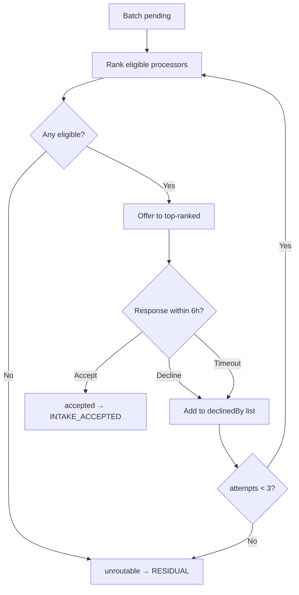

# Algorithms — Cirquo

**Document type:** Technical specification  
**Status:** Draft v1.0  
**Last updated:** 2026-08-06  
**Implementation status:** 📋 Not yet built

> Five algorithms drive Cirquo's behaviour. All are **deliberately rule-based and explainable**. None is machine learning. This is a design decision, not a limitation — see §7.

| Algorithm | Purpose | Priority |
|---|---|---|
| [Dynamic Rescue Pricing](#2-dynamic-rescue-pricing) | Maximise probability of rescue before expiry | M (must) |
| [Circular Routing](#3-circular-routing) | Match unclaimed material to a capable Processor | M (must) |
| [Listing Ranking](#4-listing-ranking) | Order discovery results by rescue value | S (should) |
| [Impact Calculation](#5-impact-calculation) | Convert ledger events into metrics | M (must) |
| [Recommendation](#6-recommendation) | Surface relevant items to returning Consumers | C (could) |

---

## 1. Implementation Convention

Every algorithm is a **pure function** in `src/lib/`, importing nothing from Convex.

```
src/lib/pricing.ts     → suggestRescuePrice()
src/lib/routing.ts     → rankEligibleProcessors()
src/lib/ranking.ts     → rankListings()
src/lib/impact.ts      → summariseLedger(), estimateCo2e()
src/lib/geo.ts         → haversineMeters()
```

Convex functions load data, call the pure function, persist the result. Three reasons:

1. **Testable** without a Convex runtime — critical given no automated test suite exists ([RISKS.md](../business/RISKS.md) TECH-08)
2. **Portable** if the backend ever migrates ([DATABASE.md](../domain/DATABASE.md) §8)
3. **Explainable** — a judge asking "show me the pricing formula" gets one readable file, not a mutation with logic interleaved into database calls

All tunable constants live in a single exported config object per module so they can be adjusted without touching logic (requirement PRI-02).

---

## 2. Dynamic Rescue Pricing

### 2.1 Objective

Suggest a price that maximises the probability a Rescue Item is claimed before its pickup window closes, subject to two hard constraints:

- Never below the merchant's floor price (RI-2)
- Never at or above the original price (RI-3)

**What it is not optimising:** platform revenue. An unsold item earns Cirquo nothing and generates a routing cost. Rescue rate is worth more than per-transaction margin. See [BUSINESS.md](../business/BUSINESS.md) §7.

### 2.2 Inputs

| Input | Source | Why it matters |
|---|---|---|
| `originalPrice` | Merchant | Reference for the discount |
| `floorPrice` | Merchant | Hard lower bound |
| `pickupStartAt`, `pickupEndAt` | Merchant | Defines the urgency curve |
| `now` | System | Position on the curve |
| `initialQuantity`, `remainingQuantity` | System | Sell-through signal |
| `materialType` | Merchant | Perishability class |

### 2.3 The Formula

```
discount = base + urgency + stockPressure   (clamped, then floored)
price    = max(floorPrice, round(originalPrice × (1 − discount)))
```

**Term 1 — Base discount by material type.** Surplus is discounted from the moment it is listed; the starting point depends on how fast the category loses value.

| Material type | Base discount |
|---|---:|
| `prepared_food` | 50% |
| `bakery` | 45% |
| `produce` | 40% |
| `dairy` | 40% |
| `protein` | 45% |
| `dry_goods` | 30% |
| `mixed` | 40% |

Prepared food starts highest because it is worthless tomorrow. Dry goods start lowest because they retain value longest.

**Term 2 — Urgency.** Discount escalates as the window closes.

```
elapsed = (now − pickupStartAt) / (pickupEndAt − pickupStartAt)   // 0…1
urgency = URGENCY_MAX × elapsed²
```

`URGENCY_MAX = 0.25` (25 percentage points).

The **quadratic** curve is the key choice. Linear escalation drops the price too fast early, sacrificing margin on items that would have sold anyway. Quadratic keeps the price stable through the first half of the window, then falls sharply in the final stretch when the real alternative is routing to a processor.

| Elapsed | Linear | Quadratic |
|---:|---:|---:|
| 25% | +6.3pp | +1.6pp |
| 50% | +12.5pp | +6.3pp |
| 75% | +18.8pp | +14.1pp |
| 90% | +22.5pp | +20.3pp |
| 100% | +25.0pp | +25.0pp |

**Term 3 — Stock pressure.** If most stock is still unsold late in the window, apply additional discount.

```
sellThrough  = 1 − (remainingQuantity / initialQuantity)
expectedSell = elapsed
shortfall    = max(0, expectedSell − sellThrough)
stockPressure = STOCK_MAX × shortfall
```

`STOCK_MAX = 0.10`.

The logic: at 60% through the window we would expect roughly 60% sold. At 20% sold, the shortfall is 0.4, adding 4 percentage points. If sell-through is ahead of schedule, `shortfall` is 0 and no extra discount applies — a well-selling item should not be marked down further.

**Clamp:** total discount capped at `MAX_DISCOUNT = 0.75`. Beyond 75% off, a listing reads as damaged goods rather than a bargain, and merchant trust erodes.

### 2.4 Reference Implementation

```typescript
// src/lib/pricing.ts

export const PRICING_CONFIG = {
  baseDiscountByMaterial: {
    prepared_food: 0.50,
    bakery: 0.45,
    produce: 0.40,
    dairy: 0.40,
    protein: 0.45,
    dry_goods: 0.30,
    mixed: 0.40,
  },
  URGENCY_MAX: 0.25,
  STOCK_MAX: 0.10,
  MAX_DISCOUNT: 0.75,
  MIN_PRICE_IDR: 5_000,
} as const

export type PricingInput = {
  originalPrice: number
  floorPrice: number
  pickupStartAt: number
  pickupEndAt: number
  now: number
  initialQuantity: number
  remainingQuantity: number
  materialType: MaterialType
}

export type PricingResult = {
  suggestedPrice: number
  discountPercent: number
  breakdown: { base: number; urgency: number; stockPressure: number }
  clampedByFloor: boolean
}

export function suggestRescuePrice(input: PricingInput): PricingResult {
  const c = PRICING_CONFIG

  const base = c.baseDiscountByMaterial[input.materialType] ?? 0.40

  const windowMs = Math.max(1, input.pickupEndAt - input.pickupStartAt)
  const elapsed = clamp01((input.now - input.pickupStartAt) / windowMs)
  const urgency = c.URGENCY_MAX * elapsed ** 2

  const sellThrough = input.initialQuantity > 0
    ? 1 - input.remainingQuantity / input.initialQuantity
    : 0
  const shortfall = Math.max(0, elapsed - sellThrough)
  const stockPressure = c.STOCK_MAX * shortfall

  const raw = Math.min(c.MAX_DISCOUNT, base + urgency + stockPressure)
  const target = Math.round(input.originalPrice * (1 - raw))

  const floor = Math.max(input.floorPrice, c.MIN_PRICE_IDR)
  const suggestedPrice = Math.max(floor, target)

  return {
    suggestedPrice,
    discountPercent: (1 - suggestedPrice / input.originalPrice) * 100,
    breakdown: { base, urgency, stockPressure },
    clampedByFloor: suggestedPrice > target,
  }
}

const clamp01 = (n: number) => Math.min(1, Math.max(0, n))
```

`breakdown` is returned deliberately — the merchant UI shows *why* a price was suggested, and a judge asking how it works gets a number-by-number answer.

### 2.5 Worked Example

Bakery box, original Rp60.000, floor Rp15.000, 8 units, window 18:00–21:00.

| Time | Elapsed | Sold | Base | Urgency | Stock | Total | Price |
|---|---:|---:|---:|---:|---:|---:|---:|
| 18:00 | 0% | 0/8 | 45% | 0.0% | 0.0% | 45.0% | Rp33.000 |
| 19:00 | 33% | 2/8 | 45% | 2.8% | 0.8% | 48.6% | Rp30.840 |
| 20:00 | 67% | 4/8 | 45% | 11.1% | 1.7% | 57.8% | Rp25.320 |
| 20:30 | 83% | 5/8 | 45% | 17.4% | 2.1% | 64.5% | Rp21.300 |
| 20:50 | 94% | 6/8 | 45% | 22.3% | 1.9% | 69.2% | Rp18.480 |

The price falls gently while stock is moving, then accelerates in the final half-hour — exactly the shape wanted, because at 20:50 the realistic alternative is not a better price, it is routing to a processor.

### 2.6 Update Cadence

Prices are recalculated by a scheduled job every **15 minutes** for `active` items ([SCHEDULER.md](../architecture/SCHEDULER.md)). Each change emits a `PRICE_ADJUSTED` ledger event.

Why 15 minutes and not continuous: a price that visibly changes while a consumer is deciding erodes trust, and a reserved order locks its price at reservation regardless. Fifteen minutes is responsive enough for a 2–4 hour window and cheap enough to run indefinitely.

### 2.7 Edge Cases

| Case | Behaviour |
|---|---|
| `floorPrice > originalPrice` | Reject at listing time (RI-3) |
| Window already closed | Return current price; expiry handles it |
| `initialQuantity == 0` | `sellThrough = 0`, no stock pressure |
| Merchant manually overrides | Override wins; engine stops adjusting that item |
| Suggested price below `MIN_PRICE_IDR` | Clamp to Rp5.000 — see [BUSINESS.md](../business/BUSINESS.md) §10 on loss-making transactions |

---

## 3. Circular Routing

### 3.1 Objective

When a Rescue Item is unclaimed at window close, or was flagged processing-only, find the Processor most likely to actually accept and process it.

**Failure of this algorithm is the failure of the product.** An item that cannot be routed becomes residual waste, which is the one outcome Cirquo exists to prevent.

### 3.2 Eligibility Filter (Hard Constraints)

Applied before ranking. A Processor failing any of these is excluded entirely.

| # | Constraint | Rationale |
|---|---|---|
| E1 | `verificationStatus == 'verified'` | Unverified facilities cannot receive material |
| E2 | `item.materialType ∈ processor.acceptedMaterialTypes` | RB-2 — never send meat waste to a vegetable-only composter |
| E3 | `distance ≤ processor.maxPickupRadiusMeters` | Transport is off-platform; distance must be workable |
| E4 | `todayAcceptedGrams + offeredGrams ≤ dailyCapacityGrams` | RB-3 — never exceed physical capacity |
| E5 | `processorId ∉ batch.declinedByProcessorIds` | Never re-offer to a processor that already declined |
| E6 | Facility open within the next 24h | An offer to a closed facility expires unanswered |

**E2 and E4 are the ones that matter most in practice.** Routing to a facility that cannot handle the material type produces a decline, wasting a routing attempt and 6 hours of offer TTL — during which the material is degrading.

### 3.3 Ranking Score

```
score = w_d × proximity + w_c × capacityHeadroom + w_r × reliability + w_m × materialFit
```

| Weight | Value | Component |
|---|---:|---|
| `w_d` | 0.40 | Proximity |
| `w_c` | 0.25 | Capacity headroom |
| `w_r` | 0.25 | Historical reliability |
| `w_m` | 0.10 | Material specialisation |

**Proximity** — `1 − (distance / maxRadius)`. Nearest gets 1.0. Weighted highest because transport friction is the dominant real-world reason a routed batch never gets collected.

**Capacity headroom** — `1 − (todayAccepted / dailyCapacity)`. Spreads load across the network instead of saturating the closest facility. A processor at 90% capacity scores 0.1 even if adjacent.

**Reliability** — `acceptedCount / (acceptedCount + declinedCount + expiredOfferCount)`, defaulting to 0.7 for processors with fewer than 5 historical offers. This is the term that self-corrects: a processor that habitually ignores offers stops receiving them.

**Material fit** — `1.0` if the processor accepts fewer than 3 material types (specialist), `0.5` otherwise. Mildly prefers specialists, who typically produce higher-quality output from matched feedstock.

### 3.4 Reference Implementation

```typescript
// src/lib/routing.ts

export const ROUTING_CONFIG = {
  weights: { proximity: 0.40, capacity: 0.25, reliability: 0.25, material: 0.10 },
  MAX_ATTEMPTS: 3,
  OFFER_TTL_MS: 6 * 60 * 60 * 1000,   // 6 hours
  DEFAULT_RELIABILITY: 0.7,
  MIN_HISTORY_FOR_RELIABILITY: 5,
} as const

export function rankEligibleProcessors(
  item: { materialType: MaterialType; weightGrams: number; lat: number; lng: number },
  batch: { declinedByProcessorIds: string[] },
  processors: ProcessorWithStats[],
  now: number,
): RankedProcessor[] {
  const w = ROUTING_CONFIG.weights

  return processors
    .map(p => ({ p, distance: haversineMeters(item.lat, item.lng, p.latitude, p.longitude) }))
    .filter(({ p, distance }) =>
      p.verificationStatus === 'verified' &&
      p.acceptedMaterialTypes.includes(item.materialType) &&
      distance <= p.maxPickupRadiusMeters &&
      p.todayAcceptedGrams + item.weightGrams <= p.dailyCapacityGrams &&
      !batch.declinedByProcessorIds.includes(p._id) &&
      opensWithin24h(p, now))
    .map(({ p, distance }) => {
      const proximity = 1 - distance / p.maxPickupRadiusMeters
      const capacity = 1 - p.todayAcceptedGrams / p.dailyCapacityGrams
      const history = p.acceptedCount + p.declinedCount + p.expiredOfferCount
      const reliability = history >= ROUTING_CONFIG.MIN_HISTORY_FOR_RELIABILITY
        ? p.acceptedCount / history
        : ROUTING_CONFIG.DEFAULT_RELIABILITY
      const material = p.acceptedMaterialTypes.length < 3 ? 1.0 : 0.5

      return {
        processorId: p._id,
        distance,
        score: w.proximity * proximity + w.capacity * capacity +
               w.reliability * reliability + w.material * material,
        breakdown: { proximity, capacity, reliability, material },
      }
    })
    .sort((a, b) => b.score - a.score)
}
```

### 3.5 Retry Loop



Three attempts × 6h TTL means a batch is resolved within 18 hours worst case. Beyond that the material has degraded past usefulness to most processors, so continuing to retry would be theatre rather than recovery.

An `unroutable` batch is not silently discarded — it emits `ROUTING_FAILED` with the full attempt history, and an Admin can manually re-route it (ADM-06). The residual weight is reported honestly in impact figures.

### 3.6 Sequential vs. Broadcast Offers

| Approach | Trade-off |
|---|---|
| **Sequential** ✅ | One processor at a time, ranked. Predictable, no double-acceptance race, fair load distribution. Slower worst case |
| Broadcast | Offer to all eligible simultaneously, first accept wins. Faster, but creates a race condition, and processors learn to ignore offers they will lose |

Sequential is chosen. The 6-hour TTL is the tuning knob if latency becomes a problem; it can be shortened to 2h without changing the algorithm.

---

## 4. Listing Ranking

### 4.1 Objective

Order discovery results so Consumers see the rescues that matter most — nearby, well-discounted, and genuinely at risk of expiring.

### 4.2 Score

```
score = 0.40 × proximity + 0.30 × discount + 0.20 × urgency + 0.10 × availability
```

| Component | Formula | Rationale |
|---|---|---|
| Proximity | `1 − (distance / searchRadius)` | Dominant factor — pickup is on foot or a short ride |
| Discount | `(originalPrice − currentPrice) / originalPrice` | The primary consumer motivator |
| Urgency | `1 − (msRemaining / totalWindowMs)` | Surfaces items closest to being lost |
| Availability | `remainingQuantity / initialQuantity` | Slight preference for items unlikely to sell out mid-checkout |

**Why urgency is only 0.20:** ranking purely by urgency would show consumers items 10 minutes from expiry that they cannot realistically reach. Urgency helps the mission but must not override feasibility.

**Filters applied before ranking:** `status ∈ {active, reserved_partial}`, `remainingQuantity > 0`, `now < pickupEndAt`, `processingOnly == false`, `distance ≤ searchRadius`, plus any consumer-selected category and dietary filters.

### 4.3 Reference Implementation

```typescript
// src/lib/ranking.ts

export const RANKING_CONFIG = {
  weights: { proximity: 0.40, discount: 0.30, urgency: 0.20, availability: 0.10 },
  DEFAULT_RADIUS_M: 5_000,
} as const

export function rankListings(
  items: ListingWithMerchant[],
  origin: { lat: number; lng: number },
  radiusMeters: number,
  now: number,
): RankedListing[] {
  const w = RANKING_CONFIG.weights

  return items
    .map(i => ({ i, distance: haversineMeters(origin.lat, origin.lng, i.merchantLat, i.merchantLng) }))
    .filter(({ i, distance }) =>
      distance <= radiusMeters &&
      i.remainingQuantity > 0 &&
      now < i.pickupEndAt &&
      !i.processingOnly)
    .map(({ i, distance }) => {
      const proximity = 1 - distance / radiusMeters
      const discount = (i.originalPrice - i.currentPrice) / i.originalPrice
      const windowMs = Math.max(1, i.pickupEndAt - i.pickupStartAt)
      const urgency = clamp01(1 - (i.pickupEndAt - now) / windowMs)
      const availability = i.remainingQuantity / i.initialQuantity

      return {
        ...i,
        distance,
        score: w.proximity * proximity + w.discount * discount +
               w.urgency * urgency + w.availability * availability,
      }
    })
    .sort((a, b) => b.score - a.score)
}
```

Consumers can override with explicit sorts (nearest, cheapest, closing soonest). The blended score is the default, not a cage.

---

## 5. Impact Calculation

### 5.1 Objective

Convert Material Flow Ledger entries into the metrics displayed on every dashboard. Full methodology, emission factors, and limitations are in [IMPACT.md](IMPACT.md); this section covers the computation.

### 5.2 Aggregation

Input: ledger entries for a scope (user, merchant, processor, platform) and a period.

| Metric | Derivation |
|---|---|
| `listedGrams` | Σ delta where `eventType == 'LISTED'` |
| `rescuedGrams` | Σ \|delta\| where `eventType == 'RESCUED'` |
| `recoveredGrams` | Σ `metadata.outputWeightGrams` where `eventType == 'PROCESSED'` |
| `residualGrams` | Σ `metadata.residualWeightGrams` (PROCESSED) + Σ \|delta\| (`ROUTING_FAILED`, `MODERATED`) |
| `circularityRate` | `(rescued + recovered) / listed × 100` |
| `diversionRate` | `recovered / (listed − rescued) × 100` |
| `revenueRecovered` | Σ `metadata.totalPrice` where `eventType == 'RESCUED'` |
| `co2eAvoidedGrams` | `estimateCo2e(rescuedGrams, recoveredGrams)` — see [IMPACT.md](IMPACT.md) |

`PROCESSED` is the only event that splits across two outcomes, which is why its metadata is parsed rather than its delta being taken wholesale. Treating the full delta as "recovered" would silently hide residual waste — the precise dishonesty this document exists to avoid.

### 5.3 Reference Implementation

```typescript
// src/lib/impact.ts

export function summariseLedger(entries: LedgerEntry[]): ImpactSummary {
  let listed = 0, rescued = 0, recovered = 0, residual = 0, revenue = 0

  for (const e of entries) {
    const meta = e.metadata ? JSON.parse(e.metadata) : {}

    switch (e.eventType) {
      case 'LISTED':
        listed += e.weightDeltaGrams
        break
      case 'RESCUED':
        rescued += Math.abs(e.weightDeltaGrams)
        revenue += meta.totalPrice ?? 0
        break
      case 'PROCESSED':
        recovered += meta.outputWeightGrams ?? 0
        residual  += meta.residualWeightGrams ?? 0
        break
      case 'ROUTING_FAILED':
      case 'MODERATED':
        residual += Math.abs(e.weightDeltaGrams)
        break
    }
  }

  const unrescued = Math.max(0, listed - rescued)

  return {
    listedGrams: listed,
    rescuedGrams: rescued,
    recoveredGrams: recovered,
    residualGrams: residual,
    circularityRate: listed > 0 ? ((rescued + recovered) / listed) * 100 : 0,
    diversionRate: unrescued > 0 ? (recovered / unrescued) * 100 : 0,
    revenueRecovered: revenue,
    co2eAvoidedGrams: estimateCo2e(rescued, recovered),
  }
}
```

### 5.4 In-Flight Material

At any moment some material is listed but not yet resolved. Therefore:

```
rescued + recovered + residual ≤ listed
```

The gap is material still in the pipeline. Dashboards must show it as **"in progress"**, never fold it into residual — that would overstate failure — and never omit it, which would make the numbers not add up.

---

## 6. Recommendation

**Priority C. Post-MVP.**

Simple content-based filtering — no collaborative filtering, no embeddings.

```
affinity = 0.5 × categoryMatch + 0.3 × merchantMatch + 0.2 × priceBandMatch
finalScore = 0.7 × rankingScore + 0.3 × affinity
```

Where `categoryMatch` is the share of the consumer's past rescues in this material type, `merchantMatch` is 1.0 if they have rescued from this merchant before, and `priceBandMatch` compares against their historical average spend.

**Cold start:** a consumer with fewer than 3 completed rescues gets pure ranking with no personalisation. Personalising on one data point produces confidently wrong recommendations, which is worse than none.

---

## 7. Why No Machine Learning

A deliberate decision, and one that must be defended in Q&A.

| Reason | Detail |
|---|---|
| **No training data** | The platform has zero transaction history. ML on an empty dataset is theatre |
| **Explainability is scored** | A judge asking "why this price?" gets a number-by-number breakdown. "The model decided" is not an answer |
| **Calling it AI invites a fatal question** | Labelling a rule-based formula as AI leads directly to "where is the AI?" — see [RISKS.md](../business/RISKS.md) prepared defences |
| **Rule-based is auditable** | Regulators and sustainability auditors can verify a formula; they cannot verify a neural network's discount |
| **Timeline** | A 2–3 person team with an August deadline should not be building an ML pipeline |

**When ML would genuinely help:** demand forecasting from 6+ months of history (predicting tomorrow's surplus per merchant), and processor acceptance prediction. Both are Phase 5 in [ROADMAP.md](../business/ROADMAP.md), and both require data that does not yet exist.

---

## 8. Tuning and Configuration

Requirement PRI-02 states pricing factors must be configurable without a redeploy.

**MVP approach:** exported `*_CONFIG` constants per module. Changing them requires a deploy, but they are isolated, documented, and reviewable in one place.

**Phase 2 approach:** a `platformConfig` Convex table holding the same values, read at function invocation with the constants as fallback defaults. This satisfies PRI-02 properly and lets an Admin tune the pricing curve from the dashboard.

Deferring is the right call: configuring a formula that has never run against real data optimises the wrong thing. Ship the constants, observe real rescue rates, then make them tunable.

---

## 9. Testing Priority

Given no automated suite exists, these are the tests worth writing first — all pure functions, no Convex runtime required.

| # | Function | Cases |
|--:|---|---|
| 1 | `suggestRescuePrice` | Floor clamp; max discount clamp; window boundaries (elapsed 0 and 1); zero quantity |
| 2 | `rankEligibleProcessors` | Material type exclusion; capacity exclusion; declined-list exclusion; empty result |
| 3 | `summariseLedger` | Partial outcome (rescued + recovered + residual on one item); in-flight gap; empty input |
| 4 | `haversineMeters` | Known coordinate pairs; identical points return 0 |
| 5 | Weight conservation | Full lifecycle sequence sums to zero |

Test 3 is the highest-value one. It is the function every dashboard number passes through, and its partial-outcome branch is the easiest thing in the codebase to get subtly wrong.

---

## Related Documents

- [IMPACT.md](IMPACT.md) — CO2e methodology, emission factors, assumptions, limitations
- [MATERIAL_LEDGER.md](MATERIAL_LEDGER.md) — Event catalogue these algorithms emit
- [STATE_MACHINE.md](../domain/STATE_MACHINE.md) — Transitions triggered by routing and expiry
- [DATABASE.md](../domain/DATABASE.md) — Fields these algorithms read
- [SCHEDULER.md](../architecture/SCHEDULER.md) — Jobs invoking pricing and routing
- [BACKEND.md](../architecture/BACKEND.md) — Pure-logic separation pattern
- [BUSINESS.md](../business/BUSINESS.md) — Pricing philosophy and unit economics
- [TESTING.md](../engineering/TESTING.md) — Test strategy

---

**Built for DSDC ANFORCOM 2026**  
**Platform:** Cirquo — Closing the Loop, Saving Every Meal
