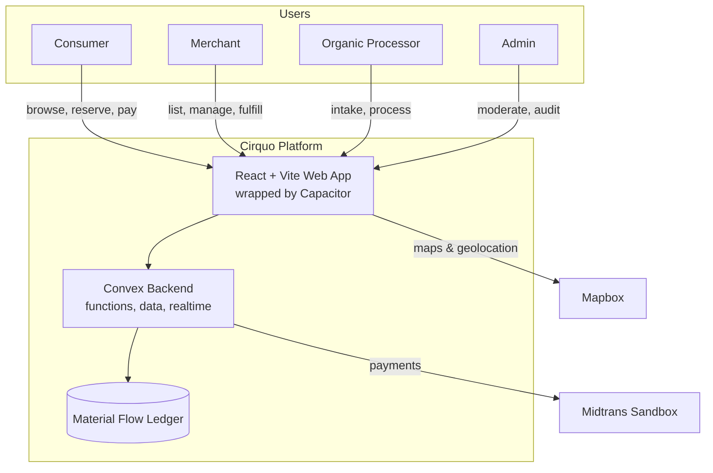
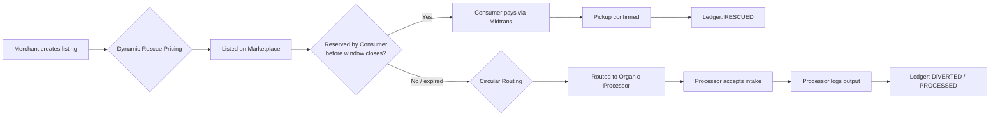

# Product Requirements Document (PRD) — Cirquo

| | |
|---|---|
| **Product** | Cirquo |
| **Tagline** | Closing the Loop, Saving Every Meal. |
| **Category** | Circular Food Recovery Platform |
| **Context** | Built for DSDC ANFORCOM 2026 |
| **Document owner** | Product / Founder |
| **Status** | Draft v1.0 — living document |
| **Last updated** | 2026-08-06 |

> **Note to the AI coding agent:** This document is the source of truth for *what* to build and *why*. It intentionally does not prescribe database schemas, API contracts, or component-level architecture — those belong in dedicated follow-up documents (`DATABASE.md`, `API.md`, `ARCHITECTURE.md`, `ALGORITHM.md`, `DESIGN.md`, etc.) that can be generated next using this PRD as their source. When a requirement here is ambiguous, prefer the interpretation that best serves the circular-economy mission described in Section 1, and flag the assumption you made rather than silently guessing.

---

## 1. Product Overview

### 1.1 Vision

Cirquo exists to close the loop on food waste. Instead of treating "unsold food" as trash, Cirquo treats it as a resource that should always have a next best use — first as discounted food for people (**Consumer Rescue**), and if that's not possible, as feedstock for **Organic Processors** (composting, animal feed, biogas, etc.). Every unit of food that enters the system is tracked from listing to its final outcome, forming a **Material Flow Ledger** that powers transparent environmental impact reporting.

Cirquo is **not a food delivery app**. Food delivery apps optimize for convenience and choice. Cirquo optimizes for **diversion of food from landfill** and **recovery of value from surplus**. The marketplace (browsing, reserving, paying for rescued food) is only the consumer-facing entry point into a larger system whose real product is the **circular routing and tracking of food material**.

### 1.2 Problem Statement

- Food businesses (restaurants, bakeries, groceries, caterers) routinely over-produce or overstock and are left with unsold, still-good food at the end of a service window.
- Consumers who would gladly buy discounted surplus food have no reliable, centralized way to discover it nearby.
- Food that isn't rescued by a consumer is usually thrown into general waste rather than routed to composting or other organic processing, even though processors actively want this feedstock.
- No party in this chain — merchant, consumer, or processor — has visibility into the *combined* environmental impact of their actions (kg of food saved, CO2e avoided, waste diverted), which weakens the incentive to participate and makes impact reporting to investors, sustainability programs, or regulators impossible.

### 1.3 Solution

Cirquo connects three sides of a circular ecosystem through one platform:

1. **Merchants** list surplus food ("Rescue Items") close to expiry at a discount, priced dynamically based on time remaining and other risk factors.
2. **Consumers** discover and reserve nearby Rescue Items on a map-based marketplace and pick them up within a defined window.
3. **Organic Processors** receive Rescue Items that go unclaimed or are explicitly unsellable, converting them into compost, feed, or energy, and log the outcome back into the platform.

Every step — listing, reservation, pickup, expiry, hand-off to a processor, processing outcome — is written to the **Material Flow Ledger**, which is the backbone for the **Impact Tracking** module surfaced to all roles and to Admins/judges/stakeholders.

### 1.4 Value Proposition by Actor

| Actor | Value |
|---|---|
| **Consumer** | Buys good food at a steep discount; sees personal impact (kg saved, CO2e avoided) |
| **Merchant** | Recovers partial revenue instead of a total loss; reduces waste-disposal cost; gets sustainability reporting for free |
| **Organic Processor** | Reliable, tracked supply of organic feedstock without needing their own collection network |
| **Admin / Platform** | A transparent, auditable circular economy dataset that is the platform's core differentiator |

---

## 2. Goals & Success Metrics

### 2.1 Product Goals (MVP)

1. Enable a merchant to list a Rescue Item and have it discovered and reserved by a nearby consumer within minutes.
2. Enable a Rescue Item that goes unclaimed to be automatically or manually routed to a registered Organic Processor.
3. Record every state transition of a Rescue Item (listed → reserved → picked up / expired → routed → processed) in the Material Flow Ledger.
4. Compute and display impact metrics (food weight rescued, food weight diverted to processing, estimated CO2e avoided) at the individual (consumer/merchant/processor) and platform level.
5. Support a functioning payment flow for reservations via Midtrans Sandbox.

### 2.2 Success Metrics (KPIs)

| Metric | Definition | Why it matters |
|---|---|---|
| Rescue completion rate | % of listed items reserved & picked up before expiry | Marketplace liquidity |
| Diversion rate | % of unclaimed items successfully routed to a processor (not left to expire unrouted) | Core circular-economy promise |
| Kg of food rescued | Total weight of items picked up by consumers | Direct impact metric |
| Kg of food diverted | Total weight handed to processors | Direct impact metric |
| Estimated CO2e avoided | Derived from rescued + diverted weight (see `ALGORITHM.md` for methodology) | Headline sustainability metric |
| Active merchants / processors | Count of businesses with ≥1 transaction in the last 30 days | Supply-side health |
| Time-to-reservation | Median time between a listing going live and being reserved | Marketplace efficiency |

---

## 3. Target Users & Personas

### 3.1 Consumer
Individuals who want quality food at a discount and care about reducing waste. Price-sensitive, mobile-first, expects a map-based "what's near me right now" experience similar to marketplace apps they already use, but with a sustainability framing (impact stats, not just savings).

### 3.2 Merchant
Owner or staff of a food business (bakery, restaurant, grocery, catering, cafe) with recurring end-of-day or near-expiry surplus. Needs the fastest possible path from "I have surplus" to "it's listed," minimal manual pricing decisions, and simple pickup verification.

### 3.3 Organic Processor
A composting facility, biogas plant, or animal-feed operator that wants a predictable, logged intake of organic material. Cares about intake volume, material type/quality, and having a clean audit trail for their own reporting or certifications.

### 3.4 Admin
Platform operator responsible for onboarding/moderating merchants and processors, resolving disputes, monitoring platform health, and producing aggregate impact reports (e.g., for competition judges or future investors/partners).

---

## 4. Scope

### 4.1 In Scope — Competition MVP

- Authentication & role-based onboarding for all four roles.
- Merchant: create/manage Rescue Item listings, dynamic pricing suggestion, view/manage incoming reservations, mark pickup complete, basic sales/impact dashboard.
- Consumer: map/list-based discovery of nearby Rescue Items, filters, reservation + Midtrans Sandbox payment, order/pickup status tracking, personal impact dashboard.
- Organic Processor: view incoming routed/unclaimed items, accept intake, log processing outcome (type of output, quantity), processor-level impact dashboard.
- Admin: user & listing moderation, dispute handling, platform-wide impact dashboard, Material Flow Ledger inspection.
- Material Flow Ledger: append-only record of every Rescue Item's lifecycle events.
- Impact Tracking: computed metrics surfaced per-role and platform-wide (methodology detailed separately in `ALGORITHM.md` / `IMPACT.md`).
- Notifications for key state changes (new nearby listing, reservation confirmed, pickup reminder, item expiring, routed to processor).
- Mobile-capable web app shell via Capacitor (installable on iOS/Android from the same React codebase).

### 4.2 Out of Scope — Post-MVP / Future

- Multi-payment-gateway support beyond Midtrans (MVP uses Midtrans Sandbox only).
- Merchant-side POS/inventory system integrations.
- Automated computer-vision food-quality verification at pickup.
- Route optimization / logistics dispatch for processor pickups (MVP assumes processor or merchant arranges transport; the platform tracks, it does not dispatch).
- Loyalty programs, gamification, referral systems.
- Multi-country / multi-currency support (MVP is Indonesia-focused, IDR only).
- Native mobile apps built outside the Capacitor-wrapped web shell.

---

## 5. Glossary

| Term | Meaning |
|---|---|
| **Rescue Item** | A unit of surplus food listed by a Merchant, available for a Consumer to reserve or eligible to be routed to a Processor |
| **Rescue** | A completed transaction where a Consumer reserves and picks up a Rescue Item |
| **Routing** | The act of directing an unclaimed/unsellable Rescue Item to an Organic Processor instead of general waste |
| **Material Flow Ledger** | The append-only log of every lifecycle event of every Rescue Item, used to compute impact metrics and provide auditability |
| **Dynamic Rescue Pricing** | The algorithm that suggests/adjusts a Rescue Item's discounted price based on time-to-expiry and other risk factors |
| **Impact Tracking** | The set of computed, displayed metrics (kg rescued, kg diverted, CO2e avoided) derived from the Material Flow Ledger |
| **Circular Routing** | The decision logic that determines whether an item should stay on the marketplace, be re-routed, or be sent to a processor |

---

## 6. Functional Requirements

Priority uses MoSCoW: **M**ust have, **S**hould have, **C**ould have, **W**on't have (this release).

### 6.1 Authentication & Onboarding

| ID | Requirement | Priority |
|---|---|---|
| AUTH-01 | Users can register and log in as one of: Consumer, Merchant, Organic Processor | M |
| AUTH-02 | Admin accounts are provisioned separately, not via public self-registration | M |
| AUTH-03 | Merchant and Processor accounts require business profile details (name, address, location pin, business type) before they can transact | M |
| AUTH-04 | Merchant and Processor accounts go through an Admin verification step before their listings/intake requests go live | S |
| AUTH-05 | Session-based auth persists across app restarts on mobile (Capacitor) | M |
| AUTH-06 | Password reset flow | S |

### 6.2 Merchant Module

| ID | Requirement | Priority |
|---|---|---|
| MER-01 | Merchant can create a Rescue Item listing with: title, description, category, original price, quantity, weight/unit estimate, expiry/pickup window, photo | M |
| MER-02 | Platform suggests a discounted price via Dynamic Rescue Pricing based on time-to-expiry; Merchant can accept or override it | M |
| MER-03 | Merchant can edit or cancel a listing before it is reserved | M |
| MER-04 | Merchant can view incoming reservations and mark a pickup as completed (e.g., via a code/QR shown by the Consumer) | M |
| MER-05 | Listings that pass their pickup window without being claimed are automatically flagged for Circular Routing | M |
| MER-06 | Merchant can view a dashboard: items listed, items rescued, items routed to processing, revenue recovered, personal impact stats | S |
| MER-07 | Merchant can mark a listing as "processing-only" from creation (e.g., trim/bakery scraps not fit for consumer sale), skipping the marketplace and going straight to Circular Routing | S |

### 6.3 Consumer Module

| ID | Requirement | Priority |
|---|---|---|
| CON-01 | Consumer can browse Rescue Items on a map (Mapbox) centered on their current location | M |
| CON-02 | Consumer can browse Rescue Items as a filterable/sortable list (distance, price, category, pickup window) | M |
| CON-03 | Consumer can view listing detail and reserve an item, locking its price and quantity | M |
| CON-04 | Consumer completes payment via Midtrans Sandbox to confirm the reservation | M |
| CON-05 | Consumer receives a pickup code/QR to present at the merchant | M |
| CON-06 | Consumer can view active and past orders with status (reserved, picked up, expired/cancelled) | M |
| CON-07 | Consumer can view a personal impact dashboard: total kg rescued, estimated CO2e avoided, money saved | S |
| CON-08 | Consumer can cancel a reservation within a defined grace period | S |
| CON-09 | Consumer can rate a completed pickup | C |

### 6.4 Organic Processor Module

| ID | Requirement | Priority |
|---|---|---|
| PRC-01 | Processor can view a queue of Rescue Items routed to them (unclaimed marketplace items, or "processing-only" items) | M |
| PRC-02 | Processor can accept or decline an incoming routed item | M |
| PRC-03 | Processor logs an intake record: quantity/weight received, material type | M |
| PRC-04 | Processor logs a processing outcome: output type (e.g., compost, biogas, animal feed), output quantity, residual waste quantity | M |
| PRC-05 | Processor can view a dashboard: total intake volume, output volume by type, residual waste rate, impact stats | S |
| PRC-06 | Processor defines accepted material types / intake capacity in their profile, used by Circular Routing to match relevant items | S |

### 6.5 Admin Module

| ID | Requirement | Priority |
|---|---|---|
| ADM-01 | Admin can view, verify, suspend, or reject Merchant and Processor accounts | M |
| ADM-02 | Admin can view and moderate/remove listings that violate platform rules | M |
| ADM-03 | Admin can view the full Material Flow Ledger for any Rescue Item (audit trail) | M |
| ADM-04 | Admin can view platform-wide dashboards: total kg rescued, kg diverted, CO2e avoided, active users by role, transaction volume | M |
| ADM-05 | Admin can resolve disputes (e.g., a Consumer reports a no-show Merchant, or vice versa) | S |
| ADM-06 | Admin can manually re-route a stuck/unclaimed item to a specific Processor | S |

### 6.6 Marketplace & Discovery

| ID | Requirement | Priority |
|---|---|---|
| MKT-01 | Discovery is map-first, using Mapbox to render Merchant locations and Rescue Item availability | M |
| MKT-02 | Search/filter by category, distance radius, price range, pickup window | M |
| MKT-03 | Nearby-merchant ranking considers distance, price attractiveness, and time-to-expiry urgency (see `ALGORITHM.md` for the ranking formula) | S |
| MKT-04 | Simple recommendation of items to a returning Consumer based on past categories rescued | C |

### 6.7 Payments

| ID | Requirement | Priority |
|---|---|---|
| PAY-01 | Reservation payment is processed through Midtrans Sandbox | M |
| PAY-02 | Payment status (pending, paid, failed, refunded) is reflected on the order in real time | M |
| PAY-03 | A cancelled/expired unclaimed reservation triggers an automatic refund flow | S |
| PAY-04 | Merchant payouts (post-platform-fee, if any) are tracked, even if actual payout execution is manual in the MVP | C |

### 6.8 Notifications

| ID | Requirement | Priority |
|---|---|---|
| NOT-01 | Consumer is notified when a new Rescue Item is listed nearby matching their recent interests/categories | S |
| NOT-02 | Consumer is notified when their reservation is confirmed and again as the pickup window approaches | M |
| NOT-03 | Merchant is notified of a new reservation and when a listing is about to expire unclaimed | M |
| NOT-04 | Processor is notified when a new item is routed to their queue | M |
| NOT-05 | Admin is notified of flagged disputes or repeated no-shows | C |

### 6.9 Impact Tracking & Material Flow Ledger

| ID | Requirement | Priority |
|---|---|---|
| IMP-01 | Every lifecycle event of a Rescue Item (created, reserved, paid, picked up, expired, routed, intake-accepted, processed) is written as an immutable entry to the Material Flow Ledger | M |
| IMP-02 | Impact metrics (kg rescued, kg diverted, CO2e avoided) are derived from Ledger data, never hand-entered | M |
| IMP-03 | Impact dashboards exist for Consumer, Merchant, Processor (personal scope) and Admin (platform-wide scope) | M |
| IMP-04 | The CO2e estimation methodology and its assumptions are documented and versioned so historical numbers stay explainable if the formula changes (full methodology in `IMPACT.md`) | S |

### 6.10 Pricing Engine (Dynamic Rescue Pricing)

| ID | Requirement | Priority |
|---|---|---|
| PRI-01 | System suggests a discount percentage that increases as the pickup window approaches expiry | M |
| PRI-02 | Pricing factors are configurable (not hardcoded), so the formula can be tuned without a code redeploy (full spec in `ALGORITHM.md`) | S |
| PRI-03 | Merchant-set floor price is always respected; the engine never suggests a price below it | M |

---

## 7. Non-Functional Requirements

| Category | Requirement |
|---|---|
| **Performance** | Map/listing views should feel responsive on mid-range Android devices (common in the target market); target sub-2s initial content paint on a typical 4G connection |
| **Scalability** | Backend (Convex) functions and data model should assume growth from a single-city MVP to multi-city without a rewrite; avoid city-hardcoded logic |
| **Security** | All auth flows use secure session/token handling; role-based authorization enforced server-side (Convex functions), never trusted from the client alone; payment data never touches Cirquo's own servers directly — handled via Midtrans |
| **Reliability** | The Material Flow Ledger is append-only and must never lose or silently overwrite an event — it is the platform's audit and impact source of truth |
| **Usability** | Mobile-first responsive design; map interactions must remain usable one-handed; core flows (list an item, reserve an item, log an intake) should be completable in a few taps/screens |
| **Accessibility** | Follow WCAG-informed practices where practical (color contrast, tap target sizing, alt text) — full detail in `DESIGN.md` |
| **Localization** | Primary language Bahasa Indonesia with English support; currency IDR; timezone WIB by default with per-user timezone awareness |
| **Platform support** | Single React + Vite codebase, deployed as a responsive web app and wrapped via Capacitor for iOS/Android distribution |
| **Compliance** | Personal data handling should be designed with Indonesia's UU PDP (Personal Data Protection Law) in mind; food-safety disclaimers are shown for discounted near-expiry items; full threat model in `SECURITY.md` |
| **Auditability** | Every state-changing action tied to the Material Flow Ledger or payments must be traceable to a user and a timestamp |

---

## 8. System Context (High Level)

The frontend is a single React + Vite application shared across web and mobile (via Capacitor), talking to Convex for data, business logic, and realtime updates. Mapbox powers all location/discovery UI. Midtrans Sandbox handles payment collection for reservations. Every business action that changes a Rescue Item's state is expected to also write to the Material Flow Ledger — this is a cross-cutting requirement, not a feature of any single module. (Full component and data-flow detail belongs in `ARCHITECTURE.md`.)

---

## 9. Core Rescue-Item Lifecycle (High Level Flow)

Both terminal paths — **RESCUED** (a Consumer ate it) and **DIVERTED/PROCESSED** (a Processor converted it) — count as a successful circular outcome and feed Impact Tracking. Only an item that is neither reserved nor successfully routed represents a failure of the platform's core promise, and should be visible as such in Admin reporting.

---

## 10. Roles & Permissions Summary

| Capability | Consumer | Merchant | Organic Processor | Admin |
|---|:---:|:---:|:---:|:---:|
| Browse/reserve Rescue Items | Implemented | Not implemented | Not implemented | Implemented (view only) |
| Create/manage listings | Not implemented | Implemented | Not implemented | Implemented (moderate) |
| Accept intake / log processing output | Not implemented | Not implemented | Implemented | Implemented (view only) |
| View own impact dashboard | Implemented | Implemented | Implemented | Implemented (platform-wide) |
| View full Material Flow Ledger | Not implemented (own orders only) | Not implemented (own listings only) | Not implemented (own intakes only) | Implemented |
| Verify/suspend accounts | Not implemented | Not implemented | Not implemented | Implemented |
| Resolve disputes | Not implemented | Not implemented | Not implemented | Implemented |

A full RBAC specification (exact server-side permission checks per Convex function) belongs in `ROLES.md`.

---

## 11. Key Algorithms (Overview Only)

Full specifications, formulas, and edge cases belong in `ALGORITHM.md`. This PRD only defines *intent* so the coding agent understands why these exist.

| Algorithm | Purpose |
|---|---|
| **Dynamic Rescue Pricing** | Suggests a discount that increases as a listing approaches its pickup/expiry window, to maximize the probability of a rescue while respecting the Merchant's floor price |
| **Circular Routing** | Decides what happens to an item that isn't reserved in time (or is marked processing-only): which Processor(s) it's eligible for, based on material type, location, and Processor intake capacity |
| **Impact Calculation** | Converts Material Flow Ledger entries (kg rescued, kg diverted) into estimated CO2e avoided, using a documented, versioned methodology |
| **Merchant/Listing Ranking** | Orders map/list results by a blend of distance, discount attractiveness, and urgency (time-to-expiry), so consumers see the most impactful rescues first |
| **Recommendation** (post-MVP-leaning) | Surfaces listings matching a Consumer's past rescued categories |

---

## 12. Acceptance Criteria — Definition of "MVP Done"

The MVP is considered feature-complete when all of the following are demonstrably true end-to-end:

1. A Merchant can register, get verified, and publish a Rescue Item listing with a system-suggested dynamic price.
2. A Consumer can discover that listing on the map within their radius, reserve it, and pay via Midtrans Sandbox.
3. The Merchant can confirm pickup, and the order status updates for the Consumer in real time.
4. An unclaimed listing automatically becomes eligible for Circular Routing after its window closes.
5. A registered Organic Processor can see that routed item, accept it, and log an intake + processing outcome.
6. Every one of the above actions produces a corresponding, timestamped, immutable entry in the Material Flow Ledger.
7. Consumer, Merchant, Processor, and Admin dashboards each correctly reflect impact numbers derived solely from Ledger data (no hardcoded/mocked totals).
8. The whole flow above works on both a desktop browser and a Capacitor-wrapped mobile build.

---

## 13. Assumptions & Constraints

- Target launch market is Indonesia (language, currency, regulatory framing), starting with a single city for the competition MVP.
- Merchants and Processors are assumed to have smartphone/computer access and basic digital literacy; the UI should not assume specialized hardware (e.g., no dedicated barcode scanners — QR codes readable by any phone camera).
- Pickup logistics between Merchant and Processor (physical transport) are arranged outside the platform in the MVP; Cirquo tracks and coordinates, it does not dispatch drivers.
- CO2e estimation is necessarily an approximation based on published emission-factor assumptions, not lab-measured per-item data; this must be clearly labeled as an estimate wherever shown.
- Convex is assumed as the backend for the competition timeline; a future PostgreSQL migration path should be kept in mind but is not blocking for MVP (see `DATABASE.md` when produced).

---

## 14. Risks (Summary)

| Risk | Impact | Mitigation direction |
|---|---|---|
| Low initial Merchant/Processor supply → empty marketplace | High | Seed with a small number of verified pilot partners before public consumer launch |
| Consumer no-shows after reservation | Medium | Grace-period cancellation + pickup code requirement + dispute flow |
| Inaccurate weight/quantity self-reporting skews impact numbers | Medium | Clear input guidance, plausible-range validation, transparent "estimated" labeling |
| Processor intake capacity mismatch (routed items they can't actually take) | Medium | Processor-defined accepted material types & capacity used in Circular Routing matching |
| Payment sandbox limitations vs. production readiness | Low (for competition), High (for real launch) | Explicitly scope Midtrans Sandbox as MVP-only; document production migration separately |

A full risk register with likelihood/severity scoring belongs in `RISKS.md`.

---

## 15. Related Documents

This PRD is the anchor document. The following companion documents are designed to be generated next, using this PRD as their source of truth, and should stay terminologically consistent with it (always "Rescue Item," "Material Flow Ledger," "Circular Routing," "Cirquo" — never "CirQuo"):

- `PRODUCT.md` — problem/solution narrative, positioning, competitive landscape
- `FEATURES.md` — per-feature breakdown with user stories and dependencies
- `USER_STORIES.md` / `USER_FLOW.md` — detailed INVEST-format stories and journey diagrams
- `ROLES.md` — full RBAC specification
- `DATABASE.md` — Convex schema design + future PostgreSQL migration plan
- `API.md` — endpoint/function contracts, payloads, error handling
- `ARCHITECTURE.md` — detailed system, service, and event-flow design
- `ALGORITHM.md` — full specs for Dynamic Rescue Pricing, Circular Routing, Impact Calculation, ranking
- `SECURITY.md` — threat model, auth/authz detail, compliance detail
- `IMPACT.md` — CO2e methodology, assumptions, limitations
- `DESIGN.md` — design system, accessibility, responsive rules
- `TESTING.md`, `DEPLOYMENT.md`, `ROADMAP.md`, `RISKS.md` — execution-support docs

---

## 16. Instructions for the AI Coding Agent

- Treat this PRD as authoritative for *product intent*. If a requirement conflicts with technical convenience, ask, don't silently drop it.
- Keep "Cirquo" as the product name in all code, copy, and comments (not "CirQuo").
- Every feature that changes a Rescue Item's state must also write to the Material Flow Ledger — do not implement marketplace/processor logic without this in mind, even in early scaffolding.
- Prefer building in the priority order M → S → C within each module in Section 6 when sequencing implementation work.
- When a requirement references a not-yet-created companion document (e.g., "see `ALGORITHM.md`"), implement a clearly-marked, reasonable placeholder and flag it for follow-up rather than inventing and hiding a permanent design decision.
