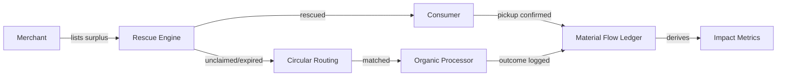

# Product Overview — Cirquo

**Platform:** Circular Food Recovery Platform  
**Tagline:** Closing the Loop, Saving Every Meal  
**Target Market:** Indonesia, starting with Semarang  
**Competition:** DSDC ANFORCOM 2026  
**Last updated:** 2026-08-29

---

> **Implementation boundary.** This is product positioning and target MVP
> scope. Source currently covers M1–M3 implementation, with Sandbox/mobile UAT
> still pending; Circular Routing, Processor outcomes, ledger-derived impact,
> and Admin operations are future milestones. See
> [IMPLEMENTATION_STATUS.md](../project/IMPLEMENTATION_STATUS.md).

---

## Problem Statement

### The Food Waste Gap

Indonesia generates an estimated 23–48 million tons of food waste annually, resulting in economic losses of Rp213–551 trillion per year and approximately 1,702.9 Mt CO2e emissions over a 20-year period (2000–2019, Bappenas data).

At the local level, food businesses face a daily challenge:

**Restaurants, bakeries, groceries, and caterers routinely over-produce or overstock**, leaving them with unsold, still-good food at the end of service windows. This surplus represents:
- Lost revenue (food that cost money to produce goes unsold)
- Disposal costs (waste management fees)
- Missed sustainability opportunities (no visibility into environmental impact)

**Consumers who would gladly buy discounted surplus food** have no reliable, centralized way to discover it nearby. Existing solutions are fragmented:
- Too Good To Go operates in other markets but not Indonesia
- Local initiatives exist but lack digital coordination
- No platform connects supply and demand in real-time

**Food that isn't rescued by consumers** is usually thrown into general waste rather than routed to composting or other organic processing, even though processors (BSF facilities, composting centers, biogas plants) actively want this feedstock and it's available locally in Semarang (TPA Jatibarang, TPST Gemah).

**No party in this chain** — merchant, consumer, or processor — has visibility into the combined environmental impact of their actions. This weakens the incentive to participate and makes impact reporting to investors, sustainability programs, or regulators impossible.

### Why This Matters for Semarang

Semarang's municipal government has identified organic waste as a priority problem due to rapid decomposition causing odor and sanitation issues. The city already operates:

- **TPA Jatibarang:** Uses maggot/BSF to reduce organic waste volume
- **TPST Gemah:** Receives waste from restaurants and shops, routes organic material to maggot farmers

These facilities exist and are operational. The problem is **lack of digital coordination**. Merchants don't know how to route surplus efficiently, processors don't have predictable supply, and consumers have no marketplace to access discounted food before it becomes waste.

Cirquo digitizes and orchestrates an ecosystem that already exists but remains fragmented.

---

## Solution

Cirquo is a **Circular Food Recovery Platform** that connects three sides of a circular ecosystem through one digital platform:

### Three-Sided Marketplace

1. **Merchants** (restaurants, bakeries, groceries, caterers)
   - List surplus food as "Rescue Items" close to expiry at a discount
   - Receive dynamic pricing suggestions based on time-to-expiry
   - Confirm pickup with the Consumer-presented manual pickup code
   - Track revenue recovered and environmental impact

2. **Consumers**
   - Discover nearby Rescue Items on a map (Mapbox)
   - Reserve and pay via Midtrans Sandbox
   - Pick up within a defined time window
   - See personal impact (kg saved, CO2e avoided, money saved)

3. **Organic Processors** (BSF facilities, composters, biogas plants)
   - Receive Rescue Items that go unclaimed or are explicitly unsellable
   - Log intake and processing outcomes
   - Track volume processed and output types
   - Build predictable supply pipeline

### Core Innovation: Material Flow Orchestration

Cirquo is **not a food delivery app**. Food delivery apps optimize for convenience and choice. Cirquo optimizes for **diversion of food from landfill** and **recovery of value from surplus**.

The marketplace (browsing, reserving, paying for rescued food) is only the consumer-facing entry point into a larger system whose real product is the **circular routing and tracking of food material**.

Every step — listing, reservation, pickup, expiry, hand-off to processor, processing outcome — is written to the **Material Flow Ledger**, an append-only log that forms the backbone for transparent **Impact Tracking** surfaced to all roles and stakeholders.

### What Makes This Different

| Aspect | Traditional Approach | Cirquo |
|---|---|---|
| **Focus** | Sell surplus food at discount | Track where every surplus item goes |
| **End state** | Consumer purchase | Consumer purchase OR organic processing |
| **Impact visibility** | None, or self-reported | Derived from append-only ledger |
| **Processor role** | Afterthought | First-class actor in the ecosystem |
| **Success metric** | Items sold | Circularity rate (% rescued + diverted) |

---

## Value Proposition

### For Consumers

**Buy good food at steep discounts while reducing waste.**

- Save 30–70% on quality meals from nearby restaurants and bakeries
- Discover surplus food on an interactive map
- See personal impact dashboard (kg saved, CO2e avoided, total savings)
- Feel good about preventing food from going to landfill
- Simple reserve-pay-pickup flow optimized for mobile

**Pain solved:** No reliable way to find discounted surplus food nearby in real-time.

### For Merchants

**Recover partial revenue instead of total loss, reduce waste costs, get free sustainability reporting.**

- Turn total-loss surplus into recovered revenue (even at steep discounts)
- Reduce waste disposal costs
- Automated dynamic pricing suggestions (don't guess the right discount)
- Simple manual pickup-code verification
- Dashboard showing kg rescued, revenue recovered, circularity rate
- Free impact reporting for sustainability programs, investors, or certifications
- No need to manage disposal of unclaimed items — Circular Routing handles it

**Pain solved:** Surplus is a pure loss with no recovery path or impact visibility.

### For Organic Processors

**Reliable, logged supply of organic feedstock without building a collection network.**

- Predictable intake volume from digital routing
- Logged audit trail for reporting and certifications
- Material type filtering matches processor capabilities
- Dashboard tracking intake, output, residual waste rate
- No need to cold-call restaurants — demand comes through the platform
- Free impact metrics for stakeholder reporting

**Pain solved:** Inconsistent supply, manual coordination, no audit trail for intake.

### For Admin / Platform / Judges

**A transparent, auditable circular economy dataset that is the platform's core differentiator.**

- Complete Material Flow Ledger providing audit trail for every Rescue Item
- Platform-wide impact dashboard (total kg rescued, diverted, CO2e avoided)
- Merchant and Processor verification tools
- Dispute resolution system
- Real-time visibility into marketplace health and circular outcomes
- Evidence-based sustainability reporting for competition, investors, partners

**Value delivered:** A working model of circular economy principles with measurable impact.

---

## Target Users & Personas

### Consumer Persona: "Budget-Conscious Sustainability Advocate"

**Demographics:**
- Age: 18–35
- Location: Urban Semarang
- Income: Middle to lower-middle class
- Device: Mid-range Android smartphone, 4G connection
- Digital literacy: Comfortable with mobile apps, social media, e-wallets

**Motivations:**
- Save money on quality food
- Reduce personal environmental footprint
- Discover new local restaurants and bakeries
- Feel part of a positive community movement

**Behaviors:**
- Checks app in late afternoon/evening for surplus listings
- Prefers nearby options (within 2–3 km)
- Willing to accept "surprise bag" format (varied contents)
- Values transparency (wants to see impact stats)
- Shares on social media when they make a rescue

**Pain points:**
- Doesn't know which restaurants have surplus and when
- Worried about food quality (is it actually good?)
- Needs pickup to fit their schedule

**Success criteria:**
- Finds a Rescue Item within 5 minutes of opening the app
- Completes reserve-to-pickup flow in under 10 taps
- Sees personal impact grow over time

---

### Merchant Persona: "Small Business Owner with Daily Surplus"

**Demographics:**
- Role: Owner or manager of restaurant, bakery, cafe, or catering business
- Business size: 2–10 employees
- Location: Semarang city center or residential neighborhoods
- Tech setup: Smartphone, possible POS system, basic digital literacy

**Motivations:**
- Reduce financial loss from unsold food
- Improve sustainability reputation
- Lower waste disposal costs
- Attract new customers (people who discover them via surplus)

**Behaviors:**
- Has recurring end-of-day surplus (bread at bakery close, unsold prepared meals)
- Currently throws surplus away or gives to staff
- Wants minimal effort to list surplus (no complex pricing decisions)
- Needs fast pickup verification (customers waiting)
- Interested in sustainability but lacks reporting tools

**Pain points:**
- Doesn't know how to price surplus (too high = no buyers, too low = leaves money on table)
- No time for manual coordination with composters or charity
- No visibility into environmental impact (can't report to stakeholders)
- Worried about fraud (customer claims they didn't get food)

**Success criteria:**
- List surplus in under 2 minutes
- Platform suggests sensible pricing automatically
- Pickup verification is quick (manual pickup-code entry)
- Dashboard shows revenue recovered and impact stats

---

### Processor Persona: "Organic Waste Facility Operator"

**Demographics:**
- Role: Manager of BSF/composting/biogas facility
- Facility type: Small to medium local operation
- Location: Semarang outskirts or nearby districts
- Tech setup: Computer or tablet for intake logging

**Motivations:**
- Secure predictable supply of organic feedstock
- Maintain audit trail for certifications or government reporting
- Grow facility capacity utilization
- Build partnerships with local businesses

**Behaviors:**
- Currently relies on informal agreements with waste collectors or direct pickups
- Needs to log intake for reporting (weight, material type)
- Outputs include compost, animal feed, biogas, or larva
- Has capacity limits and material type preferences (no cooked meat, etc.)

**Pain points:**
- Supply is inconsistent (hard to plan capacity)
- Manual coordination with merchants is time-consuming
- No audit trail for where material came from
- Can't report impact to government or stakeholders

**Success criteria:**
- Receive routed items automatically (no cold calling)
- See queue of incoming material with weight and type
- Log intake and outcomes in under 3 minutes per batch
- Dashboard shows total volume processed, output types, impact metrics

---

## Unique Selling Points (USPs)

### 1. Material Flow Ledger (Core Differentiator)

**What:** Every lifecycle event of every Rescue Item (created, reserved, paid, picked up, expired, routed, processed) is written to an append-only ledger.

**Why it matters:** Impact metrics are derived, not self-reported. Auditability and transparency are built-in. This is the foundation for circular economy claims.

**Competitive edge:** Too Good To Go tracks consumer pickups but doesn't track what happens to unclaimed items. Cirquo tracks both sides of the loop.

---

### 2. Circular Routing (Not Just a Marketplace)

**What:** Rescue Items that go unclaimed or are marked "processing-only" are automatically matched to Organic Processors based on material type, location, and capacity.

**Why it matters:** The platform doesn't stop at "no one bought it" — it ensures maximum diversion from landfill.

**Competitive edge:** Most surplus food apps end at consumer purchase. Cirquo completes the circle.

---

### 3. Impact Tracking (Evidence-Based Sustainability)

**What:** Dashboards for Consumer, Merchant, Processor, and Admin showing kg rescued, kg diverted, circularity rate, CO2e avoided (estimated), revenue recovered.

**Why it matters:** Every actor can see and report their contribution. No manual tracking, no guessing.

**Competitive edge:** Built-in sustainability reporting makes Cirquo attractive to businesses with ESG goals and government sustainability programs.

---

### 4. Dynamic Rescue Pricing (Maximize Recovery)

**What:** Algorithm suggests discount percentage that increases as pickup window approaches expiry, based on time remaining, stock, and historical demand.

**Why it matters:** Merchants don't guess pricing. System optimizes for sell-through while respecting floor price.

**Competitive edge:** Simplifies merchant decision-making, increases rescue rate.

---

### 5. Local Ecosystem Integration (Semarang-First)

**What:** Platform digitizes existing but fragmented local circular flows (TPST Gemah, TPA Jatibarang BSF facilities).

**Why it matters:** We're not imposing a foreign model — we're coordinating what's already happening manually.

**Competitive edge:** Faster adoption, aligned with government initiatives, local proof of concept.

---

## Competitive Positioning

### Direct Competitors (Global)

**Too Good To Go (Europe, North America)**
- Focus: Consumer surplus food marketplace
- Strength: Established brand, large merchant network
- Gap: No processor routing, no material flow tracking, not in Indonesia

**Olio (UK, peer-to-peer food sharing)**
- Focus: Neighbor-to-neighbor food sharing
- Strength: Community-driven
- Gap: Peer-to-peer trust issues, no business focus, no processor integration

### Indirect Competitors (Indonesia)

**Food delivery apps (Gojek, Grab, ShopeeFood)**
- Focus: Convenience, choice, fast delivery
- Gap: Not designed for surplus, no discount mechanism, no sustainability focus

**Waste management services**
- Focus: Collection and disposal
- Gap: No marketplace, no consumer access, no impact tracking

### Why Cirquo Wins in Indonesia

| Factor | Cirquo Advantage |
|---|---|
| **Local context** | Designed for Indonesia (language, currency, regulations, existing waste infrastructure) |
| **Circular focus** | Only platform tracking both rescue and processing outcomes |
| **Impact visibility** | Built-in sustainability reporting for ESG-conscious businesses |
| **Mobile-first** | Optimized for mid-range Android devices common in target market |
| **Complete loop** | Merchant → Consumer → Processor → Impact, not just Merchant → Consumer |

---

## Future Vision (Post-MVP)

### Phase 1: Semarang Proof of Concept (Competition MVP)
- 20–50 merchants
- 100–500 active consumers
- 3–5 verified organic processors
- End-to-end material flow tracking operational

### Phase 2: Multi-City Expansion (Post-Competition)
- Jakarta, Surabaya, Bandung, Yogyakarta
- 500+ merchants
- Processor network expansion
- Government partnerships (city-level waste management integration)

### Phase 3: National Platform
- Multi-city operations across Java, Sumatra, Bali
- API partnerships with POS systems (Toast, Moka, etc.)
- White-label solution for corporate food service (campus, hospital, hotel)
- Impact reporting API for ESG platforms

### Phase 4: Regional Leader
- Expand to Southeast Asia (Philippines, Thailand, Vietnam)
- B2B enterprise: large food retailers, hotel chains, airline catering
- Carbon credit integration (monetize verified CO2e avoidance)
- Predictive surplus modeling (AI forecasting for merchants)

---

## Success Metrics (Product-Market Fit)

### Early Signals (Month 1–3)
- Merchant repeat listing rate >60% (surplus is recurring, platform is easy)
- Consumer repeat purchase rate >40% (good experience, good food)
- Average time from listing to reservation <2 hours (marketplace liquidity)
- Rescue completion rate >70% (reserved items are actually picked up)

### Validation (Month 4–6)
- Organic word-of-mouth growth >30% new users/month
- Processor intake logs show >80% of routed items accepted (good routing logic)
- Circularity rate >85% (rescued + diverted / total listed)
- Merchant NPS >40 (would recommend to other businesses)

### Scale Indicators (Month 7–12)
- Multiple merchants listing daily
- Consumer DAU/MAU >25% (engaged user base)
- Break-even on variable costs (transaction fees cover payment + hosting)
- Press coverage and government interest (Semarang Disperindagkop, Bappenas)

---

## Related Documents

- [PRD.md](PRD.md) — Complete product requirements, scope, acceptance criteria
- [VISION.md](VISION.md) — Long-term mission and societal impact
- [BUSINESS.md](../business/BUSINESS.md) — Business model, revenue streams, growth strategy
- [FEATURES.md](../spec/FEATURES.md) — Feature breakdown with user stories
- [IMPACT.md](../impact/IMPACT.md) — CO2e methodology and circular economy metrics
- [ARCHITECTURE.md](../architecture/ARCHITECTURE.md) — System design

---

**Built for DSDC ANFORCOM 2026**  
**Platform:** Cirquo — Closing the Loop, Saving Every Meal
