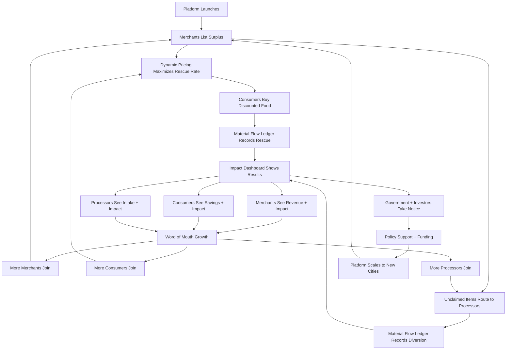

# Vision & Mission — Cirquo

**Platform:** Circular Food Recovery Platform  
**Mission:** Close the loop on food waste through material flow orchestration  
**Last updated:** 2026-08-29

> This vision describes the intended platform. Current source availability and
> future milestone work are recorded in
> [IMPLEMENTATION_STATUS.md](../project/IMPLEMENTATION_STATUS.md).

---

## Vision Statement

**A world where every kilogram of surplus food is tracked, valued, and routed to its next best use — feeding people first, feeding systems second, and landfill never.**

Cirquo exists to make circular food recovery the default, not the exception. We envision a future where:

- Food businesses see surplus as a recoverable asset, not a disposal cost
- Consumers have reliable access to quality food at affordable prices
- Organic processors receive predictable, logged supply for their facilities
- Impact is measured in real-time, not estimated annually
- Circular economy is a visible, auditable, lived reality — not a marketing claim

---

## The Problem We're Solving (Long-Term View)

### Food Waste is a System Failure

Indonesia generates 23–48 million tons of food waste annually, with economic losses of Rp213–551 trillion per year and approximately 1,702.9 Mt CO2e emissions over 20 years. Globally, one-third of all food produced is wasted.

This is not a consumer behavior problem. This is a **coordination failure**.

The infrastructure to recover food waste already exists:
- Restaurants have surplus food every day
- Consumers want affordable quality food
- BSF facilities, composters, and biogas plants need organic feedstock
- Cities have sustainability targets and waste reduction mandates

What's missing is the **digital backbone** that connects these actors in real-time and tracks outcomes transparently.

### Current "Solutions" Are Incomplete

**Food banks and donation:** Essential for food security, but limited by logistics, liability concerns, and lack of coordination. Most surplus never reaches them.

**Surplus food marketplaces (e.g., Too Good To Go):** Solve consumer access but stop at purchase. What happens to unclaimed items? No one knows. No processor integration. No material flow tracking.

**Waste management services:** Collection and disposal. No upstream coordination, no marketplace, no impact visibility.

**Composting facilities:** Want supply but rely on manual coordination with waste collectors. Inconsistent intake, no audit trail.

**The gap:** No one connects all three sides (merchant, consumer, processor) into a closed loop with transparent impact tracking.

---

## Cirquo's Long-Term Mission

### Mission Statement

**Cirquo orchestrates the circular recovery of surplus food by connecting merchants, consumers, and organic processors into a transparent, auditable ecosystem where every kilogram is tracked from listing to its final outcome.**

We are not building a food delivery app. We are building a **material flow orchestration platform** where the marketplace is the entry point and the ledger is the differentiator.

### Core Beliefs

1. **Surplus is not waste.** It's a resource that should always have a next best use.

2. **People first, processing second.** The ideal outcome is a consumer rescues the food (it's still edible). Processing (BSF/compost/biogas) is the fallback for unclaimed or processing-only items. Both count as circular outcomes.

3. **Transparency builds trust.** Impact metrics derived from an append-only ledger are more credible than self-reported numbers. Auditability is the foundation for circular economy claims.

4. **Coordination unlocks value.** The merchants, consumers, and processors already exist. They just can't find each other efficiently. Digital coordination is the unlock.

5. **Circular economy must be measurable.** "Zero waste" is a slogan. "93% circularity rate, 1.2 tons rescued, 684 kg diverted, 34 kg residual" is a metric you can act on.

---

## What Success Looks Like

### Year 1: Semarang Proof of Concept (2026)
- 50+ active merchants listing daily
- 500+ active consumers making repeat rescues
- 5+ verified organic processors with predictable intake
- 10+ tons of food rescued and diverted (combined)
- Material Flow Ledger tracking 100% of listed items
- City government partnership (Disperindagkop, Dinas Lingkungan Hidup)
- Press coverage and competition win (DSDC ANFORCOM 2026)

**Milestone:** Platform is operationally viable and impact is measurable.

---

### Year 2-3: Multi-City Expansion (2027-2028)
- Jakarta, Surabaya, Bandung, Yogyakarta operational
- 500+ merchants, 10,000+ consumers, 20+ processors
- 100+ tons/month rescued and diverted
- B2B pilot: campus dining, hospital kitchens, hotel catering
- API partnerships with POS systems (Moka, Qasir)
- Government contracts (city-level waste management integration)

**Milestone:** Cirquo is the leading circular food recovery platform in Indonesia.

---

### Year 4-5: National Platform (2029-2030)
- Multi-city operations across Java, Sumatra, Bali
- 2,000+ merchants, 100,000+ consumers, 50+ processors
- White-label solution for corporate food service
- Impact API for ESG reporting platforms
- Carbon credit integration (monetize verified CO2e avoidance)
- National government partnership (Bappenas, KLHK)

**Milestone:** Cirquo is synonymous with food circularity in Indonesia.

---

### Year 6+: Regional Leader (2031+)
- Expand to Southeast Asia (Philippines, Thailand, Vietnam)
- B2B enterprise: large retailers, hotel chains, airline catering
- Predictive surplus modeling (AI forecasting for merchants)
- Blockchain-backed Material Flow Ledger (for carbon market credibility)
- International partnerships (UN FAO, World Resources Institute)

**Milestone:** Cirquo is the reference model for circular food systems in developing markets.

---

## Theory of Change

### How Cirquo Creates Impact

### The Flywheel

1. **Merchants join** because they recover revenue and reduce waste costs.
2. **Consumers join** because they get quality food at steep discounts.
3. **High rescue rates** prove the marketplace works.
4. **Unclaimed items route to processors**, completing the loop.
5. **Material Flow Ledger** records everything transparently.
6. **Impact dashboards** show measurable results (kg rescued, diverted, CO2e avoided).
7. **Impact visibility** attracts more merchants (for ESG reporting) and government interest.
8. **Network effects** accelerate growth (more merchants → more supply → more consumers → higher rescue rates).

Once the flywheel spins, Cirquo becomes the default platform for circular food recovery.

---

## Societal Impact (10-Year Horizon)

### Environmental

**Target:** Divert 100,000+ tons of food waste from landfill annually by 2035.

**Mechanism:**
- Rescued food avoids methane emissions from decomposition in landfill
- Diverted food becomes compost, animal feed, or biogas (circular outputs)
- Estimated CO2e avoided: 200,000+ tons annually (using 2 kg CO2e per kg food waste diverted, conservative estimate)

**Why it matters:** Indonesia commits to reducing GHG emissions by 29% (unconditional) to 41% (conditional) by 2030. Food waste reduction is a high-leverage intervention.

---

### Economic

**Target:** Recover Rp100 billion in food value annually by 2035.

**Mechanism:**
- Merchants recover partial revenue (even at steep discounts, better than zero)
- Consumers save money on quality food (increased purchasing power)
- Processors gain predictable supply (facility utilization increases)
- Government reduces waste management costs (less landfill volume)

**Why it matters:** Food waste represents Rp213–551 trillion in annual economic losses nationally. Cirquo captures a fraction of that lost value.

---

### Social

**Target:** Improve food access for 1 million+ consumers by 2035.

**Mechanism:**
- Discounted surplus food is accessible to middle and lower-middle class consumers
- No compromise on quality (food is still good, just close to expiry)
- Mobile-first platform works on mid-range Android devices (inclusive design)

**Why it matters:** Food affordability is a real concern. Cirquo increases access without creating dependency (consumers pay, it's not charity).

---

### Systemic

**Target:** Establish Material Flow Ledger as the gold standard for circular economy auditing in Indonesia.

**Mechanism:**
- Append-only ledger provides audit trail for every Rescue Item
- Impact metrics are derived, not self-reported
- Government, investors, and auditors can verify claims
- Model is replicable for other sectors (textile waste, electronics, etc.)

**Why it matters:** Circular economy is often aspirational rhetoric. Cirquo makes it measurable and accountable.

---

## Values & Operating Principles

### 1. Transparency Above All

We do not claim "100% zero waste" or "100% closed-loop." We report actual circularity rates (rescued + diverted / total listed) and acknowledge residual waste.

Impact numbers are derived from the Material Flow Ledger, never hand-entered. If the ledger is wrong, our impact is wrong — so we protect the ledger.

---

### 2. People Before Processing

The best outcome for surplus food is that a person eats it. Processing (BSF/compost/biogas) is the fallback, not the goal.

We prioritize maximizing rescue rates (consumer pickups) before routing to processors.

---

### 3. Local Ecosystems First

We digitize existing but fragmented local flows (e.g., Semarang's TPST Gemah, TPA Jatibarang) rather than imposing foreign models.

We partner with local governments, local processors, and local businesses. We are not extractive.

---

### 4. Impact > Growth

We would rather have 50 merchants with 90% circularity than 500 merchants with 50% circularity.

Growth is a means to impact, not the end goal.

---

### 5. Technology as Enabler, Not Magic

We do not overpromise AI. We do not overcomplicate the UX. We do not build features no one asked for.

The platform serves the mission. The mission does not serve the platform.

---

## What Cirquo Is Not

To stay focused, we must be clear about what we are **not** building:

### Not a Food Delivery App

We do not compete with Gojek, Grab, or ShopeeFood. We optimize for diversion from landfill, not convenience or speed.

### Not a Charity Platform

Consumers pay (at a steep discount). Merchants recover revenue. Processors log intake. This is a marketplace, not a donation network.

### Not a Logistics Company

We coordinate and track, we do not dispatch drivers. Merchant-to-consumer pickup is self-service. Merchant-to-processor transport is arranged outside the platform (MVP).

### Not a POS Integration (Yet)

We are a standalone platform. Future B2B integrations are possible, but not the MVP focus.

### Not a Multi-Country Play (Yet)

We start with Indonesia, specifically Semarang. Expansion happens after proof of concept.

---

## Risk & Resilience

### What Could Go Wrong

**Low supply (merchants don't list):** Mitigated by onboarding verified pilot partners before public launch, demonstrating value (revenue recovery + impact reporting).

**Low demand (consumers don't buy):** Mitigated by starting in high-density urban areas with price-sensitive demographics, mobile-first UX, strong value proposition (30–70% discounts).

**Low rescue rates (items expire unclaimed):** Mitigated by Dynamic Rescue Pricing (discounts increase with time), notifications, and Circular Routing (unclaimed items go to processors, not landfill).

**Processor capacity mismatch:** Mitigated by processor-defined material types and capacity limits used in routing logic.

**Trust issues (is the food actually good?):** Mitigated by merchant verification, consumer ratings, clear food safety disclaimers, and pickup window enforcement.

**Competitor entry (Too Good To Go comes to Indonesia):** Mitigated by building Material Flow Ledger and processor integration as core differentiators (not easily copied).

### How We Stay Resilient

- **Start small, prove value, scale thoughtfully.** No premature scaling.
- **Build trust through transparency.** Show the numbers, acknowledge gaps, improve iteratively.
- **Partner with local governments and universities.** Align with existing sustainability programs.
- **Focus on impact, not just GMV.** Circularity rate is the north star, not transaction volume.

---

## Call to Action

### For Developers

You are not just building a marketplace. You are building the digital infrastructure for a circular economy. Every line of code that touches the Material Flow Ledger directly affects the credibility of impact claims. Write it carefully.

### For Judges (DSDC ANFORCOM 2026)

Cirquo is not the flashiest idea. It does not promise AGI or blockchain miracles. It solves a real, measurable problem with a feasible technical solution and a clear path to scale.

Judge us on:
1. Does the end-to-end flow work (merchant → consumer → processor → impact)?
2. Is the Material Flow Ledger complete and auditable?
3. Are the impact numbers defensible?
4. Is the circular economy framing credible?

If the answer to all four is yes, we have succeeded.

### For Future Partners

If you are a city government, a waste management agency, a sustainability program, an ESG investor, or a food business looking for impact reporting — Cirquo is the platform that makes circular food recovery measurable and scalable.

Let's close the loop together.

---

## Related Documents

- [PRODUCT.md](PRODUCT.md) — Problem, solution, value proposition
- [PRD.md](PRD.md) — Complete product requirements
- [BUSINESS.md](../business/BUSINESS.md) — Business model and revenue strategy
- [ROADMAP.md](../business/ROADMAP.md) — Phased implementation plan
- [IMPACT.md](../impact/IMPACT.md) — CO2e methodology and assumptions
- [MATERIAL_LEDGER.md](../impact/MATERIAL_LEDGER.md) — Ledger design and auditability

---

**Built for DSDC ANFORCOM 2026**  
**Platform:** Cirquo — Closing the Loop, Saving Every Meal

---

_"The future is not about zero waste. It's about knowing where everything goes."_
