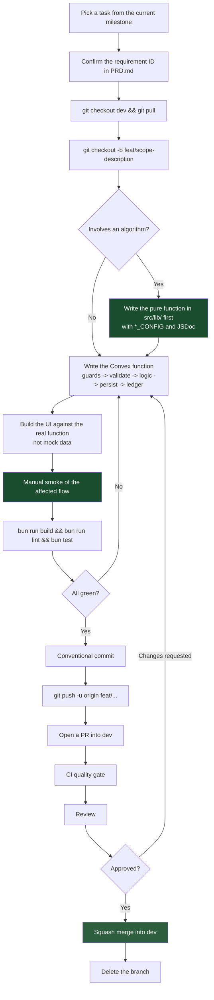
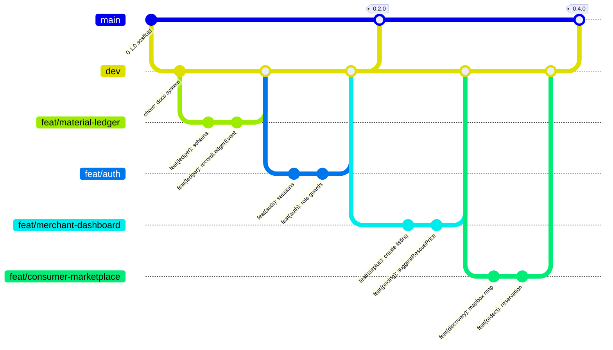

# Contributing to Cirquo

| Field | Value |
| --- | --- |
| **Document Type** | Process Guide |
| **Status** | Draft v1.0 |
| **Last Updated** | 2026-08-06 |
| **Owner** | Cirquo Engineering |
| **Audience** | Team members, future contributors, and AI agents |

---

## 1. Who This Is For

Three audiences, in order of current relevance:

1. **The competition team** — 2–3 people building toward the DSDC ANFORCOM 2026
   preliminary deadline of **31 August 2026**. Most of this document exists to
   keep a small team moving fast without breaking the data model.
2. **Future contributors** — anyone picking this up after the competition. The
   conventions here should let you make a correct first contribution without
   reading the entire codebase.
3. **AI agents** — Cirquo is developed partly with AI assistance. Agents follow
   the same rules as humans, plus the additional requirements in §12 and in
   [AGENTS.md](AGENTS.md).

---

## 2. Ground Rules

Five rules. Everything else in this document is elaboration.

### 2.1 Read the PRD first

Read [`../product/PRD.md`](../product/PRD.md) before writing code. It defines the
problem, the actors, the terminology, and the requirement IDs. Code written
without it tends to solve an adjacent problem.

### 2.2 Follow MoSCoW priority order

The PRD prioritises every requirement as Must / Should / Could / Won't. Work
Must-haves before Should-haves. Under a fixed deadline this is not advice — it is
the difference between a submission and an unfinished submission.

If you find yourself building a Could-have while a Must-have is incomplete, stop.

### 2.3 Never add a feature without a requirement ID

Every PR references at least one requirement ID from the PRD. If your idea has no
ID, it is not yet a feature — propose it first (§11).

This prevents the most common failure mode for a small team under deadline: a
codebase full of interesting work and missing core functionality.

### 2.4 Never skip the ledger write

**Every state-changing mutation MUST call `recordLedgerEvent(ctx, {...})` inside
the same mutation.**

Convex mutations are transactional. A ledger write in the same mutation either
commits with the state change or not at all. Never from an action (actions are
not transactional). Never from the client (the client cannot be trusted with the
audit trail). Never recompute a historical weight — read the
`orders.rescuedWeightGrams` snapshot.

The Material Flow Ledger is **append-only**. Never `db.patch`, `db.delete`, or
`db.replace` a ledger row. Corrections are **compensating entries**. CI runs a
grep guard that fails the build if you try.

This is the single most important rule in the project. Every impact figure
Cirquo reports derives from the ledger. A missing entry is a silently wrong
number in front of judges.

### 2.5 Be honest about what works

Never present mock data as live. Never claim a feature is complete without
running it. Never write a commit message describing intent rather than result.

The repository is currently full of placeholder pages reading
`src/constants/mock-data.ts`, and dashboards showing hardcoded figures. That is
fine — it is documented as such. What is not fine is a PR that says "impact
dashboard implemented" when it renders constants.

---

## 3. Development Workflow

End to end, from idea to merged.



Two steps in that flow deserve emphasis:

- **Pure function first.** Algorithms live in framework-agnostic `src/lib/*.ts`
  with no Convex imports. Writing them first forces the interface to be clean and
  makes them unit-testable before any backend wiring exists.
- **Manual smoke before commit.** There is no E2E suite. If you did not run the
  flow, it is not verified.

---

## 4. Branch Strategy

### 4.1 The model

```
main  ←  dev  ←  feat/*
```

| Branch | Purpose | Protection | Deploys to |
| --- | --- | --- | --- |
| `main` | Production-ready, release-tagged | PR + CI + 1 approval; no force push | Production |
| `dev` | Integration branch; always deployable | PR + CI; no force push | Staging |
| `feat/*`, `fix/*`, etc. | Individual units of work | None | Preview per PR |

### 4.2 Git graph



### 4.3 Naming

`<type>/<short-kebab-description>`

| Prefix | Use | Real examples from our milestones |
| --- | --- | --- |
| `feat/` | New functionality | `feat/consumer-marketplace`, `feat/merchant-dashboard`, `feat/recovery-flow`, `feat/impact-dashboard`, `feat/material-ledger`, `feat/circular-routing`, `feat/processor-intake` |
| `fix/` | Bug fix | `fix/pickup-code-validation`, `fix/reservation-hold-expiry`, `fix/ledger-delta-sign` |
| `chore/` | Tooling, deps, config | `chore/vitest-setup`, `chore/ci-workflow`, `chore/bump-convex` |
| `docs/` | Documentation only | `docs/testing-strategy`, `docs/api-reference` |
| `refactor/` | Behaviour-preserving restructuring | `refactor/extract-pricing-logic`, `refactor/guard-helpers` |

Rules:

- Lowercase, hyphen-separated, no underscores.
- Describe the **outcome**, not the ticket number.
- Keep it under about 40 characters.
- One branch, one concern.

```
Valid feat/circular-routing
Valid fix/reservation-hold-expiry
Valid refactor/extract-pricing-logic

Invalid feature/new-stuff          (wrong prefix, vague)
Invalid ari-branch                 (name, not content)
Invalid fix                        (no description)
Invalid feat/Consumer_Marketplace  (case and separator)
```

### 4.4 Lifecycle

```bash
# Start from a fresh dev
git checkout dev
git pull origin dev
git checkout -b feat/circular-routing

# ... work, commit ...

# Keep current with dev (rebase — see §9)
git fetch origin
git rebase origin/dev

# Push and open a PR
git push -u origin feat/circular-routing

# After merge
git checkout dev && git pull
git branch -d feat/circular-routing
```

---

## 5. Commit Conventions

### 5.1 Format

[Conventional Commits](https://www.conventionalcommits.org/):

```
<type>(<scope>): <subject>

[optional body]

[optional footer]
```

### 5.2 Types

| Type | Use | SemVer impact (pre-1.0) |
| --- | --- | --- |
| `feat` | A new user-facing capability | MINOR |
| `fix` | A bug fix | PATCH |
| `chore` | Tooling, dependencies, config; no src behaviour change | None |
| `docs` | Documentation only | None |
| `refactor` | Restructuring with no behaviour change | None |
| `perf` | Performance improvement | PATCH |
| `test` | Adding or fixing tests | None |
| `style` | Formatting only, no logic | None |
| `revert` | Reverts a previous commit | Varies |

### 5.3 Scopes

Scopes match the module names in the codebase.

| Scope | Covers |
| --- | --- |
| `auth` | Authentication, sessions, role guards |
| `ledger` | Material Flow Ledger — schema, `recordLedgerEvent`, invariants |
| `surplus` | Rescue Item listing and lifecycle |
| `pricing` | Dynamic Rescue Pricing |
| `orders` | Reservation, payment, pickup |
| `payments` | Midtrans integration, webhook |
| `routing` | Circular Routing |
| `recovery` | Recovery batches, processor offers |
| `processor` | Processor intake and outcome logging |
| `impact` | Impact derivation and dashboards |
| `admin` | Verification, moderation, audit trail |
| `discovery` | Map, search, ranking |
| `ui` | Shared components and design system |
| `scheduler` | Cron jobs, TTLs |
| `schema` | Convex schema changes |
| `mobile` | Capacitor and Android |
| `ci` | GitHub Actions |
| `docs` | Documentation |

Omit the scope only when a change is genuinely global.

### 5.4 Subject line

| Rule | Example |
| --- | --- |
| Imperative mood | `add`, not `added` or `adds` |
| Lowercase first letter | `feat(orders): add reservation hold` |
| No trailing full stop | `... hold` not `... hold.` |
| ≤ 72 characters | Keeps `git log --oneline` readable |
| Describe the **result** | Not "work on X" |
| Use exact product terminology | "Rescue Item", not "deal" |

### 5.5 When a body is required

A body is **required** when the change:

- Touches the Material Flow Ledger in any way.
- Changes a Convex schema.
- Alters an algorithm's behaviour (pricing, routing, ranking, impact).
- Changes an impact emission factor or the methodology version.
- Is not obvious from the subject line alone.

The body explains **why**, and what alternatives were rejected.

```
feat(ledger): record compensating entries for cancelled reservations

When a reservation expires unpaid, the reserved weight must return to the
available pool. Patching the original RESERVED entry would break the
append-only guarantee and destroy the audit trail, so we append a positive
CANCELLED entry with an offsetting weightDeltaGrams instead.

This keeps weight conservation exact: the sum of deltas for a fully-resolved
Rescue Item remains exactly 0.

Refs: REQ-LEDGER-004
```

### 5.6 Breaking changes

Two markers, both used together:

```
feat(schema)!: rename weightKg to weightGrams across all tables

BREAKING CHANGE: All weight fields are now integer grams rather than float
kilograms. Existing rows must be migrated with the backfill mutation in
convex/migrations.ts before this deploy. Floats are never used for values
that get summed, because weight conservation must hold as exact equality.

Refs: REQ-DATA-001
```

### 5.7 Good versus bad

| Bad | Good | Why |
| --- | --- | --- |
| `update stuff` | `feat(orders): add 15-minute reservation hold` | Specific, typed, scoped |
| `fix bug` | `fix(ledger): correct sign of EXPIRED weight delta` | Says which bug |
| `WIP` | (do not commit WIP to a shared branch) | History should be meaningful |
| `feat: added new pricing algorithm` | `feat(pricing): add suggestRescuePrice with floor clamp` | Imperative, names the function |
| `Fixed the map.` | `fix(discovery): handle denied geolocation permission` | Lowercase, no full stop, describes the case |
| `feat(orders): implement AI pricing` | `feat(pricing): add Dynamic Rescue Pricing suggestion` | Never "AI pricing" — see terminology |
| `feat: delivery flow` | `feat(orders): add pickup code confirmation` | Cirquo has no delivery |
| `refactor: cleanup` | `refactor(pricing): extract PRICING_CONFIG constants` | Says what was cleaned |
| `chore: stuff for demo` | `chore(seed): produce a visible residual in demo data` | Explains the intent |
| `feat(impact): 100% circularity` | `feat(impact): derive circularity rate from the ledger` | Never claim 100% |

---

## 6. Pull Requests

### 6.1 When to open one

Open a PR when the work is **complete and verified**, not when you want feedback
on direction. For direction, ask in the team channel — a PR carries a review
obligation.

Open a **draft PR** if you want CI to run against work in progress.

### 6.2 Title format

Same as the commit convention:

```
feat(routing): add Circular Routing with 3-attempt limit
fix(orders): prevent double-reservation of the last unit
docs(engineering): add testing strategy
```

### 6.3 Description template

```markdown
## What

One or two sentences describing what this PR does.

## Why

The problem being solved. Reference the requirement ID.

Refs: REQ-XXXX-NNN

## How

Brief notes on the approach. Call out anything non-obvious, and any
alternative you considered and rejected.

## Ledger Impact

- [ ] This PR adds or changes a state-changing mutation
- [ ] Every such mutation calls recordLedgerEvent in the SAME mutation
- [ ] No db.patch / db.delete / db.replace against materialFlowLedger
- [ ] Weight conservation still holds (deltas sum to exactly 0 for resolved items)
- [ ] N/A — this PR does not touch state or the ledger

## Testing

How this was verified.

- [ ] Unit tests added or updated (which functions?)
- [ ] Manual smoke of the affected flow (which sections of TESTING.md §7?)
- [ ] Integrity check run: `bunx convex run integrity:runIntegrityCheck`
- [ ] Verified on mobile at 375px

## Screenshots

Before / after for any UI change. Include a 375px-wide capture.

## Notes for the reviewer

Anything specific you want scrutinised, or any assumption you made that
should be checked.
```

### 6.4 Size guidance

| Size | Lines changed | Review time | Verdict |
| --- | --- | --- | --- |
| Tiny | < 50 | < 5 min | Ideal |
| Small | 50–200 | 10–20 min | **Target** |
| Medium | 200–500 | 30–60 min | Acceptable with a clear description |
| Large | 500–1000 | 1–2 hours | Split it |
| Huge | > 1000 | Not reviewable | **Reject; split it** |

**Why small PRs win under deadline pressure.** It is counterintuitive — batching
work feels faster. It is not:

1. **Review latency compounds.** A 900-line PR sits for a day because nobody has
   a free two-hour block. Three 300-line PRs each get reviewed in the next gap.
2. **Review quality collapses with size.** Past roughly 400 lines, reviewers stop
   reading carefully and start skimming. A rubber-stamped large PR is worse than
   no review, because it carries false confidence.
3. **Conflicts grow superlinearly.** A branch open for four days against an
   active `dev` accumulates conflicts that take longer to resolve than the
   feature took to write.
4. **Rollback granularity.** If a small PR breaks something, revert it. If a huge
   PR breaks one part of six, you cannot revert without losing the other five.
5. **Momentum.** Three merges a day feels like progress and is measurable. One
   merge every three days feels like being stuck.

Generated code and lockfiles are excluded from these counts.

### 6.5 Review expectations for a 2–3 person team

| Aspect | Expectation |
| --- | --- |
| Reviewers required | 1 approval |
| Response time | Same working day |
| Self-merge | Only for `docs/` and `chore/` with green CI |
| Author merges | Yes, after approval |
| Merge strategy | **Squash merge** into `dev` — keeps history one commit per unit of work |
| Stale approvals | Dismissed on new commits |

With three people, review is a real conversation, not a bureaucratic gate. But it
is also not optional: the ledger rules are exactly the kind of thing a second
pair of eyes catches and a lone author does not.

**When there is genuinely nobody available** (a common reality on a small team at
2 a.m.), self-merge is permitted for non-ledger, non-schema changes **only if**
the full PR checklist passes and the PR description says so explicitly. Anything
touching the ledger, the schema, or an algorithm waits for a reviewer.

---

## 7. PR Checklist

Every PR. Copy into the description and tick honestly.

```markdown
### Build and lint
- [ ] `bun run build` passes (this runs `tsc -b` — types are clean)
- [ ] `bun run lint` passes with zero new warnings
- [ ] `bun test` passes

### Verification
- [ ] Manually smoke-tested the affected flow end to end
- [ ] Named which section of TESTING.md §7 was exercised
- [ ] Mobile layout checked at 375px width
- [ ] Loading, empty, and error states all render correctly

### Ledger and state
- [ ] Every state-changing mutation calls recordLedgerEvent in the SAME mutation
- [ ] No ledger write from an action or from the client
- [ ] No db.patch / db.delete / db.replace against materialFlowLedger
- [ ] Historical weights read from orders.rescuedWeightGrams, never recomputed
- [ ] Weight conservation verified for any lifecycle this PR touches

### Security
- [ ] Every mutation starts with requireAuth / requireRole / requireOwnership
- [ ] Server-side rejection verified, not just a hidden button
- [ ] Errors thrown as ConvexError with a code from the canonical catalogue
- [ ] Client maps each code to a Bahasa Indonesia Sonner toast

### Units and data
- [ ] Weights are integer grams (`*Grams`), displayed in kg
- [ ] Money is integer IDR (`*Idr`), displayed as Rp
- [ ] Timestamps are integer epoch ms UTC (`*At`), displayed in WIB
- [ ] No floats in any value that gets summed
- [ ] Rates stored as 0–1 ratios, never percentages

### Honesty
- [ ] No hardcoded impact numbers — everything derives from the ledger
- [ ] No mock data presented as live
- [ ] Circularity figures land in 85–95%, never 100%
- [ ] No forbidden terminology: "zero waste", "100% closed-loop", "AI pricing",
      "delivery", "CirQuo"

### Code quality
- [ ] No `any`; any `@ts-expect-error` carries an explanatory comment
- [ ] New algorithms live in `src/lib/` with no Convex imports
- [ ] Magic numbers extracted into a `*_CONFIG` object with JSDoc
- [ ] Semantic Tailwind tokens used; no hex, no raw palette
- [ ] No committed secrets; `.env.local` not staged

### Documentation
- [ ] Relevant docs updated (schema, API, state machine, changelog)
- [ ] `.env.example` updated if a new client variable was added
- [ ] Requirement ID referenced in the description
```

---

## 8. Code Review Guidance

### 8.1 For the author

| Do | Don't |
| --- | --- |
| Self-review the diff before requesting review | Push and immediately request review |
| Explain non-obvious decisions in the description | Make the reviewer reverse-engineer intent |
| Point the reviewer at what you are least sure of | Hide uncertainty |
| Respond to every comment, even with "done" | Silently push a fix |
| Push fixes as new commits during review | Force-push mid-review (it destroys comment anchoring) |
| Say when you disagree, with reasoning | Silently ignore feedback |
| Split the PR if the reviewer asks | Argue that it is fine because it works |

### 8.2 For the reviewer

Review in this order — stop and comment as soon as you find a blocker in a
higher category.

| Priority | Category | What to look for |
| --- | --- | --- |
| **1** | **Ledger integrity** | Does every state change write a ledger event, in the same mutation? Any mutation of a ledger row? Are deltas signed correctly? Would weight conservation still hold? |
| **2** | **Security** | Are guards the first statements of the mutation? Is any check client-only? Any secret behind `VITE_`? Any unvalidated external input? |
| **3** | **Correctness** | Does the logic do what the description claims? Are boundaries handled — zero, empty, expired, concurrent? Are error paths reachable? |
| **4** | **Units** | Integer grams, integer IDR, integer epoch ms? Any float in a summed value? Any percentage stored where a ratio belongs? |
| **5** | **Honesty** | Any hardcoded impact number? Any mock data rendered as live? Any forbidden terminology? Any circularity claim at 100%? |
| **6** | **Architecture** | Is the algorithm in `src/lib/` with no Convex imports? Is the Convex handler thin? Is the mutation shape guards → validate → logic → persist → ledger? |
| **7** | **Types** | Any `any`? Are unions discriminated and exhaustively handled? Are `@ts-expect-error` suppressions explained? |
| **8** | **Performance** | Any `.collect()` then `.filter()` table scan? Any missing index? Any heavy import at app entry rather than lazily on a route? |
| **9** | **UI/UX** | Loading, empty, and error states present? Works at 375px? Focus visible? Tap targets ≥ 44px? Copy in Bahasa Indonesia? |
| **10** | **Style** | Naming, imports, tokens, `cn()`. Comment, don't block. |

Comment conventions:

| Prefix | Meaning |
| --- | --- |
| **blocking:** | Must be fixed before merge |
| **suggestion:** | Would improve it; author decides |
| **question:** | Genuine request for clarification |
| **nit:** | Trivial; non-blocking |
| **praise:** | Worth saying out loud |

Be direct about blockers and generous about everything else. On a three-person
team under deadline, an unclear review comment costs a full round-trip.

---

## 9. Definition of Done

A unit of work is **done** when every box is true. Not before.

```
[ ]  1. The requirement ID from PRD.md is satisfied as written.
[ ]  2. `bun run build` passes — types are clean.
[ ]  3. `bun run lint` passes with zero warnings.
[ ]  4. `bun test` passes; new pure logic has unit tests.
[ ]  5. The flow was manually smoke-tested end to end by a human.
[ ]  6. Every state-changing mutation writes a ledger event transactionally.
[ ]  7. Weight conservation holds for the affected lifecycle.
[ ]  8. Server-side guards reject unauthorised callers — verified, not assumed.
[ ]  9. Errors surface as Bahasa Indonesia Sonner toasts from canonical codes.
[ ] 10. Loading, empty, and error states all render.
[ ] 11. Layout verified at 375px on a real or simulated small viewport.
[ ] 12. No mock data, no hardcoded impact figures on the affected screens.
[ ] 13. Documentation updated: schema, API, state machine, or changelog as
        applicable.
[ ] 14. PR reviewed and approved.
[ ] 15. Merged into `dev` and the branch deleted.
```

"It works on my machine" is not on this list, and neither is "I'll test it
later".

---

## 10. Keeping Branches Current

### 10.1 Rebase, do not merge

While a `feat/*` branch is unmerged and unshared, **rebase** onto `dev` rather
than merging `dev` into it. This keeps history linear and the eventual squash
merge clean.

```bash
git fetch origin
git rebase origin/dev
```

If you have already pushed and are working alone on the branch:

```bash
git push --force-with-lease
```

`--force-with-lease` rather than `--force` — it refuses if someone else has
pushed to the branch in the meantime. Never force-push `main` or `dev`.

### 10.2 Resolving conflicts

```bash
git fetch origin
git rebase origin/dev

# For each conflicted file:
#  1. Open it, find the <<<<<<< markers.
#  2. Understand BOTH sides before choosing. Do not blindly take yours.
#  3. Edit to the correct combined result.
git add <resolved-file>
git rebase --continue

# To abandon and start over:
git rebase --abort
```

### 10.3 Conflict hotspots

| File | Why it conflicts | How to resolve |
| --- | --- | --- |
| `convex/schema.ts` | Everyone adds tables and indexes | Keep **both** sides. Schema additions are almost never mutually exclusive. |
| `src/app/router.tsx` | Everyone adds routes | Keep both route entries. |
| `src/types/domain.ts` | Everyone adds types | Keep both. |
| `bun.lock` | Concurrent dependency changes | Take `dev`'s version, then re-run `bun install`. Never hand-edit. |
| `package.json` dependencies | Concurrent additions | Merge both entries manually, then `bun install`. |
| `src/index.css` `@theme` | Concurrent token additions | Keep both tokens. |
| `docs/project/CHANGELOG.md` | Everyone adds entries | Keep both under the correct category in `[Unreleased]`. |

### 10.4 Rebase frequency

Rebase onto `dev` **at least daily** while a branch is open. A branch that has
not seen `dev` in three days is a conflict resolution session waiting to happen.

---

## 11. Proposing Features and Reporting Bugs

### 11.1 Feature proposal template

```markdown
## Feature: <short name>

### Problem
What user problem does this solve? Which actor — Consumer, Merchant, Organic
Processor, or Admin — experiences it?

### Proposed solution
What should happen, described from the user's point of view.

### Requirement mapping
- [ ] Maps to an existing requirement ID: REQ-XXXX-NNN
- [ ] Requires a NEW requirement to be added to PRD.md first

### MoSCoW priority
Must / Should / Could / Won't — with a one-line justification.

### Milestone
Which of M1–M8 does this belong to? If none, it is post-competition.

### Ledger impact
Does this introduce a new state transition? If so, which ledger event does it
emit, and what is the sign of its weightDeltaGrams?

### Effort estimate
Rough size: XS / S / M / L / XL.

### Risks
What could go wrong, and what does it depend on?
```

**No feature is built before it has a requirement ID in the PRD.** If the
proposal is accepted, the first commit adds the requirement; the second
implements it.

### 11.2 Bug report template

```markdown
## Bug: <short description>

### Severity
SEV-1 (core broken / data integrity) | SEV-2 (major, workaround exists) |
SEV-3 (minor) | SEV-4 (cosmetic)

### Environment
- Role: Consumer / Merchant / Organic Processor / Admin
- Platform: Desktop Chrome / Android Chrome / Android APK
- Viewport: e.g. 375px
- Convex deployment: dev / production

### Steps to reproduce
1.
2.
3.

### Expected
What should have happened.

### Actual
What happened instead.

### Evidence
- Console output
- Convex Logs output (Dashboard → Logs)
- Screenshot or recording

### Ledger state
If this involves a state change, paste the relevant materialFlowLedger rows
for the affected item, sorted by occurredAt. Note whether the deltas sum to 0.
```

**Any bug involving a ledger discrepancy is automatically SEV-1** and halts
feature work until resolved. See
[TESTING.md](../engineering/TESTING.md) §8.

---

## 12. Guidance for AI Agents

Cirquo is developed partly with AI assistance. Agents follow every rule above,
plus these. See [AGENTS.md](AGENTS.md) for the full operating instructions.

### 12.1 Verify before claiming completion

**Never state that something works without having run it.**

| Do not say | Say instead |
| --- | --- |
| "I've implemented the reservation flow." | "I've written the reservation mutation. I have not run it — please verify with `bunx convex run` and the §7.4 smoke steps." |
| "The tests pass." | "I've written the tests. Run `bun test` to confirm." |
| "The dashboard now shows real data." | "The dashboard now calls `summariseLedger`. I have not verified the output against seeded data." |
| "Fixed." | "I changed X. This should fix Y, but I could not reproduce the original failure." |

The distinction between *written* and *verified* is not pedantry. On this
project, an unverified claim about the ledger propagates into a wrong impact
number that nobody notices until a judge asks.

### 12.2 Flag assumptions explicitly

When a spec is ambiguous, state the assumption rather than silently choosing.

```
Assumption: I've treated a partially-collected order as producing a RESCUED
event for the collected quantity and a separate EXPIRED event for the
remainder. STATE_MACHINE.md does not cover partial collection explicitly.
If the intended behaviour is a single event, this needs changing.
```

### 12.3 Never present mock data as working

The repository currently has 9 placeholder pages reading
`src/constants/mock-data.ts`, and dashboards with hardcoded figures. An agent
touching these must:

- Say plainly that the page is a placeholder.
- Not describe it as "the impact dashboard" without the qualifier.
- Not add new mock data unless explicitly asked.
- Prefer wiring a real query over extending the mocks.

### 12.4 Respect the current state

Do not invent APIs that do not exist. As of this document:

- **No Convex mutations exist.** Six read-only queries, that is all.
- **No auth exists.** `requireAuth` is planned, not written.
- **No `materialFlowLedger` table exists.** It is in the target schema.
- **No Mapbox, no Midtrans, no cron, no tests.**

If an agent writes code calling `recordLedgerEvent`, it must also write
`recordLedgerEvent`, or say clearly that it is a planned dependency.

### 12.5 Scope discipline

One task per change. An agent asked to fix a validation message must not also
refactor the surrounding component, upgrade a dependency, and reformat the file.
Unrequested changes make review harder and hide the actual fix.

### 12.6 Terminology is not negotiable

Agents are the most likely source of terminology drift, because plausible
synonyms are exactly what a language model produces.

| Always | Never |
| --- | --- |
| Cirquo | CirQuo, cirQuo |
| Rescue Item | deal, offer, product |
| Rescued / Recovered / Residual | sold, recycled, waste |
| Circular Routing | matching engine, AI routing |
| Material Flow Ledger | audit log, history table |
| Dynamic Rescue Pricing | AI pricing, smart pricing |
| circularity rate | zero-waste score, recovery percentage |
| pickup window / pickup code | delivery window, OTP |
| ~85–95%, demo target 93% | 100%, zero waste, fully closed-loop |
| consumers collect in person | delivery |

---

## 13. Releases

Releases are cut from `main` and recorded in
[CHANGELOG.md](CHANGELOG.md).

```bash
# 1. Ensure dev is green and fully smoke-tested.
# 2. Open a PR: dev -> main. Title: "release: 0.4.0".
# 3. Move [Unreleased] entries in CHANGELOG.md into a new version section
#    with today's date. Leave [Unreleased] empty with its category headings.
# 4. Merge after CI and approval.
# 5. Tag.
git checkout main && git pull
git tag -a v0.4.0 -m "Release 0.4.0 — consumer discovery and Midtrans payment"
git push origin v0.4.0
# 6. CI deploys Convex production; Vercel deploys the frontend.
# 7. Run the post-deploy verification in DEPLOYMENT.md §10.2.
```

Versioning policy and the planned version schedule are in
[CHANGELOG.md](CHANGELOG.md).

---

## 14. Common Contribution Mistakes

| # | Mistake | Consequence | Correct approach |
| --- | --- | --- | --- |
| 1 | State change with no ledger write | Impact figures silently wrong | `recordLedgerEvent` in the same mutation |
| 2 | Ledger write from an action | Not transactional; ledger can diverge | Move it into the mutation |
| 3 | `db.patch` on `materialFlowLedger` | Destroys the audit trail; CI fails | Append a compensating entry |
| 4 | Recomputing a historical weight at pickup | Item may have changed since reservation | Read `orders.rescuedWeightGrams` |
| 5 | Client-only permission check | Anyone can call the mutation directly | Guards first in the handler |
| 6 | Float kilograms | Weight conservation untestable | Integer `weightGrams` |
| 7 | Storing a percentage | Confusion at every boundary | Store a 0–1 ratio |
| 8 | Storing a `Date` or ISO string | Timezone bugs | Integer epoch ms; format to WIB at render |
| 9 | Hardcoded dashboard figures | Contradicts the entire product claim | Derive from `summariseLedger` |
| 10 | Algorithm inside a Convex handler | Untestable, unportable | Pure function in `src/lib/` |
| 11 | `any` on a webhook body | Unvalidated data reaches the ledger | `unknown` + Zod parse |
| 12 | Branching off `main` | Diverges from integration work | Branch off `dev` |
| 13 | 1,200-line PR | Unreviewable; rubber-stamped | Split into 3–4 |
| 14 | Commit message "fix stuff" | Unusable history | Conventional Commits with a scope |
| 15 | Not rebasing for four days | Painful conflict session | Rebase onto `dev` daily |
| 16 | Force-pushing `dev` | Destroys teammates' work | `--force-with-lease` on your own branch only |
| 17 | Committing `.env.local` | Leaked credentials | It is gitignored — check `git status` |
| 18 | Adding `VITE_MIDTRANS_SERVER_KEY` | Leaked secret; anyone can forge payments | Convex env var, server-side only |
| 19 | Adding `tailwind.config.js` | Splits the config source of truth | `@theme` in `src/index.css` |
| 20 | `asChild` on a Base UI component | Does not work; silent breakage | `render={<Component />}` |
| 21 | Empty state rendered while loading | Looks like data loss | Check `=== undefined` first |
| 22 | Writing "delivery" in UI copy | Misrepresents the product | "pengambilan" / pickup |
| 23 | Claiming 100% circularity | Implausible; damages credibility | 85–95%, demo target 93% |
| 24 | Building a feature with no requirement ID | Scope creep while Must-haves slip | Propose it first (§11.1) |
| 25 | Claiming completion without running it | Wrong claim reaches a judge | Verify, then report what you verified |

---

## 15. Related Documents

| Document | Relevance |
| --- | --- |
| [Agent Guide](AGENTS.md) | Full operating instructions for AI contributors |
| [Changelog](CHANGELOG.md) | Release history and versioning policy |
| [Development Guide](../engineering/DEVELOPMENT.md) | Local setup, commands, common tasks |
| [Style Guide](../engineering/STYLE_GUIDE.md) | Code conventions enforced in review |
| [Testing Strategy](../engineering/TESTING.md) | Smoke checklist and integrity checks |
| [Deployment](../engineering/DEPLOYMENT.md) | CI, hosting, release process |
| [Product Requirements](../product/PRD.md) | Requirement IDs and MoSCoW priority |
| [Material Flow Ledger](../impact/MATERIAL_LEDGER.md) | Event catalogue and invariants |
| [Impact Algorithm](../impact/ALGORITHM.md) | Pricing, routing, impact maths |
| [Impact Methodology](../impact/IMPACT.md) | Emission factors and versioning |
| [Database Schema](../domain/DATABASE.md) | Tables, indexes, migration discipline |
| [State Machine](../domain/STATE_MACHINE.md) | Legal status transitions |
| [API Reference](../api/API.md) | Convex function signatures |
| [Architecture](../architecture/ARCHITECTURE.md) | System overview |
| [Backend](../architecture/BACKEND.md) | Convex module structure |
| [Frontend](../architecture/FRONTEND.md) | Component and routing structure |
| [Scheduler](../architecture/SCHEDULER.md) | Cron jobs and TTLs |
| [Security](../security/SECURITY.md) | Threat model and secret handling |
| [Authentication](../security/AUTH.md) | Session and identity handling |
| [Permissions](../security/PERMISSIONS.md) | Role matrix and guards |
| [UI Guide](../design/UI_GUIDE.md) | Design tokens and visual language |
| [Components](../design/COMPONENTS.md) | Component inventory |
| [Roadmap](../business/ROADMAP.md) | Milestones M1–M8 |
| [Risks](../business/RISKS.md) | Risk register |
| [Feature Spec](../spec/FEATURES.md) | Feature-level requirements |

---

**Built for DSDC ANFORCOM 2026**  
**Platform:** Cirquo — Closing the Loop, Saving Every Meal
