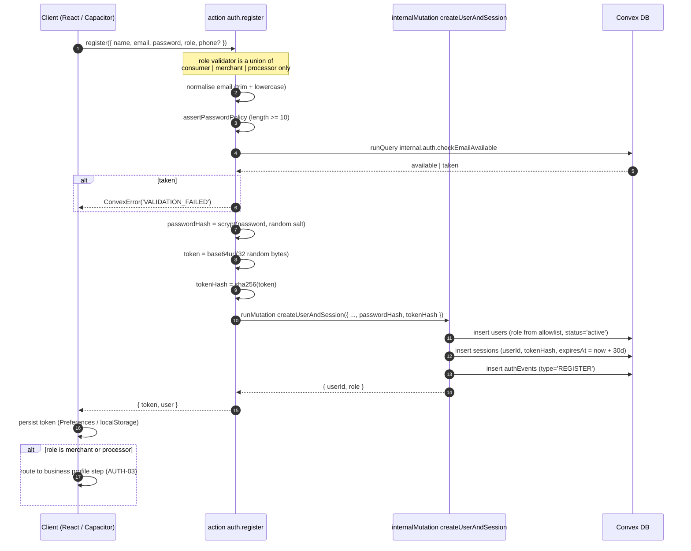
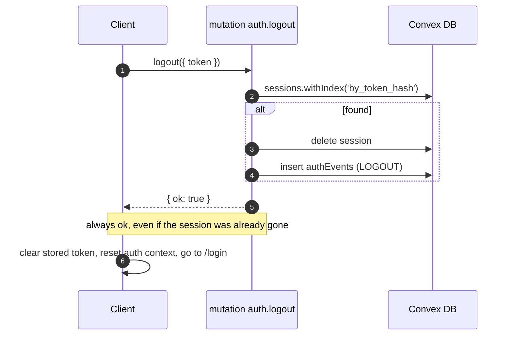
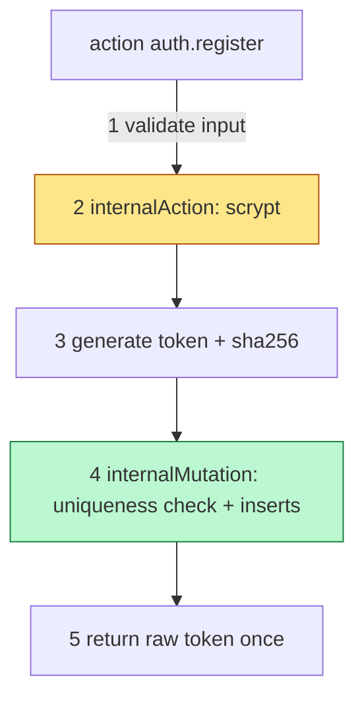
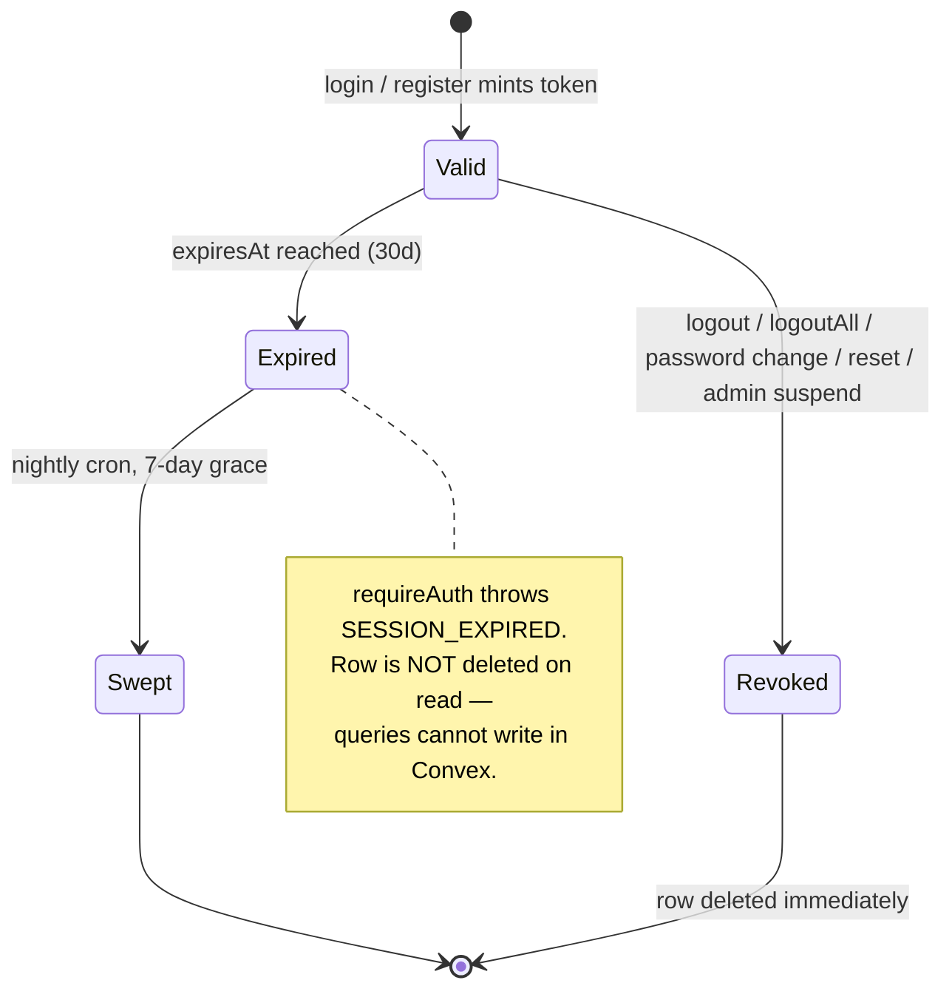
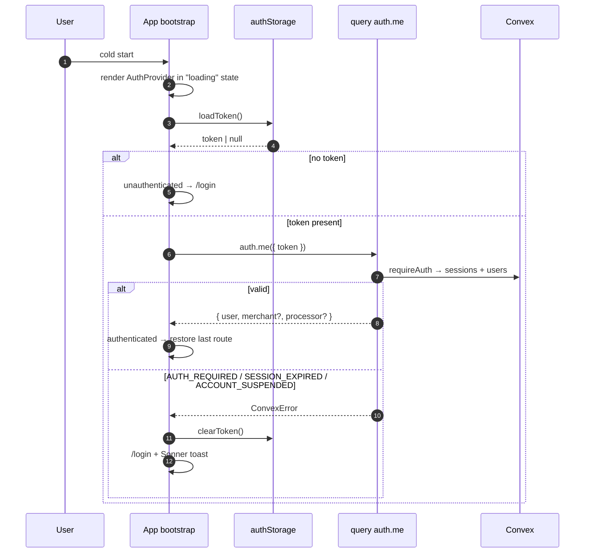
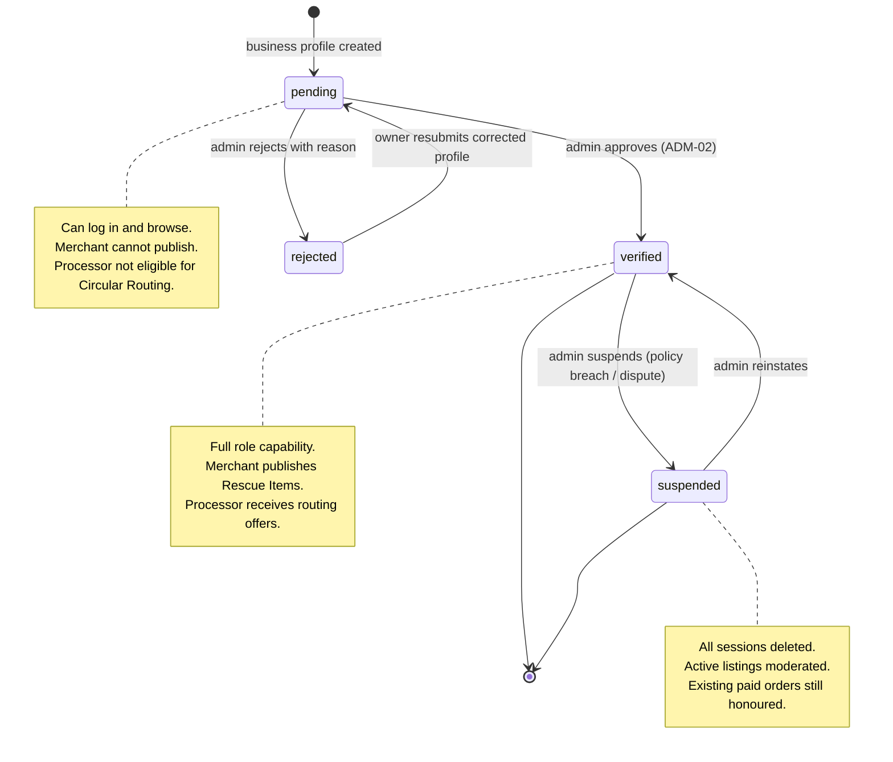

# Authentication — Cirquo

| Field | Value |
|---|---|
| **Document type** | Security / Authentication Design |
| **Status** | Draft v1.0 |
| **Last updated** | 2026-08-06 |
| **Applies to** | Convex backend (`convex/auth.ts`, `convex/lib/guards.ts`), React 19 client, Capacitor 8 Android shell (`com.cirquo.app`) |
| **Implementation status** | M1 authentication, sessions, and shared authorization guards implemented; client integration remains planned. See §0. |

---

## 0. Current Reality (Read This First)

Cirquo now has custom email/password authentication, hashed sessions, and shared server-side authorization guards. Client token storage and authentication UI remain planned.

| Component | Status | Note |
|---|---|---|
| `sessions` table | Implemented | Stores only SHA-256 token hashes |
| `users.passwordHash` | Implemented | Stores salted scrypt hashes |
| Password hashing | Implemented | Maintained Node `crypto.scrypt` in an internal Node action |
| `requireAuth` guard | Implemented | Resolves hashed sessions and rejects invalid, expired, or suspended access |
| Login / register | Implemented | Public actions delegate transactional writes to internal mutations |
| Client token storage | Planned | No client auth code |
| Password reset | Planned | No email transport chosen |

The original six read-only queries now have these access boundaries:

| Function | Access today | Boundary |
|---|---|---|
| `users.getByEmail` | Internal | Authentication backend only |
| `merchants.getByOwner` | Protected | Owner or Admin |
| `surplusItems.listByStatus` | Public | Hard-restricted to `active` |
| `orders.listMine` | Protected | User ID derived from the authenticated session |
| `recoveryBatches.listByStatus` | Protected | Processor sees assigned batches; Admin sees all matching batches |
| `impact.getPlaceholderSummary` | Public | Aggregate placeholder only |

The former `orders.listByUser` IDOR path has been removed, and user lookup by email remains internal-only.

> **For reviewers:** every diagram and code block below specifies the intended M1 design. Treat this as a build specification, not documentation of running code.

---

## 1. Requirements Recap

| ID | Requirement | Summary | Priority | Status | Section |
|---|---|---|---|---|---|
| **AUTH-01** | Email + password registration and login for all actors | One credential model for Consumer, Merchant, Processor, Admin. No social login in MVP. | P0 | Planned | §3, §4 |
| **AUTH-02** | Role chosen at registration, but `admin` is **never** self-assignable | Client may request `consumer`, `merchant`, `processor` only. Admins are provisioned manually. | P0 | Planned | §8.2 |
| **AUTH-03** | Merchant and Processor complete a business profile | Registration creates `users`; a second step creates `merchants` / `processors`. | P0 | Planned | §8.3 |
| **AUTH-04** | Listing and intake blocked until `verificationStatus === 'verified'` | Unverified Merchant may log in and browse but not publish a Rescue Item. Unverified Processor may not accept a Recovery Batch. | P0 | Planned | §9 |
| **AUTH-05** | Session persists across app restart on Capacitor | Killing and reopening the Android app must not force re-login. | P0 | Planned | §7 |
| **AUTH-06** | Password reset | Self-service recovery by emailed single-use token. | P1 | Planned | §10 |

### 1.1 Deliberate non-requirements

| Not building | Reason |
|---|---|
| Social login (Google / Apple) | OAuth redirects inside a Capacitor WebView are the most fragile part of mobile auth. Not worth it before the demo. |
| Multi-factor auth | Cirquo custodies no funds — Midtrans settles directly to merchants. Deferred (§17). |
| Team / multi-staff accounts | One user owns one Merchant or Processor. |
| Refresh-token rotation | Needs a second token type plus reuse detection. Absolute expiry suffices at this scale. |
| Biometric unlock | UX nicety, not a security control — the token is still on disk. |

---

## 2. Identity Provider Decision

### 2.1 Decision

**Cirquo builds custom email + password auth with server-side session tokens in a Convex `sessions` table.** No third-party identity provider for MVP.

### 2.2 Alternatives scored

Each axis 1–5, 5 best.

| Option | Timeline | Cost | Capacitor fit | Control | Risk | Total | Verdict |
|---|---|---|---|---|---|---|---|
| **Convex Auth** | 3 — official but young; role/profile modelling still lands on us | 5 — free, in-runtime | 3 — OAuth callbacks need custom scheme handling; password provider fine | 3 — opinionated table shapes vs our `users`/`merchants` split | 3 — library churn during a competition window | **17** | Close second; rejected on table-shape lock-in |
| **Clerk** | 4 — fastest happy path | 2 — per-MAU pricing above the free tier | 3 — needs hosted domain + Android deep links | 2 — user records live outside Convex, forcing shadow tables | 3 — external dependency that can be down mid-demo | **14** | Rejected |
| **Auth0** | 2 — heaviest configuration surface | 2 — enterprise pricing | 3 — mature SDK, same deep-link work | 2 — externalised identity | 4 — very mature | **13** | Rejected |
| **Supabase Auth** | 3 — good DX | 4 — generous free tier | 4 — well-trodden Capacitor path | 1 — introduces a second database purely for identity | 2 — two backends to keep consistent | **14** | Rejected — architecturally incoherent beside Convex |
| **Custom sessions on Convex** Implemented | 5 — working login in an afternoon; no external accounts or domains | 5 — zero marginal cost | 5 — a token in a variable; no redirects, no deep links | 5 — `users`, `sessions`, `merchants`, `processors` in one transactional store | 2 — **we own every cryptographic mistake** | **22** | **Chosen** |

### 2.3 Why custom wins here

1. **Capacitor hostility to redirects.** Every hosted provider ends in a browser redirect. In a Capacitor WebView that means custom URL schemes, the `capacitor://localhost` origin, and Android intent filters. Each is solvable; together they are a day of debugging against a demo deadline. Password auth needs none of it — the client posts credentials and receives a string.
2. **One transactional store.** Convex mutations are transactional across tables, so creating a user, a session, and a business profile is atomic. With an external provider these are two systems and two failure modes needing reconciliation — more risk than the crypto we avoid.
3. **Modest threat model.** No funds custody. The most valuable thing a stolen session buys is reserving surplus food or reading one merchant's listings. Real, but not WebAuthn-grade stakes.
4. **We own the role model.** Authorization hinges on `role` + `verificationStatus` + resource ownership. Every hosted provider models roles as claims that must be mirrored into Convex anyway; owning the table removes a whole synchronisation bug class.

### 2.4 Knowingly accepted

| Accepted risk | Why acceptable now | Mitigation |
|---|---|---|
| We implement password hashing | Well-understood problem with one correct answer (§4) | Maintained library, never hand-rolled crypto |
| We implement reset tokens | Same shape as session tokens, ~40 lines | Single-use, 60-min TTL, hashed at rest (§10) |
| No breached-password check | Needs an outbound k-anonymity call per registration | Deferred to M4 |
| No MFA | No funds custody | Deferred; admin MFA is the first addition |
| No SOC2-grade audit trail | Pre-revenue MVP | `authEvents` gives a usable trail (§14) |

### 2.5 Migration trigger

The decision is explicitly reversible. Cirquo migrates to a managed provider (Convex Auth first, Clerk second) when **any one** holds:

| Trigger | Threshold | Rationale |
|---|---|---|
| Scale | > 10,000 registered users | Session bookkeeping and lockout accounting stop being trivial |
| Feature demand | Pilot merchants request social login or SSO | Do not build late the thing we chose not to build |
| Compliance | UU PDP obligations require formal breach notification and DPO-grade tooling | Managed providers ship this |
| Security | Any authentication incident, however minor | Lost confidence in the hand-rolled path is itself sufficient |
| Team | A dedicated security owner prefers a managed stack | Their call |

The path is kept short on purpose: all auth logic lives in `convex/auth.ts` and `convex/lib/guards.ts`. Application code never touches `sessions` — it calls `requireAuth(ctx, args.token)`. Swapping backends means rewriting that function body and the login/register entry points, not the ~60 downstream functions.

---

## 3. Authentication Model

### 3.1 Overview

| Concept | Choice | Detail |
|---|---|---|
| Credential | Email + password | Email lowercased and trimmed before storage |
| Verification | Server-side hash comparison inside a Convex `action` | §4.3 |
| Session artefact | Opaque random token, 256 bits, base64url | Not a JWT — §3.2 |
| Server storage | `sessions` table keyed on **SHA-256 of the token** | §6 |
| Client storage | Capacitor Preferences on Android, `localStorage` on web | §7 |
| Transmission | Explicit `token: v.string()` argument on every authenticated function | §12 |
| Expiry | **Absolute**, 30 days, no sliding renewal | §6.3 |
| Revocation | Delete the `sessions` row | §6.5 |

### 3.2 Why opaque tokens, not JWTs

| Property | Opaque token + DB lookup Implemented | JWT |
|---|---|---|
| Instant revocation | Delete the row | Needs a deny-list, which is a DB lookup, defeating the point |
| Suspension enforcement (`users.status`) | Immediate | Stale until expiry |
| Role / verification change | Immediate | Stale |
| Reads per request | 2 (session + user) | 0 |
| Secret management | None | Signing key in a Convex environment variable |

Cirquo reads the `users` row on every authenticated call anyway — guards need `role` and `status` — so the stateless advantage is illusory. The deciding factor is suspension: an admin suspending a fraudulent merchant must take effect on the next request, not in 30 days.

### 3.3 Registration sequence



**Ordering note.** The uniqueness check inside `createUserAndSession` is transactional and is the real guarantee against simultaneous duplicate registrations.

### 3.4 Login sequence

```mermaid
sequenceDiagram
    autonumber
    participant C as Client
    participant A as action auth.login
    participant IQ as internalQuery getUserForLogin
    participant IM as internalMutation createSession
    participant DB as Convex DB

    C->>A: login({ email, password })
    A->>IQ: getUserForLogin({ email })
    IQ->>DB: users.withIndex('by_email')
    IQ->>DB: authEvents recent failures for this email
    IQ-->>A: { user?, failureCount, lockedUntil? }

    alt lockedUntil > now
        A-->>C: ConvexError('RATE_LIMITED')
    end
    alt user not found
        A->>A: scrypt verify(password, DUMMY_HASH)
        Note over A: constant-work path defeats timing enumeration
        A-->>C: ConvexError('VALIDATION_FAILED')
    end
    A->>A: ok = scrypt verify(password, user.passwordHash)
    alt not ok
        A->>IM: recordFailedLogin({ email })
        A-->>C: ConvexError('VALIDATION_FAILED')
    end
    alt user.status === 'suspended'
        A-->>C: ConvexError('ACCOUNT_SUSPENDED')
    end
    A->>A: mint fresh token + tokenHash
    A->>IM: createSession({ userId, tokenHash })
    IM->>DB: insert sessions
    IM->>DB: insert authEvents (LOGIN_SUCCESS); clear failure counters
    A-->>C: { token, user }
```

### 3.5 Authenticated request sequence

```mermaid
sequenceDiagram
    autonumber
    participant C as Client
    participant Q as query orders.listMine
    participant G as requireAuth(ctx, token)
    participant DB as Convex DB

    C->>Q: orders.listMine({ token })
    Q->>G: requireAuth
    G->>G: tokenHash = sha256(token)
    G->>DB: sessions.withIndex('by_token_hash')
    alt no session
        G-->>C: ConvexError('AUTH_REQUIRED')
    end
    alt session.expiresAt <= now
        G-->>C: ConvexError('SESSION_EXPIRED')
        Note over G: no delete here — queries cannot write;<br/>a nightly cron sweeps expired rows
    end
    G->>DB: db.get(session.userId)
    alt user missing
        G-->>C: ConvexError('AUTH_REQUIRED')
    end
    alt user.status === 'suspended'
        G-->>C: ConvexError('ACCOUNT_SUSPENDED')
    end
    G-->>Q: authenticated user
    Q->>DB: query scoped by user._id
    Q-->>C: only rows the caller may see
```

Two indexed point lookups per authenticated call. Convex's reactive caching means a subscribed query does not re-run the guard unless its dependencies change.

### 3.6 Logout sequence



`auth.logout` is the one mutation that takes a token but does **not** call `requireAuth`. Throwing `SESSION_EXPIRED` on logout would strand a user holding a token they cannot clear through the normal path.

---

## 4. Password Handling

### 4.1 Algorithm choice

**Decision: scrypt from Node's maintained `crypto` module.** Password work runs
in an internal Node action, while transactional writes stay in internal
mutations. SHA-256 remains forbidden for passwords; it is used only for
high-entropy session tokens.

### 4.2 Work-factor tuning

| Parameter | Value |
|---|---|
| `N` | 16,384 |
| `r` | 8 |
| `p` | 1 |
| Salt | 16 random bytes per password |
| Derived key | 32 bytes |

The stored prefix (`scrypt$16384$8$1$...`) preserves the parameters needed for
verification and leaves room for a future algorithm migration.

### 4.3 Why hashing must happen in an action

This is the most important structural constraint in the design.

| Function type | Read DB | Write DB | Long CPU work | Transactional | Fit for scrypt |
|---|---|---|---|---|---|
| `query` | Implemented | Not implemented | Not implemented | Implemented | Not implemented |
| `mutation` | Implemented | Implemented | Not implemented | Implemented | Not implemented |
| `action` | via `runQuery` | via `runMutation` | Implemented | Not implemented | Implemented |

Mutations run inside a transaction and must be short and deterministic. Running
scrypt inside one would hold the transaction open and repeat expensive work on
an optimistic-concurrency retry.



**The rule:** expensive non-deterministic work (hashing, random generation) belongs in the `action`; transactional writes belong in an `internalMutation` the action invokes. That mutation is `internal` precisely because it accepts a pre-computed `passwordHash`.

> **Never** expose a public mutation accepting `passwordHash` or `tokenHash`. That mutation *is* the back door — anyone could mint an account, or an admin account, with a hash of their choosing.

### 4.4 Password policy

| Rule | Value | Rationale |
|---|---|---|
| Minimum length | **10 characters** | Length dominates resistance to offline attack |
| Maximum length | 128 characters | Bounds work and input size |
| Character-class rules | At least one ASCII letter and one digit | Required by M1-03 |
| Common-password blocklist | Planned M4 | Needs a wordlist or an HIBP range call |
| Confirmation field | Client-side only | Not a server concern |

The server enforces the same rules as the future UI. Client validation is only
feedback and is never the security boundary.

### 4.5 Implementation

```ts
// convex/lib/password.ts — implemented
const N = 16_384;
const R = 8;
const P = 1;
const KEY_LENGTH = 32;

// hashPassword uses randomBytes(16) + node:crypto.scrypt.
// verifyPassword derives the same key and uses timingSafeEqual.
```

---

## 5. Token Generation

### 5.1 Requirements

| Property | Requirement | Implementation |
|---|---|---|
| Unpredictability | CSPRNG only | `crypto.getRandomValues` — **never** `Math.random()` |
| Entropy | ≥ 128 bits (OWASP ASVS) | **256 bits** (32 bytes) — double, at no cost |
| Encoding | URL-safe, unpadded | base64url → 43 characters |
| Uniqueness | Collision probability negligible | At 256 bits, not a scenario worth modelling |
| Structure | Fully opaque | Carries no user data; leaks nothing if observed |

### 5.2 Why 256 bits

128 bits is already beyond brute force; 256 costs 11 extra characters and ends the argument about margin. No human types the token — it moves between storage and a function argument — so length has zero UX cost.

By contrast the **pickup code** is short and human-readable because a customer reads it aloud at a counter. That code is protected by scoping (one order, one merchant, one pickup window), not entropy. Session tokens have no such contextual protection and must carry their security in raw randomness.

### 5.3 Implementation

```ts
// convex/lib/tokens.ts — Planned
const TOKEN_BYTES = 32; // 256 bits

export function generateToken(): string {
  const bytes = new Uint8Array(TOKEN_BYTES);
  crypto.getRandomValues(bytes);
  return base64UrlEncode(bytes);
}

/** SHA-256 hex of the token — this is what is stored and indexed. */
export async function hashToken(token: string): Promise<string> {
  const digest = await crypto.subtle.digest(
    'SHA-256',
    new TextEncoder().encode(token),
  );
  return Array.from(new Uint8Array(digest))
    .map((b) => b.toString(16).padStart(2, '0'))
    .join('');
}

function base64UrlEncode(bytes: Uint8Array): string {
  let binary = '';
  for (const b of bytes) binary += String.fromCharCode(b);
  return btoa(binary).replace(/\+/g, '-').replace(/\//g, '_').replace(/=+$/, '');
}
```

Both helpers depend only on WebCrypto, available in the Convex runtime. `hashToken` is async, which makes **every guard async** — a small but pervasive consequence noted in §11.

---

## 6. `sessions` Table Design

### 6.1 Schema

```ts
// convex/schema.ts (excerpt) — Planned
sessions: defineTable({
  userId: v.id('users'),
  tokenHash: v.string(),   // SHA-256 hex of the raw token
  expiresAt: v.number(),   // epoch ms UTC, absolute
  createdAt: v.number(),   // epoch ms UTC
  userAgent: v.optional(v.string()),
  platform: v.optional(v.union(v.literal('web'), v.literal('android'))),
})
  .index('by_token_hash', ['tokenHash'])
  .index('by_user', ['userId'])
  .index('by_expires_at', ['expiresAt']),
```

| Index | Purpose | Used by |
|---|---|---|
| `by_token_hash` | Hot path — one point lookup per authenticated request | `requireAuth` |
| `by_user` | Log out everywhere, sibling invalidation, admin suspension | `auth.logoutAll`, `auth.changePassword`, `admin.suspendUser` |
| `by_expires_at` | Nightly sweep of expired rows | `internal.crons.sweepExpiredSessions` |

> **Deviation note.** The PRD schema lists `sessions(userId, token, expiresAt, createdAt)` — the raw token. This document deliberately stores `tokenHash` instead (§6.4). The schema above is the one to implement.

### 6.2 Field notes

| Field | Note |
|---|---|
| `tokenHash` | SHA-256, **not** scrypt. A 256-bit random token has no dictionary to attack, so a slow hash buys nothing and would add needless work to *every authenticated request*. Slow hashing is for low-entropy secrets. |
| `expiresAt` | Written once at creation, never patched. |
| `userAgent` | Truncated to 200 chars, for the "your devices" UI (Planned M3). Never used in an authentication decision — UA binding breaks on legitimate browser updates. |
| `platform` | Client-reported, advisory only, same reason. |

### 6.3 Absolute vs sliding expiry

| Model | Behaviour | Pros | Cons |
|---|---|---|---|
| **Absolute (chosen)** Implemented | 30 days from creation, never extended | Bounded exposure for a stolen token; no writes on the read path; trivial to reason about | An active daily user re-logs in every 30 days |
| Sliding | Expiry pushed forward on each use | A daily user never re-authenticates | A stolen token can be kept alive **forever**; requires a DB write on every authenticated request |
| Hybrid | Sliding within a hard cap | Best balance | Two timestamps, more state, more edge cases |

**Decision: absolute, 30 days.** The argument against sliding is structural, not aesthetic: extending `expiresAt` is a write, and `requireAuth` runs inside `query` functions, which **cannot write**. Sliding expiry would force either making every read a mutation (destroying reactive query caching) or a fire-and-forget "touch session" mutation per navigation — a write per page view for marginal benefit.

Thirty days beats the more common 7 or 14 because Cirquo is mobile-first for an irregular use case: a consumer might rescue food twice a week or twice a month, and a forced logout is a meaningful churn event for a marketplace still proving liquidity.



The 7-day grace before sweeping keeps the row available long enough to distinguish "expired" from "never existed" in support scenarios.

### 6.4 Storing a hash rather than the raw token

**Decision: store `sha256(token)`. The raw token exists only in client storage and in transit.**

| Aspect | Raw token stored | `sha256(token)` stored Implemented |
|---|---|---|
| DB leak yields live sessions |  Yes — a backup leak hands out working credentials |  No — hashes are not credentials |
| Convex dashboard exposure |  Anyone with dashboard access can impersonate any user |  Hashes only |
| Accidental logging |  A stray `console.log(session)` prints a live credential |  Prints a useless hash |
| Lookup cost | Identical indexed point lookup | Identical |
| Extra work per request | None | One SHA-256 (microseconds) |
| Server can re-display the token | Yes | **No** — irreversible |
| Complexity | Trivial | One helper function |

**The trade-off, stated plainly:** the server can never recover or re-display a session token. If a client loses its stored token the only remedy is re-login — there is no "show me my token again". That is a non-issue here because the token is machine-held and never surfaced to a human. Cost is effectively zero; the benefit is that a database compromise does not automatically become an account compromise. The same reasoning applies to reset tokens (§10).

### 6.5 Revocation

| Event | Effect | Implementation |
|---|---|---|
| Logout | Delete this session only | `auth.logout` |
| Log out everywhere | Delete all sessions for the user | `auth.logoutAll` over `by_user` |
| Password change | Delete all **other** sessions, keep the current one | `auth.changePassword` (§13.2) |
| Password reset | Delete **all** sessions including the current one | Reset implies possible compromise |
| Admin suspension | Delete all sessions **and** set `users.status = 'suspended'` | `admin.suspendUser`; the status check in `requireAuth` is the backstop |
| Expiry | No action; `requireAuth` rejects on `expiresAt` | Cron sweeps later |

---

## 7. Client-Side Token Storage

This is Cirquo's most consequential MVP compromise, so it is documented in full.

### 7.1 Options

| Option | Web | Android (Capacitor 8) | Survives restart | XSS-readable | Verdict |
|---|---|---|---|---|---|
| In-memory only | Implemented | Implemented | Not implemented | Not implemented | Safest, but fails AUTH-05 outright |
| `localStorage` | Implemented | Implemented (WebView-backed) | Implemented |  Yes | MVP default on web |
| `sessionStorage` | Implemented | Implemented | Not implemented |  Yes | Fails AUTH-05 |
| `httpOnly` cookie | Implemented | Warning `capacitor://localhost` makes domain scoping unreliable | Implemented |  No | Ideal in principle; incompatible with the Convex WebSocket client, which does not send cookies as function arguments |
| **Capacitor Preferences** Implemented | Falls back to `localStorage` | Implemented Native `SharedPreferences` | Implemented |  JS-reachable, but app-private and invisible to browser devtools | **Chosen for Android** |
| Encrypted secure storage | Not implemented no web equivalent | Implemented Android Keystore-backed | Implemented |  Still JS-reachable | Target for commercial launch |

### 7.2 The Capacitor consideration in depth

1. **`localStorage` inside a Capacitor WebView is app-private.** Android sandboxes each app's WebView data directory; another installed app cannot read it without root. This is materially better than desktop `localStorage`, where any extension with host permissions can read it.
2. **The origin is `capacitor://localhost`, not HTTPS.** This breaks cookies scoped to a backend domain and is the practical reason cookies are off the table, independent of Convex's transport.
3. **Capacitor Preferences maps to Android `SharedPreferences`** — a native, app-private store. It survives WebView data clearing (which `localStorage` does not always) and is not visible in remote-debugging devtools. It is **not** encrypted at rest by default: on a rooted or physically compromised device it is readable.
4. **No storage option protects against XSS in a WebView**, because any script running there can call the same APIs the app calls. Only an `httpOnly` cookie provides that boundary, and it is unavailable to us.

### 7.3 Chosen approach

```ts
// src/lib/authStorage.ts — Planned
import { Preferences } from '@capacitor/preferences';
import { Capacitor } from '@capacitor/core';

const TOKEN_KEY = 'cirquo.session.token';

export async function saveToken(token: string): Promise<void> {
  if (Capacitor.isNativePlatform()) {
    await Preferences.set({ key: TOKEN_KEY, value: token });
  } else {
    localStorage.setItem(TOKEN_KEY, token);
  }
}

export async function loadToken(): Promise<string | null> {
  if (Capacitor.isNativePlatform()) {
    const { value } = await Preferences.get({ key: TOKEN_KEY });
    return value ?? null;
  }
  return localStorage.getItem(TOKEN_KEY);
}

export async function clearToken(): Promise<void> {
  if (Capacitor.isNativePlatform()) {
    await Preferences.remove({ key: TOKEN_KEY });
  } else {
    localStorage.removeItem(TOKEN_KEY);
  }
}
```

A single module owns storage so that swapping to encrypted storage later touches exactly one file.

### 7.4 The XSS exposure, stated honestly

**If an attacker achieves script execution in the Cirquo client, they can read the session token and impersonate the user until it expires — up to 30 days.** No storage mechanism available to us prevents this. `httpOnly` cookies would, but they are incompatible with the Convex client transport and the `capacitor://localhost` origin.

The defence is therefore to **prevent XSS rather than survive it**:

| Control | Status | Note |
|---|---|---|
| React automatic JSX escaping |  Inherent | Primary defence |
| Zero `dangerouslySetInnerHTML` |  Policy | ESLint rule planned (M2) |
| No `eval`, no dynamic `new Function` |  Policy | — |
| User content rendered as text nodes only |  By design | Rescue Item names, descriptions, dispute text |
| Content-Security-Policy | Planned M2 | Must also be configured for the Capacitor WebView |
| Dependency audit in CI | Planned M2 | A compromised npm package is the most realistic XSS vector for a React SPA |
| 30-day absolute expiry |  Design | Bounds the damage window |

### 7.5 MVP-acceptable vs required before commercial launch

| Concern | MVP (competition demo) | Before commercial launch |
|---|---|---|
| Token at rest, Android | Capacitor Preferences, plaintext, app-private — **accepted** | Keystore-backed encrypted storage — **required** |
| Token at rest, web | `localStorage` — **accepted** | BFF proxy with `httpOnly` cookies, or short-lived tokens + refresh |
| Session lifetime | 30-day absolute — **accepted** | 7 days + refresh, or step-up auth for sensitive actions |
| XSS mitigation | React escaping + policy — **accepted** | Enforced CSP, SRI, automated dependency scanning |
| MFA | None — **accepted** | Required for `admin` at minimum |
| Root/jailbreak detection | None — **accepted** | Consider for merchant payout-adjacent flows |
| Certificate pinning | None — **accepted** | Consider for the Android build |

Each "accepted" is a decision made with knowledge of the risk, not an oversight.

### 7.6 Session persistence across app restart (AUTH-05)



**Critical UI detail:** render a neutral loading state — not the login screen — while `auth.me` is in flight. Flashing the login screen to an already-authenticated user on every cold start is the most common and most visible failure of this pattern, and in a live demo it reads as a broken app.

`auth.me` is a `query`, so it participates in Convex reactivity: if an admin suspends the account or verification status changes, every subscribed component updates without a refresh.

---

## 8. Registration Flow

### 8.1 Steps

| Step | Actor | Creates | Gates | Blocking |
|---|---|---|---|---|
| 1. Account | All roles | `users` + `sessions` | Login | Yes |
| 2. Business profile | Merchant, Processor | `merchants` / `processors` | Listing / intake | Yes for those roles (AUTH-03) |
| 3. Verification | Merchant, Processor | Admin sets `verificationStatus` | Publishing / accepting batches | Yes (AUTH-04) |

Consumers finish at step 1 and may immediately browse and reserve Rescue Items.

### 8.2 Role selection and the admin prohibition (AUTH-02)

```ts
// convex/auth.ts — Planned
export const register = action({
  args: {
    name: v.string(),
    email: v.string(),
    password: v.string(),
    // The validator is the first line of defence: 'admin' is not a member
    // of this union, so Convex rejects the call before the handler runs.
    role: v.union(
      v.literal('consumer'),
      v.literal('merchant'),
      v.literal('processor'),
    ),
    phone: v.optional(v.string()),
  },
  handler: async (ctx, args) => {
    const email = normaliseEmail(args.email);
    assertPasswordPolicy(args.password, email);

    const taken = await ctx.runQuery(internal.auth.checkEmailAvailable, { email });
    if (taken) throw new ConvexError('VALIDATION_FAILED');

    const passwordHash = await hashPassword(args.password);
    const token = generateToken();
    const tokenHash = await hashToken(token);

    const result = await ctx.runMutation(internal.auth.createUserAndSession, {
      name: args.name.trim(),
      email,
      passwordHash,
      role: args.role, // already narrowed by the validator
      phone: args.phone,
      tokenHash,
    });

    return { token, user: result.user };
  },
});
```

**Three independent layers of defence:**

| Layer | Mechanism | Effect if the others fail |
|---|---|---|
| 1. Argument validator | `v.union` of three literals | `role: 'admin'` is rejected by the runtime before the handler executes |
| 2. No spreading | The internal mutation names every field; `...args` is never used | An extra client field cannot reach `ctx.db.insert` |
| 3. Server assertion | The internal mutation re-asserts `role !== 'admin'` and throws `FORBIDDEN` | Catches a future refactor that widens the validator by accident |

```ts
// convex/auth.ts — internal, not callable by clients — Planned
export const createUserAndSession = internalMutation({
  args: {
    name: v.string(),
    email: v.string(),
    passwordHash: v.string(),
    role: v.union(
      v.literal('consumer'),
      v.literal('merchant'),
      v.literal('processor'),
    ),
    phone: v.optional(v.string()),
    tokenHash: v.string(),
  },
  handler: async (ctx, args) => {
    // Layer 3 — belt and braces.
    if ((args.role as string) === 'admin') {
      throw new ConvexError('FORBIDDEN');
    }

    // Transactional uniqueness re-check; the action-level check is advisory.
    const existing = await ctx.db
      .query('users')
      .withIndex('by_email', (q) => q.eq('email', args.email))
      .unique();
    if (existing) throw new ConvexError('VALIDATION_FAILED');

    const now = Date.now();
    const userId = await ctx.db.insert('users', {
      name: args.name,
      email: args.email,
      passwordHash: args.passwordHash,
      role: args.role,
      phone: args.phone,
      status: 'active',
      createdAt: now,
    });

    await ctx.db.insert('sessions', {
      userId,
      tokenHash: args.tokenHash,
      expiresAt: now + SESSION_TTL_MS,
      createdAt: now,
    });

    await ctx.db.insert('authEvents', {
      userId,
      email: args.email,
      type: 'REGISTER',
      success: true,
      occurredAt: now,
    });

    return {
      user: { id: userId, name: args.name, email: args.email, role: args.role },
    };
  },
});
```

**Admin provisioning.** Admin accounts are created out-of-band by invoking `internal.admin.provisionAdmin` from the Convex dashboard, which requires deployment credentials. There is no client-reachable path to `role: 'admin'` — not at registration, not at profile update, not anywhere in the application.

### 8.3 Business profile step (AUTH-03)

| Role | Mutation | Required fields | Result |
|---|---|---|---|
| Merchant | `merchants.createProfile` | `name`, `businessType`, `address`, `city`, `latitude`, `longitude`, `phone?` | `merchants` row, `verificationStatus: 'pending'` |
| Processor | `processors.createProfile` | `name`, `facilityType`, `city`, `latitude`, `longitude`, `acceptedMaterialTypes[]`, `dailyCapacityGrams`, `maxPickupRadiusMeters`, `outputTypes[]`, `operatingHoursStart`, `operatingHoursEnd` | `processors` row, `verificationStatus: 'pending'` |

Authorization rules for these mutations:

1. `requireRole(ctx, token, 'merchant')` — a Consumer cannot create a merchant profile.
2. `ownerId` is set from `user._id` **on the server**; it is never a client argument. Accepting it would let anyone attach a profile to another user's account.
3. `verificationStatus` is hard-coded to `'pending'` and is absent from the argument validator. See [PERMISSIONS.md](PERMISSIONS.md) §7 for the mass-assignment analysis.
4. One profile per owner — the mutation checks `by_owner` first and throws `VALIDATION_FAILED` on a duplicate.

---

## 9. Verification Gate (AUTH-04)

### 9.1 Account state machine



### 9.2 What each state unlocks

| Capability | `pending` | `verified` | `rejected` | `suspended` |
|---|---|---|---|---|
| Log in | Implemented | Implemented | Implemented | Not implemented `ACCOUNT_SUSPENDED` |
| View own dashboard | Implemented | Implemented | Implemented (with reason shown) | Not implemented |
| Edit business profile | Implemented | Implemented | Implemented | Not implemented |
| Browse Rescue Items | Implemented | Implemented | Implemented | Not implemented |
| **Merchant:** create draft listing | Implemented | Implemented | Not implemented | Not implemented |
| **Merchant:** publish listing (`active`) | Not implemented `NOT_VERIFIED` | Implemented | Not implemented `NOT_VERIFIED` | Not implemented |
| **Merchant:** confirm pickup with code | Not implemented | Implemented | Not implemented | Not implemented |
| **Processor:** appear in Circular Routing | Not implemented | Implemented | Not implemented | Not implemented |
| **Processor:** accept a Recovery Batch | Not implemented `NOT_VERIFIED` | Implemented | Not implemented | Not implemented |
| **Processor:** log intake / outcome | Not implemented | Implemented | Not implemented | Not implemented |
| **Consumer:** reserve and pay | n/a — consumers have no verification | Implemented | — | Not implemented |

**`users.status` vs `verificationStatus`.** These are distinct fields with distinct meanings. `users.status` (`active` \| `suspended`) governs whether authentication succeeds at all and is checked inside `requireAuth`. `verificationStatus` (`pending` \| `verified` \| `rejected` \| `suspended`) lives on the `merchants` / `processors` row and governs business capability. A merchant can be `active` with `verificationStatus: 'pending'` — logged in, unable to publish. Conflating the two is a common source of bugs.

### 9.3 Enforcement

```ts
// convex/lib/guards.ts — Planned
export async function requireVerifiedMerchant(
  ctx: QueryCtx | MutationCtx,
  token: string,
) {
  const user = await requireRole(ctx, token, 'merchant');
  const merchant = await ctx.db
    .query('merchants')
    .withIndex('by_owner', (q) => q.eq('ownerId', user._id))
    .unique();
  if (!merchant) throw new ConvexError('NOT_FOUND');
  if (merchant.verificationStatus !== 'verified') {
    throw new ConvexError('NOT_VERIFIED');
  }
  return { user, merchant };
}
```

The client hides the "Publish" button for an unverified merchant, but that is a courtesy. The server rejects the call regardless. See [PERMISSIONS.md](PERMISSIONS.md) for the full guard library.

---

## 10. Password Reset (AUTH-06)

### 10.1 Flow

```mermaid
sequenceDiagram
    autonumber
    participant U as User
    participant C as Client
    participant A as action auth.requestPasswordReset
    participant DB as Convex
    participant E as Email transport
    participant A2 as action auth.resetPassword

    U->>C: "Forgot password" → enter email
    C->>A: requestPasswordReset({ email })
    A->>DB: rate-limit check on normalised email
    alt over limit
        A-->>C: ConvexError('RATE_LIMITED')
    end
    A->>DB: internalQuery lookup by_email
    alt user exists and is active
        A->>A: resetToken = generateToken(); hash = sha256(resetToken)
        A->>DB: insert passwordResets { userId, tokenHash, expiresAt: now+60min }
        A->>E: send link /reset?token=<resetToken>
    else missing or suspended
        A->>A: no-op, no email sent
    end
    A-->>C: { ok: true } — identical in both branches
    C->>U: "If an account exists for that address, we have sent instructions."

    U->>C: open link, enter new password
    C->>A2: resetPassword({ token, newPassword })
    A2->>A2: assertPasswordPolicy(newPassword)
    A2->>DB: lookup passwordResets by_token_hash
    alt not found / expired / already used
        A2-->>C: ConvexError('VALIDATION_FAILED')
    end
    A2->>A2: passwordHash = scrypt(newPassword, random salt)
    A2->>DB: patch users.passwordHash; set usedAt; DELETE ALL sessions; log event
    A2-->>C: { ok: true }
    C->>U: "Password updated. Please sign in."
```

### 10.2 `passwordResets` table

```ts
// Planned
passwordResets: defineTable({
  userId: v.id('users'),
  tokenHash: v.string(),  // sha256 — same reasoning as sessions
  expiresAt: v.number(),
  usedAt: v.optional(v.number()),
  createdAt: v.number(),
})
  .index('by_token_hash', ['tokenHash'])
  .index('by_user', ['userId'])
  .index('by_expires_at', ['expiresAt']),
```

### 10.3 Reset-token properties

| Property | Value | Rationale |
|---|---|---|
| Entropy | 256 bits | Same generator as session tokens |
| Storage | SHA-256 hash | A DB leak must not yield working reset links |
| TTL | **60 minutes** | Long enough for email delivery and a distracted user; short enough that a leaked link goes stale fast |
| Single use | `usedAt` set in the same transaction as the password patch | Prevents replay from browser history or a shared inbox |
| Supersedes prior tokens | A new request marks earlier unused tokens as used | Only the most recent link works |
| Side effect on success | **All** sessions deleted | Reset implies possible compromise |
| Channel | Email only | No SMS in MVP |

### 10.4 Enumeration-safe responses

`auth.requestPasswordReset` returns `{ ok: true }` unconditionally.

| Scenario | Result | Message |
|---|---|---|
| Registered and active | `{ ok: true }` | "If an account exists for that address, we have sent reset instructions." |
| Not registered | `{ ok: true }` | *identical* |
| Registered but suspended | `{ ok: true }` | *identical* |
| Rate limit exceeded | `ConvexError('RATE_LIMITED')` | "Too many requests. Please try again in a few minutes." |

**Timing leak, stated honestly:** the "user exists" branch performs an outbound email send and therefore takes measurably longer. A determined attacker could enumerate accounts by latency. Planned **M3 mitigation:** move the send to `ctx.scheduler.runAfter(0, ...)` so both branches return in the same time. Noted rather than silently ignored.

### 10.5 Reset rate limiting

| Scope | Limit | Window | Error |
|---|---|---|---|
| Per email address | 3 requests | 60 minutes | `RATE_LIMITED` |
| Per email address | 10 requests | 24 hours | `RATE_LIMITED` |
| Global circuit-breaker | 500 requests | 60 minutes | `RATE_LIMITED` + admin notification |

Counters live in `authEvents` and are evaluated by an `internalQuery` over `by_email_and_time`. Convex ships no rate limiter, so this is deliberately simple application logic — and deliberately server-side.

---

## 11. The `requireAuth` Implementation

```ts
// convex/lib/guards.ts — Planned
import { ConvexError } from 'convex/values';
import type { QueryCtx, MutationCtx } from '../_generated/server';
import type { Doc } from '../_generated/dataModel';
import { hashToken } from './tokens';

export type AuthedUser = Doc<'users'>;

/**
 * Resolve the caller from an opaque session token.
 *
 * Throws:
 *   AUTH_REQUIRED      no token, unknown token, or the user row is gone
 *   SESSION_EXPIRED    the session exists but expiresAt has passed
 *   ACCOUNT_SUSPENDED  users.status === 'suspended'
 *
 * MUST be the first statement of every authenticated handler.
 * Never returns null — callers may rely on a non-null user.
 */
export async function requireAuth(
  ctx: QueryCtx | MutationCtx,
  token: string | undefined | null,
): Promise<AuthedUser> {
  if (!token || token.length < 20) {
    throw new ConvexError('AUTH_REQUIRED');
  }

  const tokenHash = await hashToken(token);

  const session = await ctx.db
    .query('sessions')
    .withIndex('by_token_hash', (q) => q.eq('tokenHash', tokenHash))
    .unique();

  if (!session) {
    // Unknown or already-revoked. Deliberately indistinguishable from
    // "never existed" — we do not confirm token validity to a prober.
    throw new ConvexError('AUTH_REQUIRED');
  }

  if (session.expiresAt <= Date.now()) {
    // Cannot delete here: requireAuth runs inside queries, which cannot
    // write. The nightly cron sweeps expired rows.
    throw new ConvexError('SESSION_EXPIRED');
  }

  const user = await ctx.db.get(session.userId);
  if (!user) {
    // Orphaned session — the user row was hard-deleted. Fail closed.
    throw new ConvexError('AUTH_REQUIRED');
  }

  if (user.status === 'suspended') {
    throw new ConvexError('ACCOUNT_SUSPENDED');
  }

  return user;
}
```

### 11.1 Design notes

| Decision | Reasoning |
|---|---|
| Returns the user, never `null` | Removes every "did I remember to null-check?" bug at call sites; TypeScript narrows to `Doc<'users'>` automatically |
| Distinct `SESSION_EXPIRED` vs `AUTH_REQUIRED` | Lets the client say "Your session expired, please sign in again". Both clear stored state. Neither leaks anything to someone who never had the token — you must possess it to see `SESSION_EXPIRED` |
| `ACCOUNT_SUSPENDED` checked here | Suspension takes effect on the very next request, with no session-deletion race. `admin.suspendUser` also deletes sessions; this is the backstop |
| Length floor only, no format validation | The lookup fails anyway on a malformed token; a cheap length check avoids hashing obvious junk |
| Accepts `QueryCtx` or `MutationCtx` | One guard serves reads and writes; only `ctx.db.get` and `ctx.db.query` are used, both available on each |
| `async` | `hashToken` uses promise-based WebCrypto, so every guard is async and every call site must `await` |

### 11.2 Timing-safe comparison

`requireAuth` never compares token strings with `===`. It hashes the supplied token and performs an **indexed lookup**, so no comparison of secret material happens in application code at all. This structurally eliminates the timing-attack class in §15. Any future code that must compare a secret directly should use a constant-time comparison — but with this design, no such code should exist.

---

## 12. How the Client Passes the Token

### 12.1 The options

| Approach | Viable in Convex | Note |
|---|---|---|
| **Explicit `token` argument** Implemented | Implemented | Works uniformly across `query`, `mutation`, `action`; visible in the type signature; trivially testable |
| HTTP header | Warning only for `httpAction` | The Convex WebSocket client does not transmit arbitrary headers to `query`/`mutation`. Cirquo uses `httpAction` for exactly one thing — the Midtrans webhook — authenticated by signature, not session |
| Cookie | Not implemented | Not sent over the Convex transport; also broken by the `capacitor://localhost` origin |
| `ctx.auth.getUserIdentity()` | Not implemented for this design | Requires a JWT-issuing identity provider — the option rejected in §2 |

### 12.2 The chosen pattern

```ts
export const listMine = query({
  args: { token: v.string() },
  handler: async (ctx, args) => {
    const user = await requireAuth(ctx, args.token);
    return ctx.db
      .query('orders')
      .withIndex('by_user', (q) => q.eq('userId', user._id))
      .order('desc')
      .take(50);
  },
});
```

A thin client hook injects the token so no component hand-rolls it:

```ts
// src/hooks/useAuthedQuery.ts — Planned
export function useAuthedQuery<Q extends FunctionReference<'query'>>(
  fn: Q,
  args: Omit<FunctionArgs<Q>, 'token'> | 'skip',
) {
  const { token } = useAuth();
  return useQuery(fn, args === 'skip' || !token ? 'skip' : { ...args, token });
}
```

### 12.3 Trade-offs

| Aspect | Assessment |
|---|---|
| Implemented Explicit and greppable | `rg 'token: v.string'` enumerates every authenticated function; its absence on a function touching user data is a visible smell |
| Implemented Uniform across function types | Queries, mutations, and actions handle it identically |
| Implemented Testable | A test passes a plain string; no transport mocking |
| Implemented Public functions are deliberate | Omitting `token` is an explicit statement, not an accident of missing middleware |
| Warning Repetitive | Every function repeats `token: v.string()` and `await requireAuth(...)`. Mitigated by the guard library, not by hiding the token |
| Warning Token appears in argument logs | Planned M2: log only `token.slice(0, 6) + '…'` in any custom logging; never the full value |
|  Easy to forget | Nothing forces a developer to call `requireAuth` |

That last row is the design's biggest weakness. Middleware-based auth fails **closed** by default; argument-based auth fails **open** — a forgotten guard is a public function. This is precisely why [PERMISSIONS.md](PERMISSIONS.md) exists as a separate document with an exhaustive function-to-guard matrix.

---

## 13. Logout, Multi-Device, and Password Change

### 13.1 Multi-device behaviour

| Action | Effect on other devices | Rationale |
|---|---|---|
| Login on device B | Device A unaffected | Concurrent sessions are normal — a shop tablet and a personal phone |
| Logout on device A | Device B unaffected | Users expect per-device logout |
| Log out everywhere | All sessions deleted including the current one | Explicit user request |
| Change password | All **other** sessions deleted; current one survives | Do not log the user out of the device they are using |
| Reset password | **All** sessions deleted, no exception | Reset implies possible compromise |
| Admin suspension | All sessions deleted | Immediate lockout |

No cap on concurrent sessions. A per-user cap (Planned M4) would evict the oldest beyond N devices; not worth the complexity now, and legitimate multi-device use is common in this market.

### 13.2 Change password

```ts
// convex/auth.ts — Planned
export const changePassword = action({
  args: {
    token: v.string(),
    currentPassword: v.string(),
    newPassword: v.string(),
  },
  handler: async (ctx, args) => {
    // Actions have no ctx.db — resolve the session via an internal query.
    const me = await ctx.runQuery(internal.auth.resolveSession, {
      token: args.token,
    });
    if (!me) throw new ConvexError('AUTH_REQUIRED');

    assertPasswordPolicy(args.newPassword, me.email);

    // Re-authentication is mandatory: possession of a token is not
    // sufficient authority to change the credential that mints tokens.
    const ok = await verifyPassword(args.currentPassword, me.passwordHash);
    if (!ok) throw new ConvexError('VALIDATION_FAILED');

    if (args.currentPassword === args.newPassword) {
      throw new ConvexError('VALIDATION_FAILED');
    }

    const newHash = await hashPassword(args.newPassword);
    const currentTokenHash = await hashToken(args.token);

    await ctx.runMutation(internal.auth.applyPasswordChange, {
      userId: me.userId,
      passwordHash: newHash,
      keepSessionTokenHash: currentTokenHash, // sibling sessions are deleted
    });

    return { ok: true };
  },
});
```

**Why the current password is required even though the caller holds a valid token:** a stolen token grants access, but requiring the current password prevents the thief from *locking the legitimate owner out*. It is the difference between a temporary intrusion and a permanent account takeover — the single highest-value check in the authentication system.

---

## 14. Brute-Force Protection and Audit Logging

### 14.1 `authEvents` table

```ts
// Planned
authEvents: defineTable({
  userId: v.optional(v.id('users')),  // absent when the email is unknown
  email: v.string(),                  // normalised; the rate-limit key
  type: v.union(
    v.literal('REGISTER'),
    v.literal('LOGIN_SUCCESS'),
    v.literal('LOGIN_FAILURE'),
    v.literal('LOGOUT'),
    v.literal('LOGOUT_ALL'),
    v.literal('PASSWORD_CHANGE'),
    v.literal('PASSWORD_RESET_REQUEST'),
    v.literal('PASSWORD_RESET_SUCCESS'),
    v.literal('SESSION_EXPIRED_USE'),
    v.literal('LOCKOUT_TRIGGERED'),
    v.literal('ADMIN_SUSPEND'),
    v.literal('ADMIN_REINSTATE'),
  ),
  success: v.boolean(),
  platform: v.optional(v.string()),
  occurredAt: v.number(),
})
  .index('by_email_and_time', ['email', 'occurredAt'])
  .index('by_user_and_time', ['userId', 'occurredAt'])
  .index('by_type_and_time', ['type', 'occurredAt']),
```

**UU PDP note.** `authEvents` contains personal data (email addresses) and falls under UU No. 27/2022. It is not an unbounded log: retention is 90 days, enforced by the same nightly cron that sweeps sessions. No IP addresses are stored in M1 — Convex does not surface a client IP to `query`/`mutation`, and collecting one via `httpAction` would expand the personal-data footprint for marginal benefit. This weakens per-IP rate limiting, an accepted MVP limitation documented in §14.2.

### 14.2 Lockout and backoff

Keyed on the normalised email address, evaluated inside `auth.login` **before** any password comparison.

| Consecutive failures | Action | Lockout | Error |
|---|---|---|---|
| 1–4 | Allow | — | `VALIDATION_FAILED` |
| 5 | Lock | 1 minute | `RATE_LIMITED` |
| 6 | Lock | 5 minutes | `RATE_LIMITED` |
| 7 | Lock | 15 minutes | `RATE_LIMITED` |
| 8 | Lock | 60 minutes | `RATE_LIMITED` |
| 9+ | Lock | 60 minutes (capped) + admin notification | `RATE_LIMITED` |

- The counter resets to zero on any successful login.
- Failures are counted in a rolling 24-hour window.
- The lockout applies **whether or not the email is registered**, so probing does not reveal account existence.
- The cap at 60 minutes prevents an attacker permanently denying service to a known victim by deliberately failing logins. This is the classic lockout dilemma; capped backoff is the standard compromise.

**Known limitation:** without IP data, distributed credential stuffing spread across many *different* email addresses is not throttled. The global circuit-breaker in §10.5 covers reset abuse but not login. Planned **M3 mitigation:** a global login-failure-rate monitor with admin alerting, plus a CAPTCHA or proof-of-work challenge once a global threshold is crossed.

### 14.3 What is logged and what is not

| Logged | Never logged |
|---|---|
| Normalised email address | Password (plaintext or hash) |
| Event type and outcome | Session token (raw) |
| Timestamp (epoch ms UTC) | Session token hash |
| `userId` when resolvable | Reset token (raw or hashed) |
| Platform (`web` \| `android`) | IP address (M1) |

### 14.4 Admin visibility

`admin.listAuthEvents` (`query`, `requireAdmin`) exposes the log filtered by email, type, and time range. It is the primary tool for investigating an account-takeover report. Admin reads of this table are themselves recorded — see the admin-action auditing table in [PERMISSIONS.md](PERMISSIONS.md).

---

## 15. Threat Model

| # | Threat | Vector | Likelihood | Impact | Mitigation | Status |
|---|---|---|---|---|---|---|
| T-01 | **Credential stuffing** | Passwords reused from unrelated breaches | High | High — full takeover | Per-email exponential lockout (§14.2); 10-char minimum; breached-password check |  Partial — HIBP deferred to M4 |
| T-02 | **Session fixation** | Attacker plants a known token, escalates via the victim's login | Low | High | A **new** token is minted on every successful login; the client never sends a token to `auth.login`; tokens are never accepted from URLs |  Designed out |
| T-03 | **Token theft via XSS** | Script reads `localStorage` / Preferences | Medium — a compromised npm dependency is the realistic path | Critical — impersonation for up to 30 days | React escaping, no `dangerouslySetInnerHTML`, no `eval`, CSP (M2), dependency audit (M2), 30-day cap | **Accepted MVP risk** (§7.4) |
| T-04 | **Token theft in transit** | Network interception | Low | Critical | TLS enforced by Convex; Capacitor `androidScheme: 'https'`; no cleartext traffic permitted in the manifest |  Mitigated |
| T-05 | **Replay of a captured token** | Reuse of an observed token | Low (requires T-03 or T-04 first) | High | Server-side session state → instant revocation on logout, password change, or suspension |  Mitigated |
| T-06 | **Timing attack on token comparison** | Byte-by-byte comparison leaks a prefix | Very low | High | No string comparison occurs — hash and indexed lookup (§11.2) |  Designed out |
| T-07 | **Timing attack on login (enumeration)** | Missing-user path returns faster than wrong-password | Medium | Medium — a validated email list is a phishing asset | scrypt verification against `DUMMY_HASH` equalises the work |  Mitigated |
| T-08 | **Reset-token leakage via Referer** | Token in the URL leaks to third-party origins | Medium | High — takeover | Reset page loads no third-party resources; `<meta name="referrer" content="no-referrer">` on that route; token moved into component state and the URL replaced via `history.replaceState` on mount; 60-min TTL; single use |  Planned for M1 |
| T-09 | **Session not invalidated on suspension** | A suspended user's token keeps working | Medium if unhandled | High — a fraudulent merchant keeps listing | `admin.suspendUser` deletes all sessions **and** `requireAuth` checks `users.status` on every request — two independent controls |  Mitigated |
| T-10 | **Privilege escalation to admin** | Client sends `role: 'admin'` at registration or profile update | Medium — the classic mass-assignment bug | Critical | Validator union excludes `admin`; no argument spreading; server-side re-assertion (§8.2) |  Triple-layered |
| T-11 | **Database dump yields live sessions** | Backup or dashboard credential leak | Low | Critical | Tokens as SHA-256, passwords as salted scrypt — neither directly usable as a credential |  Mitigated |
| T-12 | **Lockout as denial of service** | Attacker deliberately fails logins against a known merchant | Medium | Medium — merchant cannot list during peak surplus hours | Backoff capped at 60 minutes rather than permanent |  Accepted trade-off |
| T-13 | **Password reset enumeration** | Different responses for known vs unknown emails | Medium | Medium | Identical `{ ok: true }` and identical copy; timing equalisation deferred to M3 |  Partial |
| T-14 | **Stolen device with the app unlocked** | Physical access | Medium in a market context | High | Absolute expiry; log out everywhere; Planned biometric re-auth deferred |  Accepted MVP risk |
| T-15 | **Orphaned session after user deletion** | Session row outlives the user row | Low | Medium | `requireAuth` throws `AUTH_REQUIRED` when `db.get(session.userId)` is null — fails closed |  Mitigated |

---

## 16. Testing Checklist

No automated suite exists yet (see [../engineering/TESTING.md](../engineering/TESTING.md)). Write these first, ordered by severity of what they prevent.

### 16.1 Registration

- [ ] `role: 'admin'` is rejected by the argument validator
- [ ] An extra `verificationStatus` argument affects no stored row
- [ ] An extra `status: 'suspended'` argument is ignored
- [ ] Duplicate email is rejected, indistinguishably from a validation failure
- [ ] Email is normalised — `Foo@Bar.com` collides with `foo@bar.com`
- [ ] Password under 10 characters is rejected
- [ ] Password over 72 bytes is rejected, not silently truncated
- [ ] A password containing the email local part is rejected
- [ ] `passwordHash` never appears in any response payload
- [ ] Two concurrent registrations with the same email produce exactly one user

### 16.2 Login

- [ ] Correct credentials return a token and the user object
- [ ] Wrong password returns `VALIDATION_FAILED` with no user data
- [ ] Unknown email returns `VALIDATION_FAILED`, identical to a wrong password
- [ ] Unknown-email and wrong-password response times are within one standard deviation
- [ ] A suspended user receives `ACCOUNT_SUSPENDED`, never a token
- [ ] Five consecutive failures trigger `RATE_LIMITED`
- [ ] A successful login clears the failure counter
- [ ] Each login mints a distinct token
- [ ] The raw token never appears in the `sessions` table

### 16.3 Session handling

- [ ] A valid token resolves to the correct user
- [ ] A missing token throws `AUTH_REQUIRED`
- [ ] A garbage token throws `AUTH_REQUIRED`
- [ ] Another user's token resolves to *that* user, never the caller's assumed identity
- [ ] An expired session throws `SESSION_EXPIRED`
- [ ] A session whose user row was deleted throws `AUTH_REQUIRED`
- [ ] A suspended user's live token throws `ACCOUNT_SUSPENDED`
- [ ] Logout deletes the row; the token then throws `AUTH_REQUIRED`
- [ ] Logout with an already-invalid token still returns `{ ok: true }`
- [ ] `logoutAll` removes every session for the user and none for any other user

### 16.4 Capacitor persistence (AUTH-05)

- [ ] The token survives a full app kill and cold start on Android
- [ ] Cold start with a valid token restores the session with no login screen shown
- [ ] Cold start with an expired token clears storage and routes to login with a toast
- [ ] Cold start with no token routes to login with no error toast
- [ ] A loading state renders while `auth.me` is in flight — no login-screen flash
- [ ] Airplane mode during bootstrap shows a retry affordance, not a forced logout

### 16.5 Password reset (AUTH-06)

- [ ] A reset for an unknown email returns `{ ok: true }` and sends nothing
- [ ] A reset for a known email creates exactly one `passwordResets` row
- [ ] The raw reset token is absent from the database
- [ ] A used token cannot be reused
- [ ] A token older than 60 minutes is rejected
- [ ] Requesting a second reset invalidates the first token
- [ ] A successful reset deletes **all** sessions for that user
- [ ] Four resets within an hour trigger `RATE_LIMITED`

### 16.6 Change password

- [ ] Requires the correct current password
- [ ] Rejects a new password identical to the current one
- [ ] Enforces the length policy on the new password
- [ ] Invalidates sibling sessions but preserves the calling session
- [ ] An anonymous call throws `AUTH_REQUIRED`

### 16.7 Verification gate (AUTH-04)

- [ ] A `pending` merchant calling `surplusItems.publish` gets `NOT_VERIFIED`
- [ ] A `rejected` merchant gets `NOT_VERIFIED`
- [ ] A `verified` merchant succeeds
- [ ] A `pending` processor calling `recoveryBatches.accept` gets `NOT_VERIFIED`
- [ ] A `pending` processor never appears in Circular Routing candidate selection
- [ ] A consumer calling a merchant mutation gets `FORBIDDEN`, not `NOT_VERIFIED`

---

## 17. Phased Hardening Plan

| Item | M1 (competition MVP) | M2 | M3 | M4 / pre-commercial |
|---|---|---|---|---|
| Email + password auth | Implemented Ship | — | — | — |
| scrypt `N=16384, r=8, p=1` | Implemented Ship | — | Re-benchmark | Evaluate argon2id + rehash-on-login |
| Opaque tokens hashed at rest | Implemented Ship | — | — | — |
| 30-day absolute expiry | Implemented Ship | — | — | Reduce to 7 days + refresh token |
| `requireAuth` + guard library | Implemented Ship | — | — | — |
| Role allowlist / admin prohibition | Implemented Ship | — | — | — |
| Verification gate | Implemented Ship | — | — | — |
| Capacitor Preferences storage | Implemented Ship | — | — | Keystore-backed encrypted storage |
| Session restore on cold start | Implemented Ship | — | — | — |
| Password reset | Implemented Ship | — | Timing equalisation via scheduler | — |
| Login lockout / backoff | Implemented Ship | — | Global failure-rate monitor | CAPTCHA / proof-of-work |
| `authEvents` audit log | Implemented Ship | Admin viewer UI | Anomaly alerting | Exportable compliance report |
| Enumeration-safe responses | Implemented Ship | — | — | — |
| Content-Security-Policy | Not implemented | Implemented Ship | — | Strict nonce-based CSP |
| ESLint ban on `dangerouslySetInnerHTML` | Not implemented | Implemented Ship | — | — |
| Dependency audit in CI | Not implemented | Implemented Ship | — | Blocking SCA gates |
| Active-sessions UI | Not implemented | Not implemented | Implemented Ship | — |
| Rehash-on-login | Not implemented | Not implemented | Implemented Ship | — |
| Email verification at signup | Not implemented | Not implemented | Implemented Ship | — |
| Breached-password check (HIBP) | Not implemented | Not implemented | Not implemented | Implemented Ship |
| MFA (TOTP) for admin | Not implemented | Not implemented | Not implemented | Implemented Ship — first MFA target |
| Managed identity provider migration | Not implemented | Not implemented | Not implemented | Evaluate against §2.5 triggers |

**M1 is the honest floor:** a correctly implemented password-and-session system with server-side authorization on every function, no admin escalation path, and an audit trail. It is not a hardened production identity platform, and this document does not claim otherwise.

---

## 18. Related Documents

| Document | Relationship |
|---|---|
| [SECURITY.md](SECURITY.md) | Overall security posture; this is the authentication chapter |
| [PERMISSIONS.md](PERMISSIONS.md) | Authorization — what an authenticated user may *do*; consumes `requireAuth` |
| [../spec/ROLES.md](../spec/ROLES.md) | Actor definitions and capability matrix |
| [../api/API_AUTH.md](../api/API_AUTH.md) | Signatures and payloads for `auth.*` |
| [../api/API.md](../api/API.md) | All application function signatures, each carrying a `token` argument |
| [../api/API_ADMIN.md](../api/API_ADMIN.md) | Admin functions, all `requireAdmin`-guarded |
| [../domain/DATABASE.md](../domain/DATABASE.md) | Full schema including `sessions`, `passwordResets`, `authEvents` |
| [../domain/STATE_MACHINE.md](../domain/STATE_MACHINE.md) | Entity state machines that authorization enforces |
| [../architecture/BACKEND.md](../architecture/BACKEND.md) | Convex function-type conventions and internal boundaries |
| [../business/RISKS.md](../business/RISKS.md) | Business risk register; auth threats feed its security section |
| [../impact/MATERIAL_LEDGER.md](../impact/MATERIAL_LEDGER.md) | Ledger integrity depends on trustworthy actor identity |
| [../engineering/TESTING.md](../engineering/TESTING.md) | Where §16 becomes an executable suite |
| [../engineering/DEPLOYMENT.md](../engineering/DEPLOYMENT.md) | Convex environment variables — where secrets live, unlike `VITE_*` |

---

**Built for DSDC ANFORCOM 2026**  
**Platform:** Cirquo — Closing the Loop, Saving Every Meal
