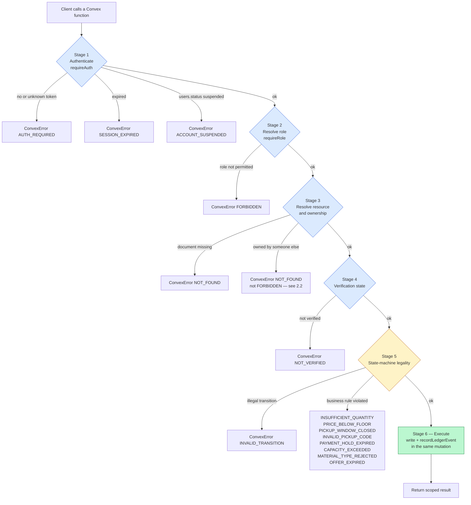
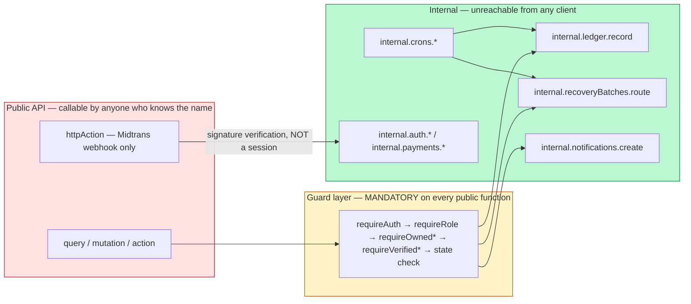

# Authorization & Permissions — Cirquo

| Field | Value |
|---|---|
| **Document type** | Security / Authorization Enforcement |
| **Status** | Guard foundation implemented; full capability matrix target documented |
| **Last updated** | 2026-08-29 |
| **Applies to** | Every Convex function in `convex/`, the guard library `convex/lib/guards.ts`, the React 19 / Capacitor 8 client |
| **Depends on** | [AUTH.md](AUTH.md) — this document consumes `requireAuth` and assumes session tokens exist |
| **Implementation status** | ✅ Guard foundations implemented; the full capability matrix remains target work. See §1.1. |

> The source-backed current boundary is maintained in
> [IMPLEMENTATION_STATUS.md](../project/IMPLEMENTATION_STATUS.md). Validate a
> capability against the relevant `convex/` export before treating this matrix
> as implemented.

---

## 1. The Core Principle

> **The frontend may hide a button. The server must reject the call regardless.**

This is not a stylistic preference. It follows directly from how Convex works.

**Every non-internal Convex function is callable by anyone who knows its name.** A `query` or `mutation` exported from `convex/*.ts` is reachable over the public Convex API from any client — a browser console, `curl`, a script, a decompiled Android APK. Function names are not secret; they ship inside the client bundle, and the bundle is public because it is served to every visitor.

Concretely, if `surplusItems.publish` exists as a `mutation` and does not check the caller, this works:

```js
// Pasted into any browser console
await convex.mutation('surplusItems:publish', {
  token: '<my own consumer token>',
  itemId: '<some other merchant\'s item id>',
});
```

No amount of conditional rendering prevents that call. `{isVerifiedMerchant && <PublishButton />}` is a **usability** feature — it stops honest users from attempting actions that would fail. It is **not** a security control and must never be counted as one.

| Layer | Purpose | Trusted? |
|---|---|---|
| Conditional rendering | Reduce confusion, avoid pointless failed calls | 🔴 **No** |
| Client-side route guards | UX — do not show a dashboard the user cannot use | 🔴 **No** |
| Zod form validation | Immediate feedback, fewer round-trips | 🔴 **No** |
| Convex argument validators (`v.*`) | Type and shape enforcement at the API boundary | 🟢 Yes — runs server-side |
| **Guard functions in the handler** | Identity, role, ownership, verification, state legality | 🟢 **Yes — the only real control** |
| `internal*` visibility | Removes the function from the public API entirely | 🟢 Yes |

### 1.1 Where Cirquo stands today

✅ **Authorization foundations exist.** Session, role, ownership, and Merchant/
Processor verification guards are implemented in `convex/lib/guards.ts`. The
matrix below remains the target capability model; each new function must still
apply its server-side guard before accessing data.

| Function | Exposure today | Severity |
|---|---|---|
| `orders.listByUser` | Accepts a `userId` and returns that user's orders — **anyone can read anyone's order history** | 🔴 Critical IDOR |
| `users.getByEmail` | Confirms account existence and returns the user document | 🔴 Critical — enumeration, plus `passwordHash` exposure once that field exists |
| `merchants.getByOwner` | Returns any merchant profile by owner id | 🟠 Moderate |
| `recoveryBatches.listByStatus` | Returns operational batch data to anyone | 🟠 Moderate |
| `surplusItems.listByStatus` | Public browse | 🟢 Acceptable for `active` only |
| `impact.getPlaceholderSummary` | Aggregate, non-identifying | 🟢 Acceptable |

The detailed matrix below is the target capability model. Current functions use
the implemented guard helpers, but every new function must be checked against
this model before it is exposed.

---

## 2. The Authorization Decision Pipeline

Every guarded function runs the same six-stage pipeline. Stages are ordered so the cheapest and most fundamental checks fail first, and so error codes never leak information the caller has not yet earned.



### 2.1 Stage responsibilities

| Stage | Question | Guard | Error on failure |
|---|---|---|---|
| 1. Authenticate | Who is calling? | `requireAuth` | `AUTH_REQUIRED` / `SESSION_EXPIRED` / `ACCOUNT_SUSPENDED` |
| 2. Role | Is this actor type allowed here at all? | `requireRole` | `FORBIDDEN` |
| 3. Ownership | Does this specific document belong to them? | `requireOwned*` | `NOT_FOUND` |
| 4. Verification | Is their business account approved for this action? | `requireVerified*` | `NOT_VERIFIED` |
| 5. State legality | Is this transition legal from the current state? | Inline transition check | `INVALID_TRANSITION` + domain codes |
| 6. Execute | Perform the write and record the ledger event atomically | — | — |

### 2.2 Why ownership failure returns `NOT_FOUND`, not `FORBIDDEN`

Returning `FORBIDDEN` for a resource the caller does not own confirms that the resource **exists**. An attacker probing document IDs learns which are real — a slow but genuine enumeration oracle over the whole database.

**Rule:** when a caller has no relationship to a document, respond exactly as if it did not exist — `NOT_FOUND`.

`FORBIDDEN` is reserved for cases where the *action type* is wrong for the caller's role and no resource identity is revealed.

| Situation | Code | Reveals |
|---|---|---|
| Consumer calls a merchant-only function | `FORBIDDEN` | Only that the function is merchant-only — public knowledge |
| Merchant A requests Merchant B's item by ID | `NOT_FOUND` | Nothing — indistinguishable from a fabricated ID |
| Verification check fails on an owned resource | `NOT_VERIFIED` | Nothing new — the caller already owns the resource |

---

## 3. The Guard Library

All guards live in `convex/lib/guards.ts`. Application code never queries `sessions` and never inspects `role` inline.

### 3.1 `requireAuth`

```ts
// convex/lib/guards.ts — 📋 planned
import { ConvexError } from 'convex/values';
import type { QueryCtx, MutationCtx } from '../_generated/server';
import type { Doc, Id } from '../_generated/dataModel';
import { hashToken } from './tokens';

export type Ctx = QueryCtx | MutationCtx;
export type AuthedUser = Doc<'users'>;
export type Role = 'consumer' | 'merchant' | 'processor' | 'admin';

/** Throws: AUTH_REQUIRED | SESSION_EXPIRED | ACCOUNT_SUSPENDED */
export async function requireAuth(
  ctx: Ctx,
  token: string | undefined | null,
): Promise<AuthedUser> {
  if (!token || token.length < 20) throw new ConvexError('AUTH_REQUIRED');

  const tokenHash = await hashToken(token);

  const session = await ctx.db
    .query('sessions')
    .withIndex('by_token_hash', (q) => q.eq('tokenHash', tokenHash))
    .unique();

  if (!session) throw new ConvexError('AUTH_REQUIRED');
  if (session.expiresAt <= Date.now()) throw new ConvexError('SESSION_EXPIRED');

  const user = await ctx.db.get(session.userId);
  if (!user) throw new ConvexError('AUTH_REQUIRED');
  if (user.status === 'suspended') throw new ConvexError('ACCOUNT_SUSPENDED');

  return user;
}
```

### 3.2 `requireRole`

```ts
/**
 * Authenticate, then assert the caller holds one of the given roles.
 * Throws: AUTH_REQUIRED | SESSION_EXPIRED | ACCOUNT_SUSPENDED | FORBIDDEN
 */
export async function requireRole(
  ctx: Ctx,
  token: string,
  ...roles: Role[]
): Promise<AuthedUser> {
  const user = await requireAuth(ctx, token);
  if (!roles.includes(user.role as Role)) {
    throw new ConvexError('FORBIDDEN');
  }
  return user;
}
```

Variadic on purpose: several functions legitimately serve two actors, e.g. `requireRole(ctx, token, 'merchant', 'admin')` for a merchant-owned resource an admin may also touch.

### 3.3 `requireAdmin`

```ts
/** Throws: AUTH_REQUIRED | SESSION_EXPIRED | ACCOUNT_SUSPENDED | FORBIDDEN */
export async function requireAdmin(ctx: Ctx, token: string): Promise<AuthedUser> {
  return requireRole(ctx, token, 'admin');
}
```

A named alias rather than an inline `requireRole(ctx, token, 'admin')` so that `rg 'requireAdmin'` enumerates every privileged function in one command. Greppability is a security property.

### 3.4 `requireVerifiedMerchant`

```ts
/**
 * Authenticate → assert merchant role → load the owned merchant profile
 * → assert verificationStatus === 'verified'.
 *
 * Throws: AUTH_REQUIRED | SESSION_EXPIRED | ACCOUNT_SUSPENDED
 *       | FORBIDDEN | NOT_FOUND | NOT_VERIFIED
 */
export async function requireVerifiedMerchant(
  ctx: Ctx,
  token: string,
): Promise<{ user: AuthedUser; merchant: Doc<'merchants'> }> {
  const user = await requireRole(ctx, token, 'merchant');

  const merchant = await ctx.db
    .query('merchants')
    .withIndex('by_owner', (q) => q.eq('ownerId', user._id))
    .unique();

  // No profile yet — the AUTH-03 business-profile step was not completed.
  if (!merchant) throw new ConvexError('NOT_FOUND');

  // AUTH-04 gate: pending, rejected, and suspended all fail here.
  if (merchant.verificationStatus !== 'verified') {
    throw new ConvexError('NOT_VERIFIED');
  }

  return { user, merchant };
}
```

### 3.5 `requireVerifiedProcessor`

```ts
/**
 * Throws: AUTH_REQUIRED | SESSION_EXPIRED | ACCOUNT_SUSPENDED
 *       | FORBIDDEN | NOT_FOUND | NOT_VERIFIED
 */
export async function requireVerifiedProcessor(
  ctx: Ctx,
  token: string,
): Promise<{ user: AuthedUser; processor: Doc<'processors'> }> {
  const user = await requireRole(ctx, token, 'processor');

  const processor = await ctx.db
    .query('processors')
    .withIndex('by_owner', (q) => q.eq('ownerId', user._id))
    .unique();

  if (!processor) throw new ConvexError('NOT_FOUND');
  if (processor.verificationStatus !== 'verified') {
    throw new ConvexError('NOT_VERIFIED');
  }

  return { user, processor };
}
```

### 3.6 `requireOwnedRescueItem`

```ts
/**
 * Load a Rescue Item and prove the caller's merchant owns it.
 * Admins bypass ownership but not authentication.
 *
 * Throws: AUTH_REQUIRED | SESSION_EXPIRED | ACCOUNT_SUSPENDED
 *       | FORBIDDEN | NOT_FOUND | NOT_VERIFIED
 */
export async function requireOwnedRescueItem(
  ctx: Ctx,
  token: string,
  itemId: Id<'surplusItems'>,
): Promise<{
  user: AuthedUser;
  merchant: Doc<'merchants'> | null;
  item: Doc<'surplusItems'>;
}> {
  const user = await requireAuth(ctx, token);

  const item = await ctx.db.get(itemId);
  if (!item) throw new ConvexError('NOT_FOUND');

  if (user.role === 'admin') return { user, merchant: null, item };
  if (user.role !== 'merchant') throw new ConvexError('FORBIDDEN');

  const merchant = await ctx.db
    .query('merchants')
    .withIndex('by_owner', (q) => q.eq('ownerId', user._id))
    .unique();
  if (!merchant) throw new ConvexError('NOT_FOUND');

  // Ownership mismatch reported as NOT_FOUND — see §2.2.
  if (item.merchantId !== merchant._id) throw new ConvexError('NOT_FOUND');

  if (merchant.verificationStatus !== 'verified') {
    throw new ConvexError('NOT_VERIFIED');
  }

  return { user, merchant, item };
}
```

### 3.7 `requireOwnedOrder`

```ts
/**
 * An order has THREE legitimate readers:
 *   - the consumer who placed it
 *   - the merchant fulfilling it
 *   - an admin
 * The returned `relation` lets the handler branch, because permitted
 * fields and actions differ per relation.
 *
 * Throws: AUTH_REQUIRED | SESSION_EXPIRED | ACCOUNT_SUSPENDED | NOT_FOUND
 */
export async function requireOwnedOrder(
  ctx: Ctx,
  token: string,
  orderId: Id<'orders'>,
): Promise<{
  user: AuthedUser;
  order: Doc<'orders'>;
  relation: 'consumer' | 'merchant' | 'admin';
}> {
  const user = await requireAuth(ctx, token);

  const order = await ctx.db.get(orderId);
  if (!order) throw new ConvexError('NOT_FOUND');

  if (user.role === 'admin') return { user, order, relation: 'admin' };

  if (user.role === 'consumer') {
    if (order.userId !== user._id) throw new ConvexError('NOT_FOUND');
    return { user, order, relation: 'consumer' };
  }

  if (user.role === 'merchant') {
    const merchant = await ctx.db
      .query('merchants')
      .withIndex('by_owner', (q) => q.eq('ownerId', user._id))
      .unique();
    if (!merchant || order.merchantId !== merchant._id) {
      throw new ConvexError('NOT_FOUND');
    }
    return { user, order, relation: 'merchant' };
  }

  // Processors have no relationship to orders at all.
  throw new ConvexError('NOT_FOUND');
}
```

### 3.8 `requireOwnedBatch`

```ts
/**
 * A Recovery Batch is reachable by:
 *   - the merchant whose Rescue Item produced it
 *   - the processor it is assigned to
 *   - a processor holding a live offer for it
 *   - an admin
 *
 * Throws: AUTH_REQUIRED | SESSION_EXPIRED | ACCOUNT_SUSPENDED
 *       | NOT_FOUND | NOT_VERIFIED | OFFER_EXPIRED
 */
export async function requireOwnedBatch(
  ctx: Ctx,
  token: string,
  batchId: Id<'recoveryBatches'>,
): Promise<{
  user: AuthedUser;
  batch: Doc<'recoveryBatches'>;
  relation: 'merchant' | 'processor' | 'admin';
  processor?: Doc<'processors'>;
}> {
  const user = await requireAuth(ctx, token);

  const batch = await ctx.db.get(batchId);
  if (!batch) throw new ConvexError('NOT_FOUND');

  if (user.role === 'admin') return { user, batch, relation: 'admin' };

  if (user.role === 'merchant') {
    const merchant = await ctx.db
      .query('merchants')
      .withIndex('by_owner', (q) => q.eq('ownerId', user._id))
      .unique();
    if (!merchant || batch.merchantId !== merchant._id) {
      throw new ConvexError('NOT_FOUND');
    }
    return { user, batch, relation: 'merchant' };
  }

  if (user.role === 'processor') {
    const processor = await ctx.db
      .query('processors')
      .withIndex('by_owner', (q) => q.eq('ownerId', user._id))
      .unique();
    if (!processor) throw new ConvexError('NOT_FOUND');
    if (processor.verificationStatus !== 'verified') {
      throw new ConvexError('NOT_VERIFIED');
    }

    const isAssigned = batch.processorId === processor._id;
    // A live offer grants temporary visibility so the processor can decide.
    // Offer TTL is 6 hours — see ../domain/STATE_MACHINE.md.
    const hasLiveOffer =
      batch.status === 'offered' &&
      isAssigned &&
      (batch.offerExpiresAt ?? 0) > Date.now();

    if (!isAssigned) throw new ConvexError('NOT_FOUND');
    if (batch.status === 'offered' && !hasLiveOffer) {
      throw new ConvexError('OFFER_EXPIRED');
    }

    return { user, batch, relation: 'processor', processor };
  }

  throw new ConvexError('NOT_FOUND');
}
```

---

## 4. Guards Must Come First

**Rule: guard calls are the first statements of every handler. Nothing — no read, no computation, no logging — precedes them.**

1. **Information leakage.** Work performed before the guard leaks through timing and through errors thrown by that work.
2. **Wasted resources.** An unauthenticated caller should cost one indexed lookup, not a table scan.
3. **Reviewability.** A reviewer must read the first three lines of a handler and know exactly who may call it. A guard buried on line 40 will eventually be skipped in a refactor.

### 4.1 Incorrect

```ts
// 🔴 WRONG
export const updateRescueItem = mutation({
  args: {
    token: v.string(),
    itemId: v.id('surplusItems'),
    currentPrice: v.number(),
  },
  handler: async (ctx, args) => {
    // 🔴 Reads the document before knowing who is asking.
    const item = await ctx.db.get(args.itemId);
    if (!item) throw new ConvexError('NOT_FOUND');

    // 🔴 Business logic before the guard. If this throws PRICE_BELOW_FLOOR,
    // an anonymous caller has just learned the item's floorPrice —
    // commercially sensitive data.
    if (args.currentPrice < item.floorPrice) {
      throw new ConvexError('PRICE_BELOW_FLOOR');
    }

    // 🔴 Guard arrives far too late.
    const user = await requireAuth(ctx, args.token);
    const merchant = await ctx.db
      .query('merchants')
      .withIndex('by_owner', (q) => q.eq('ownerId', user._id))
      .unique();
    if (item.merchantId !== merchant!._id) throw new ConvexError('FORBIDDEN');

    await ctx.db.patch(args.itemId, { currentPrice: args.currentPrice });
  },
});
```

**What leaks:** an anonymous attacker iterating IDs distinguishes valid from invalid ones (`NOT_FOUND` vs `PRICE_BELOW_FLOOR`) and can binary-search `floorPrice` — the merchant's confidential cost floor — without ever authenticating.

### 4.2 Correct

```ts
// 🟢 CORRECT
export const updateRescueItem = mutation({
  args: {
    token: v.string(),
    itemId: v.id('surplusItems'),
    currentPrice: v.number(),
  },
  handler: async (ctx, args) => {
    // 1. Authenticate + role + ownership + verification, all first.
    const { user, item } = await requireOwnedRescueItem(
      ctx,
      args.token,
      args.itemId,
    );

    // 2. State-machine legality — a listing is immutable once touched.
    if (item.remainingQuantity !== item.initialQuantity) {
      throw new ConvexError('INVALID_TRANSITION');
    }
    if (item.status !== 'draft' && item.status !== 'active') {
      throw new ConvexError('INVALID_TRANSITION');
    }

    // 3. Business invariants — server-side, never trusting the client.
    if (args.currentPrice < item.floorPrice) {
      throw new ConvexError('PRICE_BELOW_FLOOR');
    }
    if (args.currentPrice >= item.originalPrice) {
      throw new ConvexError('VALIDATION_FAILED');
    }

    // 4. Execute — explicit field list, never a spread.
    await ctx.db.patch(args.itemId, { currentPrice: args.currentPrice });

    // 5. Ledger, in the same mutation, same transaction.
    await recordLedgerEvent(ctx, {
      surplusItemId: args.itemId,
      eventType: 'PRICE_ADJUSTED',
      weightDeltaGrams: 0,
      actorId: user._id,
      actorRole: user.role,
      metadata: { from: item.currentPrice, to: args.currentPrice },
    });
  },
});
```

---

## 5. Function-to-Authorization Matrix

Every planned Convex function. `—` means not applicable. Functions marked `internal*` are **not** reachable from any client.

### 5.1 `auth.*`

| Function | Type | Required role | Ownership condition | Verification | Guard call |
|---|---|---|---|---|---|
| `auth.register` | `action` | 🌐 public | — | — | none — role validator excludes `admin` |
| `auth.login` | `action` | 🌐 public | — | — | none — rate-limited internally |
| `auth.logout` | `mutation` | any | own session | — | token lookup only; never throws |
| `auth.logoutAll` | `mutation` | any | own sessions | — | `requireAuth` |
| `auth.me` | `query` | any | self | — | `requireAuth` |
| `auth.changePassword` | `action` | any | self | — | `resolveSession` + current-password re-auth |
| `auth.requestPasswordReset` | `action` | 🌐 public | — | — | none — enumeration-safe, rate-limited |
| `auth.resetPassword` | `action` | 🌐 public | reset-token holder | — | single-use token validation |
| `internal.auth.checkEmailAvailable` | `internalQuery` | 🔒 server | — | — | not client-callable |
| `internal.auth.createUserAndSession` | `internalMutation` | 🔒 server | — | — | not client-callable — **exposing this is total account forgery** |
| `internal.auth.resolveSession` | `internalQuery` | 🔒 server | — | — | not client-callable |
| `internal.auth.recordFailedLogin` | `internalMutation` | 🔒 server | — | — | not client-callable |
| `internal.auth.applyPasswordChange` | `internalMutation` | 🔒 server | — | — | not client-callable |

### 5.2 `users.*`

| Function | Type | Required role | Ownership condition | Verification | Guard call |
|---|---|---|---|---|---|
| `users.getMe` | `query` | any | self only | — | `requireAuth(ctx, args.token)` |
| `users.updateProfile` | `mutation` | any | self only | — | `requireAuth` — `name` and `phone` only |
| `users.getPublicProfile` | `query` | any | — | — | `requireAuth` — returns `{ name }` only |
| ~~`users.getByEmail`~~ | `query` | 🔴 **public today** | — | — | 🔴 **Must become `internalQuery`** |
| `internal.users.getByEmail` | `internalQuery` | 🔒 server | — | — | not client-callable |

### 5.3 `merchants.*`

| Function | Type | Required role | Ownership condition | Verification | Guard call |
|---|---|---|---|---|---|
| `merchants.createProfile` | `mutation` | merchant | `ownerId` set server-side from `user._id` | not required — creates `pending` | `requireRole(ctx, token, 'merchant')` |
| `merchants.updateProfile` | `mutation` | merchant | own profile via `by_owner` | not required | `requireRole` + owner lookup — `verificationStatus` NOT patchable |
| `merchants.getMine` | `query` | merchant | own profile | not required | `requireRole(ctx, token, 'merchant')` |
| `merchants.getPublic` | `query` | 🌐 public | — | only `verified` returned | none — public fields only |
| `merchants.listNearby` | `query` | 🌐 public | — | filtered to `verified` | none — public fields only |
| ~~`merchants.getByOwner`~~ | `query` | 🔴 **public today** | — | — | 🟠 **Must become `requireRole('merchant','admin')` + self-scope** |

### 5.4 `processors.*`

| Function | Type | Required role | Ownership condition | Verification | Guard call |
|---|---|---|---|---|---|
| `processors.createProfile` | `mutation` | processor | `ownerId` server-side | not required — creates `pending` | `requireRole(ctx, token, 'processor')` |
| `processors.updateProfile` | `mutation` | processor | own profile | not required | `requireRole` + owner lookup — `verificationStatus` NOT patchable |
| `processors.updateCapacity` | `mutation` | processor | own profile | **required** | `requireVerifiedProcessor` |
| `processors.getMine` | `query` | processor | own profile | not required | `requireRole(ctx, token, 'processor')` |
| `processors.listForAdmin` | `query` | admin | — | — | `requireAdmin` |
| `internal.processors.findEligible` | `internalQuery` | 🔒 server | — | filters to `verified` | routing engine only — **public would expose the whole processor network** |

### 5.5 `surplusItems.*` (Rescue Items)

| Function | Type | Required role | Ownership condition | Verification | Guard call |
|---|---|---|---|---|---|
| `surplusItems.create` | `mutation` | merchant | `merchantId` from the guard, never from args | **required** | `requireVerifiedMerchant` |
| `surplusItems.update` | `mutation` | merchant | own item | **required** | `requireOwnedRescueItem` + untouched-quantity check |
| `surplusItems.publish` | `mutation` | merchant | own item | **required** | `requireOwnedRescueItem` + `draft → active` |
| `surplusItems.adjustPrice` | `mutation` | merchant | own item | **required** | `requireOwnedRescueItem` + `≥ floorPrice`, `< originalPrice` |
| `surplusItems.cancel` | `mutation` | merchant | own item | **required** | `requireOwnedRescueItem` + only while untouched |
| `surplusItems.listMine` | `query` | merchant | own items | not required | `requireRole('merchant')` + `by_merchant` index |
| `surplusItems.getPublic` | `query` | 🌐 public | — | merchant must be `verified` | none — `active` only, public fields |
| `surplusItems.browse` | `query` | 🌐 public | — | filtered | none — `status === 'active'` at the index level |
| ~~`surplusItems.listByStatus`~~ | `query` | 🌐 public | — | — | 🟢 Acceptable **only** if hard-restricted to `active` |
| `internal.surplusItems.expireStale` | `internalMutation` | 🔒 server | — | — | cron only |
| `internal.surplusItems.tickPrice` | `internalMutation` | 🔒 server | — | — | cron only — Dynamic Rescue Pricing |

### 5.6 `orders.*`

| Function | Type | Required role | Ownership condition | Verification | Guard call |
|---|---|---|---|---|---|
| `orders.reserve` | `mutation` | consumer | `userId` from the guard | — | `requireRole('consumer')` + quantity decrement + `paymentHoldExpiresAt` |
| `orders.get` | `query` | consumer | own order | — | `requireRole('consumer')`; missing/non-owned returns `null` |
| `orders.listMine` | `query` | consumer | own orders | — | `requireRole('consumer')` + `by_user` index |
| `orders.listForMerchant` | `query` | merchant | own merchant's orders | **required** | 📋 M4 target |
| `orders.cancel` | `mutation` | consumer | own order | — | 📋 Later consumer lifecycle target |
| `orders.confirmPickup` | `mutation` | merchant | own merchant's order | **required** | 📋 M4: code + window + atomic `RESCUED` |
| `orders.adminOverridePickup` | `mutation` | admin | — | — | `requireAdmin` — bypasses the window only, never the code silently |
| `orders.listByUser` | `internalQuery` | 🔒 server | explicit user id | — | Internal helper only; not client-callable |
| `internal.orders.expireHold` | `internalMutation` | 🔒 server | — | — | per-order `runAt` at the 15-minute hold deadline |

### 5.7 `payments.*`

| Function | Type | Required role | Ownership condition | Verification | Guard call |
|---|---|---|---|---|---|
| `payments.createTransaction` | `action` | consumer | own order | — | `requireOwnedOrder` via `runQuery`; amount computed server-side |
| `payments.getStatus` | `query` | consumer / admin | own order | — | `requireOwnedOrder` |
| `payments.midtransWebhook` | `httpAction` | 🌐 unauthenticated | — | — | **signature verification only** — §5.7.1 |
| `internal.payments.applyWebhookResult` | `internalMutation` | 🔒 server | — | — | webhook only |

#### 5.7.1 Webhook authorization

`payments.midtransWebhook` is the only `httpAction` in Cirquo and the only endpoint reachable without a session token. It cannot use the guard library — Midtrans holds no Cirquo session.

| Control | Requirement |
|---|---|
| Signature verification | SHA-512 of `order_id + status_code + gross_amount + serverKey` compared to `signature_key`. Mismatch → `403`, no state change |
| Server key location | **Convex environment variable only.** Never a `VITE_*` variable — anything `VITE_`-prefixed is embedded in the public client bundle |
| Idempotency | `providerTransactionId` is unique; a replayed webhook is a no-op returning `200` |
| Amount re-check | The webhook's `gross_amount` must equal `orders.totalPrice`; mismatch → `IDEMPOTENCY_CONFLICT` plus an admin notification |
| State legality | Only `reserved → paid` is honoured; a webhook for an already `cancelled` or `expired` order is logged and ignored |
| Ledger | Writes a `PAID` event through `recordLedgerEvent` inside `internal.payments.applyWebhookResult` |

### 5.8 `recoveryBatches.*`

| Function | Type | Required role | Ownership condition | Verification | Guard call |
|---|---|---|---|---|---|
| `recoveryBatches.listOffers` | `query` | processor | offers to this processor | **required** | `requireVerifiedProcessor` + `by_processor` index |
| `recoveryBatches.get` | `query` | merchant / processor / admin | party to the batch | processor: required | `requireOwnedBatch` |
| `recoveryBatches.accept` | `mutation` | processor | offered to them | **required** | `requireOwnedBatch` + TTL + `MATERIAL_TYPE_REJECTED` + `CAPACITY_EXCEEDED` |
| `recoveryBatches.decline` | `mutation` | processor | offered to them | **required** | `requireOwnedBatch` → appends to `declinedByProcessorIds`, re-queues |
| `recoveryBatches.logIntake` | `mutation` | processor | assigned to them | **required** | `requireOwnedBatch` — **only the Processor may set `acceptedWeightGrams`** |
| `recoveryBatches.logOutcome` | `mutation` | processor | assigned to them | **required** | `requireOwnedBatch` + `residualWeightGrams ≤ acceptedWeightGrams` |
| `recoveryBatches.listForMerchant` | `query` | merchant | own batches | **required** | `requireVerifiedMerchant` + `by_merchant` index |
| ~~`recoveryBatches.listByStatus`~~ | `query` | 🔴 **public today** | — | — | 🟠 **Must become `requireAdmin`** |
| `internal.recoveryBatches.route` | `internalMutation` | 🔒 server | — | — | Circular Routing engine — max 3 attempts, 6 h TTL |
| `internal.recoveryBatches.expireOffers` | `internalMutation` | 🔒 server | — | — | cron — `offered → pending` or `unroutable` |

### 5.9 `impact.*` and ledger reads

| Function | Type | Required role | Ownership condition | Verification | Guard call |
|---|---|---|---|---|---|
| `impact.getPlatformSummary` | `query` | 🌐 public | — | — | none — aggregate only, no identifiable rows |
| `impact.getMerchantSummary` | `query` | merchant / admin | own merchant | — | `requireRole('merchant','admin')` + owner scope |
| `impact.getProcessorSummary` | `query` | processor / admin | own processor | — | `requireRole('processor','admin')` + owner scope |
| `impact.getMyImpact` | `query` | consumer | own orders | — | `requireRole('consumer')` |
| `ledger.listForItem` | `query` | merchant / processor / admin | party to the item | — | `requireOwnedRescueItem` then `by_surplus_item` |
| `ledger.listMine` | `query` | any | `actorId === user._id` | — | `requireAuth` + `by_actor` index |
| `ledger.listAll` | `query` | admin | — | — | `requireAdmin` |
| `internal.ledger.record` | `internalMutation` | 🔒 server | — | — | **the only writer to `materialFlowLedger`** |
| `internal.impact.snapshot` | `internalMutation` | 🔒 server | — | — | cron — writes `impactSnapshots` |

### 5.10 `notifications.*`

| Function | Type | Required role | Ownership condition | Verification | Guard call |
|---|---|---|---|---|---|
| `notifications.listMine` | `query` | any | `userId === user._id` | — | `requireAuth` + `by_user` index |
| `notifications.markRead` | `mutation` | any | own notification | — | `requireAuth` + `NOT_FOUND` on mismatch |
| `notifications.markAllRead` | `mutation` | any | own notifications | — | `requireAuth` + `by_user` index |
| `internal.notifications.create` | `internalMutation` | 🔒 server | — | — | **public would let anyone phish any user inside a trusted UI** |
| `internal.notifications.fanOut` | `internalAction` | 🔒 server | — | — | scheduled fan-out |

### 5.11 `disputes.*`

| Function | Type | Required role | Ownership condition | Verification | Guard call |
|---|---|---|---|---|---|
| `disputes.raise` | `mutation` | consumer / merchant | party to the order | — | `requireOwnedOrder` — `raisedByUserId` from the guard, `againstUserId` derived server-side |
| `disputes.listMine` | `query` | consumer / merchant | raised by or against the caller | — | `requireAuth` + two indexed reads |
| `disputes.get` | `query` | party / admin | party to the dispute | — | `requireAuth` + party check → `NOT_FOUND` |
| `disputes.addComment` | `mutation` | party / admin | party to the dispute | — | `requireAuth` + party check |
| `disputes.listAll` | `query` | admin | — | — | `requireAdmin` |
| `disputes.resolve` | `mutation` | admin | — | — | `requireAdmin` — `resolvedByAdminId` from the guard |

### 5.12 `admin.*`

Every function below calls `requireAdmin` as its first statement, without exception.

| Function | Type | Guard | Audited |
|---|---|---|---|
| `admin.listUsers` | `query` | `requireAdmin` | ✅ |
| `admin.suspendUser` | `mutation` | `requireAdmin` | ✅ — deletes all sessions |
| `admin.reinstateUser` | `mutation` | `requireAdmin` | ✅ |
| `admin.listPendingMerchants` | `query` | `requireAdmin` | ✅ |
| `admin.verifyMerchant` | `mutation` | `requireAdmin` | ✅ |
| `admin.rejectMerchant` | `mutation` | `requireAdmin` | ✅ — reason required |
| `admin.listPendingProcessors` | `query` | `requireAdmin` | ✅ |
| `admin.verifyProcessor` | `mutation` | `requireAdmin` | ✅ |
| `admin.rejectProcessor` | `mutation` | `requireAdmin` | ✅ — reason required |
| `admin.moderateRescueItem` | `mutation` | `requireAdmin` | ✅ — writes `MODERATED` to the ledger |
| `admin.overridePickup` | `mutation` | `requireAdmin` | ✅ — the only pickup-window bypass |
| `admin.forceRouteBatch` | `mutation` | `requireAdmin` | ✅ |
| `admin.markBatchUnroutable` | `mutation` | `requireAdmin` | ✅ |
| `admin.resolveDispute` | `mutation` | `requireAdmin` | ✅ |
| `admin.listAuthEvents` | `query` | `requireAdmin` | ✅ — reads are audited too |
| `admin.listLedger` | `query` | `requireAdmin` | ✅ |
| `admin.recordCompensatingEntry` | `mutation` | `requireAdmin` | ✅ — the **only** ledger correction path |
| `internal.admin.provisionAdmin` | `internalMutation` | 🔒 dashboard only | ✅ — the sole route to `role: 'admin'` |

### 5.13 Cron and internal functions

| Function | Type | Schedule | Why internal |
|---|---|---|---|
| `internal.crons.expireUnpaidOrders` | `internalMutation` | every 1 min | Releases quantity after the 15-minute hold; public would let anyone cancel others' reservations |
| `internal.crons.expireListings` | `internalMutation` | every 5 min | Moves past-window items to `expired`, then `recovery_pending` |
| `internal.crons.tickDynamicPricing` | `internalMutation` | every 15 min | Dynamic Rescue Pricing; public would let anyone drive prices to the floor |
| `internal.crons.routeRecoveryBatches` | `internalMutation` | every 5 min | Circular Routing; public would let anyone assign batches to any processor |
| `internal.crons.expireRoutingOffers` | `internalMutation` | every 15 min | 6-hour offer TTL |
| `internal.crons.sweepExpiredSessions` | `internalMutation` | daily | Session hygiene |
| `internal.crons.sweepAuthEvents` | `internalMutation` | daily | 90-day UU PDP retention |
| `internal.crons.snapshotImpact` | `internalMutation` | daily | Writes `impactSnapshots` |
| `internal.ledger.record` | `internalMutation` | on demand | The single writer to `materialFlowLedger` |
| `internal.notifications.create` | `internalMutation` | on demand | Prevents notification spoofing |

---

## 6. Data Visibility Scoping

> **Returning a row the caller is not entitled to see is an authorization failure, even though no mutation occurred.** A read breach is a breach. Under UU PDP, exposing another person's data is a reportable incident regardless of whether anything was written.

Scoping must happen **at the index level**, not by `.collect()` followed by a JavaScript `.filter()`. Collect-then-filter loads unauthorized rows into memory, is O(table), and one dropped filter turns into a full dump.

### 6.1 Filter predicates by role and table

| Table | Consumer | Merchant | Processor | Admin |
|---|---|---|---|---|
| `users` | self only | self only | self only | all |
| `sessions` | own (`by_user`) | own | own | all — revocation only |
| `merchants` | `verificationStatus === 'verified'`, public fields | self (`by_owner`) + all verified public | all verified public | all |
| `processors` | ❌ none | ❌ none | self (`by_owner`) | all |
| `surplusItems` | `status === 'active'` + merchant verified; own reserved items via `orders` | `by_merchant` = own | ❌ direct; only via `recoveryBatches` | all |
| `orders` | `by_user` = self | `by_merchant` = own merchant | ❌ none | all |
| `payments` | via own orders | ❌ **none** — merchants never see payment instrument data | ❌ none | all |
| `recoveryBatches` | ❌ none | `by_merchant` = own | `by_processor` = self, plus live offers to self | all |
| `materialFlowLedger` | entries where `actorId === self` | entries on own items | entries on assigned batches | all |
| `notifications` | `by_user` = self | self | self | all |
| `disputes` | raised by or against self | raised by or against self | raised by or against self | all |
| `impactSnapshots` | aggregate read | aggregate read | aggregate read | all |
| `authEvents` | ❌ none | ❌ none | ❌ none | all |

### 6.2 Correct vs incorrect scoping

```ts
// 🔴 WRONG — loads every order in the database, then filters in JS.
export const listMine = query({
  args: { token: v.string() },
  handler: async (ctx, args) => {
    const user = await requireAuth(ctx, args.token);
    const all = await ctx.db.query('orders').collect(); // 🔴 full scan
    return all.filter((o) => o.userId === user._id);
  },
});

// 🟢 CORRECT — the index enforces the scope. Unauthorized rows are never
// read, never in memory, and cannot leak through a later refactor.
export const listMine = query({
  args: { token: v.string() },
  handler: async (ctx, args) => {
    const user = await requireAuth(ctx, args.token);
    return ctx.db
      .query('orders')
      .withIndex('by_user', (q) => q.eq('userId', user._id))
      .order('desc')
      .take(50);
  },
});
```

### 6.3 Field-level scoping

Row-level scoping is not sufficient — some fields must be stripped even from rows the caller may read.

| Table | Field | Never returned to |
|---|---|---|
| `users` | `passwordHash` | **anyone**, including admin. Strip in every projection, without exception |
| `users` | `email`, `phone` | anyone but the owner, an admin, and the counterparty in an active order |
| `sessions` | `tokenHash` | anyone |
| `surplusItems` | `floorPrice` | consumers — it is the merchant's confidential cost floor |
| `payments` | `rawPayload` | anyone but admin — provider-side data |
| `orders` | `pickupCode` | anyone but the owning consumer and the fulfilling merchant |
| `processors` | `dailyCapacityGrams`, `maxPickupRadiusMeters` | consumers and merchants — commercially sensitive operating data |
| `disputes` | `resolutionNote` | non-parties |

`pickupCode` deserves emphasis: it is **the sole anti-fraud mechanism for physical handover**. Any query returning an order must project fields explicitly rather than returning the raw document, or a nearby-orders feature will one day leak every live code in the market.

---

## 7. IDOR Defence

Convex document IDs are opaque strings — not sequential integers, not guessable by incrementing. **Opaque is not secret.** IDs leak through URLs, screenshots, shared links, browser history, support tickets, client-side logs, and any API response that includes a related document's ID.

**Rule: every function accepting an ID argument must verify the caller's relationship to that document before reading or acting on it.**

### 7.1 Vulnerable

```ts
// 🔴 VULNERABLE — classic IDOR. Essentially the shape of the
// orders.listByUser query that exists in the repository today.
export const get = query({
  args: { token: v.string(), orderId: v.id('orders') },
  handler: async (ctx, args) => {
    // Authenticated — but authentication is not authorization.
    await requireAuth(ctx, args.token);

    // 🔴 No relationship check. Any logged-in user reads ANY order:
    // consumer identity, pickup code, total price, merchant, timestamps.
    return ctx.db.get(args.orderId);
  },
});
```

**Impact:** any registered consumer — registration is free and instant — enumerates order IDs from their own API responses or a leaked link and reads every order on the platform, **including `pickupCode`**. With a code and a merchant name, an attacker collects food they never paid for. This one missing check defeats the entire physical-handover anti-fraud model.

### 7.2 Fixed

```ts
// 🟢 FIXED
export const get = query({
  args: { token: v.string(), orderId: v.id('orders') },
  handler: async (ctx, args) => {
    // Authenticate AND establish the caller's relationship to this order.
    // Non-parties receive NOT_FOUND — indistinguishable from a fake ID.
    const { order, relation } = await requireOwnedOrder(
      ctx,
      args.token,
      args.orderId,
    );

    // Field-level scoping by relation. The pickup code goes only to the
    // two parties who need it for the physical handover.
    const base = {
      _id: order._id,
      surplusItemId: order.surplusItemId,
      quantity: order.quantity,
      totalPrice: order.totalPrice,
      status: order.status,
      createdAt: order.createdAt,
      pickupCode: order.pickupCode,
    };

    if (relation === 'admin') {
      return { ...base, userId: order.userId, merchantId: order.merchantId };
    }
    if (relation === 'consumer') {
      return { ...base, merchantId: order.merchantId };
    }
    // merchant
    return { ...base, rescuedWeightGrams: order.rescuedWeightGrams };
  },
});
```

### 7.3 The IDOR audit rule

For every function, ask: **"If I replace this ID argument with an ID belonging to a stranger, what happens?"**

| Answer | Verdict |
|---|---|
| `NOT_FOUND` is thrown | 🟢 Correct |
| `FORBIDDEN` is thrown | 🟠 Works, but confirms existence — prefer `NOT_FOUND` |
| Data is returned | 🔴 **IDOR vulnerability** |
| A write succeeds | 🔴 **Critical IDOR vulnerability** |

Every one of the ~30 planned functions taking an ID must be walked through this question before M1 ships.

---

## 8. Mass-Assignment Defence

> **Never spread client arguments into `ctx.db.insert` or `ctx.db.patch`.**

`ctx.db.insert('users', { ...args })` writes whatever the client sent. Convex validators reject *unknown* fields, which helps — but the moment a validator legitimately includes a field the client should not control, the spread becomes a privilege-escalation vector. Name every field explicitly, always, so safety never depends on validator discipline.

### 8.1 Vulnerable — `role` at registration

```ts
// 🔴 CATASTROPHIC
export const register = mutation({
  args: {
    name: v.string(),
    email: v.string(),
    passwordHash: v.string(),
    role: v.string(),            // 🔴 unconstrained string
    status: v.optional(v.string()),
  },
  handler: async (ctx, args) => {
    // 🔴 Spread — every client-supplied field lands in the row.
    return ctx.db.insert('users', { ...args, createdAt: Date.now() });
  },
});
```

Exploit — one line in a browser console:

```js
await convex.mutation('auth:register', {
  name: 'x', email: 'x@x.com', passwordHash: '...',
  role: 'admin',        // 🔴 full platform control
  status: 'active',
});
```

The attacker now passes `requireAdmin` everywhere: verifying fraudulent merchants, overriding pickup windows, reading the entire ledger, suspending legitimate users.

### 8.2 Fixed — `role` at registration

```ts
// 🟢 FIXED — see AUTH.md §8.2 for the full three-layer defence.
export const createUserAndSession = internalMutation({
  args: {
    name: v.string(),
    email: v.string(),
    passwordHash: v.string(),
    // Layer 1 — 'admin' is not a member of this union, so the runtime
    // rejects the call before the handler executes.
    role: v.union(
      v.literal('consumer'),
      v.literal('merchant'),
      v.literal('processor'),
    ),
    phone: v.optional(v.string()),
    tokenHash: v.string(),
  },
  handler: async (ctx, args) => {
    // Layer 3 — survives a future refactor that widens the validator.
    if ((args.role as string) === 'admin') throw new ConvexError('FORBIDDEN');

    // Layer 2 — explicit fields, no spread. `status` is server-set and is
    // not an argument at all, so it can never be client-controlled.
    return ctx.db.insert('users', {
      name: args.name,
      email: args.email,
      passwordHash: args.passwordHash,
      role: args.role,
      phone: args.phone,
      status: 'active',
      createdAt: Date.now(),
    });
  },
});
```

### 8.3 Vulnerable — `verificationStatus` on profile update

```ts
// 🔴 VULNERABLE — self-verification
export const updateProfile = mutation({
  args: {
    token: v.string(),
    patch: v.any(),          // 🔴 arbitrary object from the client
  },
  handler: async (ctx, args) => {
    const { merchant } = await requireVerifiedMerchant(ctx, args.token);
    await ctx.db.patch(merchant._id, args.patch); // 🔴
  },
});
```

Exploit:

```js
await convex.mutation('merchants:updateProfile', {
  token: myToken,
  patch: { verificationStatus: 'verified' },   // 🔴 AUTH-04 bypassed
});
```

An unvetted merchant self-verifies and begins publishing Rescue Items, defeating the entire trust model. Consumers would pay for food from an account no human ever reviewed.

### 8.4 Fixed — `verificationStatus` on profile update

```ts
// 🟢 FIXED — an explicit allowlist of mutable fields.
export const updateProfile = mutation({
  args: {
    token: v.string(),
    // verificationStatus is deliberately ABSENT from this validator.
    // It is not a field a merchant may express an opinion about.
    name: v.optional(v.string()),
    businessType: v.optional(v.string()),
    address: v.optional(v.string()),
    city: v.optional(v.string()),
    latitude: v.optional(v.number()),
    longitude: v.optional(v.number()),
    phone: v.optional(v.string()),
  },
  handler: async (ctx, args) => {
    const user = await requireRole(ctx, args.token, 'merchant');

    const merchant = await ctx.db
      .query('merchants')
      .withIndex('by_owner', (q) => q.eq('ownerId', user._id))
      .unique();
    if (!merchant) throw new ConvexError('NOT_FOUND');

    // Explicit construction. Nothing outside this object can be written.
    const patch: Partial<Doc<'merchants'>> = {};
    if (args.name !== undefined) patch.name = args.name.trim();
    if (args.businessType !== undefined) patch.businessType = args.businessType;
    if (args.address !== undefined) patch.address = args.address;
    if (args.city !== undefined) patch.city = args.city;
    if (args.latitude !== undefined) patch.latitude = args.latitude;
    if (args.longitude !== undefined) patch.longitude = args.longitude;
    if (args.phone !== undefined) patch.phone = args.phone;

    await ctx.db.patch(merchant._id, patch);
    return { ok: true };
  },
});
```

### 8.5 Server-controlled fields — never client arguments

| Table | Field | Set by |
|---|---|---|
| `users` | `role` | Registration allowlist; `admin` only via `internal.admin.provisionAdmin` |
| `users` | `status` | Server-set `'active'`; changed only by `admin.suspendUser` / `admin.reinstateUser` |
| `users` | `passwordHash` | `auth.*` actions only |
| `merchants` / `processors` | `ownerId` | Derived from `requireAuth` |
| `merchants` / `processors` | `verificationStatus` | `admin.*` only |
| `surplusItems` | `merchantId` | Derived from `requireVerifiedMerchant` |
| `surplusItems` | `status` | State machine only |
| `surplusItems` | `remainingQuantity` | Reservation / cancellation logic only |
| `orders` | `userId`, `merchantId` | Derived from the guard and the item |
| `orders` | `unitPrice`, `totalPrice`, `platformFeeAmount` | Computed server-side from `surplusItems.currentPrice` — **a client-supplied price is never trusted** |
| `orders` | `pickupCode` | Server-generated at reservation |
| `orders` | `status`, `paidAt`, `pickedUpAt`, `paymentHoldExpiresAt` | State machine and webhook only |
| `payments` | every field | Webhook and internal mutations only |
| `recoveryBatches` | `offeredWeightGrams` | Merchant-declared, written by the recovery pipeline, never patched directly |
| `recoveryBatches` | `acceptedWeightGrams` | **Processor only**, measured at intake |
| `recoveryBatches` | `processorId`, `status`, `routingAttempts`, `declinedByProcessorIds`, `offerExpiresAt` | Routing engine only |
| `materialFlowLedger` | every field | `internal.ledger.record` only |

---

## 9. State-Transition Authorization

Legality is two questions, both mandatory: **is the transition legal from the current state**, and **is this actor permitted to trigger it**. A merchant may not mark their own item `recovered`; a processor may not mark an order `picked_up`.

### 9.1 Rescue Item transitions

| From | To | Permitted actor | Guard | Additional conditions | Ledger event |
|---|---|---|---|---|---|
| — | `draft` | Merchant (owner) | `requireVerifiedMerchant` | — | `LISTED` |
| `draft` | `active` | Merchant (owner) | `requireOwnedRescueItem` | `pickupEndAt > now` | `LISTED` |
| `draft` | `closed` | Merchant (owner) | `requireOwnedRescueItem` | untouched only | — |
| `active` | `active` (price) | Merchant (owner) or 🔒 cron | `requireOwnedRescueItem` / internal | `≥ floorPrice`, `< originalPrice` | `PRICE_ADJUSTED` |
| `active` | `reserved_partial` | 🔒 system via `orders.reserve` | `requireRole('consumer')` | quantity available | `RESERVED` |
| `reserved_partial` | `sold_out` | 🔒 system | — | `remainingQuantity === 0` | `RESERVED` |
| `active` / `reserved_partial` | `expired` | 🔒 cron | internal | `now > pickupEndAt` | `EXPIRED` |
| `expired` / `sold_out` | `recovery_pending` | 🔒 cron | internal | unclaimed weight > 0 | `ROUTED` on offer |
| `recovery_pending` | `recovered` | 🔒 system via `recoveryBatches.logOutcome` | `requireVerifiedProcessor` | outcome logged | `PROCESSED` |
| `recovery_pending` | `residual` | 🔒 system | internal | remainder after recovery | `PROCESSED` |
| `recovery_pending` | `closed` | 🔒 cron | internal | `unroutable` after 3 attempts | `ROUTING_FAILED` |
| any | `moderated` | **Admin only** | `requireAdmin` | reason required | `MODERATED` |

### 9.2 Order transitions

| From | To | Permitted actor | Guard | Additional conditions | Ledger event |
|---|---|---|---|---|---|
| — | `reserved` | Consumer | `requireRole('consumer')` | quantity available → else `INSUFFICIENT_QUANTITY`; sets `paymentHoldExpiresAt = now + 15 min` | `RESERVED` |
| `reserved` | `paid` | 🔒 Midtrans webhook | signature verification | amount matches; hold live → else `PAYMENT_HOLD_EXPIRED` | `PAID` |
| `reserved` | `expired` | 🔒 internal hold timer | internal | hold elapsed; quantity restored | `CANCELLED` (0 g; `PAYMENT_HOLD_EXPIRED`) |
| `reserved` / `paid` | `cancelled` | Consumer (owner) | `requireOwnedOrder` (`consumer`) | before the pickup window closes | `CANCELLED` |
| `paid` | `picked_up` | **Merchant (owner) only** | `requireOwnedOrder` (`merchant`) | code matches → else `INVALID_PICKUP_CODE`; inside window → else `PICKUP_WINDOW_CLOSED` | **`RESCUED`** |
| `paid` | `picked_up` | **Admin override** | `requireAdmin` | window bypassed; override recorded in metadata | `RESCUED` |
| `paid` | `expired` | 🔒 cron | internal | no-show → **material re-enters Circular Routing; does NOT become residual** | `EXPIRED` |
| `paid` / `picked_up` | `disputed` | Consumer or Merchant (party) | `requireOwnedOrder` | reason required | — |
| `disputed` | `refunded` | **Admin only** | `requireAdmin` | resolution note required | `CANCELLED` (compensating) |

The no-show rule bears restating because it is the most misunderstood in the system: **a consumer no-show does not create residual.** The food still exists, so the weight re-enters Circular Routing as a Recovery Batch. Residual is only ever the measured remainder after a Processor has logged an outcome.

### 9.3 Recovery Batch transitions

| From | To | Permitted actor | Guard | Additional conditions | Ledger event |
|---|---|---|---|---|---|
| — | `pending` | 🔒 system | internal | unclaimed weight exists | — |
| `pending` | `offered` | 🔒 routing engine | internal | eligible processor found; `offerExpiresAt = now + 6 h` | `ROUTED` |
| `offered` | `accepted` | **Processor (offeree) only** | `requireOwnedBatch` | offer live → else `OFFER_EXPIRED`; material accepted → else `MATERIAL_TYPE_REJECTED`; headroom → else `CAPACITY_EXCEEDED` | `INTAKE_ACCEPTED` |
| `offered` | `pending` | Processor (offeree) declines | `requireOwnedBatch` | appended to `declinedByProcessorIds`; re-queued | `INTAKE_DECLINED` |
| `offered` | `pending` | 🔒 cron | internal | TTL elapsed; `routingAttempts += 1` | `INTAKE_DECLINED` |
| `pending` | `unroutable` | 🔒 cron | internal | `routingAttempts >= 3` | `ROUTING_FAILED` |
| `accepted` | `collected` | **Processor only** | `requireOwnedBatch` | sets `acceptedWeightGrams` (measured) | `INTAKE_ACCEPTED` |
| `collected` | `processed` | **Processor only** | `requireOwnedBatch` | `outputType`, `outputWeightGrams`, `residualWeightGrams ≤ acceptedWeightGrams` | **`PROCESSED`** |
| `unroutable` | `offered` | **Admin only** | `requireAdmin` | manual re-route | `ROUTED` |

Two invariants carry the integrity of every impact metric Cirquo publishes:

1. **`acceptedWeightGrams` is writable only by the Processor**, only through `recoveryBatches.logIntake`. `offeredWeightGrams` is merchant-declared; the accepted figure is measured at the facility. Letting a merchant set it would let them inflate their own circularity rate.
2. **`residualWeightGrams ≤ acceptedWeightGrams`** is enforced in the mutation, never in the UI. Violating it produces a negative recovery figure and corrupts the platform-wide circularity rate.

---

## 10. The Internal-Function Boundary

**Rule: if a function must never be triggered directly by a user, it is `internalMutation` / `internalQuery` / `internalAction`.** This is the strongest available control — the function is absent from the public API, so no guard can be forgotten because no guard is needed.

| Function group | Must be internal | Consequence if public |
|---|---|---|
| **Ledger writes** (`internal.ledger.record`) | ✅ | Anyone forges `RESCUED` / `PROCESSED` events. Every impact metric derives from the ledger, so the entire impact claim becomes unfalsifiable — and Material Flow Orchestration is Cirquo's core innovation. The single most important internal function in the system |
| **Routing engine** (`internal.recoveryBatches.route`) | ✅ | Anyone assigns batches to arbitrary processors, bypasses eligibility (verification, material type, distance, capacity), or floods a competitor's facility |
| **Cron sweeps** (`expireUnpaidOrders`, `expireListings`, `expireOffers`, `sweepExpiredSessions`) | ✅ | Anyone force-expires another user's reservation, releasing quantity they intended to buy — a trivial denial of service against both consumer and merchant |
| **Notification fan-out** (`internal.notifications.create`) | ✅ | Anyone sends a notification to any user with arbitrary `title`, `body`, and `link` — a first-class phishing primitive inside a trusted UI |
| **Price ticks** (`internal.surplusItems.tickPrice`) | ✅ | Anyone drives Dynamic Rescue Pricing straight to `floorPrice`, then buys at the floor. Direct financial harm to merchants |
| **Auth internals** (`createUserAndSession`, `applyPasswordChange`) | ✅ | Account forgery and password overwrite — total compromise |
| **Processor eligibility** (`internal.processors.findEligible`) | ✅ | Exposes the full processor network with capacities and radii — a competitor's market map |
| **Webhook application** (`internal.payments.applyWebhookResult`) | ✅ | Anyone marks any order `paid` without paying |
| **Impact snapshots** (`internal.impact.snapshot`) | ✅ | Anyone writes arbitrary aggregate figures |
| **Admin provisioning** (`internal.admin.provisionAdmin`) | ✅ | Self-service admin — AUTH-02 destroyed |



**The test:** *"Is there any legitimate reason a user would call this directly?"* If no — make it internal. Erring toward internal is free; erring toward public is a vulnerability.

---

## 11. Material Flow Ledger Access Rules

The Material Flow Ledger is the substrate of Cirquo's impact claims. Every kilogram reported as Rescued, Recovered, or Residual traces to a ledger event. Its integrity is the product's integrity.

### 11.1 Write rules

| Rule | Enforcement |
|---|---|
| **Nobody writes to `materialFlowLedger` directly** | `internal.ledger.record` is the only writer; no public mutation touches the table |
| **Every state-changing mutation calls `recordLedgerEvent(ctx, {...})` in the same mutation** | Code review plus the checklist in §14. Same mutation means same transaction — the state change and the ledger event commit or fail together |
| **Append-only** | No `ctx.db.patch` and no `ctx.db.delete` on this table, anywhere, including admin functions |
| **Corrections are compensating entries** | `admin.recordCompensatingEntry` writes a *new* event with an offsetting `weightDeltaGrams` and `metadata.correctsEventId`. The original is never altered |
| **`actorId` and `actorRole` come from the guard** | Never client arguments — otherwise anyone attributes their actions to another party |
| **`methodologyVersion` is a server constant** | Snapshots the calculation methodology so historical figures stay reproducible as the methodology evolves |
| **`occurredAt` is server `Date.now()`** | A client-supplied timestamp would let an actor backdate events into a closed reporting period |

### 11.2 Read rules

| Reader | May read | Index |
|---|---|---|
| **Admin** | Everything | `by_occurred_at`, `by_event_type_and_time` |
| **Merchant** | Entries on their own Rescue Items | `by_surplus_item`, after ownership verification |
| **Processor** | Entries on batches assigned to them | `by_recovery_batch`, after assignment verification |
| **Consumer** | Entries they caused (`actorId === self`) | `by_actor` |
| **Anonymous** | Nothing | — |

### 11.3 Scope at the index, not after collection

```ts
// 🔴 WRONG — reads the entire ledger into memory, then filters.
// Every unauthorized event has already been loaded; one refactor that
// drops the filter dumps the whole table.
export const listMine = query({
  args: { token: v.string() },
  handler: async (ctx, args) => {
    const user = await requireAuth(ctx, args.token);
    const all = await ctx.db.query('materialFlowLedger').collect(); // 🔴
    return all.filter((e) => e.actorId === user._id);
  },
});

// 🟢 CORRECT — the index IS the authorization boundary.
export const listMine = query({
  args: { token: v.string(), limit: v.optional(v.number()) },
  handler: async (ctx, args) => {
    const user = await requireAuth(ctx, args.token);
    return ctx.db
      .query('materialFlowLedger')
      .withIndex('by_actor', (q) => q.eq('actorId', user._id))
      .order('desc')
      .take(Math.min(args.limit ?? 50, 200));
  },
});

// 🟢 CORRECT — item-scoped read; ownership proven before any ledger read.
export const listForItem = query({
  args: { token: v.string(), itemId: v.id('surplusItems') },
  handler: async (ctx, args) => {
    // Throws NOT_FOUND if the caller has no relationship to the item.
    await requireOwnedRescueItem(ctx, args.token, args.itemId);

    return ctx.db
      .query('materialFlowLedger')
      .withIndex('by_surplus_item', (q) => q.eq('surplusItemId', args.itemId))
      .order('asc')
      .collect();
  },
});
```

Required indexes on `materialFlowLedger`: `by_surplus_item`, `by_order`, `by_recovery_batch`, `by_actor`, `by_event_type_and_time`, `by_occurred_at`. Without these, correct scoping is impossible and developers will reach for `collect().filter()` — which is exactly how ledger data leaks.

---

## 12. Admin-Action Auditing

Admin functions bypass ownership checks by design. That power requires a record.

| Requirement | Detail |
|---|---|
| Every admin mutation writes an `adminAuditLog` entry | Same mutation, same transaction as the action itself |
| Admin **reads** of sensitive tables are logged | `admin.listAuthEvents`, `admin.listLedger`, `admin.listUsers` — reading every user's data is a privileged act under UU PDP |
| Reason mandatory for destructive actions | Suspension, rejection, moderation, dispute resolution |
| The log is append-only | No admin function may modify or delete `adminAuditLog` |
| Admin ledger actions are compensating entries only | See §11.1 |

```ts
// 📋 planned
adminAuditLog: defineTable({
  adminId: v.id('users'),
  action: v.string(),              // e.g. 'admin.suspendUser'
  targetTable: v.string(),
  targetId: v.string(),
  reason: v.optional(v.string()),
  before: v.optional(v.any()),     // snapshot of changed fields only
  after: v.optional(v.any()),
  occurredAt: v.number(),
})
  .index('by_admin_and_time', ['adminId', 'occurredAt'])
  .index('by_target', ['targetTable', 'targetId'])
  .index('by_time', ['occurredAt']),
```

| Admin action | Reason required | `before` / `after` captured | Ledger event |
|---|---|---|---|
| `admin.suspendUser` | ✅ | `users.status` | — |
| `admin.reinstateUser` | ✅ | `users.status` | — |
| `admin.verifyMerchant` | ❌ | `verificationStatus` | — |
| `admin.rejectMerchant` | ✅ | `verificationStatus` | — |
| `admin.verifyProcessor` | ❌ | `verificationStatus` | — |
| `admin.rejectProcessor` | ✅ | `verificationStatus` | — |
| `admin.moderateRescueItem` | ✅ | `surplusItems.status` | `MODERATED` |
| `admin.overridePickup` | ✅ | `orders.status` | `RESCUED` — metadata flags the override |
| `admin.forceRouteBatch` | ✅ | `recoveryBatches.processorId`, `status` | `ROUTED` |
| `admin.markBatchUnroutable` | ✅ | `recoveryBatches.status` | `ROUTING_FAILED` |
| `admin.resolveDispute` | ✅ | `disputes.status` | `CANCELLED` if refunded |
| `admin.recordCompensatingEntry` | ✅ | — | compensating entry |
| `admin.listAuthEvents` | ❌ | — | read logged |
| `admin.listUsers` | ❌ | — | read logged |

📋 **M1 limitation, stated honestly:** there is one admin tier. There is no separation between a support admin resolving disputes and a platform admin who can suspend accounts and read the full ledger. A least-privilege split (`support` / `operations` / `platform`) is planned for M4. Until then the audit log is the compensating control — every admin action is attributable to a named account.

---

## 13. Privilege-Escalation Risk Register

| # | Risk | Vector | Likelihood | Impact | Mitigation | Status |
|---|---|---|---|---|---|---|
| P-01 | **Self-registration as admin** | `role: 'admin'` in `auth.register` | Medium — the first thing an attacker tries | 🔴 Critical — full platform control | Validator union excludes `admin`; no spreading; server re-assertion; provisioning via internal mutation only | 🟢 Triple-layered (§8.2) |
| P-02 | **Self-verification** | `verificationStatus: 'verified'` in a profile update | Medium | 🔴 Critical — unvetted merchants sell to consumers; AUTH-04 defeated | Field absent from every non-admin validator; explicit patch construction | 🟢 Mitigated (§8.4) |
| P-03 | **IDOR on orders** | Passing another user's `orderId` | 🔴 **High — the flaw exists in the repository today** | 🔴 Critical — pickup codes leak, enabling physical theft of rescued food | `requireOwnedOrder` on every order-accepting function | 🔴 **OPEN — `orders.listByUser` is unguarded** |
| P-04 | **Missing guard on a new function** | A developer ships a mutation without `requireAuth` | 🔴 High — argument-based auth fails **open** | Varies; potentially critical | Function matrix (§5), review checklist (§14), negative tests (§15) | 🟠 Process control only |
| P-05 | **Client-supplied price** | `totalPrice` sent from the client | Medium | High — buy at IDR 1 | Prices computed server-side from `surplusItems.currentPrice`; the webhook re-checks `gross_amount` | 🟢 Designed |
| P-06 | **Ledger forgery** | Calling a public ledger-write mutation | Low if internal | 🔴 Critical — every impact claim becomes unfalsifiable | `internal.ledger.record` is the only writer; append-only | 🟢 Designed |
| P-07 | **Processor self-assigns a batch** | Calling `accept` on a batch offered to someone else | Medium | High — steals recovery volume and inflates its own circularity figures | `requireOwnedBatch` checks `processorId` and live offer TTL | 🟢 Designed |
| P-08 | **Merchant inflates recovered weight** | Setting `acceptedWeightGrams` | Medium | High — corrupts the circularity rate, the headline metric | Only `recoveryBatches.logIntake` writes it, guarded by `requireVerifiedProcessor` | 🟢 Designed |
| P-09 | **Suspended user keeps operating** | Using a token issued before suspension | Medium | High | `admin.suspendUser` deletes all sessions **and** `requireAuth` checks `users.status` every request | 🟢 Double control |
| P-10 | **Cron function called by a user** | Invoking `expireUnpaidOrders` directly | Low if internal | Medium — DoS on reservations | All sweeps are `internalMutation` | 🟢 Designed |
| P-11 | **Notification spoofing** | Public notification creator used for phishing | Low if internal | Medium — phishing inside a trusted UI | `internal.notifications.create` | 🟢 Designed |
| P-12 | **Pickup code brute force** | Guessing codes against `orders.confirmPickup` | Medium | High — collect food not paid for | The code is checked only after `requireOwnedOrder` proves the merchant owns the order, so the search space is one merchant's live orders; 📋 M2: per-merchant attempt throttling with `RATE_LIMITED` | 🟠 Partial |
| P-13 | **Admin tier confusion** | A support admin performing platform actions | Low (small team) | Medium | Single tier in M1; `adminAuditLog` is the compensating control; tiering in M4 | 🟠 Accepted MVP risk |
| P-14 | **Webhook forgery** | Posting a fake Midtrans callback | Medium — the URL is discoverable | 🔴 Critical — free orders | SHA-512 signature verification against a Convex-env server key; amount re-check; idempotency on `providerTransactionId` | 🟢 Designed |
| P-15 | **Processor network enumeration** | Calling a public eligibility query | Low if internal | Medium — competitive intelligence | `internal.processors.findEligible`; capacity and radius field-scoped out of public projections | 🟢 Designed |

---

## 14. Code-Review Checklist for Authorization

Every pull request touching `convex/` must satisfy all of these. A reviewer may reject on any single unchecked item.

### 14.1 Function definition

- [ ] Is the function `internal*`? If it is client-facing, is that genuinely necessary?
- [ ] Does it accept `token: v.string()`? If not, is it *deliberately* public and documented as such?
- [ ] Are all argument validators as narrow as possible — `v.union` of literals rather than `v.string()` for enums?
- [ ] Is `v.any()` used anywhere? If so, justify or remove — it is a mass-assignment vector.
- [ ] Are server-controlled fields (§8.5) absent from the argument validator?

### 14.2 Guards

- [ ] Is a guard the **first** statement of the handler?
- [ ] Does any read, computation, or log precede the guard?
- [ ] Is it the right guard — role, ownership, and verification all covered?
- [ ] For every ID argument, is the caller's relationship to that document verified?
- [ ] Does ownership failure throw `NOT_FOUND`, not `FORBIDDEN`?
- [ ] Does the correct canonical error code fire for each failure mode?

### 14.3 Data access

- [ ] Is every query scoped with `.withIndex(...)` rather than `.collect()` then `.filter()`?
- [ ] Are results projected explicitly instead of returning raw documents?
- [ ] Is `passwordHash` stripped from every user projection?
- [ ] Is `pickupCode` returned only to the owning consumer and fulfilling merchant?
- [ ] Is `floorPrice` withheld from consumers?
- [ ] Is an unbounded `.collect()` on a growing table present anywhere?

### 14.4 Writes

- [ ] Is `...args` spread into `insert` or `patch` anywhere? (Must be **no**.)
- [ ] Is every written field named explicitly?
- [ ] Are money and weight integers (IDR, grams)?
- [ ] Is the state transition legal from the current state, checked before the write?
- [ ] Is the actor permitted to trigger this specific transition (§9)?
- [ ] **Does the mutation call `recordLedgerEvent(ctx, {...})` in the same mutation?**
- [ ] Do `actorId` and `actorRole` come from the guard rather than from arguments?

### 14.5 Admin functions

- [ ] Is `requireAdmin` the first statement?
- [ ] Is an `adminAuditLog` entry written in the same mutation?
- [ ] Is a reason required for destructive actions?
- [ ] Does any admin function patch or delete `materialFlowLedger`? (Must be **no**.)

---

## 15. Negative Tests to Write First

Runnable Bun and Vitest checks exist (see [../engineering/TESTING.md](../engineering/TESTING.md)), but security-negative coverage below remains a required target. Positive tests confirm a feature works; **negative tests confirm it cannot be abused.** With limited time, negative tests are worth more. Write these before any happy-path test.

### 15.1 Highest priority — privilege escalation

| # | Test | Expected |
|---|---|---|
| N-01 | `auth.register` with `role: 'admin'` | Rejected by the validator; no user created |
| N-02 | `merchants.updateProfile` with `verificationStatus: 'verified'` | Field ignored; row unchanged |
| N-03 | `processors.updateProfile` with `verificationStatus: 'verified'` | Field ignored; row unchanged |
| N-04 | `users.updateProfile` with `role: 'admin'` | Field ignored; role unchanged |
| N-05 | Any call with a suspended user's token | `ACCOUNT_SUSPENDED` |
| N-06 | Consumer token calling any `admin.*` function | `FORBIDDEN` |
| N-07 | Merchant token calling any `admin.*` function | `FORBIDDEN` |
| N-08 | Processor token calling any `admin.*` function | `FORBIDDEN` |

### 15.2 IDOR

| # | Test | Expected |
|---|---|---|
| N-09 | Consumer A reads Consumer B's order via `orders.get` | `NOT_FOUND` |
| N-10 | Merchant A updates Merchant B's Rescue Item | `NOT_FOUND` |
| N-11 | Merchant A confirms pickup on Merchant B's order | `NOT_FOUND` |
| N-12 | Processor A accepts a batch offered to Processor B | `NOT_FOUND` |
| N-13 | Consumer marks another user's notification read | `NOT_FOUND` |
| N-14 | Non-party reads a dispute | `NOT_FOUND` |
| N-15 | Merchant reads the ledger for another merchant's item | `NOT_FOUND` |
| N-16 | Consumer calls `ledger.listMine` | Only own entries returned |

### 15.3 Verification gate (AUTH-04)

| # | Test | Expected |
|---|---|---|
| N-17 | `pending` merchant calls `surplusItems.publish` | `NOT_VERIFIED` |
| N-18 | `rejected` merchant calls `surplusItems.create` | `NOT_VERIFIED` |
| N-19 | `pending` processor calls `recoveryBatches.accept` | `NOT_VERIFIED` |
| N-20 | `pending` processor in `internal.processors.findEligible` results | Absent from candidates |
| N-21 | Merchant with no profile calls `surplusItems.create` | `NOT_FOUND` |

### 15.4 State machine and business rules

| # | Test | Expected |
|---|---|---|
| N-22 | Edit a Rescue Item after any quantity is reserved | `INVALID_TRANSITION` |
| N-23 | Cancel a Rescue Item after any quantity is reserved | `INVALID_TRANSITION` |
| N-24 | `adjustPrice` below `floorPrice` | `PRICE_BELOW_FLOOR` |
| N-25 | `adjustPrice` at or above `originalPrice` | `VALIDATION_FAILED` |
| N-26 | Reserve more than `remainingQuantity` | `INSUFFICIENT_QUANTITY` |
| N-27 | Pay after the 15-minute hold elapsed | `PAYMENT_HOLD_EXPIRED`; quantity already restored |
| N-28 | Confirm pickup with a wrong code | `INVALID_PICKUP_CODE` |
| N-29 | Confirm pickup outside the pickup window | `PICKUP_WINDOW_CLOSED` |
| N-30 | Accept a batch after the 6-hour offer TTL | `OFFER_EXPIRED` |
| N-31 | Accept a batch whose `materialType` is not in `acceptedMaterialTypes` | `MATERIAL_TYPE_REJECTED` |
| N-32 | Accept a batch exceeding `dailyCapacityGrams` headroom | `CAPACITY_EXCEEDED` |
| N-33 | `logOutcome` with `residualWeightGrams > acceptedWeightGrams` | `VALIDATION_FAILED` |
| N-34 | Merchant attempts to set `acceptedWeightGrams` | No such argument exists; call rejected |
| N-35 | Consumer no-show on a paid order | Batch created and re-routed; **no** residual produced |

### 15.5 Session and token handling

| # | Test | Expected |
|---|---|---|
| N-36 | Any guarded function with no token | `AUTH_REQUIRED` |
| N-37 | Any guarded function with a garbage token | `AUTH_REQUIRED` |
| N-38 | Any guarded function with an expired token | `SESSION_EXPIRED` |
| N-39 | Any guarded function with a suspended user's live token | `ACCOUNT_SUSPENDED` |
| N-40 | A token revoked by logout | `AUTH_REQUIRED` |
| N-41 | A merchant token on a processor-only function | `FORBIDDEN` |

### 15.6 Webhook

| # | Test | Expected |
|---|---|---|
| N-42 | Webhook with an invalid signature | `403`; no state change |
| N-43 | Webhook with a mismatched `gross_amount` | `IDEMPOTENCY_CONFLICT`; admin notified |
| N-44 | Duplicate webhook for the same `providerTransactionId` | No-op; `200` |
| N-45 | Webhook for an already `cancelled` order | Ignored and logged |

---

## 16. Common Mistakes to Avoid

| # | Mistake | Why it is dangerous | Correct approach |
|---|---|---|---|
| 1 | Relying on hidden UI as a permission | Every function is callable directly by name | Guard in the handler; treat the UI as a hint |
| 2 | Guard placed after a read or computation | Leaks existence and sensitive data before authorization | Guard is the first statement, always |
| 3 | `...args` spread into `insert` / `patch` | Mass assignment → role and verification escalation | Name every written field |
| 4 | `v.any()` or `v.string()` for an enum field | Accepts values the domain forbids | `v.union(v.literal(...))` |
| 5 | `FORBIDDEN` on an ownership failure | Confirms the document exists — an enumeration oracle | `NOT_FOUND` |
| 6 | `.collect()` then `.filter()` for scoping | Unauthorized rows are loaded; O(table); one refactor from a full dump | `.withIndex()` |
| 7 | Returning raw documents | Leaks `passwordHash`, `pickupCode`, `floorPrice`, `rawPayload` | Explicit projections |
| 8 | Trusting client-supplied prices or weights | Direct financial and impact-metric fraud | Compute server-side from stored values |
| 9 | Forgetting `recordLedgerEvent` | Impact metrics silently diverge from reality; the ledger stops being authoritative | Ledger call in the same mutation; enforced by review |
| 10 | Making an internal helper public "just for testing" | Permanently exposes a privileged path | Test internal functions through their public callers or a test harness |
| 11 | `requireAuth` without a role or ownership check | Authentication is not authorization — any registered user passes | Chain the full pipeline (§2) |
| 12 | Checking role but not verification | An unverified merchant publishes; AUTH-04 defeated | `requireVerifiedMerchant` / `requireVerifiedProcessor` |
| 13 | Checking verification but not ownership | A verified merchant edits a competitor's listing | `requireOwnedRescueItem` |
| 14 | Patching the ledger to fix a mistake | Destroys append-only integrity; impact figures become unauditable | Compensating entry via `admin.recordCompensatingEntry` |
| 15 | Client-supplied `actorId` on a ledger event | Actions attributed to another party | Derive from the guard |
| 16 | Client-supplied `occurredAt` | Backdating into a closed reporting period | Server `Date.now()` |
| 17 | Putting a secret in a `VITE_*` variable | Anything `VITE_`-prefixed is embedded in the public client bundle | Convex environment variables only |
| 18 | Assuming opaque IDs are unguessable secrets | IDs leak through URLs, screenshots, logs, and API responses | Verify the relationship on every ID argument |
| 19 | Skipping the guard "because the cron calls it" | If it is exported non-internal, users call it too | Make it `internalMutation` |
| 20 | Adding a field to a validator without re-reading §8.5 | Silently opens a mass-assignment path | Check the server-controlled field table on every validator change |

---

## 17. Related Documents

| Document | Relationship |
|---|---|
| [AUTH.md](AUTH.md) | Authentication — who the caller is. Provides `requireAuth`, which every guard here builds on |
| [SECURITY.md](SECURITY.md) | Overall security posture; this is the authorization chapter |
| [../spec/ROLES.md](../spec/ROLES.md) | Actor definitions and the capability matrix this document enforces |
| [../api/API.md](../api/API.md) | Function signatures; the matrix in §5 is its authorization companion |
| [../api/API_AUTH.md](../api/API_AUTH.md) | `auth.*` signatures and payloads |
| [../api/API_ADMIN.md](../api/API_ADMIN.md) | Admin functions, all `requireAdmin`-guarded |
| [../domain/DATABASE.md](../domain/DATABASE.md) | Schema and the indexes that make index-level scoping possible |
| [../domain/STATE_MACHINE.md](../domain/STATE_MACHINE.md) | Full state machines; §9 adds the actor dimension |
| [../impact/MATERIAL_LEDGER.md](../impact/MATERIAL_LEDGER.md) | Ledger semantics; §11 covers its access control |
| [../architecture/BACKEND.md](../architecture/BACKEND.md) | Convex function-type conventions and the internal boundary |
| [../business/RISKS.md](../business/RISKS.md) | Business risk register; §13 feeds its security section |
| [../engineering/TESTING.md](../engineering/TESTING.md) | Where §15 becomes an executable suite |
| [../engineering/DEPLOYMENT.md](../engineering/DEPLOYMENT.md) | Convex environment variables — where the Midtrans server key lives |

---

**Built for DSDC ANFORCOM 2026**  
**Platform:** Cirquo — Closing the Loop, Saving Every Meal
