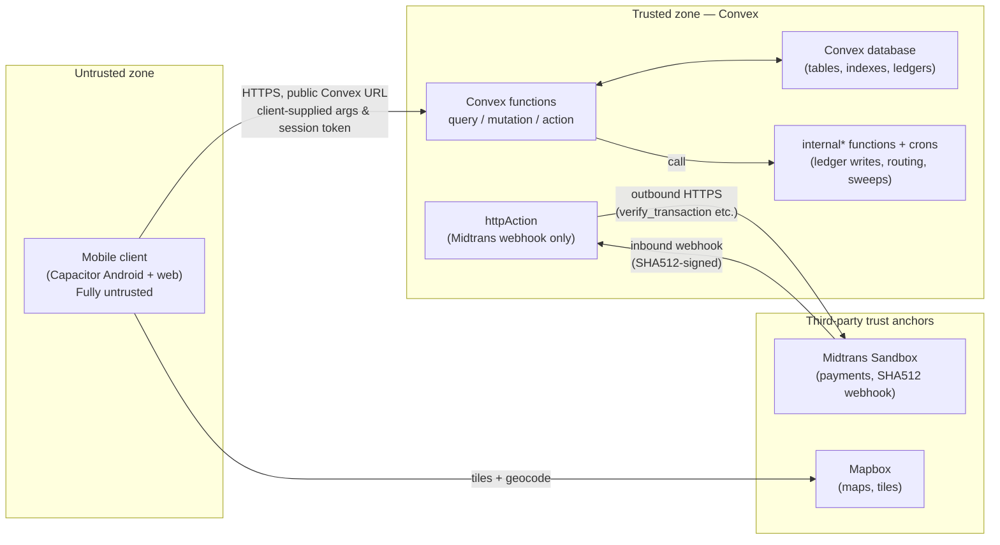
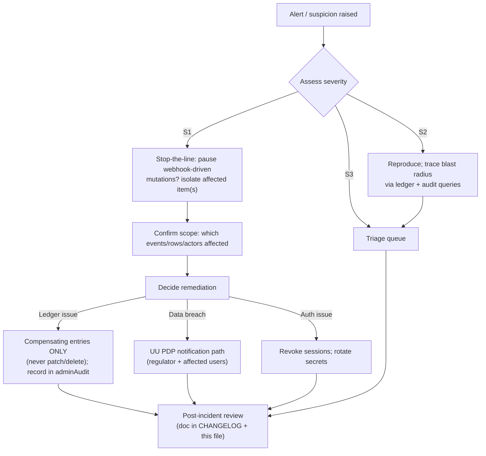

# Cirquo Security — Threat Model & Security Posture

| | |
|---|---|
| **Doc type** | Security architecture & threat model |
| **Status** | Draft v1.0 |
| **Last updated** | 2026-08-29 |
| **Owner** | Platform engineering |
| **Audience** | All engineers, judges, reviewers |

This document is the security backbone of the platform. It states what we protect, in what order, against whom, and how. Every control listed here is either **already implemented** (✅) or **planned and must land before the milestone it gates** (📋). Honesty about that distinction is a feature of this document, not a gap in it.

Unless a section explicitly says otherwise, the status labels in the detailed
threat tables are **target hardening priorities**, not a generated release
status. The implementation snapshot is maintained in §21 and source remains
authoritative.

> **Current posture — 2026-08-29:** session authentication, server-side role
> guards, Merchant verification checks, Material Flow Ledger writes, Midtrans
> Sandbox code, pickup/recovery/routing guards, and Processor intake/outcome
> guards exist. Sections marked as future hardening remain design work; see
> [Section 21](#21-current-security-posture-honest),
> [IMPLEMENTATION_STATUS.md](../project/IMPLEMENTATION_STATUS.md), and `convex/`
> for the current scope.

---

## 1. Purpose and scope

**Cirquo** (never "CirQuo") is a circular food recovery platform for DSDC ANFORCOM 2026, operating in Indonesia (Semarang, WIB, IDR). It is **not** a food delivery app — there is no delivery; consumers collect in person. Its central claim is **Material Flow Orchestration**: every kilogram of surplus food is tracked from merchant listing to a final outcome (`Rescued`, `Recovered`, or `Residual`) through an append-only **Material Flow Ledger**.

That claim is the product. If the ledger can be silently modified, the product has no value. This is why **ledger integrity is the #1 security objective** — ranked above availability, and above even payment security.

In scope:

- The Convex backend (database, serverless functions, cron scheduler, webhook).
- The React 19 + Vite + TypeScript client, including the Capacitor 8 Android build (`com.cirquo.app`).
- The Midtrans Sandbox payment integration (QRIS preferred).
- The Mapbox integration (map rendering and geolocation).
- The UU PDP data-handling obligations that come with holding personal data.

Out of scope: physical food safety (merchant responsibility), payment-institution licensing (Cirquo never custodies funds — Midtrans settles directly to merchants), and the merchant's own IT infrastructure.

---

## 2. Security objectives (ranked)

| Rank | Objective | Why this rank | If violated |
|---|---|---|---|
| 1 | **Protect ledger integrity** | The ledger *is* the product's central claim ("Circular Food Recovery" with auditable Material Flow). A corrupt ledger destroys trust in every impact number on the platform. | Greenwashing accusation (risk IMP-03), loss of credibility, judging failure |
| 2 | **Protect personal data** | UU PDP compliance is a legal obligation (LEGAL-01); users' names, emails, phones, and locations are held across several tables. Breaches carry legal and reputational damage. | Fines, reputation damage, loss of user trust |
| 3 | **Protect payment flows** | Consumers pay via Midtrans for rescue items. Cirquo never touches card data, but the platform must not be a vector for order fraud, price tampering, or refund abuse. | Financial fraud, chargeback patterns, trust collapse |
| 4 | **Maintain availability during judging** | The demo window for DSDC ANFORCOM 2026 is small and high-stakes. A DoS or a broken auth flow during judging is a product failure. | Failed demo, lost competition outcome |
| 5 | **Uphold the fairness of impact metrics** | Because impact numbers are the platform's marketing claim (MKT-01..04), fabricated Rescue/Recovery events are an integrity issue, not just a fraud issue. | Distorted metrics, PRD-04 & IMP-03 exposure |

Ordering note: #1 and #5 overlap heavily. We keep them separate because #1 is about *technical* tamper-resistance (ledger write paths) while #5 is about *behavioral* fraud (colluding actors generating plausible-but-fake events). Both must be defended; the defense techniques differ.

---

## 3. Asset inventory

What we hold, how sensitive it is, where it lives, and what happens if it leaks.

| Asset | Description | Sensitivity | Stored where | Blast radius if compromised |
|---|---|---|---|---|
| **Material Flow Ledger events** | Append-only provenance of every gram of food (`materialFlowLedger`) | High (integrity-critical, low confidentiality) | Convex table, server-only writes | Silent corruption → product claim void; retroactive fabrication → fraud |
| **Impact snapshots** | Aggregated circularity metrics (`impactSnapshots`) | Medium | Convex table | Misleading public metrics |
| **User accounts** | Names, emails, password hashes, roles (`users`) | **High** | Convex table, bcrypt/argon2 hashes only | Credential stuffing, account takeover, UU PDP breach |
| **Sessions** | Token hashes, expiry (`sessions`) | High | Convex table, hashes only | Session hijacking |
| **Merchant & processor records** | Business identity, address, **geo coordinates**, capacity, operating hours (`merchants`, `processors`) | High (geo = personal-adjacent data under UU PDP) | Convex table | Stalking/physical-risk exposure, competitive scraping |
| **Orders & payments** | Order totals, fee split, pickup codes, payment references (`orders`, `payments`) | High | Convex table (Midtrans refs only — no PAN/CVV ever) | Order fraud, refund abuse |
| **Pickup codes** | 6-digit one-time handover codes | High (short-lived) | Convex table; owned paid detail only | Theft of food, fraud |
| **Recovery batches** | Routing offers, processor-measured weights (`recoveryBatches`) | Medium | Convex table | Faked recovery metrics |
| **Notifications & disputes** | User-generated messages, dispute claims | Medium | Convex table | Harassment, UU PDP breach |
| **Midtrans server key / Convex deployment key** | API secrets | **Critical** | **Convex env vars only — never `VITE_`** | Full payment/webhook compromise |
| **Client bundle** | Everything under `VITE_` | Public by design | Ships in APK and web bundle | Expected — never put secrets here |

---

## 4. Trust boundaries



**The client is entirely untrusted.** It is a compiled bundle distributed to anyone who installs the APK; its behavior can be modified by decompiling, by an intercepting proxy during development, or by a scripted attacker who never opens the app at all. Therefore:

1. **Every non-internal Convex function is callable by any client that knows its name.** Authorization cannot live in the frontend; it must be enforced inside every function (see `PERMISSIONS.md`).
2. **No secret may be compiled into the client.** The `VITE_` prefix means "public". Current public variables are `VITE_CONVEX_URL`, `VITE_MAPBOX_ACCESS_TOKEN`, and `VITE_MIDTRANS_CLIENT_KEY`; the Midtrans server key never uses `VITE_`.
3. **The client may propose values; the server disposes of them.** Prices, weights, quantities, statuses, and pickup codes are all re-derived or re-validated server-side.
4. **The webhook trust anchor is the SHA512 signature**, not the network address of the caller.

---

## 5. STRIDE analysis

Analyzed per component. `C` = confidentiality, `I` = integrity, `A` = availability.

### 5.1 Client application (React / Capacitor)

| STRIDE | Threat | Vector | Impact | Mitigation | Status |
|---|---|---|---|---|---|
| Spoofing | Impersonating a user by replaying a stolen token | XSS reading localStorage; shoulder-surfing token; leaked backup | Account takeover | Session token hashes server-side; short-lived sessions; HttpOnly not available in localStorage, mitigated by CSP + no HTML injection sinks + Capacitor WebView hardening | 📋 M1 |
| Tampering | Modifying client to send forged prices/weights/statuses | Decompile APK / proxy requests | Fake orders, inflated metrics | All business values re-validated server-side; price floor/ceiling enforced in mutation | 📋 M1 |
| Repudiation | Merchant denies accepting an offer; processor denies measuring intake | Disputes | Trust collapse | Every state change writes a ledger event; both parties' actions are auditable | 📋 M1 |
| Information disclosure | Scraping all merchant locations / item listings | Public map API + JSON responses | Stalking risk, competitive data | Rate limiting on list queries; only needed fields returned; per-role scoping | 📋 M1 |
| Denial of service | Hammering queries / mutations | Cheap scripted calls to Convex | App unusable during judging | Convex autoscaling; rate limits (Section 10); judged-risk accepted for MVP | 📋 M1 |
| Elevation of privilege | Client sets `role: admin` in registration args | Mass assignment | Full platform compromise | Whitelisted arg extraction; server-set role; AUTH-02 | 📋 M1 |

### 5.2 Convex functions (query/mutation/action layer)

| STRIDE | Threat | Vector | Impact | Mitigation | Status |
|---|---|---|---|---|---|
| Spoofing | Calling a function as another user | Forged session token, replay | Impersonation | `requireAuth` at top of every handler; token verified against `sessions` table | 📋 M1 |
| Tampering | Passing non-validated args | Direct function call from script | Type confusion, logic bypass | Convex `v.*` validators on every function; business-rule assertions in handler | 📋 M1 |
| Repudiation | No audit trail for admin actions | Admin mutates without trace | Cannot attribute damage | `adminAudit` entries + ledger events on every admin mutation | 📋 M1 |
| Information disclosure | Querying rows the caller may not see | IDOR via leaked document ID | Cross-account data leak | Ownership predicates inside every query; per-role scoping (PERMISSIONS §6) | 📋 M1 |
| Denial of service | Long-running/reactive queries | Crafted heavy queries | Cost spike / latency | Indexed queries only; pagination; list-query rate limits | 📋 M1 |
| Elevation of privilege | Calling `internal*` functions from client | They are not exposed, but a name guess must still fail | — | Convex enforces server-only invocation; defense in depth: internal functions still assert state | ✅ Convex platform |

### 5.3 Material Flow Ledger

| STRIDE | Threat | Vector | Impact | Mitigation | Status |
|---|---|---|---|---|---|
| Spoofing | Fabricated ledger events (fake rescue/recovery) | Colluding merchant-processor pair; self-dealing merchant | Distorted impact metrics (IMP-03) | Event requires real order/recoveryBatch refs; business-rule assertions on transition legality | 📋 M1 |
| Tampering | Patching/deleting a ledger event | Buggy dev code, malicious admin | Ledger integrity destroyed | **No patch/delete code path exists**; CI grep guard; compensating-entry discipline | 📋 M1 + ✅ CI guard planned |
| Repudiation | Disputing a documented outcome | Disagreement over measured weight | Disputes | Processor-measured weight only settable by processor; ledger records actor + role per event | 📋 M1 |
| Information disclosure | Reading events outside your scope | IDOR on ledger query | Business intelligence leak | Ledger read query scopes by role and ownership server-side | 📋 M1 |
| Denial of service | Flooding ledger writes | Cheap mutations | Cost / spam | Rate limiting; no client-initiated ledger writes exist at all | 📋 M1 |
| Elevation of privilege | A non-processor writes `acceptedWeightGrams` | Client calls processor mutation | Fabricated recovery | `requireVerifiedProcessor` + role-typed mutations | 📋 M1 |

### 5.4 Payment webhook (httpAction)

| STRIDE | Threat | Vector | Impact | Mitigation | Status |
|---|---|---|---|---|---|
| Spoofing | Forged "payment succeeded" notification | Unauthenticated POST to webhook URL | Free food, fake paid orders | SHA512 signature over `order_id+status_code+gross_amount+ServerKey`; amount verified against the order | 📋 M1 |
| Tampering | Replay of a captured webhook body | Network replay | Double-processing | Idempotency: webhook handler is a no-op for already-finalized `payments` rows | 📋 M1 |
| Repudiation | Midtrans says sent, we say never received | Loss, not attack | Order stuck | Manual reconciliation: admin can query Midtrans verify endpoint using server-side key | 📋 M1 |
| Information disclosure | Webhook body logged raw | Over-logging | Customer payment details leak | No raw webhook payload persisted; `rawPayload` field only for disputes, sanitized | 📋 M1 |
| Denial of service | Webhook flood | Anyone can POST | Unneeded compute | Handler short-circuits on malformed signature before any DB work | 📋 M1 |
| Elevation of privilege | Webhook sets arbitrary statuses | Trusting notification without signature | Order/payment confusion | Webhook only transitions via `status_code` mapping, inside a single mutation with ledger event | 📋 M1 |

### 5.5 Admin surface

| STRIDE | Threat | Vector | Impact | Mitigation | Status |
|---|---|---|---|---|---|
| Spoofing | Non-admin calls admin functions | Client crafts admin call | Full compromise | `requireAdmin` — role is server-set, never client-set (AUTH-02) | 📋 M1 |
| Tampering | Admin overrides without audit | Direct mutation | Unattributed damage | Every admin mutation writes an admin audit record + ledger event | 📋 M1 |
| Repudiation | Admin denies an override (e.g. pickup window extension) | No record | Disputes | Ledger `metadata.adminNote` + actor recorded | 📋 M1 |
| Information disclosure | Admin queries all user data casually | Broad queries | Privacy erosion | Admin functions are scoped and logged; retention applies | 📋 M1 |
| Denial of service | Admin runbook not known; no off-hours coverage | Ops gap | Prolonged outage | Runbook in Section 18; single-operator alert channel | 📋 Phase 2 |
| Elevation of privilege | Compromised admin account | Phishing/credential stuffing | Everything | Long random passwords, MFA deferred to Phase 2, session revocation | 📋 Phase 2 (MFA) |

---

## 6. OWASP Top 10 (2021) mapping

How each OWASP item applies to a Convex/React application specifically, and what Cirquo does about it.

| # | OWASP item | How it applies to Convex/React | Cirquo mitigation | Status |
|---|---|---|---|---|
| A01 | Broken Access Control | The #1 risk here: every non-internal function is publicly callable by name | Per-function authorization guards; ownership checks; per-role visibility scoping; `internal*` boundary | 📋 M1 |
| A02 | Cryptographic Failures | Transport is HTTPS (Convex handles TLS); secrets in client bundle; weak token/PRNG | No secrets under `VITE_`; token hashes server-side; `crypto.getRandomValues` / Convex env-random token generation; bcrypt/argon2 | 📋 M1 |
| A03 | Injection | **SQL is impossible** (no SQL in Convex) — but NoSQL-style *logic injection* via unvalidated args (e.g. passing an object where a field is expected, exploiting `$set`-like semantics, or leaking filters into queries) is still real | Convex `v.*` validators on every arg; handler-level assertions; no dynamic query building from client strings; strict types | 📋 M1 |
| A04 | Insecure Design | Trusting the client for prices/weights/roles; trusting webhook sender IP | Server-side re-validation of every business value; SHA512 webhook signature; role and `verificationStatus` never client-settable | 📋 M1 |
| A05 | Security Misconfiguration | Default settings, debug flags, over-broad CORS, verbose errors | Convex defaults; `ConvexError` messages designed to be user-safe (no stack traces to client); no CORS surface (Convex handles); production env separate from dev | 📋 M1 |
| A06 | Vulnerable and Outdated Components | Vite 8 / React 19 / Bun / Convex 1.43 ecosystem moves fast | Lockfile committed; `bun audit` in CI; explicit version bumps reviewed; supply-chain policy in Section 12 | 📋 Phase 2 (CI audit) |
| A07 | Identification and Authentication Failures | Session/auth foundations exist; reset, refresh, and further hardening remain | Opaque session tokens, hashed storage, role guards; target hardening per AUTH.md | 🚧 M1 foundation |
| A08 | Software and Data Integrity Failures | Unverified webhook payloads; client trusting itself | SHA512 webhook verification + idempotency; ledger integrity checks; CI grep guard | 📋 M1 |
| A09 | Security Logging and Monitoring Failures | No logs today | Auth event audit table; admin action audit; ledger as the impact audit trail; alert on webhook signature failures | 📋 M1 (minimal) / Phase 2 (alerting) |
| A10 | Server-Side Request Forgery (SSRF) | Minimal surface — Convex functions make outbound calls only to fixed Midtrans endpoints | URL allowlist (Midtrans sandbox base URL only); no user-controlled URLs ever fetched server-side | 📋 M1 |

---

## 7. Domain-specific abuse cases

These are the attacks that actually threaten *this* product. A generic checklist does not cover them.

| # | Abuse case | Attack sketch | Impact if successful | Detection & mitigation | Status |
|---|---|---|---|---|---|
| 1 | **Fake merchant listing** | Attacker registers a merchant, passes verification (fake identity), lists "Rescue Items" that don't exist; consumers pay and travel to collect nothing | Consumer fraud, food waste of trust, platform liability | Verification requires business-type matching + manual/photo check; consumer disputes route to refund; repeat-pattern flagging (many items, zero confirmations) | 📋 M1 (basic) / Phase 2 (scoring) |
| 2 | **Pickup-code brute force** | Attacker at the shop tries codes until one matches to grab the item | Stolen food, "rescued" event falsely closed, consumer loses order | 6-digit codes are verified only for a paid order owned by the Merchant; M4 must rate-limit failed attempts and close the order after one successful match | 📋 M4 |
| 3 | **Merchant inflating declared weight** | Merchant lists `weightPerItemGrams` 2× reality; system derives `rescuedWeightGrams` and recovery offers from it | Inflated circularity metrics (PRD-04, IMP-03) | `offeredWeightGrams` is merchant-declared and *explicitly* less trusted; processor-measured `acceptedWeightGrams` is the authoritative number for recovery; weight-conservation reconciliation query flags discrepancies | 📋 M1 |
| 4 | **Processor over-reporting recovered output** | Processor logs `outputWeightGrams` > plausible conversion from `acceptedWeightGrams` | Fabricated recovery impact | `outputWeightGrams` asserted ≤ a conversion envelope per facility type; ledger records both sides of the batch; completeness checks compare sum of outcomes to intake | 📋 M1 |
| 5 | **Consumer claims non-delivery for refund** | Consumer received the food but disputes to get money back | Refund fraud, merchant distrust | Midtrans refund flow goes through merchant/Midtrans, not Cirquo; dispute requires evidence; pickup code verified-close is the strong anti-fraud record (code matched + in-window) | 📋 M1 |
| 6 | **Merchant marks pickup complete without handing over food** | Merchant closes the order to keep the food (or to record impact) before the consumer collects | Theft, fraud, invalid "Rescued" events | Pickup requires code match (consumer-controlled secret) — merchant alone cannot close; admin override is audited | 📋 M1 |
| 7 | **Scraping merchant locations** | Scripted collection of all `latitude`/`longitude` for stalking or competitive data | UU PDP violation, physical risk to small merchants | Coarse-grained grid serving for map (rounded coordinates) unless a rescue item is active; rate limits on list queries; only item-adjacent fields exposed | 📋 M1 |
| 8 | **Reservation hoarding** | Bot reserves all stock of the cheapest items, holds 15 minutes, never pays | Denies stock to real consumers (CON-01..09 fail) | Quantity decremented at reservation → hoarder *does* block stock; mitigation: per-user reservation caps, rate limit on `reserveItem`, hold expiry releases automatically via cron, repeat-offender flags | 📋 M1 |
| 9 | **Self-dealing merchant** | Merchant (or a second account) reserves their own listing to fabricate rescue volume | Fabricated rescue metrics (IMP-03) | Server-side check: `orders.userId ≠ surplusItems.merchantId`; second-account pattern detection (same device/IP) deferred but documented | 📋 M1 (direct check) / Phase 2 (pattern) |
| 10 | **Colluding merchant–processor pair** | Merchant lists phantom items with zero real consumers; processor "accepts" and logs intake/output; events look perfectly legal | Fabricated recovery impact, the hardest to catch | Ledger cross-checks: a recovered batch without any consumer orders is suspicious; processor's measured intake should trace to real `surplusItems`; admin reconciliation query compares per-merchant/per-processor flow vs. order reality | 📋 M1 (queries) / Phase 2 (scoring) |

---

## 8. Ledger integrity threats

> Rows below preserve the target threat model. The M1–M5 source already has the
> append-only helper and its domain write paths; M6–M7 controls remain planned. See
> [IMPLEMENTATION_STATUS.md](../project/IMPLEMENTATION_STATUS.md).

The ledger is append-only and immutable in practice. Threats target the *paths into and out of it*.

| # | Threat | Mechanism | Mitigation | Status |
|---|---|---|---|---|
| L-1 | Direct client write | A mutation accepting arbitrary `eventType` + `weightDeltaGrams` from the client | **No client-facing ledger mutation exists.** Ledger writes happen only inside domain mutations (`reserve`, `pickup`, `recover`, …) via `recordLedgerEvent(ctx, …)` | 📋 M1 |
| L-2 | Patch/delete of an event | A developer "fixing" a bad ledger row | No patch/delete code path; **CI grep guard**: any occurrence of `db.patch('materialFlowLedger'` or `db.delete('materialFlowLedger'` fails the build; corrections are compensating entries (new event with inverse delta + `metadata.correctionOf`) | 📋 CI guard |
| L-3 | Partial state (event written, domain state not, or vice versa) | Crash between two writes — risk TECH-04 | Convex mutations are transactional: domain change + ledger event land or fail together; `recordLedgerEvent` is called inside the same mutation, never after | 📋 M1 |
| L-4 | Weight non-conservation | Deltas don't sum to initial quantity | Admin reconciliation query: `sum(ledger deltas per item) == initialQuantity`, and `Rescued + Recovered + Residual == initialQuantity` per item; alert on mismatch | 📋 M1 |
| L-5 | Double-counting an outcome | Item closed as both Rescued and Recovered | State machine: terminal states are terminal; transitions validated per table in PERMISSIONS §9 | 📋 M1 |
| L-6 | Event without actor attribution | Rows with null actor | `actorId` + `actorRole` mandatory for all but system events (crons use `actorRole: 'system'`) | 📋 M1 |
| L-7 | Compensating entry abused to launder a mistake | Correction entries hide a real error | `metadata.correctionOf` references the original event; admin audit includes correction rationale | 📋 M1 |

**Weight-conservation check (admin query sketch):**

```ts
// admin.query — planned
export const checkLedgerConservation = internalQuery({
  handler: async (ctx) => {
    const items = await ctx.db.query('surplusItems').collect();
    const anomalies = [];
    for (const item of items) {
      const events = await ctx.db
        .query('materialFlowLedger')
        .withIndex('by_surplusItem', (q) => q.eq('surplusItemId', item._id))
        .collect();
      const net = events.reduce((s, e) => s + (e.weightDeltaGrams ?? 0), 0);
      if (net !== item.initialQuantity) {
        anomalies.push({ itemId: item._id, declared: item.initialQuantity, ledgerNet: net });
      }
    }
    return anomalies;
  },
});
```

---

## 9. Input validation strategy (three layers)

Why three layers, not one:

| Layer | Where | Purpose | What it catches | Status |
|---|---|---|---|---|
| **1. Zod (client)** | React Hook Form schemas | UX: instant feedback, correct types before the network | Typos, wrong types, empty required fields | ✅ exists for form UX — no auth forms yet |
| **2. Convex `v.*` validators** | Every function's `args` | The trust boundary: rejects malformed input before the handler runs | Wrong types, missing fields, unexpected fields, oversized strings | 📋 M1 |
| **3. Business-rule assertions (handler)** | Inside each mutation/query, after `requireAuth` | Semantics that validators can't express | Price within `[floorPrice, originalPrice)`, quantity > 0, pickup code format + match, state-transition legality, ownership, verification state | 📋 M1 |

All three are needed because none is sufficient alone:

- Zod alone is client-side — a scripted caller bypasses it entirely.
- Validators alone check *shape*, not *meaning* — `currentPrice: 1_000_000` is a valid number but an invalid price for a 5,000 IDR item.
- Assertions alone would run on garbage input (e.g. a 10 MB string) and waste compute before failing.

Example of the boundary contract (planned):

```ts
export const reserveItem = mutation({
  args: {
    surplusItemId: v.id('surplusItems'),
    quantity: v.number(), // validated shape
  },
  handler: async (ctx, args) => {
    const user = await requireAuth(ctx);
    // ...ownership-irrelevant here; instead: legality assertions
    // args.quantity > 0, <= remainingQuantity, pickup window not passed, etc.
  },
});
```

---

## 10. Rate limiting

Convex has no built-in per-user rate limiter; we implement one as a small helper backed by a `rateLimits` collection (or an in-memory approach where acceptable) and apply it at the top of hot handlers. This is honest MVP-level protection — it stops scripted abuse, not a determined distributed attacker.

| Operation | Window | Limit per window | Reason / notes | Status |
|---|---|---|---|---|
| `auth.login` | 15 min | 5 failures / account | Brute-force protection; beyond that, lockout (AUTH.md §16) | 📋 M1 |
| `auth.register` | 1 hour | 5 / IP or device | Mass account creation (abuse case 9, hoarding) | 📋 M1 |
| `auth.requestPasswordReset` | 1 hour | 3 / account | Reset-token flooding; also enumeration-safe (same response regardless) | 📋 M1 |
| `orders.reserveItem` | 1 min | 5 / user | Reservation hoarding (abuse case 8); reduces bot-driven stock denial | 📋 M1 |
| `orders.verifyPickupCode` | 1 min | 10 / order | Pickup-code brute force (abuse case 2); codes are high-entropy so this is defense-in-depth | 📋 M1 |
| `payments.webhook` (`httpAction`) | — | Signature-check first, no DB work on failure | Webhook flood: reject before touching state; idempotent success path | 📋 M1 |
| Map/list queries (`surplusItems.searchByLocation`) | 1 min | 60 / user | Scraping merchant locations (abuse case 7) | 📋 M1 |
| All other mutations | 1 min | 60 / user | General sanity envelope | 📋 M1 |

---

## 11. Secrets management

Only one env var exists today: `VITE_CONVEX_URL`. That is deliberate and correct — it is public.

**Anything prefixed `VITE_` is embedded in the client bundle and is public.** The rule is absolute: no secret ever wears the `VITE_` prefix. Secrets live in **Convex environment variables** (or `npx convex env set`), readable only inside server-side functions.

| Must never be `VITE_` | What happens if leaked |
|---|---|
| Midtrans **Server Key** | Attacker can verify/fraud-check arbitrary transactions, access merchant settlement data |
| Midtrans Client Key | Lower risk, but should still not ship in a distributable bundle |
| Convex deployment/admin key | Full backend compromise |
| Any webhook shared secret | Forged webhook notifications |
| Password-hashing salt pepper (if any) | Weakened hash resistance |
| Mapbox token (highly restricted or server-proxied) | Quota theft, mapping abuse |

`VITE_`-safe today: `VITE_CONVEX_URL` only. Midtrans **Client Key** may become acceptable for the sandbox MVP **only if** we conclude the sandbox key exposes nothing; the default position is to keep even that server-side and proxy through Convex actions.

---

## 12. Dependency & supply-chain hygiene

| Measure | Detail | Status |
|---|---|---|
| Lockfile committed | `bun.lock` in repo; installs are reproducible | ✅ |
| `bun audit` | Run in CI before merge; fail on known-vulnerable direct deps | 📋 Phase 2 CI |
| Version policy | Pinned exact versions for runtime deps; review major bumps (Vite 8, React 19, Convex 1.43 already on recent majors) | ✅ (pinned) |
| Minimal dependency surface | Tailwind v4, shadcn/ui, React Router v7, RHF + Zod, Sonner, Mapbox, Midtrans SDK, Capacitor 8 — no random utility packages | ✅ |
| Registry trust | Only the official npm registry / Bun registry; no git-installed packages | ✅ |
| Supply-chain notes | Convex functions execute in Convex's sandbox — the backend dependency surface is small and versioned by the framework itself | ✅ |
| Secret scanning | Pre-commit scan for `sk-` / `server-key` patterns | 📋 Phase 2 |

---

## 13. Payment security

**Design principle: Cirquo never touches card data, never holds funds, and never trusts the client about payment.**

| # | Rule | Rationale |
|---|---|---|
| P-1 | **Midtrans hosted/QRIS flow** | The consumer completes payment inside Midtrans's own UI/QRIS. Cirquo never sees a PAN, CVV, or card data — out of PCI scope and out of UU PDP's highest-sensitivity tier. |
| P-2 | **Webhook is the source of truth** | Payment success is derived from the **Midtrans webhook**, never from a client report. The client may say "I paid" — the platform ignores it until the signed webhook lands. |
| P-3 | **SHA512 signature verification** | `httpAction` verifies `sha512(order_id + status_code + gross_amount + ServerKey)` against the received `signature_key` before touching any state (risk TECH-02). ServerKey is a Convex env var. |
| P-4 | **Amount verification** | The `gross_amount` in the webhook is compared against the order's expected `totalPrice`. A webhook that doesn't match the order amount is rejected. |
| P-5 | **Idempotency** | The webhook handler no-ops if the `payments` row is already finalized; concurrent or replayed notifications cannot double-transition an order. |
| P-6 | **Transactional state change + ledger** | Webhook success updates `orders.status`, inserts `payments` row, and records the ledger event (e.g. `reserved → payment_confirmed`) in a single mutation. |
| P-7 | **No refund power in the client** | Refunds flow through Midtrans dashboard / merchant, not through any client-callable Cirquo function. |
| P-8 | **Sandbox only** | Midtrans Sandbox for the competition; no real keys, ever. |
| P-9 | **Fee split derived server-side** | `platformFeeAmount` computed from `totalPrice` in the mutation, not accepted from the client. |

---

## 14. Geolocation & location privacy

Consumer locations are needed to find nearby items; merchant/processor locations power routing. This is personal data under UU PDP.

| Concern | Decision |
|---|---|
| What is stored | Merchant/processor coordinates (public-facing business data, but still sensitive — a home business exposes a home address). Consumers: **no coordinates stored** — only ephemeral query radius. |
| Scraping defence | Map queries return coarse-grained markers unless an item is active; list endpoints rate-limited (abuse case 7). |
| Consent | Registration copy states location data use; permission prompt in Capacitor must be truthful and contextual (`onAllow` on map use). |
| TECH-07 (permission denial) | App degrades gracefully: manual city/radius selection works without geolocation permission. |
| Retention | Business coordinates kept while the account is active; deleted on account deletion (Section 16.6). |

---

## 15. File & image upload risks

The MVP has **no file uploads** (merchant verification is manual by design). When uploads arrive, the rules are pre-registered here:

| Risk | Mitigation (planned, Phase 2) |
|---|---|
| Malicious file execution | Serve uploads from Convex Files / a dedicated object store; never from app origin; disallow HTML/SVG; enforce content-type + magic-byte checks |
| Image bombs / decompression bombs | Size and dimension limits at upload; re-encode server-side |
| Abuse of the object store | Authenticated upload paths only; per-user quotas; signed uploads |
| Photo verification fraud | Verification photos (business façade, food) accepted only via authenticated, metered endpoints |

---

## 16. UU PDP compliance

Undang-Undang Perlindungan Data Pribadi (UU No. 27/2022) is the governing law. GDPR principles inform the design but the obligations are UU PDP's (LEGAL-01).

### 16.1 Lawful basis

| Data category | Basis under UU PDP | Notes |
|---|---|---|
| Account (name, email, phone, password hash) | Contract performance / consent at registration | Consent is explicit, granular, revocable |
| Location (business coordinates) | Consent + legitimate business need | Separate consent line; optional for consumers |
| Order/payment history | Contract performance | Needed to operate the service and settle payments |
| Ledger events | Legitimate interest in auditable provenance | Core product claim; the ledger is the record of truth |

### 16.2 Data minimisation

- Only fields required to operate are collected. No birth dates, no KTP/ID numbers, no financial data beyond what Midtrans returns.
- Client bundles expose no personal data beyond the logged-in user's own.

### 16.3 Consent at registration

Registration copy states: what data is collected, why, that it is shared with Midtrans for payment settlement and Mapbox for maps, and how to exercise rights. Checkbox is separate from "create account".

### 16.4 Retention schedule

| Data category | Retention | Rationale |
|---|---|---|
| Password hashes | Life of account + 30 days after deletion | Security record; can be purged on deletion |
| Session records | Until expiry + 30 days | Operational |
| Order + payment records | 5 years | Indonesian commercial/tax record-keeping norms |
| Pickup codes | 30 days after order closes | Dispute evidence window |
| Ledger events | **Indefinite, append-only** | Product claim; see 16.6 for the privacy resolution |
| Impact snapshots | Indefinite | Aggregates, not personal data |
| Notifications/disputes | 2 years after last activity | Dispute resolution |
| Audit logs | 5 years | Incident response |

### 16.5 Subject rights

| Right | Implementation |
|---|---|
| Access | A user-facing "download my data" query (name, orders, payments, events referencing them) |
| Correction | Update profile mutations; merchant can correct listing data (subject to state-machine rules) |
| Deletion | Account deletion mutation; hard-deletes `users`, `sessions`, `merchants`, `processors`, personal fields in `orders` |
| Objection/restriction | Honored via deletion path for MVP; documented for Phase 2 |

### 16.6 Deletion vs. append-only ledger

**The problem:** a user asks for deletion (UU PDP right), but their `actorId` sits inside thousands of immutable ledger events. Patching or deleting events would violate the ledger's integrity guarantee (Section 8, L-2).

**The resolution: pseudonymise the actor reference, preserve the event.**

```ts
// planned mutation — admin-only, recorded in adminAudit
// For each ledger event with actorId == target:
//   write a NEW compensating-style reference event? No —
//   instead: replace actorId with a deterministic pseudonym and
//   zero out any personal metadata fields.
await ctx.db.patch(event._id, {
  actorId: pseudonym,      // e.g. "user:deleted:<sha256(userId + salt)>"
  actorRole: event.actorRole,
  metadata: { ...event.metadata, personalDataPurged: true },
});
```

**Why this is correct:** UU PDP's deletion right is about *personal data*, and a pseudonymised ID is no longer personal data attributable to the natural person, so no legal obligation is breached. The ledger keeps its append-only *semantics* — the sequence of weight deltas and event types is untouched, so conservation checks and impact numbers remain valid, and the integrity claim is preserved. The hash salt is a Convex env var, kept secret so the pseudonym is not reversible by a leaked DB.

An alternative — leaving the actorId in place — fails deletion rights. A full delete of events fails the product. Pseudonymisation is the honest middle path and it is documented as such, because future judges will ask exactly this question.

### 16.7 DPO / contact

For the competition, a named contact person (the team lead) and a published privacy notice line in the app's settings screen. Phase 2: formal DPO role if scaling.

---

## 17. GDPR-informed practices (future international partners)

GDPR is not directly applicable (Indonesian platform, Indonesian users), but its principles are cheap to design in now and expensive to retrofit:

| Practice | Status |
|---|---|
| Privacy notice at registration (layered: summary + detail) | 📋 M1 |
| Data Processing Agreement template for merchant/processor partners | 📋 Phase 2 |
| Data Protection Impact Assessment for the location feature | 📋 Phase 2 |
| Cross-border transfer analysis if ever hosting/using non-Indonesia processors | 📋 Phase 2 |
| Right-to-be-forgotten parity with 16.6 (design already satisfies GDPR's Article 17 reasoning) | ✅ by design |

---

## 18. Incident response

### 18.1 Severity levels

| Severity | Definition | Example | Response SLA |
|---|---|---|---|
| S1 — Critical | Ledger integrity compromised, or confirmed personal-data breach, or payment fraud at scale | `db.patch` on ledger found in prod; leaked `users` export | Immediate; stop-the-line; notify stakeholders within 1 hour |
| S2 — High | Auth bypass or privilege escalation possible; wide data exposure | Forgotten `requireAdmin` on a mutation | Fix within 24h; rotate affected tokens |
| S3 — Medium | Isolated abuse or data exposure; no systemic flaw | One account stuffing pickup codes | Fix within one sprint; monitor |
| S4 — Low | Hygiene issues, log noise, minor misconfig | Verbose error in logs | Fix opportunistically |

### 18.2 Runbook flow



### 18.3 Response steps (S1)

1. **Contain** — stop the affected flow: Convex deployment pause of the specific function, revoke sessions if auth-related, rotate the Midtrans server key if payment-related.
2. **Confirm scope** — query ledger/adminAudit for affected events; snapshot affected tables.
3. **Notify** — team lead → platform partners → affected users (UU PDP breach notification) → regulator if required by law.
4. **Remediate** — compensating ledger entries where needed (never patches), key rotation, patch deployed behind review.
5. **Learn** — post-incident review written into `CHANGELOG.md` and reflected as new mitigations in this document.

---

## 19. Security checklist gating MVP launch

Every item must be **done and demonstrable**, not merely claimed.

- [ ] 📋 Custom session auth implemented (`AUTH.md`) — register, login, logout, password reset, change password
- [ ] 📋 `requireAuth` + role guards + ownership guards on **every** non-internal function (`PERMISSIONS.md`)
- [ ] 📋 Convex `v.*` validators on every function argument
- [ ] 📋 Ledger write path: `recordLedgerEvent` in every state-changing mutation; **no** patch/delete path for `materialFlowLedger`
- [ ] 📋 CI grep guard blocking `db.patch`/`db.delete` on `materialFlowLedger`
- [ ] 📋 Webhook: SHA512 signature verification + amount check + idempotency
- [ ] 📋 No secrets in client bundle (audit: `grep -r "ServerKey\|sk-" src/` is empty)
- [ ] 📋 Rate limiting on the operations in Section 10
- [ ] 📋 Role is server-set (no client-supplied `role`, no client-supplied `verificationStatus`)
- [ ] 📋 Pickup code: high entropy, rate-limited verification, single-use close
- [ ] 📋 Price enforcement: `currentPrice` clamped to `[floorPrice, originalPrice)` server-side
- [ ] 📋 Self-dealing check: order `userId ≠ item.merchantId`
- [ ] 📋 Admin account provisioning is manual (AUTH-02)
- [ ] 📋 Audit records for admin mutations
- [ ] 📋 Privacy notice at registration; consent checkboxes; UU PDP retention schedule wired to cron purge
- [ ] 📋 Account deletion path with ledger pseudonymisation (16.6)
- [ ] 📋 Error messages user-safe (no stack traces, no internal identifiers)

## 20. Security checklist gating commercial launch

Adds what MVP can consciously defer.

- [ ] 📋 MFA for admin accounts
- [ ] 📋 Hardened token transport (Capacitor secure storage / encrypted keychain; see AUTH.md §7)
- [ ] 📋 `bun audit` + secret scanning in CI
- [ ] 📋 Monitoring and alerting (webhook failure, ledger-conservation anomaly, login-failure spikes)
- [ ] 📋 Formal penetration test (or at minimum a paid bug bounty-style review) of auth + webhook paths
- [ ] 📋 Verified real Midtrans keys with the same webhook discipline rehearsed on sandbox
- [ ] 📋 Processor verification with physical/photo checks (abuse case 1 hardening)
- [ ] 📋 DPO contact and updated privacy policy review by counsel
- [ ] 📋 Backup/restore drill for the Convex database and a documented restore runbook

---

## 21. Current security posture (honest)

**What exists today:**

- ✅ Opaque session registration/login/logout and `auth.getCurrentUser`.
- ✅ Server-side session, role, ownership, and Merchant/Processor verification guards for current guarded functions.
- ✅ Material Flow Ledger table/helper, current lifecycle writes, and `bun scripts/check-ledger.ts`.
- ✅ Midtrans Sandbox transaction action plus a signature-checking webhook handler.
- ✅ Public Mapbox and Midtrans client keys are documented as `VITE_*`; `MIDTRANS_SERVER_KEY` remains server-only.

**What is still incomplete or not yet verified:**

| Item | Milestone |
|---|---|
| Rate limiting and security monitoring | Hardening |
| Password reset, change password, and session refresh | Auth hardening |
| Full function-by-function authorization/UAT audit | Ongoing |
| Midtrans dashboard registration, amount verification, and end-to-end webhook UAT | M3 completion |
| UU PDP surface (consent, retention purge, deletion/pseudonymisation) | Hardening |
| Admin surface and audit trail | M7 |

The remaining 📋 entries describe the target security posture in dependency
order. They are not evidence that a control already exists.

Known accepted risk for the competition: no MFA, no formal pentest, per-function rate limiting rather than distributed WAF-grade protection, and a single-operator alert channel. These are consciously deferred and tracked in `RISKS.md` (TECH-02, TECH-04, TECH-06, TECH-07, TECH-08).

---

## Related Documents

- [Authentication design](AUTH.md) — sessions, passwords, token storage, reset flow
- [Authorization & permissions](PERMISSIONS.md) — guards, function matrix, visibility scoping
- [Material Flow Ledger](../impact/MATERIAL_LEDGER.md) — the ledger's domain semantics and integrity model
- [Database schema](../domain/DATABASE.md) — every table referenced above
- [API reference](../api/API_AUTH.md) — auth endpoint contracts
- [Backend architecture](../architecture/BACKEND.md) — how Convex primitives fit together
- [Risks register](../business/RISKS.md) — TECH-02, TECH-04, TECH-06, TECH-07, TECH-08, LEGAL-01..04, IMP-03
- [Deployment](../engineering/DEPLOYMENT.md) — env var handling, Convex deployment workflow

---

**Built for DSDC ANFORCOM 2026**  
**Platform:** Cirquo — Closing the Loop, Saving Every Meal
