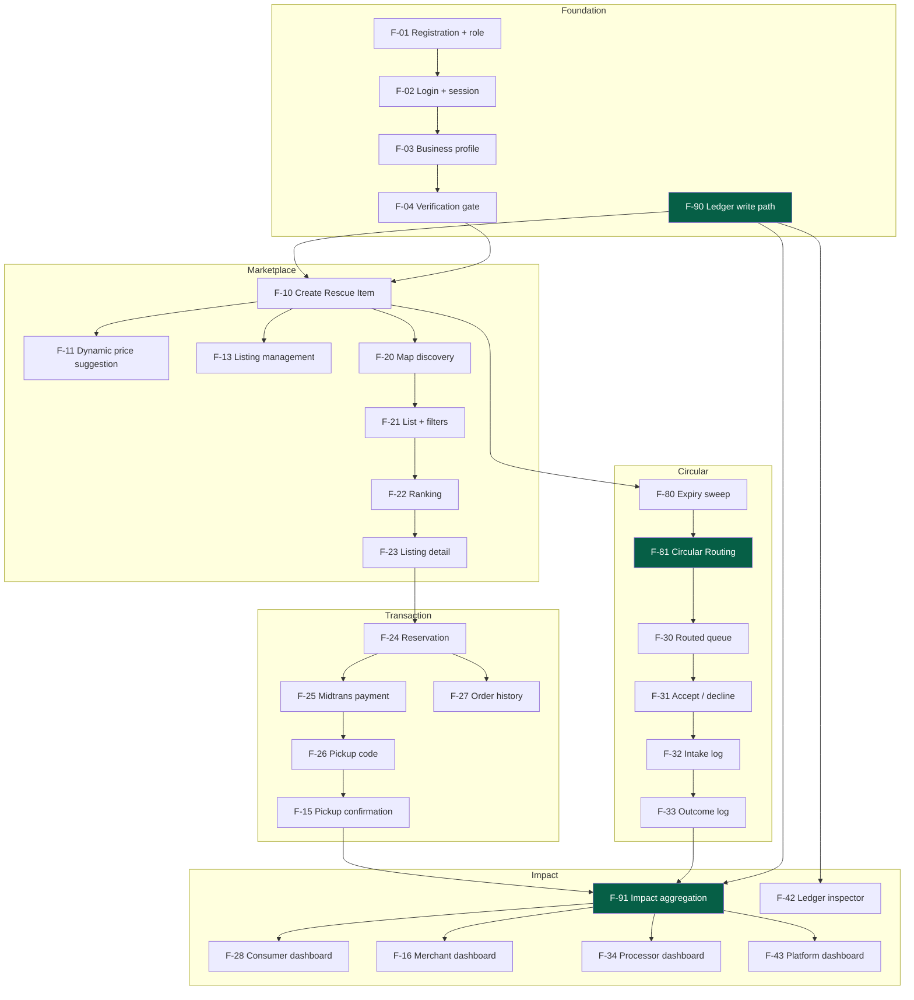

# Feature Catalogue — Cirquo

| | |
|---|---|
| **Product** | Cirquo |
| **Tagline** | Closing the Loop, Saving Every Meal. |
| **Document type** | Specification — feature catalogue |
| **Status** | Draft v1.0 — living document |
| **Owner** | Product / UX |
| **Last updated** | 2026-08-06 |
| **Source of truth for** | *What* each feature does, its acceptance criteria, and the ledger events it emits |
| **Not the source of truth for** | Schemas ([DATA_MODEL.md](../domain/DATA_MODEL.md)), API contracts ([API.md](../api/API.md)), algorithms ([ALGORITHM.md](../impact/ALGORITHM.md)) |

> Every feature below traces to a PRD requirement ID. If a feature has no PRD ref, it does not ship in Phase 1. If a PRD requirement has no feature, it is a gap — see §13.

---

## 1. How To Read This Document

**Priority** uses MoSCoW as defined in [PRD.md](../product/PRD.md):

| Symbol | Meaning | Rule |
|---|---|---|
| **M** | Must have | The demo is not credible without it |
| **S** | Should have | Ships if all M work is complete and stable |
| **C** | Could have | Explicitly deferred unless time remains |

**Status** reflects the *actual* repository state as of 2026-08-06:

| Symbol | Meaning |
|---|---|
| Implemented | Implemented and working end-to-end |
| In progress | Partially implemented — UI shell exists, logic missing |
| Planned | Planned — nothing in the codebase yet |

**Ledger events** name entries written to the [Material Flow Ledger](../impact/MATERIAL_LEDGER.md). A feature that changes material state and emits no event is a bug, not a design choice — every kilogram must be accounted for.

---

## 2. Feature Index

### Module A — Authentication & Onboarding

| ID | Feature | PRD refs | Priority | Status |
|---|---|---|---|---|
| F-01 | Registration with role selection | AUTH-01 | M | Planned |
| F-02 | Login & session management | AUTH-03 | M | Planned |
| F-03 | Merchant business profile onboarding | AUTH-05 | M | Planned |
| F-04 | Processor facility profile onboarding | AUTH-05, PRC-06 | M | Planned |
| F-05 | Admin verification gate | AUTH-04 | M | Planned |
| F-06 | Admin account provisioning (manual) | AUTH-02 | M | Planned |
| F-07 | Password reset | AUTH-06 | S | Planned |

### Module B — Merchant

| ID | Feature | PRD refs | Priority | Status |
|---|---|---|---|---|
| F-10 | Create Rescue Item | MER-01 | M | In progress |
| F-11 | Dynamic Rescue Pricing suggestion + override | MER-02, PRI-01..03 | M | Planned |
| F-12 | Edit / cancel listing before reservation | MER-03 | M | Planned |
| F-13 | Processing-only listing | MER-07 | S | Planned |
| F-14 | Merchant listing management view | MER-06 | M | In progress |
| F-15 | Pickup confirmation via code / QR | MER-04 | M | Planned |
| F-16 | Merchant dashboard & impact | MER-06, IMP-03 | M | In progress |
| F-17 | Merchant recovery visibility | MER-05, PRC-04 | S | Planned |

### Module C — Consumer

| ID | Feature | PRD refs | Priority | Status |
|---|---|---|---|---|
| F-20 | Map discovery | CON-01, MKT-01 | M | In progress |
| F-21 | List view with filters | CON-02, MKT-02 | M | In progress |
| F-22 | Listing detail screen | CON-01, CON-02 | M | Planned |
| F-23 | Reservation (locks price + quantity) | CON-03 | M | Planned |
| F-24 | Pickup code / QR display | CON-05 | M | Planned |
| F-25 | Order history + realtime status | CON-06, PAY-02 | M | In progress |
| F-26 | Cancellation within grace period | CON-08 | S | Planned |
| F-27 | Consumer impact dashboard | CON-07, IMP-03 | M | In progress |
| F-28 | Rate a pickup | CON-09 | C | Planned |

### Module D — Organic Processor

| ID | Feature | PRD refs | Priority | Status |
|---|---|---|---|---|
| F-30 | Routed batch queue | PRC-01 | M | In progress |
| F-31 | Accept / decline offer | PRC-02 | M | Planned |
| F-32 | Intake log (measured weight) | PRC-03 | M | Planned |
| F-33 | Outcome log (output + residual) | PRC-04 | M | Planned |
| F-34 | Processor dashboard | PRC-05, IMP-03 | M | In progress |
| F-35 | Capacity & accepted-material profile | PRC-06 | M | Planned |

### Module E — Admin

| ID | Feature | PRD refs | Priority | Status |
|---|---|---|---|---|
| F-40 | Account verification & suspension | ADM-01 | M | In progress |
| F-41 | Listing moderation | ADM-02 | S | Planned |
| F-42 | Material Flow Ledger inspector | ADM-03 | M | Planned |
| F-43 | Platform impact dashboard | ADM-04, IMP-03 | M | In progress |
| F-44 | Dispute resolution | ADM-05 | S | Planned |
| F-45 | Manual re-route of unroutable batch | ADM-06 | S | Planned |

### Module F — Marketplace & Discovery

| ID | Feature | PRD refs | Priority | Status |
|---|---|---|---|---|
| F-50 | Listing ranking algorithm | MKT-03 | M | Planned |
| F-51 | Dietary preference filtering | MKT-02, CON-02 | S | Planned |
| F-52 | Personalised recommendation | MKT-04 | C | Planned |

### Module G — Payments

| ID | Feature | PRD refs | Priority | Status |
|---|---|---|---|---|
| F-60 | Midtrans Sandbox checkout | CON-04, PAY-01 | M | Planned |
| F-61 | Realtime payment status | PAY-02 | M | Planned |
| F-62 | Automatic refund on cancel / expiry | PAY-03 | S | Planned |
| F-63 | Merchant payout tracking | PAY-04 | C | Planned |

### Module H — Notifications

| ID | Feature | PRD refs | Priority | Status |
|---|---|---|---|---|
| F-70 | In-app notification centre | NOT-01..05 | M | Planned |
| F-71 | Consumer reservation & pickup reminders | NOT-02 | M | Planned |
| F-72 | Merchant reservation & expiry warnings | NOT-03 | M | Planned |
| F-73 | Processor routed-item alert | NOT-04 | M | Planned |
| F-74 | Admin dispute alert | NOT-05 | S | Planned |
| F-75 | Nearby-listing alert | NOT-01 | C | Planned |

### Module I — Impact & Ledger

| ID | Feature | PRD refs | Priority | Status |
|---|---|---|---|---|
| F-80 | Material Flow Ledger write path | IMP-01 | M | Planned |
| F-81 | Impact aggregation engine | IMP-02 | M | Planned |
| F-82 | Versioned CO2e methodology | IMP-04 | S | Planned |
| F-83 | Weight conservation integrity check | IMP-01 | S | Planned |

### Module J — Scheduler & Circular Routing

| ID | Feature | PRD refs | Priority | Status |
|---|---|---|---|---|
| F-90 | Payment hold expiry sweep | CON-03, CON-04 | M | Planned |
| F-91 | Pickup window expiry sweep | MER-05 | M | Planned |
| F-92 | Circular Routing engine | MER-05, PRC-01 | M | Planned |
| F-93 | Offer TTL & retry loop | PRC-02 | M | Planned |
| F-94 | Dynamic price re-evaluation cron | PRI-01 | S | Planned |

**Totals:** 44 features — 27 Must, 12 Should, 5 Could.

---

## 3. Module A — Authentication & Onboarding

### F-01 — Registration with role selection

**PRD refs:** AUTH-01 · **Priority:** M · **Status:** Planned

**Objective** — Let a new user create an account and declare which side of the circular economy they participate in, because every downstream permission derives from that choice.

**Description**
Registration collects email, password, display name, phone, and a role choice from `consumer | merchant | processor`. Admin is deliberately absent from the selector — per AUTH-02 admin accounts are provisioned manually and can never be self-assigned. The role is written server-side from a validated enum, never copied verbatim from the request body, because mass-assignment of `role: "admin"` is the most obvious privilege escalation vector in this design (see [ROLES.md](ROLES.md) §9).

Consumers land directly in the marketplace after registration. Merchants and Processors are routed into a profile step (F-03 / F-04) and then into a `pending` verification state where they can see the app but cannot transact.

**Actors** — Prospective Consumer, Merchant, Processor

**User story** — As a new user, I want to register and pick my role, so that I get the interface and permissions that match how I use the platform.

**Acceptance criteria**
- [ ] GIVEN a valid email, password ≥ 8 chars, name, and role ∈ {consumer, merchant, processor} WHEN the user submits THEN a `users` row is created and a session is issued
- [ ] GIVEN the client posts `role: "admin"` WHEN the mutation validates input THEN the request is rejected and no row is created
- [ ] GIVEN an email already registered WHEN the user submits THEN a generic "email unavailable" error is returned that does not confirm account existence
- [ ] GIVEN role = merchant or processor WHEN registration succeeds THEN `verificationStatus` is set to `pending` and the user is redirected to the profile step
- [ ] GIVEN role = consumer WHEN registration succeeds THEN the user is redirected to `/` with full marketplace access and no verification requirement
- [ ] GIVEN any registration WHEN it succeeds THEN the password is stored only as a hash and never returned by any query

**Ledger events emitted** — none. Registration touches no material.

**Dependencies** — none (root feature)

**Edge cases**

| Case | Expected behaviour |
|---|---|
| Email differs only by case | Normalised to lowercase before the uniqueness check |
| User abandons after role selection but before profile | Account exists, `verificationStatus = pending`, resume prompt on next login |
| Consumer later wants to become a merchant | MVP: register a second account. Documented limitation, not a bug |
| Network drop mid-submit | Convex mutations are transactional — either the user exists or it does not; no partial row |

**Future improvements**
- Google / Apple OAuth to cut registration friction for Consumers
- Multi-role accounts via a `roles: string[]` migration (the schema already permits it)
- Indonesian phone-number OTP as a lightweight trust signal

---

### F-02 — Login & session management

**PRD refs:** AUTH-03 · **Priority:** M · **Status:** Planned

**Objective** — Authenticate returning users and maintain a session that survives app restarts, including inside the Capacitor Android shell.

**Description**
Email + password login issues an opaque session token persisted in a `sessions` table with an expiry. The token is stored client-side and attached to every Convex function call; every mutation resolves it to a user before doing anything else. Sessions are long-lived (30 days) because both a competition demo and a real Indonesian consumer dislike re-authenticating on a phone.

Route protection is a two-layer arrangement: React Router guards redirect unauthenticated users away from role route groups, and every Convex function independently re-checks. The router guard is a UX convenience; the server check is the actual security boundary.

**Actors** — All roles

**User story** — As a returning user, I want to stay logged in, so that I can rescue food without re-entering credentials every time I open the app.

**Acceptance criteria**
- [ ] GIVEN correct credentials WHEN the user logs in THEN a session token is issued and the user lands on their role's home route
- [ ] GIVEN incorrect credentials WHEN the user logs in THEN a generic error is shown and the attempt is rate-limited after 5 failures in 15 minutes
- [ ] GIVEN a valid session WHEN the app is reopened THEN the user is restored without re-entering credentials
- [ ] GIVEN an expired or revoked session WHEN any Convex function is called THEN it throws `UNAUTHENTICATED` and the client clears local state
- [ ] GIVEN a logged-in Consumer WHEN they navigate to `/admin` THEN the router redirects and the underlying admin queries still refuse to answer
- [ ] GIVEN logout WHEN triggered THEN the session row is deleted server-side, not merely cleared from local storage

**Ledger events emitted** — none

**Dependencies** — F-01

**Edge cases**

| Case | Expected behaviour |
|---|---|
| Same account on phone + laptop | Both sessions valid; independent rows |
| Session expires while a payment is in flight | The Midtrans webhook is server-to-server and completes regardless; the user re-logs in to see the result |
| Clock skew on device | Expiry is evaluated server-side only |
| Capacitor WebView clears storage | User re-authenticates; no data loss since state lives in Convex |

**Future improvements**
- Refresh-token rotation and a device list with remote revoke
- Biometric unlock on Android via a Capacitor plugin
- Session-bound audit trail for admin actions

---

### F-03 — Merchant business profile onboarding

**PRD refs:** AUTH-05 · **Priority:** M · **Status:** Planned

**Objective** — Capture the business identity and, critically, the pickup coordinates without which a merchant cannot appear on the map or be distance-ranked for Circular Routing.

**Description**
A multi-step form collects business name, business type (bakery / restaurant / cafe / catering / grocery), full address, phone, operating hours, and a map-pinned latitude/longitude. The coordinate step uses a Mapbox picker seeded from the device location with manual drag correction — Indonesian address geocoding is unreliable enough that a human-confirmed pin is worth the extra tap.

Coordinates are typed optional in the current Convex schema only because they are collected in step two. Domain-wise they are mandatory: a merchant without a pin is invisible in F-20 and unrankable in F-92.

**Actors** — Merchant

**User story** — As a Merchant, I want to register my business location and hours, so that Consumers can find me and Processors can reach me.

**Acceptance criteria**
- [ ] GIVEN a merchant with no profile WHEN they log in THEN they are routed to the profile form and cannot reach `/merchant/surplus/new`
- [ ] GIVEN the profile form WHEN the merchant confirms a map pin THEN `latitude` and `longitude` are persisted with at least 5 decimal places
- [ ] GIVEN a submitted profile WHEN saved THEN `verificationStatus` becomes `pending` and a verification-in-review banner is shown
- [ ] GIVEN a `pending` merchant WHEN they attempt to create a listing THEN the server rejects with `NOT_VERIFIED` regardless of what the UI shows
- [ ] GIVEN geolocation permission is denied WHEN the picker loads THEN it defaults to central Semarang (-6.9667, 110.4167) and requires manual pin placement
- [ ] GIVEN a verified merchant WHEN they edit their address THEN the change is saved but `verificationStatus` reverts to `pending` for re-review

**Ledger events emitted** — none

**Dependencies** — F-01, F-05

**Edge cases**

| Case | Expected behaviour |
|---|---|
| Pin dropped outside the Semarang service area | Warning shown; save allowed but flagged for admin review |
| Business operates from two locations | MVP: one location per merchant account. A second location means a second account |
| Operating hours cross midnight | Stored as minutes-from-midnight with an `endsNextDay` flag |
| Mapbox tiles fail to load | Manual numeric lat/lng entry fallback |

**Future improvements**
- Business licence (NIB/SIUP) document upload for stronger verification
- Multi-outlet merchants under one parent account
- Reverse-geocode the pin to prefill the address field

---

### F-04 — Processor facility profile onboarding

**PRD refs:** AUTH-05, PRC-06 · **Priority:** M · **Status:** Planned

**Objective** — Capture the facility constraints that make Circular Routing correct rather than random.

**Description**
The processor profile declares facility name, processing method (`bsf` / `composting` / `biogas` / `animal_feed`), `acceptedMaterialTypes[]`, `dailyCapacityGrams`, `maxPickupRadiusMeters`, operating hours, and coordinates. These fields are not cosmetic: they are hard constraints E2, E3, E4 and E6 in the routing eligibility filter ([ALGORITHM.md](../impact/ALGORITHM.md) §3.2).

The `processors` table does not exist in the current schema — `recoveryBatches.processorId` currently points at a `users` row, which records *who* accepted a batch but carries none of the constraints needed to decide *whether* they should have been offered it. Creating this table is a prerequisite for the entire routing module.

**Actors** — Organic Processor

**User story** — As a Processor, I want to declare what material I accept and how much I can handle per day, so that I only receive offers I can actually fulfil.

**Acceptance criteria**
- [ ] GIVEN the profile form WHEN submitted THEN at least one accepted material type and a non-zero daily capacity are required
- [ ] GIVEN `acceptedMaterialTypes = ['produce']` WHEN a `protein` batch is routed THEN this processor is excluded by filter E2 and never sees the offer
- [ ] GIVEN `todayAcceptedGrams + offeredGrams > dailyCapacityGrams` WHEN routing runs THEN the processor is excluded by filter E4
- [ ] GIVEN a saved profile WHEN verification is still pending THEN the processor sees an empty queue and cannot accept batches
- [ ] GIVEN capacity is edited mid-day WHEN the change is saved THEN it applies to future offers only; already-accepted batches are unaffected
- [ ] GIVEN operating hours WHEN no open window exists in the next 24h THEN filter E6 excludes the processor from the current routing pass

**Ledger events emitted** — none

**Dependencies** — F-01, F-05

**Edge cases**

| Case | Expected behaviour |
|---|---|
| Capacity set to 0 for a maintenance day | Processor excluded from routing that day — intentional and supported |
| Processor accepts every material type | Allowed; the material-fit score drops to 0.5 (generalist penalty) |
| Radius larger than the whole city | Allowed; the proximity component still discriminates by actual distance |
| Two facilities, one operator | MVP: one facility per account |

**Future improvements**
- Per-material-type capacity rather than a single daily figure
- Seasonal and weekly capacity calendars
- Facility photo and certification upload for consumer-facing transparency

---

### F-05 — Admin verification gate

**PRD refs:** AUTH-04 · **Priority:** M · **Status:** Planned

**Objective** — Prevent unverified businesses from listing food or receiving organic material, because food safety and facility legitimacy cannot be self-attested.

**Description**
Merchants and Processors move through `pending → verified` (or `→ rejected`, or later `→ suspended`). Until `verified` they have read access to their own dashboards and nothing else. Every mutation that creates a listing, accepts a batch, or logs an outcome calls a `requireVerified` guard that reads verification status from the database — never from a client-supplied claim.

Consumers are never subject to this gate. Requiring approval to *buy* discounted surplus would destroy the demand side for no safety gain.

**Actors** — Merchant, Processor (subject); Admin (actor)

**User story** — As an Admin, I want to review businesses before they transact, so that consumers and processors are not exposed to unverified operators.

**Acceptance criteria**
- [ ] GIVEN a `pending` merchant WHEN `createRescueItem` is called THEN it throws `NOT_VERIFIED` and no row or ledger entry is written
- [ ] GIVEN a `pending` processor WHEN `acceptBatch` is called THEN it throws `NOT_VERIFIED`
- [ ] GIVEN an Admin approves an account WHEN saved THEN `verificationStatus = verified` and the user receives an in-app notification
- [ ] GIVEN an Admin rejects an account WHEN saved THEN a reason string is mandatory and is displayed to the user
- [ ] GIVEN a `verified` merchant is suspended WHEN the change commits THEN their `active` listings move to `moderated` and consumers with existing paid orders are unaffected
- [ ] GIVEN any verification change WHEN it commits THEN an admin audit record captures actor, target, old status, new status, reason, and timestamp

**Ledger events emitted** — `MODERATED` when suspension force-closes active listings (that weight becomes residual)

**Dependencies** — F-01, F-40

**Edge cases**

| Case | Expected behaviour |
|---|---|
| Suspension while an order is `paid` | The order proceeds to pickup; suspension blocks *new* listings only |
| Rejected user re-applies | Same account, status returns to `pending`, the previous reason is retained in history |
| Admin suspends themselves | Blocked — an admin cannot modify their own account status |
| Verification granted mid-session | Convex reactivity re-runs queries; the UI unlocks without a refresh |

**Future improvements**
- Document upload with a structured review checklist
- Provisional verification with a listing cap for new merchants
- Automated re-verification reminders every 12 months

---

### F-06 — Admin account provisioning (manual)

**PRD refs:** AUTH-02 · **Priority:** M · **Status:** Planned

**Objective** — Ensure administrative privilege can only originate outside the public application surface.

**Description**
There is no admin registration path, no admin invite flow, and no "promote to admin" mutation exposed to the client. Admin rows are inserted via a Convex internal mutation invoked from the dashboard or a seed script, gated by a deploy-time secret. This is a deliberate reduction of attack surface: a feature that does not exist cannot be exploited.

For the competition this means exactly one admin account, created during seeding, with credentials held by the team.

**Actors** — Platform operator (offline)

**User story** — As the platform operator, I want admin accounts created out-of-band, so that no client-side request can ever grant administrative privilege.

**Acceptance criteria**
- [ ] GIVEN the registration form WHEN rendered THEN `admin` is not an option in the role selector
- [ ] GIVEN a crafted request with `role: "admin"` WHEN it reaches the register mutation THEN the Convex validator rejects it before any write
- [ ] GIVEN no public mutation exists to change `users.role` WHEN the API surface is audited THEN this is verifiable by grep
- [ ] GIVEN the seed script runs WHEN it completes THEN exactly one admin exists with `verificationStatus = verified`
- [ ] GIVEN an admin account WHEN it logs in THEN it lands on `/admin` and role-guarded queries succeed

**Ledger events emitted** — none

**Dependencies** — F-01

**Edge cases**

| Case | Expected behaviour |
|---|---|
| Seed run twice | Idempotent — upsert by email, no duplicate admin |
| Admin password lost | Re-seed via the Convex dashboard; documented in [DEPLOYMENT.md](../engineering/DEPLOYMENT.md) |
| Need for a second admin | Manual insert only; no in-app path |

**Future improvements**
- Scoped admin roles (moderator vs. super-admin)
- Mandatory 2FA for admin login
- Signed admin action log exported for audit

---

### F-07 — Password reset

**PRD refs:** AUTH-06 · **Priority:** S · **Status:** Planned

**Objective** — Let users regain access without operator intervention.

**Description**
Email-based reset: the request generates a single-use token with a 1-hour expiry, stored hashed. Submitting the token with a new password invalidates the token and revokes all existing sessions for that user — a password reset is a security event, and leaving old sessions alive defeats its purpose.

Priority is S because the demo does not require it, but omitting it from Phase 1 permanently would make the platform unusable in real deployment.

**Actors** — All roles

**User story** — As a user who forgot my password, I want to reset it by email, so that I can regain access to my account.

**Acceptance criteria**
- [ ] GIVEN any submitted email WHEN reset is requested THEN the same confirmation message is shown whether or not the account exists
- [ ] GIVEN a valid unexpired token WHEN a new password is submitted THEN it is updated and all sessions for that user are deleted
- [ ] GIVEN an expired or already-used token WHEN submitted THEN it is rejected with a clear message and a link to request a new one
- [ ] GIVEN more than 3 reset requests in 1 hour for one email WHEN a fourth is made THEN it is rate-limited silently
- [ ] GIVEN a successful reset WHEN it commits THEN the user must log in again — no auto-login from the reset link

**Ledger events emitted** — none

**Dependencies** — F-01, F-02

**Edge cases**

| Case | Expected behaviour |
|---|---|
| Email delivery fails | Token remains valid; the user can re-request |
| Token used from a different device | Allowed — the token is the credential |
| Reset during an active pickup | Sessions are revoked; the pickup code remains valid server-side |

**Future improvements**
- WhatsApp OTP reset, which fits Indonesian usage far better than email
- Security notification on successful reset

---

## 4. Module B — Merchant

### F-10 — Create Rescue Item

**PRD refs:** MER-01 · **Priority:** M · **Status:** In progress Partial (route `/merchant/surplus/new` exists, no mutation)

**Objective** — Turn surplus food into a tracked unit of material with a price, a quantity, a weight, and a pickup window.

**Description**
The listing form captures title, description, category, `materialType`, `quantity`, `weightPerItemGrams`, `originalPrice`, `floorPrice`, `pickupStartAt`, `pickupEndAt`, dietary tags, and an optional photo. On submit it creates a `rescueItems` row in `active` status and writes the `LISTED` ledger event with a positive `weightDeltaGrams` equal to `quantity × weightPerItemGrams`.

**Weight is mandatory and is the most important field in the form.** Price drives consumer behaviour, but weight drives every impact number the platform reports. A listing without weight cannot contribute to the circularity rate, so the form blocks submission rather than defaulting to zero.

`materialType` and `floorPrice` do not exist in the current schema and must be added — both are inputs to Dynamic Rescue Pricing and to routing eligibility filter E2.

**Actors** — Merchant (verified)

**User story** — As a Merchant, I want to list surplus food with a pickup window, so that it can be rescued instead of thrown away.

**Acceptance criteria**
- [ ] GIVEN a verified merchant with a complete profile WHEN they submit a valid form THEN a `rescueItems` row is created with `status = 'active'`
- [ ] GIVEN item creation WHEN the mutation commits THEN a `LISTED` ledger event is written in the same transaction with `weightDeltaGrams = quantity × weightPerItemGrams`
- [ ] GIVEN `floorPrice >= originalPrice` WHEN submitted THEN Zod validation rejects with a field-level error
- [ ] GIVEN `pickupEndAt <= pickupStartAt` or `pickupEndAt` in the past WHEN submitted THEN validation rejects
- [ ] GIVEN `weightPerItemGrams <= 0` WHEN submitted THEN validation rejects — Impact Tracking requires real weight
- [ ] GIVEN a successful create WHEN it commits THEN the item is immediately visible to Consumers via reactive query, with no refresh
- [ ] GIVEN an unverified merchant WHEN they call the mutation directly THEN it throws `NOT_VERIFIED`

**Ledger events emitted** — `LISTED` (delta = +total grams)

**Dependencies** — F-03, F-05, F-80

**Edge cases**

| Case | Expected behaviour |
|---|---|
| Pickup window starts in the past | Rejected — a window must be forward-looking at creation |
| Window shorter than 30 minutes | Allowed with a warning; ranking urgency will be near-max immediately |
| Merchant lists 200 portions | Allowed; quantity is not capped in MVP but is flagged on the admin dashboard |
| Photo upload fails | The listing saves without a photo; a placeholder image is rendered |
| Double submit | Client-side submit lock plus a server-side duplicate-window check |

**Future improvements**
- Listing templates ("Roti sisa sore" reusable in one tap)
- Recurring daily listings scheduled at a fixed hour
- Barcode / POS integration to prefill weight and original price

---

### F-11 — Dynamic Rescue Pricing suggestion + override

**PRD refs:** MER-02, PRI-01, PRI-02, PRI-03 · **Priority:** M · **Status:** Planned

**Objective** — Suggest a price that maximises the chance the item is claimed before its window closes, while never dropping below the merchant's floor.

**Description**
A pure deterministic function computes `discount = base + urgency + stockPressure`, clamped at 75%, then `price = max(floorPrice, round(originalPrice × (1 − discount)))`. Base discount is keyed by `materialType` (prepared food 50%, bakery 45%, dry goods 30%). Urgency escalates quadratically with elapsed window time; stock pressure adds up to 10 points when sell-through lags elapsed time. Full derivation in [ALGORITHM.md](../impact/ALGORITHM.md) §2.

**This is an explainable formula, not a learned model, and must never be described as AI pricing.** That explainability is the whole advantage: the merchant sees "45% base for bakery, plus 14% because the window is 75% elapsed" and can reason about it. A model they cannot interrogate would be rejected by exactly the small business owners this product needs.

The merchant may always override the suggestion within `[floorPrice, originalPrice)`. Overrides are recorded, so the ratio of accepted to overridden suggestions becomes a tuning signal.

**Actors** — Merchant; System (re-evaluation cron)

**User story** — As a Merchant, I want a suggested rescue price that adjusts as the pickup window closes, so that my surplus sells without me watching the clock.

**Acceptance criteria**
- [ ] GIVEN the listing form with material type, prices, and window WHEN inputs change THEN the suggested price updates live with a breakdown of each discount term
- [ ] GIVEN a suggestion WHEN computed THEN `suggestedPrice >= floorPrice` always (PRI-03)
- [ ] GIVEN a suggestion WHEN computed THEN `suggestedPrice < originalPrice` always
- [ ] GIVEN a merchant override below `floorPrice` WHEN submitted THEN the server rejects it, not just the client
- [ ] GIVEN an active item at 75% window elapsed WHEN the re-evaluation cron runs THEN `currentPrice` updates and a `PRICE_ADJUSTED` ledger event is written
- [ ] GIVEN a consumer has reserved at price X WHEN the price later drops THEN the reserved order retains price X (CON-03 price lock)
- [ ] GIVEN identical inputs WHEN the function runs twice THEN it returns identical output — no randomness, fully unit-testable

**Ledger events emitted** — `PRICE_ADJUSTED` (delta = 0; metadata carries old price, new price, and reason)

**Dependencies** — F-10, F-80, F-94

**Edge cases**

| Case | Expected behaviour |
|---|---|
| `floorPrice` equals a 75% discount | The formula clamps to the floor; no further reduction ever |
| Window already elapsed | Urgency saturates at max; the item is about to expire anyway |
| Sell-through ahead of schedule | `shortfall = 0`, no stock pressure — a well-selling item is not marked down further |
| Merchant sets floor = original − 1 IDR | Allowed but the suggestion is effectively fixed; the UI warns that rescue probability drops |

**Future improvements**
- Per-merchant learned base discounts from historical sell-through
- Weather and local-event signals as additional urgency inputs
- A/B testing of `URGENCY_MAX` across merchant cohorts

---

### F-12 — Edit / cancel listing before reservation

**PRD refs:** MER-03 · **Priority:** M · **Status:** Planned

**Objective** — Let merchants correct mistakes, while making it impossible to change terms a consumer has already committed to.

**Description**
A listing in `active` status with zero orders is fully editable and can be cancelled outright. Once any order exists (`reserved_partial` or beyond), editing narrows to description and photo — price, quantity, weight, and window become immutable. Cancelling a listing that has reservations is not permitted; the merchant must go through the dispute flow (F-44).

The asymmetry is intentional. A consumer who reserved two portions of bread at 08:00 for a 17:00–19:00 pickup has made a plan. Letting the merchant move that window silently is worse than forcing an explicit dispute.

**Actors** — Merchant (owner)

**User story** — As a Merchant, I want to fix or withdraw a listing before anyone reserves it, so that mistakes do not become obligations.

**Acceptance criteria**
- [ ] GIVEN an `active` item with no orders WHEN the merchant edits any field THEN the change saves, and if weight changed a corrective `LISTED` delta is written
- [ ] GIVEN an item in `reserved_partial` or `sold_out` WHEN the merchant edits price, quantity, or window THEN the server rejects with `IMMUTABLE_AFTER_RESERVATION`
- [ ] GIVEN an `active` item with no orders WHEN cancelled THEN status becomes `closed` and an `EXPIRED` event with reason `cancelled_by_merchant` is written
- [ ] GIVEN cancellation WHEN the item has any non-cancelled order THEN it is rejected
- [ ] GIVEN a merchant editing another merchant's item WHEN the mutation runs THEN the ownership check throws `FORBIDDEN`
- [ ] GIVEN any edit WHEN it commits THEN consumers viewing the detail screen see the change without refresh

**Ledger events emitted** — corrective `LISTED` on weight change; `EXPIRED` on merchant cancellation

**Dependencies** — F-10, F-80

**Edge cases**

| Case | Expected behaviour |
|---|---|
| A reservation lands mid-edit | Convex transaction ordering wins; the edit fails with a stale-state error and the form reloads |
| Quantity reduced below the already-reserved count | Rejected — cannot oversell backwards |
| Merchant sold out in-store | Reduce quantity to the reserved count, closing the remainder |
| Cancel a listing already flagged for routing | Not permitted; the batch is in a processor's queue |

**Future improvements**
- Merchant-initiated cancellation with automatic consumer refund and an apology credit
- Edit history visible to admins during dispute review

---

### F-13 — Processing-only listing

**PRD refs:** MER-07 · **Priority:** S · **Status:** Planned

**Objective** — Let merchants route material that is unfit for human consumption directly to processors, skipping the marketplace entirely.

**Description**
A `processingOnly: true` flag on the listing form. Such items never appear in consumer discovery, have no price, and are eligible for Circular Routing the moment they are created — no waiting for a pickup window to close. Typical inputs: vegetable trimmings, coffee grounds, bread ends, kitchen prep waste.

This feature is what makes Cirquo a circular platform rather than a discount marketplace with a compost afterthought. It gives merchants a legitimate channel for material that was never sellable, and gives processors a feedstock stream independent of consumer demand.

**Actors** — Merchant (verified)

**User story** — As a Merchant, I want to send unsellable organic waste straight to a processor, so that it becomes compost instead of landfill.

**Acceptance criteria**
- [ ] GIVEN `processingOnly = true` WHEN the form is filled THEN price fields are hidden and not required
- [ ] GIVEN a processing-only item WHEN created THEN it is excluded from all consumer queries by the ranking pre-filter (`processingOnly == false`)
- [ ] GIVEN a processing-only item WHEN created THEN a `recoveryBatches` row is created immediately in `pending` and routing is scheduled
- [ ] GIVEN a processing-only item WHEN created THEN `LISTED` and `ROUTED` events are written
- [ ] GIVEN a processing-only item WHEN a consumer attempts to reserve it by direct id THEN the mutation rejects with `NOT_AVAILABLE`
- [ ] GIVEN a processing-only item WHEN it appears on the merchant dashboard THEN it is visually distinguished from marketplace listings

**Ledger events emitted** — `LISTED`, then `ROUTED`

**Dependencies** — F-10, F-80, F-92

**Edge cases**

| Case | Expected behaviour |
|---|---|
| No eligible processor at creation | The batch stays `pending`; the retry loop applies as normal |
| Merchant flags a sellable item by mistake | Editable while no batch has been offered |
| Very large quantity (100 kg) | Capacity filter E4 handles it; batch splitting is a Phase 2 concern |
| Mixed material | `materialType = 'mixed'`, which narrows the eligible processor set |

**Future improvements**
- Batch splitting across multiple processors when one lacks capacity
- Scheduled recurring processing-only pickups for daily kitchen waste
- Merchant-side scale integration for measured rather than estimated input

---

### F-14 — Merchant listing management view

**PRD refs:** MER-06 · **Priority:** M · **Status:** In progress Partial (route `/merchant/surplus` renders mock data)

**Objective** — Give merchants one screen showing every listing's live state and what action it needs.

**Description**
A filterable list of the merchant's listings grouped by lifecycle: Active, Reserved, Awaiting Pickup, Completed, Routed to Recovery. Each row shows title, current price, remaining/initial quantity, window countdown, and status badge. Convex reactive queries mean a consumer reservation appears here within milliseconds without polling.

The page currently renders `src/constants/mock-data.ts`. Replacing that import with a real `useQuery` is the whole remaining job once mutations exist.

**Actors** — Merchant (owner)

**User story** — As a Merchant, I want to see all my listings and their status at a glance, so that I know what needs my attention right now.

**Acceptance criteria**
- [ ] GIVEN a merchant with listings WHEN they open `/merchant/surplus` THEN only their own items are returned, filtered server-side by `merchantId`
- [ ] GIVEN a consumer reserves an item WHEN the reservation commits THEN the row updates live to `reserved_partial` with no refresh
- [ ] GIVEN a listing near window close WHEN fewer than 60 minutes remain THEN a countdown badge is shown
- [ ] GIVEN a merchant with no listings WHEN the page loads THEN an empty state with a "Create Rescue Item" CTA is shown
- [ ] GIVEN a listing in `expired` or `recovery_pending` WHEN rendered THEN it appears under a Recovery group with its batch status
- [ ] GIVEN any list rendering WHEN reviewed THEN no hardcoded quantities or impact figures remain from mock data

**Ledger events emitted** — none (read-only)

**Dependencies** — F-10, F-02

**Edge cases**

| Case | Expected behaviour |
|---|---|
| 200+ historical listings | Paginated via the `by_merchant_and_status` index; the default view shows the last 30 days |
| Item reserved by 3 consumers | One row, expandable to show individual orders |
| Merchant suspended mid-session | Listings become read-only; a banner explains why |

**Future improvements**
- Bulk actions such as close-all-expired
- CSV export for merchant bookkeeping
- Sell-through analytics per category

---

### F-15 — Pickup confirmation via code / QR

**PRD refs:** MER-04 · **Priority:** M · **Status:** Planned

**Objective** — Convert a paid order into a verified physical hand-off, which is the only event that produces `RESCUED` weight.

**Description**
The merchant enters the consumer's 6-character alphanumeric pickup code, or scans its QR representation. The mutation validates that the code matches a `paid` order on one of this merchant's items, then in a single transaction sets `orders.status = 'picked_up'`, sets `pickedUpAt`, writes a `RESCUED` ledger event with a negative delta equal to the order's `rescuedWeightGrams`, and closes the item if no quantity remains.

**This is the single most important guard in the system.** `RESCUED` is terminal and is the source of all rescued-weight impact. Writing it on payment instead of pickup would inflate impact with food that was never collected — exactly the quiet dishonesty this product exists to avoid.

**Actors** — Merchant (owner)

**User story** — As a Merchant, I want to confirm a pickup with a code, so that the hand-off is verified and correctly counted as rescued.

**Acceptance criteria**
- [ ] GIVEN a valid code for a `paid` order on this merchant's item WHEN submitted THEN the order becomes `picked_up` and `RESCUED` is written atomically
- [ ] GIVEN a code for an order belonging to another merchant WHEN submitted THEN it is rejected with `FORBIDDEN` and no state changes
- [ ] GIVEN a code for a `reserved` (unpaid) order WHEN submitted THEN it is rejected — payment must precede pickup
- [ ] GIVEN an already `picked_up` order WHEN the code is submitted again THEN it is rejected as used, so a duplicate ledger entry is impossible
- [ ] GIVEN a successful confirmation WHEN it commits THEN the consumer's order screen flips to "Rescued" live via reactive query
- [ ] GIVEN the last remaining quantity is picked up WHEN it commits THEN the item transitions to `closed`
- [ ] GIVEN confirmation after `pickupEndAt` WHEN within a 2-hour grace period THEN it is allowed and flagged `late = true` in metadata

**Ledger events emitted** — `RESCUED` (delta = −order weight; terminal)

**Dependencies** — F-23, F-24, F-60, F-80

**Edge cases**

| Case | Expected behaviour |
|---|---|
| Consumer's phone is dead | The merchant finds the order by consumer name in the reservation list and confirms manually |
| Camera unavailable for QR | Manual 6-character entry is always available — QR is a convenience, never the only path |
| Consumer never shows | No confirmation; the expiry sweep releases the quantity back into Circular Routing. This is **not** residual |
| Merchant confirms the wrong order | Corrected through an admin dispute; the ledger is never edited, a compensating entry is appended |
| Two merchants with colliding codes | Codes are validated scoped to the merchant, so cross-merchant collisions are harmless |

**Future improvements**
- Consumer-scans-merchant QR as an alternative direction
- Offline confirmation queue for weak-signal locations
- Photo capture of the hand-off as dispute evidence

---

### F-16 — Merchant dashboard & impact

**PRD refs:** MER-06, IMP-03 · **Priority:** M · **Status:** In progress Partial (route `/merchant` renders `SummaryCard` with mock values)

**Objective** — Show a merchant what their surplus actually became, in kilograms and rupiah.

**Description**
Summary cards for today and all-time: items listed, kg listed, kg rescued, kg recovered, kg residual, circularity rate, revenue recovered in IDR, and pending actions such as reservations awaiting pickup. Every figure derives from the ledger via `summariseLedger` scoped to `merchantId` — none is stored as a counter, because counters drift and ledgers do not.

Revenue recovered is the honest commercial argument: this merchant turned material that carried a disposal cost into realised revenue.

**Actors** — Merchant (owner)

**User story** — As a Merchant, I want to see how much food I saved and how much revenue I recovered, so that I can justify continuing to participate.

**Acceptance criteria**
- [ ] GIVEN a merchant WHEN the dashboard loads THEN all metrics are computed from ledger entries scoped to their items
- [ ] GIVEN in-flight material WHEN metrics are rendered THEN it is shown as "in progress", never folded into residual
- [ ] GIVEN circularity rate WHEN displayed THEN it is `(rescued + recovered) / listed × 100`, rounded to one decimal
- [ ] GIVEN a new merchant with no listings WHEN the dashboard loads THEN an onboarding empty state is shown, not zeros presented as achievement
- [ ] GIVEN a pickup is confirmed WHEN it commits THEN dashboard figures update live
- [ ] GIVEN the codebase is grepped for hardcoded figures WHEN M6 completes THEN none remain in rendered merchant output

**Ledger events emitted** — none (read-only)

**Dependencies** — F-80, F-81

**Edge cases**

| Case | Expected behaviour |
|---|---|
| Circularity rate with zero listed weight | Display "—", never 0% and never a division error |
| All items still in flight | Rescued and recovered show 0 alongside an explicit in-progress figure |
| Rate computes to 100% for a tiny sample | Allowed at merchant scope with "based on N items" context. Platform figures never claim 100% |

**Future improvements**
- Month-over-month trend charts
- Peer benchmarking against anonymised similar businesses
- Downloadable sustainability report

---

### F-17 — Merchant recovery visibility

**PRD refs:** MER-05, PRC-04 · **Priority:** S · **Status:** Planned

**Objective** — Close the narrative loop for merchants by showing what happened to the food nobody rescued.

**Description**
A Recovery section listing each `recoveryBatches` row sourced from this merchant's items, with status (`pending` / `offered` / `accepted` / `collected` / `processed` / `unroutable`), the assigned processor's facility name and method, measured intake weight, and final output type and quantity.

This is a retention feature disguised as a reporting feature. A merchant who reads "8 kg of your unsold bread became 3.2 kg of BSF larvae protein at a facility in Semarang" understands they are part of a system, rather than merely having failed to sell.

**Actors** — Merchant (owner)

**User story** — As a Merchant, I want to see what happened to my unsold food, so that I know it was recovered rather than wasted.

**Acceptance criteria**
- [ ] GIVEN a merchant with routed batches WHEN the dashboard loads THEN each batch shows its current status and, once accepted, the processor facility name
- [ ] GIVEN a batch in `processed` WHEN rendered THEN output type, output weight, and residual weight are shown
- [ ] GIVEN a batch in `unroutable` WHEN rendered THEN it is clearly flagged as residual with an explanation
- [ ] GIVEN a batch status change WHEN it commits THEN the merchant view updates live
- [ ] GIVEN a merchant querying batches WHEN executed THEN only batches sourced from their own items are returned

**Ledger events emitted** — none (read-only)

**Dependencies** — F-92, F-33

**Edge cases**

| Case | Expected behaviour |
|---|---|
| Processor declines repeatedly | Merchant sees "finding a processor" until `unroutable`, then an honest residual label |
| Intake weight far below offered | The variance is shown; large gaps are an admin signal about estimation quality |
| Batch stuck in `accepted` | Escalation banner after 48h; an admin can intervene |

**Future improvements**
- Notification when a batch is finally processed
- Aggregate "your surplus became X kg of compost this month"
- Direct merchant↔processor messaging for collection logistics

---

## 5. Module C — Consumer

### F-20 — Map discovery

**PRD refs:** CON-01, MKT-01 · **Priority:** M · **Status:** In progress Partial (route `/explore` exists, no Mapbox integration)

**Objective** — Make nearby surplus food immediately visible, because pickup distance is the dominant factor in whether a rescue actually happens.

**Description**
A Mapbox GL map centred on the consumer's location with markers for each active Rescue Item, clustered at low zoom. Tapping a marker opens a bottom sheet preview with title, current price versus original, distance, and window countdown; tapping the sheet opens the detail screen (F-22).

Map-first is a deliberate rejection of the delivery-app pattern. In delivery, location is a hidden implementation detail. Here the consumer must physically travel, so distance is the primary decision input and belongs in the primary visual.

**Actors** — Consumer

**User story** — As a Consumer, I want to see rescue-able food near me on a map, so that I can judge whether it is worth collecting.

**Acceptance criteria**
- [ ] GIVEN geolocation permission granted WHEN `/explore` loads THEN the map centres on the consumer and renders active listings within the search radius
- [ ] GIVEN permission denied WHEN the map loads THEN it centres on Semarang city centre and shows a non-blocking prompt to enable location
- [ ] GIVEN more than 10 markers in a small area WHEN rendered THEN they cluster and expand on zoom
- [ ] GIVEN a marker tap WHEN handled THEN a preview shows title, price, distance in metres or km, and time remaining
- [ ] GIVEN a listing sells out WHEN the change commits THEN its marker disappears live via reactive query
- [ ] GIVEN no listings within the radius WHEN rendered THEN an empty state offers to widen the radius or switch to list view
- [ ] GIVEN `processingOnly` items WHEN consumer queries run THEN they never appear on the map

**Ledger events emitted** — none (read-only)

**Dependencies** — F-10, F-50

**Edge cases**

| Case | Expected behaviour |
|---|---|
| Mapbox token invalid or offline | Automatic fallback to list view with an explanatory toast |
| Consumer outside Semarang | Map shows their location with an empty result state and a service-area note |
| GPS drift indoors | Distances are advisory; the detail screen always shows the full address |
| Very high listing density | The server returns the top 50 by ranking score, not everything |

**Future improvements**
- Walking and driving time via Mapbox Directions instead of straight-line distance
- Saved areas with proximity alerts (ties to F-75)
- Offline tile caching in the Capacitor build

---

### F-21 — List view with filters

**PRD refs:** CON-02, MKT-02 · **Priority:** M · **Status:** In progress Partial (route exists, renders mock data)

**Objective** — Provide a scannable, filterable alternative to the map for consumers who already know what they want.

**Description**
A ranked card list with filters for category, maximum distance, maximum price, dietary preference, and pickup window. Sorting defaults to the ranking score (F-50) with explicit alternatives for nearest, cheapest, and expiring soonest.

Dietary filtering is **dietary preference filtering** — halal, vegetarian, vegan, dairy-free, nut-free tags declared by the merchant. It is never described as allergy matching. Cirquo does not inspect kitchens and cannot speak to cross-contamination; claiming allergy safety would be both false and dangerous.

**Actors** — Consumer

**User story** — As a Consumer, I want to filter listings by category, price, distance, and dietary preference, so that I only see food I would actually collect.

**Acceptance criteria**
- [ ] GIVEN the list view WHEN loaded THEN listings are ordered by ranking score descending
- [ ] GIVEN a dietary filter WHEN applied THEN only items whose merchant declared that tag are returned, with a visible merchant-declared disclaimer
- [ ] GIVEN a distance filter WHEN applied THEN filtering happens server-side, not by fetching everything and filtering in the browser
- [ ] GIVEN multiple filters WHEN applied THEN they compose with AND semantics and an active-filter count is shown
- [ ] GIVEN filters yielding no results WHEN rendered THEN an empty state suggests which filter to relax
- [ ] GIVEN a new listing matching active filters WHEN it is created THEN it appears live in the list
- [ ] GIVEN filter state WHEN the user navigates away and back THEN it is preserved for the session

**Ledger events emitted** — none (read-only)

**Dependencies** — F-10, F-50, F-51

**Edge cases**

| Case | Expected behaviour |
|---|---|
| Location unavailable | The distance filter is disabled with an explanation; other filters still work |
| Item sells out while scrolling | The card greys out in place rather than vanishing and shifting layout |
| All items outside the price filter | Empty state names the cheapest available price |

**Future improvements**
- Saved filter presets
- Free-text search across title and merchant name
- Infinite scroll with cursor pagination

---

### F-22 — Listing detail screen

**PRD refs:** CON-01, CON-02 · **Priority:** M · **Status:** Planned

**Objective** — Give the consumer everything needed to commit: what it is, what it costs, where it is, when to collect, and how much impact it represents.

**Description**
Full-screen detail with photo, title, description, merchant name and type, current price with the original struck through and a discount percentage, remaining quantity, pickup window with countdown, address with a mini-map and directions link, dietary tags with disclaimer, weight, and estimated CO2e avoided. A sticky bottom bar holds the quantity stepper and the Reserve button.

Showing weight and estimated CO2e here, rather than only in a dashboard, makes impact a property of the purchase rather than a post-hoc report.

**Actors** — Consumer

**User story** — As a Consumer, I want full detail on a listing before I commit, so that I can decide with confidence.

**Acceptance criteria**
- [ ] GIVEN a listing id WHEN the screen loads THEN all fields render, with skeletons during load
- [ ] GIVEN remaining quantity WHEN it changes THEN the stepper maximum updates live and clamps the current selection
- [ ] GIVEN quantity reaching zero WHEN it commits THEN the Reserve button is replaced by a sold-out state
- [ ] GIVEN the pickup window has passed WHEN rendered THEN reservation is disabled with "Window closed"
- [ ] GIVEN dietary tags WHEN shown THEN the merchant-declared disclaimer sits adjacent to them, not buried
- [ ] GIVEN a directions tap WHEN handled THEN the device map app opens with the merchant coordinates
- [ ] GIVEN an unauthenticated visitor WHEN they tap Reserve THEN they are routed to login and returned to this listing afterwards

**Ledger events emitted** — none (read-only)

**Dependencies** — F-20, F-21

**Edge cases**

| Case | Expected behaviour |
|---|---|
| Deep link to a moderated or closed item | "No longer available" screen with a link back to explore |
| Price changed by the pricing cron while viewing | Live update with a subtle highlight; reservation uses the current server price |
| Consumer selects more than remaining | The stepper clamps and the server re-validates on reserve |

**Future improvements**
- Merchant rating and rescue history
- Multiple photos
- Share link for social rescue prompts

---

### F-23 — Reservation (locks price + quantity)

**PRD refs:** CON-03 · **Priority:** M · **Status:** Planned

**Objective** — Give the consumer an exclusive claim on specific quantity at a specific price, and prevent overselling.

**Description**
Reservation creates an `orders` row in `reserved`, decrements `rescueItems.remainingQuantity`, snapshots `unitPrice` and `rescuedWeightGrams`, generates a 6-character pickup code, sets a 15-minute payment deadline, schedules an expiry job, and writes a `RESERVED` ledger event — all inside one Convex transaction.

**Quantity is decremented at reservation, not at payment.** This is the central concurrency decision. If quantity were held until payment, two consumers could both reach checkout for the last portion and one would fail after committing emotionally and possibly financially. Reserving optimistically and reclaiming on a 15-minute timeout inverts the failure mode into something recoverable.

`rescuedWeightGrams` is a snapshot and is never recomputed. If the merchant later edits the listing weight, historical orders keep their original figure — recomputation would retroactively rewrite impact history.

**Actors** — Consumer

**User story** — As a Consumer, I want to reserve an item at the current price, so that it is held for me while I pay.

**Acceptance criteria**
- [ ] GIVEN sufficient remaining quantity WHEN reserve is called THEN an order is created and remaining quantity is decremented in the same transaction
- [ ] GIVEN insufficient quantity WHEN reserve is called THEN it fails with `INSUFFICIENT_QUANTITY` and nothing is written
- [ ] GIVEN two simultaneous reservations for the last portion WHEN both execute THEN exactly one succeeds — Convex mutations are serializable
- [ ] GIVEN a successful reservation WHEN it commits THEN `unitPrice` is snapshotted and later price changes never affect this order
- [ ] GIVEN a successful reservation WHEN it commits THEN a unique 6-character pickup code is generated
- [ ] GIVEN remaining quantity reaching zero WHEN it commits THEN the item becomes `sold_out`; if quantity remains it becomes `reserved_partial`
- [ ] GIVEN a reservation WHEN 15 minutes elapse without payment THEN the order becomes `expired`, quantity is restored, and `EXPIRED` is written
- [ ] GIVEN a reservation WHEN it commits THEN a `RESERVED` ledger event with delta 0 is written

**Ledger events emitted** — `RESERVED` (delta = 0; weight is attributed only at terminal events)

**Dependencies** — F-22, F-80, F-90

**Edge cases**

| Case | Expected behaviour |
|---|---|
| Consumer reserves the same item twice | Allowed — separate orders, each with its own code and deadline |
| Reservation exactly at `pickupEndAt` | Rejected; the window must be open at reservation time |
| App closed immediately after reserving | The order persists; the expiry job runs server-side regardless |
| Merchant suspended between reserve and pay | Payment proceeds and the order is honoured. Suspension blocks new listings only |

**Future improvements**
- Waitlist when sold out, auto-notified on expiry release
- Merchant-configurable hold duration
- Multi-item cart in a single checkout

---

### F-24 — Pickup code / QR display

**PRD refs:** CON-05 · **Priority:** M · **Status:** Planned

**Objective** — Give the consumer a credential that proves their claim at the counter.

**Description**
After payment the order screen shows a 6-character code in large type plus its QR encoding. Both are visible immediately; there is no reveal step, because a consumer standing at a counter should not have to hunt for a button.

The code is valid only once the order is `paid`. Displaying it while `reserved` would let consumers attempt collection before paying, and merchants would learn to accept it.

**Actors** — Consumer

**User story** — As a Consumer, I want a clear pickup code, so that I can collect my food without confusion at the counter.

**Acceptance criteria**
- [ ] GIVEN a `paid` order WHEN the detail screen loads THEN the code is shown in at least 32px type with a QR beneath it
- [ ] GIVEN a `reserved` unpaid order WHEN rendered THEN the code is hidden and a "Complete payment" CTA is shown
- [ ] GIVEN a `picked_up` order WHEN rendered THEN the code is replaced by a Rescued confirmation with the pickup timestamp
- [ ] GIVEN the code screen WHEN displayed THEN screen brightness is boosted where the platform allows it
- [ ] GIVEN the pickup window WHEN rendered THEN remaining time and the merchant address are shown alongside the code
- [ ] GIVEN a merchant confirms the code WHEN it commits THEN the screen transitions to Rescued live, without user action

**Ledger events emitted** — none (display only)

**Dependencies** — F-23, F-60

**Edge cases**

| Case | Expected behaviour |
|---|---|
| Consumer offline at the counter | The code is cached in local state after first load; the merchant validates online |
| Screen unreadable or cracked | The merchant looks the order up by consumer name |
| Screenshot shared with someone else | Acceptable — the code is a bearer credential; the merchant hands food to whoever presents it |
| Code expires unused | The order expires; quantity returns to Circular Routing, not to residual |

**Future improvements**
- Android widget or lock-screen shortcut
- Wallet pass integration
- Rotating time-based codes for higher-value items

---

### F-25 — Order history + realtime status

**PRD refs:** CON-06, PAY-02 · **Priority:** M · **Status:** In progress Partial (route `/orders` renders mock data)

**Objective** — One place where consumers track active and past rescues, updating without refresh.

**Description**
Orders split into Active (`reserved`, `paid`) and History (`picked_up`, `cancelled`, `expired`, `refunded`), each card showing item, merchant, quantity, total price, status badge, and the relevant next action. Convex reactive queries deliver merchant pickup confirmation and Midtrans webhook results with no polling — the single highest-leverage payoff of the Convex choice.

**Actors** — Consumer

**User story** — As a Consumer, I want to see my active and past rescues update in real time, so that I always know what to do next.

**Acceptance criteria**
- [ ] GIVEN a consumer WHEN `/orders` loads THEN only their own orders are returned, scoped server-side by `consumerId`
- [ ] GIVEN a Midtrans webhook marks an order `paid` WHEN it commits THEN the card updates within about a second without refresh
- [ ] GIVEN a merchant confirms pickup WHEN it commits THEN the card moves to History as Rescued live
- [ ] GIVEN a `reserved` order WHEN rendered THEN a countdown to the 15-minute payment deadline is shown
- [ ] GIVEN an `expired` order WHEN rendered THEN it appears in History with an explanation, not silently deleted
- [ ] GIVEN no orders WHEN the page loads THEN an empty state links to Explore
- [ ] GIVEN a completed order WHEN rendered THEN its rescued weight and CO2e contribution are shown

**Ledger events emitted** — none (read-only)

**Dependencies** — F-23, F-60, F-15

**Edge cases**

| Case | Expected behaviour |
|---|---|
| Order expires while the screen is open | The card transitions live to expired with a toast |
| Very long history | Cursor pagination, 20 per page |
| Disputed order | Distinct badge with dispute status and the admin resolution when available |

**Future improvements**
- Reorder from a past rescue when the merchant lists again
- Filter history by merchant or date
- Receipt export

---

### F-26 — Cancellation within grace period

**PRD refs:** CON-08 · **Priority:** S · **Status:** Planned

**Objective** — Let consumers back out early enough for the food to still be rescued by someone else.

**Description**
A `reserved` order can be cancelled freely before payment. A `paid` order can be cancelled within a 30-minute grace period **and** no later than 60 minutes before `pickupEndAt`, whichever is stricter. Cancellation restores quantity, re-activates the item if it was `sold_out`, writes `CANCELLED`, and triggers an automatic Midtrans refund (F-62).

The dual condition matters: a consumer who pays at 18:30 for a window closing at 19:00 must not get a grace period that guarantees the food is lost. Feasibility of re-rescue is the constraint, not fairness to the buyer.

**Actors** — Consumer

**User story** — As a Consumer, I want to cancel shortly after reserving, so that a mistake does not cost me money or waste the food.

**Acceptance criteria**
- [ ] GIVEN a `reserved` unpaid order WHEN cancelled THEN it becomes `cancelled` and quantity is restored immediately
- [ ] GIVEN a `paid` order within grace and more than 60 minutes before window close WHEN cancelled THEN a refund is initiated and status becomes `cancelled`
- [ ] GIVEN a `paid` order outside grace WHEN cancellation is attempted THEN it is rejected with the deadline explained
- [ ] GIVEN a `paid` order less than 60 minutes before window close WHEN cancellation is attempted THEN it is rejected regardless of grace remaining
- [ ] GIVEN cancellation WHEN it commits THEN the item returns to `active` if it was `sold_out` and quantity now exists
- [ ] GIVEN cancellation WHEN it commits THEN a `CANCELLED` ledger event with delta 0 is written and the merchant is notified
- [ ] GIVEN a `picked_up` order WHEN cancellation is attempted THEN it is rejected — collection is final

**Ledger events emitted** — `CANCELLED` (delta = 0)

**Dependencies** — F-23, F-62, F-80

**Edge cases**

| Case | Expected behaviour |
|---|---|
| Cancel during Midtrans processing | Blocked until payment resolves, then cancellation applies |
| Refund fails at Midtrans | The order is `cancelled`, the refund is flagged pending, and an admin dispute is created |
| Repeated cancellations by one consumer | Counted; more than 3 in 30 days flags the account for admin review |

**Future improvements**
- Merchant-configurable grace policy
- Instant re-listing notification to nearby consumers on cancellation
- A small cancellation fee after repeated abuse

---

### F-27 — Consumer impact dashboard

**PRD refs:** CON-07, IMP-03 · **Priority:** M · **Status:** In progress Partial (home route renders mock impact numbers)

**Objective** — Convert individual rescues into a running personal contribution, the primary non-monetary retention mechanism.

**Description**
Personal totals: meals rescued, kg rescued, CO2e avoided, IDR saved versus original prices, and how the consumer's rescues sit within platform totals. All derived from `RESCUED` ledger events where the consumer was the actor.

Consumer scope counts **rescued** weight only, never recovered weight. A consumer did not cause the compost outcome of food they failed to collect, and attributing it to them would be flattery rather than measurement.

**Actors** — Consumer

**User story** — As a Consumer, I want to see my cumulative rescue impact, so that I feel my choices matter and keep making them.

**Acceptance criteria**
- [ ] GIVEN a consumer WHEN the dashboard loads THEN metrics derive from `RESCUED` ledger entries scoped to them
- [ ] GIVEN a completed pickup WHEN it commits THEN totals increase live
- [ ] GIVEN CO2e WHEN displayed THEN the methodology version and an "estimated" qualifier are shown with a link to [IMPACT.md](../impact/IMPACT.md)
- [ ] GIVEN a new consumer WHEN the dashboard loads THEN an encouraging empty state is shown, not zeros framed as achievement
- [ ] GIVEN money saved WHEN displayed THEN it is the sum of (original − paid) across picked-up orders, in IDR with Indonesian locale formatting
- [ ] GIVEN reserved-but-not-collected orders WHEN metrics compute THEN they contribute nothing

**Ledger events emitted** — none (read-only)

**Dependencies** — F-15, F-80, F-81

**Edge cases**

| Case | Expected behaviour |
|---|---|
| Consumer with cancellations only | All zeros with a supportive empty state |
| CO2e methodology version changes | Historical figures recompute under the new version; the version label makes this legible |
| Very large numbers | Indonesian locale separators with kg→ton rollover |

**Future improvements**
- Shareable impact card for social media
- Milestone badges at 10 kg and 50 kg rescued
- Comparison against a city average

---

### F-28 — Rate a pickup

**PRD refs:** CON-09 · **Priority:** C · **Status:** Planned

**Objective** — Collect a lightweight quality signal that improves merchant trust over time.

**Description**
After a `picked_up` order, a 1–5 star prompt with an optional comment. Aggregate ratings appear on merchant listings only once a merchant has at least 5 ratings — below that the sample is too small to publish and would punish new merchants for randomness.

Priority C. Ratings need volume to be meaningful and a competition demo has none, so building it early would ship a feature that displays noise.

**Actors** — Consumer

**User story** — As a Consumer, I want to rate a pickup, so that other consumers know which merchants are reliable.

**Acceptance criteria**
- [ ] GIVEN a `picked_up` order WHEN the consumer opens it THEN a one-time rating prompt is shown
- [ ] GIVEN a submitted rating WHEN it commits THEN it is stored once per order and the prompt is not shown again
- [ ] GIVEN a merchant with at least 5 ratings WHEN listings render THEN the average is displayed to one decimal
- [ ] GIVEN a merchant with fewer than 5 ratings WHEN listings render THEN no rating is shown
- [ ] GIVEN a rating of 2 stars or lower WHEN submitted THEN the comment becomes required and an admin review flag is raised

**Ledger events emitted** — none

**Dependencies** — F-15

**Edge cases**

| Case | Expected behaviour |
|---|---|
| Consumer skips the prompt | Dismissible; re-offered once, then never again |
| Rating an order that was disputed | Blocked until the dispute resolves |
| Coordinated negative ratings | An admin can void ratings during moderation |

**Future improvements**
- Structured tags for portion accuracy, freshness, and wait time
- Merchant right of reply
- Ratings as an input to listing ranking

---

## 6. Module D — Organic Processor

### F-30 — Routed batch queue

**PRD refs:** PRC-01 · **Priority:** M · **Status:** In progress Partial (route `/processor/recovery` renders mock data)

**Objective** — Present offered batches with everything needed to decide accept or decline in seconds.

**Description**
A queue of `recoveryBatches` in `offered` for this processor, each showing source merchant, material type, offered weight, distance, the merchant's pickup address, and a countdown to the 6-hour offer TTL. Below it, accepted batches awaiting collection and collected batches awaiting outcome logging.

The TTL countdown is the most important element on the screen. A processor who does not feel time pressure lets offers lapse, which consumes routing attempts and pushes material toward `unroutable`.

**Actors** — Organic Processor (verified)

**User story** — As a Processor, I want to see offered batches with weight, material type, and distance, so that I can decide quickly whether to take them.

**Acceptance criteria**
- [ ] GIVEN a verified processor WHEN the queue loads THEN only batches offered to them are returned, scoped server-side
- [ ] GIVEN a new routed batch WHEN routing commits THEN it appears in the queue live and triggers a notification
- [ ] GIVEN an offered batch WHEN rendered THEN the TTL countdown is visible and turns urgent under 1 hour
- [ ] GIVEN TTL expiry WHEN the sweep runs THEN the batch leaves the queue and returns to `pending` for the next candidate
- [ ] GIVEN an empty queue WHEN rendered THEN an empty state explains that offers are matched to declared material types and capacity
- [ ] GIVEN an unverified processor WHEN the queue loads THEN it is empty and a verification banner is shown

**Ledger events emitted** — none (read-only)

**Dependencies** — F-04, F-92, F-93

**Edge cases**

| Case | Expected behaviour |
|---|---|
| Multiple simultaneous offers | All shown, sorted by TTL remaining |
| Batch withdrawn by an admin re-route | Removed live with a toast |
| Offer arrives outside operating hours | Filter E6 should prevent it; if it happens the TTL still runs and expiry is handled normally |

**Future improvements**
- Push notifications via Capacitor
- Batch-level accept-all for a single merchant
- Route optimisation across multiple accepted collections

---

### F-31 — Accept / decline offer

**PRD refs:** PRC-02 · **Priority:** M · **Status:** Planned

**Objective** — Let a processor commit to collecting a batch, or release it quickly so it can find another home.

**Description**
Accept transitions `offered → accepted`, records `processorId` and `acceptedAt`, and reserves the offered weight against today's capacity. Decline transitions `offered → pending`, appends the processor to `declinedByProcessorIds` so they are never re-offered the same batch (filter E5), increments `routingAttempts`, and immediately re-runs routing.

After **3 failed attempts** the batch becomes `unroutable`, `ROUTING_FAILED` is written, and the weight counts as residual. This ceiling exists because indefinite retries would leave material in limbo while it physically degrades; three attempts across up to 18 hours of TTL is already the outer edge of usefulness for organic material.

**Actors** — Organic Processor (verified)

**User story** — As a Processor, I want to accept or decline offers quickly, so that I only commit to what I can actually process.

**Acceptance criteria**
- [ ] GIVEN an `offered` batch WHEN accepted THEN status becomes `accepted`, `processorId` is set, and capacity is reserved
- [ ] GIVEN an `offered` batch WHEN declined THEN status returns to `pending`, the processor is appended to `declinedByProcessorIds`, and routing re-runs immediately
- [ ] GIVEN a decline WHEN it commits THEN an `INTAKE_DECLINED` ledger event with delta 0 is written including the reason
- [ ] GIVEN `routingAttempts` reaching 3 WHEN routing fails again THEN the batch becomes `unroutable` and terminal `ROUTING_FAILED` is written as residual
- [ ] GIVEN a batch already accepted by another processor WHEN accept is attempted THEN it is rejected with `ALREADY_ACCEPTED`
- [ ] GIVEN acceptance that would exceed daily capacity WHEN attempted THEN it is rejected with `CAPACITY_EXCEEDED`
- [ ] GIVEN an accept or decline WHEN it commits THEN the merchant's recovery view updates live

**Ledger events emitted** — `INTAKE_DECLINED` on decline; `ROUTING_FAILED` (terminal) after 3 attempts

**Dependencies** — F-30, F-92, F-93, F-80

**Edge cases**

| Case | Expected behaviour |
|---|---|
| Two processors accept simultaneously | Serializable mutations; the second receives `ALREADY_ACCEPTED` |
| Accept then become unable to collect | No self-service release in MVP; admin re-route (F-45) handles it |
| Decline with no remaining candidates | Straight to `unroutable` without waiting for attempt 3 |
| Offer TTL expires mid-accept | The transaction re-validates status; a late accept fails cleanly |

**Future improvements**
- Structured decline reasons feeding the routing reliability score
- Partial acceptance of a batch
- Auto-accept rules by material type and weight range

---

### F-32 — Intake log (measured weight)

**PRD refs:** PRC-03 · **Priority:** M · **Status:** Planned

**Objective** — Replace the merchant's estimate with a measured weight, the moment the ledger becomes trustworthy.

**Description**
On physical collection the processor logs `acceptedWeightGrams` from a scale, plus optional notes and a photo. This transitions `accepted → collected` and writes `INTAKE_ACCEPTED`.

Four weight fields exist deliberately with different trust levels: `offeredWeightGrams` is a merchant estimate (low trust), while `acceptedWeightGrams`, `outputWeightGrams`, and `residualWeightGrams` are measured (high trust). Impact calculations prefer measured values wherever available. The variance between offered and accepted is itself a useful admin signal about merchant estimation quality.

**Actors** — Organic Processor (verified)

**User story** — As a Processor, I want to log the actual weight I collected, so that impact figures reflect reality rather than estimates.

**Acceptance criteria**
- [ ] GIVEN an `accepted` batch WHEN intake is logged with a positive weight THEN status becomes `collected` and `acceptedWeightGrams` is stored
- [ ] GIVEN intake WHEN it commits THEN an `INTAKE_ACCEPTED` ledger event is written with the measured weight
- [ ] GIVEN a measured weight differing from offered by more than 30% WHEN saved THEN a variance flag is raised for admin review
- [ ] GIVEN a zero or negative weight WHEN submitted THEN validation rejects
- [ ] GIVEN a batch not in `accepted` WHEN intake is attempted THEN it is rejected as an invalid transition
- [ ] GIVEN a processor logging intake on another processor's batch WHEN attempted THEN it throws `FORBIDDEN`
- [ ] GIVEN intake WHEN it commits THEN the source merchant sees the measured weight live

**Ledger events emitted** — `INTAKE_ACCEPTED` (delta = measured weight)

**Dependencies** — F-31, F-80

**Edge cases**

| Case | Expected behaviour |
|---|---|
| Merchant no-show at collection | The processor logs 0 kg with a reason; the batch becomes `unroutable` and the weight is residual |
| Material spoiled beyond use | Log the actual weight, then record it fully as residual in the outcome step |
| Scale unavailable | An estimate is permitted but flagged `estimated: true` in metadata |
| Intake logged days late | Allowed, with a timestamp-gap warning on the admin dashboard |

**Future improvements**
- Connected scale integration
- Mandatory photo evidence for large variances
- Offline logging with later sync

---

### F-33 — Outcome log (output + residual)

**PRD refs:** PRC-04 · **Priority:** M · **Status:** Planned

**Objective** — Record what the material actually became, producing the recovered figure and, equally importantly, the honest residual.

**Description**
The processor logs output type (`compost`, `bsf_larvae`, `biogas`, `animal_feed`), `outputWeightGrams`, and `residualWeightGrams`. This transitions `collected → processed` and writes the terminal `PROCESSED` event, whose metadata carries both figures.

**`PROCESSED` is the only ledger event that splits across two outcomes**, which is why impact aggregation parses its metadata instead of taking the delta wholesale. Treating the whole batch as recovered would silently hide residual waste — precisely the dishonesty the Material Flow Ledger exists to prevent. It is also why platform circularity sits in the 85–95% band and never at 100%.

**Actors** — Organic Processor (verified)

**User story** — As a Processor, I want to log what the material became including what was unusable, so that reported impact is accurate rather than flattering.

**Acceptance criteria**
- [ ] GIVEN a `collected` batch WHEN outcome is logged THEN status becomes `processed` and both output and residual weights are stored
- [ ] GIVEN outcome WHEN it commits THEN a terminal `PROCESSED` event is written with `outputWeightGrams` and `residualWeightGrams` in metadata
- [ ] GIVEN `output + residual > acceptedWeight` WHEN submitted THEN validation rejects — matter is not created
- [ ] GIVEN `output + residual < acceptedWeight` WHEN submitted THEN it is accepted with a moisture-loss note and the gap is reported as unattributed
- [ ] GIVEN `residualWeightGrams = 0` WHEN submitted THEN it is allowed but requires explicit confirmation, since zero residual is unusual
- [ ] GIVEN outcome WHEN it commits THEN merchant and platform dashboards update live
- [ ] GIVEN a `processed` batch WHEN outcome logging is attempted again THEN it is rejected — terminal states are final

**Ledger events emitted** — `PROCESSED` (terminal; metadata splits recovered vs residual)

**Dependencies** — F-32, F-80, F-81

**Edge cases**

| Case | Expected behaviour |
|---|---|
| Biogas output measured by volume | Converted to a mass equivalent with the conversion factor recorded in metadata |
| BSF larvae harvested weeks later | Outcome logged at harvest; the timestamp gap is expected for this method |
| Entire batch unusable | `output = 0`, `residual = accepted`; fully honest and fully supported |
| Correction needed after logging | Never edited — a compensating entry is appended per [MATERIAL_LEDGER.md](../impact/MATERIAL_LEDGER.md) §8 |

**Future improvements**
- Method-specific conversion presets
- Output quality grading
- Offtake tracking for compost and larvae sales

---

### F-34 — Processor dashboard

**PRD refs:** PRC-05, IMP-03 · **Priority:** M · **Status:** In progress Partial (route `/processor` renders mock data)

**Objective** — Show a processor their throughput, capacity utilisation, and recovery performance.

**Description**
Summary cards for pending offers, accepted batches awaiting collection, collected batches awaiting outcome, today's intake against daily capacity, total processed weight, output by type, and recovery efficiency (`output / accepted`). The reliability score — the routing input derived from accept, decline, and expiry history — is shown so processors understand why offer volume rises or falls.

Surfacing reliability is a design choice with teeth: it converts an invisible ranking penalty into a visible, actionable number.

**Actors** — Organic Processor (verified)

**User story** — As a Processor, I want to see my throughput and capacity use, so that I can manage intake and keep receiving offers.

**Acceptance criteria**
- [ ] GIVEN a processor WHEN the dashboard loads THEN all metrics are scoped to their own batches
- [ ] GIVEN today's intake WHEN rendered THEN it is shown against `dailyCapacityGrams` as a progress indicator
- [ ] GIVEN capacity at or above 90% used WHEN rendered THEN a warning explains that routing eligibility is now limited
- [ ] GIVEN recovery efficiency WHEN displayed THEN it is `outputWeight / acceptedWeight` across processed batches
- [ ] GIVEN the reliability score WHEN displayed THEN the accept, decline, and expire counts behind it are shown
- [ ] GIVEN batch status changes WHEN they commit THEN counts update live

**Ledger events emitted** — none (read-only)

**Dependencies** — F-31, F-32, F-33, F-81

**Edge cases**

| Case | Expected behaviour |
|---|---|
| New processor with no history | Reliability shows the 0.7 default with an explanation |
| Capacity exceeded by a manual admin re-route | Displayed as over-capacity; routing still excludes them |
| Zero processed batches | Efficiency shows "—", not 0% |

**Future improvements**
- Weekly and monthly throughput charts
- Forecast of expected offers from historical patterns
- Export for facility compliance reporting

---

### F-35 — Capacity & accepted-material profile

**PRD refs:** PRC-06 · **Priority:** M · **Status:** Planned

**Objective** — Keep routing constraints editable so they reflect the facility's real, current situation.

**Description**
An editable profile for accepted material types, daily capacity, maximum pickup radius, operating hours, and processing method. Changes take effect on the next routing pass and never retroactively invalidate accepted batches.

Capacity is a daily figure rather than a rolling window because processors think in daily intake shifts, and a simpler model operators actually keep accurate beats a sophisticated one they ignore.

**Actors** — Organic Processor (verified)

**User story** — As a Processor, I want to update my capacity and accepted materials, so that offers match what I can handle today.

**Acceptance criteria**
- [ ] GIVEN a processor WHEN they edit capacity THEN the change applies to routing passes after the save
- [ ] GIVEN capacity reduced below today's accepted weight WHEN saved THEN it is allowed and the processor is simply excluded from further offers today
- [ ] GIVEN accepted material types WHEN edited THEN at least one must remain selected
- [ ] GIVEN radius WHEN edited THEN it must be between 1 km and 50 km
- [ ] GIVEN operating hours WHEN edited THEN at least one open day per week is required
- [ ] GIVEN any profile change WHEN saved THEN it is recorded with a timestamp for admin audit

**Ledger events emitted** — none

**Dependencies** — F-04

**Edge cases**

| Case | Expected behaviour |
|---|---|
| Capacity set to 0 | Valid — used to pause intake for a day |
| Removing a material type with a pending batch of that type | The pending batch is unaffected; future routing excludes them |
| Radius reduced below an active offer's distance | The active offer stands; the processor may decline |

**Future improvements**
- Temporary pause-intake toggle with an end date
- Per-material capacity limits
- Holiday calendar

---

## 7. Module E — Admin

### F-40 — Account verification & suspension

**PRD refs:** ADM-01 · **Priority:** M · **Status:** In progress Partial (route `/admin` renders a mock queue)

**Objective** — Give admins the controls to admit legitimate businesses and remove bad actors.

**Description**
A queue of `pending` merchants and processors with full profile detail and map location, plus approve, reject, and suspend actions. Rejection and suspension require a reason string that is shown to the affected user — opaque enforcement generates support load and resentment in equal measure.

**Actors** — Admin

**User story** — As an Admin, I want to review and act on business accounts, so that only legitimate operators transact on the platform.

**Acceptance criteria**
- [ ] GIVEN pending accounts WHEN the queue loads THEN they are listed oldest-first with full profile detail
- [ ] GIVEN approval WHEN it commits THEN `verificationStatus = verified`, the user is notified, and the action is audit-logged
- [ ] GIVEN rejection WHEN submitted without a reason THEN it is blocked
- [ ] GIVEN suspension of a merchant WHEN it commits THEN their `active` listings become `moderated` and `MODERATED` events are written for the affected weight
- [ ] GIVEN a non-admin calling any of these mutations WHEN executed THEN it throws `FORBIDDEN`
- [ ] GIVEN an admin attempting to change their own account status WHEN executed THEN it is rejected
- [ ] GIVEN any verification action WHEN it commits THEN actor, target, old status, new status, reason, and timestamp are recorded

**Ledger events emitted** — `MODERATED` when suspension closes active listings

**Dependencies** — F-01, F-05

**Edge cases**

| Case | Expected behaviour |
|---|---|
| Suspending a merchant with paid orders pending pickup | Those orders are honoured; only new listings are blocked |
| Reject then approve later | Full history retained; the latest status governs |
| Two admins acting on the same account | Serializable mutations; the second sees the updated state |

**Future improvements**
- Verification checklist with document attachments
- Bulk approval for vetted cohorts
- Suspension with an automatic expiry date

---

### F-41 — Listing moderation

**PRD refs:** ADM-02 · **Priority:** S · **Status:** Planned

**Objective** — Remove listings that are unsafe, misdescribed, or abusive, without corrupting impact history.

**Description**
An admin can move any listing to `moderated` with a mandatory reason. Moderation writes a terminal `MODERATED` ledger event whose weight counts as **residual**, not as recovered — the platform failed to route that material, and the metric must say so.

Paid orders on a moderated listing are refunded automatically and their consumers notified. This is deliberately expensive: moderation is a real cost, which keeps it a considered action rather than a casual one.

**Actors** — Admin

**User story** — As an Admin, I want to take down problematic listings, so that consumers are protected and the platform stays trustworthy.

**Acceptance criteria**
- [ ] GIVEN any listing WHEN an admin moderates it with a reason THEN status becomes `moderated` and it disappears from consumer discovery
- [ ] GIVEN moderation WHEN it commits THEN a terminal `MODERATED` event is written and the weight is attributed to residual
- [ ] GIVEN moderation without a reason WHEN attempted THEN it is blocked
- [ ] GIVEN paid orders on the listing WHEN moderation commits THEN each is refunded and its consumer notified
- [ ] GIVEN a moderated listing WHEN the merchant views it THEN the reason is visible
- [ ] GIVEN a moderated listing WHEN any further transition is attempted THEN it is rejected — `moderated` is terminal

**Ledger events emitted** — `MODERATED` (terminal; residual)

**Dependencies** — F-10, F-80, F-62

**Edge cases**

| Case | Expected behaviour |
|---|---|
| Moderating an item already in `recovery_pending` | Permitted; the associated batch is cancelled and the weight becomes residual |
| Moderating an item with a `picked_up` order | The rescued weight already recorded stands; only the remainder becomes residual |
| Merchant disputes the takedown | Handled through F-44 |

**Future improvements**
- Consumer reporting flow that feeds this queue
- Automated keyword and image screening pre-publication
- Appeal workflow with a second reviewer

---

### F-42 — Material Flow Ledger inspector

**PRD refs:** ADM-03 · **Priority:** M · **Status:** Planned

**Objective** — Show the complete, immutable event history for any Rescue Item, which is the platform's core credibility artefact.

**Description**
Search by item id, merchant, or date range, then view a chronological event list: type, timestamp, actor, weight delta, and parsed metadata. A footer reconciles the item: listed weight versus rescued plus recovered plus residual plus in-flight.

**This screen is the demo's centrepiece.** Anyone can claim impact numbers. Cirquo's differentiator is being able to open a single item and show every state change with a timestamp, an actor, and a weight — including the parts that went wrong.

**Actors** — Admin

**User story** — As an Admin, I want to inspect the full ledger for any item, so that I can verify impact claims and investigate disputes.

**Acceptance criteria**
- [ ] GIVEN an item id WHEN the inspector loads THEN all ledger entries for that item are shown in chronological order
- [ ] GIVEN each entry WHEN rendered THEN type, timestamp in WIB, actor name and role, weight delta, and parsed metadata are visible
- [ ] GIVEN a terminal event WHEN rendered THEN it is visually distinguished from intermediate events
- [ ] GIVEN the reconciliation footer WHEN computed THEN it shows listed weight against rescued, recovered, residual, and in-flight
- [ ] GIVEN a reconciliation mismatch WHEN detected THEN it is flagged prominently rather than silently rounded away
- [ ] GIVEN a non-admin calling the ledger query WHEN executed THEN it throws `FORBIDDEN`
- [ ] GIVEN the ledger WHEN inspected THEN no edit or delete control exists anywhere in the UI

**Ledger events emitted** — none (read-only by construction)

**Dependencies** — F-80

**Edge cases**

| Case | Expected behaviour |
|---|---|
| Item with 50+ events after multiple re-routes | Paginated with a collapsible timeline |
| Events with an identical timestamp | Secondary sort by document creation order |
| Corrective entries present | Shown inline, clearly labelled as corrections referencing the original |

**Future improvements**
- CSV and JSON export for external audit
- Cryptographic hash chain over entries
- Cross-item view for an entire merchant

---

### F-43 — Platform impact dashboard

**PRD refs:** ADM-04, IMP-03 · **Priority:** M · **Status:** In progress Partial (route `/admin` renders mock summary cards)

**Objective** — Present platform-wide circular performance for operators, judges, and stakeholders.

**Description**
Totals for listed, rescued, recovered, residual, and in-flight weight; circularity rate; diversion rate; CO2e avoided; counts of merchants, consumers, and processors; unroutable batch count; and open disputes. All derived from the ledger, scoped platform-wide.

**Circularity rate is expected between 85% and 95%, with 93% as the demo target.** A dashboard reading 100% would mean either no residual was ever logged or the aggregation is hiding it. The presence of a visible residual figure is the evidence that the rest of the numbers are real.

**Actors** — Admin

**User story** — As an Admin, I want a platform-wide impact view, so that I can report performance credibly and spot systemic problems.

**Acceptance criteria**
- [ ] GIVEN the dashboard WHEN it loads THEN all metrics derive from ledger aggregation, with no stored counters
- [ ] GIVEN residual weight WHEN displayed THEN it is shown with equal prominence to rescued and recovered
- [ ] GIVEN in-flight material WHEN displayed THEN it is a separate figure so the totals reconcile
- [ ] GIVEN circularity rate WHEN it computes above 99% THEN a data-quality warning is raised for investigation
- [ ] GIVEN unroutable batches WHEN any exist THEN the count links to the manual re-route queue
- [ ] GIVEN any state change anywhere on the platform WHEN it commits THEN the dashboard reflects it live
- [ ] GIVEN CO2e WHEN displayed THEN the methodology version is shown

**Ledger events emitted** — none (read-only)

**Dependencies** — F-80, F-81, F-82

**Edge cases**

| Case | Expected behaviour |
|---|---|
| Empty platform | Zeros with a seeding prompt rather than misleading rates |
| Aggregation over a large ledger | Bounded by an indexed time-range query; snapshots are a Phase 2 optimisation |
| Rate above 100% | Impossible by construction; if it appears, it is a bug and is surfaced as one |

**Future improvements**
- Time-series charts with selectable ranges
- Per-district Semarang breakdown
- Public-facing impact page

---

### F-44 — Dispute resolution

**PRD refs:** ADM-05 · **Priority:** S · **Status:** Planned

**Objective** — Resolve pickup conflicts fairly without ever editing the ledger.

**Description**
A consumer or merchant opens a dispute on an order (item not available, quality issue, code not accepted, no-show). The order moves to `disputed`. An admin reviews the order, its ledger trail, and both statements, then resolves toward either `picked_up` (hand-off confirmed) or `refunded` (consumer made whole).

Resolution never edits history. If a `RESCUED` event was written in error, a compensating entry is appended and the original remains visible. An append-only ledger that gets quietly edited during disputes is not append-only.

**Actors** — Consumer, Merchant (reporters); Admin (resolver)

**User story** — As an Admin, I want to resolve disputes using the ledger trail, so that both parties are treated fairly and impact figures stay accurate.

**Acceptance criteria**
- [ ] GIVEN a `paid` or `picked_up` order WHEN either party opens a dispute THEN the order becomes `disputed` and an admin is notified
- [ ] GIVEN a dispute WHEN an admin reviews it THEN the full ledger trail and both statements are visible
- [ ] GIVEN resolution toward pickup WHEN committed THEN the order becomes `picked_up` and `RESCUED` is written if it was not already
- [ ] GIVEN resolution toward refund WHEN committed THEN the order becomes `refunded`, a Midtrans refund is initiated, and `CANCELLED` is written
- [ ] GIVEN a resolution WHEN committed THEN a mandatory resolution note is stored and shown to both parties
- [ ] GIVEN an erroneous prior ledger entry WHEN correction is needed THEN a compensating entry is appended and the original is never modified
- [ ] GIVEN a dispute WHEN it is open longer than 72 hours THEN it is escalated on the admin dashboard

**Ledger events emitted** — `RESCUED` or `CANCELLED` depending on resolution; compensating entries where required

**Dependencies** — F-15, F-62, F-80, F-74

**Edge cases**

| Case | Expected behaviour |
|---|---|
| Both parties dispute the same order | One dispute record with both statements attached |
| Dispute on an already-refunded order | Blocked with the existing resolution shown |
| Merchant repeatedly disputed | Pattern surfaced on the admin dashboard as a suspension signal |

**Future improvements**
- Evidence photo upload from both sides
- Partial refunds
- Automated resolution for clear-cut, low-value cases

---

### F-45 — Manual re-route of unroutable batch

**PRD refs:** ADM-06 · **Priority:** S · **Status:** Planned

**Objective** — Give a human the final chance to save material the algorithm gave up on.

**Description**
For batches in `unroutable`, an admin can select any verified processor and force an offer, bypassing the eligibility filter and the declined-by list. The batch returns to `offered` with a fresh 6-hour TTL, and the override is recorded with the admin as actor.

Overriding the filters is intentional. The algorithm optimises across constraints it knows about; an admin may know that a facility has spare capacity today or will make an exception for a good partner. Human judgement should be able to beat the routing score when material is otherwise lost.

**Actors** — Admin

**User story** — As an Admin, I want to manually assign an unroutable batch to a processor, so that material is not written off as residual while a willing facility exists.

**Acceptance criteria**
- [ ] GIVEN an `unroutable` batch WHEN an admin selects a verified processor THEN the batch becomes `offered` with a fresh 6-hour TTL
- [ ] GIVEN a manual re-route WHEN it commits THEN a `ROUTED` event is written with the admin as actor and `manualOverride: true` in metadata
- [ ] GIVEN the processor previously declined this batch WHEN an admin re-routes to them THEN it is allowed with an explicit confirmation
- [ ] GIVEN the re-route would exceed processor capacity WHEN attempted THEN a warning is shown but the override is permitted
- [ ] GIVEN a re-routed batch WHEN the processor declines again THEN it returns to `unroutable` without consuming automatic attempts
- [ ] GIVEN a non-admin calling this mutation WHEN executed THEN it throws `FORBIDDEN`

**Ledger events emitted** — `ROUTED` (with `manualOverride: true`)

**Dependencies** — F-31, F-92, F-80

**Edge cases**

| Case | Expected behaviour |
|---|---|
| Batch material has physically spoiled | The processor logs 0 kg intake; residual is recorded honestly |
| No verified processor exists at all | Re-route unavailable; the batch stays residual with an explanation |
| Repeated manual overrides for the same processor | Counted; a signal that routing weights need tuning |

**Future improvements**
- Suggested override candidates ranked ignoring soft constraints
- Admin note attached to the offer explaining the exception
- Bulk re-route for a backlog

---

## MVP Cut-Line

The competition MVP is defined by one criterion: **a judge can run the complete circular flow end-to-end and every number they see comes from the Material Flow Ledger.** Anything that does not serve that is deferred.

### Ships in the MVP

| Module | Features | Why it is non-negotiable |
|---|---|---|
| Authentication | Registration with role selection, login, session persistence, business profile, verification gate | Nothing else can be attributed to an actor without it |
| Merchant | Create Rescue Item, dynamic price suggestion, edit/cancel before reserved, processing-only flag, listing management, pickup confirmation, dashboard | Supply side of the marketplace |
| Consumer | Map discovery, list + filters, ranking, listing detail, reservation, Midtrans Sandbox payment, pickup code, order history with live status, personal impact | Demand side of the marketplace |
| Processor | Routed queue, accept/decline, intake log, outcome log, profile with capacity and accepted material types, dashboard | Without this the loop does not close |
| Circular | Expiry sweep, Circular Routing engine, offer TTL and retry | **The differentiator.** Cutting this makes Cirquo a surplus marketplace |
| Impact | Ledger write path, impact aggregation, four role-scoped dashboards | The claim the whole product rests on |
| Admin | Verification, listing moderation, ledger inspector, platform dashboard | Judges will inspect the audit trail |
| Payments | Midtrans Sandbox checkout, webhook, status reflection | Required for a believable transaction flow |
| Notifications | Reservation confirmed, pickup reminder, expiry warning, new routed batch | Cheap to build, high perceived polish |

### Does not ship in the MVP

| Deferred | Priority | Reason |
|---|---|---|
| Consumer rating of a completed pickup | C | Pleasant, but contributes nothing to the circular claim |
| Recommendation engine | C | Requires transaction history that does not exist yet |
| Merchant payout tracking | C | No real money moves in Sandbox |
| Password reset | S | Timeboxed; a demo account does not forget its password |
| Dispute resolution | S | Build the data model, defer the full workflow if M-priority work is at risk |
| Manual re-route | S | Nice safety valve, but routing should work unaided in a controlled demo |
| Nearby-listing proximity notifications | S | Requires a background location strategy disproportionate to its value |
| Multi-payment gateways, POS integration, logistics dispatch, loyalty, multi-currency, native apps, computer-vision quality checks | — | Explicitly out of scope; see [ROADMAP.md](../business/ROADMAP.md) §9 |

### The cut rule

If a milestone is at risk, cut in this order: **C-priority features → S-priority features → dashboard breadth (ship Merchant + Admin fully, reduce Consumer and Processor to core metrics) → visual polish.**

Never cut: the ledger write path, Circular Routing, or pickup confirmation. Those three are the product.

---

## Feature Dependency Graph

**Reading the graph:** the three highlighted nodes are the critical path. `F-90 Ledger write path` blocks everything downstream of it, which is why it is the first milestone in [ROADMAP.md](../business/ROADMAP.md). `F-81 Circular Routing` is what makes the product circular rather than transactional. `F-91 Impact aggregation` is where the ledger becomes a claim.

Note that authentication blocks less than it appears to. Discovery and listing display can be built against seeded data while auth is in flight — but nothing can be *attributed* without it, so the ledger cannot record actors until F-01 and F-02 land.

---

## Related Documents

- [PRD.md](../product/PRD.md) — Requirement IDs referenced throughout this catalogue
- [USER_STORIES.md](USER_STORIES.md) — INVEST stories derived from these features
- [USER_FLOW.md](USER_FLOW.md) — The journeys these features compose into
- [ROLES.md](ROLES.md) — Who may exercise each capability
- [STATE_MACHINE.md](../domain/STATE_MACHINE.md) — Transitions the features trigger
- [MATERIAL_LEDGER.md](../impact/MATERIAL_LEDGER.md) — Event catalogue emitted by these features
- [ALGORITHM.md](../impact/ALGORITHM.md) — Pricing, routing, ranking specifications
- [ROADMAP.md](../business/ROADMAP.md) — Delivery sequence and milestone exit criteria
- [API.md](../api/API.md) — Function contracts implementing these features

---

**Built for DSDC ANFORCOM 2026**  
**Platform:** Cirquo — Closing the Loop, Saving Every Meal

