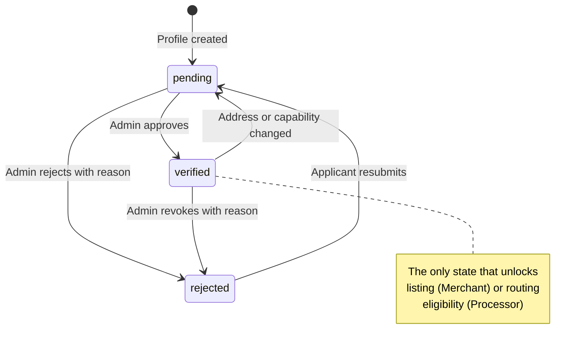
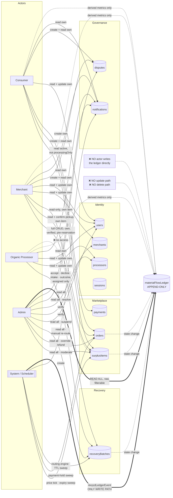

# Roles & Permissions — Cirquo

| Field | Value |
|---|---|
| **Document type** | Specification — Role-Based Access Control |
| **Status** | Draft v1.0 |
| **Last updated** | 2026-08-06 |
| **Owner** | Engineering — Security |
| **Audience** | Backend developers, reviewers, judges |
| **Related** | [../security/PERMISSIONS.md](../security/PERMISSIONS.md), [../security/AUTH.md](../security/AUTH.md) |

---

## 1. Purpose

This document defines who may do what in Cirquo, and — more importantly — where that decision is made. It is the authoritative reference for every permission check in the codebase.

The governing principle is stated once here and repeated throughout because it is the thing most often violated in a hackathon build:

> **The frontend may hide a button. The server must reject the call.**

A disabled button is a courtesy to honest users. It is not a security control. Every mutation in Cirquo re-validates identity, role, ownership, and state on the server, with no trust placed in anything the client sends beyond a session token.

---

## 2. Role model

### 2.1 Single identity table with a role discriminator

Cirquo stores all four actor types in one `users` table with a `role` field.

```
users {
  name: string
  email: string          // unique
  passwordHash: string
  role: "consumer" | "merchant" | "processor" | "admin"
  phone?: string
  status: "active" | "suspended"
}
```

Role-specific business data lives in separate profile tables linked by `ownerId`:

| Role | Profile table | Link | Required before capability |
|---|---|---|---|
| Consumer | — | — | No profile table; the `users` row is sufficient |
| Merchant | `merchants` | `merchants.ownerId → users._id` | Yes, plus `verificationStatus == "verified"` |
| Organic Processor | `processors` | `processors.ownerId → users._id` | Yes, plus `verificationStatus == "verified"` |
| Admin | — | — | No profile table; provisioned manually |

### 2.2 Why one identity table instead of four

| Consideration | Single table with discriminator | Four separate tables |
|---|---|---|
| Authentication | One login mutation, one session lookup, one place to get it right | Four login paths, four chances to introduce a bypass |
| Session table | `sessions.userId` points at exactly one table | Polymorphic reference, or four session tables |
| Email uniqueness | Enforceable with one index | Requires cross-table checking, which Convex does not enforce natively |
| Admin user management | One list, one search, one suspend mutation | Four screens performing the same operation |
| Ledger `actorId` | One foreign key type | Polymorphic actor reference in an append-only table — a permanent liability |
| Role change | Update one field | Migrate a record between tables and repoint every reference |
| Risk introduced | Mass assignment of `role` at registration | Distributed authentication logic |

The single-table risk — a client submitting `role: "admin"` at registration — is **one well-understood attack with one guard**. The four-table risk is four independent authentication surfaces, each of which can drift. For a 2–3 person team under a fixed deadline, one guard that is reviewed carefully beats four code paths that are reviewed hastily. The mitigation is specified in §9.

### 2.3 One role per account in the MVP

An account holds exactly one role for its lifetime. There is no role switching and no multi-role account.

| Question | MVP answer |
|---|---|
| Can a Merchant also browse and reserve as a Consumer? | No. They register a second account with a different email. |
| Can an account be promoted from Consumer to Merchant? | No. This is a post-MVP migration path. |
| Can an Admin act as a Consumer to test the flow? | No. Admins use a separate seeded Consumer account. |
| Where is the role read from at runtime? | Always from the `users` document resolved via the session token. Never from a client-supplied field, header, or route parameter. |

This constraint eliminates an entire class of bug — permission checks that pass because the caller happens to hold a second role — at the cost of an inconvenience that affects nobody in the demo.

### 2.4 Admin provisioning (AUTH-02)

Admins are **provisioned manually**. They are never created through public registration.

| Mechanism | Allowed |
|---|---|
| Seed script run against the Convex deployment | ✅ |
| Internal Convex mutation not exposed to the client | ✅ |
| Public registration form with an admin option | ❌ The option does not exist |
| Public registration mutation receiving `role: "admin"` | ❌ Server ignores the field entirely |
| An existing Admin creating another Admin through the console | ❌ Out of scope for the MVP |

The registration mutation does not accept `role` as an arbitrary string. It accepts a union restricted to `"consumer" | "merchant" | "processor"`, and Convex's validator rejects anything else at the boundary before a single line of handler code runs.

---

## 3. Role definitions

### 3.1 Consumer

**Purpose.** Finds surplus food nearby, reserves it, pays for it, and collects it in person during the pickup window.

| Responsibilities | Detail |
|---|---|
| Discover | Browse active Rescue Items on the Mapbox map and in list view, filter by dietary preference, distance, price, and window |
| Reserve | Commit to a quantity, accepting a 15-minute payment hold |
| Pay | Complete a Midtrans Sandbox QRIS payment within the hold |
| Collect | Travel to the merchant and present the pickup code inside the window |
| Report | Raise a dispute when a collection fails through no fault of their own |

**Can see**

- All `active` Rescue Items where `processingOnly == false`, platform-wide
- Public merchant details: name, business type, address, coordinates, verification status
- Their own orders, in full, including pickup codes on `paid` orders
- Their own notifications
- Their own impact figures, derived from ledger events they caused
- Aggregate platform impact figures published on the public home screen

**Can never see**

- Another Consumer's orders, pickup codes, or personal impact
- Any Merchant's revenue, cost basis, or `floorPrice`
- Any Processor's capacity, accepted material types, or operational data
- Recovery batches — the entire recovery half of the platform is invisible to Consumers
- Raw Material Flow Ledger entries, including their own
- `draft`, `expired`, `moderated`, or `processingOnly` items
- Any part of the Admin console

---

### 3.2 Merchant

**Purpose.** Lists surplus food as Rescue Items, prices it, and verifies collection.

| Responsibilities | Detail |
|---|---|
| Maintain profile | Business details and accurate coordinates; discovery depends on them |
| List | Create Rescue Items with material type, weight per item, quantity, prices, and pickup window |
| Price | Accept or override the Dynamic Rescue Pricing suggestion; set `floorPrice` |
| Fulfil | Verify pickup codes inside the window |
| Report | Flag consumer no-shows so material re-enters Circular Routing |

**Can see**

- Their own Rescue Items in every status, including `draft`
- Orders placed against their own items, including buyer display name, quantity, and pickup code
- Recovery batches originating from their own items — read-only, including the assigned processor's name and facility type
- Their own dashboard metrics, derived from ledger events scoped to their merchant id
- Their own notifications and verification status with any rejection reason

**Can never see**

- Another Merchant's items, orders, pricing, or metrics
- A Consumer's full contact details beyond what is needed for handover
- A Consumer's order history with other merchants
- Processor capacity, accepted material types, or internal operations
- The routing engine's ranking or eligibility diagnostics
- Raw ledger entries — only derived metrics for their own activity
- Any part of the Admin console

**Capability gate.** Every listing mutation requires `merchants.verificationStatus == "verified"`. An unverified Merchant may register, complete a profile, and view an empty dashboard. They may not create, publish, or edit a Rescue Item.

---

### 3.3 Organic Processor

**Purpose.** Receives organic material that the marketplace did not move, measures it, converts it, and reports the outcome honestly.

| Responsibilities | Detail |
|---|---|
| Declare capability | `acceptedMaterialTypes`, `dailyCapacityGrams`, `maxPickupRadiusMeters`, `outputTypes`, operating hours |
| Respond | Accept or decline routed offers within the 6-hour TTL |
| Measure | Record `acceptedWeightGrams` from a physical scale — the authoritative measurement |
| Convert | Process into BSF larvae, compost, biogas, or animal feed |
| Report | Log `outputType`, `outputWeightGrams`, and `residualWeightGrams` truthfully |

**Can see**

- Recovery batches currently offered to them, or previously accepted by them
- The originating merchant's name, address, and distance for accepted or offered batches
- Material type and offered weight for those batches
- Their own dashboard: throughput, output by type, capacity utilisation
- Their own notifications and verification status

**Can never see**

- The marketplace — Rescue Items are not visible to Processors at all
- Consumer identities, orders, or pickup codes
- Prices, revenue, or any financial data anywhere in the system
- Batches offered to a different processor, or batches they have declined
- Another Processor's capacity, throughput, or acceptance rate
- The routing engine's ranking, including their own position in it
- Raw ledger entries — only derived metrics for their own activity

**Capability gate.** An unverified Processor is **excluded from the routing eligibility query entirely**. They are not hidden in the UI; they do not exist as far as the engine is concerned. No offer can reach them.

**Exclusive write authority.** The Processor is the only actor in the system who may write `acceptedWeightGrams`. Not the Merchant, not an Admin, not a derived estimate. This is the platform's measurement integrity guarantee.

---

### 3.4 Admin

**Purpose.** Operates the platform. Verifies participants, moderates content, resolves disputes, audits the ledger, and rescues material that automatic routing could not place.

| Responsibilities | Detail |
|---|---|
| Verify | Approve or reject Merchant and Processor applications |
| Moderate | Remove listings that violate platform rules |
| Adjudicate | Resolve disputes using the ledger timeline as evidence |
| Audit | Read the full Material Flow Ledger with filters |
| Intervene | Manually re-route unroutable batches; override out-of-window pickups |
| Govern | Suspend and reactivate accounts |

**Can see**

- Everything readable in the system, without ownership scoping
- The complete Material Flow Ledger across all actors
- Routing diagnostics, including which eligibility rule excluded each processor
- All disputes, all orders, all items, all batches, all users
- Scheduler health and integrity check anomalies

**Can never do**

| Prohibited action | Reason |
|---|---|
| Write or modify a Material Flow Ledger entry directly | The ledger is append-only and written exclusively by `recordLedgerEvent` inside a state-changing transaction |
| Delete a ledger entry | Same. There is no delete path in code, not merely no UI control |
| Set `acceptedWeightGrams` on a recovery batch | Measurement authority belongs solely to the Processor |
| Set `outputWeightGrams` or `residualWeightGrams` | Same |
| Override a Processor's `acceptedMaterialTypes` during a manual re-route | Physical safety — the facility cannot process that material |
| Set a `currentPrice` below a Merchant's `floorPrice` | The floor is the Merchant's contract with the platform |
| Reserve, pay for, or collect a Rescue Item | Admins are not market participants |
| Create another Admin account through the console | Out of scope; provisioning is manual |
| Act without an audit record | Every admin mutation is logged with actor id, target, and reason |

An Admin is a powerful reader and a constrained writer. They can change *governance* state — verification, moderation, assignment, refunds — but they cannot change *physical* facts. Weight measurements and processing outcomes come from the party who performed them, and no administrative convenience overrides that.

---

## 4. Master capability matrix

**Legend:** ✅ permitted · ❌ denied · ⚠️ conditional, see footnote

| # | Capability | Consumer | Merchant | Processor | Admin |
|---|---|---|---|---|---|
| 1 | Register a public account | ✅ | ✅ | ✅ | ❌ ⁽¹⁾ |
| 2 | Log in and hold a session | ✅ | ✅ | ✅ | ✅ |
| 3 | Set own `role` at registration | ⚠️ ⁽²⁾ | ⚠️ ⁽²⁾ | ⚠️ ⁽²⁾ | ❌ ⁽¹⁾ |
| 4 | Change own `role` after registration | ❌ | ❌ | ❌ | ❌ |
| 5 | Edit own user profile | ✅ | ✅ | ✅ | ✅ |
| 6 | Create a merchant business profile | ❌ | ✅ | ❌ | ❌ |
| 7 | Create a processor facility profile | ❌ | ❌ | ✅ | ❌ |
| 8 | Edit own business/facility profile | ❌ | ⚠️ ⁽³⁾ | ⚠️ ⁽³⁾ | ❌ |
| 9 | Approve or reject verification | ❌ | ❌ | ❌ | ✅ |
| 10 | Browse active Rescue Items | ✅ | ✅ ⁽⁴⁾ | ❌ | ✅ |
| 11 | View Rescue Item detail | ✅ | ✅ ⁽⁴⁾ | ❌ | ✅ |
| 12 | Filter by dietary preference | ✅ | ✅ | ❌ | ✅ |
| 13 | Create a Rescue Item | ❌ | ⚠️ ⁽⁵⁾ | ❌ | ❌ |
| 14 | Edit a Rescue Item | ❌ | ⚠️ ⁽⁶⁾ | ❌ | ❌ |
| 15 | Delete a Rescue Item | ❌ | ❌ ⁽⁷⁾ | ❌ | ❌ ⁽⁷⁾ |
| 16 | Set `floorPrice` | ❌ | ✅ | ❌ | ❌ |
| 17 | Override the price suggestion | ❌ | ⚠️ ⁽⁸⁾ | ❌ | ❌ |
| 18 | Publish a `processingOnly` listing | ❌ | ⚠️ ⁽⁵⁾ | ❌ | ❌ |
| 19 | Reserve a Rescue Item | ✅ | ❌ | ❌ | ❌ |
| 20 | Pay for an order | ⚠️ ⁽⁹⁾ | ❌ | ❌ | ❌ |
| 21 | Cancel an unpaid reservation | ⚠️ ⁽⁹⁾ | ❌ | ❌ | ❌ |
| 22 | Cancel a paid order | ❌ ⁽¹⁰⁾ | ❌ | ❌ | ⚠️ ⁽¹⁰⁾ |
| 23 | View own pickup code | ⚠️ ⁽⁹⁾ | ❌ | ❌ | ✅ |
| 24 | View a pickup code for own item's orders | ❌ | ⚠️ ⁽¹¹⁾ | ❌ | ✅ |
| 25 | Verify a pickup inside the window | ❌ | ⚠️ ⁽¹¹⁾ | ❌ | ✅ |
| 26 | Verify a pickup outside the window | ❌ | ❌ | ❌ | ✅ ⁽¹²⁾ |
| 27 | Report a consumer no-show | ❌ | ⚠️ ⁽¹¹⁾ | ❌ | ✅ |
| 28 | View recovery batches | ❌ | ⚠️ ⁽¹³⁾ | ⚠️ ⁽¹⁴⁾ | ✅ |
| 29 | Accept a recovery offer | ❌ | ❌ | ⚠️ ⁽¹⁴⁾ | ❌ |
| 30 | Decline a recovery offer | ❌ | ❌ | ⚠️ ⁽¹⁴⁾ | ❌ |
| 31 | Write `acceptedWeightGrams` | ❌ | ❌ | ⚠️ ⁽¹⁵⁾ | ❌ |
| 32 | Write `outputWeightGrams` / `residualWeightGrams` | ❌ | ❌ | ⚠️ ⁽¹⁵⁾ | ❌ |
| 33 | Manually re-route an unroutable batch | ❌ | ❌ | ❌ | ✅ ⁽¹⁶⁾ |
| 34 | View own impact metrics | ✅ | ✅ | ✅ | ✅ |
| 35 | View platform-wide impact metrics | ⚠️ ⁽¹⁷⁾ | ⚠️ ⁽¹⁷⁾ | ⚠️ ⁽¹⁷⁾ | ✅ |
| 36 | Read raw Material Flow Ledger entries | ❌ ⁽¹⁸⁾ | ❌ ⁽¹⁸⁾ | ❌ ⁽¹⁸⁾ | ✅ |
| 37 | Write directly to the ledger | ❌ ⁽¹⁹⁾ | ❌ ⁽¹⁹⁾ | ❌ ⁽¹⁹⁾ | ❌ ⁽¹⁹⁾ |
| 38 | Modify or delete a ledger entry | ❌ | ❌ | ❌ | ❌ |
| 39 | Open a dispute | ⚠️ ⁽⁹⁾ | ⚠️ ⁽¹¹⁾ | ❌ | ❌ |
| 40 | Resolve a dispute | ❌ | ❌ | ❌ | ✅ |
| 41 | Issue a refund | ❌ | ❌ | ❌ | ✅ |
| 42 | Moderate a listing | ❌ | ❌ | ❌ | ✅ |
| 43 | Suspend or reactivate a user | ❌ | ❌ | ❌ | ✅ |
| 44 | List all platform users | ❌ | ❌ | ❌ | ✅ |
| 45 | View scheduler health and integrity anomalies | ❌ | ❌ | ❌ | ✅ |
| 46 | Read own notifications | ✅ | ✅ | ✅ | ✅ |
| 47 | Read another user's notifications | ❌ | ❌ | ❌ | ✅ |
| 48 | Trigger a scheduled job manually | ❌ | ❌ | ❌ | ⚠️ ⁽²⁰⁾ |

**Footnotes**

1. Admin accounts are provisioned manually per AUTH-02. The public registration validator accepts a union of `"consumer" | "merchant" | "processor"` and rejects `"admin"` at the argument boundary.
2. Permitted only from the restricted registration union, and only once at creation. The field is never accepted on any update mutation.
3. Permitted for the owner only. A Merchant changing their address, or a Processor changing coordinates or `acceptedMaterialTypes`, resets `verificationStatus` to `pending`.
4. A Merchant may browse the marketplace as a read-only observer for pricing context. They cannot reserve.
5. Requires `merchants.verificationStatus == "verified"` and ownership of the merchant profile.
6. Requires ownership, `verificationStatus == "verified"`, and `remainingQuantity == initialQuantity` with no non-cancelled orders. Once any unit is reserved, the item is locked.
7. Rescue Items are never hard-deleted. A Merchant may leave an item in `draft`; an Admin may transition it to `moderated`. Both preserve ledger history.
8. Permitted within bounds: `floorPrice <= currentPrice < originalPrice`. Violations are rejected server-side regardless of client validation.
9. Permitted only on an order where `orders.userId == session.userId`. Cancellation additionally requires `status == "reserved"`.
10. A paid order cannot be cancelled by any participant. The Consumer opens a dispute; an Admin may resolve it to `refunded`.
11. Permitted only when the order's `merchantId` matches the caller's own merchant profile id.
12. Admin-only override. Requires a stored reason, is recorded in ledger metadata with `adminOverride: true`, and is itself audited.
13. Read-only, and only for batches whose `merchantId` matches the caller's own merchant profile.
14. Only where `recoveryBatches.processorId` equals the caller's own processor profile id, and — for accept and decline — only while `offerExpiresAt` is in the future.
15. Only by the assigned Processor, only in the correct batch status, and only satisfying `residualWeightGrams <= acceptedWeightGrams`.
16. Admin may override radius, capacity, and operating-hours eligibility with a stored reason. Admin may **never** override `acceptedMaterialTypes`.
17. Non-admin actors see published aggregate figures only — total weight rescued, total recovered, circularity rate. They cannot query arbitrary aggregates or break them down by other actors.
18. Non-admin actors read *derived* metrics computed from ledger entries scoped to them. They never receive raw ledger documents. See §8.
19. Nobody writes to the ledger directly. Entries are created exclusively by `recordLedgerEvent(ctx, {...})` called inside the same transaction as the state change that caused them.
20. Only in a development deployment, for demo seeding and rehearsal. Not exposed in production builds.

---

## 5. Per-resource permission tables

### 5.1 Rescue Item (`surplusItems`)

| Operation | Consumer | Merchant | Processor | Admin | Conditions |
|---|---|---|---|---|---|
| Create | ❌ | ⚠️ | ❌ | ❌ | Merchant: verified only |
| Read — `active`, not `processingOnly` | ✅ | ✅ | ❌ | ✅ | Consumer: platform-wide |
| Read — own, any status | — | ✅ | — | ✅ | Merchant: own only |
| Read — `draft` | ❌ | ⚠️ | ❌ | ✅ | Merchant: own only |
| Read — `processingOnly` | ❌ | ⚠️ | ❌ | ✅ | Merchant: own only |
| Read — `expired` / `recovery_pending` | ❌ | ⚠️ | ❌ | ✅ | Merchant: own only |
| Read — `moderated` | ❌ | ⚠️ | ❌ | ✅ | Merchant: own only, with reason |
| Update — content fields | ❌ | ⚠️ | ❌ | ❌ | Own, verified, before any reservation |
| Update — `currentPrice` | ❌ | ⚠️ | ❌ | ❌ | Own; `floorPrice <= p < originalPrice` |
| Update — `floorPrice` | ❌ | ⚠️ | ❌ | ❌ | Own, before any reservation |
| Update — `remainingQuantity` | ❌ ⁽ᵃ⁾ | ❌ ⁽ᵃ⁾ | ❌ | ❌ | System-managed only |
| Update — `status` | ❌ ⁽ᵃ⁾ | ⚠️ | ❌ | ⚠️ | Merchant: `draft → active` only. Admin: `→ moderated` only |
| Publish a draft | ❌ | ⚠️ | ❌ | ❌ | Own, verified |
| Moderate | ❌ | ❌ | ❌ | ✅ | Reason required; terminal |
| Delete | ❌ | ❌ | ❌ | ❌ | No delete path exists |

⁽ᵃ⁾ `remainingQuantity` and most status transitions are side effects of guarded mutations — reserve, cancel, pickup, sweep — never direct writes.

**Item read predicates**

```
Consumer:  surplusItems where status == "active"
                          and processingOnly == false
                          and pickupEndAt > now
Merchant:  surplusItems where merchantId == ownMerchantProfile._id
Processor: (no access)
Admin:     surplusItems (unscoped)
```

---

### 5.2 Order (`orders`)

| Operation | Consumer | Merchant | Processor | Admin | Conditions |
|---|---|---|---|---|---|
| Create (reserve) | ✅ | ❌ | ❌ | ❌ | Item active, not processingOnly, quantity available, window open |
| Read — own | ✅ | — | — | ✅ | `userId == session.userId` |
| Read — for own item | — | ✅ | — | ✅ | `merchantId == ownMerchantProfile._id` |
| Read — any | ❌ | ❌ | ❌ | ✅ | — |
| Read `pickupCode` | ⚠️ | ⚠️ | ❌ | ✅ | Consumer: own, `status == "paid"`. Merchant: own item's orders |
| Update — pay | ⚠️ | ❌ | ❌ | ❌ | Own, `status == "reserved"`, within hold |
| Update — cancel | ⚠️ | ❌ | ❌ | ❌ | Own, `status == "reserved"` only |
| Update — confirm pickup | ❌ | ⚠️ | ❌ | ✅ | Merchant: own item, code match, inside window. Admin: override with reason |
| Update — report no-show | ❌ | ⚠️ | ❌ | ✅ | Own item, window closed |
| Update — expire | ❌ ⁽ᵃ⁾ | ❌ ⁽ᵃ⁾ | ❌ | ❌ ⁽ᵃ⁾ | Scheduler only |
| Update — refund | ❌ | ❌ | ❌ | ✅ | Via dispute resolution |
| Update — `rescuedWeightGrams` | ❌ | ❌ ⁽ᵇ⁾ | ❌ | ❌ | Computed at pickup confirmation |
| Delete | ❌ | ❌ | ❌ | ❌ | No delete path exists |

⁽ᵃ⁾ Expiry is written by the payment-hold sweeper, not by any human actor.
⁽ᵇ⁾ Derived as `quantity × weightPerItemGrams` inside the pickup mutation. The Merchant triggers the mutation but does not supply the value.

**Order read predicates**

```
Consumer:  orders where userId == session.userId
Merchant:  orders where merchantId == ownMerchantProfile._id
Processor: (no access)
Admin:     orders (unscoped)
```

---

### 5.3 Recovery Batch (`recoveryBatches`)

| Operation | Consumer | Merchant | Processor | Admin | Conditions |
|---|---|---|---|---|---|
| Create | ❌ | ❌ ⁽ᵃ⁾ | ❌ | ❌ | Scheduler only — expiry sweep, no-show, or processingOnly listing |
| Read — offered/accepted to me | ❌ | — | ✅ | ✅ | `processorId == ownProcessorProfile._id` |
| Read — from my items | ❌ | ✅ | — | ✅ | `merchantId == ownMerchantProfile._id`, read-only |
| Read — declined by me | ❌ | — | ❌ | ✅ | Permanently removed from the processor's view |
| Read — any | ❌ | ❌ | ❌ | ✅ | — |
| Accept | ❌ | ❌ | ⚠️ | ❌ | Assigned processor, `status == "offered"`, TTL not passed |
| Decline | ❌ | ❌ | ⚠️ | ❌ | Assigned processor, `status == "offered"`, TTL not passed |
| Write `acceptedWeightGrams` | ❌ | ❌ | ⚠️ | ❌ | Assigned processor, `status == "accepted"`, positive integer |
| Write `outputType` / `outputWeightGrams` | ❌ | ❌ | ⚠️ | ❌ | Assigned processor, `status == "collected"` |
| Write `residualWeightGrams` | ❌ | ❌ | ⚠️ | ❌ | Assigned processor; must satisfy `<= acceptedWeightGrams` |
| Assign `processorId` | ❌ | ❌ | ❌ | ⚠️ | Routing engine normally; Admin manual re-route on `unroutable` |
| Update `routingAttempts` | ❌ | ❌ | ❌ | ❌ | Engine only |
| Update `declinedByProcessorIds` | ❌ | ❌ | ❌ ⁽ᵇ⁾ | ❌ | Appended by decline mutation and TTL sweeper |
| Delete | ❌ | ❌ | ❌ | ❌ | No delete path exists |

⁽ᵃ⁾ A `processingOnly` listing causes batch creation, but the Merchant does not construct the batch document.
⁽ᵇ⁾ The Processor's decline mutation causes the append; the Processor cannot write the array directly.

**Batch read predicates**

```
Consumer:  (no access)
Merchant:  recoveryBatches where merchantId == ownMerchantProfile._id
Processor: recoveryBatches where processorId == ownProcessorProfile._id
                             and ownProcessorProfile._id ∉ declinedByProcessorIds
Admin:     recoveryBatches (unscoped)
```

---

### 5.4 Material Flow Ledger (`materialFlowLedger`)

| Operation | Consumer | Merchant | Processor | Admin | Conditions |
|---|---|---|---|---|---|
| Read raw entries | ❌ | ❌ | ❌ | ✅ | Admin only |
| Read derived metrics — own scope | ✅ | ✅ | ✅ | ✅ | Aggregated, never raw documents |
| Read published platform aggregates | ✅ | ✅ | ✅ | ✅ | Fixed set of figures only |
| Filter by surplus item | ❌ | ❌ | ❌ | ✅ | Admin ledger view |
| Filter by event type / date / actor | ❌ | ❌ | ❌ | ✅ | Admin ledger view |
| Create an entry directly | ❌ | ❌ | ❌ | ❌ | Only `recordLedgerEvent` inside a state-changing transaction |
| Update an entry | ❌ | ❌ | ❌ | ❌ | Append-only; no update path exists in code |
| Delete an entry | ❌ | ❌ | ❌ | ❌ | Append-only; no delete path exists in code |

Full access rules are in §8.

---

### 5.5 User & Profile (`users`, `merchants`, `processors`)

| Operation | Consumer | Merchant | Processor | Admin | Conditions |
|---|---|---|---|---|---|
| Read own `users` record | ✅ | ✅ | ✅ | ✅ | Never includes `passwordHash` |
| Read another user's record | ❌ | ❌ | ❌ | ✅ | — |
| Read public merchant info | ✅ | ✅ | ⚠️ | ✅ | Processor: only for a batch offered to them |
| Read merchant operational data | ❌ | ⚠️ | ❌ | ✅ | Own only |
| Read public processor info | ❌ | ⚠️ | ✅ | ✅ | Merchant: only the processor assigned to their batch |
| Read processor capability data | ❌ | ❌ | ⚠️ | ✅ | Own only |
| Update own name / phone | ✅ | ✅ | ✅ | ✅ | — |
| Update own email | ⚠️ | ⚠️ | ⚠️ | ⚠️ | Must remain unique |
| Update own password | ✅ | ✅ | ✅ | ✅ | Current password required |
| Update own `role` | ❌ | ❌ | ❌ | ❌ | Immutable after creation |
| Update own `status` | ❌ | ❌ | ❌ | ❌ | Admin-controlled |
| Update own `verificationStatus` | — | ❌ | ❌ | ✅ | Admin only |
| Suspend / reactivate a user | ❌ | ❌ | ❌ | ✅ | Audited |
| Delete a user | ❌ | ❌ | ❌ | ❌ | Suspension only; ledger history is preserved |

---

### 5.6 Dispute (`disputes`)

| Operation | Consumer | Merchant | Processor | Admin | Conditions |
|---|---|---|---|---|---|
| Create | ⚠️ | ⚠️ | ❌ | ❌ | Consumer: own order. Merchant: order on own item |
| Read — own | ✅ | ✅ | — | ✅ | Party to the dispute |
| Read — any | ❌ | ❌ | ❌ | ✅ | — |
| Add evidence | ⚠️ | ⚠️ | ❌ | ✅ | While `status == "open"` |
| Resolve | ❌ | ❌ | ❌ | ✅ | Rationale required; audited |
| Trigger a refund | ❌ | ❌ | ❌ | ✅ | Via resolution only |
| Delete | ❌ | ❌ | ❌ | ❌ | No delete path exists |

---

### 5.7 Notification (`notifications`)

| Operation | Consumer | Merchant | Processor | Admin | Conditions |
|---|---|---|---|---|---|
| Create | ❌ | ❌ | ❌ | ❌ | System-generated only |
| Read own | ✅ | ✅ | ✅ | ✅ | `userId == session.userId` |
| Read another user's | ❌ | ❌ | ❌ | ✅ | For support investigation |
| Mark read | ⚠️ | ⚠️ | ⚠️ | ⚠️ | Own only |
| Delete own | ⚠️ | ⚠️ | ⚠️ | ⚠️ | Own only |
| Delete another user's | ❌ | ❌ | ❌ | ❌ | — |

---

## 6. Verification-state capability table

`verificationStatus` applies to `merchants` and `processors`. It gates capability independently of `role`.

### 6.1 Merchant

| Capability | `pending` | `verified` | `rejected` | `suspended` ⁽*⁾ |
|---|---|---|---|---|
| Log in | ✅ | ✅ | ✅ | ❌ |
| Read own dashboard | ✅ | ✅ | ✅ | ❌ |
| Edit business profile | ✅ | ✅ ⁽ᵃ⁾ | ✅ | ❌ |
| Create a Rescue Item | ❌ | ✅ | ❌ | ❌ |
| Publish a draft | ❌ | ✅ | ❌ | ❌ |
| Edit an existing listing | ❌ | ✅ ⁽ᵇ⁾ | ❌ | ❌ |
| Existing listings visible to Consumers | ❌ ⁽ᶜ⁾ | ✅ | ❌ | ❌ |
| Verify a pickup | ❌ | ✅ | ❌ | ❌ |
| Report a no-show | ❌ | ✅ | ❌ | ❌ |
| Receive notifications | ✅ | ✅ | ✅ | ⚠️ |
| See rejection reason | — | — | ✅ | — |

⁽ᵃ⁾ Changing the address returns `verificationStatus` to `pending`.
⁽ᵇ⁾ Also requires the item to have no reservations.
⁽ᶜ⁾ A pending merchant has no published listings, so this case does not arise in practice.

### 6.2 Processor

| Capability | `pending` | `verified` | `rejected` | `suspended` ⁽*⁾ |
|---|---|---|---|---|
| Log in | ✅ | ✅ | ✅ | ❌ |
| Read own dashboard | ✅ | ✅ | ✅ | ❌ |
| Edit facility profile | ✅ | ✅ ⁽ᵃ⁾ | ✅ | ❌ |
| Declare capability fields | ✅ | ✅ ⁽ᵃ⁾ | ✅ | ❌ |
| Appear in the routing eligibility set | ❌ | ✅ | ❌ | ❌ |
| Receive a routed offer | ❌ | ✅ | ❌ | ❌ |
| Accept or decline an offer | ❌ | ✅ | ❌ | ⚠️ ⁽ᵇ⁾ |
| Write `acceptedWeightGrams` | ❌ | ✅ | ❌ | ⚠️ ⁽ᵇ⁾ |
| Write outcome fields | ❌ | ✅ | ❌ | ⚠️ ⁽ᵇ⁾ |
| Be eligible for Admin manual re-route | ❌ | ✅ | ❌ | ❌ |
| Receive notifications | ✅ | ✅ | ✅ | ⚠️ |

⁽ᵃ⁾ Changing coordinates or `acceptedMaterialTypes` returns `verificationStatus` to `pending` and removes the facility from routing until re-approved.
⁽ᵇ⁾ A suspended processor holding accepted batches must still be able to close them out, or physically collected material would be permanently unaccounted for. Admin grants a scoped completion path per batch; no new offers are routed.

⁽*⁾ `suspended` here is derived from `users.status == "suspended"`, not from `verificationStatus`. It is shown in the same table because from the actor's point of view it is another gate.

### 6.3 State transition rules



Only an Admin writes `verificationStatus`. The applicant can cause a return to `pending` indirectly by editing a verified-relevant field, but cannot set the value.

---

## 7. Data visibility scoping

Every query in Cirquo is scoped by a filter predicate derived from the session, never from a client argument. Written as predicates:

### 7.1 Rescue Items

```
Consumer:
  surplusItems
    where status == "active"
      and processingOnly == false
      and pickupEndAt > now
      and merchant.verificationStatus == "verified"

Merchant:
  surplusItems
    where merchantId == ownMerchantProfile._id

Processor:
  ∅   // no access to the marketplace at all

Admin:
  surplusItems   // unscoped
```

### 7.2 Orders

```
Consumer:
  orders where userId == session.userId

Merchant:
  orders where merchantId == ownMerchantProfile._id

Processor:
  ∅

Admin:
  orders   // unscoped
```

### 7.3 Recovery Batches

```
Consumer:
  ∅

Merchant:
  recoveryBatches
    where merchantId == ownMerchantProfile._id     // read-only

Processor:
  recoveryBatches
    where processorId == ownProcessorProfile._id
      and ownProcessorProfile._id ∉ declinedByProcessorIds

Admin:
  recoveryBatches   // unscoped
```

### 7.4 Material Flow Ledger

```
Consumer:
  ∅ raw
  derived: aggregate over materialFlowLedger
             where actorId == session.userId
               and eventType ∈ {RESERVED, PAID, RESCUED, CANCELLED}

Merchant:
  ∅ raw
  derived: aggregate over materialFlowLedger
             where surplusItemId ∈ (surplusItems where merchantId == ownMerchantProfile._id)

Processor:
  ∅ raw
  derived: aggregate over materialFlowLedger
             where recoveryBatchId ∈ (recoveryBatches where processorId == ownProcessorProfile._id)

Admin:
  materialFlowLedger   // unscoped, raw, filterable
```

### 7.5 Notifications, disputes, users

```
Notifications:
  Any non-admin: notifications where userId == session.userId
  Admin:         notifications   // unscoped

Disputes:
  Consumer: disputes where order.userId == session.userId
  Merchant: disputes where order.merchantId == ownMerchantProfile._id
  Processor: ∅
  Admin:    disputes   // unscoped

Users:
  Any non-admin: users where _id == session.userId
  Admin:         users   // unscoped
```

**The rule behind all of these.** The scoping value — `session.userId`, `ownMerchantProfile._id`, `ownProcessorProfile._id` — is always resolved on the server from the session token. A query that accepts a `userId` or `merchantId` argument from the client and filters by it is an IDOR vulnerability, not a scoped query. See §9.

---

## 8. Material Flow Ledger access rules

The ledger is the platform's central claim: every kilogram is accounted for, from listing to final outcome. Its access rules are stricter than any other resource's, because a ledger that can be edited proves nothing.

### 8.1 The four rules

| # | Rule | Enforcement |
|---|---|---|
| 1 | **Nobody writes directly.** Entries are created only by `recordLedgerEvent(ctx, {...})`, called inside the same transaction as the state change that caused them. | No public mutation accepts ledger fields. The helper is not exported to the client API surface. |
| 2 | **Append-only.** No update path and no delete path exist anywhere in the codebase — not merely no UI control. | Code review; the ledger module exports an insert helper and read queries, nothing else. |
| 3 | **Admin reads all.** The Admin ledger view is unscoped and filterable by item, event type, date range, and actor. | `requireRole(ctx, "admin")` on the query. |
| 4 | **Every other actor reads only what concerns them, and only as derived metrics.** Raw ledger documents never leave the server for a non-admin caller. | Scoped aggregation queries; no query returns ledger documents to non-admins. |

### 8.2 Who sees which events

| Event type | Consumer | Merchant | Processor | Admin |
|---|---|---|---|---|
| `LISTED` | ❌ | derived, own item | ❌ | ✅ raw |
| `PRICE_ADJUSTED` | ❌ | derived, own item | ❌ | ✅ raw |
| `RESERVED` | derived, own order | derived, own item | ❌ | ✅ raw |
| `PAID` | derived, own order | derived, own item | ❌ | ✅ raw |
| `RESCUED` | derived, own order | derived, own item | ❌ | ✅ raw |
| `CANCELLED` | derived, own order | derived, own item | ❌ | ✅ raw |
| `EXPIRED` | derived, own order | derived, own item | ❌ | ✅ raw |
| `ROUTED` | ❌ | derived, own item | derived, own batch | ✅ raw |
| `ROUTING_FAILED` | ❌ | derived, own item | ❌ | ✅ raw |
| `INTAKE_ACCEPTED` | ❌ | derived, own item | derived, own batch | ✅ raw |
| `INTAKE_DECLINED` | ❌ | ❌ ⁽ᵃ⁾ | derived, own batch | ✅ raw |
| `PROCESSED` | ❌ | derived, own item | derived, own batch | ✅ raw |
| `MODERATED` | ❌ | derived, own item | ❌ | ✅ raw |

⁽ᵃ⁾ Declines are hidden from Merchants deliberately. A Merchant learning which facilities refused their material creates friction with no operational benefit; they see only that routing is in progress or has completed.

### 8.3 Terminal events

`RESCUED`, `PROCESSED`, `ROUTING_FAILED`, and `MODERATED` are terminal. Once written for a given material path, no actor may cause a further transition on that path. Attempting to do so is rejected server-side by a status guard, not merely hidden in the UI.

The single exception is documented and audited: Admin manual re-route on an `unroutable` batch writes a new `ROUTED` event that supersedes a prior `ROUTING_FAILED`. The `ROUTING_FAILED` entry remains in the ledger permanently. The platform counts its failures alongside its successes — that is what makes the circularity rate credible, and why it lands at 85–95% rather than 100%.

### 8.4 Why derived metrics rather than raw rows

| Reason | Detail |
|---|---|
| Cross-actor leakage | A raw entry carries `actorId`, `actorRole`, and `metadata` that may reference parties the reader should not see |
| Weight inference | Raw `weightDeltaGrams` across a merchant's items would let a competitor reconstruct their volume |
| Schema coupling | Exposing raw rows makes the ledger schema a public API contract that cannot evolve |
| Methodology integrity | Every figure carries a `methodologyVersion`. Derived queries apply the correct version consistently; a client computing its own totals could not. |

---

## 9. Server-side enforcement contract

### 9.1 The non-negotiable statement

> **The frontend may hide a button. The server must reject the call regardless.**

Convex functions are network endpoints. Anyone holding a session token can call any exported mutation with any arguments, from a terminal, bypassing React entirely. Nothing rendered by the client is a security control. A disabled button, a hidden route, a conditional menu item — all are usability affordances. The *only* thing preventing an unauthorised state change is a server-side guard that runs before the handler touches the database.

Every mutation in Cirquo therefore executes the same four checks in the same order:

1. **Authenticate** — resolve the session token to a live, non-suspended user
2. **Authorise by role** — confirm the user's `role` permits this operation
3. **Authorise by ownership** — confirm the target document belongs to this user
4. **Validate state** — confirm the document is in a status where this transition is legal

Skipping any one of these is a vulnerability. Skipping step 3 is IDOR. Skipping step 4 is a state-machine bypass.

### 9.2 `requireAuth`

```ts
// convex/lib/auth.ts
import { QueryCtx, MutationCtx } from "../_generated/server";
import { Doc } from "../_generated/dataModel";
import { ConvexError } from "convex/values";

/**
 * Resolves a session token to a live user.
 * Every guarded function begins here. There is no other way
 * to learn who the caller is — role, id, and status are read
 * from the database, never from client-supplied arguments.
 */
export async function requireAuth(
  ctx: QueryCtx | MutationCtx,
  token: string,
): Promise<Doc<"users">> {
  if (!token) {
    throw new ConvexError({ code: "UNAUTHENTICATED", message: "Sesi tidak ditemukan." });
  }

  const session = await ctx.db
    .query("sessions")
    .withIndex("by_token", (q) => q.eq("token", token))
    .unique();

  if (!session) {
    throw new ConvexError({ code: "UNAUTHENTICATED", message: "Sesi tidak valid." });
  }

  if (session.expiresAt <= Date.now()) {
    throw new ConvexError({ code: "SESSION_EXPIRED", message: "Sesi telah berakhir." });
  }

  const user = await ctx.db.get(session.userId);
  if (!user) {
    // Session outlived its user. Treat as unauthenticated, never as a partial identity.
    throw new ConvexError({ code: "UNAUTHENTICATED", message: "Sesi tidak valid." });
  }

  if (user.status === "suspended") {
    throw new ConvexError({ code: "ACCOUNT_SUSPENDED", message: "Akun ditangguhkan." });
  }

  return user;
}
```

**Notes.** The user document is re-read on every call rather than trusted from a cached claim, so a suspension takes effect on the next request rather than at the next session refresh. Error messages are deliberately generic — they never distinguish "no such session" from "session belongs to a deleted user", because that distinction is useful only to an attacker.

### 9.3 `requireRole`

```ts
// convex/lib/auth.ts
type Role = "consumer" | "merchant" | "processor" | "admin";

/**
 * Confirms the caller holds one of the permitted roles.
 * The role is read from the user document resolved by requireAuth —
 * never from an argument, header, or route parameter.
 */
export async function requireRole(
  ctx: QueryCtx | MutationCtx,
  token: string,
  ...allowed: Role[]
): Promise<Doc<"users">> {
  const user = await requireAuth(ctx, token);

  if (!allowed.includes(user.role as Role)) {
    // Do not reveal which role would have been sufficient.
    throw new ConvexError({
      code: "FORBIDDEN",
      message: "Kamu tidak memiliki akses untuk tindakan ini.",
    });
  }

  return user;
}

/**
 * Merchant capability gate. Resolves the caller's own merchant profile
 * and enforces the verification requirement in one place.
 */
export async function requireVerifiedMerchant(
  ctx: QueryCtx | MutationCtx,
  token: string,
): Promise<{ user: Doc<"users">; merchant: Doc<"merchants"> }> {
  const user = await requireRole(ctx, token, "merchant");

  const merchant = await ctx.db
    .query("merchants")
    .withIndex("by_owner", (q) => q.eq("ownerId", user._id))
    .unique();

  if (!merchant) {
    throw new ConvexError({
      code: "PROFILE_REQUIRED",
      message: "Lengkapi profil bisnis terlebih dahulu.",
    });
  }

  if (merchant.verificationStatus !== "verified") {
    throw new ConvexError({
      code: "NOT_VERIFIED",
      message: "Akun bisnismu belum terverifikasi.",
    });
  }

  return { user, merchant };
}

/**
 * Processor capability gate. Same shape, same guarantees.
 */
export async function requireVerifiedProcessor(
  ctx: QueryCtx | MutationCtx,
  token: string,
): Promise<{ user: Doc<"users">; processor: Doc<"processors"> }> {
  const user = await requireRole(ctx, token, "processor");

  const processor = await ctx.db
    .query("processors")
    .withIndex("by_owner", (q) => q.eq("ownerId", user._id))
    .unique();

  if (!processor) {
    throw new ConvexError({
      code: "PROFILE_REQUIRED",
      message: "Lengkapi profil fasilitas terlebih dahulu.",
    });
  }

  if (processor.verificationStatus !== "verified") {
    throw new ConvexError({
      code: "NOT_VERIFIED",
      message: "Fasilitasmu belum terverifikasi.",
    });
  }

  return { user, processor };
}
```

### 9.4 `requireOwnership`

```ts
// convex/lib/auth.ts
import { Id, TableNames } from "../_generated/dataModel";

/**
 * Confirms a document exists and belongs to the caller.
 *
 * This is the guard that prevents IDOR. A Convex document id is not a
 * secret — it appears in URLs, in logs, and in any response that
 * references it. Possession of an id must never imply permission.
 *
 * Admins bypass ownership but not existence: an Admin acting on a
 * missing document still gets NOT_FOUND.
 */
export async function requireOwnership<T extends TableNames>(
  ctx: QueryCtx | MutationCtx,
  user: Doc<"users">,
  table: T,
  documentId: Id<T>,
  ownerField: keyof Doc<T>,
  expectedOwnerId: Id<"users"> | Id<"merchants"> | Id<"processors">,
): Promise<Doc<T>> {
  const doc = await ctx.db.get(documentId);

  if (!doc) {
    throw new ConvexError({ code: "NOT_FOUND", message: "Data tidak ditemukan." });
  }

  if (user.role === "admin") {
    return doc as Doc<T>;
  }

  if ((doc as Doc<T>)[ownerField] !== expectedOwnerId) {
    // Return NOT_FOUND, not FORBIDDEN. A FORBIDDEN response confirms the
    // document exists, which is itself an information leak that lets an
    // attacker enumerate valid ids.
    throw new ConvexError({ code: "NOT_FOUND", message: "Data tidak ditemukan." });
  }

  return doc as Doc<T>;
}
```

### 9.5 The four checks composed

```ts
// convex/orders.ts
export const confirmPickup = mutation({
  args: {
    token: v.string(),
    orderId: v.id("orders"),
    pickupCode: v.string(),
  },
  handler: async (ctx, args) => {
    // 1 — Authenticate + 2 — Authorise by role + verification gate
    const { user, merchant } = await requireVerifiedMerchant(ctx, args.token);

    // 3 — Authorise by ownership: the order must be on THIS merchant's item
    const order = await requireOwnership(
      ctx, user, "orders", args.orderId, "merchantId", merchant._id,
    );

    // 4 — Validate state
    if (order.status !== "paid") {
      throw new ConvexError({ code: "INVALID_STATE", message: "Pesanan belum dibayar." });
    }
    if (order.pickupCode !== args.pickupCode) {
      throw new ConvexError({ code: "INVALID_CODE", message: "Kode pengambilan tidak valid." });
    }

    const item = await ctx.db.get(order.surplusItemId);
    if (!item) {
      throw new ConvexError({ code: "NOT_FOUND", message: "Data tidak ditemukan." });
    }

    const now = Date.now();
    if (now < item.pickupStartAt || now > item.pickupEndAt) {
      throw new ConvexError({
        code: "OUTSIDE_WINDOW",
        message: "Di luar jendela pengambilan. Perlu persetujuan Admin.",
      });
    }

    // State change and ledger write in one transaction
    const rescuedWeightGrams = order.quantity * item.weightPerItemGrams;

    await ctx.db.patch(args.orderId, {
      status: "picked_up",
      rescuedWeightGrams,
    });

    await recordLedgerEvent(ctx, {
      surplusItemId: item._id,
      orderId: order._id,
      eventType: "RESCUED",
      weightDeltaGrams: rescuedWeightGrams,
      actorId: user._id,
      actorRole: "merchant",
      occurredAt: now,
    });

    return { rescuedWeightGrams };
  },
});
```

**What to notice.** Nothing in this handler trusts the client beyond the token and the ids. The merchant id comes from the resolved profile, not from an argument. The weight comes from the item document, not from the request. The `RESCUED` event is written in the same transaction as the status patch, so a partial commit is impossible.

### 9.6 Enforcement checklist for code review

| # | Check | Applies to |
|---|---|---|
| 1 | Function calls `requireAuth` or a wrapper before any `ctx.db` access | Every non-public function |
| 2 | Role check uses `user.role` from the resolved document, never an argument | Every guarded function |
| 3 | Verification gate applied where the capability matrix requires it | Merchant and Processor mutations |
| 4 | Ownership verified against a server-resolved id, never a client-supplied one | Every function touching a scoped document |
| 5 | Status guard present for every state transition | Every mutation |
| 6 | `recordLedgerEvent` called in the same transaction as the state change | Every state-changing mutation |
| 7 | `role` is not in the args validator of any update mutation | Every user mutation |
| 8 | Ownership failures return `NOT_FOUND`, not `FORBIDDEN` | Every scoped read and write |
| 9 | Error messages do not reveal existence, ownership, or the sufficient role | All error paths |
| 10 | Weights and prices are read from server documents, not from arguments | Every financial or measurement mutation |

---

## 10. Privilege escalation risks

| # | Risk | Attack | Severity | Mitigation | Status |
|---|---|---|---|---|---|
| 1 | **Mass assignment of `role` at registration** | Attacker posts `{ role: "admin" }` to the public registration mutation and becomes a platform administrator | 🔴 Critical | The registration validator accepts a union restricted to `"consumer" \| "merchant" \| "processor"`. Convex rejects `"admin"` at the argument boundary before the handler runs. No update mutation anywhere accepts `role`. | 📋 |
| 2 | **IDOR on Convex document ids** | Attacker substitutes another user's `orderId` to read a pickup code, or another merchant's `surplusItemId` to edit a listing | 🔴 Critical | `requireOwnership` on every scoped operation, comparing against a server-resolved owner id. Failures return `NOT_FOUND` so ids cannot be enumerated. | 📋 |
| 3 | **Role spoofing from the client** | Attacker sends `{ role: "admin" }` or a forged claim alongside an ordinary request, hoping a handler reads role from args | 🔴 Critical | Role is only ever read from the `users` document resolved via the session. No handler accepts a role argument. Enforced by review checklist item 2. | 📋 |
| 4 | **Admin self-provisioning** | An authenticated user calls a mutation that sets `role = "admin"` on their own account | 🔴 Critical | No mutation exists that writes `role` after creation. Admin provisioning is a seed script or an internal function absent from the client API surface. | 📋 |
| 5 | **Session fixation** | Attacker plants a known token, then waits for the victim to authenticate with it | 🟠 High | Tokens are generated server-side with a CSPRNG on every successful login. A client-supplied token is never adopted. Any prior token is discarded on login. | 📋 |
| 6 | **Session token leakage on shared devices** | A stale token in Capacitor WebView storage grants access to the next user of the device | 🟠 High | Bounded `expiresAt`; explicit logout deletes the session row server-side, not just the local copy; suspension invalidates all sessions for that user. | 📋 |
| 7 | **Verification gate bypass** | Unverified merchant calls the create-listing mutation directly, bypassing the disabled UI button | 🟠 High | `requireVerifiedMerchant` reads `verificationStatus` from the database on every call. The UI gate is cosmetic. | 📋 |
| 8 | **Ledger tampering** | An actor attempts to insert, edit, or delete a ledger entry to inflate impact figures | 🔴 Critical | No public mutation touches `materialFlowLedger`. The write helper is internal. No update or delete code path exists in the module at all. | 📋 |
| 9 | **Measurement forgery** | A Merchant or Admin writes `acceptedWeightGrams` to inflate recovered weight | 🟠 High | The intake mutation calls `requireVerifiedProcessor` and verifies `batch.processorId == processor._id`. No other function writes the field. | 📋 |
| 10 | **Mass balance violation** | A Processor submits `residualWeightGrams > acceptedWeightGrams`, or `outputWeightGrams` exceeding intake | 🟡 Medium | Server-side inequality guard in the outcome mutation, plus a scheduled integrity check that surfaces violations to the Admin health panel. | 📋 |
| 11 | **Negative or oversold quantity** | Concurrent reservations drive `remainingQuantity` below zero | 🟠 High | The decrement and the order creation occur in one Convex transaction with a pre-check. Convex serialises conflicting transactions, so exactly one succeeds. | 📋 |
| 12 | **Price floor bypass** | Attacker submits `currentPrice` below `floorPrice`, or a client-computed `totalPrice` | 🟡 Medium | Price bounds re-validated server-side. `totalPrice` is computed from the server's `currentPrice`, never accepted from the request. | 📋 |
| 13 | **Payment replay** | Midtrans notification replayed to produce multiple `PAID` events for one order | 🟠 High | Signature verification, plus an idempotency check on the transaction id before any state change. A repeat returns 200 with no mutation. | 📋 |
| 14 | **Cross-processor batch access** | Processor accepts a batch offered to a different facility | 🟡 Medium | Accept and decline mutations verify `batch.processorId == ownProcessorProfile._id` and that the TTL has not elapsed. | 📋 |
| 15 | **Enumeration through error messages** | Attacker distinguishes "exists but not yours" from "does not exist" to map the id space | 🟡 Medium | Ownership failures return `NOT_FOUND`. Login failures use one generic message for both unknown email and wrong password. | 📋 |
| 16 | **Suspended user continues acting** | A suspended account keeps operating on a still-valid session | 🟡 Medium | `requireAuth` re-reads `users.status` on every call and rejects `suspended`. Suspension also deletes existing session rows. | 📋 |
| 17 | **Admin overrides a physical safety rule** | Admin manually routes material to a facility that does not accept that material type | 🟠 High | `acceptedMaterialTypes` is checked in the manual re-route mutation and is not overridable. Only radius, capacity, and hours may be overridden, each requiring a stored reason. | 📋 |

**Priority.** Risks 1, 2, 3, 4, and 8 are build-blocking. They are implemented and tested in M1 alongside the ledger and authentication, before any feature depends on them. Everything else is addressed in the milestone that introduces the affected capability.

---

## 11. Admin action audit requirements

Admin actions are the least constrained operations in the system, so they carry the strictest logging requirements. An unaudited administrative action is indistinguishable from a compromise.

### 11.1 Actions that must be audited

| # | Admin action | Recorded where | Required fields |
|---|---|---|---|
| 1 | Approve verification | `merchants` / `processors` document | `verifiedBy`, `verifiedAt` |
| 2 | Reject verification | `merchants` / `processors` document | `verifiedBy`, `verifiedAt`, `rejectionReason` |
| 3 | Revoke verification | `merchants` / `processors` document | `verifiedBy`, `verifiedAt`, `rejectionReason` |
| 4 | Moderate a listing | `surplusItems` + `MODERATED` ledger event | `actorId`, `actorRole: "admin"`, `metadata.reason` |
| 5 | Override an out-of-window pickup | `RESCUED` ledger event | `actorId`, `actorRole: "admin"`, `metadata.adminOverride: true`, `metadata.reason` |
| 6 | Manually re-route a batch | `ROUTED` ledger event | `actorId`, `actorRole: "admin"`, `metadata.adminOverride: true`, `metadata.overriddenRules[]`, `metadata.reason` |
| 7 | Resolve a dispute | `disputes` document | `resolvedBy`, `resolvedAt`, `resolution`, `rationale` |
| 8 | Issue a refund | `orders` document + `disputes` document | `resolvedBy`, `resolvedAt`, `rationale` |
| 9 | Suspend a user | `users` document | `statusChangedBy`, `statusChangedAt`, `reason` |
| 10 | Reactivate a user | `users` document | `statusChangedBy`, `statusChangedAt`, `reason` |
| 11 | Read the full ledger with a filter | Access log | `actorId`, `filterApplied`, `occurredAt` |
| 12 | Read another user's notifications | Access log | `actorId`, `targetUserId`, `occurredAt` |

### 11.2 Where audit records live

| Category | Location | Rationale |
|---|---|---|
| Actions with a material consequence — moderation, pickup override, manual re-route | **Material Flow Ledger**, as the event itself with `actorRole: "admin"` and an override reason in `metadata` | The action changed the physical accounting; it belongs in the same append-only record as the change |
| Governance actions with no material consequence — verification, suspension, dispute resolution | **On the affected document**, as `*By` / `*At` / reason fields | Ties the decision to the record it governs and survives without a separate table |
| Sensitive reads — full ledger queries, cross-user notification reads | **Access log**, post-MVP | Read auditing is deferred; the MVP has one operator and no external auditor |

The MVP does not introduce a dedicated `adminAuditLog` table. Categories one and two cover every action that changes state, which is the set that matters for integrity. Category three is a known gap, documented here rather than silently omitted, and is the first security item on the post-MVP list.

### 11.3 Audit invariants

| # | Invariant |
|---|---|
| 1 | Every admin mutation that changes state records the acting admin's `_id`. There are no anonymous administrative actions. |
| 2 | Every admin override of a normal rule requires a reason string; the mutation rejects an empty or whitespace-only value. |
| 3 | Admin actions with material consequences write `actorRole: "admin"` to the ledger so overrides are countable and separable from normal operation. |
| 4 | Audit fields are write-once. No mutation overwrites an existing `verifiedBy`, `resolvedBy`, or `statusChangedBy` — a subsequent decision writes a new record or a new ledger event. |
| 5 | Suspending a user never deletes their ledger history. Past events remain and continue to count toward platform totals, because the material movement genuinely happened. |
| 6 | The Admin health panel surfaces the count of admin overrides per period. A rising override rate is an operational signal that the routing rules need tuning, not a metric to be hidden. |

---

## 12. Role → resource access diagram



**Reading the diagram.** Solid arrows are direct access. Dashed arrows are indirect — derived metrics, or ledger entries produced as a side effect of a guarded state change. The Processor has no arrow to `surplusItems` at all, which is the visual statement that the recovery half of the platform is fully isolated from the marketplace half. The only bold arrow into the ledger comes from the System, because `recordLedgerEvent` is the sole write path in the codebase.

---

## 13. Related Documents

| Document | Relationship |
|---|---|
| [../security/PERMISSIONS.md](../security/PERMISSIONS.md) | Function-by-function permission reference derived from this specification |
| [../security/AUTH.md](../security/AUTH.md) | Session, token, and password handling detail |
| [../security/SECURITY.md](../security/SECURITY.md) | Broader threat model beyond access control |
| [USER_STORIES.md](USER_STORIES.md) | Stories whose acceptance criteria assert these rules |
| [USER_FLOW.md](USER_FLOW.md) | Journeys showing where each guard is encountered |
| [FEATURES.md](FEATURES.md) | Feature breakdown gated by these capabilities |
| [../product/PRD.md](../product/PRD.md) | AUTH-02 and AUTH-04 requirements implemented here |
| [../domain/DATA_MODEL.md](../domain/DATA_MODEL.md) | Field definitions cited throughout |
| [../domain/DATABASE.md](../domain/DATABASE.md) | Index definitions supporting the scoping predicates |
| [../domain/STATE_MACHINE.md](../domain/STATE_MACHINE.md) | Status guards enforced in step 4 of every mutation |
| [../impact/MATERIAL_LEDGER.md](../impact/MATERIAL_LEDGER.md) | Ledger event semantics and append-only guarantees |
| [../api/API_AUTH.md](../api/API_AUTH.md) | Registration and login contracts |
| [../api/API_ADMIN.md](../api/API_ADMIN.md) | Admin function contracts and audit field requirements |
| [../architecture/BACKEND.md](../architecture/BACKEND.md) | Where the guard helpers live in the Convex module tree |

---

**Built for DSDC ANFORCOM 2026**  
**Platform:** Cirquo — Closing the Loop, Saving Every Meal
