# User Flows — Cirquo

| Field | Value |
|---|---|
| **Document type** | Specification — User Journeys & Flows |
| **Status** | Target user journeys with implemented M1–M5 subset |
| **Last updated** | 2026-08-29 |
| **Owner** | Product & Design |
| **Audience** | Developers, designers, judges |
| **Related** | [USER_STORIES.md](USER_STORIES.md), [../domain/STATE_MACHINE.md](../domain/STATE_MACHINE.md) |

---

## 1. Purpose and scope

This document maps every journey a human or scheduled process takes through Cirquo, from opening the app to the moment a kilogram of material reaches a terminal ledger state. It is the connective tissue between the requirements in [../product/PRD.md](../product/PRD.md), the stories in [USER_STORIES.md](USER_STORIES.md), and the transitions in [../domain/STATE_MACHINE.md](../domain/STATE_MACHINE.md).

**Cirquo is not a food delivery application.** There is no courier and no delivery fee. A Consumer travels to a Merchant and collects a **Rescue Item** in person during a **pickup window**. What makes the platform circular is what happens when nobody collects: the material enters **Circular Routing**, is offered to a verified **Organic Processor**, and becomes BSF larvae, compost, biogas, or animal feed. Every gram of that path is written to the **Material Flow Ledger**.

---

## 2. Diagram legend

Every diagram in this document uses the same vocabulary.

| Shape / notation | Meaning |
|---|---|
| `[Rectangle]` | A screen the user sees, or a UI step |
| `{Diamond}` | A decision — branching on state, permission, or input |
| `([Stadium])` | A start or end point of a journey |
| `[(Cylinder)]` | A write to the Convex database |
| `[[Subroutine]]` | A scheduled job or engine running without a human |
| `-->` | Normal progression |
| `-.->` | Asynchronous progression — reactive update, callback, or scheduled trigger |
| `==>` | The critical path of the demo narrative |

| Marker | Meaning |
|---|---|
| ✅ | Source implementation available; UAT is still required for end-to-end claims |
| 🚧 | Partially implemented — usually a placeholder screen with mock data |
| 📋 | Planned, not yet built |

| Actor colour convention | Applies to |
|---|---|
| Consumer | Journeys beginning at `/` or `/explore` |
| Merchant | Journeys beginning at `/merchant` |
| Processor | Journeys beginning at `/processor` |
| Admin | Journeys beginning at `/admin` |
| System | Scheduled jobs; no route, no session |

Times shown to users are **WIB (UTC+7)**. Times stored are **epoch milliseconds UTC**. Money is **integer IDR**. Weight is **integer grams**.

---

## 3. Master circular flow

This is the whole system on one page. Everything else in this document is a zoom into part of it.

```mermaid
flowchart TD
    START([Merchant has surplus food]) ==> LIST[Create Rescue Item<br/>name, materialType, weight/item,<br/>prices, pickup window]
    LIST --> GATE{Merchant<br/>verified?}
    GATE -->|No| BLOCKED[Listing blocked<br/>Verification banner shown]
    BLOCKED -.-> ADMINV[[Admin verification queue]]
    ADMINV -.-> GATE
    GATE -->|Yes| PONLY{processingOnly?}

    PONLY -->|Yes| DIRECT[Status: recovery_pending<br/>Skips marketplace entirely]
    PONLY -->|No| ACTIVE[(Status: active<br/>Ledger: LISTED)]

    ACTIVE ==> DISCOVER[Consumer discovery<br/>Mapbox map + list + filters]
    ACTIVE -.-> TICK[[Dynamic Rescue Pricing tick<br/>Ledger: PRICE_ADJUSTED]]
    TICK -.-> ACTIVE

    DISCOVER ==> RESERVE{Consumer<br/>reserves?}
    RESERVE -->|No, window ends| EXPIRED[(Status: expired<br/>Ledger: EXPIRED)]
    RESERVE ==>|Yes| HOLD[(Order: reserved<br/>remainingQuantity decremented<br/>15-min payment hold<br/>Ledger: RESERVED)]

    HOLD --> PAYQ{Paid within<br/>15 minutes?}
    PAYQ -->|No| SWEEP[[Payment-hold timer]]
    SWEEP --> RETURN[(Order: expired<br/>Quantity returned to item<br/>Ledger: CANCELLED, 0 g)]
    RETURN --> ACTIVE
    PAYQ -->|Cancelled by Consumer| CANCEL[(Order: cancelled<br/>Quantity returned<br/>Ledger: CANCELLED)]
    CANCEL --> ACTIVE

    PAYQ ==>|Yes, Midtrans QRIS| PAID[(Order: paid<br/>pickupCode revealed to owner<br/>Ledger: PAID)]
    PAID ==> COLLECT{Collected inside<br/>pickup window?}

    COLLECT ==>|Yes, code matches| RESCUED[(Order: picked_up<br/>rescuedWeightGrams written<br/>Ledger: RESCUED ✔ terminal)]
    COLLECT -->|No-show| NOSHOW[Merchant reports no-show<br/>NO residual created]

    EXPIRED --> BATCH
    DIRECT --> BATCH
    NOSHOW --> BATCH

    BATCH[(Recovery Batch created<br/>status: pending<br/>offeredWeightGrams computed)] ==> ROUTE[[Circular Routing engine]]

    ROUTE --> ELIG{Any eligible processor?<br/>verified · materialType ok ·<br/>within radius · capacity headroom ·<br/>not declined · open within 24h}
    ELIG -->|No| UNROUTABLE[(status: unroutable<br/>Ledger: ROUTING_FAILED ✔ terminal)]
    UNROUTABLE -.-> MANUAL[[Admin manual re-route]]
    MANUAL -.-> OFFER

    ELIG ==>|Yes, ranked| OFFER[(status: offered<br/>offerExpiresAt = now + 6h<br/>routingAttempts++<br/>Ledger: ROUTED)]

    OFFER --> RESP{Processor<br/>response}
    RESP -->|Decline| DECLINE[(declinedByProcessorIds += id<br/>Ledger: INTAKE_DECLINED)]
    RESP -->|Silence, 6h TTL| TTL[[Offer TTL sweeper<br/>treated as decline]]
    DECLINE --> RETRY{routingAttempts<br/>&lt; 3?}
    TTL --> RETRY
    RETRY -->|Yes| ROUTE
    RETRY -->|No| UNROUTABLE

    RESP ==>|Accept| ACCEPT[(status: accepted<br/>Ledger: INTAKE_ACCEPTED)]
    ACCEPT ==> INTAKE[(status: collected<br/>acceptedWeightGrams measured<br/>by Processor — authoritative)]
    INTAKE ==> OUTCOME[(status: processed<br/>outputType + outputWeightGrams<br/>+ residualWeightGrams<br/>Ledger: PROCESSED ✔ terminal)]

    RESCUED ==> IMPACT[Material Flow Ledger<br/>All impact metrics derived here]
    OUTCOME ==> IMPACT
    UNROUTABLE -.-> IMPACT
    IMPACT ==> RATE([Circularity rate<br/>rescued + recovered<br/>÷ rescued + recovered + residual])
```

**Reading the diagram.** The thick path is the demo narrative: surplus becomes a listing, a Consumer rescues part of it, the remainder expires, routing finds a processor, the processor measures and converts it, and the ledger produces a circularity rate. The thin paths are the failure modes — and every single one of them still terminates in the ledger. Nothing leaves the system uncounted.

---

## 4. Onboarding flows

### 4.1 Consumer onboarding

The lightest path in the system. A Consumer needs no verification because they carry no supply-side responsibility.

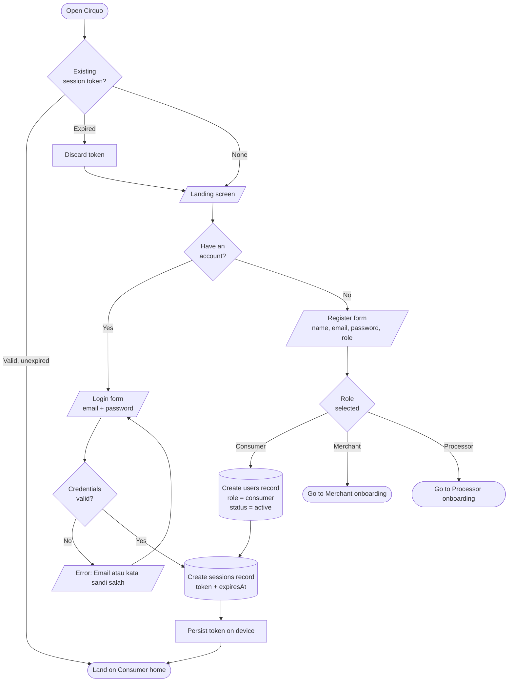

**Notes on this flow**

| Step | Rule |
|---|---|
| Role selection | Only Consumer, Merchant, and Processor appear. Admin is absent by design — AUTH-02 requires manual provisioning. |
| Password | Minimum 8 characters, validated by Zod client-side and re-validated server-side. Stored as `passwordHash`. |
| Duplicate email | Rejected with a generic message. The response never reveals which accounts exist. |
| Session persistence | Must survive a Capacitor app kill and relaunch. Verified on a physical Android device, not only in the browser. |
| Failed login copy | Deliberately ambiguous — never "email tidak ditemukan", which would enumerate accounts. |

---

### 4.2 Merchant onboarding — with the verification gate

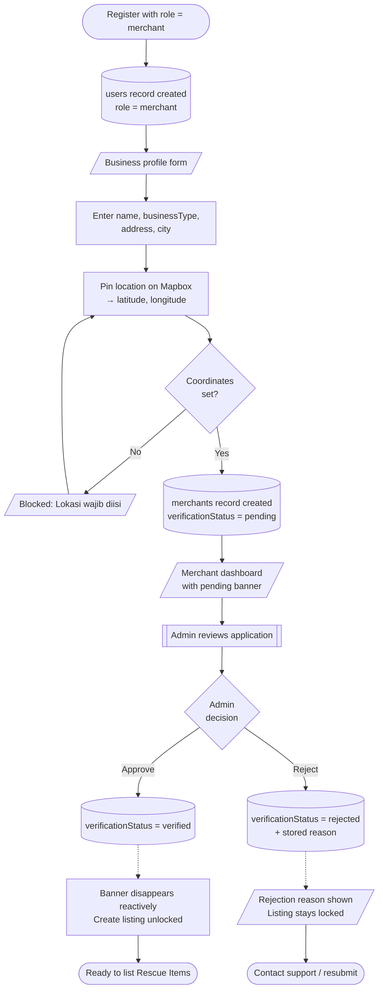

**The verification gate is a server rule, not a UI rule.** While `verificationStatus != "verified"`, the create-listing mutation rejects the call regardless of what the client sends. Hiding the button is a courtesy to honest users; the rejection is what protects the platform. See [../security/PERMISSIONS.md](../security/PERMISSIONS.md).

Coordinates are mandatory because Consumer discovery is spatial. A merchant without a pinned location cannot appear on the map and therefore cannot participate.

If a verified Merchant later changes their address, `verificationStatus` returns to `pending`. The verified thing is the physical location, so changing it invalidates the verification.

---

### 4.3 Processor onboarding — capability declaration

The Processor onboarding carries more weight than the Merchant's, because the values entered here become the **eligibility contract** the routing engine evaluates on every batch.

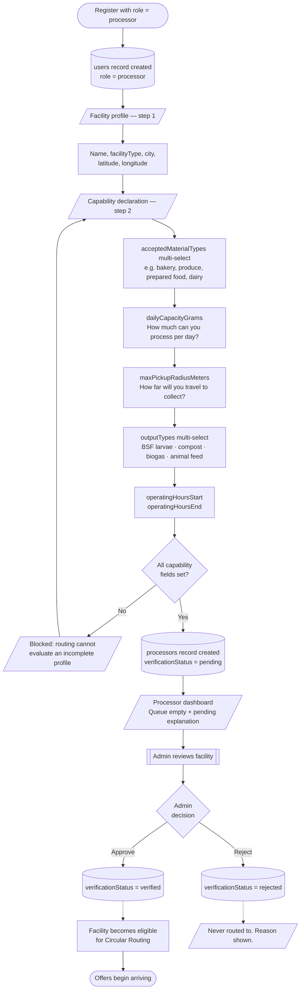

**Why capability declaration is a separate step**

| Field | Routing consequence if wrong |
|---|---|
| `acceptedMaterialTypes` | Material the facility cannot handle would be physically delivered. This is the one rule an Admin may never override. |
| `dailyCapacityGrams` | Overcommitment leads to accepted material sitting unprocessed and becoming genuine waste. |
| `maxPickupRadiusMeters` | Too large and collection runs become uneconomic; too small and the facility receives no offers. |
| `operatingHoursStart` / `operatingHoursEnd` | Routing checks whether the facility opens within 24 hours. A facility closed for the weekend is skipped, not offered and stalled. |

An unverified processor is **invisible to the routing engine**, not merely blocked in the UI. The eligibility query filters on `verificationStatus == "verified"` before any other predicate is evaluated.

---

### 4.4 Admin onboarding

There is no Admin onboarding flow, and that absence is deliberate.

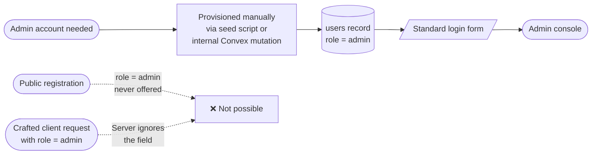

Per AUTH-02, Admin accounts are provisioned manually. The registration mutation never reads a client-supplied `role` value into an admin assignment. Mass assignment of `role` is the highest-severity privilege escalation risk in the system and is addressed directly in [ROLES.md](ROLES.md).

---

## 5. Consumer rescue journey

This is the journey a judge will watch during the demo. It runs from a cold app open to a confirmed collection with the impact panel updating.

### 5.1 End-to-end flow

```mermaid
flowchart TD
    A([Open Cirquo app]) --> B{Session<br/>valid?}
    B -->|No| C[/Login or register/]
    C --> B
    B -->|Yes| D[Consumer home]
    D --> E{Location<br/>permission}
    E -->|Prompt shown| F{User<br/>choice}
    F -->|Grant| G[Get device coordinates]
    F -->|Deny| H[Fallback: Semarang city centre<br/>Non-blocking banner shown]
    E -->|Already granted| G
    G --> I[/Explore screen/]
    H --> I

    I --> J{View<br/>mode}
    J -->|Map| K[Mapbox pins for active<br/>Rescue Items in bounds]
    J -->|List| L[Cards sorted by distance,<br/>or by soonest window if no fix]

    K --> M[/Filter sheet/]
    L --> M
    M --> N[Dietary preference tags<br/>+ max distance<br/>+ max price<br/>+ collectable now]
    N --> O{Results<br/>found?}
    O -->|No| P[/Empty state:<br/>Belum ada Rescue Item<br/>+ Reset filter action/]
    P --> M
    O -->|Yes| Q[Select an item]

    Q --> R[/Rescue Item detail/]
    R --> S[Merchant · address · distance<br/>currentPrice vs originalPrice<br/>remainingQuantity · weight/item<br/>dietaryTags · pickup window WIB]
    S --> T{Can<br/>reserve?}
    T -->|remainingQuantity = 0| U[/Disabled: Habis/]
    T -->|Window passed| V[/Disabled: Kedaluwarsa/]
    T -->|Yes| W[Choose quantity → Reserve]

    W ==> X[(Order: reserved<br/>remainingQuantity decremented<br/>paymentHoldExpiresAt = now + 15 min<br/>Ledger: RESERVED)]
    X ==> Y[/Checkout screen<br/>with live countdown/]
    Y --> Z{Pay before<br/>countdown ends?}
    Z -->|Cancel| AA[(Order: cancelled<br/>Quantity returned<br/>Ledger: CANCELLED)]
    Z -->|Timeout| AB[[Payment-hold timer]]
    AB --> AC[(Order: expired<br/>Quantity returned<br/>Ledger: CANCELLED, 0 g)]
    Z ==>|Midtrans QRIS| AD{Settlement}
    AD -->|Failed / denied| AE[/Retry while time remains/]
    AE --> Y
    AD ==>|Settled| AF[(Order: paid<br/>pickupCode revealed to owner<br/>Ledger: PAID)]

    AF ==> AG[/Order detail<br/>Pickup code shown large<br/>+ address + window/]
    AG ==> AH[Consumer travels to merchant]
    AH ==> AI[Present pickup code]
    AI ==> AJ{Merchant verifies:<br/>code matches AND<br/>inside window?}
    AJ -->|Code mismatch| AK[/Rejected — order unchanged/]
    AJ -->|Outside window| AL[/Rejected — Admin override required/]
    AJ ==>|Valid| AM[(Order: picked_up<br/>rescuedWeightGrams written<br/>Ledger: RESCUED ✔ terminal)]
    AM ==> AN[/Consumer screen updates reactively:<br/>Sudah diambil/]
    AN ==> AO([Personal impact panel updated<br/>from ledger])

    AL -.-> AP[[Admin override path]]
    AP -.-> AM
    AJ -.->|Consumer never arrives| AQ[Merchant reports no-show]
    AQ -.-> AR([Material re-enters Circular Routing<br/>NO residual created])
```

### 5.2 Sequence — reservation and payment leg

The 15-minute hold is where correctness matters most. Quantity is decremented at **reservation**, not at payment, which prevents overselling but creates held-unpaid stock that must be swept back.

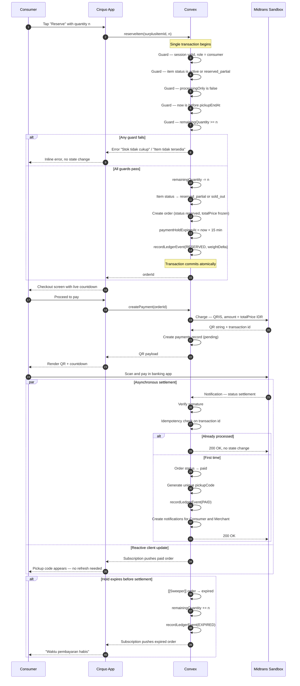

**Critical properties of this sequence**

| Property | Why it matters |
|---|---|
| Reservation is one transaction | The quantity decrement, order creation, and ledger write either all happen or none do. There is no window in which stock is deducted without an order. |
| `totalPrice` frozen at reservation | The Dynamic Rescue Pricing tick may lower `currentPrice` afterwards. The Consumer pays what they agreed to. |
| Settlement is idempotent | Midtrans Sandbox retries notifications. Without an idempotency check on the transaction id, a retry would produce two `PAID` ledger events and corrupt every impact figure downstream. |
| Signature verification precedes everything | An unverified callback is discarded before it can touch state. |
| Sweeper and settlement can race | Both are guarded on current order status, so whichever commits first wins and the other becomes a no-op. |

### 5.3 Order status as the Consumer perceives it

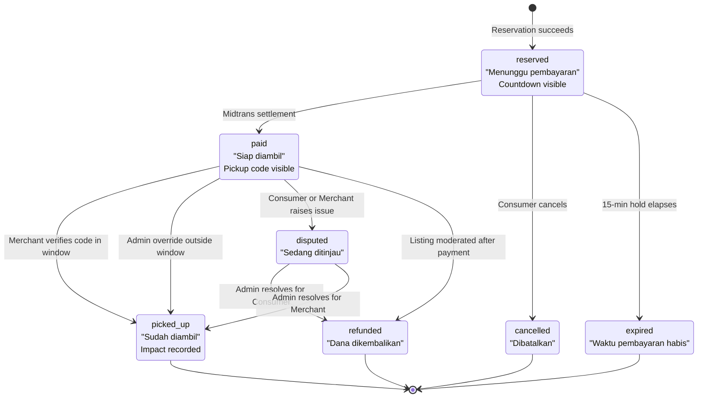

**What the Consumer never sees.** A `paid` order where the Consumer never arrives does not transition on the Consumer's screen through any action they take. The Merchant reports the no-show, and the material re-enters Circular Routing. The Consumer's order remains recorded, but no `RESCUED` event is written and no rescued weight is credited to their impact panel — because no food was actually collected.

---

## 6. Merchant listing and fulfilment journey

### 6.1 Listing creation with the pricing moment

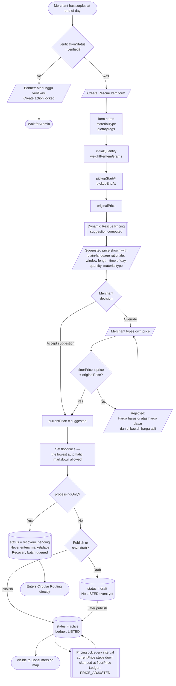

**The pricing moment matters for the pitch.** The suggestion is deterministic and rule-based — it reads the pickup window length, elapsed time, remaining quantity, and material type, and produces a discount with a sentence explaining why. It is **Dynamic Rescue Pricing**, and it must never be described as AI pricing. The formula lives in [../impact/ALGORITHM.md](../impact/ALGORITHM.md).

The `floorPrice` is the Merchant's contract with the platform. Automatic markdowns clamp at it. Nothing overrides it — not the pricing tick, not an Admin.

### 6.2 Fulfilment and pickup verification

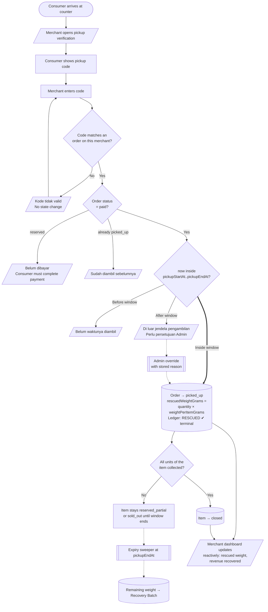

### 6.3 Merchant no-show handling

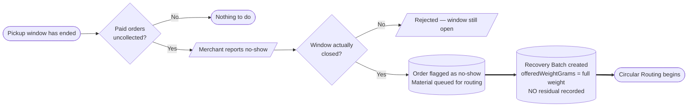

**The rule people get wrong.** A Consumer no-show does **not** create residual. Residual is material that a processor received, measured, and could not convert. A no-show is material that has not been processed at all — it re-enters Circular Routing at full offered weight. Recording it as residual would understate the circularity rate and misrepresent what physically happened.

---

## 7. Circular routing journey — the demo's wow moment

This is the sequence that separates Cirquo from a discount food app. When the marketplace fails to move the food, the platform does not shrug — it finds a facility that can turn it into something useful.

### 7.1 Routing sequence

```mermaid
sequenceDiagram
    autonumber
    participant S as Scheduler
    participant X as Convex
    participant P1 as Processor A
    participant P2 as Processor B
    participant AD as Admin

    Note over S: Expiry sweep — runs on a cron
    S->>X: sweepExpiredItems()
    X->>X: Find items past pickupEndAt with remainingQuantity > 0
    X->>X: Item status → recovery_pending
    X->>X: recordLedgerEvent(EXPIRED)
    X->>X: offeredWeightGrams = remainingQuantity × weightPerItemGrams
    X->>X: Create recoveryBatch (status pending, routingAttempts 0)

    Note over S,X: Circular Routing engine
    S->>X: runCircularRouting()
    X->>X: Load pending batches

    loop For each pending batch
        X->>X: Filter — verificationStatus = verified
        X->>X: Filter — materialType ∈ acceptedMaterialTypes
        X->>X: Filter — distance ≤ maxPickupRadiusMeters
        X->>X: Filter — capacity headroom today > offeredWeightGrams
        X->>X: Filter — id ∉ declinedByProcessorIds
        X->>X: Filter — opens within next 24h
        X->>X: Rank survivors (proximity, headroom, output value)

        alt No eligible processor
            X->>X: status → unroutable
            X->>X: recordLedgerEvent(ROUTING_FAILED) ✔ terminal
            X->>AD: Notification — manual re-route needed
        else Eligible processor found
            X->>X: processorId = top ranked
            X->>X: routingAttempts++
            X->>X: offerExpiresAt = now + 6h
            X->>X: status → offered
            X->>X: recordLedgerEvent(ROUTED)
            X->>P1: Notification — new offer, weight, TTL
        end
    end

    Note over P1: Attempt 1 — Processor A declines
    P1->>X: declineOffer(batchId, reason)
    X->>X: Guard — offer belongs to P1 and TTL not passed
    X->>X: declinedByProcessorIds += P1
    X->>X: recordLedgerEvent(INTAKE_DECLINED)
    X->>X: status → pending (attempt 1 of 3 used)

    Note over S: Attempt 2 — Processor B, no response
    S->>X: runCircularRouting()
    X->>P2: Offer routed (attempt 2)
    Note over P2: 6 hours pass with no response
    S->>X: sweepExpiredOffers()
    X->>X: offerExpiresAt passed
    X->>X: declinedByProcessorIds += P2
    X->>X: status → pending (attempt 2 of 3 used)
    X->>P2: Notification — offer closed

    Note over S: Attempt 3 — Processor A eligible again? No, declined
    S->>X: runCircularRouting()
    alt Third eligible processor exists
        X->>P1: (a different facility) Offer routed (attempt 3)
        P1->>X: acceptOffer(batchId)
        X->>X: Guard — TTL not passed, assigned to caller
        X->>X: status → accepted
        X->>X: recordLedgerEvent(INTAKE_ACCEPTED)
        X->>X: Notify merchant with facility details

        Note over P1: Physical collection, then weighing
        P1->>X: logIntake(batchId, acceptedWeightGrams)
        X->>X: Guard — caller is the assigned processor
        X->>X: Guard — positive integer grams
        X->>X: status → collected
        X->>X: acceptedWeightGrams stored as authoritative
        X->>X: Variance vs offeredWeightGrams noted in metadata

        Note over P1: Processing completes
        P1->>X: logOutcome(batchId, outputType, outputWeightGrams, residualWeightGrams)
        X->>X: Guard — residualWeightGrams ≤ acceptedWeightGrams
        X->>X: status → processed
        X->>X: recordLedgerEvent(PROCESSED) ✔ terminal
        X-->>P1: Dashboard updates reactively
        X-->>AD: Platform circularity rate recalculated
    else Attempts exhausted
        X->>X: status → unroutable
        X->>X: recordLedgerEvent(ROUTING_FAILED) ✔ terminal
        X->>AD: Notification — manual re-route needed
        AD->>X: manualReroute(batchId, processorId, overrideReason)
        X->>X: status → offered, fresh 6h TTL
        X->>X: recordLedgerEvent(ROUTED, adminOverride = true)
    end
```

### 7.2 Eligibility rules — the complete contract

| # | Rule | Field(s) evaluated | Admin may override? |
|---|---|---|---|
| 1 | Processor is verified | `processors.verificationStatus == "verified"` | ❌ Never |
| 2 | Material type is accepted | `batch.materialType ∈ processors.acceptedMaterialTypes` | ❌ Never — physical safety |
| 3 | Merchant is within collection radius | `distance(merchant, processor) ≤ maxPickupRadiusMeters` | ✅ With stored reason |
| 4 | Capacity headroom exists today | `acceptedToday + offeredWeightGrams ≤ dailyCapacityGrams` | ✅ With stored reason |
| 5 | Processor has not already declined | `processorId ∉ batch.declinedByProcessorIds` | ⚠️ Only by explicit re-offer |
| 6 | Facility opens within 24 hours | `operatingHoursStart` / `operatingHoursEnd` | ✅ With stored reason |

**Limits.** Maximum **3 routing attempts** per batch. Offer TTL is **6 hours**. On the third exhausted attempt the batch becomes `unroutable` and `ROUTING_FAILED` is written — a terminal event that Admin manual re-route can supersede with a fresh `ROUTED` event.

Rule 2 is the one an Admin may never override. Sending dairy to a facility that only handles produce is not a routing inefficiency; it is a physical process failure at the receiving end.

### 7.3 Batch state diagram

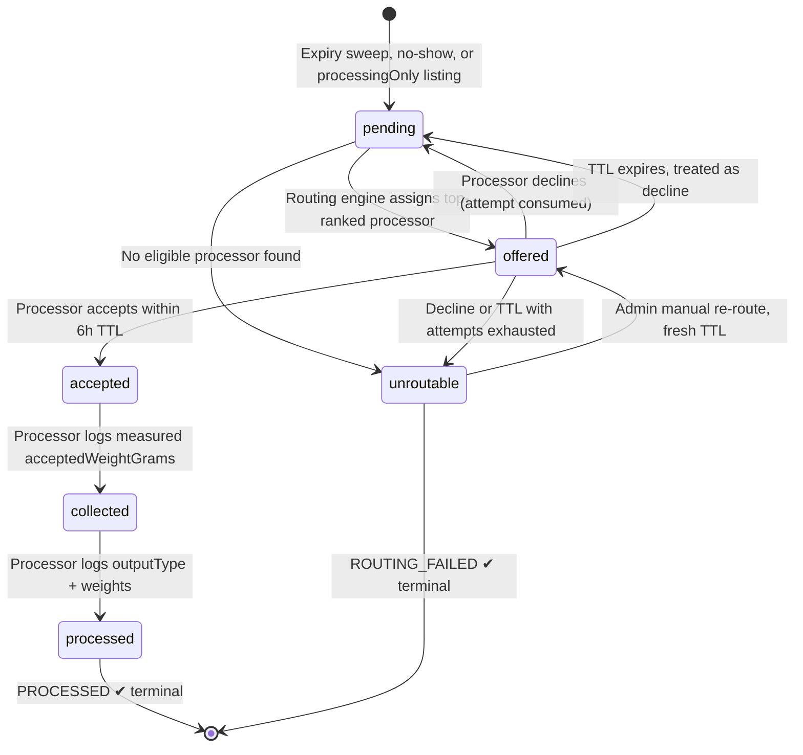

---

## 8. Processor intake journey

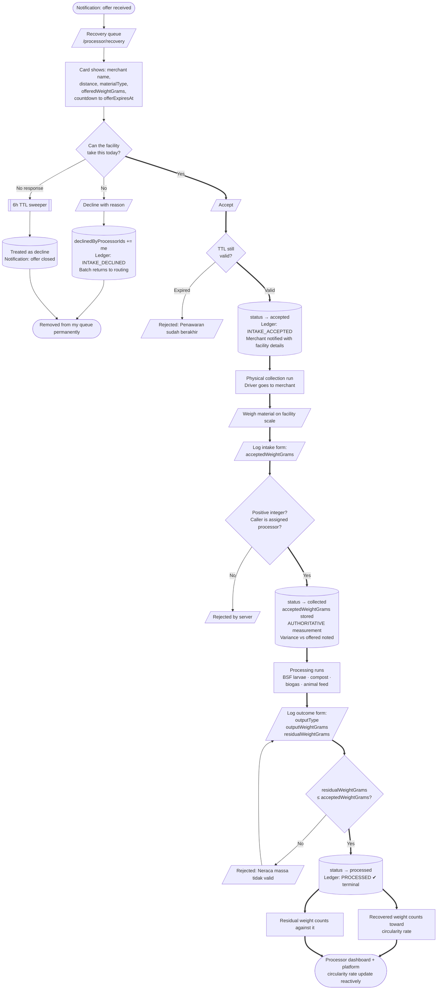

**Measurement authority.** `acceptedWeightGrams` is written only by the assigned Processor. Not the Merchant, not an Admin, not an estimate carried over from `offeredWeightGrams`. The offered weight is derived arithmetic — `remainingQuantity × weightPerItemGrams`. The accepted weight comes off a physical scale. When they disagree, the scale wins and the variance is recorded in ledger metadata rather than hidden.

**Residual honesty.** A processor reporting zero residual on every batch is a data-quality warning, not a success story. Real conversion processes have losses: moisture, contamination, packaging, inedible fractions. Realistic circularity for this platform lands between **85% and 95%**. The demo dataset targets **93%**. The system must never display 100%, and no copy anywhere may claim zero waste or a fully closed loop.

---

## 9. Admin journeys

### 9.1 Verification queue

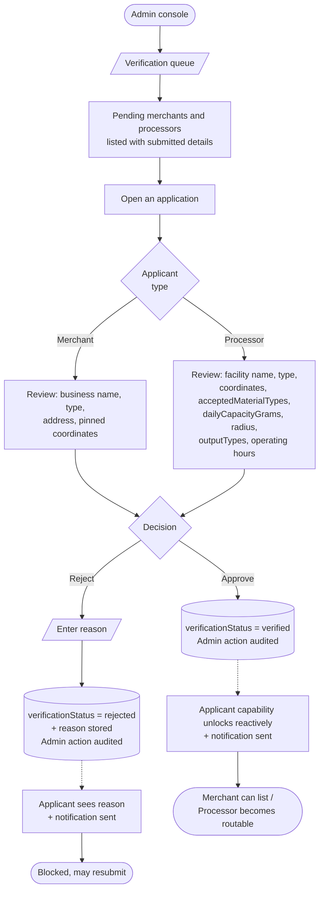

### 9.2 Moderation

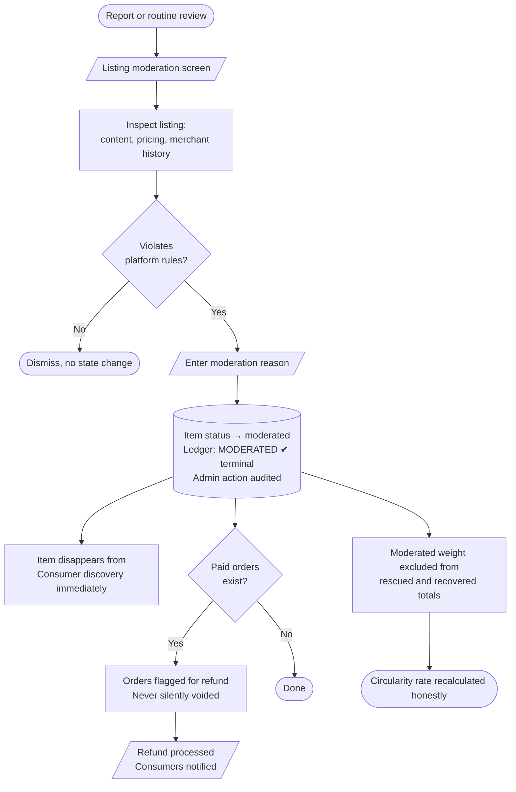

`MODERATED` is terminal. Once written, no actor may transition that item further. A moderated item's weight is excluded from impact totals entirely — it is neither rescued, recovered, nor residual, because the platform can make no verified claim about what happened to it.

### 9.3 Dispute resolution

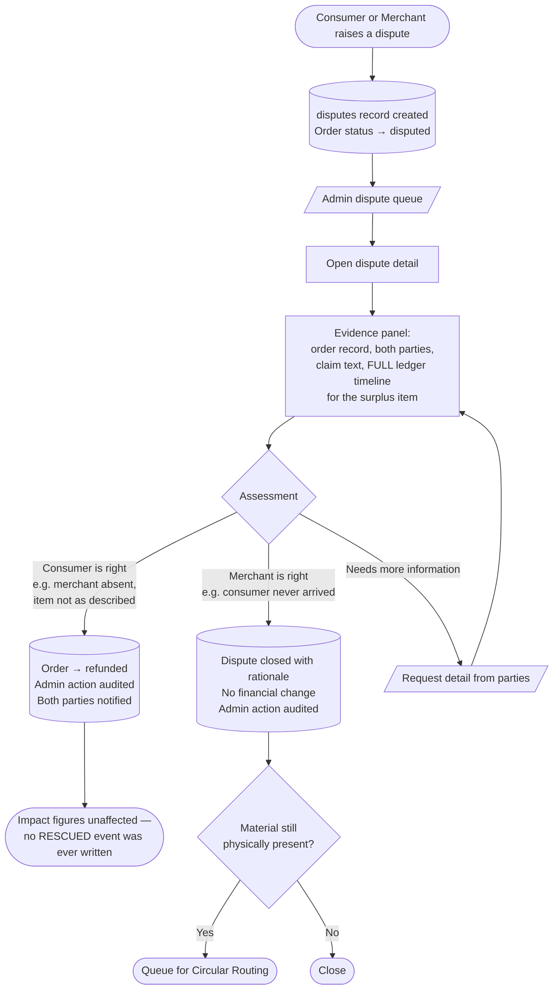

The ledger timeline is the evidence. Because every state change wrote an immutable event with an actor and a timestamp, an Admin resolving a dispute is reading a factual sequence rather than adjudicating two conflicting stories.

### 9.4 Ledger audit

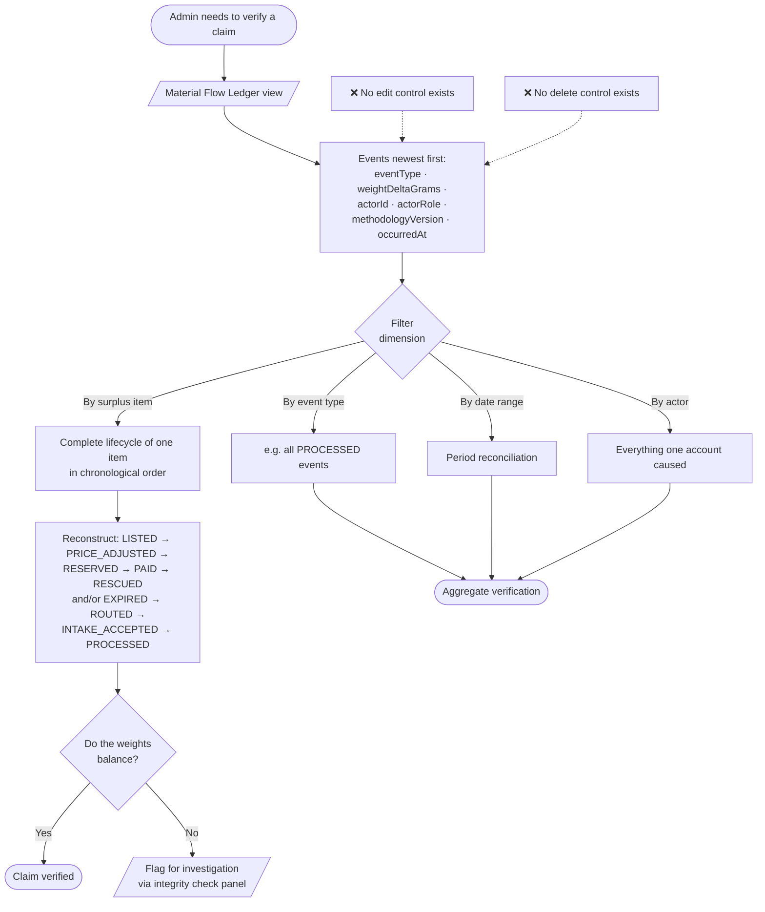

The ledger view has no edit and no delete affordance because the ledger is **append-only**. Nothing writes to it directly either — every entry arrives through `recordLedgerEvent(ctx, {...})` called inside the same transaction as the state change that caused it.

### 9.5 Manual re-route

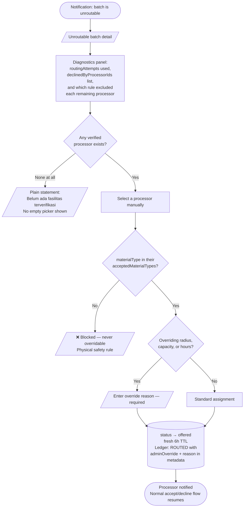

---

## 10. Notification triggers

All notifications are in-app for the MVP. Copy is Bahasa Indonesia because the UI is primarily Bahasa Indonesia.

| # | Trigger event | Recipient | Channel | Copy (Bahasa Indonesia) |
|---|---|---|---|---|
| 1 | Reservation created | Consumer | In-app | "Reservasi berhasil. Selesaikan pembayaran dalam 15 menit." |
| 2 | 5 minutes left on payment hold | Consumer | In-app | "Sisa 5 menit untuk menyelesaikan pembayaran pesananmu." |
| 3 | Payment settled | Consumer | In-app | "Pembayaran berhasil. Kode pengambilanmu sudah siap." |
| 4 | Payment settled | Merchant | In-app | "Pesanan baru dibayar: {item} × {qty}. Siapkan untuk diambil." |
| 5 | Payment hold expired | Consumer | In-app | "Waktu pembayaran habis. Reservasi dibatalkan dan stok dikembalikan." |
| 6 | Pickup window opens in 1 hour | Consumer | In-app | "Jendela pengambilan {item} dibuka satu jam lagi." |
| 7 | Pickup window closes in 30 minutes | Consumer | In-app | "Segera ambil {item}. Jendela pengambilan tutup dalam 30 menit." |
| 8 | Pickup window closes in 30 minutes with uncollected paid orders | Merchant | In-app | "{n} pesanan belum diambil. Jendela pengambilan tutup 30 menit lagi." |
| 9 | Pickup confirmed | Consumer | In-app | "Pengambilan dikonfirmasi. Kamu menyelamatkan {weight} makanan." |
| 10 | Verification approved | Merchant / Processor | In-app | "Akunmu sudah terverifikasi. Kamu bisa mulai sekarang." |
| 11 | Verification rejected | Merchant / Processor | In-app | "Verifikasi ditolak: {reason}." |
| 12 | Item expired unsold, routing started | Merchant | In-app | "{item} tidak terjual. Material dialihkan ke Circular Routing." |
| 13 | Recovery offer routed | Processor | In-app | "Penawaran baru: {weight} {materialType} dari {merchant}. Berlaku 6 jam." |
| 14 | Offer TTL 1 hour remaining | Processor | In-app | "Sisa 1 jam untuk menanggapi penawaran dari {merchant}." |
| 15 | Offer expired unanswered | Processor | In-app | "Penawaran dari {merchant} sudah berakhir." |
| 16 | Offer accepted | Merchant | In-app | "{processor} akan mengambil material dari {item}." |
| 17 | Batch became unroutable | Admin | In-app | "Batch {id} tidak dapat dirutekan. Perlu penugasan manual." |
| 18 | Batch became unroutable | Merchant | In-app | "Material dari {item} belum menemukan fasilitas. Admin sedang menangani." |
| 19 | Intake logged | Merchant | In-app | "{processor} menerima {weight} dari {item}." |
| 20 | Outcome logged | Merchant | In-app | "Material dari {item} diproses menjadi {outputType}." |
| 21 | Listing moderated | Merchant | In-app | "Listing {item} dihentikan: {reason}." |
| 22 | Dispute opened | Counterparty | In-app | "Ada sengketa pada pesanan {id}. Admin sedang meninjau." |
| 23 | Dispute resolved | Both parties | In-app | "Sengketa pesanan {id} telah diselesaikan." |
| 24 | Refund issued | Consumer | In-app | "Dana pesanan {id} telah dikembalikan." |
| 25 | Account suspended | Affected user | In-app | "Akunmu ditangguhkan. Hubungi dukungan." |

Push notifications through Capacitor are out of scope for the MVP. The `notifications` table is designed so that adding a push channel later requires no schema change — only a delivery adapter.

---

## 11. Error and failure flows

Failure paths are where a demo dies. Each of these is specified so the app degrades visibly and honestly rather than freezing.

### 11.1 Payment failed or denied

```mermaid
flowchart LR
    A([Midtrans returns deny/failure]) --> B{Time remains<br/>in 15-min hold?}
    B -->|Yes| C[/Pembayaran gagal. Coba lagi./<br/>Order stays reserved<br/>Quantity stays held]
    C --> D[Consumer retries]
    D --> E([New charge attempt])
    B -->|No| F[[Payment-hold timer runs]]
    F --> G[(Order → expired<br/>Quantity returned<br/>Ledger: CANCELLED, 0 g)]
    G --> H([Item returns to active<br/>if window still open])
```

The order never transitions to a failure state of its own. A failed payment leaves the order `reserved` so the Consumer can retry within the remaining hold. Only the sweeper ends it.

### 11.2 Geolocation denied

```mermaid
flowchart LR
    A([Explore screen opens]) --> B{Permission<br/>state}
    B -->|Denied| C[Map centres on<br/>Semarang city centre]
    C --> D[/Non-blocking banner:<br/>Lokasi tidak aktif.<br/>Menampilkan seluruh Semarang./]
    D --> E[Distance filter disabled<br/>with explanatory label]
    E --> F[List sorts by<br/>soonest pickupEndAt]
    F --> G[❌ No distance labels shown —<br/>never fabricate a number]
    G --> H([Fully usable, just less personalised])
```

The screen is never blocked by a denied permission. A Consumer who refuses location access still gets a working city-wide marketplace.

### 11.3 No eligible processor

```mermaid
flowchart LR
    A([Routing engine evaluates batch]) --> B{Eligible set<br/>empty?}
    B -->|Yes, attempt 1| C[(status → unroutable<br/>Ledger: ROUTING_FAILED)]
    C --> D[Admin notified with<br/>full exclusion diagnostics]
    D --> E[/Merchant told material is<br/>awaiting manual assignment/]
    E --> F[[Admin manual re-route]]
    F --> G([Fresh offer, fresh 6h TTL])
    B -->|No| H([Normal offer path])
```

`ROUTING_FAILED` is terminal but not final — Admin manual re-route writes a new `ROUTED` event that supersedes it. The failure remains in the ledger permanently because the platform counts its misses as well as its wins.

### 11.4 Merchant no-show

```mermaid
flowchart LR
    A([Consumer arrives, merchant closed<br/>or item unavailable]) --> B[/Consumer raises a dispute/]
    B --> C[(Order → disputed)]
    C --> D[[Admin reviews ledger timeline]]
    D --> E{Merchant<br/>at fault?}
    E -->|Yes| F[(Order → refunded<br/>Consumer notified)]
    E -->|Unclear| G[/Request evidence from both/]
    G --> D
    F --> H([No RESCUED event written —<br/>impact figures unaffected])
    F --> I[Repeat incidents feed<br/>merchant standing review]
```

### 11.5 Consumer no-show

```mermaid
flowchart LR
    A([Pickup window ends,<br/>paid order uncollected]) --> B[/Merchant reports no-show/]
    B --> C[(Material queued for routing<br/>at FULL offered weight)]
    C --> D[❌ NO residual created]
    D --> E([Circular Routing begins])
    E --> F([Material still counts as<br/>recovered if processed])
```

This is the flow that most demonstrates the platform's premise. A consumer failing to show up does not produce waste in Cirquo — it produces a routing event.

### 11.6 Offer TTL expiry

```mermaid
flowchart LR
    A([6 hours pass with no response]) --> B[[TTL sweeper runs]]
    B --> C{Processor accepted<br/>just before expiry?}
    C -->|Yes| D([No-op — accepted batch untouched])
    C -->|No| E[(declinedByProcessorIds += processor<br/>status → pending)]
    E --> F{routingAttempts<br/>&lt; 3?}
    F -->|Yes| G([Re-enter routing engine])
    F -->|No| H[(status → unroutable<br/>Ledger: ROUTING_FAILED)]
    H --> I([Admin notified])
```

Silence is treated as a decline. For perishable material it is the only interpretation that keeps the batch moving.

---

## 12. Empty states

An empty screen with no explanation reads as a bug. Every list surface has a defined empty state.

| Screen | Condition | Empty state content | Primary action |
|---|---|---|---|
| `/explore` map | No active items in view | "Belum ada Rescue Item di area ini." | Zoom out / reset filter |
| `/explore` list | Filters exclude everything | "Tidak ada yang cocok dengan filtermu." | Reset filter |
| `/explore` list | No items anywhere | "Belum ada Rescue Item hari ini. Coba lagi nanti." | — |
| `/orders` | No orders ever | "Kamu belum menyelamatkan makanan apa pun." | Jelajahi Rescue Item |
| `/orders` active tab | Only past orders | "Tidak ada pesanan aktif." | Jelajahi Rescue Item |
| Consumer impact panel | No `RESCUED` events | Zero values with encouraging copy — never a blank card | Jelajahi Rescue Item |
| Notification centre | No notifications | "Belum ada notifikasi." | — |
| `/merchant/surplus` | No listings | "Belum ada listing. Mulai selamatkan surplus hari ini." | Buat Rescue Item |
| `/merchant/surplus` filtered | Filter excludes all | "Tidak ada listing dengan status ini." | Reset filter |
| `/merchant` dashboard | Not yet verified | Verification banner replaces metrics, not an empty grid | — |
| `/merchant` dashboard | Verified, no activity | Zero-value cards with explanatory subtext | Buat Rescue Item |
| `/processor/recovery` | Not yet verified | "Akunmu menunggu verifikasi. Penawaran akan muncul setelah disetujui." | — |
| `/processor/recovery` | Verified, no offers | "Belum ada penawaran. Kami akan memberi tahu saat ada material yang cocok." | — |
| `/processor` dashboard | No processed batches | Zero-value cards, capacity utilisation shown as 0% | — |
| Admin verification queue | Nothing pending | "Tidak ada permohonan menunggu." | — |
| Admin ledger view | Filter matches nothing | "Tidak ada event yang cocok dengan filter." | Reset filter |
| Admin ledger view | No events at all | "Ledger masih kosong. Event akan muncul saat aktivitas dimulai." | — |
| Admin disputes | No open disputes | "Tidak ada sengketa terbuka." | — |
| Admin manual re-route | No verified processors exist | "Belum ada fasilitas terverifikasi." — no empty picker rendered | Buka antrean verifikasi |
| Admin health panel | No anomalies | "Tidak ada anomali terdeteksi." — stated explicitly, not blank | — |

---

## 13. Screen inventory

Reconciliation of what exists today against what the flows above require.

### 13.1 Consumer surface

| Route | Purpose | Key components | Status |
|---|---|---|---|
| `/` | Consumer home — nearby highlights, personal impact summary | ConsumerLayout, SummaryCard, item cards | 🚧 Exists with mock data |
| `/explore` | Map and list discovery with filters | Mapbox map, filter Sheet, item cards, toggle | ✅ Source-backed; mobile UAT pending |
| `/orders` | Active and past orders, live countdowns | Order cards, Tabs, countdown | ✅ Source-backed; payment/expiry UAT pending |
| `/login` | Email + password sign in | Form, Input, Button | ✅ Source-backed |
| `/register` | Registration with role selection | Form, Select, Input | ✅ Source-backed |
| `/item/:id` | Rescue Item detail and reserve action | Detail panel, quantity picker, Button | ✅ Source-backed; UAT pending |
| `/checkout/:orderId` | Midtrans QRIS payment with hold countdown | Midtrans handoff, countdown, Alert | 🧪 Source-backed; verified Sandbox UAT pending |
| `/orders/:orderId` | Owned order detail, manual pickup code, completion summary | Code panel, status Badge, map link | 🧪 Source-backed; paid/picked-up UAT pending |
| `/impact` | Personal impact detail derived from ledger | SummaryCard, ledger-derived charts | 📋 Planned |
| `/notifications` | Notification centre | List, unread Badge | 📋 Planned |
| `/profile` | Account settings, logout | Form, Button | 📋 Planned |

### 13.2 Merchant surface

| Route | Purpose | Key components | Status |
|---|---|---|---|
| `/merchant` | Dashboard — listings, pickups today, impact | RoleShell, PageHeader, SummaryCard | 🚧 Exists with mock data |
| `/merchant/surplus` | Listing management table with status filter | RoleShell, Table, Badge, Select | ✅ Source-backed; UAT pending |
| `/merchant/surplus/new` | Create Rescue Item with pricing suggestion | Form, Zod schema, price suggestion panel | ✅ Source-backed; UAT pending |
| `/merchant/surplus/:id` | Rescue Item detail | Detail, read-only state, Alert | ✅ Source-backed; edit remains M2 query/mutation scope |
| `/merchant/onboarding` | Business profile with map pin | Form, Mapbox picker | ✅ Source-backed; verification remains operational UAT |
| `/merchant/pickup` | Pickup code verification console | Code input, order list, Button | 🚧 Route exists; M4 confirmation is not implemented |
| `/merchant/recovery` | Read-only view of routing state for own items | Batch cards, status Badge | 📋 Planned |
| `/merchant/profile` | Business profile management | Form, Mapbox picker | 📋 Planned |

### 13.3 Processor surface

| Route | Purpose | Key components | Status |
|---|---|---|---|
| `/processor` | Dashboard — throughput, outputs, capacity utilisation | RoleShell, PageHeader, SummaryCard | 🚧 Exists with mock data |
| `/processor/recovery` | Offer queue with accept and decline | RoleShell, Table, countdown, Button | 🚧 Exists with mock data |
| `/processor/onboarding` | Facility profile and capability declaration | Form, multi-select, Mapbox picker | 📋 Planned |
| `/processor/recovery/:batchId` | Batch detail, intake logging, outcome logging | Form, Input, mass-balance validation | 📋 Planned |
| `/processor/profile` | Capability and capacity management | Form, multi-select | 📋 Planned |

### 13.4 Admin surface

| Route | Purpose | Key components | Status |
|---|---|---|---|
| `/admin` | Platform dashboard with circularity rate | RoleShell, PageHeader, SummaryCard | 🚧 Exists with mock data |
| `/admin/verification` | Merchant and processor verification queue | Table, Dialog, Button | 📋 Planned |
| `/admin/moderation` | Listing moderation | Table, Dialog, Textarea | 📋 Planned |
| `/admin/ledger` | Material Flow Ledger inspection with filters | Table, filters, pagination — no edit controls | 📋 Planned |
| `/admin/disputes` | Dispute queue and resolution | Table, Dialog, ledger timeline panel | 📋 Planned |
| `/admin/routing` | Unroutable batches and manual re-route | Table, diagnostics panel, Select, Dialog | 📋 Planned |
| `/admin/users` | Account management, suspend and reactivate | Table, search, Dialog | 📋 Planned |
| `/admin/health` | Scheduler status and integrity anomalies | Table, Badge | 📋 Planned |

### 13.5 Shared

| Route | Purpose | Key components | Status |
|---|---|---|---|
| `*` | Not-found fallback | Card, Button | ✅ Exists |

**Summary.** Consumer discovery, reservation, checkout, and orders plus Merchant
Rescue Item management are source-backed. Some Home, impact, Processor, and
Admin surfaces still use `src/constants/mock-data.ts` or lack the required
Convex function. Use [IMPLEMENTATION_STATUS.md](../project/IMPLEMENTATION_STATUS.md)
instead of a placeholder count when planning the remaining work.

---

## 14. Demo walkthrough

Target runtime **3–7 minutes**. Rehearsed against seeded data so every number is real and traceable to a ledger event.

### 14.1 Sequence

| # | Time | Actor | Action on screen | What the narrator says |
|---|---|---|---|---|
| 1 | 0:00–0:30 | — | Open on the Admin platform dashboard showing today's circularity rate | "Every figure on this screen comes from an immutable ledger. Nothing here is decorative. Let me show you how a single kilogram gets there." |
| 2 | 0:30–1:15 | Merchant | Log in, open create form, enter a bakery surplus item: 8 units, 250 g each, window 17:00–20:00 WIB | "A bakery in Semarang has eight loaves left. They enter the quantity and the weight per item — because weight is what we actually track." |
| 3 | 1:15–1:45 | Merchant | Enter original price; the Dynamic Rescue Pricing suggestion appears with its rationale; accept it; publish | "The platform suggests a rescue price and explains why — the window is short and the day is ending. The merchant can override it, but never below their floor price." |
| 4 | 1:45–2:15 | Consumer | Switch to the Consumer app, explore screen, map pin appears, apply a dietary preference filter, open the detail | "The listing is live on the map instantly — this is a Convex subscription, not a refresh. A consumer filters by dietary preference and finds it." |
| 5 | 2:15–2:50 | Consumer | Reserve 5 units; countdown starts; note the map now shows 3 remaining | "Reserving decrements the quantity immediately, not at payment. That is how we prevent overselling. The consumer now has fifteen minutes to pay." |
| 6 | 2:50–3:20 | Consumer | Pay with Midtrans Sandbox QRIS; order flips to paid; pickup code appears | "Payment settles and the server-generated pickup code is revealed to its owner. There is no delivery here — the Consumer collects in person." |
| 7 | 3:20–3:50 | Merchant | Merchant enters the pickup code; order becomes picked_up; both screens update | "Code verified inside the pickup window. That is 1,250 grams **rescued** — a terminal ledger event." |
| 8 | 3:50–4:20 | System | Fast-forward the clock; expiry sweeper runs; 3 unsold units become a recovery batch | "The window closes with three loaves unsold. In a normal marketplace this is where the story ends. In Cirquo it is where the interesting part begins." |
| 9 | 4:20–5:00 | System | Routing engine screen shows eligibility evaluation, then an offer to a BSF larvae facility with a 6-hour countdown | "Circular Routing evaluates every verified processor: does it accept this material, is it inside the collection radius, does it have capacity today, is it open within 24 hours. The best match gets a six-hour offer." |
| 10 | 5:00–5:30 | Processor | Processor logs in, sees the offer in the queue, accepts | "The facility accepts. The merchant is notified with the facility's details. Three attempts are allowed; silence counts as a decline." |
| 11 | 5:30–6:10 | Processor | Log intake: measured 740 g on the facility scale against an offered 750 g. Then log outcome: 690 g BSF larvae, 50 g residual | "They weigh it — 740 grams, not the 750 we estimated, and we record the variance rather than hide it. It converts to 690 grams of larvae with 50 grams of residual. We do not claim zero waste." |
| 12 | 6:10–6:40 | Admin | Open the ledger, filter by this surplus item, show the full chain: LISTED → PRICE_ADJUSTED → RESERVED → PAID → RESCUED → EXPIRED → ROUTED → INTAKE_ACCEPTED → PROCESSED | "Here is the entire life of that batch of bread. Nine events, append-only, every one written in the same transaction as the state change that caused it." |
| 13 | 6:40–7:00 | Admin | Return to the platform dashboard; circularity rate reads **93%** | "1,250 grams rescued, 690 grams recovered, 50 grams residual. That is a 93% circularity rate. Not 100% — because 100% would not be true. Cirquo closes the loop and counts what it cannot close." |

### 14.2 Closing numbers

| Metric | Demo value | Source |
|---|---|---|
| Total listed weight | 2,000 g | 8 units × 250 g, `LISTED` event |
| Rescued weight | 1,250 g | 5 units collected, `RESCUED` event |
| Offered to recovery | 750 g | 3 units unsold, expiry sweep |
| Accepted weight (measured) | 740 g | Processor scale, authoritative |
| Recovered output | 690 g BSF larvae | `PROCESSED` event |
| Residual | 50 g | `PROCESSED` event |
| **Circularity rate** | **93%** | (1,250 + 690) ÷ (1,250 + 690 + 50) = 1,940 ÷ 1,990 |

### 14.3 Rehearsal rules

| Rule | Reason |
|---|---|
| Seed the database before every run | The demo must never depend on data created in a previous rehearsal |
| Use a manual settle path as a fallback for step 6 | Midtrans Sandbox callback latency is external and cannot be debugged live |
| Pre-authorise location permission on the demo device | A permission dialog at step 4 breaks the narrative rhythm |
| Never say "zero waste" or "100% closed-loop" | Both are false and a technical judge will catch them |
| Never say "AI pricing" | Dynamic Rescue Pricing is deterministic and rule-based; claiming AI invites a question we would lose |
| Never say "delivery" | Cirquo has no couriers. Consumers collect in person. |
| End on the ledger, not the dashboard | The ledger is the proof; the dashboard is the summary |

---

## 15. Related Documents

| Document | Relationship |
|---|---|
| [USER_STORIES.md](USER_STORIES.md) | Stories that implement each step in these flows |
| [FEATURES.md](FEATURES.md) | Feature breakdown the flows compose |
| [ROLES.md](ROLES.md) | Permission rules enforced at every guarded step |
| [../product/PRD.md](../product/PRD.md) | Requirement identifiers referenced throughout |
| [../domain/STATE_MACHINE.md](../domain/STATE_MACHINE.md) | Authoritative status transitions for items, orders, and batches |
| [../domain/DATA_MODEL.md](../domain/DATA_MODEL.md) | Field definitions cited in the diagrams |
| [../impact/ALGORITHM.md](../impact/ALGORITHM.md) | Dynamic Rescue Pricing formula and routing ranking |
| [../impact/MATERIAL_LEDGER.md](../impact/MATERIAL_LEDGER.md) | Ledger event semantics and terminal-event rules |
| [../architecture/SCHEDULER.md](../architecture/SCHEDULER.md) | Cron jobs behind every `[[Subroutine]]` in these diagrams |
| [../architecture/REALTIME.md](../architecture/REALTIME.md) | Convex subscription behaviour behind every `-.->` update |
| [../design/UI_GUIDE.md](../design/UI_GUIDE.md) | Screen layout and component conventions |
| [../api/API_CONSUMER.md](../api/API_CONSUMER.md) | Contracts behind the Consumer journey |
| [../api/API_MERCHANT.md](../api/API_MERCHANT.md) | Contracts behind the Merchant journey |
| [../api/API_PROCESSOR.md](../api/API_PROCESSOR.md) | Contracts behind the Processor journey |
| [../api/API_ADMIN.md](../api/API_ADMIN.md) | Contracts behind the Admin journeys |
| [../business/ROADMAP.md](../business/ROADMAP.md) | Milestones delivering each flow |

---

**Built for DSDC ANFORCOM 2026**  
**Platform:** Cirquo — Closing the Loop, Saving Every Meal
